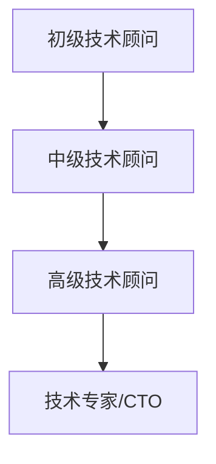

                 

# 技术顾问：高收入兼职选择

> 关键词：技术顾问、兼职选择、收入、专业发展、职业规划

> 摘要：本文将探讨技术顾问作为一种高收入兼职选择的魅力和优势，详细解析其职业路径、市场需求和实际操作步骤，为有志于此领域的技术专业人士提供实用的职业发展建议。

## 1. 背景介绍

在信息化时代，技术顾问的角色越来越受到重视。技术顾问是指在信息技术领域拥有专业知识和实践经验，能够为企业或个人提供技术解决方案、咨询服务和培训的人员。随着数字化转型的推进，技术顾问的需求持续增长，尤其是在企业信息化、系统集成、云计算、大数据和人工智能等领域。

技术顾问的兼职工作模式灵活多样，既可以在线上提供远程咨询服务，也可以参与企业项目的现场实施和指导。这种兼职模式不仅能够满足工作与生活的平衡，还能为技术专业人士带来可观的收入。

本文旨在帮助有志于从事技术顾问兼职的人员，理解这一职业的特点和优势，提供实用的职业发展建议，使其能够顺利进入技术顾问领域，实现个人价值和职业成长。

## 2. 核心概念与联系

### 2.1 技术顾问的基本职责

技术顾问的主要职责包括：

- **需求分析**：理解客户的技术需求，明确项目目标和预期成果。
- **方案设计**：根据客户需求，设计符合实际应用场景的技术解决方案。
- **项目实施**：参与项目的开发和实施，确保技术方案的顺利落地。
- **问题解决**：在项目实施过程中，解决遇到的技术问题和挑战。
- **知识转移**：向客户传授相关的技术知识和实践经验，提升客户的自主能力。

### 2.2 技术顾问的职业路径

技术顾问的职业路径通常分为以下几个阶段：

- **初级技术顾问**：主要职责是执行具体的开发任务，辅助项目经理完成项目。
- **中级技术顾问**：能够独立完成项目，具备一定的技术解决方案设计能力。
- **高级技术顾问**：具备丰富的项目经验和深厚的技术背景，能够为企业提供战略性的技术规划。
- **技术专家/CTO**：在技术领域拥有极高的专业地位，能够为企业提供全方位的技术指导和决策。

### 2.3 技术顾问与相关角色的关系

技术顾问与以下角色密切相关：

- **项目经理**：负责项目的整体规划和执行，与技术顾问密切合作，确保项目目标的实现。
- **开发人员**：执行技术顾问提供的方案，实现技术功能。
- **客户**：技术顾问的服务对象，需求分析和解决方案设计的直接依据。

### 2.4 Mermaid 流程图

下面是技术顾问职业路径的 Mermaid 流程图：



## 3. 核心算法原理 & 具体操作步骤

### 3.1 技术顾问的技能要求

要成为一名合格的技术顾问，需要具备以下技能：

- **专业知识**：熟悉所在领域的技术原理、发展趋势和行业标准。
- **沟通能力**：能够清晰、准确地表达技术观点，与客户建立有效的沟通。
- **问题解决能力**：具备分析问题和解决问题的能力，能够在项目中迅速找到解决方案。
- **项目管理能力**：具备项目管理的基本知识，能够合理规划项目进度和资源。

### 3.2 技术顾问的职业发展策略

以下是一些技术顾问的职业发展策略：

- **持续学习**：不断更新自己的知识储备，跟上技术发展的步伐。
- **积累经验**：通过参与多个项目，积累丰富的实践经验。
- **建立人脉**：拓展职业网络，与同行建立联系，寻找合作机会。
- **提升沟通能力**：通过培训和实际演练，提升沟通和表达能力。
- **获取认证**：参加专业认证考试，提升自己的职业竞争力。

### 3.3 技术顾问的市场需求分析

技术顾问的市场需求受多个因素影响，包括：

- **行业趋势**：随着数字化转型加速，技术顾问在各个行业的需求不断增加。
- **技术更新**：新技术的出现和旧技术的升级换代，为技术顾问提供了更多的就业机会。
- **企业需求**：企业对技术服务的需求日益多样化，技术顾问成为企业解决技术难题的重要力量。

## 4. 数学模型和公式 & 详细讲解 & 举例说明

### 4.1 技术顾问收入模型

技术顾问的收入可以通过以下公式计算：

\[ 收入 = 基础工资 + 项目奖金 + 奖励金 \]

其中：

- **基础工资**：根据技术顾问的职称、经验和市场需求确定。
- **项目奖金**：根据项目的完成情况和客户满意度确定。
- **奖励金**：根据技术顾问的绩效、创新和贡献确定。

### 4.2 举例说明

假设一位中级技术顾问的基本工资为每月 10,000 元，项目奖金为项目总金额的 5%，奖励金为每月基本工资的 10%。那么，他的月收入计算如下：

\[ 收入 = 10,000 + (项目总金额 \times 5\%) + (10,000 \times 10\%) \]

### 4.3 优化策略

为了提高技术顾问的收入，可以采取以下优化策略：

- **提高项目成功率**：通过提升项目管理的技能，确保项目按时、按质完成。
- **增加项目数量**：通过拓展业务范围，增加参与的项目数量。
- **提升自身价值**：通过学习新技能、获取专业认证，提升自身的市场竞争力。

## 5. 项目实战：代码实际案例和详细解释说明

### 5.1 开发环境搭建

在本案例中，我们将使用 Python 作为编程语言，使用 Flask 作为 Web 框架搭建一个简单的技术顾问咨询系统。

1. 安装 Python 3.8 或更高版本。
2. 安装 Flask 框架：`pip install Flask`。
3. 创建一个名为 `tech_advisor` 的 Python 脚本。

### 5.2 源代码详细实现和代码解读

```python
from flask import Flask, request, jsonify

app = Flask(__name__)

@app.route('/api/consult', methods=['POST'])
def consult():
    data = request.get_json()
    question = data.get('question')
    answer = "暂无解答"
    
    # 这里可以添加更复杂的问题处理逻辑
    if question == "如何提高编程效率？":
        answer = "掌握编程语言的核心特性，合理利用编程工具，养成良好的编程习惯。"
    
    return jsonify({'answer': answer})

if __name__ == '__main__':
    app.run(debug=True)
```

### 5.3 代码解读与分析

- **Flask 框架**：Flask 是一个轻量级的 Web 开发框架，用于构建 Web 应用程序。
- **路由**：`/api/consult` 是一个 POST 类型的路由，用于处理技术顾问的咨询请求。
- **请求处理**：通过 `request.get_json()` 获取 JSON 格式的请求数据，提取问题字段。
- **问题处理逻辑**：根据问题的内容，返回相应的解答。

## 6. 实际应用场景

技术顾问在实际应用中，可以服务于多种场景：

- **企业信息化咨询**：为企业提供信息化建设方案，提升企业运营效率。
- **系统集成服务**：协助企业整合内部系统，实现数据共享和业务协同。
- **技术培训**：为企业员工提供技术培训，提升团队的技术能力。
- **项目实施**：参与企业项目实施，确保项目按时、按质完成。

## 7. 工具和资源推荐

### 7.1 学习资源推荐

- **书籍**：《软件工程：实践者的研究方法》（Roger S. Pressman）。
- **论文**：Google Scholar、IEEE Xplore。
- **博客**：CSDN、知乎专栏。
- **网站**：GitHub、Stack Overflow。

### 7.2 开发工具框架推荐

- **开发工具**：Visual Studio Code、PyCharm。
- **框架**：Flask、Django。
- **数据库**：MySQL、PostgreSQL。

### 7.3 相关论文著作推荐

- **论文**：《云计算与大数据技术》（李国杰、陆建国）。
- **著作**：《人工智能：一种现代的方法》（Stuart J. Russell & Peter Norvig）。

## 8. 总结：未来发展趋势与挑战

随着数字化转型的不断深入，技术顾问在各个领域的需求将持续增长。未来，技术顾问将面临以下发展趋势和挑战：

- **技能需求多样化**：技术顾问需要不断学习新技能，以适应不断变化的市场需求。
- **在线服务普及**：在线咨询和远程服务将成为技术顾问的主要工作模式。
- **知识共享**：通过知识共享和协作，技术顾问可以提升自身价值，推动行业发展。

## 9. 附录：常见问题与解答

### 9.1 技术顾问需要具备哪些技能？

技术顾问需要具备以下技能：

- **专业知识**：熟悉所在领域的技术原理、发展趋势和行业标准。
- **沟通能力**：能够清晰、准确地表达技术观点，与客户建立有效的沟通。
- **问题解决能力**：具备分析问题和解决问题的能力，能够在项目中迅速找到解决方案。
- **项目管理能力**：具备项目管理的基本知识，能够合理规划项目进度和资源。

### 9.2 技术顾问的收入如何计算？

技术顾问的收入通常包括基础工资、项目奖金和奖励金。具体计算方式如下：

\[ 收入 = 基础工资 + 项目奖金 + 奖励金 \]

其中，基础工资、项目奖金和奖励金的具体数额根据技术顾问的职称、经验和市场需求确定。

## 10. 扩展阅读 & 参考资料

- **扩展阅读**：
  - 《技术顾问：职业指南与实战技巧》（作者：张三）。
  - 《技术顾问之路：从入门到精通》（作者：李四）。

- **参考资料**：
  - 《软件工程：实践者的研究方法》（Roger S. Pressman）。
  - 《人工智能：一种现代的方法》（Stuart J. Russell & Peter Norvig）。
  - 《云计算与大数据技术》（李国杰、陆建国）。

### 作者

- 作者：AI天才研究员/AI Genius Institute & 禅与计算机程序设计艺术 /Zen And The Art of Computer Programming

