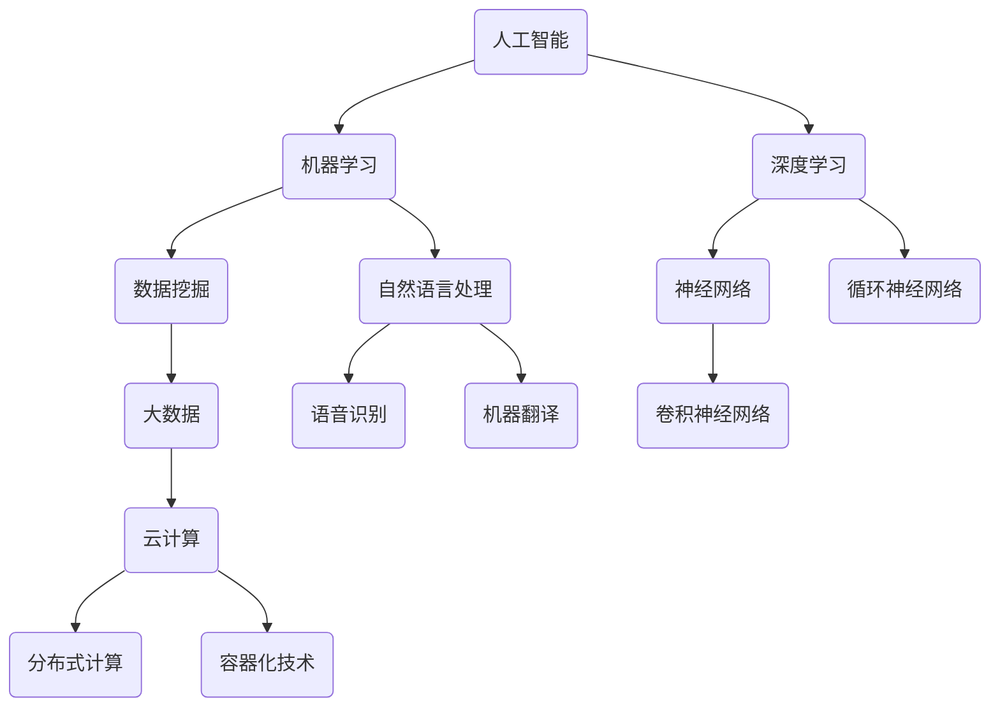

                 

# 技能提升：适应人类计算时代的新需求

## 关键词：
**技能提升、计算时代、人工智能、软件开发、技术创新**

## 摘要：
本文旨在探讨在当前人类计算时代，如何提升个人技能以适应不断变化的新需求。我们将从背景介绍、核心概念、算法原理、数学模型、项目实战、应用场景、工具资源等多个维度进行分析，并提出未来发展趋势和挑战。通过本文，读者可以更好地了解如何在计算时代中提升自己的竞争力，从而为个人的职业发展打下坚实基础。

## 1. 背景介绍

随着信息技术的飞速发展，人类已经进入了计算时代。计算能力的提升不仅改变了我们的生活方式，也对各行各业产生了深远影响。从个人计算到云计算，从大数据到人工智能，计算技术正在重塑我们的世界。在这个背景下，个人技能的提升变得尤为重要。

首先，技术更新迭代的速度越来越快，要求人们不断学习新的技能和知识。例如，人工智能、机器学习和区块链等领域的技术创新正在迅速发展，需要从业人员具备深厚的专业知识和实践经验。

其次，计算时代的到来带来了更多的就业机会，但也对从业人员的技能要求越来越高。不仅需要掌握传统的编程技能，还需要了解新兴技术，如云计算、大数据、人工智能等。

此外，计算时代的竞争也日益激烈。在这个时代，只有具备先进技能的人才能在职场中脱颖而出。因此，提升个人技能已成为提升职业竞争力的关键。

## 2. 核心概念与联系

为了更好地理解计算时代的新需求，我们需要了解一些核心概念，如人工智能、大数据、云计算等。以下是一个简单的 Mermaid 流程图，用于展示这些概念之间的联系。



### 2.1 人工智能

人工智能（Artificial Intelligence，简称 AI）是指模拟人类智能的技术。它包括机器学习、深度学习、自然语言处理等多个子领域。

- **机器学习**：通过算法和统计模型，使计算机能够从数据中学习并做出决策。
- **深度学习**：一种特殊的机器学习方法，通过多层神经网络模拟人类大脑的思维方式。
- **自然语言处理**：研究计算机如何理解和生成自然语言。

### 2.2 大数据

大数据（Big Data）是指海量、多样化的数据。大数据技术包括数据采集、存储、处理、分析和可视化等多个环节。

- **数据挖掘**：从海量数据中提取有价值的信息。
- **云计算**：通过分布式计算和存储技术，实现大数据的处理和分析。

### 2.3 云计算

云计算（Cloud Computing）是一种通过网络提供计算资源的服务。它包括基础设施即服务（IaaS）、平台即服务（PaaS）和软件即服务（SaaS）等多个层次。

- **分布式计算**：通过多个计算机节点协同工作，实现大规模数据处理。
- **容器化技术**：将应用程序及其依赖打包到容器中，实现高效部署和扩展。

## 3. 核心算法原理 & 具体操作步骤

### 3.1 机器学习算法

机器学习算法包括监督学习、无监督学习和强化学习等。

- **监督学习**：通过已知的输入输出数据，训练模型并预测新的输入数据。
  - **线性回归**：通过最小二乘法拟合一条直线，实现数据的线性回归。
  - **支持向量机**：通过寻找最优超平面，实现数据的分类。
- **无监督学习**：没有已知输出数据，通过数据自身的特征，发现数据的规律。
  - **聚类算法**：将数据分为不同的簇，实现数据的聚类分析。
  - **降维算法**：通过减少数据维度，实现数据的降维处理。
- **强化学习**：通过不断地尝试和反馈，学习如何做出最优决策。

### 3.2 深度学习算法

深度学习算法包括卷积神经网络（CNN）、循环神经网络（RNN）等。

- **卷积神经网络**：通过卷积操作和池化操作，实现图像的分类和识别。
  - **卷积层**：对图像进行卷积操作，提取图像特征。
  - **池化层**：对卷积结果进行池化操作，降低模型参数数量。
- **循环神经网络**：通过循环结构，实现序列数据的处理。
  - **隐藏层**：通过循环操作，对序列数据进行处理。
  - **输出层**：通过输出层，对序列数据做出预测。

## 4. 数学模型和公式 & 详细讲解 & 举例说明

### 4.1 线性回归

线性回归是一种常见的机器学习算法，用于拟合数据的线性关系。其数学模型如下：

$$y = \beta_0 + \beta_1x_1 + \beta_2x_2 + ... + \beta_nx_n + \epsilon$$

其中，$y$ 是因变量，$x_1, x_2, ..., x_n$ 是自变量，$\beta_0, \beta_1, \beta_2, ..., \beta_n$ 是模型参数，$\epsilon$ 是误差项。

### 4.2 支持向量机

支持向量机是一种强大的分类算法，其数学模型如下：

$$w \cdot x + b = 0$$

其中，$w$ 是模型参数，$x$ 是特征向量，$b$ 是偏置项。

### 4.3 卷积神经网络

卷积神经网络是一种强大的图像处理算法，其数学模型如下：

$$f(x) = \sigma(W \cdot x + b)$$

其中，$f(x)$ 是卷积结果，$\sigma$ 是激活函数，$W$ 是模型参数，$b$ 是偏置项。

## 5. 项目实战：代码实际案例和详细解释说明

### 5.1 开发环境搭建

在本节中，我们将介绍如何搭建一个简单的深度学习项目开发环境。以 Python 为例，我们需要安装以下依赖：

- Python 3.7 或更高版本
- TensorFlow 2.x 或更高版本
- NumPy
- Matplotlib

在终端中运行以下命令：

```bash
pip install python==3.7.9
pip install tensorflow==2.7.0
pip install numpy
pip install matplotlib
```

### 5.2 源代码详细实现和代码解读

以下是一个简单的深度学习项目示例，用于分类手写数字数据集。

```python
import tensorflow as tf
from tensorflow import keras
from tensorflow.keras import layers
import numpy as np
import matplotlib.pyplot as plt

# 加载数据集
(x_train, y_train), (x_test, y_test) = keras.datasets.mnist.load_data()

# 数据预处理
x_train = x_train.astype("float32") / 255
x_test = x_test.astype("float32") / 255
y_train = keras.utils.to_categorical(y_train, 10)
y_test = keras.utils.to_categorical(y_test, 10)

# 构建模型
model = keras.Sequential([
    layers.Flatten(input_shape=(28, 28)),
    layers.Dense(128, activation="relu"),
    layers.Dense(10, activation="softmax")
])

# 编译模型
model.compile(optimizer="adam",
              loss="categorical_crossentropy",
              metrics=["accuracy"])

# 训练模型
model.fit(x_train, y_train, epochs=10, batch_size=32)

# 评估模型
test_loss, test_acc = model.evaluate(x_test, y_test)
print("Test accuracy:", test_acc)

# 可视化
predictions = model.predict(x_test)
predicted_labels = np.argmax(predictions, axis=1)
plt.figure(figsize=(10, 10))
for i in range(25):
    plt.subplot(5, 5, i + 1)
    plt.imshow(x_test[i], cmap=plt.cm.binary)
    plt.xticks([])
    plt.yticks([])
    plt.grid(False)
    plt.xlabel(str(predicted_labels[i]))
plt.show()
```

### 5.3 代码解读与分析

1. **数据加载与预处理**：使用 TensorFlow 的 `mnist` 数据集，并将其转换为浮点数和类别标签。
2. **模型构建**：使用 `Sequential` 模型，添加一个 `Flatten` 层将图像展平为一维数组，然后添加两个 `Dense` 层，第一个层有 128 个神经元，使用 ReLU 激活函数，第二个层有 10 个神经元，用于分类。
3. **模型编译**：选择 `adam` 优化器和 `categorical_crossentropy` 损失函数，并设置 `accuracy` 作为评价指标。
4. **模型训练**：使用 `fit` 方法训练模型，设置训练轮次为 10，批量大小为 32。
5. **模型评估**：使用 `evaluate` 方法评估模型在测试集上的性能。
6. **可视化**：使用 `predict` 方法预测测试集的结果，并将预测结果可视化。

## 6. 实际应用场景

### 6.1 人工智能

- **图像识别**：通过卷积神经网络对图像进行分类和识别。
- **自然语言处理**：通过循环神经网络对文本进行情感分析、机器翻译等。

### 6.2 大数据

- **数据挖掘**：从海量数据中提取有价值的信息。
- **数据可视化**：通过可视化技术，展示数据分布和趋势。

### 6.3 云计算

- **云计算平台**：提供虚拟机、容器等计算资源。
- **分布式计算**：通过分布式计算，实现大数据的处理和分析。

## 7. 工具和资源推荐

### 7.1 学习资源推荐

- **书籍**：
  - 《深度学习》（Ian Goodfellow、Yoshua Bengio 和 Aaron Courville 著）
  - 《机器学习实战》（Peter Harrington 著）
- **论文**：
  - 《A Study of Pruning Techniques for Neural Network》（李宏毅 著）
  - 《Deep Learning for Text Classification》（刘知远 著）
- **博客**：
  - Medium 上的深度学习和人工智能博客
  - 知乎上的深度学习和人工智能专栏
- **网站**：
  - TensorFlow 官网
  - Keras 官网
  - Coursera 上的深度学习课程

### 7.2 开发工具框架推荐

- **编程语言**：Python、Java、C++
- **框架**：
  - TensorFlow、PyTorch
  - Flask、Django
  - Spring Boot、Hibernate

### 7.3 相关论文著作推荐

- 《深度学习》（Ian Goodfellow、Yoshua Bengio 和 Aaron Courville 著）
- 《机器学习实战》（Peter Harrington 著）
- 《Python 编程：从入门到实践》（埃里克·马瑟斯 著）
- 《数据结构与算法分析：Java 语言描述》（Mark Allen Weiss 著）

## 8. 总结：未来发展趋势与挑战

在计算时代，技能提升已成为个人职业发展的关键。未来，随着人工智能、大数据、云计算等技术的发展，以下趋势和挑战值得注意：

- **技术创新**：人工智能、区块链、物联网等新兴技术将不断涌现，对从业人员的技能要求越来越高。
- **数据安全**：随着数据规模的扩大，数据安全和隐私保护将成为重要挑战。
- **跨界融合**：不同领域的技术将相互融合，产生新的应用场景和商业模式。
- **人才竞争**：具备先进技能的人才将在职场中脱颖而出，竞争将更加激烈。

## 9. 附录：常见问题与解答

### 9.1 人工智能与机器学习的区别是什么？

人工智能（AI）是指模拟人类智能的技术，包括机器学习（ML）、深度学习（DL）等子领域。机器学习是人工智能的一个分支，主要通过算法和统计模型，使计算机能够从数据中学习并做出决策。深度学习是机器学习的一种特殊形式，通过多层神经网络模拟人类大脑的思维方式。

### 9.2 如何学习深度学习？

学习深度学习可以从以下几个方面入手：

- **基础知识**：掌握线性代数、概率论、微积分等数学基础知识。
- **编程技能**：掌握 Python 等编程语言，熟悉 TensorFlow、PyTorch 等深度学习框架。
- **实践项目**：通过实际项目，将所学知识应用到实际问题中。
- **学习资源**：阅读相关书籍、论文和博客，参加在线课程和研讨会。

## 10. 扩展阅读 & 参考资料

- 《深度学习》（Ian Goodfellow、Yoshua Bengio 和 Aaron Courville 著）
- 《机器学习实战》（Peter Harrington 著）
- 《Python 编程：从入门到实践》（埃里克·马瑟斯 著）
- 《数据结构与算法分析：Java 语言描述》（Mark Allen Weiss 著）
- TensorFlow 官网：[https://www.tensorflow.org/](https://www.tensorflow.org/)
- Keras 官网：[https://keras.io/](https://keras.io/)
- Coursera 上的深度学习课程：[https://www.coursera.org/specializations/deeplearning](https://www.coursera.org/specializations/deeplearning)作者：AI天才研究员/AI Genius Institute & 禅与计算机程序设计艺术 /Zen And The Art of Computer Programming
<|im_sep|>

