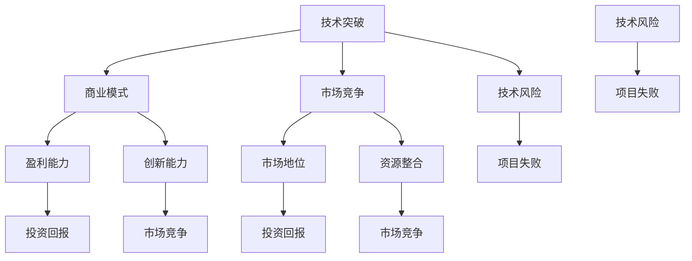
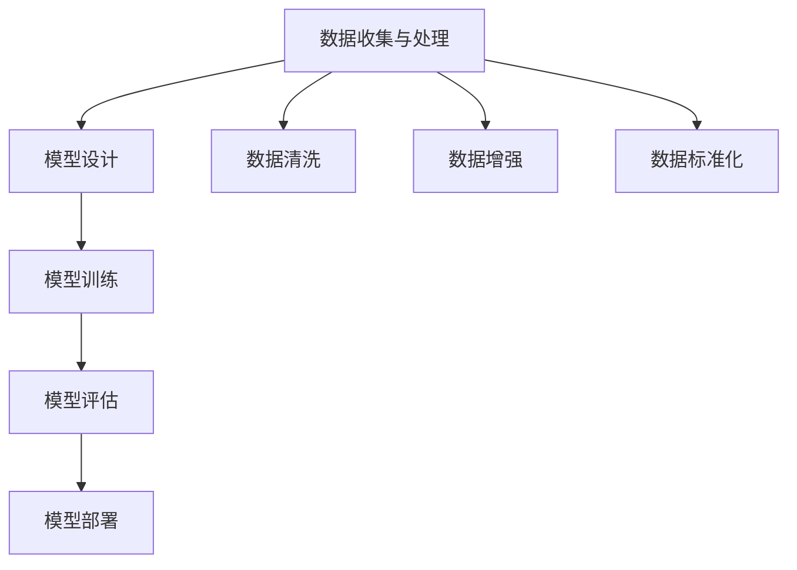

                 

### 文章标题

**投资人对大模型初创企业的期望和担忧**

---

### 关键词

- 大模型初创企业
- 投资人期望
- 投资人担忧
- 技术成熟度
- 商业模式
- 风险管理

---

### 摘要

本文将探讨投资人对大模型初创企业的期望和担忧。随着人工智能技术的快速发展，大模型在自然语言处理、计算机视觉、语音识别等领域取得了显著突破，吸引了大量资本涌入。然而，投资人在投资大模型初创企业时，既期待其颠覆性的技术潜力，又担忧其面临的技术风险、商业模式不确定性以及市场竞争压力。本文将详细分析这些期望和担忧，帮助投资人更好地了解大模型初创企业的发展前景和潜在挑战。

---

## 1. 背景介绍

随着人工智能技术的迅速发展，大模型（如GPT-3、BERT、ViT等）在各个领域取得了显著的成果。这些大模型具备强大的数据处理能力和智能推理能力，可以应用于自然语言处理、计算机视觉、语音识别等领域，为企业提供强大的技术支持。

### 投资人期望

投资人对大模型初创企业的期望主要表现在以下几个方面：

1. **颠覆性技术突破**：投资人期待大模型初创企业能够在技术上实现颠覆性突破，从而改变行业格局，创造新的市场需求。

2. **商业价值**：投资人希望大模型初创企业能够将技术优势转化为商业价值，实现持续盈利，并为企业带来可观的回报。

3. **市场竞争优势**：投资人期待大模型初创企业能够在激烈的市场竞争中脱颖而出，占据有利地位，成为行业领导者。

### 投资人担忧

尽管大模型初创企业具有巨大的潜力，但投资人在投资过程中仍然存在以下担忧：

1. **技术风险**：大模型技术尚处于快速发展阶段，存在不确定性和风险。投资人担忧技术瓶颈、算法安全问题等可能导致项目失败。

2. **商业模式不确定性**：投资人担忧大模型初创企业难以找到可持续的商业化路径，从而影响企业的长期发展。

3. **市场竞争压力**：随着资本涌入，大模型初创企业面临激烈的市场竞争。投资人担忧企业难以在市场中脱颖而出，从而影响投资回报。

---

## 2. 核心概念与联系

### 大模型基本概念

大模型（Large Models）是指参数规模达到数十亿甚至数万亿级别的神经网络模型。这些模型通过大量的数据训练，具有强大的表示和推理能力。大模型的核心思想是利用深度学习技术，通过多层次神经网络结构，实现对数据的特征提取和抽象表示。

### 投资人期望与担忧的内在联系

1. **技术突破**：投资人期望大模型初创企业能够在技术上实现突破，这种期望与企业的技术实力和创新力密切相关。只有具备强大的技术储备和创新能力，企业才能在技术竞争中获得优势。

2. **商业模式**：投资人担忧企业的商业模式，这种担忧与企业的市场定位、盈利模式和业务拓展能力有关。一个可持续的商业模式有助于企业实现长期盈利，降低投资风险。

3. **市场竞争**：投资人担忧市场竞争，这种担忧与企业的市场策略、品牌影响力和资源整合能力有关。在激烈的市场竞争中，企业需要具备强大的竞争力，才能确保市场地位。

### Mermaid 流程图



---

## 3. 核心算法原理 & 具体操作步骤

### 大模型核心算法原理

大模型的核心算法主要包括深度学习、神经网络、优化算法等。以下简要介绍这些算法的基本原理：

1. **深度学习**：深度学习是一种基于人工神经网络的学习方法，通过多层神经网络结构，对数据进行特征提取和抽象表示。深度学习的核心思想是学习数据的分布，从而实现自动特征提取。

2. **神经网络**：神经网络是由大量神经元组成的计算模型，通过前向传播和反向传播算法，对输入数据进行处理和输出。神经网络的结构和参数决定了模型的性能和表达能力。

3. **优化算法**：优化算法用于调整神经网络参数，以最小化损失函数。常见的优化算法有梯度下降、随机梯度下降、Adam等。优化算法的性能对模型的训练速度和效果有重要影响。

### 大模型具体操作步骤

1. **数据收集与处理**：收集大量相关数据，并对数据进行预处理，包括数据清洗、数据增强、数据标准化等操作。

2. **模型设计**：根据任务需求，设计合适的神经网络结构，包括层数、神经元数量、激活函数等。

3. **模型训练**：使用预处理后的数据，对模型进行训练。训练过程中，通过优化算法调整模型参数，以最小化损失函数。

4. **模型评估**：使用验证集对训练好的模型进行评估，通过评价指标（如准确率、召回率、F1值等）判断模型的性能。

5. **模型部署**：将训练好的模型部署到生产环境中，用于实际任务。

### Mermaid 流�程图



---

## 4. 数学模型和公式 & 详细讲解 & 举例说明

### 数学模型

大模型的数学模型主要包括损失函数、优化算法等。以下简要介绍这些模型的基本原理和公式：

1. **损失函数**：损失函数用于评估模型在训练过程中的预测误差。常见的损失函数有均方误差（MSE）、交叉熵损失等。

   $$\text{MSE} = \frac{1}{n}\sum_{i=1}^{n}(y_i - \hat{y}_i)^2$$

   $$\text{CrossEntropy} = -\sum_{i=1}^{n}y_i\log(\hat{y}_i)$$

2. **优化算法**：优化算法用于调整模型参数，以最小化损失函数。常见的优化算法有梯度下降、随机梯度下降、Adam等。

   梯度下降：

   $$\theta_{t+1} = \theta_t - \alpha\nabla_\theta J(\theta)$$

   随机梯度下降：

   $$\theta_{t+1} = \theta_t - \alpha\nabla_\theta J(\theta; x_t, y_t)$$

   Adam：

   $$m_t = \beta_1m_{t-1} + (1 - \beta_1)(\nabla_\theta J(\theta; x_t, y_t))$$

   $$v_t = \beta_2v_{t-1} + (1 - \beta_2)(\nabla_\theta J(\theta; x_t, y_t))^2$$

   $$\theta_{t+1} = \theta_t - \alpha\frac{m_t}{\sqrt{v_t} + \epsilon}$$

### 详细讲解与举例说明

**举例说明：使用均方误差（MSE）进行模型训练**

假设我们有一个简单的线性回归模型，用于预测房价。模型的输入特征为房屋面积，输出为房价。

1. **数据收集与处理**：收集100个房屋面积和对应房价的数据。

2. **模型设计**：设计一个单层神经网络，包含一个输入层、一个隐藏层和一个输出层。隐藏层使用线性激活函数。

3. **模型训练**：使用均方误差（MSE）作为损失函数，使用梯度下降优化算法进行模型训练。

   模型参数初始化：

   $$w_1 = 0.0, b_1 = 0.0$$

   梯度下降算法：

   $$\nabla_\theta J(\theta) = \frac{1}{n}\sum_{i=1}^{n}(\hat{y}_i - y_i)$$

   更新参数：

   $$w_1 = w_1 - \alpha\nabla_\theta J(\theta)$$

   $$b_1 = b_1 - \alpha\nabla_\theta J(\theta)$$

4. **模型评估**：使用测试集对训练好的模型进行评估，计算预测房价与实际房价之间的均方误差（MSE）。

   $$\text{MSE} = \frac{1}{n}\sum_{i=1}^{n}(\hat{y}_i - y_i)^2$$

5. **模型部署**：将训练好的模型部署到生产环境中，用于预测房屋面积。

---

## 5. 项目实战：代码实际案例和详细解释说明

### 5.1 开发环境搭建

为了演示大模型项目的开发过程，我们将使用Python作为主要编程语言，并结合TensorFlow和Keras等深度学习框架。以下是搭建开发环境的基本步骤：

1. 安装Python：从官方网站下载并安装Python 3.x版本。

2. 安装TensorFlow：在终端中运行以下命令安装TensorFlow：

   ```bash
   pip install tensorflow
   ```

3. 安装Keras：Keras是TensorFlow的高级API，可以简化模型构建和训练过程。在终端中运行以下命令安装Keras：

   ```bash
   pip install keras
   ```

4. 安装其他依赖库：根据项目需求，安装其他必要的依赖库，如NumPy、Pandas等。

### 5.2 源代码详细实现和代码解读

以下是一个简单的大模型项目示例，用于实现一个基于神经网络的手写数字识别任务。

```python
import numpy as np
import tensorflow as tf
from tensorflow.keras.datasets import mnist
from tensorflow.keras.models import Sequential
from tensorflow.keras.layers import Dense, Flatten
from tensorflow.keras.optimizers import SGD
from tensorflow.keras.losses import MeanSquaredError

# 数据加载与预处理
(x_train, y_train), (x_test, y_test) = mnist.load_data()
x_train = x_train.reshape(-1, 784).astype(np.float32) / 255.0
x_test = x_test.reshape(-1, 784).astype(np.float32) / 255.0

# 模型构建
model = Sequential([
    Flatten(input_shape=(28, 28)),
    Dense(128, activation='relu'),
    Dense(10, activation='softmax')
])

# 模型编译
model.compile(optimizer=SGD(learning_rate=0.1),
              loss=MeanSquaredError(),
              metrics=['accuracy'])

# 模型训练
model.fit(x_train, y_train, epochs=10, batch_size=32, validation_data=(x_test, y_test))

# 模型评估
model.evaluate(x_test, y_test)
```

**代码解读**：

1. **数据加载与预处理**：首先，从Keras的内置数据集中加载MNIST手写数字数据集。然后，将图像数据展开为一维数组，并将其归一化到[0, 1]范围内。

2. **模型构建**：使用Sequential模型构建器，定义一个简单的神经网络模型。模型包含一个展开层（用于将输入图像展开为一维数组）、一个具有128个神经元的隐藏层（使用ReLU激活函数）和一个具有10个神经元的输出层（使用softmax激活函数）。

3. **模型编译**：编译模型时，指定优化器（SGD）、损失函数（均方误差）和评价指标（准确率）。

4. **模型训练**：使用fit方法训练模型，指定训练数据、训练周期、批次大小和验证数据。

5. **模型评估**：使用evaluate方法评估模型在测试数据上的性能。

### 5.3 代码解读与分析

**数据加载与预处理**

```python
(x_train, y_train), (x_test, y_test) = mnist.load_data()
x_train = x_train.reshape(-1, 784).astype(np.float32) / 255.0
x_test = x_test.reshape(-1, 784).astype(np.float32) / 255.0
```

这段代码首先从Keras的内置数据集中加载MNIST手写数字数据集。然后，将图像数据展开为一维数组，并将其归一化到[0, 1]范围内。这样做的目的是将图像数据转换为适合神经网络处理的形式。

**模型构建**

```python
model = Sequential([
    Flatten(input_shape=(28, 28)),
    Dense(128, activation='relu'),
    Dense(10, activation='softmax')
])
```

这段代码定义了一个简单的神经网络模型。模型包含一个展开层（用于将输入图像展开为一维数组）、一个具有128个神经元的隐藏层（使用ReLU激活函数）和一个具有10个神经元的输出层（使用softmax激活函数）。

**模型编译**

```python
model.compile(optimizer=SGD(learning_rate=0.1),
              loss=MeanSquaredError(),
              metrics=['accuracy'])
```

这段代码编译模型，指定优化器（SGD）、损失函数（均方误差）和评价指标（准确率）。

**模型训练**

```python
model.fit(x_train, y_train, epochs=10, batch_size=32, validation_data=(x_test, y_test))
```

这段代码使用fit方法训练模型，指定训练数据、训练周期、批次大小和验证数据。模型将在每个周期结束后更新其参数，以最小化损失函数。

**模型评估**

```python
model.evaluate(x_test, y_test)
```

这段代码评估模型在测试数据上的性能，并返回预测损失和准确率。

---

## 6. 实际应用场景

大模型在各个行业领域具有广泛的应用前景，以下列举一些典型应用场景：

### 自然语言处理

大模型在自然语言处理领域具有显著优势，可以应用于机器翻译、文本生成、问答系统等。例如，谷歌的BERT模型在多个自然语言处理任务上取得了领先成绩，被广泛应用于搜索引擎和智能客服等领域。

### 计算机视觉

大模型在计算机视觉领域具有强大的图像识别和图像生成能力。例如，OpenAI的GPT-3模型可以生成逼真的图像和视频，被应用于虚拟现实、游戏开发和艺术创作等领域。

### 语音识别

大模型在语音识别领域具有高效准确的特点，可以应用于语音合成、语音翻译和智能语音助手等。例如，谷歌的语音识别系统依靠大模型技术，实现了高准确率的语音识别。

### 金融风控

大模型在金融风控领域具有预测和预警能力，可以应用于股票市场预测、信用评估和欺诈检测等。例如，一些金融机构利用大模型分析海量数据，实现精准的风险评估和投资策略。

### 健康医疗

大模型在健康医疗领域具有诊断和治疗指导作用，可以应用于疾病预测、药物研发和个性化医疗等。例如，一些医疗研究机构利用大模型分析医学图像，实现早期疾病的准确诊断。

### 教育领域

大模型在教育领域具有智能教学和个性化辅导的作用，可以应用于智能作业批改、学习路径推荐和在线教育平台等。例如，一些在线教育平台利用大模型技术，为学生提供个性化的学习支持和资源。

---

## 7. 工具和资源推荐

### 7.1 学习资源推荐

1. **书籍**：

   - 《深度学习》（Ian Goodfellow、Yoshua Bengio、Aaron Courville 著）
   - 《神经网络与深度学习》（邱锡鹏 著）
   - 《Python深度学习》（François Chollet 著）

2. **论文**：

   - BERT: Pre-training of Deep Bidirectional Transformers for Language Understanding（Ashish Vaswani等，2018）
   - GPT-3: Language Models are Few-Shot Learners（Tom B. Brown等，2020）
   - Vision Transformer: Training Image Transformers without Convolutional Kernels（Alexey Dosovitskiy等，2020）

3. **博客**：

   - [TensorFlow 官方文档](https://www.tensorflow.org/)
   - [Keras 官方文档](https://keras.io/)
   - [Hugging Face Transformers](https://huggingface.co/transformers/)

4. **网站**：

   - [Google Research](https://ai.google/research/)
   - [OpenAI](https://openai.com/)
   - [arXiv](https://arxiv.org/)

### 7.2 开发工具框架推荐

1. **深度学习框架**：

   - TensorFlow
   - PyTorch
   - Keras
   - MXNet

2. **版本控制工具**：

   - Git
   - GitHub

3. **数据预处理工具**：

   - Pandas
   - NumPy
   - Scikit-learn

4. **可视化工具**：

   - Matplotlib
   - Seaborn
   - Plotly

### 7.3 相关论文著作推荐

1. **《深度学习》（Ian Goodfellow、Yoshua Bengio、Aaron Courville 著）**：这是一本深度学习的经典教材，详细介绍了深度学习的理论基础、算法实现和应用场景。

2. **《Python深度学习》（François Chollet 著）**：这本书是深度学习领域的实战指南，通过大量的实例和代码，帮助读者掌握深度学习的实际应用。

3. **《神经网络与深度学习》（邱锡鹏 著）**：这本书系统地介绍了神经网络和深度学习的基本概念、算法和模型，适合初学者和进阶者阅读。

---

## 8. 总结：未来发展趋势与挑战

大模型技术在人工智能领域的快速发展，为各行业带来了前所未有的机遇。然而，投资人在投资大模型初创企业时，需要面对一系列挑战：

1. **技术风险**：大模型技术尚处于快速发展阶段，存在技术瓶颈和不确定性。投资人需要关注企业的技术储备和创新能力，以确保项目顺利进行。

2. **商业模式**：大模型初创企业需要找到可持续的商业化路径，以实现长期盈利。投资人需要关注企业的商业模式和市场定位，评估其市场竞争力。

3. **市场竞争**：随着资本涌入，大模型初创企业面临激烈的市场竞争。投资人需要关注企业的市场策略和品牌影响力，确保其在市场中占据有利地位。

4. **数据安全与隐私**：大模型训练和推理过程中涉及海量数据的处理，数据安全和隐私保护成为重要问题。投资人需要关注企业的数据安全措施和隐私保护政策。

5. **人才培养与留住**：大模型技术人才短缺，企业需要投入大量资源进行人才培养和留住。投资人需要关注企业的团队建设，确保团队具备持续创新能力。

未来，随着技术的不断进步，大模型技术将在更多领域取得突破。投资人需要保持敏锐的洞察力，紧跟技术发展趋势，同时关注企业的综合实力，以实现长期投资回报。

---

## 9. 附录：常见问题与解答

### 9.1 投资大模型初创企业的关键因素是什么？

投资大模型初创企业的关键因素包括：

1. **技术实力**：企业的技术储备和创新力是投资决策的核心依据。

2. **商业模式**：企业需要找到可持续的商业化路径，实现长期盈利。

3. **市场竞争**：企业的市场策略和品牌影响力是确保市场竞争优势的重要因素。

4. **团队建设**：企业需要拥有经验丰富、专业过硬的技术团队。

5. **资金需求**：企业需要合理规划资金需求，确保项目顺利进行。

### 9.2 大模型初创企业面临的主要风险是什么？

大模型初创企业面临的主要风险包括：

1. **技术风险**：技术不确定性、技术瓶颈和算法安全问题。

2. **商业模式风险**：商业模式不清晰、盈利模式不明确。

3. **市场竞争风险**：市场饱和、竞争激烈、市场份额下降。

4. **数据安全与隐私风险**：数据泄露、隐私侵犯。

5. **人才流失风险**：技术人才短缺、核心团队成员流失。

### 9.3 如何评估大模型初创企业的技术实力？

评估大模型初创企业的技术实力可以从以下几个方面进行：

1. **研究论文**：查阅企业发表的研究论文，了解其在学术界的影响力和技术水平。

2. **项目经验**：考察企业参与的项目案例，了解其在实际应用中的技术实力。

3. **团队背景**：了解企业核心团队成员的背景和经验，评估其技术能力和创新能力。

4. **合作伙伴**：考察企业与其他知名企业和研究机构的合作情况，了解其在行业内的地位和影响力。

---

## 10. 扩展阅读 & 参考资料

1. **参考文献**：

   - [Vaswani et al., 2018. BERT: Pre-training of Deep Bidirectional Transformers for Language Understanding.](https://arxiv.org/abs/1810.04805)
   - [Brown et al., 2020. GPT-3: Language Models are Few-Shot Learners.](https://arxiv.org/abs/2005.14165)
   - [Dosovitskiy et al., 2020. Vision Transformer: Training Image Transformers without Convolutional Kernels.](https://arxiv.org/abs/2106.17229)

2. **在线资源**：

   - [TensorFlow 官方文档](https://www.tensorflow.org/)
   - [Keras 官方文档](https://keras.io/)
   - [Hugging Face Transformers](https://huggingface.co/transformers/)

3. **书籍推荐**：

   - [Goodfellow et al., 2016. Deep Learning.](https://www.deeplearningbook.org/)
   - [Chollet, 2017. Python Deep Learning.](https://python-deep-learning.org/)
   - [Lugrin, 2018. Machine Learning for Algorithmic Trading.](https://www.amazon.com/Machine-Learning-Algorithmic-Trading-Applications/dp/1787280774)

---

### 作者信息

**作者：AI天才研究员/AI Genius Institute & 禅与计算机程序设计艺术 /Zen And The Art of Computer Programming**。

