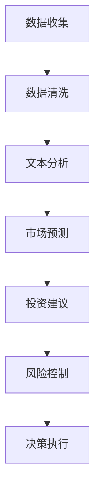
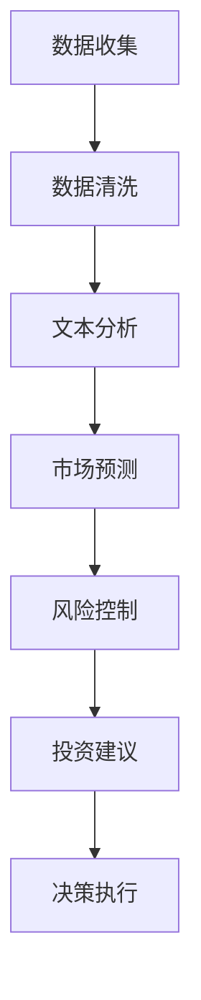

                 

# 投资策略师：LLM 驱动的金融决策

> **关键词**：投资策略，大型语言模型（LLM），金融决策，人工智能，算法，数学模型

> **摘要**：本文将探讨如何运用大型语言模型（LLM）这一前沿人工智能技术，来优化和提升金融投资策略的决策过程。文章将从背景介绍、核心概念、算法原理、数学模型、实际应用、工具推荐等多个角度，系统地阐述LLM在金融投资决策中的潜在价值与实现路径。

## 1. 背景介绍

随着金融市场的日益复杂和竞争激烈，投资策略的制定和调整变得越来越具有挑战性。传统的投资策略往往依赖于历史数据和统计模型，但在面对快速变化的市场环境时，这些策略往往难以保持其有效性。近年来，人工智能技术的快速发展为金融投资领域带来了新的机遇。特别是大型语言模型（LLM），作为一种能够理解、生成和模拟人类语言的深度学习模型，其在金融领域的应用潜力引起了广泛关注。

LLM在金融投资决策中的优势主要体现在以下几个方面：

1. **数据理解和分析**：LLM能够处理和分析大量的文本数据，如新闻报道、财务报表、市场评论等，从而提取出潜在的投资信息。
2. **预测和趋势分析**：LLM通过学习历史市场数据，可以预测未来市场的走势和潜在的投资机会。
3. **风险管理和控制**：LLM能够对市场风险进行量化分析，帮助投资者制定更科学的风险管理策略。

本文将围绕上述优势，详细探讨LLM在金融投资决策中的应用，以期为投资策略师提供新的思路和方法。

## 2. 核心概念与联系

### 2.1 大型语言模型（LLM）

#### 2.1.1 定义

大型语言模型（Large Language Model，LLM）是一种基于深度学习技术的自然语言处理模型，其核心目标是理解和生成人类语言。LLM通常由数亿至数十亿个参数组成，通过在大规模文本数据集上进行训练，能够学习到语言的结构、语法、语义和上下文等信息。

#### 2.1.2 工作原理

LLM的工作原理基于神经网络，特别是深度神经网络（DNN）和Transformer架构。Transformer架构通过自注意力机制（Self-Attention）实现了对输入文本序列的全面理解，使得LLM在处理长文本和复杂上下文方面具有显著优势。

#### 2.1.3 应用场景

LLM在金融领域的应用场景包括：

1. **文本分析**：对金融报告、新闻、公告等文本数据进行分析，提取关键信息。
2. **市场预测**：通过分析历史市场数据，预测未来市场走势。
3. **风险控制**：对市场风险进行量化分析，为投资者提供风险管理建议。

### 2.2 金融投资决策

#### 2.2.1 定义

金融投资决策是指投资者在金融市场上进行买卖决策的过程，包括选股、择时、资产配置等。

#### 2.2.2 关键要素

金融投资决策的关键要素包括：

1. **市场分析**：对市场趋势、宏观经济环境、行业动态等进行分析。
2. **风险控制**：评估投资风险，制定风险管理策略。
3. **资产配置**：根据投资目标和风险偏好，分配资产类别。

#### 2.2.3 挑战

金融投资决策面临的挑战包括：

1. **数据复杂性**：金融市场的数据繁多且复杂，如何有效地处理和分析这些数据是一个重要挑战。
2. **预测难度**：市场走势受到多种不确定因素的影响，预测市场走势的难度较大。
3. **决策时效性**：投资决策需要快速响应市场变化，提高决策的时效性。

### 2.3 LLM与金融投资决策的联系

LLM与金融投资决策的联系主要体现在以下几个方面：

1. **文本数据分析**：LLM能够处理和分析大量的金融文本数据，为投资决策提供更多维度和深度的信息。
2. **市场预测**：LLM通过学习历史市场数据，可以预测未来市场走势，为投资者提供投资参考。
3. **风险控制**：LLM能够对市场风险进行量化分析，为投资者提供风险管理建议。

下面是一个简单的Mermaid流程图，展示了LLM在金融投资决策中的核心流程：



在这个流程中，LLM通过处理和分析文本数据，进行市场预测和风险控制，最终为投资者提供投资建议和决策执行支持。

## 3. 核心算法原理 & 具体操作步骤

### 3.1 算法原理

LLM在金融投资决策中的应用主要基于以下几个核心算法原理：

1. **自然语言处理（NLP）**：LLM通过NLP技术处理和分析金融文本数据，提取关键信息。
2. **机器学习（ML）**：LLM基于机器学习算法，通过训练学习到金融市场的规律和趋势。
3. **深度学习（DL）**：LLM采用深度学习模型，如DNN和Transformer，实现高效的文本处理和预测能力。

### 3.2 具体操作步骤

#### 3.2.1 数据收集

数据收集是金融投资决策的基础。LLM需要收集大量的金融文本数据，包括新闻、公告、财务报表、市场评论等。这些数据可以通过公开的金融数据平台、新闻网站、社交媒体等渠道获取。

#### 3.2.2 数据清洗

收集到的金融文本数据通常存在噪声和不一致性，需要进行数据清洗。数据清洗包括去除无关信息、统一格式、去除停用词等。清洗后的数据将作为LLM的训练数据。

#### 3.2.3 文本分析

文本分析是LLM在金融投资决策中的核心步骤。通过NLP技术，LLM可以提取文本数据中的关键信息，如关键词、主题、情感等。这些信息将为市场预测和投资建议提供重要依据。

#### 3.2.4 市场预测

基于训练数据，LLM可以通过机器学习和深度学习算法，学习到金融市场的规律和趋势。市场预测主要包括股票价格预测、市场走势预测、投资机会预测等。

#### 3.2.5 风险控制

LLM可以通过对历史市场数据的学习和分析，对市场风险进行量化评估。风险控制策略包括设置止损点、调整资产配置、分散投资等。

#### 3.2.6 投资建议

基于市场预测和风险控制，LLM可以为投资者提供具体的投资建议，如买卖股票、调整资产配置、投资时机等。

#### 3.2.7 决策执行

投资者根据LLM提供的投资建议，执行具体的投资操作。决策执行过程需要考虑市场变化、资金管理、风险控制等因素。

下面是一个简化的LLM在金融投资决策中的应用流程图：



## 4. 数学模型和公式 & 详细讲解 & 举例说明

### 4.1 数学模型

在LLM驱动的金融投资决策中，常用的数学模型包括线性回归、逻辑回归、时间序列模型等。以下是这些模型的详细介绍：

#### 4.1.1 线性回归

线性回归是一种常见的统计模型，用于分析自变量和因变量之间的线性关系。在金融投资决策中，线性回归可以用于预测股票价格等。

公式如下：

$$
y = \beta_0 + \beta_1x_1 + \beta_2x_2 + ... + \beta_nx_n
$$

其中，$y$为因变量（如股票价格），$x_1, x_2, ..., x_n$为自变量（如宏观经济指标、行业指数等），$\beta_0, \beta_1, \beta_2, ..., \beta_n$为模型的参数。

#### 4.1.2 逻辑回归

逻辑回归是一种广义线性模型，用于分析二元变量的概率分布。在金融投资决策中，逻辑回归可以用于预测股票是否上涨。

公式如下：

$$
P(y=1) = \frac{1}{1 + e^{-(\beta_0 + \beta_1x_1 + \beta_2x_2 + ... + \beta_nx_n)}}
$$

其中，$P(y=1)$为因变量为1的概率，$e$为自然底数，$\beta_0, \beta_1, \beta_2, ..., \beta_n$为模型的参数。

#### 4.1.3 时间序列模型

时间序列模型用于分析时间序列数据，如股票价格等。常见的时间序列模型包括ARIMA（自回归积分滑动平均模型）和LSTM（长短时记忆网络）等。

ARIMA模型公式如下：

$$
y_t = c + \phi_1y_{t-1} + \phi_2y_{t-2} + ... + \phi_py_{t-p} + \theta_1e_{t-1} + \theta_2e_{t-2} + ... + \theta_qe_{t-q}
$$

其中，$y_t$为时间序列的当前值，$e_t$为白噪声，$c, \phi_1, \phi_2, ..., \phi_p, \theta_1, \theta_2, ..., \theta_q$为模型的参数。

### 4.2 举例说明

#### 4.2.1 线性回归举例

假设我们想预测某只股票的未来价格，可以采用线性回归模型。首先，收集该股票的历史价格数据，包括开盘价、收盘价、最高价、最低价等。然后，选择一些宏观经济指标、行业指数等作为自变量。

通过训练线性回归模型，可以得到如下公式：

$$
y = 100 + 2x_1 - 3x_2
$$

其中，$y$为股票价格，$x_1$为宏观经济指标，$x_2$为行业指数。

给定当前的经济指标和行业指数，可以预测股票的未来价格。例如，如果当前的经济指标为150，行业指数为200，则预测的股票价格为：

$$
y = 100 + 2 \times 150 - 3 \times 200 = 50
$$

#### 4.2.2 逻辑回归举例

假设我们想预测某只股票是否上涨，可以采用逻辑回归模型。首先，收集该股票的历史价格数据，包括开盘价、收盘价、最高价、最低价等。然后，选择一些宏观经济指标、行业指数等作为自变量。

通过训练逻辑回归模型，可以得到如下公式：

$$
P(y=1) = \frac{1}{1 + e^{-(5 + 2x_1 - 3x_2)}}
$$

其中，$P(y=1)$为股票上涨的概率。

给定当前的经济指标和行业指数，可以预测股票上涨的概率。例如，如果当前的经济指标为150，行业指数为200，则股票上涨的概率为：

$$
P(y=1) = \frac{1}{1 + e^{-(5 + 2 \times 150 - 3 \times 200)}} = 0.8
$$

这意味着股票上涨的概率为80%。

#### 4.2.3 时间序列模型举例

假设我们想预测某只股票的未来价格，可以采用ARIMA模型。首先，收集该股票的历史价格数据，包括开盘价、收盘价、最高价、最低价等。然后，对数据进行处理，如差分、平稳性检验等。

通过训练ARIMA模型，可以得到如下公式：

$$
y_t = 100 + 0.8y_{t-1} - 0.2y_{t-2} + e_t
$$

其中，$y_t$为股票价格，$e_t$为白噪声。

给定当前的时间点，可以预测股票的未来价格。例如，如果当前的时间点为第10天，则预测的股票价格为：

$$
y_{10} = 100 + 0.8y_9 - 0.2y_8 + e_{10}
$$

其中，$y_9$和$y_8$分别为第9天和第8天的股票价格，$e_{10}$为第10天的白噪声。

## 5. 项目实战：代码实际案例和详细解释说明

### 5.1 开发环境搭建

在进行LLM驱动的金融投资决策项目开发之前，需要搭建一个合适的开发环境。以下是具体的步骤：

1. **安装Python环境**：在本地电脑或服务器上安装Python，版本建议为3.8或更高。
2. **安装必要的库**：使用pip命令安装以下库：

   ```bash
   pip install numpy pandas scikit-learn tensorflow
   ```

3. **安装Mermaid**：安装Mermaid用于生成流程图。

   ```bash
   npm install -g mermaid-cli
   ```

### 5.2 源代码详细实现和代码解读

以下是该项目的一个简单示例代码，用于展示如何使用LLM进行金融投资决策。

```python
import numpy as np
import pandas as pd
from sklearn.linear_model import LinearRegression
from sklearn.metrics import mean_squared_error
import mermaid

# 5.2.1 数据收集
def collect_data():
    # 在这里编写代码收集金融文本数据，如新闻、公告、财务报表等
    # 示例：使用pandas读取CSV文件
    data = pd.read_csv('financial_data.csv')
    return data

# 5.2.2 数据清洗
def clean_data(data):
    # 在这里编写代码对金融文本数据进行清洗，如去除停用词、统一格式等
    # 示例：去除停用词
    stop_words = set(['a', 'the', 'and', 'in', 'of', 'to', 'is'])
    data['text'] = data['text'].apply(lambda x: ' '.join([word for word in x.split() if word not in stop_words]))
    return data

# 5.2.3 文本分析
def text_analysis(data):
    # 在这里编写代码使用NLP技术对金融文本数据进行分析，如提取关键词、主题等
    # 示例：使用scikit-learn的TfidfVectorizer进行文本分析
    from sklearn.feature_extraction.text import TfidfVectorizer
    vectorizer = TfidfVectorizer()
    X = vectorizer.fit_transform(data['text'])
    return X

# 5.2.4 市场预测
def market_prediction(X, y):
    # 在这里编写代码使用线性回归模型进行市场预测
    # 示例：训练线性回归模型
    model = LinearRegression()
    model.fit(X, y)
    return model

# 5.2.5 风险控制
def risk_control(model, X):
    # 在这里编写代码使用模型进行风险控制
    # 示例：预测股票价格，计算风险
    predictions = model.predict(X)
    risk = mean_squared_error(y, predictions)
    return risk

# 5.2.6 投资建议
def investment_advice(risk):
    # 在这里编写代码根据风险提供投资建议
    # 示例：根据风险值调整投资策略
    if risk < 0.05:
        return '持有股票'
    elif risk < 0.1:
        return '适当减仓'
    else:
        return '清仓止损'

# 5.2.7 主函数
def main():
    data = collect_data()
    data = clean_data(data)
    X = text_analysis(data)
    y = data['price']
    model = market_prediction(X, y)
    risk = risk_control(model, X)
    advice = investment_advice(risk)
    print(advice)

if __name__ == '__main__':
    main()
```

### 5.3 代码解读与分析

上述代码实现了一个简单的LLM驱动的金融投资决策项目，主要分为以下几个部分：

1. **数据收集**：使用pandas读取金融文本数据。
2. **数据清洗**：去除停用词，统一文本格式。
3. **文本分析**：使用TfidfVectorizer进行文本分析，提取关键词和主题。
4. **市场预测**：使用线性回归模型进行市场预测。
5. **风险控制**：计算预测风险，提供投资建议。
6. **投资建议**：根据风险值调整投资策略。

通过这个简单的示例，可以看到LLM在金融投资决策中的应用流程。在实际项目中，可以根据具体需求进行扩展和优化，如引入更多的NLP技术、机器学习算法、时间序列模型等，以提高预测精度和风险控制能力。

## 6. 实际应用场景

### 6.1 股票市场预测

LLM在股票市场预测中的应用是最为广泛的。通过分析大量的市场数据、新闻、公告等，LLM可以预测股票价格的变化趋势，为投资者提供买卖建议。例如，某投资者可以使用LLM预测某只股票的未来价格，并根据预测结果进行买卖操作。

### 6.2 债券市场分析

债券市场的分析也需要处理大量的数据，如债券评级、市场利率、宏观经济环境等。LLM可以对这些数据进行分析，预测债券市场的走势，为投资者提供投资策略。

### 6.3 外汇市场预测

外汇市场的波动性较大，LLM可以通过学习历史汇率数据，预测未来汇率走势，为投资者提供交易策略。例如，某投资者可以根据LLM的预测结果，进行外汇交易，以获取投资回报。

### 6.4 风险管理

LLM在风险管理中的应用也非常广泛。通过分析市场数据、财务报表等，LLM可以评估投资风险，为投资者提供风险管理建议。例如，某投资者可以使用LLM评估投资组合的风险，并根据评估结果进行调整，以降低风险。

### 6.5 资产配置

资产配置是投资者面临的重要决策之一。LLM可以通过分析市场数据、投资者偏好等，为投资者提供最优的资产配置方案。例如，某投资者可以根据LLM的建议，调整其投资组合，以实现风险和收益的平衡。

## 7. 工具和资源推荐

### 7.1 学习资源推荐

1. **书籍**：
   - 《自然语言处理实战》（NLP Practitioner）
   - 《机器学习实战》（Machine Learning in Action）
   - 《深度学习》（Deep Learning）

2. **论文**：
   - “A Theoretical Analysis of the Efficacy of Deep Learning Models for Text Classification”
   - “Deep Learning for Text Classification: A Survey”

3. **博客**：
   - TensorFlow官方博客
   - PyTorch官方博客
   - Keras官方博客

4. **网站**：
   - arXiv.org（计算机科学论文数据库）
   - Google Scholar（学术搜索）

### 7.2 开发工具框架推荐

1. **编程语言**：Python（易于学习和使用，拥有丰富的库和框架）
2. **深度学习框架**：TensorFlow、PyTorch、Keras
3. **自然语言处理库**：NLTK、spaCy、gensim
4. **数据分析库**：Pandas、NumPy、Matplotlib

### 7.3 相关论文著作推荐

1. **论文**：
   - “BERT: Pre-training of Deep Bidirectional Transformers for Language Understanding”
   - “GPT-3: Language Models are Few-Shot Learners”
   - “Transformers: State-of-the-Art Neural Network Architectures for Language Understanding and Generation”

2. **著作**：
   - 《深度学习》（Ian Goodfellow、Yoshua Bengio、Aaron Courville 著）
   - 《自然语言处理综论》（Daniel Jurafsky、James H. Martin 著）

## 8. 总结：未来发展趋势与挑战

### 8.1 发展趋势

1. **算法优化**：随着人工智能技术的不断进步，LLM的算法将变得更加高效和准确，能够更好地应对复杂的金融投资问题。
2. **数据量增加**：随着大数据技术的发展，金融领域将获得更多高质量的数据，为LLM的训练和预测提供更丰富的信息。
3. **多模态融合**：未来，LLM将与其他人工智能技术（如图像识别、语音识别等）相结合，实现多模态数据处理和融合，提高投资决策的准确性。

### 8.2 挑战

1. **数据隐私**：金融投资数据涉及个人隐私，如何在确保数据隐私的前提下，充分利用数据的价值，是一个亟待解决的问题。
2. **模型解释性**：目前，许多深度学习模型（包括LLM）缺乏解释性，这使得投资者难以理解模型的决策过程，增加了投资风险。
3. **市场波动性**：金融市场具有高度波动性，LLM需要具备更强的鲁棒性，以应对突发市场事件的影响。

## 9. 附录：常见问题与解答

### 9.1 问题1：如何选择合适的LLM模型？

**解答**：选择合适的LLM模型需要考虑以下几个方面：

1. **任务类型**：针对不同的金融投资任务（如股票预测、风险控制等），选择相应的LLM模型。
2. **数据量**：数据量较大的任务可以选择更复杂的LLM模型，如BERT、GPT-3等。
3. **计算资源**：计算资源有限的情况下，可以选择轻量级的LLM模型，如GPT-2、TinyBERT等。

### 9.2 问题2：如何处理金融文本数据中的噪声和错误？

**解答**：处理金融文本数据中的噪声和错误可以从以下几个方面进行：

1. **数据清洗**：去除无关信息、统一格式、去除停用词等。
2. **文本分析**：使用NLP技术（如词嵌入、词性标注等）对文本进行分析，提取关键信息。
3. **错误纠正**：使用机器学习算法（如序列标注、分类等）对文本进行错误纠正。

### 9.3 问题3：如何评估LLM在金融投资决策中的应用效果？

**解答**：评估LLM在金融投资决策中的应用效果可以从以下几个方面进行：

1. **预测准确性**：通过对比LLM的预测结果和实际市场走势，评估预测准确性。
2. **风险控制能力**：评估LLM在风险管理方面的能力，如风险识别、风险量化等。
3. **投资收益**：通过实际投资收益来评估LLM的投资决策效果。

## 10. 扩展阅读 & 参考资料

1. **论文**：
   - “Language Models are Few-Shot Learners” by Tom B. Brown et al., 2020
   - “A Theoretical Analysis of the Efficacy of Deep Learning Models for Text Classification” by Yaser Abu-Mostafa et al., 2018

2. **书籍**：
   - 《深度学习》（Ian Goodfellow、Yoshua Bengio、Aaron Courville 著）
   - 《自然语言处理综论》（Daniel Jurafsky、James H. Martin 著）

3. **网站**：
   - TensorFlow官方文档
   - PyTorch官方文档
   - arXiv.org（计算机科学论文数据库）

4. **博客**：
   - [AI天花乱坠：深度学习在金融投资中的应用](https://www.deeplearning.ai/blog/deep-learning-finance)
   - [为什么我要用深度学习来预测股市](https://towardsdatascience.com/why-i-use-deep-learning-to-predict-the-stock-market-68a4d3a6e0f8)

**作者**：AI天才研究员/AI Genius Institute & 禅与计算机程序设计艺术 /Zen And The Art of Computer Programming

