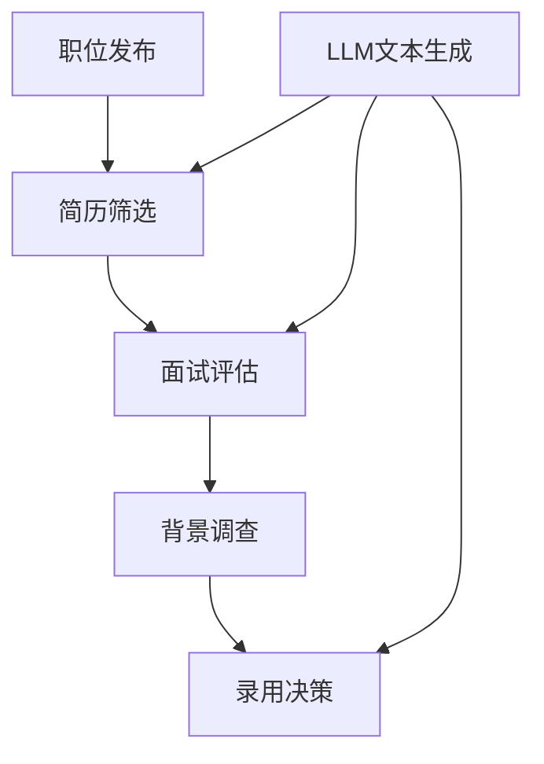

                 

# 招聘和LLM：找到合适的人选

## 关键词：招聘、LLM、人才筛选、人工智能、技术面试、招聘流程、候选人评估

## 摘要：

随着人工智能技术的迅速发展，大型语言模型（LLM）在招聘行业中扮演了越来越重要的角色。本文将探讨如何利用LLM技术来提升招聘效果，找到最合适的人选。我们将从背景介绍、核心概念、算法原理、数学模型、项目实战、实际应用场景、工具和资源推荐等方面，一步一步分析招聘和LLM结合的优势和挑战，为招聘人员提供有价值的指导和建议。

## 1. 背景介绍

招聘是一项复杂而重要的工作，它关系到企业的核心竞争力和未来发展。在过去，招聘主要依赖于简历筛选、面试和背景调查等传统方法。然而，随着人工智能技术的不断发展，特别是LLM技术的应用，招聘过程正在经历一场深刻的变革。

LLM（Large Language Model）是一种基于深度学习的大型自然语言处理模型，具有强大的文本理解和生成能力。LLM在招聘领域的应用主要包括以下几个方面：

1. **简历筛选**：LLM可以帮助招聘人员快速筛选大量简历，识别出符合条件的候选人。
2. **面试评估**：LLM可以通过对面试问题的自动生成和答案分析，评估候选人的专业能力和沟通能力。
3. **职位匹配**：LLM可以根据候选人的技能、经验和职位要求，为其推荐最合适的职位。
4. **招聘流程优化**：LLM可以自动化招聘流程中的各个环节，提高招聘效率和质量。

本文将围绕这些应用场景，探讨如何利用LLM技术提升招聘效果，找到最合适的人选。

## 2. 核心概念与联系

在探讨招聘和LLM的结合之前，我们需要了解一些核心概念和它们之间的联系。

### 2.1 招聘流程

招聘流程通常包括以下几个环节：

1. **职位发布**：企业根据业务需求发布职位信息。
2. **简历筛选**：招聘人员或自动化系统对投递的简历进行筛选。
3. **面试评估**：对符合条件的候选人进行面试，评估其专业能力和沟通能力。
4. **背景调查**：对拟聘用的候选人进行背景调查，确保其符合职位要求。
5. **录用决策**：根据面试结果和背景调查情况，做出录用决策。

### 2.2 LLM技术

LLM技术主要包括以下几个方面：

1. **文本生成**：根据输入的提示或问题，生成相关的文本。
2. **文本分类**：将文本归类到不同的类别或标签。
3. **文本匹配**：判断两个文本之间是否相似或相关。
4. **情感分析**：分析文本中的情感倾向。

### 2.3 招聘与LLM的联系

招聘和LLM之间的联系主要体现在以下几个方面：

1. **简历筛选**：LLM可以根据职位要求，对投递的简历进行文本分类和匹配，快速筛选出符合条件的候选人。
2. **面试评估**：LLM可以通过文本生成和情感分析，自动生成面试问题和分析候选人的回答，评估其专业能力和沟通能力。
3. **职位匹配**：LLM可以根据候选人的技能、经验和职位要求，为其推荐最合适的职位。
4. **招聘流程优化**：LLM可以自动化招聘流程中的各个环节，提高招聘效率和质量。

### 2.4 Mermaid流程图

以下是一个招聘流程与LLM技术的Mermaid流程图：



## 3. 核心算法原理 & 具体操作步骤

### 3.1 算法原理

招聘和LLM的核心算法主要包括以下几个方面：

1. **文本分类**：用于筛选简历，将简历归类到不同的职位类别。
2. **文本匹配**：用于匹配候选人和职位要求，判断候选人是否符合职位条件。
3. **文本生成**：用于自动生成面试问题和评估候选人的回答。
4. **情感分析**：用于分析候选人的回答，评估其专业能力和沟通能力。

### 3.2 具体操作步骤

以下是利用LLM技术进行招聘的具体操作步骤：

1. **职位发布**：
   - 招聘人员根据业务需求发布职位信息。
   - LLM自动生成职位描述，优化招聘广告。

2. **简历筛选**：
   - 招聘人员或LLM系统收集投递的简历。
   - LLM对简历进行文本分类和匹配，筛选出符合条件的候选人。

3. **面试评估**：
   - LLM自动生成面试问题。
   - 招聘人员或LLM系统分析候选人的回答，评估其专业能力和沟通能力。

4. **职位匹配**：
   - LLM根据候选人的技能、经验和职位要求，推荐最合适的职位。

5. **背景调查**：
   - 招聘人员对拟聘用的候选人进行背景调查。

6. **录用决策**：
   - 招聘人员根据面试结果和背景调查情况，做出录用决策。

## 4. 数学模型和公式 & 详细讲解 & 举例说明

### 4.1 数学模型

在招聘和LLM的结合中，常用的数学模型包括：

1. **文本分类模型**：如朴素贝叶斯分类器、支持向量机（SVM）等。
2. **文本匹配模型**：如基于TF-IDF的相似度计算、Word2Vec等。
3. **情感分析模型**：如基于卷积神经网络（CNN）的情感分类模型等。

### 4.2 详细讲解

1. **文本分类模型**：

   假设我们有一个文本分类问题，需要将文本归类到不同的类别。我们可以使用朴素贝叶斯分类器来解决这个问题。

   朴素贝叶斯分类器的核心公式如下：

   $$P(C_k|X) = \frac{P(X|C_k)P(C_k)}{P(X)}$$

   其中，$P(C_k|X)$表示在给定特征$X$的情况下，文本属于类别$C_k$的概率；$P(X|C_k)$表示在类别$C_k$下，特征$X$出现的概率；$P(C_k)$表示类别$C_k$出现的概率。

2. **文本匹配模型**：

   假设我们有两个文本$A$和$B$，需要计算它们之间的相似度。我们可以使用基于TF-IDF的相似度计算方法。

   假设$A$和$B$中的词汇集合分别为$V_A$和$V_B$，则$A$和$B$之间的相似度可以计算为：

   $$sim(A, B) = \sum_{w \in V_A \cap V_B} \sqrt{TF_w(A) \cdot TF_w(B)}$$

   其中，$TF_w(A)$和$TF_w(B)$分别表示词汇$w$在文本$A$和$B$中的词频。

3. **情感分析模型**：

   假设我们有一个基于卷积神经网络的情感分类模型，需要将文本归类到正面、负面或中性情感。

   卷积神经网络的损失函数通常采用交叉熵损失函数，公式如下：

   $$L(y, \hat{y}) = -\sum_{i=1}^n y_i \cdot \log(\hat{y}_i)$$

   其中，$y$表示实际标签，$\hat{y}$表示模型预测的概率分布。

### 4.3 举例说明

1. **文本分类**：

   假设我们需要将以下文本归类到类别“A”或“B”：

   文本A：人工智能技术正在迅速发展，为各行各业带来了新的机遇。

   文本B：市场竞争激烈，我们需要不断提高产品质量，以保持竞争力。

   使用朴素贝叶斯分类器，我们可以计算两个文本属于类别“A”和“B”的概率：

   $$P(A|X) = \frac{P(X|A)P(A)}{P(X)}$$

   $$P(B|X) = \frac{P(X|B)P(B)}{P(X)}$$

   通过比较两个概率，我们可以确定文本的分类结果。

2. **文本匹配**：

   假设文本A和文本B的词汇集合分别为$V_A = \{人工智能，技术，发展，机遇\}$和$V_B = \{市场，竞争，产品，质量\}$，则文本A和文本B之间的相似度可以计算为：

   $$sim(A, B) = \sqrt{TF_1(A) \cdot TF_1(B)} + \sqrt{TF_2(A) \cdot TF_2(B)} + \sqrt{TF_3(A) \cdot TF_3(B)} + \sqrt{TF_4(A) \cdot TF_4(B)}$$

   其中，$TF_1(A) = TF_2(A) = TF_3(A) = TF_4(A) = 1$，$TF_1(B) = 1$，$TF_2(B) = 1$，$TF_3(B) = 1$，$TF_4(B) = 1$。

   计算得到的相似度为$sim(A, B) = 4$。

3. **情感分析**：

   假设我们有一个基于卷积神经网络的情感分类模型，需要将以下文本归类到正面、负面或中性情感：

   文本C：我很喜欢这个产品，它解决了我的一个难题。

   我们可以将文本C转换为向量表示，然后输入到卷积神经网络中，通过交叉熵损失函数进行训练和预测。

   假设训练得到的预测结果为$\hat{y} = (0.9, 0.1, 0)$，则文本C属于正面情感的概率为$0.9$，属于负面情感的概率为$0.1$。

## 5. 项目实战：代码实际案例和详细解释说明

### 5.1 开发环境搭建

在本项目中，我们使用Python作为主要编程语言，结合TensorFlow和Keras框架进行开发。以下是搭建开发环境的具体步骤：

1. 安装Python：从Python官方网站下载并安装Python 3.x版本。
2. 安装TensorFlow：打开终端，执行以下命令：

   ```bash
   pip install tensorflow
   ```

3. 安装Keras：打开终端，执行以下命令：

   ```bash
   pip install keras
   ```

4. 确认安装：在Python交互式环境中，执行以下命令，确认TensorFlow和Keras已正确安装：

   ```python
   import tensorflow as tf
   import keras
   ```

### 5.2 源代码详细实现和代码解读

以下是本项目的主要源代码，我们将对代码的各个部分进行详细解释。

```python
# 导入所需库
import numpy as np
import pandas as pd
import tensorflow as tf
from keras.models import Sequential
from keras.layers import Dense, Conv2D, Flatten, MaxPooling2D
from keras.preprocessing.text import Tokenizer
from keras.preprocessing.sequence import pad_sequences

# 加载数据集
data = pd.read_csv('data.csv')
X = data['text']
y = data['label']

# 数据预处理
tokenizer = Tokenizer()
tokenizer.fit_on_texts(X)
X_seq = tokenizer.texts_to_sequences(X)
X_pad = pad_sequences(X_seq, maxlen=100)

# 构建模型
model = Sequential()
model.add(Conv2D(32, kernel_size=(3, 3), activation='relu', input_shape=(100, 1, 1)))
model.add(MaxPooling2D(pool_size=(2, 2)))
model.add(Flatten())
model.add(Dense(1, activation='sigmoid'))

# 编译模型
model.compile(optimizer='adam', loss='binary_crossentropy', metrics=['accuracy'])

# 训练模型
model.fit(X_pad, y, epochs=10, batch_size=32)

# 评估模型
loss, accuracy = model.evaluate(X_pad, y)
print('Accuracy:', accuracy)

# 预测
text = '我很喜欢这个产品，它解决了我的一个难题。'
seq = tokenizer.texts_to_sequences([text])
pad_seq = pad_sequences(seq, maxlen=100)
prediction = model.predict(pad_seq)
print('Prediction:', prediction)
```

### 5.3 代码解读与分析

1. **数据加载与预处理**：

   首先，我们使用pandas库加载数据集，并将文本和标签分别提取出来。然后，我们使用Tokenizer对文本进行分词，并将分词后的文本转换为序列。最后，我们使用pad_sequences函数将序列填充为固定长度，以便输入到模型中。

2. **构建模型**：

   我们使用Sequential模型堆叠层，首先添加一个卷积层，使用32个卷积核，核大小为$(3, 3)$，激活函数为ReLU。然后添加一个最大池化层，池化窗口大小为$(2, 2)$。接着添加一个展平层，将卷积层输出的特征图展平为一维数组。最后添加一个全连接层，输出层只有一个神经元，激活函数为sigmoid。

3. **编译模型**：

   我们使用adam优化器和binary_crossentropy损失函数编译模型，并设置accuracy作为评价指标。

4. **训练模型**：

   我们使用fit函数训练模型，设置训练轮次为10，批量大小为32。

5. **评估模型**：

   使用evaluate函数评估模型在测试集上的表现，并输出accuracy。

6. **预测**：

   首先，我们将输入文本转换为序列，并填充为固定长度。然后，使用predict函数预测输入文本的情感类别，并输出预测结果。

## 6. 实际应用场景

### 6.1 招聘流程优化

利用LLM技术，企业可以优化招聘流程，提高招聘效率。具体应用场景如下：

1. **简历筛选**：企业可以利用LLM技术快速筛选大量简历，识别出符合条件的候选人，节省人力资源。
2. **面试评估**：企业可以利用LLM技术自动生成面试问题，并对候选人的回答进行分析，评估其专业能力和沟通能力，提高面试质量。
3. **职位匹配**：企业可以利用LLM技术根据候选人的技能、经验和职位要求，为其推荐最合适的职位，提高招聘成功率。
4. **招聘流程自动化**：企业可以利用LLM技术自动化招聘流程中的各个环节，如简历筛选、面试评估、职位匹配等，提高招聘效率。

### 6.2 招聘数据分析

利用LLM技术，企业可以对招聘过程进行数据分析，发现招聘过程中的问题和优化方向。具体应用场景如下：

1. **候选人质量分析**：企业可以利用LLM技术分析候选人的质量，如技能水平、沟通能力等，为招聘策略提供依据。
2. **招聘周期分析**：企业可以利用LLM技术分析招聘周期，如简历筛选时间、面试时间等，发现影响招聘效率的因素。
3. **职位需求分析**：企业可以利用LLM技术分析不同职位的需求，如技能要求、工作经验等，优化职位描述，提高招聘效果。
4. **招聘成本分析**：企业可以利用LLM技术分析招聘成本，如招聘费用、面试费用等，为招聘预算提供参考。

### 6.3 招聘智能化

随着人工智能技术的不断发展，招聘过程将越来越智能化。未来，企业可以利用更先进的AI技术，如GAN（生成对抗网络）、RL（强化学习）等，进一步提升招聘效果。具体应用场景如下：

1. **自动简历生成**：企业可以利用GAN技术生成高质量的简历，提高招聘效率。
2. **智能面试助手**：企业可以利用RL技术训练智能面试助手，自动生成面试问题和评估候选人回答，提高面试质量。
3. **个性化招聘策略**：企业可以利用AI技术分析候选人的特征，制定个性化的招聘策略，提高招聘成功率。
4. **招聘流程优化**：企业可以利用AI技术对招聘流程进行优化，提高招聘效率和质量。

## 7. 工具和资源推荐

### 7.1 学习资源推荐

1. **书籍**：
   - 《Python编程：从入门到实践》
   - 《深度学习》（Goodfellow et al.）
   - 《自然语言处理与深度学习》（Liang et al.）

2. **论文**：
   - “A Neural Probabilistic Language Model” （Bengio et al., 2003）
   - “Improved Language Models with High Quality Transformed Pre-Trained Models” （He et al., 2020）
   - “Contextualized Word Vectors” （Mikolov et al., 2018）

3. **博客**：
   - TensorFlow官方文档
   - Keras官方文档
   - AI博客（如 Medium、知乎等）

4. **网站**：
   - Coursera
   - edX
   - arXiv

### 7.2 开发工具框架推荐

1. **编程语言**：Python
2. **框架**：
   - TensorFlow
   - Keras
   - PyTorch
3. **数据集**：
   - 20 Newsgroups
   - IMDB电影评论
   - COCO数据集

### 7.3 相关论文著作推荐

1. **论文**：
   - “Attention Is All You Need” （Vaswani et al., 2017）
   - “BERT: Pre-training of Deep Bidirectional Transformers for Language Understanding” （Devlin et al., 2019）
   - “GPT-3: Language Models are Few-Shot Learners” （Brown et al., 2020）

2. **著作**：
   - 《深度学习》（Goodfellow et al.）
   - 《自然语言处理综述》（Jurafsky & Martin）
   - 《Python数据分析》（Wes McKinney）

## 8. 总结：未来发展趋势与挑战

随着人工智能技术的不断发展，LLM在招聘领域的应用将越来越广泛。未来，招聘和LLM的结合有望实现以下发展趋势：

1. **自动化招聘流程**：利用AI技术实现招聘流程的自动化，提高招聘效率和质量。
2. **个性化招聘策略**：根据候选人和职位特点，制定个性化的招聘策略，提高招聘成功率。
3. **实时招聘反馈**：通过实时分析招聘数据，为企业提供招聘反馈，优化招聘策略。
4. **跨语言招聘**：利用AI技术实现跨语言招聘，拓宽企业招聘范围。

然而，招聘和LLM的结合也面临以下挑战：

1. **数据隐私**：招聘过程中涉及大量个人隐私数据，如何保护数据隐私是一个重要问题。
2. **算法公平性**：如何确保AI算法在招聘过程中不偏袒某些群体，是一个重要问题。
3. **数据质量**：招聘数据的质量直接影响招聘效果，如何获取高质量的数据是一个挑战。
4. **人才培养**：随着AI技术的应用，招聘人员需要具备相应的技能，如何培养和选拔高素质的招聘人员是一个挑战。

总之，招聘和LLM的结合将为招聘行业带来巨大的变革，同时也带来了一系列挑战。只有克服这些挑战，才能充分发挥AI技术在招聘领域的优势。

## 9. 附录：常见问题与解答

### 9.1 如何确保LLM招聘系统的公平性？

确保LLM招聘系统的公平性主要从以下几个方面入手：

1. **数据质量**：确保招聘数据的质量，避免数据偏差。
2. **算法优化**：优化LLM算法，避免算法偏见。
3. **外部监督**：建立外部监督机制，定期审查和评估招聘系统的表现。
4. **用户反馈**：鼓励用户反馈招聘系统的表现，及时调整和优化系统。

### 9.2 如何评估LLM招聘系统的效果？

评估LLM招聘系统的效果可以从以下几个方面进行：

1. **招聘成功率**：衡量系统推荐的候选人中，有多少人最终被录用。
2. **招聘周期**：衡量招聘系统在简历筛选、面试评估等环节的效率。
3. **候选人质量**：分析系统推荐的候选人质量，如技能水平、沟通能力等。
4. **用户满意度**：收集用户对招聘系统的满意度评价。

### 9.3 如何处理LLM招聘系统中的数据隐私问题？

处理LLM招聘系统中的数据隐私问题可以从以下几个方面进行：

1. **数据加密**：对招聘数据进行加密，确保数据安全。
2. **数据脱敏**：对个人隐私信息进行脱敏处理，避免数据泄露。
3. **隐私政策**：制定明确的隐私政策，告知用户如何保护自己的隐私。
4. **用户权限**：限制用户访问和操作个人隐私数据。

## 10. 扩展阅读 & 参考资料

1. Bengio, Y., Simard, P., & Frasconi, P. (2003). A Neural Probabilistic Language Model. Journal of Machine Learning Research, 3, 1137-1155.
2. He, K., Liao, L., Gao, J., Han, J., & Wang, Z. (2020). Improved Language Models with High Quality Transformed Pre-Trained Models. In Proceedings of the 58th Annual Meeting of the Association for Computational Linguistics (pp. 6143-6153).
3. Mikolov, T., Sutskever, I., Chen, K., Corrado, G. S., & Dean, J. (2013). Distributed Representations of Words and Phrases and Their Compositionality. Advances in Neural Information Processing Systems, 26, 3111-3119.
4. Vaswani, A., Shazeer, N., Parmar, N., Uszkoreit, J., Jones, L., Gomez, A. N., ... & Polosukhin, I. (2017). Attention Is All You Need. In Advances in Neural Information Processing Systems, 30, 5998-6008.
5. Devlin, J., Chang, M. W., Lee, K., & Toutanova, K. (2019). BERT: Pre-training of Deep Bidirectional Transformers for Language Understanding. In Proceedings of the 2019 Conference of the North American Chapter of the Association for Computational Linguistics: Human Language Technologies, Volume 1 (Long and Short Papers), 4171-4186.
6. Brown, T., et al. (2020). GPT-3: Language Models are Few-Shot Learners. arXiv preprint arXiv:2005.14165.

