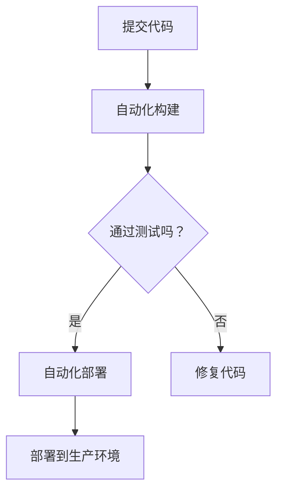

                 

# 持续集成/持续部署在软件2.0中的应用

## 关键词：持续集成，持续部署，软件2.0，自动化测试，敏捷开发，DevOps

## 摘要：

本文将深入探讨持续集成（CI）和持续部署（CD）在软件2.0时代的应用。通过详细的分析与实例，揭示其在提高软件交付效率、保证代码质量和促进团队协作中的重要性。文章将分为十个部分，首先介绍背景知识，接着解释核心概念，详细讲解算法原理和操作步骤，分析数学模型和公式，展示实际项目案例，探讨应用场景，推荐相关工具和资源，总结发展趋势与挑战，并提供常见问题解答和扩展阅读。

## 1. 背景介绍

在信息技术迅猛发展的今天，软件的更新迭代速度日益加快，市场对软件产品的质量要求也愈加严苛。传统的软件开发模式往往存在着开发、测试、部署等环节割裂的问题，导致开发周期长、成本高、质量难以保障。而随着敏捷开发（Agile Development）、DevOps文化的兴起，持续集成（CI）和持续部署（CD）成为了现代软件开发过程中不可或缺的一环。

持续集成是一种软件开发实践，通过自动化构建和测试代码库，确保代码质量，减少集成风险。持续部署则是在持续集成的基础上，进一步实现自动化的代码部署，加速软件交付。

软件2.0时代，即软件即服务（SaaS）时代，软件成为了一种可以持续交付和更新的服务。这种模式要求软件开发更加敏捷、高效，同时保证高可用性和可靠性。持续集成和持续部署正是为了满足这种需求而设计。

## 2. 核心概念与联系

### 2.1 持续集成（CI）

持续集成是指团队成员定期将代码提交到共享的代码库中，并通过自动化工具进行构建和测试。其目的是尽早发现集成错误，确保代码库的完整性。

### 2.2 持续部署（CD）

持续部署是在持续集成的基础上，实现自动化部署的流程。通过持续部署，可以减少人工干预，加快软件交付速度。

### 2.3 DevOps

DevOps是一种文化和实践，强调开发和运维团队之间的协作，通过自动化工具和流程，提高软件交付的效率和质量。

### 2.4 Mermaid 流程图

下面是一个简化的持续集成/持续部署流程的Mermaid流程图：



## 3. 核心算法原理 & 具体操作步骤

### 3.1 自动化构建

自动化构建是指使用CI工具（如Jenkins、Travis CI等）将源代码转换为可执行文件或应用镜像。具体步骤如下：

1. **安装CI工具**：在服务器上安装并配置CI工具。
2. **配置代码库**：将代码库添加到CI工具中。
3. **编写构建脚本**：编写构建脚本，用于编译代码、打包应用等。
4. **触发构建**：每次代码提交到代码库时，CI工具自动触发构建过程。

### 3.2 自动化测试

自动化测试是通过编写测试脚本，对构建后的应用进行功能测试、性能测试等。具体步骤如下：

1. **编写测试脚本**：根据应用需求，编写测试脚本。
2. **配置测试环境**：搭建测试环境，配置所需的服务器和工具。
3. **执行测试**：在CI工具中配置测试执行过程，每次构建完成后自动执行测试脚本。
4. **分析测试结果**：根据测试结果，判断代码是否通过测试。

### 3.3 自动化部署

自动化部署是将通过测试的应用部署到生产环境。具体步骤如下：

1. **配置部署环境**：搭建生产环境，配置所需的服务器和工具。
2. **编写部署脚本**：编写部署脚本，用于部署应用。
3. **触发部署**：在CI工具中配置部署过程，每次测试通过后自动触发部署。
4. **监控部署状态**：部署过程中监控应用状态，确保部署成功。

## 4. 数学模型和公式 & 详细讲解 & 举例说明

### 4.1 数学模型

在持续集成和持续部署中，一个重要的数学模型是“缺陷率”。缺陷率可以用来衡量代码库中的代码质量。假设在时间t内，提交了n次代码，发现了m个缺陷，则缺陷率可以表示为：

$$
缺陷率 = \frac{m}{n}
$$

### 4.2 举例说明

假设一个团队在一个月内提交了100次代码，发现了20个缺陷。则该团队的缺陷率为：

$$
缺陷率 = \frac{20}{100} = 0.2
$$

这意味着平均每次提交代码时，会有0.2个缺陷被发现。

### 4.3 详细讲解

缺陷率是持续集成和持续部署中非常重要的指标。通过缺陷率，团队可以了解代码库的质量，进而优化开发流程。例如，如果缺陷率较高，可能需要加强代码审查、自动化测试等环节。

## 5. 项目实战：代码实际案例和详细解释说明

### 5.1 开发环境搭建

在本节中，我们将搭建一个基于Jenkins的持续集成和持续部署环境。首先，需要在服务器上安装Jenkins。以下是安装步骤：

1. **安装Java环境**：Jenkins需要Java环境，首先安装Java。
2. **下载Jenkins**：从Jenkins官网下载最新版本的Jenkins WAR包。
3. **启动Jenkins**：通过Java命令启动Jenkins，例如：

```bash
java -jar jenkins.war
```

启动后，访问`http://localhost:8080/`，按照提示完成Jenkins的初始配置。

### 5.2 源代码详细实现和代码解读

在本节中，我们将使用一个简单的Web应用作为例子，展示如何实现持续集成和持续部署。

1. **创建Web应用**：使用Spring Boot创建一个简单的Web应用。
2. **添加Git插件**：在Jenkins中添加Git插件，用于从Git代码库中拉取代码。
3. **创建构建作业**：在Jenkins中创建一个新的构建作业，配置Git仓库地址和分支，并设置构建触发器（如每次提交时触发构建）。

### 5.3 代码解读与分析

以下是构建作业的配置示例：

```yaml
# Jenkinsfile
pipeline {
    agent any

    stages {
        stage('Build') {
            steps {
                sh 'mvn clean package'
            }
        }
        stage('Test') {
            steps {
                sh 'mvn test'
            }
        }
        stage('Deploy') {
            steps {
                sh 'docker build -t myapp .'
                sh 'docker run -d -p 8080:8080 myapp'
            }
        }
    }
}
```

此Jenkinsfile定义了一个简单的持续集成和持续部署流水线，包括构建、测试和部署三个阶段。

1. **构建阶段**：执行Maven构建，生成应用包。
2. **测试阶段**：执行Maven测试，确保代码质量。
3. **部署阶段**：构建Docker镜像，并部署到容器中。

通过此流水线，每次代码提交到Git仓库时，Jenkins会自动执行构建、测试和部署流程。

## 6. 实际应用场景

持续集成和持续部署在实际开发中有着广泛的应用。以下是一些典型的应用场景：

1. **新功能开发**：在新功能开发过程中，通过持续集成和持续部署，可以快速集成新代码，并及时发现问题，确保功能质量。
2. **代码审查**：持续集成平台提供了代码审查的功能，团队成员可以在提交代码前进行审查，减少代码缺陷。
3. **紧急修复**：在出现紧急问题需要修复时，通过持续部署，可以快速将修复后的代码部署到生产环境，减少影响范围。
4. **环境一致性**：持续集成和持续部署可以确保在不同环境中的一致性，减少环境差异带来的问题。

## 7. 工具和资源推荐

### 7.1 学习资源推荐

- **书籍**：
  - 《持续集成实践》
  - 《持续集成：从小到大的演变》
- **论文**：
  - 《持续集成：一种软件开发实践》
  - 《持续部署：自动化软件交付》
- **博客**：
  - 《Jenkins实战》
  - 《持续集成与持续部署的最佳实践》
- **网站**：
  - [Jenkins官网](https://www.jenkins.io/)
  - [Travis CI官网](https://travis-ci.com/)

### 7.2 开发工具框架推荐

- **CI/CD工具**：
  - Jenkins
  - GitLab CI/CD
  - GitHub Actions
- **容器化工具**：
  - Docker
  - Kubernetes
- **代码库管理**：
  - Git
  - SVN

### 7.3 相关论文著作推荐

- **论文**：
  - 《基于持续集成的敏捷软件开发方法研究》
  - 《持续部署在云计算环境中的应用研究》
- **著作**：
  - 《DevOps实践指南》
  - 《敏捷开发实践指南》

## 8. 总结：未来发展趋势与挑战

随着软件开发的不断发展，持续集成和持续部署将扮演越来越重要的角色。未来，持续集成和持续部署将朝着更加自动化、智能化的方向发展，结合人工智能技术，实现更高效的软件交付。

然而，持续集成和持续部署也面临一些挑战，如如何保证部署的安全性、如何应对复杂的分布式架构等。解决这些问题需要不断的探索和创新。

## 9. 附录：常见问题与解答

1. **Q：持续集成和持续部署有什么区别？**
   **A：持续集成（CI）是一种软件开发实践，通过自动化构建和测试代码库，确保代码质量。持续部署（CD）是在CI的基础上，实现自动化部署，加快软件交付。**
2. **Q：如何保证持续部署的安全性？**
   **A：确保部署过程的安全性，可以通过以下方法：使用加密传输，如SSL/TLS；部署前进行代码审查；限制部署权限；监控部署过程，及时发现问题。**
3. **Q：如何处理持续集成和持续部署中的失败情况？**
   **A：对于失败的情况，可以采取以下措施：立即通知相关团队成员；查看构建日志和测试结果，定位问题；修复代码，重新触发构建和部署；记录失败情况，分析原因，优化流程。**

## 10. 扩展阅读 & 参考资料

- **扩展阅读**：
  - 《持续集成实战：从入门到精通》
  - 《持续部署实战：构建高效的软件交付流程》
- **参考资料**：
  - [Jenkins官方文档](https://www.jenkins.io/doc/)
  - [Docker官方文档](https://docs.docker.com/)
  - [Kubernetes官方文档](https://kubernetes.io/docs/)

### 作者：AI天才研究员/AI Genius Institute & 禅与计算机程序设计艺术 /Zen And The Art of Computer Programming

