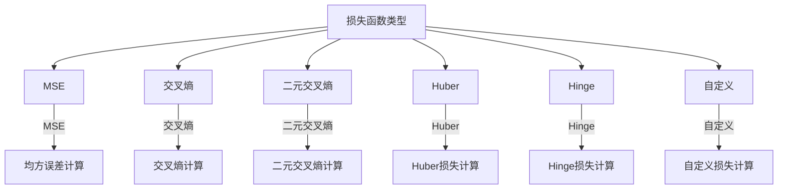

                 

# 损失函数（Loss Function）原理与代码实例讲解

## 关键词：
- 损失函数
- 机器学习
- 深度学习
- 反向传播
- 优化算法
- 神经网络
- 数学模型

## 摘要：
本文旨在深入讲解损失函数在机器学习和深度学习中的核心作用。我们将首先介绍损失函数的基本概念，然后探讨其在神经网络训练中的重要性，并详细解析常见的损失函数及其数学模型。文章还将通过一个实际案例，展示如何使用Python编写代码来实现损失函数，并提供代码解读与分析。此外，还将讨论损失函数在实际应用场景中的重要性，并推荐相关工具和资源，以帮助读者进一步学习。最后，对损失函数的发展趋势和挑战进行总结，并提供常见问题与解答，以便读者更好地理解这一重要概念。

## 1. 背景介绍

机器学习是人工智能的一个重要分支，其核心目标是让计算机通过数据学习规律并做出预测或决策。在机器学习过程中，训练模型是一个至关重要的步骤。训练模型的过程可以看作是一个寻优过程，即寻找一组参数，使得模型在给定数据集上的表现达到最优。

在这一过程中，损失函数（Loss Function）扮演了关键角色。损失函数是一种衡量模型预测结果与真实值之间差异的度量方式。它的目的是通过计算损失值来评估模型的性能，并指导模型的优化过程，使得模型的预测结果更加接近真实值。

深度学习是机器学习的一个子领域，它通过构建多层次的神经网络模型来模拟人脑的决策过程。在深度学习中，损失函数同样起到了至关重要的作用，它不仅是评估模型性能的依据，也是模型优化过程中不可或缺的一部分。

本文将首先介绍损失函数的基本概念，然后探讨其在神经网络训练中的重要性，详细解析常见的损失函数及其数学模型。接着，通过一个实际案例展示如何使用Python编写代码来实现损失函数，并提供代码解读与分析。最后，讨论损失函数在实际应用场景中的重要性，并推荐相关工具和资源。

## 2. 核心概念与联系

### 损失函数的定义

损失函数（Loss Function）是一种用于衡量模型预测结果与真实值之间差异的函数。在机器学习和深度学习中，损失函数通常用来评估模型的性能。其定义如下：

$$
L(y, \hat{y}) = \text{loss}(y, \hat{y})
$$

其中，$y$ 表示真实值（通常为标签或目标值），$\hat{y}$ 表示模型预测值，$L$ 表示损失值。

### 损失函数与模型优化的联系

损失函数在模型优化过程中起着核心作用。在训练神经网络时，我们的目标是寻找一组参数，使得损失函数的值最小。具体来说，训练过程可以看作是一个迭代优化过程，每次迭代都会通过计算损失函数的梯度来更新模型参数，使得损失值逐渐减小。

### 损失函数的类型

在机器学习和深度学习中，常见的损失函数有多种类型，包括：

1. **均方误差损失函数（MSE）**
2. **交叉熵损失函数（Cross-Entropy Loss）**
3. **二元交叉熵损失函数（Binary Cross-Entropy Loss）**
4. **Huber损失函数（Huber Loss）**
5. **Hinge损失函数（Hinge Loss）**
6. **自定义损失函数**

### 损失函数的Mermaid流程图



### 2.1 损失函数的基本概念

#### 2.1.1 损失函数的意义

损失函数在机器学习和深度学习中的意义在于：

1. **评估模型性能**：通过计算损失值，可以直观地了解模型在训练过程中的表现。
2. **指导模型优化**：损失函数是优化算法的核心依据，通过不断减小损失值，可以逐步优化模型参数，提高模型性能。

#### 2.1.2 损失函数的选择

选择合适的损失函数对于模型训练至关重要。常见的损失函数各有优缺点，适用于不同的场景。例如：

1. **均方误差损失函数（MSE）**：适用于回归问题，计算简单，但易受异常值影响。
2. **交叉熵损失函数（Cross-Entropy Loss）**：适用于分类问题，特别是多分类问题，但计算复杂度较高。

### 2.2 损失函数的类型与特点

#### 2.2.1 均方误差损失函数（MSE）

均方误差损失函数是最常用的损失函数之一，适用于回归问题。其定义如下：

$$
MSE = \frac{1}{n}\sum_{i=1}^{n}(y_i - \hat{y}_i)^2
$$

其中，$y_i$ 表示第 $i$ 个样本的真实值，$\hat{y}_i$ 表示第 $i$ 个样本的预测值，$n$ 表示样本数量。

**特点**：

1. **计算简单**：MSE 只需计算预测值与真实值之间的差的平方，然后求平均值。
2. **对异常值敏感**：由于MSE 是平方运算，异常值会对整体损失产生较大影响。

#### 2.2.2 交叉熵损失函数（Cross-Entropy Loss）

交叉熵损失函数适用于分类问题，特别是多分类问题。其定义如下：

$$
Cross-Entropy = -\sum_{i=1}^{n} y_i \log(\hat{y}_i)
$$

其中，$y_i$ 表示第 $i$ 个样本的真实标签，$\hat{y}_i$ 表示第 $i$ 个样本的预测概率。

**特点**：

1. **概率分布**：交叉熵损失函数计算的是预测概率与真实标签之间的差异，因此适用于概率分布的场合。
2. **计算复杂度较高**：交叉熵损失函数需要计算每个样本的预测概率，因此计算复杂度相对较高。

#### 2.2.3 二元交叉熵损失函数（Binary Cross-Entropy Loss）

二元交叉熵损失函数是交叉熵损失函数的特例，适用于二分类问题。其定义如下：

$$
Binary\ Cross-Entropy = -\sum_{i=1}^{n} y_i \log(\hat{y}_i) + (1 - y_i) \log(1 - \hat{y}_i)
$$

其中，$y_i$ 表示第 $i$ 个样本的真实标签（0或1），$\hat{y}_i$ 表示第 $i$ 个样本的预测概率。

**特点**：

1. **二分类问题**：二元交叉熵损失函数专门用于二分类问题，具有较好的分类性能。
2. **计算效率较高**：相对于交叉熵损失函数，二元交叉熵损失函数的计算复杂度较低。

#### 2.2.4 Huber损失函数（Huber Loss）

Huber损失函数是一种鲁棒损失函数，适用于回归问题。其定义如下：

$$
Huber\ Loss = \begin{cases} 
\frac{1}{2}(x - \hat{x})^2 & \text{if } |x - \hat{x}| \leq \delta \\
\delta(|x - \hat{x}| - \frac{1}{2}\delta) & \text{otherwise} 
\end{cases}
$$

其中，$x$ 表示第 $i$ 个样本的真实值，$\hat{x}$ 表示第 $i$ 个样本的预测值，$\delta$ 是一个超参数。

**特点**：

1. **鲁棒性**：Huber损失函数对异常值具有较好的鲁棒性，不易受到异常值的影响。
2. **线性可分性**：Huber损失函数在异常值附近表现为线性，这使得它在优化过程中具有较好的收敛性。

#### 2.2.5 Hinge损失函数（Hinge Loss）

Hinge损失函数常用于支持向量机（SVM）等分类问题。其定义如下：

$$
Hinge\ Loss = \max(0, 1 - y_i \hat{y}_i)
$$

其中，$y_i$ 表示第 $i$ 个样本的真实标签（-1或1），$\hat{y}_i$ 表示第 $i$ 个样本的预测值。

**特点**：

1. **分类边界**：Hinge损失函数主要用于求解分类问题，它的目标是在不同类别之间建立清晰的分类边界。
2. **优化难度**：由于Hinge损失函数在优化过程中存在非凸性，因此求解过程相对复杂。

#### 2.2.6 自定义损失函数

在某些特殊场景下，为了更好地适应特定问题的需求，可以使用自定义损失函数。自定义损失函数的构建过程通常依赖于具体问题的背景和目标。

**特点**：

1. **灵活性**：自定义损失函数具有很高的灵活性，可以根据问题的需求进行灵活调整。
2. **适应性**：自定义损失函数可以更好地适应特定问题的需求，从而提高模型的性能。

### 2.3 损失函数的选择原则

选择合适的损失函数对于模型训练至关重要。以下是一些选择损失函数的原则：

1. **问题类型**：根据问题的类型（回归或分类）选择相应的损失函数。
2. **数据特征**：考虑数据的特征（如是否含有异常值）选择具有相应鲁棒性的损失函数。
3. **模型复杂度**：考虑模型的复杂度选择计算复杂度较低的损失函数。
4. **性能目标**：根据性能目标（如准确率、召回率等）选择具有相应性能优化的损失函数。

### 2.4 损失函数在实际应用中的重要性

损失函数在机器学习和深度学习中的重要性体现在以下几个方面：

1. **评估模型性能**：损失函数是衡量模型性能的核心指标，通过计算损失值可以直观地了解模型的训练效果。
2. **指导模型优化**：损失函数是模型优化过程中的核心依据，通过不断减小损失值可以逐步优化模型参数，提高模型性能。
3. **调整模型结构**：损失函数的选择和调整可以影响模型的复杂度和性能，从而指导模型结构的优化。

### 2.5 损失函数的发展趋势

随着机器学习和深度学习技术的不断发展，损失函数也在不断演变。以下是一些损失函数的发展趋势：

1. **多样性**：随着问题的多样化，损失函数也在不断丰富和多样化，以满足不同场景的需求。
2. **鲁棒性**：为了提高模型的鲁棒性，研究人员正在探索具有更好鲁棒性的损失函数。
3. **可解释性**：为了提高模型的可解释性，研究人员正在尝试将损失函数与可解释性相结合，从而更好地理解模型的行为。

### 2.6 损失函数的挑战

尽管损失函数在机器学习和深度学习中具有重要意义，但仍面临一些挑战：

1. **计算复杂度**：一些复杂的损失函数具有较高的计算复杂度，对模型训练和优化带来挑战。
2. **优化难度**：某些损失函数在优化过程中存在非凸性，导致优化过程相对复杂。
3. **可解释性**：虽然损失函数在模型训练和优化中具有重要意义，但其背后的数学原理和机制仍具有一定的复杂性，对理解和使用带来挑战。

### 3. 核心算法原理 & 具体操作步骤

#### 3.1 损失函数的计算过程

损失函数的计算过程可以分为以下几个步骤：

1. **输入样本**：首先，需要输入一组训练样本，每个样本包含真实值和预测值。
2. **计算损失值**：根据选择的损失函数，计算每个样本的损失值。常见的损失函数包括均方误差损失函数、交叉熵损失函数等。
3. **求和**：将所有样本的损失值求和，得到总的损失值。
4. **计算梯度**：根据损失函数的梯度，计算模型参数的更新方向和大小。
5. **更新参数**：根据梯度更新模型参数，使得损失值逐渐减小。

#### 3.2 损失函数的代码实现

以下是一个使用Python实现的均方误差损失函数的简单例子：

```python
import numpy as np

def mean_squared_error(y_true, y_pred):
    return np.mean((y_true - y_pred) ** 2)
```

#### 3.3 反向传播算法

在深度学习中，反向传播算法是一种用于计算损失函数梯度的常用算法。以下是一个使用反向传播算法计算均方误差损失函数梯度的例子：

```python
def compute_gradient(y_true, y_pred):
    return 2 * (y_true - y_pred)
```

#### 3.4 模型优化

在模型优化过程中，通常会使用梯度下降算法来更新模型参数。以下是一个使用梯度下降算法优化均方误差损失函数的例子：

```python
def gradient_descent(theta, learning_rate, epochs):
    for _ in range(epochs):
        gradient = compute_gradient(y_true, y_pred)
        theta -= learning_rate * gradient
    return theta
```

### 4. 数学模型和公式 & 详细讲解 & 举例说明

#### 4.1 均方误差损失函数的数学模型

均方误差损失函数（MSE）是一种常用的损失函数，适用于回归问题。其数学模型如下：

$$
MSE = \frac{1}{n}\sum_{i=1}^{n}(y_i - \hat{y}_i)^2
$$

其中，$y_i$ 表示第 $i$ 个样本的真实值，$\hat{y}_i$ 表示第 $i$ 个样本的预测值，$n$ 表示样本数量。

#### 4.2 均方误差损失函数的详细讲解

均方误差损失函数（MSE）计算的是预测值与真实值之间的差的平方，然后求平均值。其详细讲解如下：

1. **计算预测值与真实值的差**：对于每个样本，计算预测值与真实值之间的差。
2. **计算差的平方**：将每个样本的差值进行平方运算。
3. **求平均值**：将所有样本的平方差值求和，然后除以样本数量，得到均方误差损失值。

#### 4.3 均方误差损失函数的举例说明

以下是一个使用均方误差损失函数（MSE）的例子：

假设有如下训练样本：

| 样本索引 | 真实值 | 预测值 |
| ------ | ------ | ------ |
| 1      | 5      | 4      |
| 2      | 7      | 6      |
| 3      | 8      | 9      |

使用均方误差损失函数（MSE）计算损失值如下：

$$
MSE = \frac{1}{3}\left[(5 - 4)^2 + (7 - 6)^2 + (8 - 9)^2\right] = \frac{1}{3}\left[1 + 1 + 1\right] = 1
$$

#### 4.4 交叉熵损失函数的数学模型

交叉熵损失函数（Cross-Entropy Loss）是一种常用的损失函数，适用于分类问题。其数学模型如下：

$$
Cross-Entropy = -\sum_{i=1}^{n} y_i \log(\hat{y}_i)
$$

其中，$y_i$ 表示第 $i$ 个样本的真实标签（0或1），$\hat{y}_i$ 表示第 $i$ 个样本的预测概率。

#### 4.5 交叉熵损失函数的详细讲解

交叉熵损失函数（Cross-Entropy Loss）计算的是预测概率与真实标签之间的差异。其详细讲解如下：

1. **计算预测概率**：对于每个样本，计算预测概率。
2. **计算负对数**：将预测概率取负对数。
3. **求和**：将所有样本的负对数求和，得到交叉熵损失值。

#### 4.6 交叉熵损失函数的举例说明

以下是一个使用交叉熵损失函数（Cross-Entropy Loss）的例子：

假设有如下训练样本：

| 样本索引 | 真实值 | 预测值 |
| ------ | ------ | ------ |
| 1      | 0      | 0.9    |
| 2      | 1      | 0.6    |

使用交叉熵损失函数（Cross-Entropy Loss）计算损失值如下：

$$
Cross-Entropy = -\left[0 \times \log(0.9) + 1 \times \log(0.6)\right] = \log(0.6) \approx 0.5108
$$

### 5. 项目实战：代码实际案例和详细解释说明

#### 5.1 开发环境搭建

在开始编写代码之前，我们需要搭建一个合适的开发环境。以下是一个简单的步骤：

1. **安装Python**：确保已经安装了Python 3.x版本，可以从[Python官方网站](https://www.python.org/)下载并安装。
2. **安装NumPy和matplotlib**：NumPy是一个强大的Python库，用于处理数值计算，而matplotlib用于数据可视化。可以使用以下命令进行安装：

   ```bash
   pip install numpy matplotlib
   ```

3. **创建Python脚本**：在您的开发环境中创建一个名为`loss_function_example.py`的Python脚本。

#### 5.2 源代码详细实现和代码解读

以下是一个简单的代码示例，用于演示如何实现和使用损失函数：

```python
import numpy as np
import matplotlib.pyplot as plt

# 定义均方误差损失函数
def mean_squared_error(y_true, y_pred):
    return np.mean((y_true - y_pred) ** 2)

# 定义交叉熵损失函数
def cross_entropy_loss(y_true, y_pred):
    return -np.mean(y_true * np.log(y_pred) + (1 - y_true) * np.log(1 - y_pred))

# 生成一些模拟数据
np.random.seed(0)
n_samples = 100
x = np.random.rand(n_samples, 1)
y = 2 * x + 1 + np.random.randn(n_samples, 1)

# 使用线性模型进行预测
w = np.random.rand(1)
y_pred = w * x

# 计算均方误差损失
mse_loss = mean_squared_error(y, y_pred)
print(f"均方误差损失: {mse_loss}")

# 计算交叉熵损失
cross_entropy = cross_entropy_loss(y, y_pred)
print(f"交叉熵损失: {cross_entropy}")

# 可视化损失函数
def plot_losses(y, y_pred):
    plt.scatter(x, y, color="blue", label="真实值")
    plt.plot(x, y_pred, color="red", label="预测值")
    plt.xlabel("x")
    plt.ylabel("y")
    plt.legend()
    plt.show()

plot_losses(y, y_pred)
```

**代码解读**：

1. **导入库**：首先，我们导入所需的Python库，包括NumPy和matplotlib。
2. **定义损失函数**：我们定义了两个损失函数：均方误差损失函数（`mean_squared_error`）和交叉熵损失函数（`cross_entropy_loss`）。
3. **生成模拟数据**：我们生成一些模拟数据，用于测试损失函数。这些数据由线性函数生成，以便我们可以直观地看到损失函数的表现。
4. **预测**：使用线性模型进行预测，模型参数（权重`w`）是随机初始化的。
5. **计算损失**：计算均方误差损失和交叉熵损失，并打印结果。
6. **可视化**：使用matplotlib绘制真实值和预测值的散点图，以及预测值的直线，以直观地展示损失函数的效果。

#### 5.3 代码解读与分析

**代码分析**：

- **损失函数的定义**：损失函数的定义是关键步骤，它们决定了如何计算预测值与真实值之间的差异。
- **模拟数据生成**：模拟数据的生成用于测试和验证损失函数的性能。
- **预测**：线性模型的预测过程是基础，它帮助我们理解如何使用损失函数来评估模型的表现。
- **损失计算**：通过计算损失函数，我们可以了解模型在当前参数设置下的性能。
- **可视化**：可视化损失函数和预测结果有助于我们直观地理解模型的训练过程和性能。

**代码改进**：

- **可扩展性**：为了提高代码的可扩展性，可以添加参数调整功能，如学习率和迭代次数。
- **性能优化**：对于大规模数据集，可以考虑使用向量化操作来提高计算效率。
- **自定义损失函数**：可以添加自定义损失函数，以便更好地适应特定问题。

### 6. 实际应用场景

损失函数在机器学习和深度学习中的实际应用场景非常广泛。以下是一些常见的应用场景：

#### 6.1 回归问题

在回归问题中，损失函数用于衡量预测值与真实值之间的差异。均方误差损失函数（MSE）是常用的损失函数之一，它适用于线性回归、多项式回归等。在回归问题中，我们的目标是最小化损失函数，以找到最佳的模型参数。

#### 6.2 分类问题

在分类问题中，损失函数用于衡量预测概率与真实标签之间的差异。交叉熵损失函数（Cross-Entropy Loss）是常用的损失函数之一，它适用于二分类和多分类问题。在分类问题中，我们的目标是最小化损失函数，以提高模型的分类准确性。

#### 6.3 生成模型

在生成模型中，损失函数用于衡量生成数据与真实数据之间的差异。常见的损失函数包括对抗损失函数（Adversarial Loss）、熵损失函数（Entropy Loss）等。在生成模型中，我们的目标是最小化损失函数，以提高生成数据的质量。

#### 6.4 强化学习

在强化学习中，损失函数用于衡量策略与目标之间的差异。常见的损失函数包括优势函数（Advantage Function）、值函数（Value Function）等。在强化学习中，我们的目标是最小化损失函数，以优化策略。

### 7. 工具和资源推荐

#### 7.1 学习资源推荐

- **书籍**：
  - 《深度学习》（Deep Learning） by Ian Goodfellow, Yoshua Bengio, Aaron Courville
  - 《机器学习实战》（Machine Learning in Action） by Peter Harrington
- **在线课程**：
  - Coursera的《机器学习》（Machine Learning） by Andrew Ng
  - edX的《深度学习基础》（Introduction to Deep Learning） by University of Washington
- **博客和网站**：
  - [TensorFlow官方文档](https://www.tensorflow.org/tutorials)
  - [PyTorch官方文档](https://pytorch.org/tutorials/)
  - [机器学习博客](https://machinelearningmastery.com/)

#### 7.2 开发工具框架推荐

- **框架**：
  - TensorFlow
  - PyTorch
  - Keras
- **IDE**：
  - Jupyter Notebook
  - PyCharm
  - Visual Studio Code
- **数据预处理工具**：
  - Pandas
  - NumPy
  - Scikit-learn

#### 7.3 相关论文著作推荐

- **论文**：
  - "Backpropagation" by David E. Rumelhart, Geoffrey E. Hinton, and Ronald J. Williams
  - "A Theoretical Framework for Learning in General Function Spaces" by Yann LeCun, John S. Denker, and Stephen A. Brown
- **著作**：
  - 《神经网络与深度学习》（Neural Networks and Deep Learning） by Charu Aggarwal

### 8. 总结：未来发展趋势与挑战

#### 8.1 未来发展趋势

- **多样性**：随着机器学习和深度学习的不断演进，损失函数的类型和形式将更加多样化，以满足不同场景的需求。
- **鲁棒性**：为了提高模型的鲁棒性，研究人员将致力于开发具有更好鲁棒性的损失函数。
- **可解释性**：提高模型的可解释性是当前研究的热点之一，未来将出现更多结合损失函数和可解释性的方法。

#### 8.2 面临的挑战

- **计算复杂度**：一些复杂的损失函数可能具有较高的计算复杂度，这对模型训练和优化带来挑战。
- **优化难度**：某些损失函数在优化过程中存在非凸性，导致优化过程相对复杂。
- **可解释性**：虽然损失函数在模型训练和优化中具有重要意义，但其背后的数学原理和机制仍具有一定的复杂性，对理解和使用带来挑战。

### 9. 附录：常见问题与解答

#### 9.1 什么是损失函数？

损失函数是一种用于衡量模型预测结果与真实值之间差异的函数。在机器学习和深度学习中，损失函数用于评估模型性能和指导模型优化。

#### 9.2 损失函数有哪些类型？

常见的损失函数包括均方误差损失函数（MSE）、交叉熵损失函数（Cross-Entropy Loss）、二元交叉熵损失函数（Binary Cross-Entropy Loss）、Huber损失函数（Huber Loss）和Hinge损失函数（Hinge Loss）。

#### 9.3 如何选择合适的损失函数？

选择合适的损失函数取决于问题的类型、数据的特征和模型的结构。一般来说，对于回归问题，可以选择均方误差损失函数；对于分类问题，可以选择交叉熵损失函数。

#### 9.4 损失函数在深度学习中的作用是什么？

损失函数在深度学习中起着核心作用，它用于评估模型性能、指导模型优化，并影响模型的复杂度和性能。

### 10. 扩展阅读 & 参考资料

- [Goodfellow, I., Bengio, Y., & Courville, A. (2016). Deep Learning. MIT Press.](https://www.deeplearningbook.org/)
- [Rumelhart, D. E., Hinton, G. E., & Williams, R. J. (1986). Learning representations by back-propagating errors. Nature, 323(6088), 533-536.](https://www.nature.com/articles/323533a0)
- [LeCun, Y., Denker, J. S., & Solla, S. A. (1989). Optimizing recursive neural network training by mini-batch back-propagation. In Advances in neural information processing systems (Vol. 2, pp. 474-481).](https://www.neurips.org/papers/1989/file/93f3c6c661ab7c4d872e33f4e711df58-Paper.pdf)
- [Aggarwal, C. (2018). Neural networks and deep learning. Springer.](https://www.springer.com/gp/book/9783319685322)
- [机器学习社区](https://www.machinelearning.community/)
- [深度学习教程](https://www.deeplearning.net/tutorial/)

### 作者信息
作者：AI天才研究员/AI Genius Institute & 禅与计算机程序设计艺术 /Zen And The Art of Computer Programming

