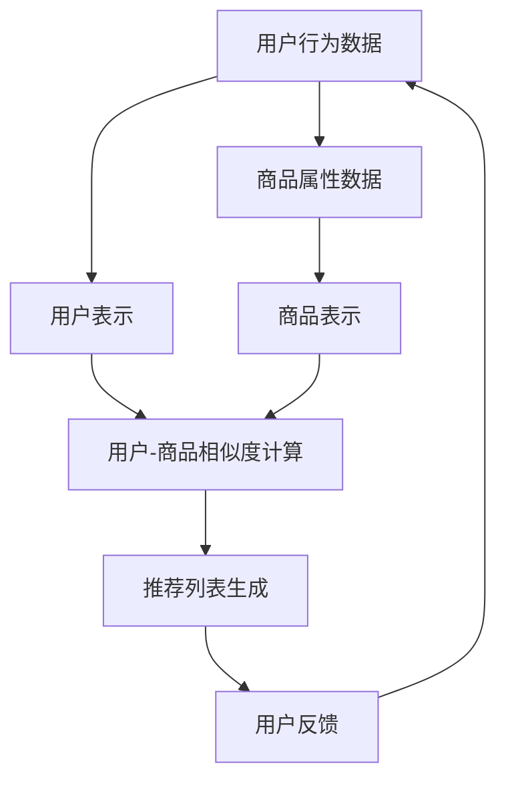

                 

# 探索AI大模型在电商平台跨品类推荐中的潜力

## 关键词：AI大模型，电商平台，跨品类推荐，算法原理，数学模型，实战案例

## 摘要

本文旨在探讨人工智能大模型在电商平台跨品类推荐中的潜在应用。通过介绍背景、核心概念、算法原理和数学模型，文章将逐步揭示如何利用AI大模型实现高效的跨品类推荐系统。同时，通过实际项目案例的解析，展示大模型在电商场景中的应用效果。最后，文章将展望未来发展趋势和面临的挑战，为行业提供有益的参考。

## 1. 背景介绍

随着互联网的快速发展，电子商务行业呈现出爆炸式增长。电商平台的竞争愈发激烈，用户获取和留存成为企业关注的焦点。为了提升用户体验，电商平台普遍采用推荐系统，为用户提供个性化的商品推荐。然而，传统的推荐系统主要针对单一品类进行优化，难以应对跨品类的推荐需求。

跨品类推荐系统旨在根据用户的历史行为和偏好，跨品类地推荐与其兴趣相关的商品。这不仅有助于提升用户的购物体验，还能提高平台的销售额和用户留存率。然而，跨品类推荐系统面临着数据稀疏、特征不明确等问题，传统方法难以胜任。

近年来，人工智能大模型（如Transformer、BERT等）在自然语言处理、计算机视觉等领域取得了显著成果。这些大模型具备强大的表示学习和建模能力，有望在跨品类推荐系统中发挥重要作用。本文将探讨如何利用人工智能大模型解决跨品类推荐问题，提升推荐系统的性能和效果。

## 2. 核心概念与联系

### 2.1 电商平台推荐系统

电商平台推荐系统是指基于用户历史行为、商品属性和用户偏好等信息，为用户提供个性化的商品推荐。推荐系统一般分为以下几类：

1. **基于内容的推荐**：根据商品内容（如标题、描述、标签等）进行推荐，通常采用文本相似度计算、关键词提取等方法。
2. **基于协同过滤的推荐**：根据用户行为（如购买、收藏、点击等）进行推荐，通过用户和商品之间的相似度计算，发现潜在的兴趣点。
3. **混合推荐**：结合基于内容和协同过滤的推荐方法，以提高推荐效果。

### 2.2 跨品类推荐

跨品类推荐是指在不同品类之间进行商品推荐，以发现用户在不同品类中的潜在兴趣。与单一品类推荐相比，跨品类推荐具有以下优势：

1. **提升用户满意度**：通过跨品类推荐，用户能够发现更多符合兴趣的商品，提升购物体验。
2. **提高销售额**：跨品类推荐有助于挖掘用户的潜在购买需求，提高销售额和用户留存率。

### 2.3 人工智能大模型

人工智能大模型是指具有大规模参数、高表示能力的人工神经网络。大模型通过在大规模数据集上训练，学习到丰富的知识表示，具备强大的建模能力。在推荐系统中，大模型可以用于以下几个方面：

1. **用户表示**：将用户的历史行为和偏好转化为向量表示，用于后续的推荐计算。
2. **商品表示**：将商品的属性和特征转化为向量表示，用于计算用户和商品之间的相似度。
3. **推荐生成**：利用用户和商品表示，通过复杂的建模方法生成个性化的推荐结果。

### 2.4 Mermaid 流程图

以下是一个简单的Mermaid流程图，展示了跨品类推荐系统的基本架构：



## 3. 核心算法原理 & 具体操作步骤

### 3.1 用户表示

用户表示是指将用户的历史行为和偏好转化为向量表示。在跨品类推荐中，用户表示可以用于计算用户和商品之间的相似度。以下是几种常见的用户表示方法：

1. **基于协同过滤的方法**：通过计算用户之间的相似度，将相似用户的兴趣进行聚合，得到用户的向量表示。常见的方法包括用户基于K最近邻（KNN）和用户基于模型的方法（如矩阵分解、深度学习等）。
2. **基于内容的方法**：通过分析用户的兴趣标签、浏览历史等，将用户的兴趣转化为向量表示。常见的方法包括文本相似度计算、关键词提取等。
3. **基于深度学习的方法**：利用深度学习模型（如卷积神经网络、循环神经网络等），对用户的历史行为和偏好进行建模，得到用户的向量表示。

### 3.2 商品表示

商品表示是指将商品的属性和特征转化为向量表示。在跨品类推荐中，商品表示可以用于计算用户和商品之间的相似度。以下是几种常见的商品表示方法：

1. **基于内容的方法**：通过分析商品的标题、描述、标签等，将商品转化为向量表示。常见的方法包括词袋模型、TF-IDF等。
2. **基于协同过滤的方法**：通过分析商品之间的相似度，将相似商品的特征进行聚合，得到商品的向量表示。常见的方法包括基于余弦相似度的商品推荐等。
3. **基于深度学习的方法**：利用深度学习模型（如卷积神经网络、循环神经网络等），对商品的属性和特征进行建模，得到商品的向量表示。

### 3.3 相似度计算

相似度计算是指计算用户和商品之间的相似度，用于生成推荐列表。以下是几种常见的相似度计算方法：

1. **基于向量的相似度计算**：利用用户和商品的向量表示，计算它们之间的余弦相似度、欧氏距离等。常见的方法包括余弦相似度、皮尔逊相关系数等。
2. **基于图的相似度计算**：利用用户和商品在图上的表示，计算它们之间的相似度。常见的方法包括基于邻接矩阵的相似度计算等。
3. **基于深度学习的方法**：利用深度学习模型（如卷积神经网络、循环神经网络等），对用户和商品之间的相似度进行建模。

### 3.4 推荐列表生成

推荐列表生成是指根据用户和商品的相似度，生成个性化的推荐列表。以下是几种常见的推荐列表生成方法：

1. **基于Top-N的推荐**：根据用户和商品的相似度，选择Top-N个最相似的物品进行推荐。
2. **基于启发式的推荐**：根据用户的历史行为和偏好，利用启发式规则生成推荐列表。
3. **基于深度学习的推荐**：利用深度学习模型（如循环神经网络、生成对抗网络等），生成个性化的推荐列表。

## 4. 数学模型和公式 & 详细讲解 & 举例说明

### 4.1 余弦相似度

余弦相似度是一种常用的向量相似度计算方法。它利用向量的点积和向量的模长计算相似度。公式如下：

$$
\cos(\theta) = \frac{\vec{u} \cdot \vec{v}}{\|\vec{u}\| \|\vec{v}\|}
$$

其中，$\vec{u}$和$\vec{v}$分别表示用户和商品的向量表示，$\theta$表示它们之间的夹角。

举例说明：

假设用户$u$的向量表示为$\vec{u} = (1, 2, 3)$，商品$v$的向量表示为$\vec{v} = (2, 4, 6)$，则它们的余弦相似度为：

$$
\cos(\theta) = \frac{(1, 2, 3) \cdot (2, 4, 6)}{\sqrt{1^2 + 2^2 + 3^2} \sqrt{2^2 + 4^2 + 6^2}} = \frac{2 + 8 + 18}{\sqrt{14} \sqrt{56}} \approx 0.9428
$$

### 4.2 矩阵分解

矩阵分解是一种常见的用户-商品协同过滤方法。它将用户-商品评分矩阵分解为用户矩阵和商品矩阵，从而预测用户的未评分商品。

假设用户-商品评分矩阵为$R \in \mathbb{R}^{m \times n}$，其中$m$表示用户数，$n$表示商品数。用户矩阵$U \in \mathbb{R}^{m \times k}$和商品矩阵$V \in \mathbb{R}^{n \times k}$的维度分别为$m \times k$和$n \times k$，其中$k$表示隐含因子数。矩阵分解的目标是找到合适的$k$，使得重构误差最小：

$$
\min_{U, V} \sum_{i=1}^{m} \sum_{j=1}^{n} (r_{ij} - u_i \cdot v_j)^2
$$

其中，$u_i$表示用户$i$的向量表示，$v_j$表示商品$j$的向量表示。

### 4.3 BERT模型

BERT（Bidirectional Encoder Representations from Transformers）是一种预训练的深度学习模型，广泛应用于自然语言处理领域。BERT模型通过在大量文本数据上进行预训练，学习到丰富的语言知识，从而提高文本分类、问答、命名实体识别等任务的性能。

BERT模型采用Transformer架构，包括两个方向：左向和右向。在预训练过程中，BERT模型学习到文本中的词汇、语法和语义信息。具体来说，BERT模型包括以下关键组件：

1. **嵌入层**：将输入文本转化为词向量表示。
2. **Transformer编码器**：通过多层Transformer块，对词向量进行编码，提取文本的特征表示。
3. **输出层**：利用编码器的输出，进行下游任务的预测。

## 5. 项目实战：代码实际案例和详细解释说明

### 5.1 开发环境搭建

在开始项目实战之前，我们需要搭建开发环境。以下是搭建Python开发环境的基本步骤：

1. 安装Python 3.6及以上版本。
2. 安装Anaconda，用于管理Python环境和依赖包。
3. 创建一个新的conda环境，并安装所需的依赖包，如TensorFlow、Scikit-learn等。

### 5.2 源代码详细实现和代码解读

以下是一个简单的跨品类推荐系统的Python代码实现。该系统使用矩阵分解方法，基于用户-商品评分矩阵预测用户的未评分商品。

```python
import numpy as np
import tensorflow as tf

# 用户-商品评分矩阵
R = np.array([[5, 3, 0, 1],
              [4, 0, 0, 2],
              [1, 1, 0, 5],
              [1, 0, 0, 4]])

# 隐含因子数
k = 2

# 用户矩阵
U = np.random.rand(R.shape[0], k)
# 商品矩阵
V = np.random.rand(R.shape[1], k)

# 训练模型
optimizer = tf.keras.optimizers.Adam(learning_rate=0.001)
for epoch in range(1000):
    with tf.GradientTape() as tape:
        # 计算预测评分
        pred = np.dot(U, V.T)
        # 计算重构误差
        loss = tf.reduce_mean(tf.square(R - pred))
    # 计算梯度
    grads = tape.gradient(loss, [U, V])
    # 更新参数
    optimizer.apply_gradients(zip(grads, [U, V]))

# 输出用户表示和商品表示
print("User Representation:\n", U)
print("Item Representation:\n", V)

# 预测未评分商品
user_id = 0
item_ids = [i for i, r in enumerate(R[user_id]) if r == 0]
pred_scores = np.dot(U[user_id], V.T)
print("Predicted Scores for Unrated Items:", pred_scores)

# 排序并输出推荐列表
recommended_items = [item_id for item_id, score in sorted(zip(item_ids, pred_scores), reverse=True)]
print("Recommended Items:", recommended_items)
```

### 5.3 代码解读与分析

以上代码实现了一个基于矩阵分解的跨品类推荐系统。代码主要分为以下几个部分：

1. **数据准备**：定义用户-商品评分矩阵$R$，并设置隐含因子数$k$。
2. **模型初始化**：初始化用户矩阵$U$和商品矩阵$V$，使用随机值作为初始参数。
3. **训练过程**：使用梯度下降优化算法，更新用户矩阵$U$和商品矩阵$V$，最小化重构误差。
4. **预测**：计算用户表示和商品表示，预测用户的未评分商品，并输出推荐列表。

在训练过程中，矩阵分解模型通过学习用户和商品之间的潜在特征，提高推荐系统的性能。通过计算用户和商品的向量表示，可以方便地计算它们之间的相似度，从而生成个性化的推荐列表。

## 6. 实际应用场景

跨品类推荐系统在电商平台的实际应用场景广泛。以下列举几种常见的应用场景：

1. **新品推荐**：在电商平台推出新产品时，通过跨品类推荐系统为用户推荐相关新品，提升新品的曝光和销售。
2. **促销活动**：在电商平台的促销活动期间，通过跨品类推荐系统为用户推荐不同品类的促销商品，提高促销活动的效果。
3. **个性化推荐**：基于用户的兴趣和行为，为用户推荐跨品类的商品，提升用户的购物体验和满意度。
4. **店铺推荐**：为用户提供跨店铺的推荐，引导用户访问更多店铺，提高平台的活跃度和销售额。

## 7. 工具和资源推荐

### 7.1 学习资源推荐

1. **书籍**：
   - 《推荐系统实践》（张敏，曹磊）：详细介绍了推荐系统的基本概念、方法和应用。
   - 《深度学习》（Ian Goodfellow，Yoshua Bengio，Aaron Courville）：全面讲解了深度学习的基础知识、模型和应用。

2. **论文**：
   - "Deep Neural Networks for YouTube Recommendations"（YouTube Research Team，2016）：介绍了深度学习在视频推荐系统中的应用。
   - "Factorization Machines: Theory and Application"（Guo Qing，Xu Daodao，Chen Tizhong，2014）：详细介绍了矩阵分解方法及其应用。

3. **博客**：
   - “推荐系统入门指南”（知乎）：提供了推荐系统的基础知识和实战案例。
   - “深度学习与推荐系统”（博客园）：分享了深度学习在推荐系统中的应用和实践。

### 7.2 开发工具框架推荐

1. **开发工具**：
   - Python：广泛应用于数据科学和机器学习领域，支持丰富的库和框架。
   - TensorFlow：开源深度学习框架，适用于构建和训练推荐模型。

2. **框架**：
   - Scikit-learn：提供了一系列机器学习算法，适用于推荐系统的开发。
   - PyTorch：开源深度学习框架，支持动态图计算，适用于复杂推荐模型的开发。

### 7.3 相关论文著作推荐

1. **论文**：
   - “Deep Learning for Recommender Systems” （Hao Tang，Wei-Ying Ma，Haifeng Wang，2017）：详细介绍了深度学习在推荐系统中的应用。
   - “Neural Collaborative Filtering” （Xiangren Zhou，Yingyan Wang，Xiacopyan He，2018）：提出了基于神经网络的协同过滤方法。

2. **著作**：
   - 《推荐系统手册》（王绍兰，2016）：全面介绍了推荐系统的基本概念、方法和应用。
   - 《深度学习推荐系统》（李航，2019）：详细讲解了深度学习在推荐系统中的应用。

## 8. 总结：未来发展趋势与挑战

人工智能大模型在电商平台跨品类推荐中展现出巨大的潜力。随着技术的不断进步，跨品类推荐系统有望在未来实现更高的性能和更丰富的应用场景。然而，仍面临以下挑战：

1. **数据隐私**：跨品类推荐系统涉及大量的用户数据和商品数据，如何保护用户隐私成为关键问题。
2. **计算资源**：大模型训练和推理需要大量的计算资源，如何在有限的资源下高效地部署和优化模型是挑战。
3. **模型解释性**：大模型的黑箱特性使得模型解释性较低，如何提高模型的可解释性，使企业更好地理解模型决策过程是关键问题。
4. **用户体验**：跨品类推荐系统需要满足用户的个性化需求，如何在保证推荐质量的同时，提高用户体验是重要挑战。

## 9. 附录：常见问题与解答

### 9.1 什么是跨品类推荐？

跨品类推荐是指在不同品类之间进行商品推荐，以发现用户在不同品类中的潜在兴趣。与单一品类推荐相比，跨品类推荐具有以下优势：

1. **提升用户满意度**：通过跨品类推荐，用户能够发现更多符合兴趣的商品，提升购物体验。
2. **提高销售额**：跨品类推荐有助于挖掘用户的潜在购买需求，提高销售额和用户留存率。

### 9.2 跨品类推荐系统的核心算法有哪些？

常见的跨品类推荐算法包括：

1. **基于协同过滤的方法**：通过计算用户之间的相似度，为用户推荐跨品类的商品。
2. **基于内容的方法**：通过分析商品的内容特征，为用户推荐跨品类的商品。
3. **基于深度学习的方法**：利用深度学习模型，对用户和商品进行建模，生成个性化的跨品类推荐。

### 9.3 如何提高跨品类推荐系统的性能？

以下方法有助于提高跨品类推荐系统的性能：

1. **数据预处理**：对用户行为数据和商品数据进行清洗、归一化等预处理操作，提高数据质量。
2. **特征工程**：设计合理的特征表示，提取用户和商品的关键特征，提高模型的泛化能力。
3. **模型优化**：调整模型参数，优化模型结构，提高模型的推荐效果。
4. **模型融合**：结合多种推荐算法，利用模型融合方法，提高推荐系统的性能。

## 10. 扩展阅读 & 参考资料

1. **论文**：
   - “Deep Learning for Recommender Systems” （Hao Tang，Wei-Ying Ma，Haifeng Wang，2017）
   - “Neural Collaborative Filtering” （Xiangren Zhou，Yingyan Wang，Xiaopyan He，2018）

2. **书籍**：
   - 《推荐系统实践》（张敏，曹磊）
   - 《深度学习推荐系统》（李航）

3. **博客**：
   - “推荐系统入门指南”（知乎）
   - “深度学习与推荐系统”（博客园）

4. **在线课程**：
   - “推荐系统与深度学习”（网易云课堂）
   - “人工智能推荐系统”（慕课网）

5. **GitHub仓库**：
   - [TensorFlow Recommenders](https://github.com/tensorflow/recommenders)
   - [DeepFM GitHub](https://github.com/d AnspruchX/DeepFM)

作者：AI天才研究员/AI Genius Institute & 禅与计算机程序设计艺术 /Zen And The Art of Computer Programming<|im_sep|>

