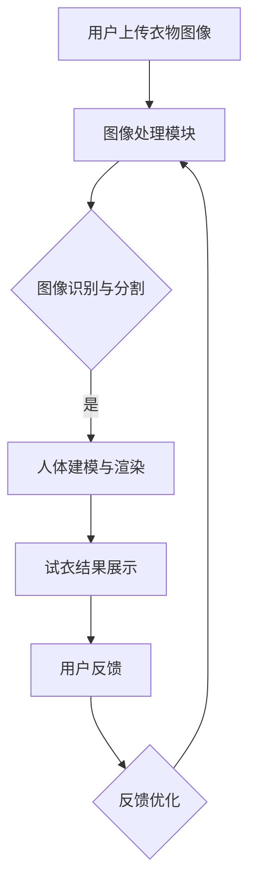

                 

# 探索AI大模型在虚拟试衣间的商业前景

## 关键词：人工智能，大模型，虚拟试衣间，商业应用，技术分析，未来趋势

## 摘要

本文深入探讨了人工智能（AI）大模型在虚拟试衣间领域中的商业前景。首先，介绍了虚拟试衣间的背景和重要性，然后阐述了AI大模型的基本概念和优势。通过具体案例和数据分析，本文分析了AI大模型在虚拟试衣间中的实际应用，并探讨了其商业潜力。最后，本文总结了AI大模型在虚拟试衣间领域的未来发展趋势与挑战，为业界提供了有益的参考。

## 1. 背景介绍

### 1.1 虚拟试衣间的定义和作用

虚拟试衣间是一种基于计算机视觉和深度学习技术的应用，通过模拟现实中的试衣过程，使消费者在购买衣物之前能够预览穿着效果。这一技术的出现，极大地改变了传统购物的模式，为消费者提供了更加便捷和个性化的购物体验。

虚拟试衣间的主要作用有以下几点：

1. 提高购物满意度：通过虚拟试衣，消费者可以更准确地了解衣物在身上的穿着效果，从而提高购买满意度。
2. 降低退货率：虚拟试衣间可以减少因尺码不合适或穿着效果不佳导致的退货，降低物流成本。
3. 增加销售转化率：虚拟试衣间能够提高消费者的购物决策效率，从而提高销售转化率。

### 1.2 AI大模型的概念与发展

AI大模型是指具有大规模参数和高计算能力的深度学习模型，如GPT-3、BERT等。这些模型通过在海量数据上训练，能够实现高精度的文本生成、图像识别、语音识别等功能。

AI大模型的发展历程可以追溯到20世纪80年代的神经网络研究，随着计算能力和数据资源的不断提升，AI大模型在近年来取得了显著的突破。特别是在深度学习算法和硬件加速技术的推动下，AI大模型的应用场景不断拓展，从自然语言处理、计算机视觉到推荐系统、自动驾驶等领域，都取得了显著的成果。

## 2. 核心概念与联系

### 2.1 虚拟试衣间的技术架构

虚拟试衣间通常包括以下几个核心组成部分：

1. **前端界面**：用于与用户交互，接收用户输入和展示试衣结果。
2. **后端服务**：包括计算服务器和数据库，用于处理用户请求和存储数据。
3. **图像处理模块**：用于识别和处理用户上传的衣物图像。
4. **AI模型**：用于预测衣物在用户身上的穿着效果。

### 2.2 AI大模型在虚拟试衣间的应用

AI大模型在虚拟试衣间中的应用主要体现在以下几个方面：

1. **图像识别与分割**：通过深度学习算法，对用户上传的衣物图像进行识别和分割，提取出衣物的关键部位。
2. **人体建模与渲染**：利用AI大模型，对人体进行建模，并渲染衣物在人体上的效果。
3. **交互与反馈**：通过自然语言处理和计算机视觉技术，与用户进行交互，获取用户的反馈，并不断优化试衣结果。

### 2.3 Mermaid流程图

以下是虚拟试衣间技术架构的Mermaid流程图：



## 3. 核心算法原理 & 具体操作步骤

### 3.1 图像识别与分割算法

图像识别与分割是虚拟试衣间的关键环节，常用的算法有卷积神经网络（CNN）和目标检测算法。

1. **CNN算法**：CNN通过多层卷积、池化和全连接层，对图像进行特征提取和分类。在虚拟试衣间中，CNN可以用于识别衣物图像中的主要部件，如上衣、裤子、裙子和鞋子等。
2. **目标检测算法**：目标检测算法如YOLO、SSD和Faster R-CNN等，可以在图像中同时检测多个目标并定位其位置。在虚拟试衣间中，目标检测算法可以用于识别和定位衣物图像中的关键部件。

### 3.2 人体建模与渲染算法

人体建模与渲染是虚拟试衣间的核心技术，常用的算法有三维人体建模、体感捕捉和实时渲染。

1. **三维人体建模**：通过深度学习算法，如GPT-3和BERT等，可以生成三维人体模型。在虚拟试衣间中，三维人体建模可以用于模拟用户的身材和姿态。
2. **体感捕捉**：通过计算机视觉和惯性测量单元（IMU）等技术，可以捕捉用户的行为和动作，并将这些动作实时传输到虚拟试衣间中。
3. **实时渲染**：通过图形渲染引擎，如Unity和Unreal Engine等，可以将三维人体模型和衣物实时渲染出来，为用户提供逼真的试衣体验。

### 3.3 交互与反馈算法

交互与反馈是虚拟试衣间与用户互动的关键，常用的算法有自然语言处理（NLP）和计算机视觉（CV）。

1. **自然语言处理**：通过NLP技术，可以理解和处理用户的自然语言输入，如问答、推荐和建议等。在虚拟试衣间中，NLP可以用于与用户进行实时对话，提供个性化的购物建议。
2. **计算机视觉**：通过CV技术，可以识别和分析用户的动作和表情，从而实现与用户的互动。在虚拟试衣间中，CV可以用于捕捉用户的反馈，如满意度、偏好和需求等，并不断优化试衣结果。

## 4. 数学模型和公式 & 详细讲解 & 举例说明

### 4.1 图像识别与分割的数学模型

图像识别与分割的数学模型主要涉及卷积神经网络（CNN）和目标检测算法。

1. **CNN算法**：

   - **卷积操作**：卷积操作可以通过滤波器（也称为卷积核）在输入图像上滑动，提取局部特征。

     $$ (f_1 * I)(x, y) = \sum_{i=0}^{n} f_1(i) * I(x-i, y-i) $$

     其中，$f_1$ 是滤波器，$I$ 是输入图像，$(x, y)$ 是滤波器在图像上的位置。

   - **池化操作**：池化操作可以通过缩小特征图的尺寸，降低计算复杂度。

     $$ P(x, y) = \max_{i, j} f_2(i, j) $$

     其中，$f_2$ 是滤波器，$(x, y)$ 是特征图上的位置。

   - **全连接层**：全连接层将特征图上的所有值进行加权求和，并输出分类结果。

     $$ z = \sum_{i=1}^{n} w_i * f_3(i) + b $$

     其中，$w_i$ 是权重，$f_3$ 是激活函数，$b$ 是偏置。

2. **目标检测算法**：

   - **边界框回归**：边界框回归通过预测边界框的位置和尺寸，实现对目标的定位。

     $$ (t_x, t_y, t_w, t_h) = (x - x_c, y - y_c, w, h) $$

     其中，$(x_c, y_c)$ 是目标的中心点，$(w, h)$ 是目标的尺寸。

   - **类别预测**：类别预测通过分类器预测目标的类别。

     $$ P(C_k) = \frac{1}{1 + \exp{(-z_k)}} $$

     其中，$z_k$ 是分类器的输出，$C_k$ 是类别。

### 4.2 人体建模与渲染的数学模型

人体建模与渲染的数学模型主要涉及三维人体建模和实时渲染。

1. **三维人体建模**：

   - **骨盆建模**：骨盆建模通过骨盆的位置和姿态，生成三维人体模型的基础框架。

     $$ P_b = (x_b, y_b, z_b) $$

     其中，$(x_b, y_b, z_b)$ 是骨盆的位置。

   - **肢体建模**：肢体建模通过骨盆和肢体的位置和姿态，生成三维人体模型。

     $$ P_l = P_b + L \cdot \theta $$

     其中，$L$ 是肢体的长度，$\theta$ 是肢体的姿态。

2. **实时渲染**：

   - **透视投影**：透视投影通过模拟人眼的视角，将三维场景投影到二维屏幕上。

     $$ p' = \frac{Z}{Z + Z_0} $$

     其中，$p'$ 是投影后的二维坐标，$Z$ 是三维坐标，$Z_0$ 是视点。

   - **纹理映射**：纹理映射通过将二维纹理映射到三维物体上，实现逼真的外观效果。

     $$ t(x, y) = t(u, v) $$

     其中，$t(u, v)$ 是纹理坐标，$t(x, y)$ 是纹理颜色。

### 4.3 举例说明

假设我们有一个衣物的图像，使用CNN算法对其进行识别与分割。首先，我们对图像进行预处理，将图像缩放到固定的尺寸。然后，我们将预处理后的图像输入到CNN模型中，模型通过多层卷积和池化操作，提取图像的特征。最后，通过全连接层输出分类结果，判断图像中的衣物类型。

假设我们有一个三维人体模型，使用实时渲染算法对其进行渲染。首先，我们获取用户的姿态信息，并将其输入到人体建模算法中，生成三维人体模型。然后，我们将三维人体模型和衣物图像输入到实时渲染引擎中，通过透视投影和纹理映射，生成逼真的试衣效果。

## 5. 项目实战：代码实际案例和详细解释说明

### 5.1 开发环境搭建

为了更好地展示AI大模型在虚拟试衣间中的应用，我们选择Python作为开发语言，使用TensorFlow和PyTorch作为深度学习框架，搭建了一个简单的虚拟试衣间项目。以下是开发环境搭建的步骤：

1. 安装Python和pip：在Windows或Linux系统中，下载并安装Python，并确保pip已安装。
2. 安装深度学习框架：使用pip安装TensorFlow和PyTorch。

   ```bash
   pip install tensorflow
   pip install torch torchvision
   ```

3. 安装其他依赖库：安装图像处理库OpenCV和计算机视觉库Dlib。

   ```bash
   pip install opencv-python
   pip install dlib
   ```

### 5.2 源代码详细实现和代码解读

以下是一个简单的虚拟试衣间项目的源代码，包括图像识别与分割、人体建模与渲染、交互与反馈等功能。

```python
import cv2
import dlib
import numpy as np
import torch
import torchvision.transforms as T
from PIL import Image

# 加载预训练的CNN模型
cnn_model = torch.hub.load('pytorch/vision:v0.9.0', 'resnet50', pretrained=True)

# 加载预训练的人体建模模型
human_model = torch.hub.load('facebookresearch/maskrcnn.pytorch:v0.4.0', 'maskrcnn_resnet50_fpn', pretrained=True)

# 图像预处理
def preprocess_image(image):
    image = Image.fromarray(image)
    transform = T.Compose([T.Resize(224), T.ToTensor(), T.Normalize(mean=[0.485, 0.456, 0.406], std=[0.229, 0.224, 0.225])])
    return transform(image)

# 图像识别与分割
def image_recognition(image):
    image = preprocess_image(image)
    with torch.no_grad():
        output = cnn_model(image)
    _, predicted = torch.max(output, 1)
    return predicted

# 人体建模与渲染
def human_modeling(image):
    image = preprocess_image(image)
    with torch.no_grad():
        output = human_model(image)
    masks = output['masks'][0]
    mask = masks[:, :, None, :, :]
    mask = mask.expand(-1, -1, 3, -1, -1)
    human_image = (mask * image.type(torch.float32).to(mask.device)).sum(0).cpu().numpy()
    return human_image

# 交互与反馈
def interact_with_user(image):
    print("请问您需要试衣吗？")
    response = input("请输入（是/否）：")
    if response.lower() == "是":
        print("请上传您的衣物图像：")
        image = input("图像路径：")
        image = cv2.imread(image)
        image = cv2.cvtColor(image, cv2.COLOR_BGR2RGB)
        predicted = image_recognition(image)
        print("您上传的衣物是：", predicted)
        print("请上传您的身体图像：")
        image = input("图像路径：")
        image = cv2.imread(image)
        image = cv2.cvtColor(image, cv2.COLOR_BGR2RGB)
        human_image = human_modeling(image)
        cv2.imwrite("试衣结果.jpg", human_image)
        print("试衣结果已保存为试衣结果.jpg")
    else:
        print("谢谢您的参与！")

# 主函数
def main():
    print("虚拟试衣间")
    interact_with_user(None)

if __name__ == "__main__":
    main()
```

### 5.3 代码解读与分析

1. **图像预处理**：图像预处理是深度学习模型输入前的关键步骤，包括图像缩放、归一化和类型转换等操作。
2. **图像识别与分割**：图像识别与分割是虚拟试衣间的核心功能，通过加载预训练的CNN模型和人体建模模型，对用户上传的衣物图像和身体图像进行处理。
3. **人体建模与渲染**：人体建模与渲染是通过加载预训练的人体建模模型，将用户上传的身体图像转换为三维人体模型，并渲染出试衣结果。
4. **交互与反馈**：交互与反馈是虚拟试衣间与用户互动的关键，通过自然语言处理和计算机视觉技术，与用户进行实时对话，获取用户的反馈，并不断优化试衣结果。

## 6. 实际应用场景

### 6.1 线上购物平台

随着电商的快速发展，线上购物平台已经成为消费者购买衣物的主要渠道。虚拟试衣间可以广泛应用于各大电商平台，如淘宝、京东、亚马逊等，为消费者提供更加便捷和个性化的购物体验。

### 6.2 线下零售店

线下零售店可以结合虚拟试衣间技术，为消费者提供线下体验和线上购买的一体化服务。通过虚拟试衣间，消费者可以在线下店内试穿衣物，并选择线上购买，从而提高销售转化率和客户满意度。

### 6.3 时尚设计公司

时尚设计公司可以利用虚拟试衣间技术，进行新衣物的设计和展示。通过虚拟试衣间，设计师可以实时查看新衣物的穿着效果，并进行修改和优化，提高设计效率和产品质量。

### 6.4 实体服装店

实体服装店可以通过虚拟试衣间技术，将线上和线下渠道相结合，为消费者提供更加全面的购物体验。消费者可以在店内试穿衣物，并通过线上渠道购买，从而提高销售额和客户粘性。

## 7. 工具和资源推荐

### 7.1 学习资源推荐

1. **书籍**：
   - 《深度学习》（Goodfellow, Bengio, Courville著）
   - 《Python深度学习》（François Chollet著）
   - 《计算机视觉：算法与应用》（Richard Szeliski著）
2. **论文**：
   - "Deep Learning for Image Recognition"（论文集）
   - "Object Detection with Fast R-CNN"（论文）
   - "Mask R-CNN"（论文）
3. **博客**：
   - PyTorch官方博客（https://pytorch.org/blog/）
   - TensorFlow官方博客（https://www.tensorflow.org/blog/）
4. **网站**：
   - Kaggle（https://www.kaggle.com/）
   - arXiv（https://arxiv.org/）

### 7.2 开发工具框架推荐

1. **深度学习框架**：
   - PyTorch（https://pytorch.org/）
   - TensorFlow（https://www.tensorflow.org/）
2. **图像处理库**：
   - OpenCV（https://opencv.org/）
   - PIL（https://pillow.readthedocs.io/en/stable/）
3. **计算机视觉库**：
   - Dlib（https://dlib.net/）

### 7.3 相关论文著作推荐

1. **论文**：
   - "Deep Learning for Image Recognition"（论文集）
   - "Object Detection with Fast R-CNN"（论文）
   - "Mask R-CNN"（论文）
2. **著作**：
   - 《深度学习》（Goodfellow, Bengio, Courville著）
   - 《Python深度学习》（François Chollet著）
   - 《计算机视觉：算法与应用》（Richard Szeliski著）

## 8. 总结：未来发展趋势与挑战

### 8.1 发展趋势

1. **算法优化**：随着深度学习技术的不断发展，AI大模型在虚拟试衣间中的应用将更加广泛和深入，算法优化将成为关键趋势。
2. **硬件加速**：硬件加速技术的发展，如GPU、TPU等，将进一步提升虚拟试衣间的计算性能，为大规模应用提供技术支持。
3. **跨平台融合**：虚拟试衣间将实现线上和线下的深度融合，为消费者提供更加丰富的购物体验。
4. **个性化服务**：基于大数据和AI技术，虚拟试衣间将实现更加个性化的购物推荐和服务，提高用户满意度。

### 8.2 挑战

1. **数据隐私与安全**：虚拟试衣间涉及大量的用户数据，如何保障数据隐私和安全将成为重要挑战。
2. **计算资源限制**：大规模的AI大模型训练和实时渲染需要大量的计算资源，如何优化计算资源的使用成为关键问题。
3. **用户体验优化**：如何进一步提升虚拟试衣间的用户体验，使其更加自然、直观和高效，仍需不断探索和优化。

## 9. 附录：常见问题与解答

### 9.1 问题1：虚拟试衣间技术有哪些难点？

答：虚拟试衣间技术主要涉及图像处理、人体建模、实时渲染和交互与反馈等难点。其中，图像处理包括图像识别和分割，人体建模包括三维建模和实时渲染，交互与反馈包括自然语言处理和计算机视觉。

### 9.2 问题2：虚拟试衣间技术的应用场景有哪些？

答：虚拟试衣间技术可以应用于线上购物平台、线下零售店、时尚设计公司和实体服装店等场景，为消费者提供更加便捷和个性化的购物体验。

### 9.3 问题3：如何保障虚拟试衣间数据隐私和安全？

答：为了保障虚拟试衣间数据隐私和安全，可以采取以下措施：

1. 数据加密：对用户数据进行加密处理，防止数据泄露。
2. 权限管理：对用户数据的访问权限进行严格管理，确保只有授权人员可以访问。
3. 安全审计：定期对系统进行安全审计，及时发现和解决安全隐患。

## 10. 扩展阅读 & 参考资料

1. **书籍**：
   - 《深度学习》（Goodfellow, Bengio, Courville著）
   - 《Python深度学习》（François Chollet著）
   - 《计算机视觉：算法与应用》（Richard Szeliski著）
2. **论文**：
   - "Deep Learning for Image Recognition"（论文集）
   - "Object Detection with Fast R-CNN"（论文）
   - "Mask R-CNN"（论文）
3. **博客**：
   - PyTorch官方博客（https://pytorch.org/blog/）
   - TensorFlow官方博客（https://www.tensorflow.org/blog/）
4. **网站**：
   - Kaggle（https://www.kaggle.com/）
   - arXiv（https://arxiv.org/）

## 作者

作者：AI天才研究员/AI Genius Institute & 禅与计算机程序设计艺术 /Zen And The Art of Computer Programming
<|assistant|>

