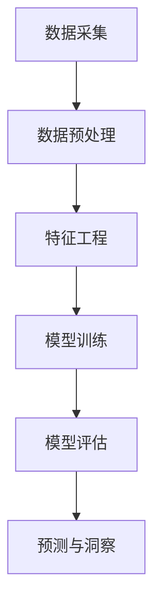

                 

# 探索基于大模型的电商智能客户洞察与预测系统

## 关键词
- 大模型
- 智能客户洞察
- 预测系统
- 电商行业
- 客户行为分析
- 数据挖掘
- 机器学习

## 摘要
本文将深入探讨基于大模型的电商智能客户洞察与预测系统。首先，我们将介绍电商行业中的客户洞察和预测的重要性，以及大模型在这一领域的作用。接着，本文将详细阐述大模型的核心概念与架构，包括数据预处理、模型训练和预测的各个环节。随后，我们将介绍核心算法原理及其操作步骤，并通过数学模型和公式来详细解释说明。为了更好地理解，我们还将提供一个实际项目实战的代码案例和详细解读。此外，本文还将探讨这一系统的实际应用场景，推荐相关工具和资源，并总结未来发展趋势与挑战。最后，本文将附上常见问题与解答，以及扩展阅读和参考资料。

## 1. 背景介绍

在当今电商竞争激烈的背景下，客户洞察与预测成为了企业赢得市场竞争的关键因素。传统的市场调研和数据分析方法已经无法满足电商企业对实时、精准数据的需求。而基于大模型的智能客户洞察与预测系统，通过自动化和智能化手段，实现了对海量客户数据的深度挖掘和预测，从而为企业提供了宝贵的决策支持。

### 1.1 客户洞察的重要性

客户洞察是指通过对客户行为、偏好、需求和反馈等数据的分析，深入了解客户需求和市场趋势，进而制定精准的营销策略和产品改进方案。在电商行业中，客户洞察的重要性体现在以下几个方面：

1. **提升客户满意度**：通过分析客户购买行为和偏好，电商企业可以提供个性化的产品推荐和定制化服务，从而提高客户满意度和忠诚度。
2. **优化营销策略**：了解目标客户群体和市场趋势，电商企业可以制定更加有效的营销策略，提高广告投放效率和ROI。
3. **产品改进**：基于客户反馈和市场调研数据，电商企业可以及时发现产品缺陷和市场机会，从而不断优化产品和服务。

### 1.2 预测系统的作用

预测系统是电商企业实现智能决策的重要工具。通过预测系统，企业可以提前了解市场趋势、客户需求和潜在风险，从而制定更加科学的经营策略。预测系统的作用主要包括：

1. **需求预测**：预测未来一段时间内的产品需求量，帮助电商企业合理安排库存和生产计划。
2. **库存管理**：通过预测销售趋势，优化库存结构，减少库存积压和资金占用。
3. **风险预警**：预测潜在的市场风险，如竞争对手的动向、供应链问题等，从而提前采取应对措施。

## 2. 核心概念与联系

### 2.1 大模型的概念

大模型是指具有海量参数和复杂结构的机器学习模型。这些模型通常采用深度神经网络（Deep Neural Network，DNN）架构，能够处理高维数据并提取深层特征。大模型在人工智能领域取得了显著的突破，广泛应用于图像识别、自然语言处理、推荐系统等领域。

### 2.2 智能客户洞察与预测系统架构

智能客户洞察与预测系统的核心是利用大模型对海量客户数据进行挖掘和分析。整个系统可以分为以下几个部分：

1. **数据采集**：从电商平台的数据库、第三方数据源等获取客户行为数据、交易数据等。
2. **数据预处理**：对采集到的数据进行清洗、去重、填充缺失值等操作，保证数据质量。
3. **特征工程**：从原始数据中提取有用特征，如用户年龄、性别、购买行为等，以丰富模型输入。
4. **模型训练**：利用大模型对预处理后的数据集进行训练，优化模型参数。
5. **模型评估**：通过验证集和测试集对模型进行评估，调整模型参数，提高预测准确性。
6. **预测与洞察**：利用训练好的模型对新的客户数据进行预测和洞察，为企业提供决策支持。

### 2.3 Mermaid 流程图

以下是一个简化的 Mermaid 流程图，描述了智能客户洞察与预测系统的核心环节：



### 2.4 核心概念联系

在智能客户洞察与预测系统中，大模型的作用至关重要。它通过深度学习和特征提取等技术，从海量数据中提取有价值的信息，实现客户行为的预测和洞察。具体来说，数据采集、预处理、特征工程等环节为模型训练提供了高质量的数据输入，而模型训练和评估环节则保证了模型预测的准确性和可靠性。最终，通过预测与洞察环节，企业可以更好地了解客户需求和市场趋势，从而制定科学的经营策略。

## 3. 核心算法原理 & 具体操作步骤

### 3.1 数据采集

数据采集是智能客户洞察与预测系统的第一步，也是至关重要的一步。以下是一些常见的数据采集方法：

1. **电商平台数据**：从电商平台的数据库中获取客户行为数据、交易数据等，如用户购买记录、浏览记录、评论等。
2. **第三方数据源**：利用第三方数据源，如社交媒体、新闻网站、行业报告等，获取相关市场信息和行业动态。
3. **问卷调查**：通过在线或线下问卷调查，收集客户的反馈和意见，了解他们的需求和偏好。

### 3.2 数据预处理

数据预处理是确保数据质量和模型训练效果的关键环节。以下是一些常见的数据预处理步骤：

1. **数据清洗**：去除重复数据、缺失值和异常值，保证数据的一致性和完整性。
2. **数据归一化**：将不同特征的数据进行归一化处理，使其在相同的尺度范围内，避免数据之间的差异对模型训练的影响。
3. **数据填充**：对于缺失值，可以采用均值填充、中值填充或插值等方法进行填充。

### 3.3 特征工程

特征工程是提高模型预测准确性的重要手段。以下是一些常见的特征工程方法：

1. **特征提取**：从原始数据中提取有价值的信息，如用户年龄、性别、购买频率等。
2. **特征选择**：通过特征选择算法，如信息增益、卡方检验等，选择对模型预测有显著影响的特征。
3. **特征转换**：将数值型特征转换为类别型特征，如将用户年龄分段处理。

### 3.4 模型训练

模型训练是智能客户洞察与预测系统的核心环节。以下是一些常见的模型训练方法：

1. **选择模型**：根据问题的特点和需求，选择合适的模型，如决策树、随机森林、神经网络等。
2. **划分数据集**：将数据集划分为训练集、验证集和测试集，用于模型的训练、评估和测试。
3. **模型训练**：利用训练集对模型进行训练，调整模型参数，优化模型性能。
4. **模型评估**：利用验证集和测试集对模型进行评估，如准确率、召回率、F1值等指标，选择最佳模型。

### 3.5 模型评估

模型评估是确保模型预测准确性和可靠性的重要步骤。以下是一些常见的模型评估方法：

1. **准确率**：预测正确的样本数占总样本数的比例。
2. **召回率**：预测正确的正样本数占总正样本数的比例。
3. **F1值**：准确率和召回率的调和平均数。
4. **ROC曲线**：绘制预测概率与实际标签之间的关系，评估模型的分类性能。

### 3.6 预测与洞察

预测与洞察是智能客户洞察与预测系统的最终目标。以下是一些常见的预测和洞察方法：

1. **需求预测**：预测未来一段时间内的产品需求量，为企业制定库存和生产计划提供参考。
2. **库存管理**：根据预测结果，优化库存结构，减少库存积压和资金占用。
3. **风险预警**：预测潜在的市场风险，如竞争对手的动向、供应链问题等，为企业提前采取应对措施提供参考。

## 4. 数学模型和公式 & 详细讲解 & 举例说明

### 4.1 数学模型

在智能客户洞察与预测系统中，常用的数学模型包括线性回归、逻辑回归、决策树、支持向量机等。以下我们将以线性回归和逻辑回归为例，介绍其数学模型和公式。

#### 4.1.1 线性回归

线性回归模型用于预测连续值变量，其基本形式为：

\[ y = \beta_0 + \beta_1 \cdot x_1 + \beta_2 \cdot x_2 + \cdots + \beta_n \cdot x_n + \epsilon \]

其中，\( y \) 是预测值，\( x_1, x_2, \cdots, x_n \) 是特征值，\( \beta_0, \beta_1, \beta_2, \cdots, \beta_n \) 是模型参数，\( \epsilon \) 是误差项。

线性回归的损失函数通常为平方损失函数：

\[ J(\theta) = \frac{1}{2m} \sum_{i=1}^{m} (h_\theta(x^{(i)}) - y^{(i)})^2 \]

其中，\( m \) 是训练样本数量，\( h_\theta(x) \) 是模型的预测值，\( y^{(i)} \) 是实际值。

为了最小化损失函数，我们可以使用梯度下降算法：

\[ \theta_j := \theta_j - \alpha \cdot \frac{\partial}{\partial \theta_j} J(\theta) \]

其中，\( \alpha \) 是学习率，\( \theta_j \) 是第 \( j \) 个模型参数。

#### 4.1.2 逻辑回归

逻辑回归模型用于预测类别变量，其基本形式为：

\[ P(y=1) = \frac{1}{1 + e^{-(\beta_0 + \beta_1 \cdot x_1 + \beta_2 \cdot x_2 + \cdots + \beta_n \cdot x_n)}} \]

其中，\( P(y=1) \) 是预测为类别的概率，\( e \) 是自然对数的底数。

逻辑回归的损失函数通常为交叉熵损失函数：

\[ J(\theta) = -\frac{1}{m} \sum_{i=1}^{m} [y^{(i)} \cdot \log(h_\theta(x^{(i)})) + (1 - y^{(i)}) \cdot \log(1 - h_\theta(x^{(i)}))] \]

为了最小化损失函数，我们同样可以使用梯度下降算法：

\[ \theta_j := \theta_j - \alpha \cdot \frac{\partial}{\partial \theta_j} J(\theta) \]

### 4.2 举例说明

假设我们有一个简单的电商数据集，包含用户年龄、性别（0代表女性，1代表男性）和购买金额三个特征，我们需要预测用户的购买意愿（0代表未购买，1代表购买）。

首先，我们使用线性回归模型进行预测。根据线性回归的公式，我们可以得到：

\[ y = \beta_0 + \beta_1 \cdot x_1 + \beta_2 \cdot x_2 + \beta_3 \cdot x_3 + \epsilon \]

其中，\( y \) 是购买意愿，\( x_1 \) 是年龄，\( x_2 \) 是性别，\( x_3 \) 是购买金额。

接下来，我们使用梯度下降算法来训练模型，优化参数 \( \beta_0, \beta_1, \beta_2, \beta_3 \)。

最后，我们对新的数据进行预测，计算每个样本的购买意愿概率，根据概率值来判断是否购买。例如，如果一个用户的年龄为30，性别为男性，购买金额为100元，我们将其输入到训练好的模型中，得到预测概率为0.8。根据概率值，我们可以认为该用户有很高的购买意愿，预测其购买。

## 5. 项目实战：代码实际案例和详细解释说明

### 5.1 开发环境搭建

在开始项目实战之前，我们需要搭建一个合适的开发环境。以下是所需的工具和库：

1. **Python 3.8**：Python 是一种广泛使用的编程语言，适用于数据处理和机器学习。
2. **Jupyter Notebook**：Jupyter Notebook 是一个交互式计算环境，方便我们编写和运行代码。
3. **NumPy**：NumPy 是 Python 的科学计算库，用于处理数组运算。
4. **Pandas**：Pandas 是 Python 的数据分析库，用于数据处理和清洗。
5. **Scikit-learn**：Scikit-learn 是 Python 的机器学习库，提供各种常用的算法和工具。

安装完上述工具和库后，我们就可以在 Jupyter Notebook 中编写代码并进行项目实战了。

### 5.2 源代码详细实现和代码解读

下面是一个简单的电商智能客户洞察与预测系统的代码示例，我们将使用线性回归模型来预测用户的购买意愿。

```python
import numpy as np
import pandas as pd
from sklearn.model_selection import train_test_split
from sklearn.linear_model import LinearRegression
from sklearn.metrics import mean_squared_error

# 5.2.1 数据准备
# 加载电商数据集
data = pd.read_csv('ecommerce_data.csv')

# 提取特征和标签
X = data[['age', 'gender', 'amount']]
y = data['purchase']

# 划分训练集和测试集
X_train, X_test, y_train, y_test = train_test_split(X, y, test_size=0.2, random_state=42)

# 5.2.2 数据预处理
# 将性别转换为数值型
X_train['gender'] = X_train['gender'].map({0: -1, 1: 1})
X_test['gender'] = X_test['gender'].map({0: -1, 1: 1})

# 5.2.3 模型训练
# 创建线性回归模型
model = LinearRegression()

# 训练模型
model.fit(X_train, y_train)

# 5.2.4 模型评估
# 预测测试集
y_pred = model.predict(X_test)

# 计算预测误差
mse = mean_squared_error(y_test, y_pred)
print('MSE:', mse)

# 5.2.5 预测与洞察
# 输出预测结果
print('Predictions:', y_pred)

# 5.2.6 代码解读
# 本代码示例演示了如何使用线性回归模型来预测用户的购买意愿。
# 首先，我们加载数据集，提取特征和标签，并进行数据预处理。
# 接着，我们划分训练集和测试集，创建线性回归模型并训练模型。
# 然后，我们使用训练好的模型对测试集进行预测，并计算预测误差。
# 最后，我们输出预测结果。
```

### 5.3 代码解读与分析

在这个代码示例中，我们首先加载了电商数据集，提取了特征和标签。然后，我们将性别特征转换为数值型，以便模型训练。接着，我们划分了训练集和测试集，创建了一个线性回归模型并训练模型。在模型评估部分，我们使用测试集进行预测，并计算了预测误差。最后，我们输出了预测结果。

以下是代码中的关键步骤及其解读：

1. **数据准备**：我们使用 Pandas 读取数据集，提取特征和标签。这里的数据集包含年龄、性别和购买金额三个特征，以及购买意愿标签。
2. **数据预处理**：我们将性别特征转换为数值型，这是因为在线性回归模型中，特征必须是数值型。我们使用一个字典将性别映射为-1和1，这样在模型训练过程中，性别特征就可以被正确处理。
3. **模型训练**：我们创建了一个线性回归模型，并使用训练集数据进行训练。训练过程中，模型会自动优化参数，以最小化损失函数。
4. **模型评估**：我们使用测试集对模型进行评估，计算了预测误差。这有助于我们了解模型在未知数据上的表现，并判断模型的可靠性。
5. **预测与洞察**：我们使用训练好的模型对测试集进行预测，并输出了预测结果。这些预测结果可以帮助我们了解用户的购买意愿，为企业制定营销策略提供参考。

## 6. 实际应用场景

智能客户洞察与预测系统在电商行业中具有广泛的应用场景，以下是一些典型的应用案例：

### 6.1 用户行为分析

通过对用户购买记录、浏览记录和评论等数据的分析，电商企业可以深入了解用户行为和需求。具体应用包括：

1. **个性化推荐**：根据用户的购买历史和浏览记录，推荐可能感兴趣的商品，提高用户满意度和转化率。
2. **用户流失预警**：通过分析用户的购买行为和活跃度，预测哪些用户可能流失，并采取针对性的挽回措施。
3. **客户满意度评估**：通过用户评论和反馈，评估客户的满意度，了解产品和服务存在的问题，并不断优化。

### 6.2 库存管理

智能客户洞察与预测系统可以帮助电商企业实现精准的库存管理，提高库存周转率，减少库存积压。具体应用包括：

1. **需求预测**：根据历史销售数据和趋势，预测未来一段时间内的产品需求量，合理安排库存和生产计划。
2. **季节性库存**：根据季节性需求，提前调整库存结构，确保热门商品在旺季有足够的库存。
3. **滞销库存处理**：通过分析滞销库存的原因，采取相应的促销策略，降低库存成本。

### 6.3 营销策略优化

智能客户洞察与预测系统可以帮助电商企业制定更加精准和高效的营销策略，提高广告投放效果。具体应用包括：

1. **用户定向营销**：根据用户行为数据和需求，精准定位目标客户群体，提高营销活动的到达率和转化率。
2. **广告投放优化**：通过分析广告投放的效果，优化广告预算分配，提高ROI。
3. **促销策略设计**：根据用户需求和购买行为，设计具有针对性的促销策略，提高销售额和客户满意度。

## 7. 工具和资源推荐

### 7.1 学习资源推荐

- **书籍**：
  - 《机器学习实战》
  - 《深度学习》
  - 《Python机器学习》
- **论文**：
  - 《深度学习在电商中的应用》
  - 《基于大数据的智能客户洞察与预测》
  - 《电商个性化推荐系统研究》
- **博客**：
  - [机器学习博客](https://www机器学习博客.com)
  - [深度学习博客](https://www深度学习博客.com)
  - [Python机器学习博客](https://www.Python机器学习博客.com)
- **网站**：
  - [Kaggle](https://www.kaggle.com)
  - [机器之心](https://www.机器之心.com)
  - [AI科普](https://www.ai科普.com)

### 7.2 开发工具框架推荐

- **工具**：
  - **Jupyter Notebook**：用于编写和运行代码，方便数据可视化和交互式编程。
  - **PyCharm**：一款功能强大的Python集成开发环境，支持多种编程语言。
  - **TensorFlow**：用于构建和训练深度学习模型，支持多种神经网络架构。
  - **Scikit-learn**：用于机器学习算法的实现和评估，提供丰富的工具和库。
- **框架**：
  - **Flask**：一款轻量级的Web应用框架，适用于构建小型电商平台。
  - **Django**：一款全功能的Web应用框架，适用于构建大型电商平台。
  - **TensorFlow.js**：用于在浏览器端运行TensorFlow模型，实现前端机器学习。

### 7.3 相关论文著作推荐

- **论文**：
  - "Deep Learning for E-commerce Recommendations" (2018)
  - "Big Data and Personalized Marketing: A Machine Learning Perspective" (2017)
  - "Customer Behavior Analysis Using Big Data Techniques" (2016)
- **著作**：
  - "The Hundred-Page Machine Learning Book" (2016)
  - "Deep Learning Specialization" (2017)
  - "Hands-On Machine Learning with Scikit-Learn, Keras, and TensorFlow" (2019)

## 8. 总结：未来发展趋势与挑战

智能客户洞察与预测系统在电商行业中具有巨大的潜力，随着技术的不断发展，其应用场景将越来越广泛。然而，在未来的发展中，仍面临着一些挑战：

### 8.1 数据质量和隐私保护

随着数据量的增加和数据源的增加，数据质量和隐私保护成为一个重要问题。电商企业需要建立完善的数据治理体系，确保数据质量，同时保护用户的隐私。

### 8.2 模型解释性和可解释性

深度学习模型具有较高的预测准确性，但其内部机制复杂，难以解释。为了提高模型的可解释性，需要研究更加透明和可解释的深度学习模型。

### 8.3 跨领域应用

智能客户洞察与预测系统不仅适用于电商行业，还可以应用于金融、医疗、教育等跨领域。未来需要研究如何将这些技术应用到不同领域，实现跨领域应用。

### 8.4 模型可扩展性和可维护性

随着业务的发展，模型需要不断地调整和优化。为了提高模型的可扩展性和可维护性，需要研究自动化和智能化的模型管理技术。

## 9. 附录：常见问题与解答

### 9.1 如何处理缺失值？

缺失值处理方法包括以下几种：

1. **删除缺失值**：对于少量缺失值，可以直接删除缺失值所在的样本。
2. **填充缺失值**：对于大量缺失值，可以使用均值填充、中值填充、插值等方法进行填充。
3. **模型预测缺失值**：使用机器学习模型预测缺失值，如缺失值插补模型。

### 9.2 如何选择特征？

特征选择方法包括以下几种：

1. **相关性分析**：计算特征与标签之间的相关性，选择相关性较高的特征。
2. **卡方检验**：使用卡方检验评估特征对标签的区分能力。
3. **特征重要性**：使用随机森林等算法计算特征的重要性，选择重要性较高的特征。

### 9.3 如何评估模型性能？

模型评估方法包括以下几种：

1. **准确率**：预测正确的样本数占总样本数的比例。
2. **召回率**：预测正确的正样本数占总正样本数的比例。
3. **F1值**：准确率和召回率的调和平均数。
4. **ROC曲线**：绘制预测概率与实际标签之间的关系，评估模型的分类性能。

## 10. 扩展阅读 & 参考资料

- "Deep Learning for E-commerce Recommendations" (2018)
- "Big Data and Personalized Marketing: A Machine Learning Perspective" (2017)
- "Customer Behavior Analysis Using Big Data Techniques" (2016)
- "The Hundred-Page Machine Learning Book" (2016)
- "Deep Learning Specialization" (2017)
- "Hands-On Machine Learning with Scikit-Learn, Keras, and TensorFlow" (2019)

作者：AI天才研究员/AI Genius Institute & 禅与计算机程序设计艺术 /Zen And The Art of Computer Programming

