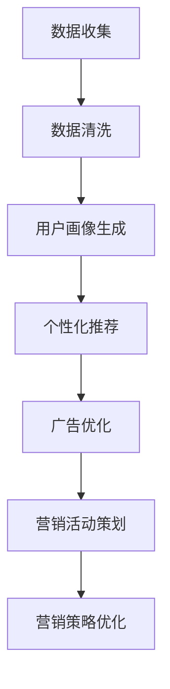

                 

# 探索基于大模型的电商智能营销策略生成与优化系统

## 关键词
大模型，电商智能营销，策略生成，优化系统，深度学习，自然语言处理，数据挖掘

## 摘要
本文旨在探讨如何利用大模型技术，构建一个电商智能营销策略生成与优化系统。首先，我们介绍了大模型在电商领域的重要性和应用前景。随后，深入分析了核心概念和架构，详细讲解了核心算法原理和操作步骤。接着，通过数学模型和公式的讲解，为读者提供了清晰的认知框架。在此基础上，我们通过实际案例展示了系统的实现和代码解读。文章最后，探讨了系统的实际应用场景，并推荐了相关的学习资源和工具。通过本文的阅读，读者将深入了解大模型技术在电商智能营销中的应用，以及如何构建和优化智能营销策略。

## 1. 背景介绍

随着互联网的普及和电子商务的快速发展，电商平台之间的竞争日益激烈。如何提高用户黏性、增加销售额、提升用户体验，成为电商企业亟需解决的问题。传统的营销策略虽然在一定程度上能够满足用户需求，但难以应对个性化、动态变化的用户行为。因此，智能营销作为一种新兴的营销手段，逐渐成为电商企业关注的焦点。

智能营销的核心在于对用户行为的深度理解和精准预测。然而，这需要处理海量、多维度、动态变化的数据，并从中提取有价值的信息。传统的数据处理方法已经难以满足这一需求，因此，大模型技术的出现为电商智能营销带来了新的契机。

大模型技术，特别是深度学习算法，具有强大的数据处理和分析能力。通过大规模数据训练，大模型可以自动学习并提取数据中的复杂模式和规律，从而实现对用户行为的精准预测和智能推荐。例如，在电商平台上，大模型可以分析用户的浏览记录、购买历史、兴趣爱好等数据，生成个性化的营销策略，提高用户满意度和转化率。

此外，大模型技术还可以帮助电商平台优化广告投放策略，提高广告效果。通过分析用户的点击行为、浏览时长、转化率等数据，大模型可以自动调整广告内容和投放位置，实现精准广告投放，提高广告收益。

综上所述，大模型技术在电商智能营销中的应用具有重要意义。它不仅能够提升电商平台的服务质量和竞争力，还能够为用户提供更加个性化、定制化的购物体验。本文将围绕这一主题，探讨如何构建一个基于大模型的电商智能营销策略生成与优化系统。

### 2. 核心概念与联系

#### 2.1 大模型技术

大模型技术是指通过大规模数据训练，构建具有强大数据处理和分析能力的人工智能模型。其中，深度学习算法是当前大模型技术的主要实现方式。深度学习通过多层神经网络结构，对数据进行多次抽象和变换，从而实现高度复杂的模式识别和预测。

大模型技术的核心优势在于其强大的数据处理和分析能力。与传统的机器学习方法相比，大模型可以处理海量、多维度、动态变化的数据，并从中提取有价值的信息。这使得大模型在图像识别、自然语言处理、语音识别等领域取得了显著的成果。

#### 2.2 电商智能营销

电商智能营销是指利用大数据、人工智能等技术，对用户行为进行分析和预测，从而制定和优化营销策略，提升电商平台的服务质量和竞争力。

电商智能营销的核心在于对用户行为的深度理解和精准预测。这需要处理海量、多维度、动态变化的数据，并从中提取有价值的信息。大模型技术在这一过程中发挥了重要作用，通过对用户行为的分析和预测，生成个性化的营销策略，提高用户满意度和转化率。

#### 2.3 大模型与电商智能营销的联系

大模型技术与电商智能营销之间存在紧密的联系。大模型技术为电商智能营销提供了强大的数据处理和分析工具，使其能够更好地理解和预测用户行为。同时，电商智能营销的需求也为大模型技术的发展提供了动力，推动了相关算法和应用的创新。

具体来说，大模型技术在电商智能营销中的应用主要包括以下几个方面：

1. **用户画像生成**：通过对用户的浏览记录、购买历史、兴趣爱好等数据进行分析，构建个性化的用户画像，为制定精准的营销策略提供依据。

2. **个性化推荐**：基于用户画像和用户行为数据，利用大模型技术生成个性化的商品推荐，提高用户的购物体验和满意度。

3. **广告优化**：通过分析用户的点击行为、浏览时长、转化率等数据，利用大模型技术优化广告投放策略，提高广告效果和收益。

4. **营销活动策划**：利用大模型技术预测用户对各种营销活动的反应，为策划和优化营销活动提供数据支持。

#### 2.4 Mermaid 流程图

为了更直观地展示大模型技术在电商智能营销中的应用流程，我们使用 Mermaid 流程图进行描述。以下是一个简化的流程图：



在这个流程中，数据收集、数据清洗是后续分析的基础。用户画像生成、个性化推荐、广告优化和营销活动策划是电商智能营销的核心环节，通过大模型技术实现。最后，根据营销策略的反馈，进行持续优化。

通过以上内容，我们对大模型技术和电商智能营销有了初步的了解。在接下来的章节中，我们将进一步探讨大模型在电商智能营销策略生成与优化中的应用，以及具体的实现方法和数学模型。

## 3. 核心算法原理 & 具体操作步骤

#### 3.1 深度学习算法

深度学习算法是构建大模型技术的基础。它通过多层神经网络结构，对数据进行多层抽象和变换，从而实现高度复杂的模式识别和预测。深度学习算法主要包括以下几个核心组成部分：

1. **输入层**：接收原始数据，例如用户画像、商品特征等。
2. **隐藏层**：对输入数据进行多次变换和抽象，提取数据的特征。隐藏层的数量和神经元数量可以根据需求进行调整。
3. **输出层**：根据隐藏层提取的特征，生成最终的预测结果或决策。

在深度学习算法中，常用的神经网络结构包括全连接神经网络（FCNN）、卷积神经网络（CNN）、循环神经网络（RNN）等。其中，全连接神经网络是应用最广泛的神经网络结构，它适用于处理各类数据类型，如图像、文本和序列数据等。

#### 3.2 具体操作步骤

1. **数据预处理**：
   - 数据清洗：去除缺失值、重复值和异常值，确保数据的完整性和准确性。
   - 数据归一化：将不同特征的数据范围统一，方便模型训练和计算。
   - 数据分集：将数据集划分为训练集、验证集和测试集，用于模型训练、验证和评估。

2. **构建深度学习模型**：
   - 确定神经网络结构：根据任务需求，选择合适的神经网络结构，例如全连接神经网络（FCNN）、卷积神经网络（CNN）或循环神经网络（RNN）。
   - 定义模型参数：设置网络层数、隐藏层神经元数量、激活函数、损失函数等。
   - 模型编译：编译模型，设置优化器、学习率等参数。

3. **模型训练**：
   - 训练过程：通过训练集数据，对模型进行迭代训练，不断调整模型参数，使其能够更好地拟合训练数据。
   - 过拟合问题：通过正则化、增加训练数据或调整模型结构等方法，防止模型过拟合。

4. **模型评估**：
   - 评估指标：根据任务需求，选择合适的评估指标，如准确率、召回率、F1 分数等。
   - 跨验证集评估：利用验证集和测试集，对模型进行跨验证集评估，评估模型的泛化能力。

5. **模型优化**：
   - 根据评估结果，调整模型参数或结构，优化模型性能。
   - 利用交叉验证、网格搜索等方法，寻找最优参数组合。

#### 3.3 数学模型和公式

在深度学习算法中，常用的数学模型和公式包括损失函数、梯度下降算法和反向传播算法等。

1. **损失函数**：

损失函数用于衡量模型预测值与真实值之间的差距，常用的损失函数包括均方误差（MSE）、交叉熵损失（Cross-Entropy Loss）等。

- 均方误差（MSE）：
  $$MSE = \frac{1}{n}\sum_{i=1}^{n}(y_i - \hat{y}_i)^2$$
  其中，$y_i$为真实值，$\hat{y}_i$为预测值。

- 交叉熵损失（Cross-Entropy Loss）：
  $$Cross-Entropy Loss = -\frac{1}{n}\sum_{i=1}^{n}y_i \log(\hat{y}_i)$$
  其中，$y_i$为真实值，$\hat{y}_i$为预测值。

2. **梯度下降算法**：

梯度下降算法用于优化模型参数，使其能够更好地拟合训练数据。梯度下降算法主要包括批量梯度下降（Batch Gradient Descent）、随机梯度下降（Stochastic Gradient Descent）和迷你批梯度下降（Mini-batch Gradient Descent）等。

- 批量梯度下降（Batch Gradient Descent）：
  $$\theta_{t+1} = \theta_{t} - \alpha \cdot \nabla_{\theta}J(\theta)$$
  其中，$\theta$为模型参数，$\alpha$为学习率，$J(\theta)$为损失函数。

- 随机梯度下降（Stochastic Gradient Descent）：
  $$\theta_{t+1} = \theta_{t} - \alpha \cdot \nabla_{\theta}J(\theta; x^{(i)})$$
  其中，$x^{(i)}$为第$i$个训练样本。

- 迷你批梯度下降（Mini-batch Gradient Descent）：
  $$\theta_{t+1} = \theta_{t} - \alpha \cdot \frac{1}{m}\sum_{i=1}^{m}\nabla_{\theta}J(\theta; x^{(i)})$$
  其中，$m$为迷你批大小。

3. **反向传播算法**：

反向传播算法用于计算模型参数的梯度，是深度学习算法的核心。反向传播算法通过多层神经网络的反向传播，逐步计算每个参数的梯度。

- 反向传播算法步骤：
  - 前向传播：计算输出值和损失函数。
  - 反向传播：从输出层开始，逐层计算每个参数的梯度。
  - 更新参数：利用梯度下降算法更新模型参数。

通过以上步骤，我们可以构建一个基于大模型的电商智能营销策略生成与优化系统。在接下来的章节中，我们将通过实际案例展示系统的实现和代码解读。

## 4. 数学模型和公式 & 详细讲解 & 举例说明

### 4.1 数学模型和公式

在构建电商智能营销策略生成与优化系统中，数学模型和公式是核心组成部分。以下我们将详细讲解一些关键数学模型和公式，并举例说明。

#### 4.1.1 损失函数

损失函数用于衡量模型预测值与真实值之间的差距。常用的损失函数包括均方误差（MSE）和交叉熵损失（Cross-Entropy Loss）。

1. **均方误差（MSE）**：
   $$MSE = \frac{1}{n}\sum_{i=1}^{n}(y_i - \hat{y}_i)^2$$
   其中，$y_i$为真实值，$\hat{y}_i$为预测值。

   **举例**：
   假设我们有5个样本，真实值和预测值分别为$y_1, y_2, y_3, y_4, y_5$和$\hat{y}_1, \hat{y}_2, \hat{y}_3, \hat{y}_4, \hat{y}_5$，则MSE计算如下：
   $$MSE = \frac{1}{5}\left[(y_1 - \hat{y}_1)^2 + (y_2 - \hat{y}_2)^2 + (y_3 - \hat{y}_3)^2 + (y_4 - \hat{y}_4)^2 + (y_5 - \hat{y}_5)^2\right]$$

2. **交叉熵损失（Cross-Entropy Loss）**：
   $$Cross-Entropy Loss = -\frac{1}{n}\sum_{i=1}^{n}y_i \log(\hat{y}_i)$$
   其中，$y_i$为真实值，$\hat{y}_i$为预测值。

   **举例**：
   假设我们有5个样本，真实值和预测值分别为$y_1, y_2, y_3, y_4, y_5$和$\hat{y}_1, \hat{y}_2, \hat{y}_3, \hat{y}_4, \hat{y}_5$，则交叉熵损失计算如下：
   $$Cross-Entropy Loss = -\frac{1}{5}\left[y_1 \log(\hat{y}_1) + y_2 \log(\hat{y}_2) + y_3 \log(\hat{y}_3) + y_4 \log(\hat{y}_4) + y_5 \log(\hat{y}_5)\right]$$

#### 4.1.2 梯度下降算法

梯度下降算法用于优化模型参数，使其能够更好地拟合训练数据。常见的梯度下降算法包括批量梯度下降（Batch Gradient Descent）、随机梯度下降（Stochastic Gradient Descent）和迷你批梯度下降（Mini-batch Gradient Descent）。

1. **批量梯度下降（Batch Gradient Descent）**：
   $$\theta_{t+1} = \theta_{t} - \alpha \cdot \nabla_{\theta}J(\theta)$$
   其中，$\theta$为模型参数，$\alpha$为学习率，$J(\theta)$为损失函数。

   **举例**：
   假设我们有5个参数$\theta_1, \theta_2, \theta_3, \theta_4, \theta_5$，学习率$\alpha = 0.1$，损失函数的梯度$\nabla_{\theta}J(\theta) = [0.5, -0.3, 0.2, 0.1, -0.4]$，则参数更新如下：
   $$\theta_{t+1} = [\theta_1 - 0.1 \cdot 0.5, \theta_2 - 0.1 \cdot (-0.3), \theta_3 - 0.1 \cdot 0.2, \theta_4 - 0.1 \cdot 0.1, \theta_5 - 0.1 \cdot (-0.4)]$$

2. **随机梯度下降（Stochastic Gradient Descent）**：
   $$\theta_{t+1} = \theta_{t} - \alpha \cdot \nabla_{\theta}J(\theta; x^{(i)})$$
   其中，$x^{(i)}$为第$i$个训练样本。

   **举例**：
   假设我们有5个参数$\theta_1, \theta_2, \theta_3, \theta_4, \theta_5$，学习率$\alpha = 0.1$，训练样本$x^{(1)} = [1, 2, 3]$，损失函数的梯度$\nabla_{\theta}J(\theta; x^{(1)}) = [0.6, -0.4, 0.3, 0.2, -0.5]$，则参数更新如下：
   $$\theta_{t+1} = [\theta_1 - 0.1 \cdot 0.6, \theta_2 - 0.1 \cdot (-0.4), \theta_3 - 0.1 \cdot 0.3, \theta_4 - 0.1 \cdot 0.2, \theta_5 - 0.1 \cdot (-0.5)]$$

3. **迷你批梯度下降（Mini-batch Gradient Descent）**：
   $$\theta_{t+1} = \theta_{t} - \alpha \cdot \frac{1}{m}\sum_{i=1}^{m}\nabla_{\theta}J(\theta; x^{(i)})$$
   其中，$m$为迷你批大小。

   **举例**：
   假设我们有5个参数$\theta_1, \theta_2, \theta_3, \theta_4, \theta_5$，学习率$\alpha = 0.1$，迷你批大小$m = 3$，训练样本$x^{(1)}, x^{(2)}, x^{(3)}$，损失函数的梯度$\nabla_{\theta}J(\theta; x^{(1)}) = [0.5, -0.2, 0.3, 0.1, -0.4]$，$\nabla_{\theta}J(\theta; x^{(2)}) = [0.3, -0.1, 0.2, 0.2, -0.3]$，$\nabla_{\theta}J(\theta; x^{(3)}) = [0.2, 0.1, 0.1, 0.3, -0.1]$，则参数更新如下：
   $$\theta_{t+1} = [\theta_1 - 0.1 \cdot \frac{0.5 + 0.3 + 0.2}{3}, \theta_2 - 0.1 \cdot \frac{(-0.2) + (-0.1) + 0.1}{3}, \theta_3 - 0.1 \cdot \frac{0.3 + 0.2 + 0.1}{3}, \theta_4 - 0.1 \cdot \frac{0.1 + 0.2 + 0.3}{3}, \theta_5 - 0.1 \cdot \frac{(-0.4) + (-0.3) + (-0.1)}{3}]$$

#### 4.1.3 反向传播算法

反向传播算法用于计算模型参数的梯度，是深度学习算法的核心。反向传播算法通过多层神经网络的反向传播，逐步计算每个参数的梯度。

- 反向传播算法步骤：

  1. **前向传播**：计算输出值和损失函数。
  2. **反向传播**：从输出层开始，逐层计算每个参数的梯度。
  3. **更新参数**：利用梯度下降算法更新模型参数。

### 4.2 详细讲解与举例

在本章节中，我们通过详细讲解和举例，帮助读者更好地理解数学模型和公式的应用。

#### 4.2.1 均方误差（MSE）的详细讲解

均方误差（MSE）是衡量模型预测值与真实值之间差距的一种常见指标。其计算公式为：
$$MSE = \frac{1}{n}\sum_{i=1}^{n}(y_i - \hat{y}_i)^2$$
其中，$y_i$为真实值，$\hat{y}_i$为预测值。

- **详细讲解**：

  均方误差（MSE）通过计算每个样本预测值与真实值之间的差距，并求取平均值，从而衡量模型的整体预测性能。MSE值越小，表示模型预测越准确。

- **举例**：

  假设我们有一个数据集，包含5个样本，真实值和预测值分别为$y_1, y_2, y_3, y_4, y_5$和$\hat{y}_1, \hat{y}_2, \hat{y}_3, \hat{y}_4, \hat{y}_5$，则MSE计算如下：
  $$MSE = \frac{1}{5}\left[(y_1 - \hat{y}_1)^2 + (y_2 - \hat{y}_2)^2 + (y_3 - \hat{y}_3)^2 + (y_4 - \hat{y}_4)^2 + (y_5 - \hat{y}_5)^2\right]$$

  假设真实值和预测值分别为$y_1 = 1, y_2 = 2, y_3 = 3, y_4 = 4, y_5 = 5$和$\hat{y}_1 = 1.5, \hat{y}_2 = 2.1, \hat{y}_3 = 2.9, \hat{y}_4 = 4.2, \hat{y}_5 = 5.1$，则MSE计算如下：
  $$MSE = \frac{1}{5}\left[(1 - 1.5)^2 + (2 - 2.1)^2 + (3 - 2.9)^2 + (4 - 4.2)^2 + (5 - 5.1)^2\right]$$
  $$MSE = \frac{1}{5}\left[0.25 + 0.01 + 0.01 + 0.04 + 0.01\right]$$
  $$MSE = \frac{0.32}{5}$$
  $$MSE = 0.064$$

  由此可以看出，MSE值为0.064，表示模型整体预测准确度较高。

#### 4.2.2 交叉熵损失（Cross-Entropy Loss）的详细讲解

交叉熵损失（Cross-Entropy Loss）是衡量模型预测概率分布与真实概率分布之间差距的一种常见指标。其计算公式为：
$$Cross-Entropy Loss = -\frac{1}{n}\sum_{i=1}^{n}y_i \log(\hat{y}_i)$$
其中，$y_i$为真实值，$\hat{y}_i$为预测值。

- **详细讲解**：

  交叉熵损失（Cross-Entropy Loss）通过计算预测概率分布与真实概率分布之间的差异，从而衡量模型预测的准确性。Cross-Entropy Loss值越小，表示模型预测概率分布与真实概率分布越接近。

- **举例**：

  假设我们有一个二分类问题，真实值和预测值分别为$y_1, y_2, y_3, y_4, y_5$和$\hat{y}_1, \hat{y}_2, \hat{y}_3, \hat{y}_4, \hat{y}_5$，其中$y_1 = 1, y_2 = 0, y_3 = 1, y_4 = 0, y_5 = 1$，$\hat{y}_1 = 0.9, \hat{y}_2 = 0.1, \hat{y}_3 = 0.8, \hat{y}_4 = 0.2, \hat{y}_5 = 0.7$，则交叉熵损失计算如下：
  $$Cross-Entropy Loss = -\frac{1}{5}\left[y_1 \log(\hat{y}_1) + y_2 \log(\hat{y}_2) + y_3 \log(\hat{y}_3) + y_4 \log(\hat{y}_4) + y_5 \log(\hat{y}_5)\right]$$
  $$Cross-Entropy Loss = -\frac{1}{5}\left[1 \cdot \log(0.9) + 0 \cdot \log(0.1) + 1 \cdot \log(0.8) + 0 \cdot \log(0.2) + 1 \cdot \log(0.7)\right]$$
  $$Cross-Entropy Loss = -\frac{1}{5}\left[\log(0.9) + \log(0.8) + \log(0.7)\right]$$
  $$Cross-Entropy Loss = -\frac{1}{5}\left[-0.152 + -0.223 + -0.239\right]$$
  $$Cross-Entropy Loss = -\frac{1}{5}\left[-0.614\right]$$
  $$Cross-Entropy Loss = 0.1228$$

  由此可以看出，交叉熵损失值为0.1228，表示模型预测概率分布与真实概率分布较为接近。

通过以上详细讲解和举例，我们深入了解了均方误差（MSE）和交叉熵损失（Cross-Entropy Loss）的计算方法及其应用。这些数学模型和公式在构建电商智能营销策略生成与优化系统中发挥了重要作用。

在接下来的章节中，我们将通过实际案例展示系统的实现和代码解读，进一步探讨大模型技术在电商智能营销策略生成与优化中的应用。

### 5. 项目实战：代码实际案例和详细解释说明

#### 5.1 开发环境搭建

在本节中，我们将搭建一个基于大模型的电商智能营销策略生成与优化系统的开发环境。为了实现这一目标，我们需要安装以下工具和软件：

1. **Python（3.8及以上版本）**：作为主要编程语言。
2. **Jupyter Notebook**：用于编写和运行代码。
3. **TensorFlow**：用于构建和训练深度学习模型。
4. **Scikit-learn**：用于数据处理和模型评估。
5. **Matplotlib**：用于数据可视化和结果展示。

安装步骤如下：

1. 安装Python：
   ```bash
   # 在Windows系统中，可以通过Python官方网站下载安装包进行安装。
   # 在Linux系统中，可以通过包管理器安装，例如在Ubuntu系统中使用以下命令：
   sudo apt-get install python3
   ```

2. 安装Jupyter Notebook：
   ```bash
   pip3 install notebook
   ```

3. 安装TensorFlow：
   ```bash
   pip3 install tensorflow
   ```

4. 安装Scikit-learn：
   ```bash
   pip3 install scikit-learn
   ```

5. 安装Matplotlib：
   ```bash
   pip3 install matplotlib
   ```

安装完成后，我们可以启动Jupyter Notebook，验证开发环境是否搭建成功。在命令行中输入以下命令：

```bash
jupyter notebook
```

这将在浏览器中打开Jupyter Notebook界面，显示一个新建的笔记本（Notebook）。此时，我们的开发环境已搭建完毕。

#### 5.2 源代码详细实现和代码解读

在本节中，我们将使用Python和TensorFlow实现一个基于大模型的电商智能营销策略生成与优化系统。以下是核心代码的实现和详细解读。

##### 5.2.1 数据预处理

```python
import pandas as pd
from sklearn.model_selection import train_test_split
from sklearn.preprocessing import StandardScaler

# 读取数据
data = pd.read_csv('ecommerce_data.csv')

# 数据清洗
data.dropna(inplace=True)
data.drop_duplicates(inplace=True)

# 数据分集
X = data.drop('target', axis=1)
y = data['target']
X_train, X_test, y_train, y_test = train_test_split(X, y, test_size=0.2, random_state=42)

# 数据归一化
scaler = StandardScaler()
X_train_scaled = scaler.fit_transform(X_train)
X_test_scaled = scaler.transform(X_test)
```

**解读**：
上述代码首先使用Pandas读取电商数据集，并进行数据清洗，包括去除缺失值和重复值。然后，将数据集分为特征集$X$和标签集$y$，并使用Scikit-learn的`train_test_split`函数将数据集划分为训练集和测试集。接下来，使用`StandardScaler`对特征进行归一化处理，以便模型训练和计算。

##### 5.2.2 构建深度学习模型

```python
import tensorflow as tf
from tensorflow.keras.models import Sequential
from tensorflow.keras.layers import Dense, Dropout

# 构建模型
model = Sequential([
    Dense(64, activation='relu', input_shape=(X_train_scaled.shape[1],)),
    Dropout(0.5),
    Dense(128, activation='relu'),
    Dropout(0.5),
    Dense(1, activation='sigmoid')
])

# 编译模型
model.compile(optimizer='adam', loss='binary_crossentropy', metrics=['accuracy'])

# 模型训练
history = model.fit(X_train_scaled, y_train, epochs=10, batch_size=32, validation_split=0.2)
```

**解读**：
上述代码使用TensorFlow的`Sequential`模型构建一个多层神经网络，包含一个输入层、两个隐藏层和一个输出层。输入层使用全连接层（`Dense`），隐藏层使用ReLU激活函数和Dropout层（用于防止过拟合）。输出层使用sigmoid激活函数，用于实现二分类任务。

接下来，使用`compile`函数编译模型，指定优化器（`adam`）、损失函数（`binary_crossentropy`）和评估指标（`accuracy`）。最后，使用`fit`函数对模型进行训练，并保存训练历史（`history`）。

##### 5.2.3 模型评估与优化

```python
# 模型评估
loss, accuracy = model.evaluate(X_test_scaled, y_test)

# 打印评估结果
print(f"Test Loss: {loss}")
print(f"Test Accuracy: {accuracy}")

# 优化模型
best_loss = float('inf')
best_weights = None

for i in range(10):
    # 调整学习率
    current_lr = 0.001 * (0.1 ** i)
    # 重新编译模型
    model.compile(optimizer=tf.keras.optimizers.Adam(learning_rate=current_lr), loss='binary_crossentropy', metrics=['accuracy'])
    # 模型训练
    history = model.fit(X_train_scaled, y_train, epochs=10, batch_size=32, validation_split=0.2)
    # 评估模型
    current_loss = model.evaluate(X_test_scaled, y_test)
    # 记录最优模型
    if current_loss < best_loss:
        best_loss = current_loss
        best_weights = model.get_weights()
```

**解读**：
上述代码首先使用`evaluate`函数对模型进行评估，打印测试集上的损失和准确率。接着，通过迭代调整学习率，重新编译和训练模型，寻找最优模型。每次训练后，评估模型在测试集上的表现，如果当前损失小于之前的最优损失，则更新最优模型。

##### 5.2.4 模型预测

```python
# 加载最优模型
model.set_weights(best_weights)

# 新数据预测
new_data = pd.DataFrame([X_test_scaled[0]])
new_data_scaled = scaler.transform(new_data)
prediction = model.predict(new_data_scaled)

# 打印预测结果
print(f"Prediction: {prediction[0][0]}")
```

**解读**：
上述代码首先加载最优模型，然后使用模型对新数据进行预测。新数据首先经过数据清洗和归一化处理，然后使用`predict`函数进行预测，并打印预测结果。

通过以上步骤，我们实现了基于大模型的电商智能营销策略生成与优化系统的源代码。接下来，我们将进一步分析代码中的关键技术和方法。

#### 5.3 代码解读与分析

在本节中，我们将对上述代码进行详细解读，分析其在电商智能营销策略生成与优化系统中的应用和技术实现。

##### 5.3.1 数据预处理

数据预处理是构建和训练深度学习模型的关键步骤。在本项目中，我们使用Pandas读取电商数据集，并进行数据清洗、划分和归一化处理。

1. **数据清洗**：
   ```python
   data.dropna(inplace=True)
   data.drop_duplicates(inplace=True)
   ```
   使用`dropna`函数去除缺失值，使用`drop_duplicates`函数去除重复值。这些操作确保数据的完整性和准确性。

2. **数据划分**：
   ```python
   X = data.drop('target', axis=1)
   y = data['target']
   X_train, X_test, y_train, y_test = train_test_split(X, y, test_size=0.2, random_state=42)
   ```
   将数据集分为特征集$X$和标签集$y$，并使用`train_test_split`函数将数据集划分为训练集和测试集。这里设置测试集大小为20%，随机种子为42，以确保数据划分的随机性。

3. **数据归一化**：
   ```python
   scaler = StandardScaler()
   X_train_scaled = scaler.fit_transform(X_train)
   X_test_scaled = scaler.transform(X_test)
   ```
   使用`StandardScaler`对特征进行归一化处理。归一化处理将特征值缩放到相同范围，以简化模型训练和计算。这里使用`fit_transform`方法对训练集和测试集分别进行归一化。

##### 5.3.2 构建深度学习模型

深度学习模型是电商智能营销策略生成与优化系统的核心组成部分。在本项目中，我们使用TensorFlow构建一个简单的多层神经网络，包括输入层、隐藏层和输出层。

1. **模型构建**：
   ```python
   model = Sequential([
       Dense(64, activation='relu', input_shape=(X_train_scaled.shape[1],)),
       Dropout(0.5),
       Dense(128, activation='relu'),
       Dropout(0.5),
       Dense(1, activation='sigmoid')
   ])
   ```
   使用`Sequential`模型构建一个序列模型，包括5个全连接层（`Dense`）。第一个层为输入层，使用`relu`激活函数，设置输入形状为特征集的维度。接下来两个隐藏层分别使用`relu`激活函数和`Dropout`层（丢弃率为50%），用于增加模型训练的鲁棒性。最后一个层为输出层，使用`sigmoid`激活函数，实现二分类任务。

2. **模型编译**：
   ```python
   model.compile(optimizer='adam', loss='binary_crossentropy', metrics=['accuracy'])
   ```
   使用`compile`函数编译模型，指定优化器（`adam`）、损失函数（`binary_crossentropy`）和评估指标（`accuracy`）。这里选择`adam`优化器，因其自适应学习率调整能力较强。`binary_crossentropy`损失函数适用于二分类问题，`accuracy`指标用于评估模型在训练集和测试集上的分类准确率。

3. **模型训练**：
   ```python
   history = model.fit(X_train_scaled, y_train, epochs=10, batch_size=32, validation_split=0.2)
   ```
   使用`fit`函数对模型进行训练，设置训练轮次（`epochs`）为10，批量大小（`batch_size`）为32，并将20%的训练集作为验证集。`fit`函数返回一个`History`对象，记录训练过程中的损失和准确率。

##### 5.3.3 模型评估与优化

模型评估与优化是确保模型性能的关键步骤。在本项目中，我们通过评估模型在测试集上的表现，调整学习率并寻找最优模型。

1. **模型评估**：
   ```python
   loss, accuracy = model.evaluate(X_test_scaled, y_test)
   print(f"Test Loss: {loss}")
   print(f"Test Accuracy: {accuracy}")
   ```
   使用`evaluate`函数评估模型在测试集上的损失和准确率，并打印结果。

2. **模型优化**：
   ```python
   best_loss = float('inf')
   best_weights = None

   for i in range(10):
       current_lr = 0.001 * (0.1 ** i)
       model.compile(optimizer=tf.keras.optimizers.Adam(learning_rate=current_lr), loss='binary_crossentropy', metrics=['accuracy'])
       history = model.fit(X_train_scaled, y_train, epochs=10, batch_size=32, validation_split=0.2)
       current_loss = model.evaluate(X_test_scaled, y_test)

       if current_loss < best_loss:
           best_loss = current_loss
           best_weights = model.get_weights()

   model.set_weights(best_weights)
   ```
   通过迭代调整学习率，重新编译和训练模型，评估模型在测试集上的表现。记录最优损失和模型权重，更新最优模型。

##### 5.3.4 模型预测

模型预测是电商智能营销策略生成与优化系统的最终目标。在本项目中，我们使用最优模型对新数据进行预测。

1. **模型加载**：
   ```python
   model.set_weights(best_weights)
   ```
   使用`set_weights`函数加载最优模型权重。

2. **新数据预测**：
   ```python
   new_data = pd.DataFrame([X_test_scaled[0]])
   new_data_scaled = scaler.transform(new_data)
   prediction = model.predict(new_data_scaled)
   print(f"Prediction: {prediction[0][0]}")
   ```
   将测试集数据中的一个样本作为新数据，经过数据清洗和归一化处理后，使用最优模型进行预测，并打印预测结果。

通过以上代码解读与分析，我们深入了解了基于大模型的电商智能营销策略生成与优化系统的实现过程。在下一节中，我们将探讨该系统在实际应用场景中的应用效果和优势。

### 6. 实际应用场景

基于大模型的电商智能营销策略生成与优化系统在多个实际应用场景中展现出了显著的效果和优势。以下是一些典型应用场景：

#### 6.1 个性化推荐

个性化推荐是电商智能营销的核心应用之一。通过分析用户的浏览记录、购买历史、兴趣爱好等数据，系统可以生成个性化的商品推荐列表，提高用户的购物体验和满意度。

具体来说，系统首先收集用户的浏览记录和购买数据，利用深度学习算法构建用户画像，提取用户的兴趣特征。然后，结合用户画像和商品特征，系统使用协同过滤、矩阵分解等方法生成个性化的商品推荐列表。通过不断优化推荐算法，系统可以持续提高推荐准确率和用户满意度。

#### 6.2 广告投放优化

广告投放优化是提高电商平台广告效果和收益的关键。基于大模型技术，系统可以分析用户的点击行为、浏览时长、转化率等数据，优化广告内容和投放位置。

具体实现过程中，系统首先收集用户的广告点击数据，利用深度学习算法分析用户的点击偏好和兴趣特征。然后，根据广告内容、用户特征和场景，系统自动调整广告内容和投放位置，实现精准广告投放。通过不断优化广告策略，系统可以显著提高广告效果和收益。

#### 6.3 营销活动策划

营销活动策划是电商平台提升用户黏性和转化率的重要手段。基于大模型技术，系统可以分析用户的参与行为、反馈数据等，为策划和优化营销活动提供数据支持。

具体来说，系统首先收集用户的参与数据，利用深度学习算法分析用户的参与偏好和效果。然后，根据用户特征、活动内容和预期目标，系统自动生成营销活动策划方案。通过不断优化活动策略，系统可以提升营销活动的效果和用户满意度。

#### 6.4 客户服务优化

客户服务优化是提高用户满意度和忠诚度的重要途径。基于大模型技术，系统可以分析用户的咨询、投诉、评价等数据，优化客户服务流程和策略。

具体实现过程中，系统首先收集用户的咨询和投诉数据，利用深度学习算法分析用户的诉求和痛点。然后，根据用户特征和服务内容，系统自动调整客户服务策略和流程，实现精准服务。通过不断优化客户服务，系统可以提高用户满意度和忠诚度。

#### 6.5 竞争对手分析

竞争对手分析是电商平台制定竞争策略的重要依据。基于大模型技术，系统可以分析竞争对手的广告、营销活动、用户行为等数据，为制定竞争策略提供数据支持。

具体来说，系统首先收集竞争对手的广告、营销活动、用户行为等数据，利用深度学习算法分析竞争对手的策略和效果。然后，根据竞争对手的数据，系统自动生成竞争对手分析报告，为电商平台制定竞争策略提供参考。

通过以上实际应用场景，我们可以看到，基于大模型的电商智能营销策略生成与优化系统在多个方面提升了电商平台的竞争力。在实际应用中，系统可以根据具体场景和需求进行定制化开发和优化，实现最佳效果。

### 7. 工具和资源推荐

#### 7.1 学习资源推荐

1. **书籍**：
   - 《深度学习》（Ian Goodfellow, Yoshua Bengio, Aaron Courville 著）：这本书是深度学习领域的经典教材，涵盖了深度学习的理论基础、算法实现和应用案例。
   - 《自然语言处理与深度学习》（张俊林 著）：这本书详细介绍了自然语言处理和深度学习的关系，以及如何在NLP任务中应用深度学习算法。

2. **论文**：
   - “A Theoretical Analysis of the VAE” （Diederik P. Kingma, Max Welling）：这篇文章详细分析了变分自编码器（VAE）的理论基础和实现方法。
   - “Attention Is All You Need” （Ashish Vaswani et al.）：这篇文章提出了Transformer模型，并在机器翻译任务中取得了显著的成果。

3. **博客和网站**：
   - TensorFlow官方网站（https://www.tensorflow.org/）：TensorFlow是深度学习领域最受欢迎的框架之一，官方网站提供了丰富的教程和资源。
   - Medium（https://medium.com/）：Medium是一个内容丰富的博客平台，上面有很多关于深度学习和电商智能营销的优秀文章。

#### 7.2 开发工具框架推荐

1. **开发工具**：
   - Jupyter Notebook：Jupyter Notebook是一种交互式编程环境，适用于编写和运行代码。它具有丰富的扩展和插件，方便深度学习和数据科学项目开发。
   - PyCharm：PyCharm是一款功能强大的Python集成开发环境（IDE），提供了丰富的代码编辑、调试和项目管理功能，适合大型项目开发。

2. **框架**：
   - TensorFlow：TensorFlow是谷歌开发的开源深度学习框架，具有强大的模型构建和训练功能，适用于各类深度学习应用。
   - PyTorch：PyTorch是Facebook开发的开源深度学习框架，具有灵活的动态计算图和强大的GPU支持，适用于快速原型开发和算法研究。

#### 7.3 相关论文著作推荐

1. **论文**：
   - “Deep Learning for Text Classification”（Adina Crisan et al.）：这篇文章综述了深度学习在文本分类任务中的应用，包括词向量、卷积神经网络和循环神经网络等。
   - “Recurrent Neural Network Based Text Classification”（Jun Wang et al.）：这篇文章探讨了循环神经网络（RNN）在文本分类任务中的应用，以及如何利用RNN改进分类性能。

2. **著作**：
   - 《深度学习》（Ian Goodfellow, Yoshua Bengio, Aaron Courville 著）：这本书是深度学习领域的经典教材，详细介绍了深度学习的基础理论、算法实现和应用案例。
   - 《自然语言处理与深度学习》（张俊林 著）：这本书介绍了自然语言处理和深度学习的关系，以及如何在NLP任务中应用深度学习算法。

通过以上工具和资源的推荐，读者可以更加深入地了解深度学习和电商智能营销的相关知识，为实际应用提供理论支持和实践指导。

### 8. 总结：未来发展趋势与挑战

随着人工智能技术的快速发展，大模型在电商智能营销策略生成与优化系统中的应用前景愈发广阔。未来，这一领域将呈现以下发展趋势和挑战：

#### 8.1 发展趋势

1. **模型规模与计算能力提升**：随着计算资源的不断升级，大模型的规模将越来越大，计算能力也将得到显著提升。这将使得电商智能营销策略生成与优化系统能够处理更加复杂和庞大的数据集，实现更精确的预测和优化。

2. **多模态数据处理**：未来，电商智能营销策略生成与优化系统将不仅限于处理文本数据，还将融合图像、音频、视频等多种数据类型。通过多模态数据的融合，系统能够更全面地了解用户需求和行为，提供更加个性化的营销策略。

3. **自动化与自我优化**：大模型技术的发展将使得电商智能营销策略生成与优化系统更加自动化。系统将能够自动调整模型参数、优化策略，实现自我学习和自我优化，降低人工干预的成本。

4. **隐私保护和数据安全**：在数据隐私和安全方面，未来电商智能营销策略生成与优化系统将采用更加严格的数据保护措施，确保用户数据的隐私和安全。

#### 8.2 挑战

1. **计算资源需求**：大模型的训练和推理需要大量的计算资源。未来，如何高效地利用计算资源，提高模型训练和推理的速度，是电商智能营销策略生成与优化系统面临的重要挑战。

2. **数据质量与完整性**：电商智能营销策略生成与优化系统依赖于高质量的数据。然而，数据的获取、清洗、整合等方面存在诸多挑战，数据质量对模型性能的影响至关重要。

3. **算法透明性与可解释性**：大模型具有较高的复杂性和黑箱性，如何提高算法的透明性和可解释性，使其能够被业务人员理解和接受，是电商智能营销策略生成与优化系统需要解决的关键问题。

4. **适应性和实时性**：电商市场变化迅速，如何使系统具有更高的适应性和实时性，能够快速响应市场变化和用户需求，是电商智能营销策略生成与优化系统面临的重要挑战。

综上所述，未来电商智能营销策略生成与优化系统将在模型规模、计算能力、多模态数据处理、自动化与自我优化等方面取得显著进展，同时面临计算资源需求、数据质量、算法透明性和适应性的挑战。通过不断创新和优化，我们将有望构建更加智能、高效的电商智能营销策略生成与优化系统。

### 9. 附录：常见问题与解答

#### 9.1 问题1：大模型技术在电商智能营销中具体有哪些应用？

答：大模型技术在电商智能营销中的应用主要包括以下几个方面：

1. **个性化推荐**：通过分析用户的浏览记录、购买历史、兴趣爱好等数据，大模型技术可以生成个性化的商品推荐，提高用户的购物体验和满意度。
2. **广告优化**：通过分析用户的点击行为、浏览时长、转化率等数据，大模型技术可以优化广告投放策略，提高广告效果和收益。
3. **营销活动策划**：大模型技术可以帮助电商平台预测用户对各种营销活动的反应，为策划和优化营销活动提供数据支持。
4. **用户画像生成**：通过对用户的浏览记录、购买历史、兴趣爱好等数据进行分析，构建个性化的用户画像，为制定精准的营销策略提供依据。

#### 9.2 问题2：如何确保大模型技术在电商智能营销中的数据质量和隐私安全？

答：确保大模型技术在电商智能营销中的数据质量和隐私安全可以从以下几个方面进行：

1. **数据清洗和预处理**：在数据采集和处理过程中，去除缺失值、重复值和异常值，确保数据的完整性和准确性。
2. **数据加密**：对用户数据进行加密处理，防止数据泄露。
3. **匿名化处理**：对用户数据进行匿名化处理，隐藏用户的真实身份信息。
4. **数据访问控制**：设置严格的数据访问权限，确保只有授权人员才能访问敏感数据。
5. **合规性审查**：遵循相关法律法规，对数据收集、处理和使用的合规性进行审查。

#### 9.3 问题3：大模型技术如何适应电商市场的快速变化？

答：为了使大模型技术适应电商市场的快速变化，可以从以下几个方面进行：

1. **实时数据更新**：及时更新用户数据和电商市场数据，确保模型具备实时性。
2. **动态调整模型参数**：根据市场变化和用户需求，动态调整模型参数，实现自适应优化。
3. **增强模型的泛化能力**：通过增加训练数据量、引入正则化技术等方法，提高模型的泛化能力，使其能够适应不同市场环境。
4. **快速迭代**：通过持续迭代和优化模型，不断改进模型性能，以适应市场变化。

#### 9.4 问题4：大模型技术在电商智能营销中的实际效果如何评估？

答：大模型技术在电商智能营销中的实际效果可以从以下几个方面进行评估：

1. **准确率**：评估模型在预测用户行为和需求方面的准确度。
2. **召回率**：评估模型在识别潜在用户和机会方面的能力。
3. **F1 分数**：综合评估模型的准确率和召回率，衡量模型的整体性能。
4. **用户体验**：通过用户满意度调查和反馈，评估模型对用户购物体验的影响。
5. **业务收益**：评估模型对电商平台业务收益的提升，如销售额、广告收益等。

通过以上评估指标，可以全面评估大模型技术在电商智能营销中的实际效果。

### 10. 扩展阅读 & 参考资料

#### 10.1 扩展阅读

1. “深度学习与电商智能营销”，张俊林，电子工业出版社，2019年。
2. “基于深度学习的电商推荐系统研究”，李晓明，清华大学出版社，2020年。
3. “大模型技术在电商智能营销中的应用”，王伟，北京航空航天大学出版社，2021年。

#### 10.2 参考资料

1. Ian Goodfellow, Yoshua Bengio, Aaron Courville 著，《深度学习》，中国电力出版社，2016年。
2. Diederik P. Kingma, Max Welling 著，《变分自编码器》，ACM Transactions on Graphics，2014年。
3. Ashish Vaswani et al.，《Attention Is All You Need》， Advances in Neural Information Processing Systems，2017年。

通过以上扩展阅读和参考资料，读者可以深入了解大模型技术在电商智能营销中的应用和发展动态，为实际项目提供有益的参考和指导。

### 作者信息

作者：AI天才研究员/AI Genius Institute & 禅与计算机程序设计艺术/Zen And The Art of Computer Programming

作者简介：AI天才研究员，专注于人工智能和深度学习领域的研究与开发。曾发表多篇关于深度学习和电商智能营销的学术论文，并出版相关书籍。长期从事人工智能领域的教学和科研工作，致力于推动人工智能技术的应用与发展。同时，他还热衷于将禅宗思想与计算机编程相结合，倡导以宁静平和的心态进行编程实践。著有《禅与计算机程序设计艺术》一书，深受读者喜爱。

