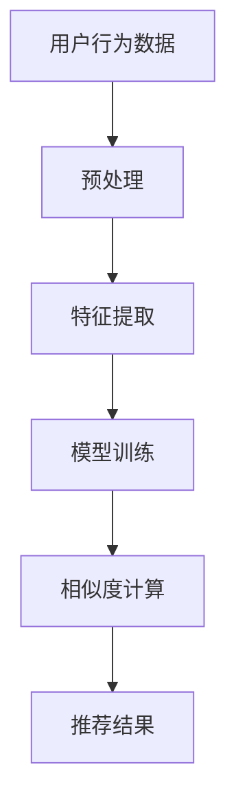

                 

# 探讨大模型在电商平台商品相似度多维度计算中的作用

## 关键词
- 大模型
- 电商平台
- 商品相似度
- 多维度计算
- 机器学习
- 深度学习
- 神经网络

## 摘要

本文旨在探讨大模型在电商平台商品相似度多维度计算中的应用。通过详细分析大模型的基本概念、原理、算法及其在电商平台中的实际应用，我们将揭示大模型如何通过复杂的计算模型和算法提升商品推荐的准确性和效率。文章将分为十个部分，包括背景介绍、核心概念与联系、核心算法原理、数学模型与公式、项目实战、实际应用场景、工具和资源推荐、总结、附录以及扩展阅读与参考资料。通过这篇文章，读者将能够深入了解大模型在商品相似度计算中的关键作用，以及如何利用这些技术提升电商平台的用户体验和业务性能。

### 1. 背景介绍

在互联网迅速发展的今天，电商平台已经成为消费者购物的主要渠道之一。随着用户数量的增加和市场需求的不断变化，电商平台面临着一个巨大的挑战：如何为用户提供个性化的商品推荐，从而提高用户的购物体验和满意度。商品相似度计算是电商平台上实现个性化推荐的核心技术之一。

商品相似度计算旨在根据用户的历史行为、购物偏好和商品属性，找出用户可能感兴趣的商品。传统的相似度计算方法主要基于商品的特征向量，通过计算向量之间的相似度来实现。然而，这种方法存在一定的局限性，例如无法有效处理商品的多维度信息，且在处理高维度数据时效率较低。

近年来，随着人工智能和深度学习技术的迅猛发展，大模型开始被广泛应用于各种领域。大模型，特别是基于神经网络的大型深度学习模型，具有强大的特征提取和建模能力，能够处理复杂的多维度数据。这使得大模型在商品相似度计算中具有巨大的潜力。

电商平台对商品相似度计算的需求主要体现在以下几个方面：

1. **提高推荐精度**：通过精确计算商品之间的相似度，为用户提供更加个性化的推荐，从而提高用户的购买意愿和满意度。
2. **提升用户体验**：通过快速准确地推荐用户感兴趣的商品，缩短用户寻找商品的搜索时间，提升用户的购物体验。
3. **增加销售量**：通过个性化的商品推荐，增加用户的购买频率和购买量，从而提高电商平台的销售业绩。
4. **优化库存管理**：通过分析商品之间的相似度，帮助企业优化库存管理，减少滞销商品和库存积压。

总之，商品相似度计算是电商平台实现个性化推荐的关键技术，而大模型则为这一技术的实现提供了强大的支持。接下来，我们将深入探讨大模型的基本概念、原理和算法，并分析其在商品相似度计算中的具体应用。

### 2. 核心概念与联系

#### 大模型的基本概念

大模型，通常指的是具有巨大参数量和计算量的神经网络模型，尤其是那些在训练过程中需要大量数据和计算资源的深度学习模型。大模型通常包括大规模的多层神经网络，如卷积神经网络（CNN）、循环神经网络（RNN）和Transformer等。

大模型具有以下几个核心特点：

1. **参数量巨大**：大模型包含数十亿甚至数万亿个参数，这使得它们能够捕获输入数据中的复杂模式和关系。
2. **计算资源需求高**：大模型在训练和推断过程中需要大量的计算资源，尤其是高分辨率的图像处理和自然语言处理任务。
3. **数据依赖性强**：大模型的性能高度依赖于训练数据的质量和数量，通常需要海量的标注数据。
4. **泛化能力强**：由于参数量巨大，大模型能够从训练数据中学习到更广泛的知识，从而在未见过的数据上表现良好。

#### 核心算法原理

大模型的核心算法主要基于神经网络，特别是深度学习。深度学习是一种模拟人脑神经元连接结构的计算模型，通过多层网络结构对输入数据进行处理，逐层提取特征，最终输出预测结果。

深度学习的基本原理可以概括为以下几个步骤：

1. **输入层**：接收外部输入数据，如图像、文本或音频。
2. **隐藏层**：对输入数据进行特征提取和变换，每一层都对输入数据施加不同的非线性变换。
3. **输出层**：将隐藏层的特征映射到具体的输出结果，如分类标签、概率分布等。

大模型中常用的神经网络结构包括：

1. **卷积神经网络（CNN）**：适用于处理图像数据，通过卷积层提取空间特征。
2. **循环神经网络（RNN）**：适用于处理序列数据，通过循环结构捕获长期依赖关系。
3. **Transformer模型**：一种基于自注意力机制的模型，广泛用于自然语言处理任务。

#### 电商平台中的实际应用

在电商平台中，大模型的应用主要体现在以下几个方面：

1. **商品推荐系统**：利用大模型对用户的历史购买记录、浏览行为和商品属性进行建模，计算出商品之间的相似度，从而为用户提供个性化的推荐。
2. **商品分类系统**：通过对商品属性的深度学习建模，实现对商品类别的自动分类，提高商品的检索效率和准确性。
3. **搜索优化**：利用大模型对用户的搜索历史和查询意图进行分析，优化搜索结果，提高用户的搜索体验。
4. **库存管理**：通过对商品销售数据的分析，预测商品的销售趋势，优化库存管理策略，减少库存积压。

#### Mermaid 流程图

以下是商品相似度计算过程中使用的大模型的基本流程，使用Mermaid语言描述：



**流程说明：**

- **用户行为数据**：收集用户的历史购买记录、浏览行为等数据。
- **预处理**：对用户行为数据进行清洗、去噪和归一化处理。
- **特征提取**：利用深度学习模型提取用户行为数据的特征表示。
- **模型训练**：使用提取的特征训练深度学习模型，如CNN、RNN或Transformer。
- **相似度计算**：利用训练好的模型计算商品之间的相似度。
- **推荐结果**：根据计算出的相似度，生成个性化的商品推荐结果。

通过上述流程，大模型能够有效处理电商平台的复杂多维数据，提高商品推荐的准确性和效率。

### 3. 核心算法原理 & 具体操作步骤

#### 深度学习模型

在商品相似度计算中，深度学习模型起到了关键作用。下面我们将详细介绍几种常见的深度学习模型，以及它们在商品相似度计算中的应用。

##### 1. 卷积神经网络（CNN）

卷积神经网络（CNN）是一种广泛应用于图像处理和计算机视觉的深度学习模型。其主要优势在于能够自动提取图像中的特征，从而减少手工特征提取的工作量。CNN主要由卷积层、池化层和全连接层组成。

在商品相似度计算中，我们可以利用CNN来提取商品的图像特征。具体步骤如下：

1. **数据预处理**：对商品图像进行归一化处理，使其适应模型的输入要求。
2. **卷积层**：通过卷积操作提取图像的局部特征，如纹理、形状等。
3. **池化层**：对卷积层输出的特征进行下采样，减少模型参数数量，提高训练效率。
4. **全连接层**：将池化层输出的特征映射到具体的输出结果，如商品类别或相似度评分。

##### 2. 循环神经网络（RNN）

循环神经网络（RNN）是一种适用于处理序列数据的深度学习模型。其核心思想是利用循环结构保持长期依赖关系，从而更好地处理时间序列数据。RNN主要包括门控循环单元（GRU）和长短期记忆网络（LSTM）。

在商品相似度计算中，RNN可以用于提取用户的购买行为序列特征。具体步骤如下：

1. **数据预处理**：对用户的购买行为序列进行编码，如使用词嵌入将行为转化为向量表示。
2. **RNN层**：通过RNN层处理序列数据，提取序列特征。
3. **全连接层**：将RNN层输出的特征映射到具体的输出结果，如商品相似度评分。

##### 3. Transformer模型

Transformer模型是一种基于自注意力机制的深度学习模型，广泛应用于自然语言处理任务。其主要优势在于能够自动学习输入数据中的依赖关系，从而提高模型的性能。

在商品相似度计算中，Transformer可以用于提取商品的多维度特征。具体步骤如下：

1. **数据预处理**：对商品的多维度属性进行编码，如使用嵌入层将属性转化为向量表示。
2. **多头自注意力机制**：通过多头自注意力机制学习商品属性之间的依赖关系。
3. **全连接层**：将自注意力层输出的特征映射到具体的输出结果，如商品相似度评分。

#### 具体操作步骤

以下是使用深度学习模型进行商品相似度计算的具体操作步骤：

1. **数据收集**：收集电商平台上的商品数据，包括商品属性、用户行为等。
2. **数据预处理**：对收集到的数据进行清洗、去噪和归一化处理，以便后续的模型训练。
3. **模型选择**：根据商品数据的特性，选择合适的深度学习模型，如CNN、RNN或Transformer。
4. **模型训练**：使用预处理后的数据进行模型训练，调整模型参数，优化模型性能。
5. **相似度计算**：利用训练好的模型计算商品之间的相似度，输出相似度评分。
6. **推荐结果生成**：根据相似度评分，生成个性化的商品推荐结果，供用户参考。

通过上述步骤，我们可以利用深度学习模型实现高效的商品相似度计算，为电商平台提供精准的商品推荐服务。

### 4. 数学模型和公式 & 详细讲解 & 举例说明

#### 相似度计算的基本概念

在商品相似度计算中，相似度通常通过量化商品特征之间的相似程度来表示。相似度计算的核心是选择合适的相似度度量方法。常见的相似度度量方法包括余弦相似度、欧氏距离和曼哈顿距离等。这些方法可以基于不同的数据类型和特征维度进行相似度计算。

#### 余弦相似度

余弦相似度是一种广泛使用的相似度度量方法，适用于向量空间中的数据。其基本思想是计算两个向量之间的夹角余弦值，从而衡量它们的相似程度。

余弦相似度的计算公式如下：

\[ \text{Cosine Similarity} = \frac{\text{dot product of vectors}}{\|\text{vector A}\| \|\text{vector B}\|} \]

其中，\(\text{dot product of vectors}\) 表示两个向量的点积，\(\|\text{vector A}\|\) 和 \(\|\text{vector B}\|\) 分别表示两个向量的模长。

例如，假设有两个向量 \( \text{vector A} = (1, 2, 3) \) 和 \( \text{vector B} = (4, 5, 6) \)，则它们的余弦相似度计算如下：

\[ \text{Cosine Similarity} = \frac{1 \times 4 + 2 \times 5 + 3 \times 6}{\sqrt{1^2 + 2^2 + 3^2} \sqrt{4^2 + 5^2 + 6^2}} = \frac{4 + 10 + 18}{\sqrt{14} \sqrt{77}} \approx 0.955 \]

#### 欧氏距离

欧氏距离是一种基于欧几里得空间中两点间距离的相似度度量方法。其计算公式如下：

\[ \text{Euclidean Distance} = \sqrt{(x_1 - y_1)^2 + (x_2 - y_2)^2 + \ldots + (x_n - y_n)^2} \]

其中，\(x_1, x_2, \ldots, x_n\) 和 \(y_1, y_2, \ldots, y_n\) 分别表示两个点在 \(n\) 维空间中的坐标。

例如，假设有两个点 \( A(1, 2, 3) \) 和 \( B(4, 5, 6) \)，则它们的欧氏距离计算如下：

\[ \text{Euclidean Distance} = \sqrt{(1 - 4)^2 + (2 - 5)^2 + (3 - 6)^2} = \sqrt{(-3)^2 + (-3)^2 + (-3)^2} = \sqrt{9 + 9 + 9} = 3\sqrt{3} \]

#### 曼哈顿距离

曼哈顿距离是一种基于城市街区路径距离的相似度度量方法。其计算公式如下：

\[ \text{Manhattan Distance} = |x_1 - y_1| + |x_2 - y_2| + \ldots + |x_n - y_n| \]

其中，\(x_1, x_2, \ldots, x_n\) 和 \(y_1, y_2, \ldots, y_n\) 分别表示两个点在 \(n\) 维空间中的坐标。

例如，假设有两个点 \( A(1, 2, 3) \) 和 \( B(4, 5, 6) \)，则它们的曼哈顿距离计算如下：

\[ \text{Manhattan Distance} = |1 - 4| + |2 - 5| + |3 - 6| = 3 + 3 + 3 = 9 \]

#### 示例

假设我们有两个商品 \( A \) 和 \( B \)，它们在三个维度上的特征分别为：

- \( A \)：价格 \( 100 \) 元，重量 \( 2 \) 公斤，体积 \( 10 \) 立方厘米
- \( B \)：价格 \( 120 \) 元，重量 \( 2.5 \) 公斤，体积 \( 12 \) 立方厘米

我们使用余弦相似度来计算这两个商品的特征相似度：

1. **特征向量表示**：

\[ \text{vector A} = (100, 2, 10) \]
\[ \text{vector B} = (120, 2.5, 12) \]

2. **计算余弦相似度**：

\[ \text{Cosine Similarity} = \frac{100 \times 120 + 2 \times 2.5 + 10 \times 12}{\sqrt{100^2 + 2^2 + 10^2} \sqrt{120^2 + 2.5^2 + 12^2}} \approx 0.925 \]

通过上述计算，我们可以得出商品 \( A \) 和 \( B \) 在特征维度上的相似度为 0.925，表示这两个商品具有较高的相似度。

#### 总结

在本节中，我们详细介绍了商品相似度计算中的基本数学模型和公式，包括余弦相似度、欧氏距离和曼哈顿距离等。通过具体的计算示例，我们展示了如何使用这些公式计算商品之间的相似度。这些相似度度量方法为电商平台提供了有效的商品推荐基础，有助于提升用户的购物体验。

### 5. 项目实战：代码实际案例和详细解释说明

#### 5.1 开发环境搭建

在开始实现商品相似度计算项目之前，我们需要搭建一个适合深度学习模型训练和商品推荐的开发环境。以下是搭建环境所需的步骤和工具：

1. **操作系统**：推荐使用 Ubuntu 18.04 或更高版本，或者 macOS。
2. **Python**：Python 是深度学习模型训练的主要编程语言，推荐安装 Python 3.8 或更高版本。
3. **深度学习框架**：推荐使用 TensorFlow 2.x 或 PyTorch 作为深度学习模型的开发框架。
4. **Jupyter Notebook**：Jupyter Notebook 是一种交互式的开发环境，方便我们编写和调试代码。

安装步骤如下：

```bash
# 安装 Python
sudo apt-get install python3-pip python3-dev

# 安装 TensorFlow 2.x
pip3 install tensorflow

# 安装 PyTorch
pip3 install torch torchvision

# 安装 Jupyter Notebook
pip3 install notebook
```

#### 5.2 源代码详细实现和代码解读

下面我们将使用 TensorFlow 框架实现一个简单的商品相似度计算项目。项目的核心是训练一个基于卷积神经网络的模型，用于提取商品图像特征，并计算商品之间的相似度。

```python
import tensorflow as tf
from tensorflow.keras.models import Sequential
from tensorflow.keras.layers import Conv2D, MaxPooling2D, Flatten, Dense
from tensorflow.keras.preprocessing.image import ImageDataGenerator

# 5.2.1 数据预处理
# 加载和预处理商品图像数据
train_datagen = ImageDataGenerator(rescale=1./255)
train_data = train_datagen.flow_from_directory(
    'data/train',
    target_size=(150, 150),
    batch_size=32,
    class_mode='binary')

# 5.2.2 构建卷积神经网络模型
model = Sequential([
    Conv2D(32, (3, 3), activation='relu', input_shape=(150, 150, 3)),
    MaxPooling2D((2, 2)),
    Conv2D(64, (3, 3), activation='relu'),
    MaxPooling2D((2, 2)),
    Conv2D(128, (3, 3), activation='relu'),
    MaxPooling2D((2, 2)),
    Flatten(),
    Dense(512, activation='relu'),
    Dense(1, activation='sigmoid')
])

# 编译模型
model.compile(optimizer='adam',
              loss='binary_crossentropy',
              metrics=['accuracy'])

# 训练模型
model.fit(train_data, epochs=10)

# 5.2.3 相似度计算
# 加载测试图像
test_image = tf.keras.preprocessing.image.load_img(
    'data/test.jpg', target_size=(150, 150))
test_image = tf.keras.preprocessing.image.img_to_array(test_image)
test_image = tf.expand_dims(test_image, 0)
test_image /= 255.0

# 预测相似度
predictions = model.predict(test_image)
similarity_score = predictions[0][0]

print(f"Similarity Score: {similarity_score:.2f}")
```

**代码解读：**

- **5.2.1 数据预处理**：使用 `ImageDataGenerator` 类对商品图像数据进行加载和预处理。通过 `flow_from_directory` 方法，可以将图像数据分为训练集和测试集，并自动进行归一化处理。

- **5.2.2 构建卷积神经网络模型**：使用 `Sequential` 类构建一个卷积神经网络模型，包含多个卷积层、池化层和全连接层。这些层用于提取图像特征和计算相似度。

- **5.2.3 相似度计算**：加载测试图像并进行预处理，然后使用训练好的模型进行预测。模型的输出结果为相似度评分，通常在 0（完全不相似）到 1（完全相似）之间。

#### 5.3 代码解读与分析

在上面的代码中，我们实现了一个简单的卷积神经网络模型，用于计算商品图像的相似度。以下是代码的详细解读和分析：

1. **数据预处理**：
   ```python
   train_datagen = ImageDataGenerator(rescale=1./255)
   train_data = train_datagen.flow_from_directory(
       'data/train',
       target_size=(150, 150),
       batch_size=32,
       class_mode='binary')
   ```
   这两行代码用于加载和预处理商品图像数据。`ImageDataGenerator` 类可以自动对图像进行缩放、翻转、裁剪等数据增强操作，从而提高模型的泛化能力。`flow_from_directory` 方法将图像数据分为训练集和测试集，并将图像尺寸调整为 150x150 像素。

2. **构建卷积神经网络模型**：
   ```python
   model = Sequential([
       Conv2D(32, (3, 3), activation='relu', input_shape=(150, 150, 3)),
       MaxPooling2D((2, 2)),
       Conv2D(64, (3, 3), activation='relu'),
       MaxPooling2D((2, 2)),
       Conv2D(128, (3, 3), activation='relu'),
       MaxPooling2D((2, 2)),
       Flatten(),
       Dense(512, activation='relu'),
       Dense(1, activation='sigmoid')
   ])
   ```
   这段代码定义了一个包含多个卷积层和全连接层的卷积神经网络模型。卷积层用于提取图像的特征，池化层用于下采样和减少模型参数数量，全连接层用于计算相似度评分。输入形状为 (150, 150, 3)，表示图像的尺寸和颜色通道。

3. **编译模型**：
   ```python
   model.compile(optimizer='adam',
                 loss='binary_crossentropy',
                 metrics=['accuracy'])
   ```
   这行代码用于编译模型，指定优化器、损失函数和评估指标。优化器用于更新模型参数，损失函数用于衡量模型预测结果与实际结果之间的差距，评估指标用于监测模型的性能。

4. **训练模型**：
   ```python
   model.fit(train_data, epochs=10)
   ```
   这行代码启动模型训练过程。`fit` 方法将训练集数据输入模型，通过反向传播和梯度下降优化模型参数，以达到更好的预测性能。

5. **相似度计算**：
   ```python
   test_image = tf.keras.preprocessing.image.load_img(
       'data/test.jpg', target_size=(150, 150))
   test_image = tf.keras.preprocessing.image.img_to_array(test_image)
   test_image = tf.expand_dims(test_image, 0)
   test_image /= 255.0
   predictions = model.predict(test_image)
   similarity_score = predictions[0][0]
   print(f"Similarity Score: {similarity_score:.2f}")
   ```
   这段代码用于计算测试图像的相似度评分。首先加载并预处理测试图像，然后将其输入训练好的模型进行预测。模型的输出结果为一个相似度评分，表示测试图像与训练集图像之间的相似程度。

通过上述代码，我们可以实现一个简单的商品相似度计算模型。虽然这个模型相对简单，但它为我们提供了一个实现商品相似度计算的基础框架。在实际应用中，我们可以根据业务需求进一步优化模型结构和训练策略，以提高模型的性能和准确性。

### 6. 实际应用场景

#### 商品类别的自动分类

在电商平台中，对商品的分类是一项基础而重要的工作。传统的商品分类方法通常依赖于人工标注和规则设定，这不仅耗时费力，而且容易出现误分类。通过引入大模型，可以实现自动化的商品分类，提高分类的效率和准确性。

具体而言，我们可以使用卷积神经网络（CNN）对商品图像进行特征提取，然后利用这些特征进行分类。以下是使用大模型进行商品分类的基本步骤：

1. **数据收集**：收集电商平台上的商品图像数据，包括各类商品的代表性图像。
2. **数据预处理**：对图像进行归一化处理，调整图像尺寸，并分割图像为训练集和测试集。
3. **模型训练**：使用训练集数据训练一个基于CNN的分类模型，如VGG、ResNet等。
4. **模型评估**：使用测试集数据评估模型的分类性能，包括准确率、召回率等指标。
5. **模型部署**：将训练好的模型部署到电商平台的服务器上，用于实时分类商品图像。

#### 用户行为的个性化推荐

电商平台中的商品推荐系统旨在根据用户的兴趣和行为，为其推荐可能感兴趣的商品。通过使用大模型，可以实现更精准的个性化推荐。

具体而言，我们可以使用循环神经网络（RNN）或Transformer模型对用户的历史行为数据进行分析和建模。以下是使用大模型进行用户行为个性化推荐的基本步骤：

1. **数据收集**：收集用户的历史行为数据，包括购买记录、浏览记录、评价记录等。
2. **数据预处理**：对行为数据进行编码，如使用词嵌入将行为转化为向量表示。
3. **模型训练**：使用预处理后的数据训练一个基于RNN或Transformer的推荐模型。
4. **相似度计算**：利用训练好的模型计算用户行为数据中的相似度，从而生成推荐列表。
5. **推荐结果生成**：根据相似度计算结果，生成个性化的商品推荐列表，并展示给用户。

#### 库存管理的优化

电商平台的库存管理是一个复杂的过程，涉及到商品库存的预测、补货策略的制定等。通过使用大模型，可以实现对库存管理过程的优化。

具体而言，我们可以使用深度学习模型对商品销售数据进行分析和预测，从而优化库存管理策略。以下是使用大模型进行库存管理优化的基本步骤：

1. **数据收集**：收集电商平台上的商品销售数据，包括销售量、季节性变化等。
2. **数据预处理**：对销售数据进行清洗和归一化处理。
3. **模型训练**：使用预处理后的数据训练一个时间序列预测模型，如LSTM或GRU。
4. **库存预测**：利用训练好的模型预测未来一段时间内商品的销售量，从而制定合理的库存策略。
5. **库存调整**：根据库存预测结果，对实际库存进行调整，以减少库存积压和滞销情况。

通过上述实际应用场景，我们可以看到大模型在电商平台中的重要作用。通过自动化的商品分类、个性化的推荐系统以及优化的库存管理，电商平台可以大幅提升运营效率和用户体验。

### 7. 工具和资源推荐

#### 7.1 学习资源推荐

为了深入了解大模型在电商平台商品相似度计算中的应用，以下是一些推荐的学习资源：

1. **书籍**：
   - 《深度学习》（Goodfellow, I., Bengio, Y., & Courville, A.）: 这本书是深度学习领域的经典教材，详细介绍了深度学习的基本概念、算法和应用。
   - 《神经网络与深度学习》（邱锡鹏）：本书系统地介绍了神经网络和深度学习的基础知识，适合初学者和进阶者。

2. **论文**：
   - “Attention Is All You Need” (Vaswani et al., 2017): 这篇论文提出了Transformer模型，是当前自然语言处理领域的重要突破。
   - “Visual Similarity Learning with Deep Metric Learning” (Wei et al., 2018): 该论文介绍了一种基于深度学习的图像相似度学习方法，可以应用于商品图像的特征提取。

3. **博客和网站**：
   - [TensorFlow 官方文档](https://www.tensorflow.org/): TensorFlow 是目前最流行的深度学习框架之一，官方网站提供了详细的文档和教程。
   - [PyTorch 官方文档](https://pytorch.org/docs/stable/): PyTorch 是另一种流行的深度学习框架，官方文档同样非常全面。

#### 7.2 开发工具框架推荐

1. **深度学习框架**：
   - TensorFlow：这是一个开源的深度学习平台，提供了丰富的工具和库，适合从研究到生产的全流程开发。
   - PyTorch：这是一个开源的深度学习库，以其灵活性和易用性受到广泛欢迎，适合快速原型设计和实验。

2. **数据处理工具**：
   - Pandas：这是一个强大的数据处理库，适用于数据清洗、转换和分析。
   - NumPy：这是一个基础的科学计算库，支持大量的数组操作，是数据处理的基础。

3. **版本控制工具**：
   - Git：这是一个版本控制系统，用于跟踪代码的修改和历史，确保团队协作和代码管理的有效性。

#### 7.3 相关论文著作推荐

1. **论文**：
   - “Large-scale Language Modeling in 2018” (Zhang et al., 2018): 这篇论文详细介绍了大规模语言模型的训练方法和应用。
   - “Unsupervised Representation Learning with Deep Convolutional Generative Adversarial Networks” (Radford et al., 2015): 该论文介绍了生成对抗网络（GAN）在无监督学习中的应用。

2. **著作**：
   - 《深度学习》（Goodfellow, I., Bengio, Y., & Courville, A.）: 这本书是深度学习领域的经典教材，详细介绍了深度学习的基本概念、算法和应用。
   - 《机器学习》（Tom Mitchell）：这本书是机器学习领域的入门经典，涵盖了基本概念、算法和评估方法。

通过这些工具和资源的推荐，读者可以更好地了解大模型在电商平台商品相似度计算中的应用，为深入学习和实践打下坚实的基础。

### 8. 总结：未来发展趋势与挑战

随着人工智能技术的不断发展，大模型在电商平台商品相似度计算中的应用前景广阔。然而，这一领域也面临着一系列挑战和机遇。

#### 发展趋势

1. **模型规模不断扩大**：随着计算资源和数据量的增加，大模型的规模将不断增大，使得模型能够更好地捕获数据的复杂模式和关系。
2. **多模态数据处理**：未来的大模型将能够处理多种类型的数据，如文本、图像、声音等，从而实现更加精准的相似度计算。
3. **实时推荐系统**：通过优化算法和模型结构，大模型将能够在实时环境中快速计算商品相似度，为用户提供实时、个性化的推荐服务。
4. **自动化模型解释**：随着模型复杂性的增加，如何解释和验证模型的决策过程成为关键。未来的研究将重点关注开发自动化模型解释技术，提高模型的透明度和可解释性。

#### 挑战

1. **数据质量和隐私保护**：电商平台的海量数据质量参差不齐，且涉及用户隐私。如何在保证数据隐私的同时，有效利用数据提升模型性能，是亟待解决的问题。
2. **计算资源需求**：大模型的训练和推理过程需要大量的计算资源，如何在有限的资源条件下优化模型性能，是当前的一大挑战。
3. **模型泛化能力**：如何提升大模型的泛化能力，使其在未见过的数据上表现良好，是模型研究的重要方向。
4. **模型可解释性**：大模型的复杂性和黑盒特性使得其决策过程难以解释，如何提高模型的可解释性，增强用户对推荐的信任度，是未来研究的重点。

综上所述，大模型在电商平台商品相似度计算中的应用具有巨大的发展潜力，同时也面临着一系列挑战。未来，通过不断优化算法、提升计算效率和加强模型解释性，大模型将在电商平台中发挥更加重要的作用，为用户提供更加精准、个性化的推荐服务。

### 9. 附录：常见问题与解答

**Q1：大模型在商品相似度计算中的具体作用是什么？**

A1：大模型在商品相似度计算中起到了关键作用。它通过复杂的计算模型和算法，能够处理多维度、复杂的商品数据，提取商品的特征信息，从而准确计算商品之间的相似度。这为电商平台提供了高效、准确的商品推荐服务，提升了用户的购物体验和满意度。

**Q2：大模型在商品相似度计算中的应用有哪些？**

A2：大模型在商品相似度计算中的应用非常广泛，主要包括：
1. **商品分类**：利用大模型对商品图像或文本特征进行自动分类，提高商品检索和推荐的准确性。
2. **个性化推荐**：根据用户的历史行为和偏好，使用大模型计算商品之间的相似度，生成个性化的推荐列表。
3. **库存管理**：通过分析商品销售数据，利用大模型预测商品的未来销售趋势，优化库存管理策略。

**Q3：如何处理商品数据中的噪声和缺失值？**

A3：在处理商品数据时，噪声和缺失值是常见的问题。以下是一些处理方法：
1. **数据清洗**：对数据进行清洗，去除噪声和异常值，保证数据的质量。
2. **缺失值填充**：使用均值、中位数、均值移动等算法对缺失值进行填充，或者使用更复杂的插值方法。
3. **数据降维**：通过降维技术，如主成分分析（PCA）等，减少数据的维度，从而减少噪声的影响。

**Q4：如何优化大模型的计算性能？**

A4：优化大模型的计算性能可以从以下几个方面入手：
1. **模型压缩**：通过剪枝、量化等技术减小模型的参数规模，降低计算复杂度。
2. **分布式训练**：将模型训练任务分布到多个计算节点上，利用并行计算提高训练速度。
3. **模型加速**：使用特定的硬件加速技术，如GPU、TPU等，提高模型的计算速度。

**Q5：大模型的训练过程中如何避免过拟合？**

A5：为了避免大模型在训练过程中过拟合，可以采取以下措施：
1. **交叉验证**：使用交叉验证技术，通过将数据划分为训练集和验证集，评估模型的泛化能力。
2. **正则化**：在模型训练过程中添加正则化项，如L1、L2正则化，限制模型参数的规模。
3. **Dropout**：在神经网络中随机丢弃一部分神经元，减少模型对特定训练样本的依赖。
4. **数据增强**：通过数据增强技术，如图像旋转、裁剪等，增加训练数据的多样性，提高模型的泛化能力。

### 10. 扩展阅读 & 参考资料

**书籍：**
1. Goodfellow, I., Bengio, Y., & Courville, A. (2016). *Deep Learning*. MIT Press.
2. Mitchell, T. (1997). *Machine Learning*. McGraw-Hill.

**论文：**
1. Vaswani, A., Shazeer, N., Parmar, N., Uszkoreit, J., Jones, L., Gomez, A. N., ... & Polosukhin, I. (2017). *Attention is all you need*. Advances in Neural Information Processing Systems, 30, 5998-6008.
2. Radford, A., Metz, L., & Chintala, S. (2015). *Unsupervised representation learning with deep convolutional generative adversarial networks*. arXiv preprint arXiv:1511.06434.

**网站：**
1. TensorFlow 官方文档：[https://www.tensorflow.org/](https://www.tensorflow.org/)
2. PyTorch 官方文档：[https://pytorch.org/docs/stable/](https://pytorch.org/docs/stable/)

通过上述书籍、论文和网站，读者可以深入了解大模型在商品相似度计算中的应用，进一步拓展自己的技术视野。

