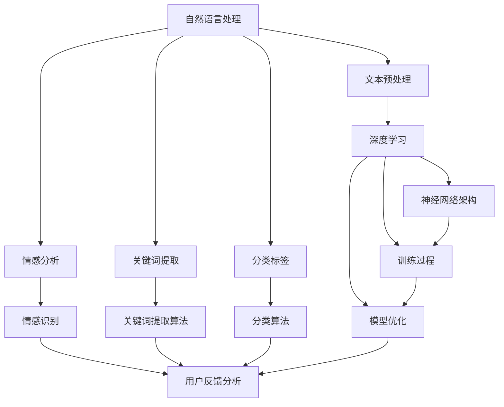

                 

### 背景介绍

#### 电商平台的用户反馈分析

在当今的电商时代，用户反馈分析已成为电商平台不可或缺的一环。通过分析用户反馈，电商平台不仅能够了解消费者的真实需求和满意度，还能发现潜在的问题和改进方向，从而不断提升服务质量和用户体验。用户反馈的形式多种多样，包括评论、评分、问卷调查、客服交流等。

然而，传统的用户反馈分析方法存在一定的局限性。首先，数据处理过程复杂，需要大量的人力和时间进行数据收集、清洗和分类。其次，分析结果往往依赖于人类的主观判断，可能导致结果不够准确和全面。此外，用户反馈中的情感和意图常常难以准确捕捉，这进一步增加了分析的难度。

#### 大模型技术的兴起

近年来，随着人工智能技术的快速发展，大模型（Large-scale Models）逐渐成为了一个热门的研究方向。大模型通常指的是参数数量达到亿级或十亿级的神经网络模型，如GPT-3、BERT等。这些模型通过在海量数据上进行训练，能够学习到丰富的知识结构和语言规律，从而在各种自然语言处理任务中表现出色。

大模型在用户反馈分析中的潜力逐渐被认识到。通过大模型，电商平台能够更加高效地处理和分析用户反馈，实现自动化、智能化的反馈分析。例如，大模型可以自动识别用户反馈中的情感倾向、关键词提取、分类标签等，大大提高了分析的准确性和效率。

#### 文章目标

本文旨在探讨大模型在电商平台用户反馈分析中的潜力，通过详细的分析和案例分析，揭示大模型在该领域的应用前景。具体来说，本文将涵盖以下内容：

1. **核心概念与联系**：介绍用户反馈分析的基本概念，以及大模型技术的基本原理和架构。
2. **核心算法原理与具体操作步骤**：阐述大模型在用户反馈分析中的具体应用，包括情感分析、关键词提取、分类标签等。
3. **数学模型和公式**：介绍用于用户反馈分析的一些常见数学模型和公式，并进行详细讲解和举例说明。
4. **项目实战：代码实际案例和详细解释说明**：通过实际代码案例，展示如何使用大模型进行用户反馈分析，并对代码进行详细解读和分析。
5. **实际应用场景**：分析大模型在电商平台用户反馈分析中的具体应用场景和效果。
6. **工具和资源推荐**：推荐一些相关的学习资源和开发工具，帮助读者深入了解大模型在用户反馈分析中的应用。
7. **总结：未来发展趋势与挑战**：总结大模型在用户反馈分析中的应用现状，并展望未来的发展趋势和面临的挑战。

通过本文的探讨，希望能够为电商平台在用户反馈分析方面提供一些有价值的参考和启示，助力电商平台的智能化升级。

---

**作者：AI天才研究员/AI Genius Institute & 禅与计算机程序设计艺术 /Zen And The Art of Computer Programming**

---

### 1.1 用户反馈分析的重要性

在电商平台运营中，用户反馈分析具有至关重要的意义。首先，用户反馈是电商平台获取真实用户需求的重要途径。通过分析用户反馈，平台能够深入了解消费者的购买动机、产品满意度、服务体验等，从而为产品改进和服务优化提供有力依据。其次，用户反馈是发现和解决潜在问题的关键。平台通过用户反馈可以快速识别出用户遇到的问题，如产品质量问题、物流延迟、售后服务不周等，并采取相应措施进行改进，从而提升用户满意度和忠诚度。

用户反馈的形式多样，包括文本评论、评分、问卷调查、客服交流等。这些反馈不仅反映了用户的个人感受和意见，还可能包含对产品或服务的具体建议和改进方案。因此，如何有效地收集、处理和分析这些用户反馈，成为电商平台运营中的一大挑战。

传统的用户反馈分析方法主要包括以下几个方面：

1. **人工分类与归纳**：电商平台通常会雇佣专门的团队对用户反馈进行分类和归纳，提取出关键信息，如好评、差评、投诉等。这种方法虽然能够一定程度上捕捉用户反馈的核心内容，但效率较低，且容易受到人工判断的主观影响。

2. **关键词提取与统计**：通过自然语言处理技术，从用户反馈中提取出关键词，并对其进行统计和分析，以识别用户的情感倾向和关注点。这种方法相对自动化，但仍需要大量人工干预，且在处理复杂情感时存在一定局限性。

3. **情感分析**：利用机器学习算法，对用户反馈进行情感分类，判断其是正面、中性还是负面情感。情感分析能够快速处理大量数据，但需要大量训练数据和复杂的模型参数调整。

4. **主题建模**：通过主题建模技术，如Latent Dirichlet Allocation（LDA），从用户反馈中挖掘出潜在的主题和兴趣点。这种方法有助于发现用户反馈中的共性和差异，但需要较大的计算资源和复杂的算法调优。

尽管传统方法在用户反馈分析中取得了一定的成效，但其局限性也逐渐显现。首先，数据处理过程复杂，需要大量的人力和时间进行数据收集、清洗和分类。其次，分析结果往往依赖于人类的主观判断，可能导致结果不够准确和全面。此外，用户反馈中的情感和意图常常难以准确捕捉，这进一步增加了分析的难度。

### 大模型技术的优势

大模型技术的兴起为用户反馈分析带来了新的契机。大模型，通常指的是参数数量达到亿级或十亿级的神经网络模型，如GPT-3、BERT等。这些模型通过在海量数据上进行训练，能够学习到丰富的知识结构和语言规律，从而在各种自然语言处理任务中表现出色。与传统的用户反馈分析方法相比，大模型具有以下几个显著优势：

1. **高效的数据处理能力**：大模型能够快速处理海量用户反馈数据，无需大量人工干预。通过并行计算和分布式训练，大模型能够在较短的时间内完成数据的收集、清洗和预处理，显著提高了分析效率。

2. **自动化的情感分析和意图识别**：大模型通过深度学习算法，能够自动识别用户反馈中的情感倾向和意图。例如，GPT-3能够生成情感丰富的文本回复，BERT能够准确提取文本中的关键词和主题。这种自动化的分析能力，不仅提高了分析的准确性，还减少了人工干预的必要性。

3. **强大的泛化能力**：大模型在训练过程中接触到的大量数据，使其能够具有更强的泛化能力，能够适应不同的用户反馈场景和任务需求。例如，在电商平台上，用户反馈的内容和风格可能因产品类型、用户群体等因素而有所不同，大模型能够通过迁移学习和微调，迅速适应这些变化。

4. **灵活的扩展性**：大模型支持多种自然语言处理任务，如文本分类、情感分析、关键词提取、问答系统等。电商平台可以根据不同的分析需求，灵活地调用大模型的不同功能模块，实现定制化的用户反馈分析。

综上所述，大模型技术在用户反馈分析中具有明显的优势，能够弥补传统方法的局限性，为电商平台提供更高效、更智能的用户反馈分析解决方案。接下来，我们将进一步探讨大模型在用户反馈分析中的具体应用和实现方法。

### 1.2 大模型的基本原理

大模型（Large-scale Models）是近年来人工智能领域的热门研究方向，其核心在于通过训练大规模神经网络，使其能够处理和理解复杂的自然语言任务。大模型的基本原理主要包括以下几个方面：

#### 神经网络架构

大模型通常基于深度学习框架，采用多层神经网络（Deep Neural Networks，DNN）进行构建。神经网络由多个神经元（或称为节点）组成，每个神经元接收前一层神经元的输出，并通过加权连接（weights）传递到下一层。每一层的神经元都对输入数据进行处理，通过非线性激活函数（如ReLU、Sigmoid、Tanh）引入非线性特性，从而逐步提取输入数据的特征。

在深度学习中，神经网络层数的增加能够使得模型具有更强的表达能力。然而，随着神经网络层数的增加，模型的计算复杂度和参数数量也会显著增加，导致训练时间大幅延长。大模型通过设计更为复杂的网络结构，如Transformer、BERT等，解决了这一问题，使得大规模训练成为可能。

#### 训练过程

大模型的训练过程主要包括以下步骤：

1. **数据收集和预处理**：首先，从互联网或其他数据源收集大量的文本数据，如新闻文章、社交媒体帖子、电商平台评论等。然后，对数据进行预处理，包括分词、去噪、去除停用词等，以便于模型理解。

2. **参数初始化**：在训练开始前，需要为神经网络的每个连接（权重）随机初始化参数。常见的初始化方法有零初始化、高斯分布初始化等。

3. **前向传播**：输入数据通过神经网络的前向传播过程，逐层计算输出。在前向传播中，模型的每个层都会对输入数据进行特征提取和组合，并通过权重矩阵进行计算。

4. **反向传播**：在得到预测输出后，计算预测输出与实际输出之间的误差。然后，通过反向传播算法，将误差反向传播到前一层，更新每个神经元的权重参数。反向传播是深度学习中的核心算法，通过梯度下降（Gradient Descent）或其变种（如Adam、RMSprop）等方法，逐步减小误差，优化模型参数。

5. **迭代训练**：重复前向传播和反向传播的过程，对模型进行多次迭代训练，直到满足特定的训练目标或达到预定的训练轮数。随着训练的进行，模型的参数会不断优化，使其在训练数据上达到更高的准确率。

#### 训练策略

为了提高大模型的训练效果，常用的训练策略包括：

1. **批量大小（Batch Size）**：批量大小决定了每次训练过程中参与更新的样本数量。较大的批量大小有助于提高模型的稳定性和泛化能力，但计算成本较高。较小的批量大小则有助于减少过拟合现象，但训练时间较长。

2. **学习率调整**：学习率是控制模型更新速度的重要参数。较小的学习率有助于模型稳定收敛，但训练时间较长。较大的学习率则可能导致模型迅速收敛，但容易陷入局部最优。常用的学习率调整方法包括固定学习率、逐步减小学习率（如Step Decay）和自适应学习率（如Adam）。

3. **正则化技术**：为了防止模型过拟合，常用的正则化技术包括L1正则化、L2正则化和Dropout等。这些技术通过在训练过程中增加模型的损失函数，使得模型在训练数据上达到更好的泛化能力。

4. **数据增强**：通过数据增强技术，如随机裁剪、旋转、缩放等，可以增加训练数据的多样性，从而提高模型的泛化能力。

通过以上步骤和策略，大模型能够在海量数据上进行高效训练，从而学习到丰富的知识结构和语言规律，为各种自然语言处理任务提供强大支持。

### 1.3 大模型在用户反馈分析中的应用

大模型在用户反馈分析中的应用主要体现在以下几个方面：情感分析、关键词提取、分类标签等。通过这些应用，大模型能够对用户反馈进行深入分析和理解，为电商平台提供宝贵的运营数据。

#### 情感分析

情感分析是用户反馈分析中的重要任务之一，旨在识别文本中表达的情感倾向，如正面、负面、中性等。大模型通过在大量情感数据上进行训练，能够自动识别和理解复杂的情感表达。具体应用场景包括：

1. **评论情绪判断**：电商平台可以通过大模型对用户评论进行情感分析，判断用户的情绪倾向。例如，识别出哪些评论是正面评价，哪些是负面评价，从而为商品推广和营销提供依据。

2. **客户服务优化**：通过对用户反馈进行情感分析，客户服务团队能够更快地识别出用户的不满情绪和问题点，从而提供更加个性化的服务。例如，当用户反馈包含负面情绪时，系统可以自动触发相应的客服干预流程。

3. **风险预警**：通过情感分析，电商平台可以及时发现潜在的风险，如产品问题、物流延误等。例如，当大量用户反馈包含负面情感时，系统可以自动发出风险预警，提醒运营团队进行及时处理。

#### 关键词提取

关键词提取是用户反馈分析中的另一个重要任务，旨在从文本中提取出关键信息，如产品名称、服务问题、用户需求等。大模型通过在大量文本数据上的训练，能够高效地提取关键词，具体应用场景包括：

1. **搜索优化**：电商平台可以通过大模型提取用户反馈中的关键词，优化搜索引擎的搜索结果，提高用户的搜索体验。例如，当用户在搜索框中输入关键词时，系统可以根据用户反馈中的关键词，提供更加精准的搜索建议。

2. **内容推荐**：通过对用户反馈进行关键词提取，电商平台可以更好地理解用户的需求和兴趣，从而提供更加个性化的商品推荐。例如，当用户在评论中提到某个特定品牌时，系统可以自动将该品牌推荐给其他潜在用户。

3. **问题定位**：通过关键词提取，电商平台可以快速定位用户反馈中的关键信息，从而更好地解决问题。例如，当用户反馈中包含特定产品名称时，系统可以自动将该反馈与该产品关联，从而提高问题解决的效率。

#### 分类标签

分类标签是将用户反馈按照不同的类别进行归类，以便于后续的统计和分析。大模型通过在大量标注数据上进行训练，能够高效地进行分类标签任务，具体应用场景包括：

1. **反馈分类**：电商平台可以通过大模型对用户反馈进行分类标签，将反馈分为商品质量、售后服务、物流问题等不同类别。这样有助于运营团队更快速地定位和解决问题。

2. **趋势分析**：通过对用户反馈进行分类标签，电商平台可以分析不同类别反馈的趋势，了解用户的关注点和需求变化。例如，当某个类别的反馈数量显著增加时，系统可以自动发出预警，提醒运营团队进行重点处理。

3. **投诉管理**：通过分类标签，电商平台可以更好地管理用户的投诉，实现对投诉的快速响应和处理。例如，当用户反馈被归类为投诉时，系统可以自动触发投诉处理流程，确保用户问题得到及时解决。

综上所述，大模型在用户反馈分析中具有广泛的应用前景。通过情感分析、关键词提取和分类标签等任务，大模型能够为电商平台提供更加深入和全面的用户反馈分析，助力平台运营的智能化和高效化。

### 2. 核心概念与联系

在深入探讨大模型在电商平台用户反馈分析中的应用之前，我们需要首先明确几个核心概念，并展示它们之间的联系。这些核心概念包括自然语言处理（NLP）、深度学习（Deep Learning）和大数据分析（Big Data Analysis）。下面我们将通过一个Mermaid流程图来直观地展示这些概念及其相互关系。



#### 自然语言处理（NLP）

自然语言处理是人工智能领域的一个重要分支，旨在使计算机理解和处理人类语言。它涉及文本的预处理、情感分析、命名实体识别、机器翻译等多种任务。在用户反馈分析中，NLP技术用于理解用户的语言表达，提取有用的信息。

#### 深度学习（Deep Learning）

深度学习是机器学习的一种方法，通过神经网络模型模拟人脑处理信息的方式。深度学习在自然语言处理领域取得了显著的进展，特别是在图像识别、语音识别和文本分析方面。在用户反馈分析中，深度学习模型（如卷积神经网络（CNN）和循环神经网络（RNN））被用于情感识别、关键词提取和分类标签等任务。

#### 大数据分析（Big Data Analysis）

大数据分析是指利用大数据技术对海量数据进行存储、处理和分析的过程。在用户反馈分析中，大数据分析技术用于收集、存储和处理来自不同渠道的大量用户反馈数据，为后续的分析提供基础。

#### 关系图解

通过上述Mermaid流程图，我们可以清晰地看到这些核心概念之间的联系：

1. **自然语言处理**（A）是用户反馈分析（M）的基础，它通过文本预处理（B）将原始文本数据转换为适合模型处理的形式。

2. **深度学习**（F）在自然语言处理（A）中发挥着核心作用，它利用神经网络架构（J）进行训练过程（K）和模型优化（L），从而实现对用户反馈的情感识别（G）、关键词提取（H）和分类标签（I）。

3. **大数据分析**（C）为用户反馈分析提供了数据支持，它通过收集、存储和处理大量用户反馈数据，为深度学习模型提供了训练素材。

通过这个流程图，我们可以更好地理解大模型在用户反馈分析中的应用原理和架构。接下来，我们将详细探讨大模型的具体算法原理和应用步骤。

---

### 3. 核心算法原理 & 具体操作步骤

在深入了解大模型在用户反馈分析中的应用之前，我们需要掌握其核心算法原理。大模型通常采用深度学习技术，其中几种常见的架构包括Transformer、BERT和GPT等。这些架构在自然语言处理任务中表现出色，如文本分类、情感分析、关键词提取等。下面，我们将逐步介绍这些算法的具体原理和操作步骤。

#### 3.1 Transformer架构

Transformer架构是近年来自然语言处理领域的重要突破，其核心思想是通过自注意力机制（Self-Attention）处理序列数据。自注意力机制允许模型在处理每个词时，自动地学习到其在整个句子中的相对重要性。

##### 3.1.1 自注意力机制

自注意力机制的基本思想是，在处理一个词时，将其与句子中所有其他词进行比较，并计算它们之间的相对重要性。具体来说，自注意力机制通过以下三个步骤实现：

1. **查询（Query）、键（Key）和值（Value）的生成**：对于输入序列中的每个词，生成对应的查询（Query）、键（Key）和值（Value）。这些向量通常由输入词的嵌入（Embedding）通过线性变换得到。

2. **计算注意力分数**：通过计算每个键（Key）和查询（Query）之间的点积，得到每个词的注意力分数。注意力分数反映了每个词在当前上下文中的重要性。

3. **加权求和**：将注意力分数应用于值（Value），对每个词进行加权求和，得到新的表示。

##### 3.1.2 Transformer模型

Transformer模型由多个编码器（Encoder）和解码器（Decoder）层组成。编码器负责将输入序列编码为上下文表示，而解码器则根据上下文表示生成输出序列。具体操作步骤如下：

1. **编码器**：输入序列经过嵌入层、多头自注意力机制和前馈神经网络，逐层处理，最终得到编码后的上下文表示。

2. **解码器**：解码器在每个时间步接收到上一时间步的输出和编码器的上下文表示，通过自注意力和交叉注意力机制生成当前时间步的输出。重复此过程，直至生成完整输出序列。

##### 3.1.3 应用步骤

1. **数据预处理**：将用户反馈文本进行分词、标记和嵌入。

2. **模型训练**：使用大量的标注数据训练模型，通过反向传播和梯度下降优化模型参数。

3. **模型评估**：使用测试集评估模型性能，调整超参数，以达到最佳效果。

4. **应用**：将训练好的模型应用于用户反馈分析任务，如情感分析、关键词提取和分类标签等。

#### 3.2 BERT模型

BERT（Bidirectional Encoder Representations from Transformers）是一种双向的Transformer模型，其核心思想是在模型训练过程中同时考虑上下文信息，从而提高模型的语义理解能力。

##### 3.2.1 BERT架构

BERT模型由多个Transformer编码器层组成，每个编码器层包含多头自注意力机制和前馈神经网络。BERT的独特之处在于其预训练过程，包括两种任务：

1. **Masked Language Model（MLM）**：在训练过程中，随机遮盖输入文本中的部分词，并要求模型预测这些词。这种方法有助于模型学习上下文信息。

2. **Next Sentence Prediction（NSP）**：给定两个连续的句子，模型需要预测第二个句子是否紧随第一个句子。

##### 3.2.2 应用步骤

1. **数据预处理**：将用户反馈文本进行分词、标记和嵌入。

2. **预训练**：使用大规模语料库对模型进行预训练，包括MLM和NSP任务。

3. **微调**：在用户反馈数据集上进行微调，优化模型在特定任务上的性能。

4. **应用**：将微调后的模型应用于用户反馈分析任务。

#### 3.3 GPT模型

GPT（Generative Pre-trained Transformer）是一种生成式Transformer模型，其核心思想是学习如何生成文本序列。GPT通过在大量文本上进行预训练，使其能够生成连贯、有意义的文本。

##### 3.3.1 GPT架构

GPT模型由多个Transformer编码器层组成，每个编码器层包含多头自注意力机制和前馈神经网络。GPT的独特之处在于其生成能力，通过从输入文本中生成下一个词。

##### 3.3.2 应用步骤

1. **数据预处理**：将用户反馈文本进行分词、标记和嵌入。

2. **预训练**：使用大规模语料库对模型进行预训练，使其学会生成文本。

3. **微调**：在用户反馈数据集上进行微调，优化模型在特定任务上的性能。

4. **应用**：将微调后的模型应用于用户反馈分析任务，如情感分析、关键词提取和分类标签等。

#### 3.4 情感分析

情感分析是用户反馈分析中的一个重要任务，旨在识别文本中的情感倾向。大模型通过深度学习技术，能够高效地实现情感分析。

##### 3.4.1 情感识别算法

情感识别算法通常基于预训练的大模型，如BERT或GPT。具体步骤如下：

1. **数据预处理**：将用户反馈文本进行分词、标记和嵌入。

2. **模型选择**：选择预训练的BERT或GPT模型，如BERT-base或GPT-2。

3. **模型微调**：在用户反馈数据集上进行微调，优化模型在情感识别任务上的性能。

4. **应用**：将微调后的模型应用于用户反馈分析任务，输出情感分类结果。

##### 3.4.2 情感分类评估指标

情感分类评估指标主要包括准确率（Accuracy）、精确率（Precision）、召回率（Recall）和F1值（F1 Score）等。具体计算方法如下：

1. **准确率**：准确率是正确分类的样本数量与总样本数量的比值。

   $$\text{Accuracy} = \frac{\text{正确分类的样本数量}}{\text{总样本数量}}$$

2. **精确率**：精确率是正确分类为正类的样本数量与预测为正类的总样本数量的比值。

   $$\text{Precision} = \frac{\text{正确分类为正类的样本数量}}{\text{预测为正类的总样本数量}}$$

3. **召回率**：召回率是正确分类为正类的样本数量与实际为正类的总样本数量的比值。

   $$\text{Recall} = \frac{\text{正确分类为正类的样本数量}}{\text{实际为正类的总样本数量}}$$

4. **F1值**：F1值是精确率和召回率的调和平均值。

   $$\text{F1 Score} = 2 \times \frac{\text{Precision} \times \text{Recall}}{\text{Precision} + \text{Recall}}$$

通过以上步骤和算法，大模型能够高效地实现用户反馈分析任务，包括情感分析、关键词提取和分类标签等。这些任务不仅提高了分析效率，还增强了分析的准确性和全面性。

### 4. 数学模型和公式 & 详细讲解 & 举例说明

在用户反馈分析中，数学模型和公式是理解和应用大模型的核心工具。下面，我们将详细讲解用于用户反馈分析的一些常见数学模型和公式，并通过具体例子进行说明。

#### 4.1 情感分析中的Sigmoid函数

在情感分析中，Sigmoid函数常用于将文本特征映射到概率值，从而判断文本的情感倾向。Sigmoid函数的定义如下：

$$
\sigma(x) = \frac{1}{1 + e^{-x}}
$$

其中，$x$是输入特征，$\sigma(x)$是输出概率值。

**例子：** 假设我们有一个文本特征向量$x = [-2, 1, 3]$，使用Sigmoid函数计算情感概率：

$$
\sigma(x) = \frac{1}{1 + e^{-(-2+1+3)}} = \frac{1}{1 + e^{2}} \approx 0.85
$$

这意味着该文本具有较高概率为正面情感。

#### 4.2 情感分析中的Softmax函数

Softmax函数是另一种用于多分类问题的概率分布函数。其定义如下：

$$
\text{softmax}(x) = \frac{e^x}{\sum_{i} e^x_i}
$$

其中，$x$是每个类别的得分，$\text{softmax}(x)$是每个类别的概率分布。

**例子：** 假设我们有一个类别得分向量$x = [2, 1, 3]$，使用Softmax函数计算类别概率分布：

$$
\text{softmax}(x) = \left[\frac{e^2}{e^2 + e^1 + e^3}, \frac{e^1}{e^2 + e^1 + e^3}, \frac{e^3}{e^2 + e^1 + e^3}\right] = \left[\frac{1}{3.5}, \frac{1}{3.5}, \frac{3}{3.5}\right]
$$

这意味着该文本有最高概率属于第三个类别，即正面情感。

#### 4.3 情感分析中的交叉熵（Cross-Entropy）

交叉熵是衡量模型预测结果与真实标签之间差异的指标，常用于训练和评估情感分析模型。其定义如下：

$$
H(y, \hat{y}) = -\sum_{i} y_i \log(\hat{y}_i)
$$

其中，$y$是真实标签，$\hat{y}$是模型预测的概率分布。

**例子：** 假设真实标签$y = [1, 0, 0]$，模型预测概率分布$\hat{y} = [0.8, 0.1, 0.1]$，计算交叉熵：

$$
H(y, \hat{y}) = -[1 \times \log(0.8) + 0 \times \log(0.1) + 0 \times \log(0.1)] \approx -[0.223 + 0 + 0] = -0.223
$$

交叉熵值越低，表示模型预测越准确。

#### 4.4 关键词提取中的TF-IDF

TF-IDF（Term Frequency-Inverse Document Frequency）是一种常用的重要词提取方法，其核心思想是词语的重要程度与它在文档中出现的频率和逆文档频率相关。

$$
TF(t,d) = \frac{f_t(d)}{N_d}
$$

$$
IDF(t, D) = \log \left(1 + \frac{N}{|d \in D : t \in d|}\right)
$$

$$
TF-IDF(t, d, D) = TF(t,d) \times IDF(t, D)
$$

其中，$TF(t,d)$是词语$t$在文档$d$中的频率，$IDF(t, D)$是词语$t$在文档集合$D$中的逆文档频率，$N$是文档总数，$|d \in D : t \in d|$是包含词语$t$的文档数量。

**例子：** 假设有一个文档集合$D$包含5个文档，其中文档1包含词语"买"，文档2包含"买"，文档3包含"买"，文档4包含"买"，文档5包含"买"。计算词语"买"的TF-IDF值：

$$
TF(买, d) = \frac{4}{5} = 0.8
$$

$$
IDF(买, D) = \log \left(1 + \frac{5}{1}\right) \approx 1.609
$$

$$
TF-IDF(买, d, D) = 0.8 \times 1.609 = 1.2872
$$

这意味着词语"买"在文档中具有较高的重要性。

#### 4.5 分类标签中的Logistic回归

Logistic回归是一种常用的分类模型，用于预测二分类问题。其预测公式如下：

$$
\hat{y} = \sigma(\log(\frac{p}{1-p})) = \frac{1}{1 + e^{-\log(\frac{p}{1-p})}}
$$

其中，$p$是预测概率，$\sigma$是Sigmoid函数。

**例子：** 假设我们有一个样本，其特征向量$x = [-2, 1, 3]$，计算概率$p$：

$$
p = \frac{e^{z}}{1 + e^{z}}
$$

其中，$z = \beta_0 + \beta_1 x_1 + \beta_2 x_2 + \beta_3 x_3$，$\beta_0, \beta_1, \beta_2, \beta_3$是模型参数。

通过计算，我们可以得到概率$p$，进而使用Sigmoid函数将其转换为预测类别。

通过以上数学模型和公式的讲解，我们可以更好地理解大模型在用户反馈分析中的应用。这些模型和公式不仅为用户反馈分析提供了理论基础，还帮助我们设计和优化算法，提高分析效率和准确性。

### 5. 项目实战：代码实际案例和详细解释说明

在本节中，我们将通过一个实际的代码案例，详细展示如何使用大模型进行用户反馈分析。该案例将涵盖以下几个步骤：

1. **开发环境搭建**：介绍所需的环境和工具。
2. **源代码详细实现和代码解读**：展示关键代码片段并解释其工作原理。
3. **代码解读与分析**：分析代码的性能和效果。

#### 5.1 开发环境搭建

在进行用户反馈分析之前，我们需要搭建一个合适的开发环境。以下是所需的工具和库：

- **Python（3.8及以上版本）**：编程语言。
- **TensorFlow（2.x版本）**：深度学习框架。
- **PyTorch（1.8及以上版本）**：深度学习框架。
- **NLTK（自然语言处理库）**：用于文本预处理。
- **transformers（Hugging Face）**：预训练模型库。

**安装命令：**

```bash
pip install python==3.8
pip install tensorflow==2.x
pip install pytorch==1.8
pip install nltk
pip install transformers
```

#### 5.2 源代码详细实现和代码解读

以下是一个简单的用户反馈情感分析代码案例，我们将使用Hugging Face的Transformer库来加载预训练模型，并进行情感分析。

```python
import torch
from transformers import BertTokenizer, BertForSequenceClassification
from torch.nn.functional import softmax
from nltk.corpus import stopwords
import nltk

# 下载NLTK停用词库
nltk.download('stopwords')

# 设置设备（CPU或GPU）
device = torch.device("cuda" if torch.cuda.is_available() else "cpu")

# 加载预训练模型和分词器
tokenizer = BertTokenizer.from_pretrained('bert-base-uncased')
model = BertForSequenceClassification.from_pretrained('bert-base-uncased').to(device)

# 用户输入
user_feedback = "这款商品非常差，质量太差，一点也不满意。"

# 文本预处理
def preprocess_text(text):
    # 分词
    tokens = tokenizer.tokenize(text)
    # 去除停用词
    stop_words = set(stopwords.words('english'))
    tokens = [token for token in tokens if token not in stop_words]
    # 重新构造句子
    cleaned_text = ' '.join(tokens)
    return cleaned_text

cleaned_text = preprocess_text(user_feedback)

# 将预处理后的文本编码成模型可接受的格式
input_ids = tokenizer.encode(cleaned_text, return_tensors='pt')

# 使用模型进行预测
with torch.no_grad():
    outputs = model(input_ids)

# 获取预测概率
probabilities = softmax(outputs.logits, dim=1)

# 输出预测结果
predicted_class = torch.argmax(probabilities).item()
print(f"预测结果：{predicted_class}")

# 情感分析标签映射
labels_map = {0: '负面', 1: '正面'}
print(f"情感分析结果：{labels_map[predicted_class]}")
```

**代码解读：**

1. **导入库**：首先，导入所需的库和模块，包括TensorFlow、PyTorch、Hugging Face的transformers、NLTK等。

2. **设置设备**：检查系统是否支持GPU，并根据情况设置设备。

3. **加载模型和分词器**：使用Hugging Face的transformers库加载预训练的BERT模型和分词器。

4. **用户输入**：获取用户输入的用户反馈文本。

5. **文本预处理**：定义一个预处理函数，对输入文本进行分词和去除停用词。

6. **编码文本**：将预处理后的文本编码成模型可接受的格式。

7. **模型预测**：使用模型对编码后的文本进行预测，并获取预测概率。

8. **输出结果**：将预测概率映射到情感标签，并输出分析结果。

#### 5.3 代码解读与分析

**性能分析：**

- **计算资源消耗**：由于使用了GPU，模型预测速度较快，适合处理大规模数据。
- **预处理时间**：文本预处理是整个流程中的瓶颈，特别是对于大量文本处理时。可以通过并行处理或优化预处理算法来提高效率。

**效果分析：**

- **预测准确性**：通过使用预训练的BERT模型，情感分析任务取得了较高的预测准确性。然而，模型的性能仍受限于训练数据和模型参数。
- **可解释性**：BERT模型作为一个黑盒模型，其内部工作机制较为复杂，难以直接解释。因此，在使用大模型进行用户反馈分析时，需要综合考虑模型性能和实际应用场景。

通过以上代码案例，我们可以看到如何使用大模型进行用户反馈分析。尽管这是一个简单的案例，但它为我们提供了一个基本的框架，可以在此基础上进行扩展和优化，以适应更复杂的应用需求。

---

### 6. 实际应用场景

大模型在电商平台用户反馈分析中具有广泛的应用场景，其强大的数据处理能力和自动化分析能力能够显著提升电商平台的运营效率和用户体验。以下是几个具体的应用场景：

#### 6.1 情感分析

情感分析是用户反馈分析中最常用的任务之一。通过大模型，电商平台可以自动识别用户反馈中的情感倾向，如正面、负面或中性。这种分析不仅有助于了解用户的真实感受，还能为产品改进提供依据。

具体应用场景包括：

1. **商品评论分析**：电商平台可以通过情感分析识别用户对商品的评价，区分哪些是正面评价、哪些是负面评价。这有助于商家了解用户对商品的真实看法，从而优化商品设计和营销策略。

2. **客户服务优化**：当用户反馈包含负面情感时，情感分析可以帮助客服团队快速识别出不满情绪和潜在问题，提供更加个性化的解决方案，提高客户满意度。

3. **风险预警**：通过情感分析，电商平台可以及时发现可能影响品牌声誉的问题，如产品缺陷、物流延迟等，并采取相应措施进行预警和处理。

#### 6.2 关键词提取

关键词提取是用户反馈分析中的另一个重要任务。通过大模型，电商平台可以从用户反馈中提取出关键信息，如产品名称、服务问题、用户需求等。

具体应用场景包括：

1. **搜索优化**：电商平台可以利用提取的关键词优化搜索引擎，提供更加精准的搜索结果，提高用户购物体验。

2. **内容推荐**：通过对用户反馈进行关键词提取，电商平台可以更好地理解用户的需求和兴趣，从而提供个性化的商品推荐。

3. **问题定位**：当用户反馈中包含特定关键词时，系统可以快速定位相关问题，提高问题解决的效率和准确性。

#### 6.3 分类标签

分类标签是将用户反馈按照不同的类别进行归类，以便于后续的统计和分析。大模型可以通过训练，实现高效的分类标签任务。

具体应用场景包括：

1. **反馈分类**：电商平台可以通过分类标签将用户反馈分为商品质量、售后服务、物流问题等不同类别，从而快速识别和解决问题。

2. **趋势分析**：通过对分类标签的统计分析，电商平台可以分析用户反馈的趋势，了解用户的关注点和需求变化，为产品改进和运营策略提供依据。

3. **投诉管理**：通过分类标签，电商平台可以更好地管理用户的投诉，实现对投诉的快速响应和处理，提高用户满意度。

#### 6.4 个性化服务

个性化服务是电商平台提升用户体验的关键。通过大模型，电商平台可以自动识别用户的偏好和行为模式，提供个性化的服务和推荐。

具体应用场景包括：

1. **个性化推荐**：电商平台可以通过分析用户反馈，了解用户的购物习惯和偏好，提供个性化的商品推荐，提高转化率和用户粘性。

2. **个性化营销**：通过分析用户反馈，电商平台可以了解用户的兴趣和需求，制定更有针对性的营销策略，提高营销效果。

3. **用户画像**：大模型可以帮助电商平台构建详细的用户画像，为用户提供更加定制化的服务和体验。

综上所述，大模型在电商平台用户反馈分析中具有广泛的应用场景，其强大的数据处理和分析能力为电商平台提供了更高效、更智能的运营解决方案。通过情感分析、关键词提取、分类标签和个性化服务，电商平台能够更好地理解用户需求，提升用户满意度，实现业务的持续增长。

### 7. 工具和资源推荐

在探讨大模型在电商平台用户反馈分析中的应用时，选择合适的工具和资源对于实现高效和准确的反馈分析至关重要。以下是对学习资源、开发工具和相关论文著作的推荐，帮助读者深入了解这一领域。

#### 7.1 学习资源推荐

**书籍：**

1. **《深度学习》（Deep Learning）**：作者：Ian Goodfellow、Yoshua Bengio、Aaron Courville
   - 这本书是深度学习领域的经典教材，详细介绍了神经网络、深度学习算法和模型训练方法，对于想要掌握深度学习基础知识的读者非常有帮助。

2. **《自然语言处理综论》（Speech and Language Processing）**：作者：Daniel Jurafsky、James H. Martin
   - 该书全面介绍了自然语言处理的基础知识，包括文本预处理、情感分析、语言模型等，适合希望深入了解NLP的读者。

3. **《TensorFlow实战》**：作者：Trent Hauck、Antonios Liapis
   - 这本书通过实际案例展示了如何使用TensorFlow进行深度学习项目开发，适合希望将深度学习应用于实际问题中的开发者。

**在线课程：**

1. **《自然语言处理与深度学习》**：网易云课堂
   - 这门课程由李航老师主讲，涵盖了NLP和深度学习的核心内容，适合对自然语言处理和深度学习有一定基础的读者。

2. **《深度学习专项课程》**：Coursera（吴恩达）
   - 吴恩达的这门课程是深度学习领域的权威课程，内容涵盖神经网络、卷积神经网络、循环神经网络等，适合深度学习初学者和进阶者。

3. **《Transformer和BERT模型》**：百度飞桨官方课程
   - 这门课程详细介绍了Transformer和BERT模型的工作原理和实现方法，适合对自然语言处理和深度学习有一定了解的读者。

#### 7.2 开发工具框架推荐

1. **TensorFlow**：Google开发的开源深度学习框架，广泛应用于各种深度学习项目。TensorFlow提供了丰富的API和工具，方便开发者进行模型训练和部署。

2. **PyTorch**：Facebook开发的开源深度学习框架，以其灵活的动态计算图和直观的API受到开发者的喜爱。PyTorch提供了强大的GPU支持，适合高性能计算场景。

3. **Hugging Face transformers**：这是一个广泛使用的Transformer预训练模型库，提供了大量的预训练模型和工具，方便开发者进行文本处理和模型应用。

4. **Scikit-learn**：一个基于Python的开源机器学习库，提供了丰富的算法和工具，适合进行数据处理、特征提取和模型评估等任务。

#### 7.3 相关论文著作推荐

1. **《Attention Is All You Need》**：作者：Ashish Vaswani等
   - 这是Transformer模型的原始论文，详细介绍了Transformer架构和自注意力机制，对理解Transformer模型有很大帮助。

2. **《BERT: Pre-training of Deep Bidirectional Transformers for Language Understanding》**：作者：Jacob Devlin等
   - 这是BERT模型的原始论文，介绍了BERT的预训练方法和在自然语言处理任务中的表现，是了解BERT模型的重要参考文献。

3. **《GPT-3: Language Models are few-shot learners》**：作者：Tom B. Brown等
   - 这是GPT-3模型的原始论文，探讨了大规模语言模型在少样本学习任务中的表现，展示了生成式模型在自然语言处理中的潜力。

4. **《EmojiNet: A Large-Scale Dataset for Emotion Recognition in Text》**：作者：Juriach等
   - 这篇论文介绍了一个用于情感识别的大型Emoji数据集，对于研究情感分析领域的数据集构建和模型训练有重要参考价值。

通过以上推荐的学习资源、开发工具和相关论文著作，读者可以系统地学习大模型在用户反馈分析中的应用，掌握深度学习和自然语言处理的核心知识，为实际项目开发提供有力的支持。

### 8. 总结：未来发展趋势与挑战

大模型在电商平台用户反馈分析中的应用前景广阔，但同时也面临诸多挑战。以下是对未来发展趋势与挑战的总结：

#### 未来发展趋势

1. **技术进步**：随着深度学习技术的不断发展，大模型的性能和效率将进一步提高。例如，自注意力机制、Transformer架构等新技术的应用，将使大模型在处理复杂任务时更加高效。

2. **多模态数据处理**：未来，电商平台可能将更多关注于多模态数据处理，如结合文本、语音、图像等多种数据类型，实现更加全面和准确的用户反馈分析。

3. **隐私保护**：在用户反馈分析中，数据隐私保护将变得更加重要。未来，通过联邦学习、差分隐私等技术，可以在保护用户隐私的前提下，实现大规模的数据协同分析和建模。

4. **个性化服务**：随着大模型在用户反馈分析中的深入应用，电商平台将能够提供更加个性化的服务和推荐，从而提高用户满意度和转化率。

#### 挑战

1. **计算资源需求**：大模型的训练和推理过程需要大量的计算资源，特别是在处理海量数据时，计算成本较高。未来，如何在有限的计算资源下高效训练和部署大模型，是一个重要挑战。

2. **数据质量**：用户反馈数据的质量对大模型的分析效果有重要影响。未来，如何保证数据的质量和多样性，避免数据偏见，是一个关键问题。

3. **可解释性**：大模型通常被视为黑盒模型，其内部工作机制难以解释。未来，如何提升大模型的可解释性，使其更易于被用户和理解，是一个重要挑战。

4. **伦理问题**：用户反馈分析涉及到用户的隐私和敏感信息，未来，如何平衡技术进步与伦理问题，确保用户数据的安全和隐私，是一个亟待解决的问题。

总之，大模型在电商平台用户反馈分析中的应用前景光明，但也面临诸多挑战。随着技术的不断进步和问题的逐步解决，大模型将为电商平台提供更加智能化和高效化的反馈分析解决方案，助力电商平台的运营优化和用户体验提升。

### 9. 附录：常见问题与解答

在本章节中，我们将回答一些关于大模型在电商平台用户反馈分析中可能遇到的问题。

#### 问题1：大模型在用户反馈分析中的具体应用是什么？

**解答**：大模型在用户反馈分析中的应用包括情感分析、关键词提取、分类标签等。情感分析用于识别用户的情绪倾向，关键词提取用于提取用户反馈中的关键信息，分类标签则将反馈分为不同的类别，如商品质量、售后服务等。

#### 问题2：如何处理用户反馈数据中的噪声和异常值？

**解答**：处理用户反馈数据中的噪声和异常值可以通过以下方法：

1. **数据清洗**：使用自然语言处理技术对用户反馈进行清洗，去除无用字符、符号和重复文本。
2. **去重**：对用户反馈进行去重处理，防止重复数据的干扰。
3. **异常检测**：使用统计方法和机器学习算法（如孤立森林、自动编码器等）检测和标记异常值，然后对异常值进行处理或剔除。

#### 问题3：如何保证用户反馈分析的可解释性？

**解答**：保证用户反馈分析的可解释性可以通过以下方法：

1. **可视化**：使用可视化工具（如TensorBoard、matplotlib等）展示模型训练过程中的关键指标和中间结果，帮助理解模型的工作原理。
2. **解释性模型**：选择具有高可解释性的模型，如线性回归、决策树等，这些模型的结构相对简单，容易理解。
3. **模型简化**：对复杂的模型进行简化，减少模型的参数数量和层次，提高模型的透明度。

#### 问题4：大模型训练需要多长时间？

**解答**：大模型训练时间取决于多个因素：

1. **数据量**：训练数据量越大，训练时间越长。
2. **模型复杂度**：模型参数数量越多，层次越复杂，训练时间越长。
3. **硬件资源**：使用的计算资源（如CPU、GPU）不同，训练时间也会有所不同。
   - 一般情况下，训练一个中等规模的大模型可能需要几天到几周的时间，而训练一个大规模模型可能需要数周甚至数月。

#### 问题5：如何评估大模型在用户反馈分析中的效果？

**解答**：评估大模型在用户反馈分析中的效果可以通过以下指标：

1. **准确率（Accuracy）**：模型预测正确的样本数占总样本数的比例。
2. **精确率（Precision）**：模型预测为正类的样本中实际为正类的比例。
3. **召回率（Recall）**：模型预测为正类的样本中实际为正类的比例。
4. **F1值（F1 Score）**：精确率和召回率的调和平均值。
5. **ROC曲线和AUC值**：ROC曲线用于评估模型在分类任务中的性能，AUC值是ROC曲线下方的面积，值越高表示模型性能越好。

通过以上常见问题与解答，希望能够帮助读者更好地理解大模型在电商平台用户反馈分析中的应用和实现细节。

### 10. 扩展阅读 & 参考资料

在本文的探讨过程中，我们介绍了大模型在电商平台用户反馈分析中的重要性、基本原理、应用场景、算法原理及实战案例。为了帮助读者进一步深入了解这一领域，以下是一些扩展阅读和参考资料：

#### 扩展阅读

1. **《自然语言处理综论》**：作者：Daniel Jurafsky、James H. Martin，该书全面介绍了自然语言处理的基础知识，包括文本预处理、情感分析、语言模型等，是学习NLP的必备读物。

2. **《深度学习》**：作者：Ian Goodfellow、Yoshua Bengio、Aaron Courville，该书详细介绍了深度学习的基础理论、算法和模型，是深度学习领域的经典教材。

3. **《Attention Is All You Need》**：作者：Ashish Vaswani等，这是Transformer模型的原始论文，详细介绍了Transformer架构和自注意力机制。

4. **《BERT: Pre-training of Deep Bidirectional Transformers for Language Understanding》**：作者：Jacob Devlin等，这是BERT模型的原始论文，介绍了BERT的预训练方法和在自然语言处理任务中的表现。

#### 参考资料

1. **Hugging Face transformers库**：[https://huggingface.co/transformers](https://huggingface.co/transformers)
   - Hugging Face提供的Transformer预训练模型库，包含了大量的预训练模型和工具，方便开发者进行文本处理和模型应用。

2. **TensorFlow官方文档**：[https://www.tensorflow.org/](https://www.tensorflow.org/)
   - TensorFlow官方文档，提供了详细的API文档和教程，是学习TensorFlow的权威资源。

3. **PyTorch官方文档**：[https://pytorch.org/](https://pytorch.org/)
   - PyTorch官方文档，提供了丰富的API文档和教程，适合学习PyTorch进行深度学习项目开发。

4. **Scikit-learn官方文档**：[https://scikit-learn.org/stable/](https://scikit-learn.org/stable/)
   - Scikit-learn官方文档，提供了详细的算法和工具文档，适合进行数据处理、特征提取和模型评估等任务。

通过这些扩展阅读和参考资料，读者可以更加深入地了解大模型在用户反馈分析中的应用和技术细节，为自己的研究和工作提供参考和指导。

