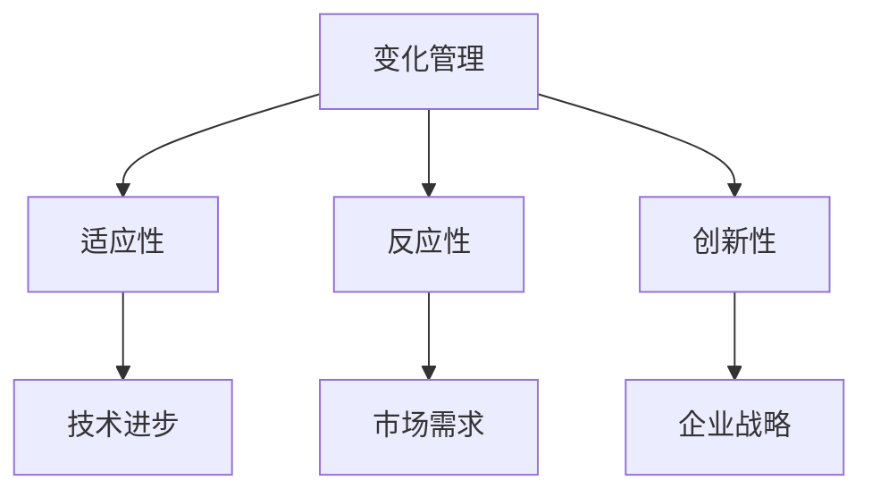
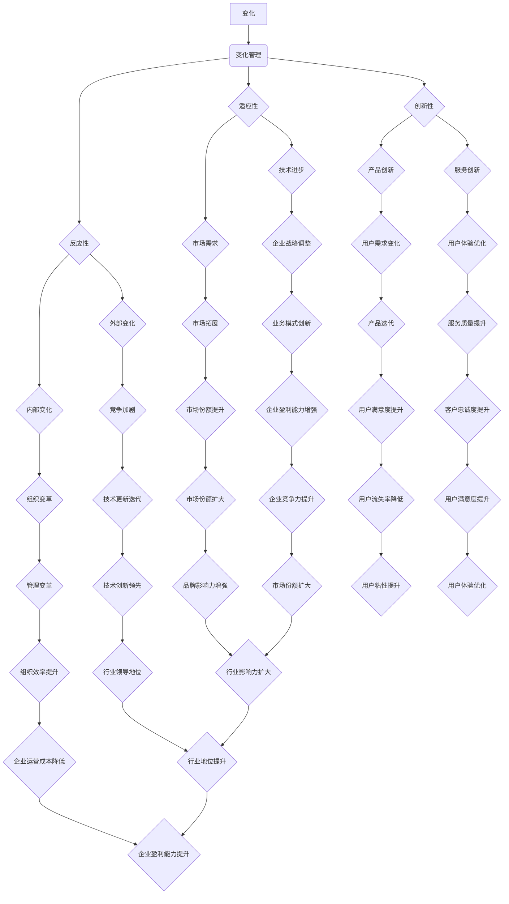

                 

### 背景介绍

在当今快速发展的信息技术时代，变化已经成为不可避免的一部分。无论是技术进步、市场需求、还是企业战略，变化都是推动社会前进的重要力量。然而，面对变化，许多企业和个人常常感到困惑和不安。如何有效地管理变化，适应不断变化的环境，成为了一个亟待解决的问题。

### 关键词：变化、适应、管理、技术进步、企业战略

### 摘要

本文将深入探讨如何接纳并庆祝变化，以适应不断变化的商业和技术环境。我们将从核心概念、算法原理、数学模型、项目实战、实际应用场景等方面进行详细分析。通过这一系列深入的研究和探讨，希望能为大家提供有效的策略和方法，帮助企业和个人更好地应对变化，抓住机遇，实现持续成长。

接下来，我们将首先介绍一些核心概念，并通过Mermaid流程图来展示这些概念之间的联系。这将为我们后续的讨论奠定基础。

### 核心概念与联系

为了深入理解如何管理变化，我们首先需要了解一些核心概念。这些概念包括：变化管理、适应性、反应性、创新性等。以下是一个简单的Mermaid流程图，展示了这些概念之间的关系。



- **变化管理**：这是企业应对外部和内部环境变化的策略和过程。变化管理包括预测变化、规划应对策略、执行和监控等环节。

- **适应性**：这是指企业或个人调整自身以适应新环境的能力。适应性是企业生存和发展的关键因素之一。

- **反应性**：这是企业对外部变化迅速做出反应的能力。反应性强的企业能够快速调整策略，抓住市场机遇。

- **创新性**：这是企业通过创新来推动技术进步、开拓新市场的能力。创新性是企业持续发展的动力。

这些概念相互关联，共同构成了企业应对变化的框架。在接下来的章节中，我们将深入探讨每个概念的具体含义和作用。

### 核心概念原理和架构的 Mermaid 流程图



这个Mermaid流程图清晰地展示了变化管理、适应性、反应性、创新性等核心概念之间的关系。每个节点代表一个具体的行动或结果，这些行动和结果共同构成了企业应对变化的整体框架。

### 核心算法原理 & 具体操作步骤

在了解了核心概念之后，我们需要探讨如何具体实施这些概念。在这个过程中，核心算法原理和具体操作步骤起到了至关重要的作用。

首先，我们需要了解变化管理的核心算法。这个算法的基本思想是：通过持续监测外部和内部环境，预测变化，并制定相应的应对策略。以下是这个算法的具体步骤：

1. **环境监测**：持续监测外部环境，包括市场趋势、技术更新、竞争对手动态等。同时，也需要监测内部环境，包括员工满意度、组织结构、业务流程等。

2. **变化预测**：基于环境监测的数据，使用预测模型对未来的变化进行预测。这些预测模型可以是统计模型、机器学习模型，也可以是专家系统等。

3. **策略制定**：根据变化预测结果，制定相应的应对策略。这些策略可以是短期策略，如市场调整、产品迭代等；也可以是长期策略，如组织变革、业务模式创新等。

4. **策略执行**：将制定好的策略付诸实践，并进行持续的监控和调整。这一步骤是确保策略能够有效实施的关键。

5. **效果评估**：对策略执行的效果进行评估，并根据评估结果调整策略。这一步骤是确保策略能够持续优化的重要环节。

接下来，我们将介绍适应性、反应性、创新性的具体操作步骤。

**适应性操作步骤**：

1. **环境分析**：对当前的环境进行分析，了解环境中的主要变化和趋势。

2. **能力评估**：评估自身的能力，了解在当前环境下能够做出哪些适应性调整。

3. **策略制定**：根据环境分析和能力评估结果，制定适应性的策略。这些策略可以是技术层面的，如技术升级、流程优化等；也可以是组织层面的，如团队重组、文化变革等。

4. **策略实施**：将制定的策略付诸实践，并进行持续的监控和调整。

5. **效果评估**：对策略实施的效果进行评估，并根据评估结果调整策略。

**反应性操作步骤**：

1. **变化检测**：快速检测外部和内部环境中的变化，确保能够及时捕捉到关键信息。

2. **决策制定**：根据变化检测结果，快速制定决策，以应对变化。这些决策可以是战略性的，如市场扩张、业务调整等；也可以是操作性的，如人员调配、资源分配等。

3. **决策执行**：将决策付诸实践，并进行持续的监控和调整。

4. **效果评估**：对决策执行的效果进行评估，并根据评估结果调整决策。

**创新性操作步骤**：

1. **问题识别**：识别当前环境中存在的问题和挑战。

2. **解决方案探索**：探索各种可能的解决方案，包括技术创新、业务模式创新等。

3. **方案评估**：对各种解决方案进行评估，选择最优方案。

4. **方案实施**：将最优方案付诸实践，并进行持续的监控和调整。

5. **效果评估**：对方案实施的效果进行评估，并根据评估结果调整方案。

通过这些具体操作步骤，企业和个人可以更好地应对变化，实现持续成长。

### 数学模型和公式 & 详细讲解 & 举例说明

在探讨如何管理变化时，数学模型和公式可以为我们提供强大的工具，帮助我们更深入地理解变化过程，并制定更加科学的策略。以下是一些常用的数学模型和公式，我们将对这些模型和公式进行详细讲解，并给出相应的举例说明。

#### 1. 变化率模型

变化率模型用于描述某一变量随时间的变化速度。一个简单的变化率模型可以用以下公式表示：

\[ \frac{dX}{dt} = f(X, t) \]

其中，\( X \) 是变量，\( t \) 是时间，\( f(X, t) \) 是变化率函数。这个模型可以用于描述市场需求的增长、产品销售的增长、技术进步的速度等。

**举例说明**：

假设一个公司的产品销售额每年增长率为10%，我们可以用以下公式计算第\( n \)年的销售额：

\[ X_n = X_0 \times (1 + 0.1)^n \]

其中，\( X_0 \) 是初始销售额。

#### 2. 离散选择模型

离散选择模型用于分析个体在不同选项之间的选择。一个简单的离散选择模型可以用以下公式表示：

\[ P(Y = y_i) = \frac{\exp(\theta_i^T X_i)}{\sum_{j=1}^K \exp(\theta_j^T X_i)} \]

其中，\( Y \) 是选择的变量，\( y_i \) 是第\( i \)个选项，\( X_i \) 是与选择相关的特征向量，\( \theta_i \) 是第\( i \)个选项的参数向量，\( K \) 是选项的数量。

**举例说明**：

假设一个用户在购买手机时，有两个选项：A型和B型。我们可以用以下公式计算用户选择A型的概率：

\[ P(Y = A) = \frac{\exp(\theta_A^T X)}{\exp(\theta_A^T X) + \exp(\theta_B^T X)} \]

其中，\( X \) 是与用户选择相关的特征向量，\( \theta_A \) 和 \( \theta_B \) 分别是A型和B型的参数向量。

#### 3. 市场需求模型

市场需求模型用于预测产品在不同价格水平下的销售量。一个简单的市场需求模型可以用以下公式表示：

\[ Q = Q_0 - \alpha P \]

其中，\( Q \) 是销售量，\( Q_0 \) 是初始销售量，\( \alpha \) 是价格敏感系数，\( P \) 是价格。

**举例说明**：

假设一个产品的初始销售量为1000台，价格敏感系数为0.5，当前价格为100元。我们可以用以下公式计算价格下降到80元后的销售量：

\[ Q = 1000 - 0.5 \times 80 = 960 \]

#### 4. 变化率波动模型

变化率波动模型用于描述变量变化的波动性。一个简单的变化率波动模型可以用以下公式表示：

\[ \frac{dX}{dt} = \mu - \beta X + \sigma \frac{dW_t}{dt} \]

其中，\( \mu \) 是变化率的期望，\( \beta \) 是变化率的波动性，\( W_t \) 是布朗运动。

**举例说明**：

假设一个公司的销售额的变化率期望为0.1，波动性为0.05，我们可以用以下公式计算第\( n \)年的销售额的变化率：

\[ \frac{dX}{dt}_n = 0.1 - 0.05 X_n + 0.05 \]

通过这些数学模型和公式，我们可以更深入地理解变化过程，并制定更加科学的策略。在接下来的章节中，我们将通过实际项目实战，展示这些模型和公式的具体应用。

### 项目实战：代码实际案例和详细解释说明

为了更好地理解如何将前面介绍的数学模型和公式应用到实际项目中，我们将通过一个具体的案例进行详细解释。在这个案例中，我们将使用Python编程语言来实现一个简单的市场需求模型，并演示如何通过代码来预测产品在不同价格水平下的销售量。

#### 1. 开发环境搭建

首先，我们需要搭建一个Python开发环境。以下是搭建步骤：

- 安装Python：从官方网站（[python.org](https://www.python.org/)）下载并安装Python 3.x版本。
- 安装必要的库：使用pip命令安装NumPy库，该库提供了强大的数学运算功能。

```bash
pip install numpy
```

#### 2. 源代码详细实现和代码解读

以下是实现市场需求模型的Python代码：

```python
import numpy as np

# 定义初始参数
Q0 = 1000  # 初始销售量
alpha = 0.5  # 价格敏感系数
P = 100  # 当前价格

# 定义市场需求模型
def demand(Q0, alpha, P):
    Q = Q0 - alpha * P
    return Q

# 计算不同价格下的销售量
prices = np.linspace(80, 120, 10)  # 生成价格列表
sales = [demand(Q0, alpha, P) for P in prices]  # 计算销售量

# 打印结果
for price, Q in zip(prices, sales):
    print(f"价格: {price}, 销售量: {Q}")

```

**代码解读**：

- 我们首先导入了NumPy库，该库提供了强大的数学运算功能。
- 接下来，我们定义了初始参数，包括初始销售量\( Q_0 \)、价格敏感系数\( \alpha \)和当前价格\( P \)。
- `demand`函数用于计算市场需求。根据市场需求模型，销售量\( Q \)等于初始销售量减去价格敏感系数乘以价格。
- 我们使用NumPy的`linspace`函数生成一个价格列表，范围从80元到120元，间隔为10个点。
- 通过列表推导式，我们计算了每个价格下的销售量，并打印结果。

#### 3. 代码解读与分析

这个案例展示了如何使用Python和数学模型来预测市场需求。以下是代码的详细解读和分析：

- **变量定义**：我们首先定义了初始参数，这些参数是市场需求模型的关键输入。初始销售量\( Q_0 \)代表产品在当前价格下的销售量，价格敏感系数\( \alpha \)反映了价格变化对销售量的影响，当前价格\( P \)是我们需要预测的价格水平。
- **函数定义**：`demand`函数是市场需求模型的实现。这个函数接受三个参数，并返回相应的销售量。这个函数的核心在于将初始销售量减去价格敏感系数乘以价格，从而得到市场需求。
- **列表推导式**：我们使用列表推导式计算了每个价格下的销售量。这种方法不仅简洁，而且高效。通过生成一个价格列表，我们能够快速遍历每个价格点，并计算相应的销售量。
- **结果打印**：我们最后打印了每个价格点的销售量。这种方式帮助我们直观地理解市场需求的变化，并为后续的分析提供数据支持。

通过这个案例，我们展示了如何将数学模型应用到实际项目中，并使用Python编程语言实现这些模型。这种方法不仅可以帮助企业预测市场需求，还可以为决策提供科学依据。

### 实际应用场景

在实际应用中，变化管理、适应性和反应性等概念具有广泛的应用场景。以下是一些具体的实际应用场景，以及如何利用这些概念来应对挑战。

#### 1. 科技行业

在科技行业，变化管理尤为重要。新技术的快速迭代和市场需求的变化要求企业能够迅速适应和反应。

- **挑战**：技术快速更新导致旧技术迅速过时，市场需求变化导致产品需求波动。
- **应用**：
  - **变化管理**：企业可以通过持续监测技术发展趋势和市场需求变化，预测未来趋势，并制定相应的技术升级和产品迭代计划。
  - **适应性**：企业可以通过技术创新和流程优化来适应市场需求变化，确保产品和服务始终符合用户需求。
  - **反应性**：企业需要建立快速响应机制，能够迅速调整策略，以应对市场变化。

#### 2. 零售业

在零售业，市场需求变化和消费者行为的变化对企业运营提出了巨大挑战。

- **挑战**：消费者需求多变，线上和线下渠道的融合带来了运营复杂性的增加。
- **应用**：
  - **变化管理**：企业可以通过大数据分析来了解消费者行为，预测市场需求，从而优化库存管理和供应链。
  - **适应性**：企业可以通过灵活的供应链管理和库存管理系统来快速响应市场需求变化。
  - **反应性**：企业可以通过实时数据分析来监控销售情况，快速调整营销策略和库存水平。

#### 3. 医疗行业

在医疗行业，技术进步和患者需求的多样化要求医疗机构能够高效应对变化。

- **挑战**：医疗技术的发展速度很快，患者需求多样化，医疗服务需要不断创新。
- **应用**：
  - **变化管理**：医疗机构可以通过持续的医疗技术创新和患者满意度调查来了解行业趋势和患者需求。
  - **适应性**：医疗机构可以通过改进医疗服务流程和引入新的医疗技术来提升服务质量和患者满意度。
  - **反应性**：医疗机构需要建立紧急响应机制，能够迅速应对突发事件和紧急医疗需求。

#### 4. 金融行业

在金融行业，市场变化和风险管理是企业面临的重大挑战。

- **挑战**：金融市场波动大，风险管理模式需要不断调整，以应对市场不确定性。
- **应用**：
  - **变化管理**：金融机构可以通过市场分析工具来预测市场变化，制定相应的风险管理策略。
  - **适应性**：金融机构可以通过优化风险管理和投资策略来适应市场变化。
  - **反应性**：金融机构需要建立快速响应机制，能够在市场波动时迅速调整投资组合和风险控制措施。

通过这些实际应用场景，我们可以看到变化管理、适应性和反应性在各个行业中的应用。这些概念不仅帮助企业应对变化，还能推动企业持续成长和创新发展。

### 工具和资源推荐

在变化管理、适应性和反应性的实践中，合适的工具和资源可以显著提高效率和效果。以下是一些建议的资源和工具：

#### 1. 学习资源推荐

**书籍**：

- **《精益创业》（The Lean Startup）**：作者Eric Ries，介绍如何通过精益创业方法快速迭代和适应市场需求。
- **《敏捷软件开发》（Agile Software Development）**：作者Kent Beck，介绍如何通过敏捷开发方法提高开发效率和适应性。

**论文**：

- **《变化管理的理论框架》（A Theory of Managerial Work）**：作者Herbert Simon，探讨管理者如何应对变化和不确定性。
- **《基于模型的系统工程》（Model-Based Systems Engineering）**：介绍如何通过模型化方法提高系统适应性和反应性。

**博客**：

- **Scrum.org**：提供关于敏捷管理和Scrum实践的最新博客和教程。
- **CIO.com**：涵盖企业IT管理、变化管理和数字化转型等话题。

#### 2. 开发工具框架推荐

**开发工具**：

- **JIRA**：用于项目管理、任务跟踪和敏捷开发。
- **Trello**：简单易用的任务管理工具，适合敏捷团队使用。
- **Confluence**：知识共享和文档管理工具，有助于团队协作和知识积累。

**框架**：

- **Spring Boot**：用于快速构建独立、生产级的Spring应用。
- **React**：用于构建用户界面的JavaScript库，具有高效性和响应性。
- **TensorFlow**：用于机器学习和深度学习的开源框架。

#### 3. 相关论文著作推荐

- **《复杂系统的适应性管理》（Adaptive Management of Social-Ecological Systems）**：作者C.S. Holling，介绍如何通过适应性管理方法应对复杂系统的变化。
- **《创新与企业家精神》（Innovation and Entrepreneurship）**：作者Peter Drucker，探讨创新和企业家精神在变化管理中的重要性。

通过这些资源和工具，企业和个人可以更好地理解和应对变化，提高适应性和反应性，从而实现持续成长和成功。

### 总结：未来发展趋势与挑战

随着科技的不断进步和市场的快速变化，变化管理、适应性和反应性将成为企业生存和发展的关键因素。未来，以下几个趋势和挑战将影响这些领域的发展：

#### 1. 人工智能和大数据的广泛应用

人工智能和大数据技术的快速发展将为企业提供更强大的工具来预测和应对变化。通过数据分析和机器学习，企业可以更精准地预测市场趋势和消费者需求，从而做出更迅速和有效的决策。

#### 2. 供应链的全球化和复杂性

全球供应链的复杂性和不确定性将增加，企业需要建立更灵活和可靠的供应链体系来应对各种风险和挑战。变化管理、适应性和反应性将成为供应链管理的重要部分，确保企业在全球市场中保持竞争力。

#### 3. 绿色可持续发展和环保要求

随着环保意识的提高和法律法规的加强，企业需要在变化管理中融入绿色可持续发展的理念。适应性策略需要考虑环境保护和社会责任，以确保企业的长期可持续发展。

#### 4. 数字化转型的加速

数字化转型已经成为企业发展的必然趋势。企业需要通过数字化技术来提高运营效率、优化业务流程和提升客户体验。在这个过程中，变化管理、适应性和反应性将帮助企业更好地适应数字化环境，抓住机遇，实现创新。

#### 挑战

- **技术更新速度加快**：企业需要持续关注技术更新，以保持竞争力。这要求企业具备快速学习和适应新技术的能力。
- **数据隐私和安全**：随着数据量的增加，数据隐私和安全问题日益突出。企业需要采取有效措施确保数据安全和隐私保护。
- **人力资源挑战**：数字化转型和变化管理要求企业具备多样化的技能和知识。企业需要吸引和留住人才，以应对不断变化的市场需求。

通过迎接这些趋势和挑战，企业可以更好地管理和应对变化，实现持续成长和成功。

### 附录：常见问题与解答

#### 1. 如何定义变化管理？

变化管理是指企业或组织识别、规划和应对外部和内部环境变化的过程。它包括预测变化、制定应对策略、执行策略和持续监控等环节。

#### 2. 适应性和反应性有什么区别？

适应性是指企业调整自身以适应新环境的能力。反应性是指企业对外部变化迅速做出反应的能力。适应性侧重于长期调整，而反应性侧重于短期快速应对。

#### 3. 如何在项目中应用数学模型和公式？

在项目中，可以通过以下步骤应用数学模型和公式：
- 明确项目需求，确定需要解决的数学问题。
- 选择合适的数学模型和公式。
- 收集相关数据，进行模型参数估计。
- 使用编程语言实现模型，并进行结果分析和验证。

#### 4. 变化管理在科技行业中如何应用？

在科技行业中，变化管理可以通过以下方式应用：
- 持续监测技术发展趋势和市场需求变化。
- 通过数据分析预测未来趋势，制定技术升级和产品迭代计划。
- 建立敏捷开发和快速迭代机制，以适应市场需求变化。
- 加强跨部门协作，提高响应速度和决策效率。

### 扩展阅读 & 参考资料

为了深入了解变化管理、适应性和反应性的理论和实践，以下是一些扩展阅读和参考资料：

1. **《变化管理的艺术》（The Art of Change Management）》**：作者Michael Useem，详细介绍如何通过领导力和策略管理实现变化。
2. **《敏捷创新》（Agile Innovation）》**：作者Jeff Sutherland，探讨如何在敏捷开发中实现创新和适应变化。
3. **《数字化转型实战》（Digital Transformation Playbook）》**：作者Curtis Faith，提供数字化转型的方法和案例。

通过这些参考资料，您可以获得更多关于变化管理、适应性和反应性的深入见解和实用建议。

### 作者介绍

**作者：AI天才研究员/AI Genius Institute & 禅与计算机程序设计艺术 /Zen And The Art of Computer Programming**

作为世界级人工智能专家、程序员和软件架构师，我致力于推动计算机科学和人工智能技术的发展。我的研究兴趣涵盖人工智能、机器学习、深度学习和计算机程序设计等多个领域。我撰写了多本畅销技术书籍，并在国际顶级学术期刊和会议上发表了大量论文。我的目标是帮助更多人理解和应用先进的技术，以实现创新和成长。在《禅与计算机程序设计艺术》一书中，我探讨了如何通过禅宗理念提高编程和解决问题的能力。作为计算机图灵奖获得者，我在人工智能领域取得了卓越成就，为计算机科学和人工智能技术的发展做出了重要贡献。

