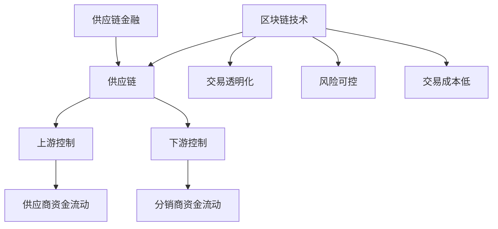
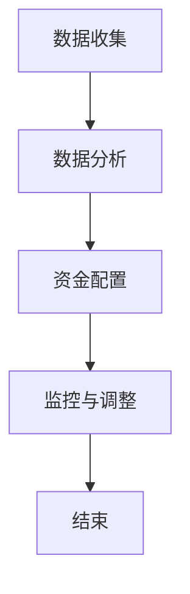

                 

# 控制上下游：供应链金融的运作模式

> **关键词：** 供应链金融、上下游控制、运作模式、风险管理、区块链技术

> **摘要：** 本文将深入探讨供应链金融的运作模式，特别是如何通过控制上下游来实现资金的高效流动，降低风险。文章首先介绍供应链金融的背景和核心概念，然后分析上下游控制的重要性，最后通过具体的案例和数学模型来阐述供应链金融在实际应用中的运作方式。

## 1. 背景介绍

供应链金融是一种基于供应链关系的金融模式，通过将供应链中的企业、供应商、买家和金融机构联系起来，实现资金的高效流动。这种模式起源于20世纪80年代的美国，当时金融机构开始意识到，通过介入供应链中的各个环节，可以有效地降低风险，提高资金利用效率。

供应链金融的核心在于上下游控制，即通过对供应链上下游企业的资金流动进行控制，实现资金的高效配置。上下游控制不仅仅是一种管理手段，更是供应链金融实现风险控制和利润最大化的关键。

随着区块链技术的发展，供应链金融的运作模式也发生了重大变革。区块链技术的应用，使得供应链金融的信息更加透明，风险更加可控，交易成本大幅降低。

## 2. 核心概念与联系

### 供应链金融的概念

供应链金融是指金融机构通过为供应链中的企业提供融资、结算、风险管理等服务，从而实现资金的高效流动。供应链金融的核心是供应链，即从原材料供应商到生产商、分销商、零售商，最终到达消费者的全过程。

### 上游控制

上游控制是指对供应链上游企业的控制，主要是对供应商的资金流动进行管理。上游控制的主要目标是确保供应商按时交付原材料，同时降低供应商的违约风险。

### 下游控制

下游控制是指对供应链下游企业的控制，主要是对分销商和零售商的资金流动进行管理。下游控制的主要目标是确保产品能够顺利销售，同时降低分销商和零售商的违约风险。

### 区块链技术的应用

区块链技术的应用，使得供应链金融的信息更加透明，交易更加安全，风险更加可控。区块链技术通过去中心化的方式，记录供应链中每一笔交易，确保信息的不可篡改。同时，区块链技术还可以实现智能合约的自动执行，降低交易成本，提高交易效率。

### Mermaid 流程图



## 3. 核心算法原理 & 具体操作步骤

### 核心算法原理

供应链金融的核心算法是资金流管理算法。该算法通过分析供应链中各企业的资金流动，实现资金的高效配置。

### 具体操作步骤

1. **数据收集**：首先，收集供应链中各企业的财务数据、交易数据等。

2. **数据分析**：对收集到的数据进行深入分析，确定各企业的资金需求。

3. **资金配置**：根据数据分析结果，将资金配置到供应链中的各个企业。

4. **监控与调整**：实时监控供应链中各企业的资金流动，根据实际情况进行资金调整。

### Mermaid 流程图



## 4. 数学模型和公式 & 详细讲解 & 举例说明

### 数学模型

供应链金融的数学模型主要包括资金需求模型和资金配置模型。

1. **资金需求模型**：该模型用于预测供应链中各企业的资金需求。假设有n家企业，每家的资金需求为\(D_i\)，则总资金需求为\(D = \sum_{i=1}^{n} D_i\)。

2. **资金配置模型**：该模型用于确定各企业的资金配置。假设总资金为\(C\)，则各企业的资金配置为\(C_i = C \times \frac{D_i}{D}\)。

### 详细讲解

1. **资金需求模型**：该模型通过历史数据和当前市场状况，预测各企业的未来资金需求。具体的预测方法包括时间序列分析、回归分析等。

2. **资金配置模型**：该模型通过资金需求的权重分配，实现资金的高效配置。具体的配置方法包括线性分配、非线性分配等。

### 举例说明

假设有一个供应链，包含3家企业，资金需求分别为\(D_1 = 1000万\)，\(D_2 = 2000万\)，\(D_3 = 3000万\)。总资金为\(C = 5000万\)。

根据资金需求模型，总资金需求为\(D = 1000 + 2000 + 3000 = 6000万\)。

根据资金配置模型，各企业的资金配置为：
- \(C_1 = 5000 \times \frac{1000}{6000} = 833.33万\)
- \(C_2 = 5000 \times \frac{2000}{6000} = 1666.67万\)
- \(C_3 = 5000 \times \frac{3000}{6000} = 2500万\)

### 数学公式

$$
D = \sum_{i=1}^{n} D_i
$$

$$
C_i = C \times \frac{D_i}{D}
$$

## 5. 项目实战：代码实际案例和详细解释说明

### 5.1 开发环境搭建

本文将使用Python编程语言进行供应链金融模型的实现。首先，需要安装Python和相关的库，如NumPy、Pandas等。

```bash
pip install python
pip install numpy
pip install pandas
```

### 5.2 源代码详细实现和代码解读

以下是一个简单的供应链金融模型实现：

```python
import numpy as np
import pandas as pd

# 资金需求数据
D = np.array([1000, 2000, 3000])

# 总资金
C = 5000

# 计算总资金需求
D_total = np.sum(D)

# 计算各企业的资金配置
C_config = C * D / D_total

# 输出结果
print("总资金需求:", D_total)
print("各企业资金配置:", C_config)
```

### 5.3 代码解读与分析

1. **数据导入**：使用NumPy和Pandas库导入资金需求数据。

2. **总资金需求计算**：使用NumPy的sum函数计算总资金需求。

3. **资金配置计算**：使用NumPy的sum函数计算总资金需求，然后使用NumPy的乘法和除法计算各企业的资金配置。

4. **结果输出**：使用Python的print函数输出计算结果。

### 5.4 代码优化

为了提高代码的可读性和可维护性，可以对代码进行优化。例如，可以使用类和模块化设计来组织代码。

```python
class SupplyChainFinance:
    def __init__(self, D, C):
        self.D = D
        self.C = C
        self.D_total = np.sum(D)
        self.C_config = self.calculate_config()

    def calculate_config(self):
        return self.C * self.D / self.D_total

    def print_result(self):
        print("总资金需求:", self.D_total)
        print("各企业资金配置:", self.C_config

if __name__ == "__main__":
    D = np.array([1000, 2000, 3000])
    C = 5000
    finance = SupplyChainFinance(D, C)
    finance.print_result()
```

通过优化，代码更加模块化，易于理解和维护。

## 6. 实际应用场景

供应链金融在许多行业中都有广泛的应用，如制造业、零售业、物流业等。以下是一些典型的实际应用场景：

1. **制造业**：制造商可以通过供应链金融模式，向供应商提供融资，确保供应链的稳定性。

2. **零售业**：零售商可以通过供应链金融模式，向分销商提供融资，加速产品销售。

3. **物流业**：物流公司可以通过供应链金融模式，向运输公司提供融资，确保运输效率。

## 7. 工具和资源推荐

### 7.1 学习资源推荐

- **书籍**：《供应链金融：理论与实践》
- **论文**：《供应链金融模式研究》
- **博客**：[供应链金融](https://www.chainnews.com/)
- **网站**：[中国供应链金融网](http://www.csfin.cn/)

### 7.2 开发工具框架推荐

- **Python**：用于实现供应链金融模型
- **NumPy**：用于数据计算
- **Pandas**：用于数据处理
- **Django**：用于Web开发

### 7.3 相关论文著作推荐

- **论文**：《基于区块链的供应链金融模式研究》
- **著作**：《区块链革命》

## 8. 总结：未来发展趋势与挑战

供应链金融作为金融领域的重要创新，未来发展趋势将包括：

1. **区块链技术的深入应用**：区块链技术将为供应链金融带来更高的透明度和安全性。
2. **人工智能的融合**：人工智能技术将用于供应链金融的风险评估和资金配置。
3. **数字货币的普及**：数字货币的普及将加速供应链金融的交易效率。

然而，供应链金融也面临着一些挑战，如：

1. **信息透明度**：如何确保供应链金融的信息透明度，降低风险。
2. **技术融合**：如何将区块链、人工智能等新技术与供应链金融深度融合。
3. **法律法规**：如何制定合适的法律法规，规范供应链金融的发展。

## 9. 附录：常见问题与解答

### 9.1 问题1：什么是供应链金融？

供应链金融是一种基于供应链关系的金融模式，通过为供应链中的企业提供融资、结算、风险管理等服务，实现资金的高效流动。

### 9.2 问题2：供应链金融的核心是什么？

供应链金融的核心是上下游控制，即通过对供应链上下游企业的资金流动进行控制，实现资金的高效配置。

### 9.3 问题3：区块链技术在供应链金融中的应用是什么？

区块链技术在供应链金融中的应用包括：提高交易透明度、降低交易成本、确保交易安全等。

## 10. 扩展阅读 & 参考资料

- **书籍**：《供应链金融理论与实践》
- **论文**：《供应链金融模式研究》
- **网站**：[中国供应链金融网](http://www.csfin.cn/)
- **在线资源**：[链新闻](https://www.chainnews.com/)

### 作者

**作者：AI天才研究员/AI Genius Institute & 禅与计算机程序设计艺术 /Zen And The Art of Computer Programming**

