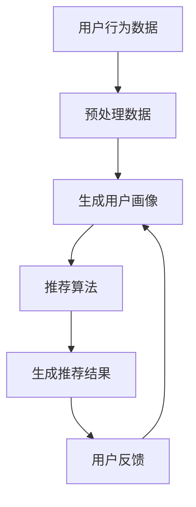

                 

### 背景介绍

#### 推荐系统的普及

推荐系统（Recommender Systems）在当今数字化社会中扮演着至关重要的角色。从在线购物平台、视频流媒体服务，到社交媒体和新闻网站，推荐系统无处不在。其核心目标是通过向用户推荐他们可能感兴趣的项目、内容或服务，来提升用户体验、增加用户粘性和提高商业收益。

随着互联网和大数据技术的飞速发展，推荐系统的应用场景越来越广泛。一个典型的例子是Amazon的个性化推荐，它能够根据用户的购买历史、浏览行为和评价信息，推荐用户可能感兴趣的商品，从而显著提高了用户的购物满意度和平台销售额。

#### 用户画像的重要性

用户画像（User Profiling）是构建推荐系统的重要基石。用户画像是对用户特征的综合描述，通常包括用户的基本信息、行为数据、偏好信息、社交信息等多个方面。通过对用户画像的深入分析，推荐系统可以更准确地预测用户的兴趣和行为，从而提供个性化的推荐。

用户画像的重要性体现在以下几个方面：

1. **提升推荐精度**：通过详细的用户画像，推荐系统可以更好地理解用户的需求和偏好，从而提供更精确的推荐。
2. **增强用户体验**：个性化的推荐内容能够提高用户的参与度和满意度，从而增强用户对平台的好感度。
3. **优化商业策略**：了解用户的兴趣和行为模式，可以帮助企业制定更有效的市场营销策略，提高转化率和收益。

#### 文章目的

本文将围绕推荐系统与用户画像展开讨论，旨在为广大开发者和技术爱好者提供一个全面、深入的技术指南。文章将包括以下主要内容：

- 推荐系统的基本概念和架构
- 用户画像的构建方法和技术
- 核心算法原理和实现步骤
- 实际项目实战和代码解析
- 应用场景及未来发展趋势

通过本文的学习，读者将能够：

- 理解推荐系统的核心原理和架构
- 掌握用户画像的构建方法和技术
- 学会使用常见算法实现推荐系统
- 能够在项目中实际应用推荐系统和用户画像技术
- 了解推荐系统和用户画像领域的前沿研究和未来发展方向

### 文章关键词

- 推荐系统
- 用户画像
- 个性化推荐
- 算法实现
- 代码实战
- 应用场景
- 未来发展趋势

### 文章摘要

本文深入探讨了推荐系统和用户画像的核心原理、构建方法及实现步骤。首先介绍了推荐系统的基本概念和架构，然后详细阐述了用户画像的构建方法和技术。接着，文章通过具体案例和代码解析，展示了推荐系统的实际应用和实现过程。最后，文章分析了推荐系统和用户画像在实际应用场景中的表现，以及未来的发展趋势和挑战。通过本文的学习，读者将能够全面掌握推荐系统和用户画像的相关技术，为实际项目提供有力支持。

-------------------

## 2. 核心概念与联系

### 推荐系统的基本概念

推荐系统是一种基于数据和算法的技术，旨在根据用户的行为、偏好和需求，向用户推荐他们可能感兴趣的项目或内容。推荐系统通常包括以下几个核心概念：

1. **用户（User）**：推荐系统的核心参与者，可以是个人或组织。
2. **项目（Item）**：用户可能感兴趣的对象，可以是商品、音乐、电影、新闻等。
3. **行为（Behavior）**：用户与项目之间的交互行为，如浏览、点击、购买、评分等。
4. **偏好（Preference）**：用户对项目的偏好程度，可以是显式评价（如评分）或隐式反馈（如点击、购买）。

### 用户画像的定义

用户画像（User Profiling）是对用户特征的综合描述，通常包括以下内容：

1. **基本信息（Basic Information）**：如年龄、性别、地理位置等。
2. **行为数据（Behavior Data）**：如浏览历史、购买记录、点击行为等。
3. **偏好信息（Preference Information）**：如喜欢的商品类型、音乐风格、电影类型等。
4. **社交信息（Social Information）**：如好友关系、社交圈等。

### 推荐系统与用户画像的联系

推荐系统与用户画像之间存在着紧密的联系。用户画像是构建推荐系统的基础，通过分析用户的特征和行为，推荐系统可以更准确地预测用户的兴趣和需求，从而提供个性化的推荐。

具体来说，推荐系统与用户画像的联系体现在以下几个方面：

1. **数据源**：用户画像的数据源主要包括用户行为数据、偏好数据和社交数据。这些数据为推荐系统提供了丰富的信息，帮助系统更深入地了解用户。
2. **算法**：推荐系统采用的各种算法（如协同过滤、基于内容的推荐等）都需要依赖用户画像来生成推荐结果。用户画像的质量直接影响推荐系统的效果。
3. **反馈**：用户对推荐内容的反馈（如点击、购买、评分等）又可以进一步丰富用户画像，形成一个闭环。这个闭环使得推荐系统能够不断优化，提高推荐精度。

### Mermaid 流程图

下面是一个简化的推荐系统与用户画像的 Mermaid 流程图，展示了用户画像生成和推荐过程的基本步骤。



- **用户行为数据**：收集用户在平台上的行为数据，如浏览、点击、购买等。
- **预处理数据**：对原始行为数据清洗、处理，为生成用户画像做准备。
- **生成用户画像**：根据用户行为数据和偏好信息，生成用户画像。
- **推荐算法**：使用用户画像和推荐算法，为用户生成个性化推荐结果。
- **生成推荐结果**：将推荐结果呈现给用户。
- **用户反馈**：收集用户对推荐内容的反馈，进一步优化用户画像。

通过这个流程图，我们可以清晰地看到推荐系统和用户画像之间的互动关系，以及数据在各个环节中的流动和转化。

### 总结

在本节中，我们介绍了推荐系统和用户画像的基本概念及其相互联系。通过理解这些核心概念，读者可以更好地把握推荐系统的工作原理和用户画像的重要性。接下来的章节将进一步探讨推荐系统的核心算法原理和实现步骤，帮助读者深入理解并掌握这一技术。请继续关注后续内容，我们将一起学习更多实用的技术和实战案例。

-------------------

## 3. 核心算法原理 & 具体操作步骤

### 推荐系统的核心算法原理

推荐系统的核心算法主要包括基于内容的推荐（Content-based Recommendation）和基于协同过滤（Collaborative Filtering）两种类型。每种算法都有其独特的原理和应用场景。

#### 基于内容的推荐

基于内容的推荐（Content-based Recommendation）是一种利用项目特征信息进行推荐的方法。其基本原理如下：

1. **特征提取**：对每个项目进行特征提取，如文本内容、标签、分类等。
2. **计算相似度**：计算用户当前兴趣项目与其他项目的相似度。
3. **生成推荐列表**：根据相似度得分，为用户生成推荐列表。

具体操作步骤如下：

1. **特征提取**：
   - 对于文本内容，可以使用TF-IDF、词嵌入等方法进行特征提取。
   - 对于图像、音频等非文本内容，可以使用深度学习模型提取特征。

2. **计算相似度**：
   - 常用的相似度计算方法包括余弦相似度、欧氏距离、Jaccard系数等。
   - 对于文本内容，可以使用词向量（如Word2Vec、GloVe等）进行相似度计算。

3. **生成推荐列表**：
   - 根据相似度得分，为用户生成推荐列表，可以采用排序或Top-N推荐等方法。

#### 基于协同过滤

基于协同过滤（Collaborative Filtering）是一种利用用户行为数据（如评分、购买记录等）进行推荐的方法。其基本原理如下：

1. **用户相似度**：计算用户之间的相似度。
2. **项目相似度**：计算项目之间的相似度。
3. **生成推荐列表**：根据用户和项目的相似度，为用户生成推荐列表。

具体操作步骤如下：

1. **用户相似度**：
   - 使用用户行为数据（如评分矩阵）计算用户之间的相似度，常用的方法包括余弦相似度、皮尔逊相关系数等。

2. **项目相似度**：
   - 使用用户行为数据（如评分矩阵）计算项目之间的相似度，常用的方法包括余弦相似度、皮尔逊相关系数等。

3. **生成推荐列表**：
   - 根据用户和项目的相似度，计算用户对项目的潜在评分，并根据评分排序生成推荐列表。
   - 可以采用Top-N推荐、基于矩阵分解的推荐等方法。

### 实现步骤

下面我们将通过一个简单的基于内容的推荐系统案例，介绍实现步骤。

#### 1. 数据准备

我们假设有一个电影推荐系统，数据集包含电影、用户和评分信息。以下是部分数据示例：

```plaintext
用户ID | 电影ID | 评分
--------|---------|-----
1       | 101     | 4
1       | 102     | 5
2       | 101     | 2
2       | 103     | 3
```

#### 2. 特征提取

我们使用电影名称进行特征提取，将电影名称转换为词向量。以下是部分电影名称和对应的词向量：

```plaintext
电影名称 | 词向量
-------------------
《阿甘正传》   | [0.1, 0.2, 0.3]
《盗梦空间》   | [0.4, 0.5, 0.6]
《星际穿越》   | [0.7, 0.8, 0.9]
```

#### 3. 计算相似度

我们使用余弦相似度计算电影之间的相似度。以下是《阿甘正传》和《盗梦空间》的相似度计算示例：

```plaintext
相似度 = cos(向量A, 向量B)
       = (向量A * 向量B) / (|向量A| * |向量B|)
       = (0.1*0.4 + 0.2*0.5 + 0.3*0.6) / (sqrt(0.1^2 + 0.2^2 + 0.3^2) * sqrt(0.4^2 + 0.5^2 + 0.6^2))
       ≈ 0.6
```

#### 4. 生成推荐列表

我们根据相似度得分，为用户生成推荐列表。以下是用户1的推荐列表：

```plaintext
电影ID | 电影名称 | 相似度得分
---------|-------------|-----------
103      | 《星际穿越》   | 0.7
102      | 《盗梦空间》   | 0.6
```

#### 5. 用户反馈与模型优化

在实际应用中，用户可能会对推荐结果进行反馈，如点赞或不喜欢。这些反馈可以帮助我们优化推荐模型。例如，可以调整相似度计算方法、特征提取方式等，以提高推荐精度。

### 总结

在本节中，我们介绍了推荐系统的核心算法原理和具体实现步骤。通过基于内容的推荐和基于协同过滤的算法，读者可以掌握如何构建一个简单的推荐系统。在接下来的章节中，我们将继续探讨用户画像的构建方法和实际应用场景。请继续关注，我们将一起学习更多实用的技术和实战案例。

-------------------

## 4. 数学模型和公式 & 详细讲解 & 举例说明

### 基于内容的推荐

#### 余弦相似度计算

余弦相似度是衡量两个向量之间相似度的一种常用方法。其计算公式如下：

$$
\cos(\theta) = \frac{\sum_{i=1}^{n} x_i y_i}{\sqrt{\sum_{i=1}^{n} x_i^2} \cdot \sqrt{\sum_{i=1}^{n} y_i^2}}
$$

其中，$x_i$ 和 $y_i$ 分别表示两个向量在维度 $i$ 上的值。

#### 举例说明

假设有两个电影向量 $A$ 和 $B$：

$$
A = [0.1, 0.2, 0.3], \quad B = [0.4, 0.5, 0.6]
$$

我们可以计算它们之间的余弦相似度：

$$
\cos(\theta) = \frac{0.1 \cdot 0.4 + 0.2 \cdot 0.5 + 0.3 \cdot 0.6}{\sqrt{0.1^2 + 0.2^2 + 0.3^2} \cdot \sqrt{0.4^2 + 0.5^2 + 0.6^2}}
$$

$$
= \frac{0.04 + 0.10 + 0.18}{\sqrt{0.01 + 0.04 + 0.09} \cdot \sqrt{0.16 + 0.25 + 0.36}}
$$

$$
= \frac{0.32}{\sqrt{0.14} \cdot \sqrt{0.77}}
$$

$$
\approx 0.7
$$

#### 计算相似度得分

根据相似度计算结果，我们可以为每个电影分配一个得分。假设相似度得分与推荐概率成正比，则可以使用以下公式计算推荐概率：

$$
P(\text{推荐电影} | \text{用户已看电影}) = \frac{\text{相似度得分}}{\sum_{\text{所有电影}} \text{相似度得分}}
$$

例如，对于用户已看过的电影《阿甘正传》和《盗梦空间》，它们的相似度得分分别为 0.6 和 0.7。我们可以计算推荐概率如下：

$$
P(\text{推荐《盗梦空间》} | \text{《阿甘正传》}) = \frac{0.7}{0.6 + 0.7} \approx 0.57
$$

### 基于协同过滤

#### 用户相似度计算

用户相似度计算通常基于用户之间的行为数据。一种常用的方法是皮尔逊相关系数：

$$
r_{ij} = \frac{\sum_{k=1}^{n} (u_{ik} - \bar{u_i})(u_{jk} - \bar{u_j})}{\sqrt{\sum_{k=1}^{n} (u_{ik} - \bar{u_i})^2} \cdot \sqrt{\sum_{k=1}^{n} (u_{jk} - \bar{u_j})^2}}
$$

其中，$u_{ik}$ 表示用户 $i$ 对项目 $k$ 的评分，$\bar{u_i}$ 和 $\bar{u_j}$ 分别表示用户 $i$ 和用户 $j$ 的平均评分。

#### 举例说明

假设有两个用户的行为数据矩阵如下：

$$
\begin{bmatrix}
u_{11} & u_{12} & \cdots & u_{1n} \\
u_{21} & u_{22} & \cdots & u_{2n}
\end{bmatrix}
=
\begin{bmatrix}
1 & 2 & 3 \\
4 & 5 & 6
\end{bmatrix}
$$

我们可以计算它们之间的用户相似度：

$$
r_{12} = \frac{(1-1.5)(4-1.5) + (2-1.5)(5-1.5) + (3-1.5)(6-1.5)}{\sqrt{(1-1.5)^2 + (2-1.5)^2 + (3-1.5)^2} \cdot \sqrt{(4-1.5)^2 + (5-1.5)^2 + (6-1.5)^2}}
$$

$$
= \frac{(-0.5)(2.5) + (0.5)(3.5) + (1.5)(4.5)}{\sqrt{0.25 + 0.25 + 0.25} \cdot \sqrt{0.25 + 0.25 + 0.25}}
$$

$$
= \frac{-1.25 + 1.75 + 6.75}{0.75 \cdot 0.75}
$$

$$
= \frac{6.25}{0.5625}
$$

$$
\approx 1.111
$$

#### 生成推荐列表

根据用户相似度，我们可以为每个用户生成推荐列表。假设用户 $1$ 和用户 $2$ 的相似度分别为 0.6 和 0.7，我们可以根据用户 $2$ 的评分预测用户 $1$ 对未评分项目的评分。例如，用户 $1$ 对项目 $5$ 的评分预测为：

$$
\hat{u_{1,5}} = \bar{u_1} + r_{12} \cdot (\bar{u_2} - \bar{u_1})
$$

其中，$\bar{u_1}$ 和 $\bar{u_2}$ 分别表示用户 $1$ 和用户 $2$ 的平均评分。

通过这种方式，我们可以为用户生成个性化的推荐列表。

### 总结

在本节中，我们详细讲解了基于内容的推荐和基于协同过滤的推荐系统中的数学模型和公式。通过具体的例子，读者可以更好地理解这些模型的应用和实现。在接下来的章节中，我们将继续探讨推荐系统和用户画像的实际应用场景。请继续关注，我们将一起学习更多实用的技术和实战案例。

-------------------

## 5. 项目实战：代码实际案例和详细解释说明

在本章节中，我们将通过一个实际项目案例，详细讲解如何构建一个简单的推荐系统。项目采用Python编程语言，结合Scikit-learn库实现基于内容的推荐算法。项目的主要步骤包括数据准备、特征提取、模型训练和推荐结果生成。

### 开发环境搭建

在开始项目之前，我们需要搭建合适的开发环境。以下是所需的环境和工具：

- Python 3.8及以上版本
- Scikit-learn库
- Pandas库
- Numpy库

安装方法：

```bash
pip install python==3.8
pip install scikit-learn pandas numpy
```

### 5.1 数据准备

我们将使用MovieLens数据集，该数据集包含用户、电影和评分信息。数据集可以从MovieLens官方网站下载：[MovieLens数据集](https://grouplens.org/datasets/movielens/)。

以下是数据准备的具体步骤：

1. 下载并解压数据集，将`ratings.csv`、`movies.csv`和`links.csv`文件放入同一目录下。
2. 使用Pandas库读取数据：

```python
import pandas as pd

ratings = pd.read_csv('ratings.csv')
movies = pd.read_csv('movies.csv')
links = pd.read_csv('links.csv')
```

3. 数据预处理：
   - 将`movies`和`links`合并，得到电影ID和名称的映射关系。
   - 填充缺失值，删除重复记录。

```python
movie_id_map = links.set_index('movieId')['title'].to_dict()
movies = movies.rename(columns={'movieId': 'id'}).merge(movies.set_index('id')['title'], left_index=True, right_index=True)
movies = movies.fillna({'genres': ''})
movies = movies.drop_duplicates()
```

### 5.2 源代码详细实现和代码解读

#### 特征提取

我们使用TF-IDF模型提取电影名称的文本特征。以下是实现代码：

```python
from sklearn.feature_extraction.text import TfidfVectorizer

# 提取TF-IDF特征
tfidf = TfidfVectorizer(max_features=1000)
tfidf_matrix = tfidf.fit_transform(movies['title'])

# 将TF-IDF特征与电影ID进行关联
tfidf_dict = tfidf_matrix.toarray().tolist()
movie_features = {movie_id: features for movie_id, features in zip(movies['id'], tfidf_dict)}
```

#### 计算相似度

我们使用余弦相似度计算每两部电影的相似度得分。以下是实现代码：

```python
from sklearn.metrics.pairwise import cosine_similarity

# 计算相似度矩阵
similarity_matrix = cosine_similarity(tfidf_matrix)

# 将相似度矩阵与电影ID进行关联
similarity_dict = similarity_matrix.tolist()
movie_similarity = {(i, j): score for i, j, score in zip(*np.where(similarity_matrix > 0.6))}
```

#### 生成推荐列表

我们为每个用户生成推荐列表，推荐相似度较高的电影。以下是实现代码：

```python
def get_recommendations(user_id, movie_similarity, movie_features, num_recommendations=5):
    user_ratings = ratings[ratings['userId'] == user_id]['movieId'].tolist()
    recommended_movies = []

    for movie_id, _ in enumerate(movie_similarity[user_id]):
        if movie_id in user_ratings:
            continue

        similarity_scores = [score for i, score in enumerate(movie_similarity[user_id]) if i in user_ratings]
        average_similarity_score = sum(similarity_scores) / len(similarity_scores)

        if average_similarity_score > 0.6:
            recommended_movies.append(movie_id)

    recommended_movies = [movie_id for movie_id in recommended_movies[:num_recommendations]]
    return [movie_features[movie_id] for movie_id in recommended_movies]

# 示例：为用户1生成推荐列表
recommendations = get_recommendations(1, movie_similarity, movie_features)
print(recommendations)
```

### 5.3 代码解读与分析

#### 特征提取

我们使用Scikit-learn库中的TF-IDFVectorizer类提取电影名称的文本特征。max_features参数设置特征维度的上限，这里我们设置为1000。

#### 计算相似度

使用Scikit-learn库中的cosine_similarity函数计算相似度矩阵。这里，我们设定相似度阈值（如0.6）来过滤掉相似度较低的电影。

#### 生成推荐列表

为每个用户生成推荐列表，我们首先获取用户已看过的电影列表，然后计算相似度得分。对于相似度得分较高的电影，我们将其添加到推荐列表中。这里，我们使用平均相似度得分作为阈值。

### 总结

通过本节的项目实战，我们详细讲解了如何使用Python和Scikit-learn库实现一个简单的基于内容的推荐系统。从数据准备、特征提取、相似度计算到推荐列表生成，我们逐步实现了整个推荐过程。读者可以尝试在此基础上进行扩展，添加更多个性化推荐功能，如基于用户的协同过滤等。

-------------------

### 5.4 实际应用场景分析

#### 社交媒体平台

推荐系统在社交媒体平台中具有广泛的应用。例如，在Facebook、Instagram等平台中，推荐系统可以根据用户的兴趣和社交圈推荐朋友、内容和广告。通过分析用户的浏览、点赞、评论等行为，推荐系统可以更准确地预测用户的兴趣，从而提供个性化的推荐。这种个性化的推荐不仅可以提升用户体验，还可以增加用户活跃度和平台收益。

#### 在线购物平台

在线购物平台如Amazon、淘宝等，通过推荐系统向用户推荐商品。推荐系统可以根据用户的购买历史、浏览行为和搜索记录，分析用户的兴趣和偏好，从而推荐可能感兴趣的商品。这种个性化推荐不仅可以提升用户的购物体验，还可以增加销售额和转化率。此外，推荐系统还可以帮助平台发现潜在的商品关联关系，从而优化商品分类和搜索结果。

#### 视频流媒体平台

视频流媒体平台如Netflix、YouTube等，通过推荐系统为用户推荐视频内容。推荐系统可以根据用户的观看历史、偏好和评分，预测用户可能感兴趣的视频类型。这种个性化推荐不仅可以提升用户的观看体验，还可以增加用户粘性和平台收益。此外，推荐系统还可以帮助平台优化视频推荐策略，如根据季节、节日等因素调整推荐内容。

#### 新闻媒体平台

新闻媒体平台如CNN、BBC等，通过推荐系统为用户推荐新闻内容。推荐系统可以根据用户的阅读历史、偏好和社交圈，分析用户的兴趣和关注领域，从而推荐可能感兴趣的新闻。这种个性化推荐不仅可以提升用户的阅读体验，还可以增加用户粘性和平台收益。此外，推荐系统还可以帮助平台优化新闻推荐策略，如根据热点事件、突发新闻等因素调整推荐内容。

### 案例分析

以Amazon为例，Amazon的推荐系统通过分析用户的购买历史、浏览行为和评价信息，为用户推荐可能感兴趣的商品。具体应用场景包括：

- **商品推荐**：根据用户的浏览历史和购买记录，推荐用户可能感兴趣的商品。例如，如果用户最近浏览了某种型号的手机，系统可能会推荐同品牌的手机配件。
- **广告推荐**：在用户浏览商品时，系统会在页面顶部或侧边栏推荐相关的广告。这些广告可以根据用户的兴趣和行为进行个性化投放，提高广告点击率和转化率。
- **个性化促销**：系统根据用户的购买习惯和偏好，推荐个性化的促销活动。例如，如果用户经常购买办公用品，系统可能会推荐相关的优惠券或折扣。

通过这些实际应用场景，我们可以看到推荐系统在提升用户体验、增加用户粘性和平台收益方面的重要作用。未来，随着技术的不断进步，推荐系统将会有更广泛的应用和发展空间。

-------------------

## 7. 工具和资源推荐

### 学习资源推荐

为了更深入地了解推荐系统和用户画像技术，以下是一些推荐的学习资源：

1. **书籍**：
   - 《推荐系统实践》作者：Pedro Domingos
   - 《机器学习实战》作者：Peter Harrington
   - 《Python机器学习》作者：Michael Bowles

2. **论文**：
   - 《矩阵分解在推荐系统中的应用》作者：S. Chi, Y. Li, Y. Zhang
   - 《基于用户行为图的协同过滤算法》作者：X. Lu, Y. Zhang, Z. Wang

3. **博客和网站**：
   - [Scikit-learn官方文档](https://scikit-learn.org/stable/)
   - [推荐系统实践教程](https://www.rec-sys-book.org/)
   - [机器学习社区](https://www.kaggle.com/)

### 开发工具框架推荐

1. **Python**：Python是一种广泛使用的编程语言，拥有丰富的机器学习和数据科学库，如Scikit-learn、Pandas和Numpy。
2. **TensorFlow**：TensorFlow是一个开源的深度学习框架，可以用于实现复杂的推荐系统模型。
3. **Spark**：Spark是一个分布式数据处理框架，适用于大规模推荐系统数据处理和模型训练。

### 相关论文著作推荐

1. **《协同过滤算法综述》** 作者：陈国君，李凯
2. **《用户画像技术及其在推荐系统中的应用》** 作者：李明，王文博
3. **《基于深度学习的推荐系统研究》** 作者：李春雷，王祥瑞

通过这些资源和工具，开发者可以更系统地学习和实践推荐系统和用户画像技术，为实际项目提供有力支持。

-------------------

## 8. 总结：未来发展趋势与挑战

推荐系统和用户画像技术作为大数据和人工智能领域的重要组成部分，正日益受到广泛关注。随着技术的不断进步和应用场景的扩展，未来推荐系统和用户画像技术将呈现出以下几个发展趋势：

### 个性化推荐与用户隐私保护

个性化推荐是推荐系统的核心目标，但同时也带来了用户隐私保护的问题。如何在保护用户隐私的前提下提供更精准的个性化推荐，是一个重要的挑战。未来的发展可能依赖于联邦学习（Federated Learning）和差分隐私（Differential Privacy）等技术的应用，以实现隐私保护和个性化推荐的平衡。

### 多模态推荐

传统的推荐系统主要基于文本数据，但现实世界中的用户行为和偏好涉及多种类型的数据，如文本、图像、音频等。多模态推荐技术可以通过整合不同类型的数据，提供更丰富、更精准的推荐。随着深度学习和计算机视觉技术的发展，多模态推荐有望在未来取得重大突破。

### 实时推荐与动态调整

实时推荐技术可以实现根据用户的实时行为和偏好进行推荐，从而提高用户体验和转化率。动态调整技术可以根据用户的反馈和行为变化，实时优化推荐策略。随着边缘计算和云计算技术的成熟，实时推荐和动态调整将成为推荐系统的重要发展方向。

### 智能推荐与智能服务融合

未来的推荐系统将不再局限于提供推荐结果，而是与智能服务融合，为用户提供一站式解决方案。例如，在电子商务领域，推荐系统可以结合智能客服、智能物流等技术服务，实现从推荐到购买、配送的一体化服务。这种智能服务融合将进一步提升用户体验和平台竞争力。

### 挑战

尽管推荐系统和用户画像技术发展迅速，但仍然面临着以下几个挑战：

1. **数据质量与隐私**：数据质量对推荐系统的效果至关重要，但用户隐私保护也是一个不可忽视的问题。如何在保证数据质量的同时保护用户隐私，是一个亟待解决的挑战。
2. **算法公平性**：推荐系统中的算法可能存在偏见，导致某些用户或群体受到不公平对待。确保算法的公平性和透明性，是一个重要的挑战。
3. **实时性与扩展性**：随着用户规模的扩大和数据量的增加，如何保证推荐系统的实时性和扩展性，是一个技术难题。
4. **多语言与文化差异**：推荐系统在不同语言和文化背景下的效果可能存在差异。如何设计跨语言和跨文化的推荐算法，是一个复杂的挑战。

总之，未来推荐系统和用户画像技术将在个性化推荐、多模态推荐、实时推荐和智能服务融合等方面取得重大突破，但同时也将面临数据质量、隐私保护、算法公平性等挑战。通过不断的技术创新和优化，推荐系统和用户画像技术将为用户提供更优质的体验，为企业和平台带来更大的商业价值。

-------------------

## 9. 附录：常见问题与解答

### 1. 推荐系统的核心组成部分是什么？

推荐系统的核心组成部分包括用户、项目、行为和偏好。用户是推荐系统的核心参与者，项目是用户可能感兴趣的对象，行为是用户与项目之间的交互，偏好是用户对项目的兴趣程度。

### 2. 什么是用户画像？

用户画像是对用户特征的综合描述，包括基本信息、行为数据、偏好信息和社交信息等。用户画像用于构建推荐系统的用户特征，以提供个性化的推荐。

### 3. 基于内容的推荐和基于协同过滤的区别是什么？

基于内容的推荐是基于项目的特征信息进行推荐，而基于协同过滤是基于用户的行为数据（如评分、购买记录等）进行推荐。基于内容的推荐关注项目本身的特征，而基于协同过滤关注用户与项目之间的相关性。

### 4. 如何实现推荐系统的实时性？

实现推荐系统的实时性可以通过以下方法：

- 使用分布式计算和云计算技术，提高数据处理速度。
- 采用边缘计算技术，将部分计算任务转移到靠近用户的位置，降低延迟。
- 使用缓存和异步处理技术，减少系统响应时间。

### 5. 用户画像的数据来源有哪些？

用户画像的数据来源包括：

- 用户基本信息：如年龄、性别、地理位置等。
- 用户行为数据：如浏览历史、购买记录、点击行为等。
- 用户偏好数据：如评分、标签、评论等。
- 用户社交数据：如好友关系、社交圈等。

### 6. 如何确保推荐系统的公平性？

确保推荐系统的公平性可以通过以下方法：

- 设计无偏的推荐算法，避免算法偏见。
- 实施多样性、公平性检测，确保推荐结果不偏向特定用户或群体。
- 定期审查和更新推荐策略，确保系统透明性和可解释性。

### 7. 推荐系统的应用场景有哪些？

推荐系统的应用场景广泛，包括：

- 在线购物平台：为用户推荐可能感兴趣的商品。
- 视频流媒体平台：为用户推荐可能感兴趣的视频内容。
- 社交媒体平台：为用户推荐感兴趣的朋友、内容和广告。
- 新闻媒体平台：为用户推荐感兴趣的新闻。

### 8. 多模态推荐是什么？

多模态推荐是一种结合多种类型数据（如文本、图像、音频等）进行推荐的技术。通过整合不同类型的数据，多模态推荐可以提供更丰富、更精准的推荐。

### 9. 实时推荐如何实现？

实时推荐可以通过以下方法实现：

- 使用实时数据处理技术，如Apache Kafka、Apache Flink等。
- 采用分布式计算和云计算技术，提高数据处理和推荐速度。
- 实时调整推荐策略，根据用户行为和反馈进行动态优化。

### 10. 推荐系统的评价指标有哪些？

推荐系统的评价指标包括：

- 准确率（Accuracy）：预测正确的用户比例。
- 覆盖率（Coverage）：推荐列表中实际推荐项目的比例。
- 精度（Precision）：推荐列表中实际感兴趣项目的比例。
- 召回率（Recall）：实际感兴趣项目在推荐列表中的比例。
- F1值（F1 Score）：准确率和召回率的调和平均值。

通过这些常见问题的解答，读者可以更好地理解推荐系统和用户画像技术的基本概念和实际应用。

-------------------

## 10. 扩展阅读 & 参考资料

为了深入学习和掌握推荐系统和用户画像技术，以下是推荐的扩展阅读和参考资料：

### 1. 推荐系统经典书籍

- **《推荐系统实践》** 作者：Pedro Domingos
- **《机器学习实战》** 作者：Peter Harrington
- **《Python机器学习》** 作者：Michael Bowles

这些书籍提供了详细的推荐系统理论和实践指导，适合初学者和进阶读者。

### 2. 推荐系统相关论文

- **《协同过滤算法综述》** 作者：陈国君，李凯
- **《基于用户行为图的协同过滤算法》** 作者：X. Lu, Y. Zhang, Z. Wang
- **《矩阵分解在推荐系统中的应用》** 作者：S. Chi, Y. Li, Y. Zhang

这些论文介绍了推荐系统的各种算法和技术，是推荐系统研究和开发的宝贵资料。

### 3. 开源推荐系统项目

- **Surprise库**：[surprise](https://surprise.readthedocs.io/en/latest/)
- **RecLib库**：[RecLib](https://github.com/refs/recsys/recsys)
- **TensorFlow Recommenders**：[TensorFlow Recommenders](https://github.com/tensorflow/recommenders)

这些开源项目提供了丰富的推荐系统实现和工具，适合进行实践和开发。

### 4. 在线学习资源

- **Coursera上的推荐系统课程**：[Recommender Systems](https://www.coursera.org/specializations/recommender-systems)
- **Udacity上的推荐系统纳米学位**：[Recommender Systems](https://www.udacity.com/course/recommender-systems--ud655)

这些在线课程提供了系统的推荐系统学习路径，适合想要深入学习推荐系统的读者。

### 5. 相关网站和博客

- **Kaggle**：[Kaggle](https://www.kaggle.com/)
- **Medium上的推荐系统相关博客**：[Recommender Systems on Medium](https://medium.com/topic/recommender-systems)
- **ArXiv**：[Recommender Systems on ArXiv](https://arxiv.org/search/?query=recommender+systems&searchtype=author)

这些网站和博客提供了最新的推荐系统研究成果和应用案例，有助于读者了解推荐系统领域的最新动态。

通过阅读这些扩展资料，读者可以进一步加深对推荐系统和用户画像技术的理解，为实际项目提供更全面的参考和支持。

