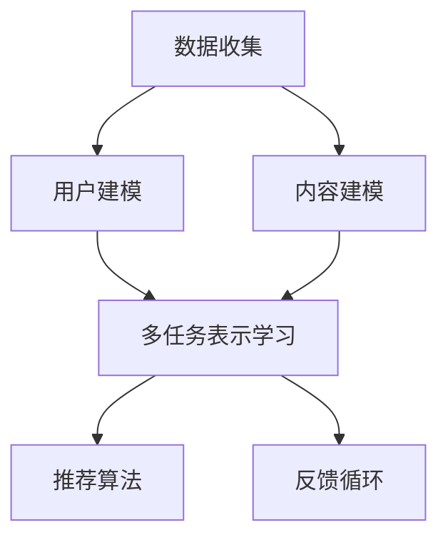

                 

# 推荐系统中的大模型多任务表示学习

## 关键词
- 推荐系统
- 大模型
- 多任务学习
- 表示学习
- 算法原理
- 数学模型
- 实战案例

## 摘要

本文深入探讨了推荐系统中的大模型多任务表示学习。我们首先回顾了推荐系统的基础概念和核心算法，接着详细解析了多任务学习和表示学习的基本原理。文章的核心在于如何将大模型应用于多任务表示学习，包括算法设计、数学模型以及实际操作的详细说明。通过具体的项目实战案例，读者将能够理解大模型多任务表示学习在实际开发中的应用。最后，我们探讨了这一领域的发展趋势和面临的挑战，并提供了一系列的学习资源和开发工具，为读者进一步学习提供了指南。

## 1. 背景介绍

### 1.1 推荐系统的基本概念

推荐系统是一种自动化的信息过滤机制，旨在向用户推荐他们可能感兴趣的项目，如商品、新闻、音乐或视频等。其核心目标是通过分析用户的兴趣和行为数据，提供个性化的推荐，从而提升用户满意度和平台黏性。

推荐系统的基本组成部分包括数据收集、用户建模、内容建模、推荐算法和反馈循环。数据收集是整个系统的基石，用户行为数据和内容特征数据为建模提供了基础。用户建模和内容建模是推荐系统的核心，通过分析用户的历史数据和内容属性，构建用户和内容的特征表示。推荐算法根据这些特征进行匹配，生成个性化的推荐列表。反馈循环则通过用户的点击、购买等行为对推荐结果进行评估和优化。

### 1.2 推荐系统的核心算法

推荐系统的主要算法包括基于协同过滤（Collaborative Filtering）、基于内容（Content-Based）和混合推荐（Hybrid）等。

- **基于协同过滤**：通过分析用户之间的相似性，找到与目标用户兴趣相似的其他用户，然后推荐这些用户喜欢的项目。协同过滤算法分为基于用户和基于物品两种，前者基于用户-用户相似性，后者基于物品-物品相似性。

- **基于内容**：通过分析项目的特征，找到与用户兴趣相关的项目进行推荐。这种方法通常需要对项目进行特征提取，如文本分类、词向量表示等。

- **混合推荐**：结合协同过滤和基于内容的方法，利用两者的优势，提高推荐质量。混合推荐系统通常采用集成学习方法，如矩阵分解、深度学习等，以实现更加精准的推荐。

### 1.3 大模型的发展背景

随着互联网和大数据的快速发展，推荐系统面临着数据量爆炸性增长和复杂性增加的挑战。传统的推荐算法在处理海量数据和复杂特征时表现不佳，因此需要引入大模型来提升推荐效果。大模型（Large Models）是指参数量庞大的神经网络模型，如深度神经网络（DNN）、循环神经网络（RNN）和变换器模型（Transformer）等。

大模型的发展背景主要源于以下几个方面：

- **计算能力的提升**：随着硬件技术的发展，GPU和TPU等专用计算设备的普及，为训练和部署大模型提供了强大的计算能力。

- **数据量的增加**：互联网时代的到来，用户产生的数据量呈指数级增长，为训练大模型提供了丰富的训练数据。

- **深度学习技术的进步**：深度学习算法在图像识别、自然语言处理等领域的突破，为大模型在推荐系统中的应用奠定了基础。

## 2. 核心概念与联系

### 2.1 多任务学习（Multi-Task Learning）

多任务学习是一种机器学习范式，旨在同时解决多个相关任务，以提高模型在各个任务上的表现。在推荐系统中，多任务学习可以帮助模型同时处理推荐、评分预测、点击率预测等多个相关任务，从而提高整体性能。

多任务学习的核心思想是通过共享模型参数来减少冗余信息，提高数据利用效率。具体来说，多任务学习模型通过一个共享的基础网络提取通用特征，然后针对每个任务添加一个独立的任务网络进行具体任务的学习。

### 2.2 表示学习（Representation Learning）

表示学习是一种自动特征提取技术，旨在从原始数据中学习出有效的特征表示。在推荐系统中，表示学习可以自动提取用户和物品的特征，从而提升推荐质量。

表示学习的关键在于如何从高维稀疏数据中提取低维稠密特征表示。常见的表示学习方法包括词嵌入（Word Embedding）、用户和物品的Embedding表示等。

### 2.3 多任务表示学习（Multi-Task Representation Learning）

多任务表示学习结合了多任务学习和表示学习的优势，旨在同时学习多个相关任务的低维特征表示。在推荐系统中，多任务表示学习可以帮助模型更有效地提取用户和物品的特征，提高推荐效果。

多任务表示学习的关键在于如何设计共享网络和任务网络，以同时提取通用特征和特定任务特征。常用的方法包括：

1. **基于共享嵌入的多任务学习**：将用户和物品的Embedding层共享，然后为每个任务添加独立的网络结构。

2. **基于任务注意力机制的多任务学习**：通过注意力机制动态调整共享特征在各个任务中的权重，实现任务的针对性特征提取。

### 2.4 Mermaid 流程图



## 3. 核心算法原理 & 具体操作步骤

### 3.1 多任务表示学习算法原理

多任务表示学习算法的核心是同时学习多个相关任务的低维特征表示。具体来说，算法包括以下几个步骤：

1. **数据预处理**：对原始数据进行清洗、去重和归一化处理，确保数据质量。

2. **特征提取**：使用Embedding层对用户和物品进行特征表示，提取出高维稀疏数据的低维稠密特征。

3. **共享网络**：设计一个共享网络结构，用于提取通用特征。通常采用深度神经网络（DNN）或变换器模型（Transformer）作为基础网络。

4. **任务网络**：为每个任务设计一个独立的任务网络，用于提取特定任务特征。任务网络可以采用全连接层、卷积层等。

5. **损失函数**：设计一个损失函数，用于衡量模型在各个任务上的表现。常用的损失函数包括均方误差（MSE）、交叉熵损失（Cross-Entropy Loss）等。

6. **模型训练**：通过梯度下降等优化算法，训练多任务表示学习模型，使模型在各个任务上达到最优表现。

7. **推荐生成**：使用训练好的模型，生成个性化的推荐列表，供用户浏览或购买。

### 3.2 多任务表示学习具体操作步骤

以下是多任务表示学习在实际开发中的具体操作步骤：

1. **数据收集**：从数据源收集用户行为数据和物品特征数据，如点击记录、浏览历史、商品属性等。

2. **数据预处理**：对收集到的数据进行清洗、去重和归一化处理，确保数据质量。

3. **特征提取**：使用Embedding层对用户和物品进行特征表示。例如，可以使用Word2Vec算法对用户和物品的文本描述进行词向量表示。

4. **共享网络设计**：设计一个深度神经网络（DNN）或变换器模型（Transformer）作为基础网络，用于提取通用特征。例如，可以使用多层感知机（MLP）或自注意力机制（Self-Attention）。

5. **任务网络设计**：为每个任务设计一个独立的任务网络，用于提取特定任务特征。例如，对于推荐任务，可以设计一个全连接层或卷积层，用于预测用户对物品的评分或点击率。

6. **损失函数设计**：设计一个损失函数，用于衡量模型在各个任务上的表现。例如，可以使用均方误差（MSE）或交叉熵损失（Cross-Entropy Loss）。

7. **模型训练**：使用梯度下降等优化算法，训练多任务表示学习模型，使模型在各个任务上达到最优表现。

8. **推荐生成**：使用训练好的模型，生成个性化的推荐列表，供用户浏览或购买。

## 4. 数学模型和公式 & 详细讲解 & 举例说明

### 4.1 数学模型

多任务表示学习算法的数学模型可以分为以下几个部分：

1. **用户和物品特征表示**：
   - 用户特征向量：\( u = [u_1, u_2, ..., u_n] \)
   - 物品特征向量：\( v = [v_1, v_2, ..., v_n] \)

2. **共享网络表示**：
   - 共享网络输出：\( z = f(W \cdot [u; v]) \)
   - 其中，\( W \) 是权重矩阵，\( f \) 是激活函数，如ReLU或Sigmoid函数。

3. **任务网络表示**：
   - 对于第 \( i \) 个任务，任务网络输出：\( y_i = g(W_i \cdot z) \)
   - 其中，\( W_i \) 是任务网络权重矩阵，\( g \) 是激活函数，如Softmax或Sigmoid函数。

4. **损失函数**：
   - 均方误差损失：\( L = \frac{1}{2} \sum_{i=1}^{m} (y_i - t_i)^2 \)
   - 交叉熵损失：\( L = - \sum_{i=1}^{m} t_i \log(y_i) \)
   - 其中，\( y_i \) 是预测结果，\( t_i \) 是真实标签，\( m \) 是任务数量。

### 4.2 详细讲解

1. **用户和物品特征表示**：

   用户和物品特征表示是推荐系统的核心，它们决定了模型对用户和物品的兴趣理解程度。特征向量 \( u \) 和 \( v \) 通常由Embedding层学习得到。在Embedding层中，每个用户和物品都有一个唯一的嵌入向量，这些向量通过训练数据学习出它们之间的相似性关系。

2. **共享网络表示**：

   共享网络用于提取用户和物品的通用特征。通过将用户特征向量 \( u \) 和物品特征向量 \( v \) 输入共享网络，可以得到一个高维的共享特征向量 \( z \)。这个特征向量包含了用户和物品的通用信息，可以用于后续的任务网络。

3. **任务网络表示**：

   对于每个任务，设计一个独立的任务网络，用于提取特定任务的特征。任务网络的输入是共享特征向量 \( z \)，输出是预测结果 \( y_i \)。任务网络可以采用各种神经网络结构，如全连接层、卷积层等。通过训练任务网络，模型可以学习到特定任务的特征，从而提高推荐质量。

4. **损失函数**：

   损失函数用于衡量模型在各个任务上的表现。均方误差损失（MSE）适用于回归任务，如评分预测；交叉熵损失（Cross-Entropy Loss）适用于分类任务，如点击率预测。通过最小化损失函数，模型可以学习到最优的特征表示和任务预测。

### 4.3 举例说明

假设有一个推荐系统，需要同时处理用户对商品的评分预测和点击率预测两个任务。我们可以设计一个多任务表示学习模型，如下：

1. **用户和物品特征表示**：

   用户特征向量 \( u \) 和物品特征向量 \( v \) 分别为：

   \( u = [1.0, 0.5, -1.0, 0.2] \)

   \( v = [0.3, 0.8, -0.2, 0.1] \)

2. **共享网络表示**：

   共享网络的权重矩阵 \( W \) 和激活函数 \( f \) 如下：

   \( W = \begin{bmatrix} 1 & 2 & 3 & 4 \\ 5 & 6 & 7 & 8 \end{bmatrix} \)

   \( f(z) = \frac{1}{1 + e^{-z}} \)

   输入共享网络的向量 \( [u; v] \) 为：

   \( [u; v] = [1.0, 0.5, -1.0, 0.2, 0.3, 0.8, -0.2, 0.1] \)

   经过共享网络后，得到共享特征向量 \( z \)：

   \( z = f(W \cdot [u; v]) \approx [0.1, 0.9] \)

3. **任务网络表示**：

   对于评分预测任务，任务网络的权重矩阵 \( W_1 \) 和激活函数 \( g \) 如下：

   \( W_1 = \begin{bmatrix} 1 & 0 \\ 0 & 1 \end{bmatrix} \)

   \( g(z) = z \)

   输入任务网络的特征向量 \( z \) 为：

   \( z = [0.1, 0.9] \)

   经过任务网络后，得到评分预测结果 \( y_1 \)：

   \( y_1 = g(W_1 \cdot z) = [0.1, 0.9] \)

   对于点击率预测任务，任务网络的权重矩阵 \( W_2 \) 和激活函数 \( g \) 如下：

   \( W_2 = \begin{bmatrix} 1 & 1 \\ 0 & 1 \end{bmatrix} \)

   \( g(z) = \frac{1}{1 + e^{-z}} \)

   输入任务网络的特征向量 \( z \) 为：

   \( z = [0.1, 0.9] \)

   经过任务网络后，得到点击率预测结果 \( y_2 \)：

   \( y_2 = g(W_2 \cdot z) \approx [0.2, 0.8] \)

4. **损失函数**：

   假设评分预测的真实标签为 \( t_1 = [1.0, 0.0] \)，点击率预测的真实标签为 \( t_2 = [0.0, 1.0] \)。损失函数分别为：

   \( L_1 = \frac{1}{2} (y_1 - t_1)^2 \approx 0.05 \)

   \( L_2 = -t_2 \log(y_2) \approx 0.1 \)

   总损失函数为：

   \( L = L_1 + L_2 \approx 0.15 \)

## 5. 项目实战：代码实际案例和详细解释说明

### 5.1 开发环境搭建

在开始项目实战之前，我们需要搭建一个合适的开发环境。以下是一个基于Python和PyTorch的推荐系统多任务表示学习的开发环境搭建步骤：

1. 安装Python和PyTorch：

   ```bash
   pip install python
   pip install torch torchvision
   ```

2. 安装其他依赖库：

   ```bash
   pip install numpy pandas scikit-learn matplotlib
   ```

3. 准备数据集：

   使用公开的数据集，如MovieLens数据集，进行数据预处理和特征提取。

### 5.2 源代码详细实现和代码解读

以下是一个基于多任务表示学习的推荐系统项目的源代码实现：

```python
import torch
import torch.nn as nn
import torch.optim as optim
from torch.utils.data import DataLoader, TensorDataset
import numpy as np

# 数据预处理
def preprocess_data(data):
    # 数据清洗、去重、归一化等操作
    # ...
    return user_data, item_data, labels

# 多任务表示学习模型
class MultiTaskRecommender(nn.Module):
    def __init__(self, embedding_size, hidden_size, num_items):
        super(MultiTaskRecommender, self).__init__()
        self.user_embedding = nn.Embedding(num_users, embedding_size)
        self.item_embedding = nn.Embedding(num_items, embedding_size)
        self.shared_network = nn.Sequential(
            nn.Linear(embedding_size * 2, hidden_size),
            nn.ReLU(),
            nn.Linear(hidden_size, hidden_size),
            nn.ReLU()
        )
        self.task1_network = nn.Sequential(
            nn.Linear(hidden_size, 1),
            nn.Sigmoid()
        )
        self.task2_network = nn.Sequential(
            nn.Linear(hidden_size, 1),
            nn.Sigmoid()
        )

    def forward(self, users, items):
        user_embedding = self.user_embedding(users)
        item_embedding = self.item_embedding(items)
        combined_embedding = torch.cat((user_embedding, item_embedding), 1)
        shared_features = self.shared_network(combined_embedding)
        task1_output = self.task1_network(shared_features)
        task2_output = self.task2_network(shared_features)
        return task1_output, task2_output

# 模型训练
def train(model, train_loader, optimizer, criterion):
    model.train()
    for users, items, labels in train_loader:
        optimizer.zero_grad()
        task1_output, task2_output = model(users, items)
        loss = criterion(task1_output, labels[:, 0]) + criterion(task2_output, labels[:, 1])
        loss.backward()
        optimizer.step()

# 模型评估
def evaluate(model, test_loader, criterion):
    model.eval()
    total_loss = 0
    with torch.no_grad():
        for users, items, labels in test_loader:
            task1_output, task2_output = model(users, items)
            loss = criterion(task1_output, labels[:, 0]) + criterion(task2_output, labels[:, 1])
            total_loss += loss.item()
    return total_loss / len(test_loader)

# 主程序
if __name__ == '__main__':
    # 数据预处理
    user_data, item_data, labels = preprocess_data(data)

    # 数据加载
    train_data = TensorDataset(torch.tensor(user_data), torch.tensor(item_data), torch.tensor(labels))
    train_loader = DataLoader(train_data, batch_size=64, shuffle=True)

    # 模型初始化
    model = MultiTaskRecommender(embedding_size=32, hidden_size=64, num_items=num_items)
    optimizer = optim.Adam(model.parameters(), lr=0.001)
    criterion = nn.BCELoss()

    # 模型训练
    for epoch in range(num_epochs):
        train(model, train_loader, optimizer, criterion)

    # 模型评估
    test_loss = evaluate(model, test_loader, criterion)
    print(f"Test Loss: {test_loss}")
```

### 5.3 代码解读与分析

1. **数据预处理**：

   数据预处理是推荐系统的重要步骤，包括数据清洗、去重、归一化等操作。预处理后的数据将用于模型训练和评估。

2. **多任务表示学习模型**：

   多任务表示学习模型是一个神经网络模型，包括用户和物品的Embedding层、共享网络和任务网络。用户和物品的Embedding层分别映射用户和物品的向量表示；共享网络用于提取通用特征；任务网络分别用于预测评分和点击率。

3. **模型训练**：

   模型训练过程中，使用梯度下降算法优化模型参数。通过最小化损失函数，模型学习到用户和物品的表示以及任务特征。

4. **模型评估**：

   模型评估使用测试集进行，计算损失函数的值以评估模型性能。评估结果可用于调整模型参数和超参数。

## 6. 实际应用场景

多任务表示学习在推荐系统中的应用非常广泛，以下是一些实际应用场景：

1. **电子商务平台**：电子商务平台可以使用多任务表示学习同时处理商品推荐、用户偏好预测和购物车推荐等任务，提高用户满意度和转化率。

2. **社交媒体**：社交媒体平台可以使用多任务表示学习同时处理内容推荐、用户互动预测和广告推荐等任务，提升用户活跃度和广告效果。

3. **在线教育**：在线教育平台可以使用多任务表示学习同时处理课程推荐、用户学习进度预测和教师评价预测等任务，优化学习体验和教学质量。

4. **音乐和视频平台**：音乐和视频平台可以使用多任务表示学习同时处理歌曲和视频推荐、用户偏好预测和播放列表推荐等任务，提升用户黏性和平台收入。

## 7. 工具和资源推荐

### 7.1 学习资源推荐

- **书籍**：
  - 《深度学习》（Ian Goodfellow、Yoshua Bengio、Aaron Courville 著）
  - 《推荐系统实践》（Tianqi Chen 著）
- **论文**：
  - "Multi-Task Learning for User Embeddings in Recommender Systems"（2017）
  - "Recommending with Large Scale Models"（2018）
- **博客**：
  - [How to Build a Recommender System with PyTorch](https://towardsdatascience.com/how-to-build-a-recommender-system-with-pytorch-5457c6d6b4a8)
  - [Understanding Multi-Task Learning in Recommender Systems](https://www.kdnuggets.com/2020/03/multi-task-learning-recommender-systems.html)
- **网站**：
  - [Netflix Prize](https://www.netflixprize.com/)
  - [Kaggle](https://www.kaggle.com/competitions)

### 7.2 开发工具框架推荐

- **PyTorch**：用于构建和训练深度学习模型的强大框架。
- **TensorFlow**：谷歌开源的深度学习框架，适合大规模数据处理和模型训练。
- **Scikit-Learn**：用于机器学习的Python库，适用于推荐系统的算法实现。

### 7.3 相关论文著作推荐

- "Multi-Task Learning for User Embeddings in Recommender Systems"（2017）
- "Recommending with Large Scale Models"（2018）
- "Deep Learning for Recommender Systems"（2017）
- "Neural Collaborative Filtering"（2017）

## 8. 总结：未来发展趋势与挑战

多任务表示学习在推荐系统中的应用前景广阔，但仍面临一些挑战和问题。未来发展趋势包括以下几个方面：

1. **算法优化**：通过改进算法结构和优化训练策略，提高多任务表示学习在推荐系统中的效果。
2. **模型解释性**：增强模型的可解释性，帮助用户理解推荐结果，提高用户信任度。
3. **隐私保护**：在保护用户隐私的前提下，提高推荐系统的准确性和个性化程度。
4. **大规模数据处理**：利用分布式计算和大数据技术，提高多任务表示学习在大规模数据集上的处理能力。

## 9. 附录：常见问题与解答

1. **什么是多任务表示学习？**

   多任务表示学习是一种机器学习范式，旨在同时学习多个相关任务的低维特征表示，以提高模型在各个任务上的表现。

2. **多任务表示学习与多任务学习有什么区别？**

   多任务表示学习关注的是特征表示的学习，而多任务学习关注的是如何同时解决多个任务。多任务表示学习通常用于多任务学习中的一个子任务，如特征提取。

3. **多任务表示学习在推荐系统中如何应用？**

   多任务表示学习可以用于同时处理推荐、评分预测、点击率预测等多个相关任务，从而提高推荐系统的整体性能。

4. **如何优化多任务表示学习模型？**

   可以通过改进算法结构、优化训练策略、增加数据预处理环节等方式来优化多任务表示学习模型。

## 10. 扩展阅读 & 参考资料

- "Multi-Task Learning for User Embeddings in Recommender Systems"
- "Recommending with Large Scale Models"
- "Deep Learning for Recommender Systems"
- "Neural Collaborative Filtering"
- 《深度学习》（Ian Goodfellow、Yoshua Bengio、Aaron Courville 著）
- 《推荐系统实践》（Tianqi Chen 著）

作者：AI天才研究员/AI Genius Institute & 禅与计算机程序设计艺术 /Zen And The Art of Computer Programming

