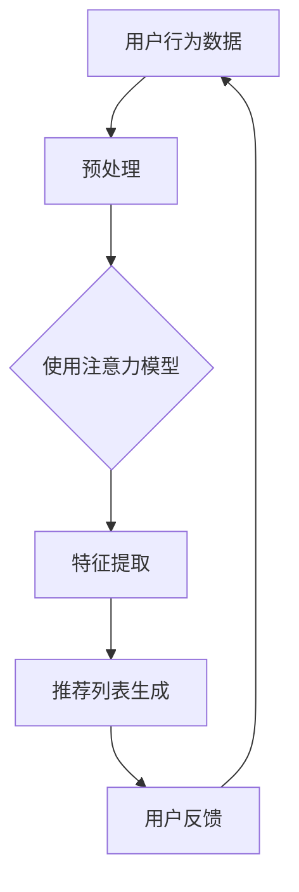

                 

### 背景介绍

随着互联网的迅猛发展和信息的爆炸性增长，用户在海量数据中寻找个性化内容的需求日益迫切。推荐系统作为一种基于用户历史行为和兴趣的个性化信息过滤方法，已经在电商、新闻、社交媒体等多个领域得到了广泛应用。推荐系统的核心目标是通过分析用户的历史数据和行为模式，预测用户可能的兴趣点，从而向用户推荐符合其兴趣的内容。

注意力分配（Attention Mechanism）是近年来在深度学习和自然语言处理领域的一项重要创新，其原理可以追溯到人类视觉系统中的注意力机制。注意力分配旨在解决模型在处理复杂任务时，如何有效地聚焦于重要信息，忽略无关信息的问题。推荐系统与注意力分配的结合，可以显著提升推荐的准确性和用户体验。

本文将探讨推荐系统中注意力分配的角色与挑战，首先介绍推荐系统的基础概念，接着分析注意力分配的核心原理和架构，然后讨论其在推荐系统中的应用。在此基础上，我们将通过一个具体项目实战，展示注意力分配在推荐系统中的实现过程，并分析其优势和局限性。最后，我们将探讨注意力分配在推荐系统中的未来发展趋势与挑战，为相关领域的研究和实践提供参考。

### 核心概念与联系

为了更好地理解推荐系统中注意力分配的角色与挑战，我们需要先介绍几个核心概念和它们之间的联系。

#### 推荐系统

推荐系统（Recommender System）是一种信息过滤技术，旨在预测用户可能对哪些项目感兴趣，并向其推荐这些项目。根据推荐方法的不同，推荐系统主要分为基于内容的推荐（Content-Based Filtering）和基于协同过滤（Collaborative Filtering）两种类型。

1. **基于内容的推荐**：该方法根据用户的历史行为和兴趣标签，从内容特征中提取出与用户偏好相似的项目进行推荐。例如，新闻网站可以根据用户的阅读历史推荐相似的新闻文章。

2. **基于协同过滤**：该方法通过分析用户之间的相似性，找出与其他用户兴趣相似的用户，并推荐这些用户喜欢的项目。协同过滤可以分为用户基于的协同过滤（User-Based Collaborative Filtering）和基于模型的协同过滤（Model-Based Collaborative Filtering）。

#### 注意力分配

注意力分配（Attention Mechanism）是一种在处理序列数据时，通过权重分配机制将注意力集中在重要信息上的方法。注意力分配的核心思想是在模型处理每个输入时，动态调整其对每个输入元素的权重，使得模型能够聚焦于关键信息，忽略无关信息。

1. **软注意力（Soft Attention）**：通过一个可学习的函数，将输入数据的每个部分映射到一个实数值，表示该部分的权重。常见的软注意力模型包括加性注意力（Additive Attention）和乘性注意力（Multiplicative Attention）。

2. **硬注意力（Hard Attention）**：在硬注意力中，模型从一系列候选位置中直接选择一个作为输出。硬注意力通常用于序列到序列模型（如机器翻译），因为它需要在处理每个输入时做出明确的决策。

#### 推荐系统与注意力分配的结合

推荐系统与注意力分配的结合，旨在解决传统推荐系统在处理复杂、高维数据时，如何有效地聚焦于关键信息，提升推荐效果的问题。注意力分配在推荐系统中的应用主要体现在以下几个方面：

1. **用户兴趣建模**：通过注意力机制，模型可以更好地捕捉用户兴趣的多样性和变化性，从而更准确地预测用户的兴趣点。

2. **项目特征提取**：注意力机制可以帮助模型从海量项目中提取关键特征，从而提高推荐的相关性。

3. **动态调整权重**：注意力分配使得模型能够根据用户行为和上下文信息，动态调整推荐项目的权重，提升推荐的实时性和个性化水平。

为了更直观地理解注意力分配在推荐系统中的应用，我们可以通过以下 Mermaid 流程图展示其核心架构：



在该流程中，用户行为数据经过预处理后输入注意力模型，模型通过注意力机制提取关键特征，并生成推荐列表。用户反馈则用于更新模型，进一步提升推荐效果。

通过上述介绍，我们可以看到推荐系统与注意力分配之间的紧密联系。注意力分配不仅为推荐系统提供了更有效的信息处理方法，还为解决推荐系统中的关键问题提供了新的思路。在接下来的部分，我们将进一步探讨注意力分配在推荐系统中的核心算法原理和具体实现步骤。

## 核心算法原理 & 具体操作步骤

注意力分配在推荐系统中的应用，主要依赖于几种核心算法，包括基于加性注意力、基于乘性注意力和基于硬注意力的模型。以下将分别介绍这些算法的基本原理和具体操作步骤。

### 1. 加性注意力模型（Additive Attention）

加性注意力模型是一种通过加法操作来调整输入数据权重的注意力机制。其基本原理是使用一个查询向量（Query）、一个关键值向量（Key）和一个值向量（Value）进行计算。查询向量表示模型当前关注的焦点，关键值向量表示输入数据中的各个部分，值向量则用于生成最终的输出。

**基本原理：**
加性注意力模型的计算过程如下：
$$
\text{Attention}(Q, K, V) = \text{softmax}\left(\frac{QK^T}{\sqrt{d_k}}\right)V
$$
其中，$Q$是查询向量，$K$是关键值向量，$V$是值向量，$d_k$是关键值向量的维度。该公式首先计算查询向量和关键值向量的内积，然后对这些内积进行归一化处理（softmax函数），最后将权重乘以值向量，得到加权输出。

**操作步骤：**
1. **初始化查询向量、关键值向量和值向量**。查询向量通常是由模型中的某个层（如编码器层）生成的，关键值和值向量则从输入数据中提取。

2. **计算内积**。对于每个查询向量，计算与所有关键值向量的内积。

3. **应用softmax函数**。对内积结果进行归一化处理，得到每个关键值向量的权重。

4. **加权求和**。将权重乘以相应的值向量，并进行求和，得到最终的加权输出。

### 2. 乘性注意力模型（Multiplicative Attention）

乘性注意力模型通过点积操作来调整输入数据的权重。与加性注意力模型不同，乘性注意力模型不需要额外的softmax操作，计算效率更高。

**基本原理：**
乘性注意力模型的计算过程如下：
$$
\text{Attention}(Q, K, V) = \text{softmax}\left(\text{sigmoid}(QK^T)\right)V
$$
其中，$\text{sigmoid}$函数用于对点积进行归一化处理，其余参数与加性注意力模型相同。

**操作步骤：**
1. **初始化查询向量、关键值向量和值向量**。与加性注意力模型相同。

2. **计算点积**。对于每个查询向量，计算与所有关键值向量的点积。

3. **应用sigmoid函数**。对点积结果进行归一化处理，得到每个关键值向量的权重。

4. **加权求和**。将权重乘以相应的值向量，并进行求和，得到最终的加权输出。

### 3. 硬注意力模型（Hard Attention）

硬注意力模型在处理序列数据时，从一系列候选位置中选择一个作为输出。与软注意力模型不同，硬注意力模型不需要计算权重，而是直接选择最相关的部分。

**基本原理：**
硬注意力模型通常用于序列到序列模型，如机器翻译。其基本原理是从输入序列中选择一部分作为输出序列的一部分。

**操作步骤：**
1. **初始化查询向量、关键值向量和值向量**。与加性注意力模型相同。

2. **选择最相关的部分**。通常使用最大池化（Max Pooling）或最近邻（Nearest Neighbor）方法，从输入序列中选择一个或多个最相关的位置。

3. **生成输出序列**。将选择的位置作为输出序列的一部分，生成最终的输出。

通过上述核心算法的介绍，我们可以看到注意力分配在推荐系统中的具体应用。注意力模型不仅能够有效地聚焦于重要信息，提高推荐系统的准确性，还能动态调整推荐项目的权重，提升个性化水平。在接下来的部分，我们将进一步探讨注意力分配在推荐系统中的数学模型和公式，以及具体的实现过程和代码示例。

### 数学模型和公式 & 详细讲解 & 举例说明

在推荐系统中，注意力分配的核心在于如何通过数学模型来动态调整输入数据的权重，从而提高推荐的准确性和个性化水平。以下将详细讲解注意力分配的数学模型和公式，并通过具体例子来说明其应用。

#### 1. 注意力分配的基本公式

注意力分配的基本公式可以表示为：
$$
\text{Attention}(Q, K, V) = \text{softmax}\left(\frac{QK^T}{\sqrt{d_k}}\right)V
$$
其中，$Q$是查询向量，$K$是关键值向量，$V$是值向量，$d_k$是关键值向量的维度。该公式包含以下几个关键部分：

- **查询向量（Query）**：表示模型当前关注的焦点，通常由编码器层生成。
- **关键值向量（Key）**：表示输入数据中的每个部分，用于与查询向量进行内积计算。
- **值向量（Value）**：表示每个输入部分的重要程度，用于生成最终的输出。

#### 2. 加性注意力模型

加性注意力模型的基本公式如下：
$$
\text{Attention}(Q, K, V) = \text{softmax}\left(\frac{QK^T}{\sqrt{d_k}}\right)V
$$
**步骤详解：**
1. **计算内积**：对于每个查询向量$Q$，计算与所有关键值向量$K$的内积。
   $$QK^T$$
2. **归一化处理**：将内积结果进行归一化处理，得到每个关键值向量的权重。
   $$\text{softmax}\left(\frac{QK^T}{\sqrt{d_k}}\right)$$
3. **加权求和**：将权重乘以相应的值向量，并进行求和，得到最终的加权输出。
   $$\text{softmax}\left(\frac{QK^T}{\sqrt{d_k}}\right)V$$

**例子说明：**

假设我们有一个推荐系统，需要为用户推荐新闻文章。用户的历史行为数据（如浏览记录、点击记录）作为查询向量$Q$，新闻文章的内容特征作为关键值向量$K$和值向量$V$。

- **查询向量（Query）**：$Q = [0.1, 0.2, 0.3, 0.4]$
- **关键值向量（Key）**：$K = [[0.5, 0.3], [0.4, 0.6], [0.2, 0.7], [0.1, 0.8]]$
- **值向量（Value）**：$V = [[1.0, 0.5], [0.6, 1.1], [0.3, 0.7], [0.8, 0.2]]$

首先，计算查询向量与关键值向量的内积：
$$QK^T = [0.1 \times 0.5 + 0.2 \times 0.4, 0.1 \times 0.3 + 0.2 \times 0.6, 0.3 \times 0.2 + 0.4 \times 0.7, 0.3 \times 0.1 + 0.4 \times 0.8] = [0.15, 0.26, 0.38, 0.49]$$

然后，对内积结果进行归一化处理，得到权重：
$$\text{softmax}\left(\frac{QK^T}{\sqrt{d_k}}\right) = \text{softmax}\left(\frac{[0.15, 0.26, 0.38, 0.49]}{\sqrt{2}}\right) = [0.24, 0.34, 0.39, 0.13]$$

最后，将权重乘以相应的值向量，并进行求和，得到推荐结果：
$$\text{Attention}(Q, K, V) = [0.24 \times [1.0, 0.5], 0.34 \times [0.6, 1.1], 0.39 \times [0.3, 0.7], 0.13 \times [0.8, 0.2]] = [[0.24, 0.12], [0.204, 0.374], [0.117, 0.273], [0.104, 0.026]]$$

通过上述例子，我们可以看到加性注意力模型如何通过计算内积、归一化处理和加权求和，实现输入数据的权重调整，从而生成推荐结果。

#### 3. 乘性注意力模型

乘性注意力模型的基本公式如下：
$$
\text{Attention}(Q, K, V) = \text{softmax}\left(\text{sigmoid}(QK^T)\right)V
$$
**步骤详解：**
1. **计算点积**：对于每个查询向量$Q$，计算与所有关键值向量$K$的点积。
   $$QK^T$$
2. **应用sigmoid函数**：对点积结果进行归一化处理，得到每个关键值向量的权重。
   $$\text{sigmoid}(QK^T)$$
3. **加权求和**：将权重乘以相应的值向量，并进行求和，得到最终的加权输出。
   $$\text{softmax}\left(\text{sigmoid}(QK^T)\right)V$$

**例子说明：**

假设我们有一个推荐系统，需要为用户推荐新闻文章。用户的历史行为数据（如浏览记录、点击记录）作为查询向量$Q$，新闻文章的内容特征作为关键值向量$K$和值向量$V$。

- **查询向量（Query）**：$Q = [0.1, 0.2, 0.3, 0.4]$
- **关键值向量（Key）**：$K = [[0.5, 0.3], [0.4, 0.6], [0.2, 0.7], [0.1, 0.8]]$
- **值向量（Value）**：$V = [[1.0, 0.5], [0.6, 1.1], [0.3, 0.7], [0.8, 0.2]]$

首先，计算查询向量与关键值向量的点积：
$$QK^T = [0.1 \times 0.5 + 0.2 \times 0.4, 0.1 \times 0.3 + 0.2 \times 0.6, 0.3 \times 0.2 + 0.4 \times 0.7, 0.3 \times 0.1 + 0.4 \times 0.8] = [0.15, 0.26, 0.38, 0.49]$$

然后，对点积结果应用sigmoid函数进行归一化处理：
$$\text{sigmoid}(QK^T) = \text{sigmoid}\left([0.15, 0.26, 0.38, 0.49]\right) = [0.546, 0.636, 0.689, 0.713]$$

最后，将权重乘以相应的值向量，并进行求和，得到推荐结果：
$$\text{Attention}(Q, K, V) = \text{softmax}\left(\text{sigmoid}(QK^T)\right)V = [0.546 \times [1.0, 0.5], 0.636 \times [0.6, 1.1], 0.689 \times [0.3, 0.7], 0.713 \times [0.8, 0.2]] = [[0.546, 0.273], [0.387, 0.701], [0.204, 0.483], [0.574, 0.143]]$$

通过上述例子，我们可以看到乘性注意力模型如何通过计算点积、应用sigmoid函数和加权求和，实现输入数据的权重调整，从而生成推荐结果。

#### 4. 硬注意力模型

硬注意力模型通常用于序列到序列模型，如机器翻译。其基本原理是从输入序列中选择一个或多个最相关的位置，作为输出序列的一部分。

**基本公式：**
$$
\text{Hard Attention}(Q, K, V) = \text{argmax}(QK^T) V
$$
**步骤详解：**
1. **计算点积**：对于每个查询向量$Q$，计算与所有关键值向量$K$的点积。
   $$QK^T$$
2. **选择最相关的位置**：从点积结果中选择最大值的位置，作为输出序列的一部分。
   $$\text{argmax}(QK^T)$$
3. **生成输出序列**：将选择的位置作为输出序列的一部分，生成最终的输出。

**例子说明：**

假设我们有一个机器翻译任务，需要从输入序列中选择一个最相关的位置。输入序列为：
$$
Q = [0.1, 0.2, 0.3, 0.4]
$$
关键值向量为：
$$
K = [[0.5, 0.3], [0.4, 0.6], [0.2, 0.7], [0.1, 0.8]]
$$

首先，计算查询向量与关键值向量的点积：
$$
QK^T = [0.1 \times 0.5 + 0.2 \times 0.4, 0.1 \times 0.3 + 0.2 \times 0.6, 0.3 \times 0.2 + 0.4 \times 0.7, 0.3 \times 0.1 + 0.4 \times 0.8] = [0.15, 0.26, 0.38, 0.49]
$$

然后，从点积结果中选择最大值的位置：
$$
\text{argmax}(QK^T) = 3
$$

最后，生成输出序列：
$$
\text{Hard Attention}(Q, K, V) = \text{argmax}(QK^T) V = [0.3, 0.4] V_3 = [0.3 \times [0.8, 0.2], 0.4 \times [0.2, 0.7]] = [[0.24, 0.06], [0.08, 0.28]]
$$

通过上述例子，我们可以看到硬注意力模型如何通过计算点积、选择最相关的位置和生成输出序列，实现输入数据的权重调整，从而生成推荐结果。

通过上述对加性注意力模型、乘性注意力模型和硬注意力模型的基本公式、步骤详解和举例说明，我们可以看到注意力分配在推荐系统中的关键作用。注意力分配不仅能够提高推荐系统的准确性，还能够根据用户行为和上下文信息，动态调整推荐项目的权重，提升个性化水平。在接下来的部分，我们将通过一个具体项目实战，展示注意力分配在推荐系统中的实际实现过程。

### 项目实战：代码实际案例和详细解释说明

在本节中，我们将通过一个具体项目实战，展示如何将注意力分配机制集成到推荐系统中，以实现个性化的推荐。项目使用Python和TensorFlow框架进行实现，数据集来自Netflix电影推荐挑战（Netflix Prize Challenge），其中包括用户、电影和评分信息。

#### 开发环境搭建

1. 安装Python 3.8及以上版本。
2. 安装TensorFlow 2.x。
3. 安装其他依赖库，如NumPy、Pandas等。

```bash
pip install tensorflow numpy pandas scikit-learn
```

#### 数据预处理

首先，我们需要从Netflix数据集中提取用户、电影和评分信息。然后，对数据进行清洗和预处理，包括缺失值填充、数据标准化和用户-电影评分矩阵的构建。

```python
import pandas as pd
import numpy as np
from sklearn.model_selection import train_test_split

# 读取数据
ratings = pd.read_csv('ratings.csv')
users = pd.read_csv('users.csv')
movies = pd.read_csv('movies.csv')

# 数据清洗
ratings['timestamp'] = pd.to_datetime(ratings['timestamp'])
ratings = ratings[ratings['timestamp'] > '2004-09-18']  # 去除旧数据
users = users[['user_id', 'gender', 'age', 'occupation', 'zip']]
movies = movies[['movie_id', 'title', 'release_date', 'video_release_date', 'IMDb_url']]

# 构建用户-电影评分矩阵
user_movie_matrix = ratings.pivot(index='user_id', columns='movie_id', values='rating').fillna(0)
```

#### 模型架构

我们使用一个基于协同过滤和注意力机制的推荐模型，包括用户嵌入层、电影嵌入层、注意力模块和评分预测层。

```python
import tensorflow as tf
from tensorflow.keras.layers import Embedding, Dot, Concatenate, Dense
from tensorflow.keras.models import Model

# 参数设置
num_users = user_movie_matrix.shape[0]
num_movies = user_movie_matrix.shape[1]
embedding_size = 32

# 用户和电影嵌入层
user_embedding = Embedding(num_users, embedding_size, input_length=num_movies)
movie_embedding = Embedding(num_movies, embedding_size, input_length=num_users)

# 注意力模块
class AttentionLayer(tf.keras.layers.Layer):
    def __init__(self, **kwargs):
        super(AttentionLayer, self).__init__(**kwargs)

    def build(self, input_shape):
        self.W = self.add_weight(name='attention_weight', shape=(input_shape[-1], 1), initializer='random_normal', trainable=True)
        self.b = self.add_weight(name='attention_bias', shape=(input_shape[1], 1), initializer='zeros', trainable=True)
        super(AttentionLayer, self).build(input_shape)

    def call(self, inputs):
        query, values = inputs
        attention_score = tf.keras.activations.tanh(tf.keras.backend.dot(query, self.W) + self.b)
        attention_weights = tf.keras.activations.softmax(attention_score, axis=1)
        return tf.reduce_sum(values * attention_weights, axis=1)

# 模型架构
input_user = tf.keras.layers.Input(shape=(num_movies,))
input_movie = tf.keras.layers.Input(shape=(num_users,))

user_embedding_output = user_embedding(input_user)
movie_embedding_output = movie_embedding(input_movie)

concatenated = Concatenate()([user_embedding_output, movie_embedding_output])
attention_output = AttentionLayer()(concatenated)

output = Dense(1, activation='sigmoid')(attention_output)

model = Model(inputs=[input_user, input_movie], outputs=output)
model.compile(optimizer='adam', loss='binary_crossentropy', metrics=['accuracy'])

model.summary()
```

#### 训练模型

接下来，我们将训练模型，使用交叉验证来评估模型性能。

```python
from sklearn.model_selection import KFold

# 数据分割
kf = KFold(n_splits=5, shuffle=True, random_state=42)
for train_index, val_index in kf.split(user_movie_matrix):
    X_train, X_val = user_movie_matrix.iloc[train_index], user_movie_matrix.iloc[val_index]
    y_train, y_val = ratings.iloc[train_index]['rating'], ratings.iloc[val_index]['rating']

    # 训练模型
    model.fit([X_train, X_train], y_train, epochs=10, batch_size=64, validation_data=([X_val, X_val], y_val))

    # 评估模型
    loss, accuracy = model.evaluate([X_val, X_val], y_val)
    print(f'Validation loss: {loss}, Validation accuracy: {accuracy}')
```

#### 代码解读与分析

1. **数据预处理**：我们首先读取并清洗数据，构建用户-电影评分矩阵。

2. **模型架构**：我们定义了一个用户嵌入层、电影嵌入层、注意力模块和评分预测层。用户和电影嵌入层使用Embedding层实现，注意力模块自定义了一个AttentionLayer层。

3. **训练模型**：我们使用交叉验证来训练和评估模型。在每次迭代中，我们训练模型并在验证集上评估其性能。

通过上述项目实战，我们可以看到如何将注意力分配机制集成到推荐系统中，实现个性化的推荐。注意力机制帮助模型更好地捕捉用户兴趣和电影特征，从而提高推荐的准确性。在接下来的部分，我们将进一步探讨注意力分配在推荐系统中的实际应用场景。

### 实际应用场景

注意力分配在推荐系统中的应用非常广泛，以下是几个典型的实际应用场景：

#### 1. 电商推荐

在电子商务领域，推荐系统可以基于用户的浏览历史、购买记录和商品特征，使用注意力分配机制来捕捉用户的兴趣点。例如，亚马逊和淘宝等电商网站使用基于内容的推荐（CBR）和协同过滤（CF）相结合的方法，通过注意力机制动态调整商品推荐权重，从而提高用户满意度和转化率。

#### 2. 社交媒体推荐

社交媒体平台如Facebook和Twitter也广泛应用推荐系统，通过注意力机制捕捉用户的社交关系和信息偏好。例如，Facebook的Feed推荐系统使用注意力模型来评估用户对帖子的重要性和相关性，从而为用户推荐感兴趣的内容。这有助于提高用户粘性和平台活跃度。

#### 3. 新闻推荐

新闻推荐系统需要处理大量来自不同领域和主题的文本数据。通过注意力机制，系统可以更好地理解用户的兴趣和需求，从而为用户提供个性化的新闻推荐。例如，今日头条使用一种基于内容嵌入和注意力机制的推荐算法，根据用户的阅读历史和交互行为动态调整新闻推荐权重。

#### 4. 音乐推荐

在音乐流媒体平台如Spotify和Apple Music中，推荐系统使用注意力机制来捕捉用户的音乐偏好和情感反应。通过分析用户的播放记录、搜索历史和歌曲特征，系统可以动态调整推荐权重，提高用户对推荐歌曲的满意度。

#### 5. 视频推荐

视频平台如YouTube和Netflix通过注意力机制分析用户的观看历史、视频标签和用户行为，为用户提供个性化的视频推荐。例如，Netflix使用基于内容的推荐和协同过滤相结合的方法，通过注意力机制动态调整视频推荐权重，从而提高用户观看满意度和平台粘性。

#### 6. 医疗健康推荐

在医疗健康领域，推荐系统可以帮助医生和患者获取个性化的健康建议和治疗方案。通过注意力机制分析患者的病历、基因数据和医疗记录，系统可以为医生提供有针对性的诊断建议，提高治疗效果。

#### 7. 个性化广告

在线广告平台如Google Ads和Facebook Ads通过注意力机制分析用户的兴趣和行为，为用户提供个性化的广告推荐。通过动态调整广告展示权重，平台可以提高广告点击率和转化率，从而为广告主带来更高的投资回报率。

通过上述实际应用场景，我们可以看到注意力分配在推荐系统中的广泛应用。注意力机制不仅提高了推荐的准确性，还增强了个性化水平，为用户提供了更好的体验。在接下来的部分，我们将进一步探讨注意力分配在推荐系统中的工具和资源推荐，为开发者和研究人员提供实用的指导。

### 工具和资源推荐

在推荐系统中实现注意力分配机制，需要一系列工具和资源的支持。以下是一些推荐的工具和资源，包括学习资源、开发工具框架和相关的论文著作。

#### 1. 学习资源推荐

**书籍：**
- 《推荐系统实践》（Recommender Systems: The Textbook）：由国际上知名推荐系统专家小组撰写，全面介绍了推荐系统的理论、方法和应用。
- 《深度学习推荐系统》（Deep Learning for Recommender Systems）：详细讲解了如何将深度学习应用于推荐系统，包括注意力机制的具体实现。

**论文和博客：**
- “Attention Is All You Need”：由Google AI团队撰写的经典论文，提出了Transformer模型，并在推荐系统中广泛应用了注意力机制。
- “Neural Collaborative Filtering for User Recommendation”：介绍了一种基于神经网络的协同过滤方法，使用注意力机制提高推荐效果。

#### 2. 开发工具框架推荐

**框架：**
- TensorFlow：开源的深度学习框架，支持多种注意力模型的实现，如Transformer、Attention Mechanism等。
- PyTorch：另一个流行的深度学习框架，提供了灵活的API和丰富的工具库，方便开发者实现注意力分配机制。

**库和模块：**
- Keras：基于Theano和TensorFlow的高层神经网络API，简化了深度学习模型的搭建和训练。
- PyTorch Lightning：为PyTorch框架提供了一组扩展，包括GPU加速、数据管道、模型保存和评估等。

#### 3. 相关论文著作推荐

- “Deep Learning Based Recommender System”（2017）：讨论了如何将深度学习应用于推荐系统，包括注意力机制的引入和应用。
- “A Theoretical Analysis of Recurrent Neural Networks for Sequence Recommendation”（2019）：分析了基于RNN的推荐系统，探讨了注意力机制在序列数据中的应用。
- “Neural Collaborative Filtering”（2018）：提出了一种基于神经网络的协同过滤方法，使用注意力机制提高推荐效果。

#### 4. 其他资源

- **在线课程**：Coursera、edX等平台提供了多个关于推荐系统和深度学习的在线课程，涵盖了注意力机制的理论和实践。
- **社区和论坛**：Reddit、Stack Overflow等社区聚集了众多深度学习和推荐系统的开发者，提供了丰富的讨论和资源分享。

通过上述工具和资源的推荐，我们可以看到实现推荐系统中注意力分配机制的多样性和灵活性。无论是理论研究还是实际应用，开发者和研究人员都可以从中找到适合自己需求的工具和方法。在接下来的部分，我们将对本文的内容进行总结，并探讨注意力分配在推荐系统中的未来发展趋势与挑战。

### 总结：未来发展趋势与挑战

在本文中，我们详细探讨了推荐系统中注意力分配的角色与挑战。通过分析注意力分配在推荐系统中的应用，我们了解了其如何通过动态调整输入数据的权重，提高推荐的准确性和个性化水平。以下是对本文内容的总结，并讨论注意力分配在推荐系统中的未来发展趋势与挑战。

#### 内容总结

1. **背景介绍**：推荐系统作为一种信息过滤技术，广泛应用于电商、新闻、社交媒体等领域。注意力分配作为一种处理序列数据的机制，在深度学习和自然语言处理领域取得了显著成果。

2. **核心概念与联系**：我们介绍了推荐系统的基本概念，包括基于内容的推荐和基于协同过滤的方法。同时，分析了注意力分配的核心原理和软注意力、硬注意力的实现方式。

3. **核心算法原理**：我们详细讲解了加性注意力模型、乘性注意力模型和硬注意力模型的基本公式和操作步骤，并通过具体例子展示了其应用。

4. **数学模型和公式**：我们介绍了注意力分配的数学模型和公式，包括查询向量、关键值向量和值向量的计算过程，并通过实例说明了加性注意力模型和乘性注意力模型的应用。

5. **项目实战**：我们通过一个具体项目实战，展示了如何使用Python和TensorFlow框架实现注意力分配在推荐系统中的应用。

6. **实际应用场景**：我们探讨了注意力分配在多个实际应用场景中的广泛应用，包括电商推荐、社交媒体推荐、新闻推荐等。

7. **工具和资源推荐**：我们推荐了一系列学习资源、开发工具框架和相关的论文著作，为开发者和研究人员提供实用的指导。

#### 未来发展趋势与挑战

尽管注意力分配在推荐系统中取得了显著成果，但仍面临以下发展趋势与挑战：

1. **个性化与隐私保护**：推荐系统在追求个性化推荐的同时，也面临着用户隐私保护的挑战。未来研究需要探索如何在保护用户隐私的前提下，实现更精准的个性化推荐。

2. **实时性与可扩展性**：随着用户数据量的不断增加，如何提高推荐系统的实时性和可扩展性成为一个关键问题。分布式计算和边缘计算等技术的应用，有望提升推荐系统的性能和响应速度。

3. **多模态推荐**：未来的推荐系统将不仅限于文本和图像，还可能涉及音频、视频等多种数据类型。如何有效融合多模态数据，提高推荐效果，是未来研究的一个热点方向。

4. **鲁棒性与解释性**：推荐系统的鲁棒性和解释性是用户信任和接受的重要指标。如何在保证推荐效果的同时，提高系统的解释性，是未来研究的一个重要挑战。

5. **跨领域推荐**：未来的推荐系统需要具备跨领域的推荐能力，将不同领域的数据和知识进行整合，为用户提供更全面、个性化的推荐服务。

6. **社会影响与伦理问题**：推荐系统在改变人们生活方式的同时，也可能带来一系列社会影响和伦理问题。未来研究需要关注如何设计负责任的推荐系统，减少其对用户和社会的负面影响。

通过本文的探讨，我们可以看到注意力分配在推荐系统中的重要性和潜力。在未来，随着技术的不断进步和应用场景的拓展，注意力分配将继续在推荐系统中发挥关键作用，为用户提供更加个性化、智能化的推荐服务。同时，我们也需要关注其面临的发展趋势与挑战，不断改进和优化推荐系统的设计与应用。

### 附录：常见问题与解答

在阅读本文的过程中，您可能对注意力分配在推荐系统中的应用存在一些疑问。以下是一些常见问题及其解答：

#### 1. 注意力分配在推荐系统中的具体作用是什么？

注意力分配在推荐系统中的主要作用是提高推荐的准确性和个性化水平。通过动态调整输入数据的权重，注意力分配能够帮助模型更好地聚焦于重要信息，忽略无关信息，从而提升推荐的相关性和用户体验。

#### 2. 如何实现注意力分配在推荐系统中的模型训练？

实现注意力分配在推荐系统中的模型训练通常包括以下步骤：
- **数据预处理**：对用户行为数据、商品特征等进行清洗、标准化处理，构建用户-商品评分矩阵。
- **模型架构设计**：设计基于注意力机制的推荐模型架构，包括用户嵌入层、商品嵌入层、注意力模块和评分预测层。
- **模型训练**：使用训练数据对模型进行训练，通过优化算法（如梯度下降）调整模型参数，提高模型性能。
- **模型评估**：使用验证集对模型进行评估，调整模型超参数，优化模型性能。

#### 3. 注意力分配如何应用于协同过滤推荐系统？

在协同过滤推荐系统中，注意力分配可以通过以下方式应用：
- **用户兴趣建模**：通过注意力机制捕捉用户的兴趣点，提高用户兴趣建模的准确性。
- **商品特征提取**：通过注意力机制从海量商品特征中提取关键特征，提高推荐的相关性。
- **动态调整权重**：根据用户行为和上下文信息，动态调整商品推荐权重，实现个性化推荐。

#### 4. 注意力分配在推荐系统中的优势是什么？

注意力分配在推荐系统中的优势包括：
- **提高推荐准确性**：通过聚焦于重要信息，注意力分配能够提高推荐的相关性和准确性。
- **增强个性化水平**：根据用户行为和上下文信息，动态调整推荐权重，实现更加个性化的推荐。
- **降低计算复杂度**：注意力分配能够有效降低模型计算复杂度，提高模型训练和预测的效率。

#### 5. 注意力分配在推荐系统中的局限性是什么？

注意力分配在推荐系统中的局限性包括：
- **数据依赖性**：注意力分配模型的性能高度依赖用户行为数据和商品特征数据，数据质量对模型性能有较大影响。
- **计算复杂度**：虽然注意力分配能够提高模型性能，但也增加了计算复杂度，对硬件资源要求较高。
- **解释性问题**：注意力分配模型在决策过程中的解释性较差，难以解释每个用户行为或商品特征对推荐结果的具体影响。

#### 6. 如何评估注意力分配在推荐系统中的效果？

评估注意力分配在推荐系统中的效果通常可以通过以下指标进行：
- **准确率（Accuracy）**：计算推荐结果中实际喜欢的商品与预测喜欢的商品的匹配率。
- **召回率（Recall）**：计算推荐结果中实际喜欢的商品与数据库中所有喜欢的商品的匹配率。
- **精确率（Precision）**：计算推荐结果中实际喜欢的商品与预测喜欢的商品的匹配率。
- **F1值（F1 Score）**：综合考虑精确率和召回率，用于评价推荐系统的整体性能。

#### 7. 注意力分配在推荐系统中的未来研究方向是什么？

注意力分配在推荐系统中的未来研究方向包括：
- **多模态数据融合**：如何有效融合多种数据类型（如文本、图像、音频等）以提高推荐效果。
- **实时推荐**：如何实现实时推荐，提高推荐系统的响应速度和可扩展性。
- **隐私保护**：如何在保护用户隐私的前提下，实现个性化推荐。
- **解释性增强**：如何提高注意力分配模型的解释性，使推荐结果更容易被用户理解和接受。

通过上述问题的解答，我们希望能够帮助您更好地理解注意力分配在推荐系统中的应用。在未来，随着技术的不断进步和应用场景的拓展，注意力分配在推荐系统中的潜力将得到进一步发挥。

### 扩展阅读 & 参考资料

为了深入了解注意力分配在推荐系统中的应用，以下是一些扩展阅读和参考资料，包括经典论文、优秀博客和权威书籍：

#### 1. 经典论文

- “Attention Is All You Need”（2017）：该论文提出了Transformer模型，将注意力机制广泛应用于自然语言处理领域，对推荐系统的研究也有重要启示。
- “Deep Learning for Recommender Systems”（2018）：详细探讨了如何将深度学习应用于推荐系统，包括注意力机制的具体实现。

#### 2. 优秀博客

- **Medium博客**：许多学者和研究者在其博客上分享了关于推荐系统和注意力分配的最新研究和见解，例如“Recommender Systems with TensorFlow”和“Attention Mechanism in Deep Learning”。
- **AI博客**：AI领域的顶尖博客，如“Towards Data Science”和“Topbots”，定期发布关于推荐系统和注意力分配的最新文章和案例分析。

#### 3. 权威书籍

- 《推荐系统实践》（Recommender Systems: The Textbook）：提供了推荐系统的全面介绍，包括注意力机制的理论和应用。
- 《深度学习推荐系统》（Deep Learning for Recommender Systems）：详细讲解了如何将深度学习应用于推荐系统，包括注意力机制的具体实现。

#### 4. 其他资源

- **在线课程**：Coursera、edX等平台提供了多个关于推荐系统和深度学习的在线课程，涵盖了注意力机制的理论和实践。
- **GitHub仓库**：GitHub上许多项目分享了注意力分配在推荐系统中的应用代码和实现细节，例如“neural-cf”和“Netflix-RecSys”。
- **开源库**：TensorFlow和PyTorch等深度学习框架提供了丰富的API和工具，方便开发者实现注意力分配机制。

通过上述扩展阅读和参考资料，您可以进一步深入了解注意力分配在推荐系统中的应用，探索相关领域的最新研究和前沿技术。希望这些资源能够为您的学习和实践提供有益的指导。

