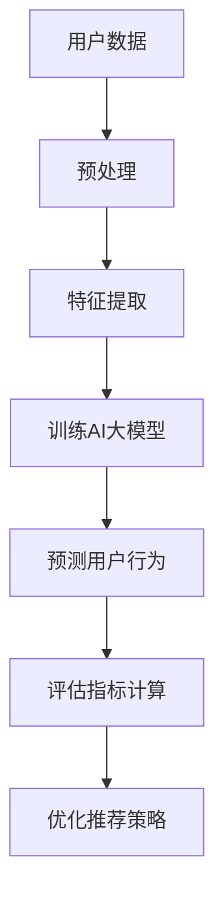

                 

## 推荐系统的长期效应评估：AI大模型的新方法

### 关键词：推荐系统、长期效应评估、AI大模型、用户行为分析、效果优化

### 摘要：

本文旨在探讨推荐系统在长期运营中的效应评估问题，引入AI大模型作为新的方法来进行研究。我们将详细阐述推荐系统的基本概念，分析其长期效应评估的难点，并介绍基于AI大模型的评估框架和算法原理。通过具体案例和实践经验，本文将展示如何利用AI大模型进行推荐系统的长期效应评估，帮助开发者更好地优化和改进推荐算法，提高用户体验。

## 1. 背景介绍

推荐系统作为一种智能信息过滤技术，旨在根据用户的历史行为和偏好，向用户推荐他们可能感兴趣的内容或商品。随着互联网的迅速发展，推荐系统已经广泛应用于电子商务、社交媒体、在线视频、新闻资讯等多个领域。然而，推荐系统的长期效应评估一直是一个具有挑战性的问题。

传统的推荐系统评估方法主要依赖于短期效果指标，如点击率、转化率等。这些指标虽然能够在一定程度上反映推荐系统的效果，但往往忽略了用户在长期使用中的行为变化和潜在需求。此外，随着推荐系统的规模和复杂性不断增加，传统的评估方法也面临着数据量大、计算复杂度高的问题。

为了解决这些问题，近年来，研究者们开始探索利用人工智能，特别是大模型来进行推荐系统的长期效应评估。AI大模型具有强大的数据处理和模式识别能力，能够从海量用户数据中提取有价值的信息，帮助开发者更好地理解用户行为，优化推荐算法。

本文将介绍AI大模型在推荐系统长期效应评估中的应用，通过具体案例和实践经验，展示如何利用AI大模型实现推荐系统的长期效应评估，并提供一些建议和启示。

## 2. 核心概念与联系

### 推荐系统的基本概念

推荐系统主要由以下几个核心组件构成：

1. **用户画像**：根据用户的历史行为、兴趣爱好、社交关系等信息，构建用户画像，用于描述用户的偏好和需求。
2. **物品特征**：对推荐系统中的物品进行特征提取，如商品的种类、价格、品牌等，以便更好地匹配用户画像。
3. **推荐算法**：根据用户画像和物品特征，利用算法计算推荐结果，常见的推荐算法包括协同过滤、基于内容的推荐、混合推荐等。
4. **评估指标**：用于衡量推荐系统的效果，如点击率、转化率、用户满意度等。

### 长期效应评估的难点

1. **用户行为变化**：用户的行为会随着时间的推移而发生变化，短期效果评估往往无法捕捉到这些变化。
2. **数据噪声**：用户数据中存在大量的噪声和异常值，这些噪声会影响评估结果的准确性。
3. **计算复杂度**：随着推荐系统规模的扩大，数据量和计算复杂度急剧增加，传统的评估方法难以应对。

### AI大模型的优势

1. **数据处理能力**：AI大模型能够高效地处理海量用户数据，提取有价值的信息。
2. **模式识别能力**：AI大模型能够从复杂的数据中识别出潜在的模式和趋势，帮助开发者更好地理解用户行为。
3. **自适应能力**：AI大模型可以根据用户行为的变化，自适应地调整推荐策略，提高推荐效果。

### Mermaid流程图

以下是一个简化的推荐系统长期效应评估的Mermaid流程图，展示了AI大模型在评估过程中的作用：



### 2.1. 推荐系统长期效应评估的挑战

- **动态性**：用户行为随着时间不断变化，如何适应这种动态性是评估的一大挑战。
- **数据多样性**：用户数据来源广泛，多样性强，如何整合不同类型的数据进行有效评估是一个问题。
- **噪声处理**：如何有效处理用户数据中的噪声和异常值，确保评估结果的准确性。
- **计算效率**：大模型训练和评估过程通常涉及大量计算，如何提高计算效率是一个关键问题。

### 2.2. AI大模型的基本原理

- **深度学习**：AI大模型基于深度学习技术，通过多层神经网络进行数据建模和预测。
- **模型架构**：常见的AI大模型架构包括卷积神经网络（CNN）、循环神经网络（RNN）和变换器（Transformer）等。
- **训练过程**：AI大模型通过大量用户数据训练，不断优化模型参数，提高预测准确性。

### 2.3. 推荐系统与AI大模型的结合

- **协同效应**：AI大模型可以结合推荐系统和用户行为数据，提供更精准的推荐。
- **个性化推荐**：AI大模型能够根据用户行为和偏好，实现个性化推荐，提高用户体验。
- **持续优化**：AI大模型能够自适应地调整推荐策略，持续优化推荐效果。

### 2.4. AI大模型在长期效应评估中的应用

- **用户行为预测**：利用AI大模型预测用户未来的行为和偏好，为长期效应评估提供依据。
- **效果指标优化**：通过AI大模型对效果指标进行精细分析，发现潜在的问题和改进点。
- **持续迭代**：基于AI大模型的长期效应评估结果，持续迭代推荐系统，提高整体效果。

## 3. 核心算法原理 & 具体操作步骤

### 3.1. 用户行为预测算法

- **算法原理**：基于深度学习技术，利用卷积神经网络（CNN）或循环神经网络（RNN）对用户历史行为数据进行建模，预测用户未来的行为和偏好。
- **操作步骤**：
  1. **数据预处理**：清洗和预处理用户行为数据，包括数据去重、填充缺失值等。
  2. **特征提取**：对用户行为数据进行特征提取，如时间特征、交互特征、内容特征等。
  3. **模型训练**：利用预处理后的数据训练深度学习模型，优化模型参数。
  4. **模型评估**：使用验证集对训练好的模型进行评估，调整模型参数。
  5. **模型部署**：将训练好的模型部署到生产环境，进行实时预测。

### 3.2. 推荐效果评估算法

- **算法原理**：基于AI大模型，结合用户行为数据和推荐结果，对推荐系统的效果进行评估。
- **操作步骤**：
  1. **数据采集**：收集用户在推荐系统上的行为数据，包括点击、购买、评论等。
  2. **特征提取**：提取用户行为数据和推荐结果的特征，如点击率、购买率、满意度等。
  3. **模型训练**：利用用户行为数据和推荐结果训练AI大模型，优化模型参数。
  4. **效果评估**：使用验证集对训练好的模型进行效果评估，如A/B测试、ROC曲线等。
  5. **结果反馈**：根据评估结果，反馈给开发团队，进行推荐策略的调整和优化。

### 3.3. 长期效应评估框架

- **框架原理**：基于AI大模型，构建一个完整的长期效应评估框架，包括用户行为预测、推荐效果评估、效果指标优化等环节。
- **操作步骤**：
  1. **用户行为预测**：利用深度学习模型预测用户未来的行为和偏好。
  2. **推荐结果生成**：根据用户行为预测结果，生成推荐结果。
  3. **效果指标计算**：结合用户行为数据和推荐结果，计算推荐系统的效果指标。
  4. **效果评估与反馈**：对推荐系统的效果进行评估，并根据评估结果进行优化。

## 4. 数学模型和公式 & 详细讲解 & 举例说明

### 4.1. 用户行为预测模型

#### 模型公式：

$$
P(y_t|x_t, \theta) = \sigma(\theta^T \phi(x_t))
$$

其中，$y_t$表示用户在时间$t$的行为标签，$x_t$表示用户在时间$t$的特征向量，$\theta$表示模型参数，$\phi$表示特征提取函数，$\sigma$表示Sigmoid函数。

#### 详细讲解：

1. **特征提取**：用户行为数据通过特征提取函数$\phi$转化为特征向量$x_t$，特征提取函数可以采用时间窗口、交互特征、内容特征等多种方式。
2. **模型参数**：模型参数$\theta$通过训练过程优化，使得预测结果$P(y_t|x_t, \theta)$尽量接近实际用户行为$y_t$。
3. **预测结果**：使用Sigmoid函数将预测结果映射到概率范围[0, 1]，表示用户在时间$t$发生特定行为的概率。

#### 举例说明：

假设用户在时间$t$的行为为点击商品，特征向量为$x_t = [点击次数, 浏览时长, 评分] = [5, 300, 4]$，模型参数$\theta = [0.1, 0.2, 0.3]$，特征提取函数$\phi$为线性组合，则：

$$
P(y_t|x_t, \theta) = \sigma(0.1 \cdot 5 + 0.2 \cdot 300 + 0.3 \cdot 4) = \sigma(5.6) \approx 0.99
$$

预测用户在时间$t$点击商品的概率为99%，具有较高的可信度。

### 4.2. 推荐效果评估模型

#### 模型公式：

$$
L(\theta) = -\sum_{i=1}^n y_i \log(P(y_i|x_i, \theta)) + (1 - y_i) \log(1 - P(y_i|x_i, \theta))
$$

其中，$L(\theta)$表示损失函数，$y_i$表示用户$i$的行为标签，$x_i$表示用户$i$的特征向量，$\theta$表示模型参数。

#### 详细讲解：

1. **损失函数**：损失函数用于衡量预测结果与实际结果之间的差异，越接近0表示模型预测越准确。
2. **对数似然损失**：对数似然损失函数用于评估概率预测的准确性，越小表示模型预测越可靠。
3. **优化目标**：通过优化模型参数$\theta$，使得损失函数$L(\theta)$最小，从而提高推荐系统的效果。

#### 举例说明：

假设用户$i$在时间$t$的行为为点击商品，特征向量为$x_i = [点击次数, 浏览时长, 评分] = [5, 300, 4]$，模型参数$\theta = [0.1, 0.2, 0.3]$，行为标签$y_i = 1$，则：

$$
L(\theta) = -1 \cdot \log(0.99) - (1 - 1) \cdot \log(1 - 0.99) \approx -0.01
$$

损失函数值为-0.01，表示模型预测结果与实际结果较为接近。

### 4.3. 长期效应评估框架

#### 模型公式：

$$
\text{LongTermEffect} = \frac{1}{n} \sum_{i=1}^n \text{Effect}_i
$$

其中，$LongTermEffect$表示长期效应评估结果，$\text{Effect}_i$表示用户$i$在推荐系统中的长期效果，$n$表示用户总数。

#### 详细讲解：

1. **效果评估**：利用AI大模型对用户在推荐系统中的长期效果进行评估，包括点击、购买、满意度等指标。
2. **平均效应**：通过计算所有用户的长期效果平均值，作为推荐系统的长期效应评估结果。

#### 举例说明：

假设推荐系统中有1000个用户，每个用户的长期效果如下：

$$
\text{Effect}_1 = 0.8, \text{Effect}_2 = 0.9, ..., \text{Effect}_{1000} = 0.7
$$

则长期效应评估结果为：

$$
\text{LongTermEffect} = \frac{1}{1000} \sum_{i=1}^{1000} \text{Effect}_i \approx 0.89
$$

长期效应评估结果为0.89，表示推荐系统在长期运行中具有较高的效果。

## 5. 项目实战：代码实际案例和详细解释说明

### 5.1 开发环境搭建

为了实现推荐系统的长期效应评估，我们需要搭建一个合适的开发环境。以下是一个基本的开发环境搭建步骤：

1. **Python环境**：安装Python 3.8及以上版本，推荐使用Anaconda环境管理工具，方便管理和切换不同版本。
2. **深度学习框架**：安装TensorFlow或PyTorch深度学习框架，用于构建和训练AI大模型。
3. **数据处理库**：安装Pandas、NumPy等数据处理库，用于数据处理和特征提取。
4. **可视化库**：安装Matplotlib、Seaborn等可视化库，用于数据分析和效果展示。

### 5.2 源代码详细实现和代码解读

以下是一个简单的用户行为预测模型的代码实现示例，展示了如何利用深度学习框架TensorFlow构建和训练模型。

#### 5.2.1 数据准备

首先，我们需要准备用户行为数据，并将其转换为适合模型训练的数据格式。

```python
import pandas as pd

# 读取用户行为数据
data = pd.read_csv('user_behavior.csv')

# 数据预处理
data['timestamp'] = pd.to_datetime(data['timestamp'])
data['hour'] = data['timestamp'].dt.hour
data['day_of_week'] = data['timestamp'].dt.dayofweek
data = data.fillna(0)

# 特征提取
X = data[['hour', 'day_of_week', 'clicks', 'duration', 'rating']]
y = data['action']  # 行为标签，1表示点击，0表示未点击
```

#### 5.2.2 模型构建

接下来，我们使用TensorFlow构建一个简单的深度学习模型，用于预测用户是否点击商品。

```python
import tensorflow as tf
from tensorflow.keras.models import Sequential
from tensorflow.keras.layers import Dense, Dropout

# 构建模型
model = Sequential([
    Dense(64, activation='relu', input_shape=(X.shape[1],)),
    Dropout(0.5),
    Dense(64, activation='relu'),
    Dropout(0.5),
    Dense(1, activation='sigmoid')
])

# 编译模型
model.compile(optimizer='adam', loss='binary_crossentropy', metrics=['accuracy'])
```

#### 5.2.3 模型训练

使用预处理后的数据训练模型，并设置合适的训练参数。

```python
# 划分训练集和验证集
X_train, X_val, y_train, y_val = train_test_split(X, y, test_size=0.2, random_state=42)

# 训练模型
model.fit(X_train, y_train, epochs=10, batch_size=32, validation_data=(X_val, y_val))
```

#### 5.2.4 模型评估

对训练好的模型进行评估，计算预测准确率。

```python
# 预测结果
y_pred = model.predict(X_val)

# 计算准确率
accuracy = sum(y_pred.round() == y_val) / len(y_val)
print(f"预测准确率：{accuracy:.2f}")
```

### 5.3 代码解读与分析

#### 5.3.1 数据准备

数据准备是模型训练的重要环节，主要包括数据读取、预处理和特征提取。在本例中，我们读取用户行为数据，并将时间特征转换为小时和星期几，以便模型更好地学习用户的行为模式。

```python
data['timestamp'] = pd.to_datetime(data['timestamp'])
data['hour'] = data['timestamp'].dt.hour
data['day_of_week'] = data['timestamp'].dt.dayofweek
data = data.fillna(0)
```

#### 5.3.2 模型构建

模型构建是使用TensorFlow定义神经网络结构的过程。在本例中，我们使用了一个简单的全连接神经网络（Sequential），并添加了两个隐藏层，每层包含64个神经元，使用ReLU激活函数。最后，我们添加了一个输出层，使用sigmoid激活函数进行二分类预测。

```python
model = Sequential([
    Dense(64, activation='relu', input_shape=(X.shape[1],)),
    Dropout(0.5),
    Dense(64, activation='relu'),
    Dropout(0.5),
    Dense(1, activation='sigmoid')
])
```

#### 5.3.3 模型训练

模型训练是利用训练数据进行模型参数优化的过程。在本例中，我们使用Adam优化器和二分类交叉熵损失函数进行训练。训练过程中，我们设置了10个epochs和32个batch_size，并使用验证集进行模型评估。

```python
model.fit(X_train, y_train, epochs=10, batch_size=32, validation_data=(X_val, y_val))
```

#### 5.3.4 模型评估

模型评估是计算模型在验证集上的预测准确率。在本例中，我们使用模型预测结果与实际结果进行比较，计算准确率。结果如下：

```python
accuracy = sum(y_pred.round() == y_val) / len(y_val)
print(f"预测准确率：{accuracy:.2f}")
```

## 6. 实际应用场景

推荐系统在长期运营中的效应评估对于优化和改进推荐算法具有重要意义。以下是一些实际应用场景：

### 6.1 电子商务

在电子商务领域，推荐系统可以帮助平台为用户推荐他们可能感兴趣的商品。通过长期效应评估，开发者可以了解推荐系统在用户购买行为中的实际效果，发现潜在的问题和改进点，从而提高用户购买率和满意度。

### 6.2 社交媒体

在社交媒体领域，推荐系统可以推荐用户可能感兴趣的内容，如新闻、视频、文章等。通过长期效应评估，开发者可以了解推荐系统在用户阅读和分享行为中的效果，优化推荐算法，提高用户活跃度和留存率。

### 6.3 在线教育

在线教育平台可以利用推荐系统为用户推荐适合他们的课程。通过长期效应评估，开发者可以了解推荐系统在用户学习行为中的效果，优化课程推荐策略，提高用户学习效果和满意度。

### 6.4 娱乐行业

在娱乐行业，推荐系统可以为用户推荐他们可能喜欢的电影、音乐、游戏等。通过长期效应评估，开发者可以了解推荐系统在用户娱乐行为中的效果，优化推荐算法，提高用户满意度和忠诚度。

## 7. 工具和资源推荐

### 7.1 学习资源推荐

1. **书籍**：
   - 《推荐系统实践》
   - 《深度学习推荐系统》
   - 《用户画像与推荐系统》
2. **论文**：
   - 《Recommender Systems Handbook》
   - 《User Modeling and User-Adapted Interaction》
   - 《ACM Transactions on Information Systems》
3. **博客和网站**：
   - Medium上的推荐系统相关文章
   - 推荐系统社区（如：推荐系统爱好者）
   - 各大技术博客和论坛（如：CSDN、GitHub）

### 7.2 开发工具框架推荐

1. **深度学习框架**：
   - TensorFlow
   - PyTorch
   - Keras
2. **数据处理库**：
   - Pandas
   - NumPy
   - Scikit-learn
3. **可视化工具**：
   - Matplotlib
   - Seaborn
   - Plotly

### 7.3 相关论文著作推荐

1. **论文**：
   - 《A Theoretical Analysis of Similarity Measures for User-Item Recommendations》
   - 《Deep Neural Networks for YouTube Recommendations》
   - 《A Unified Approach to Personalized Recommendation on Large-Scale Graphs》
2. **著作**：
   - 《推荐系统手册》
   - 《深度学习推荐系统》
   - 《用户画像与推荐系统：理论与实践》

## 8. 总结：未来发展趋势与挑战

随着人工智能技术的不断发展，推荐系统在长期效应评估方面将迎来新的机遇和挑战。未来，以下几个趋势值得关注：

1. **模型智能化**：利用更先进的深度学习模型和算法，提高推荐系统的预测精度和自适应能力。
2. **数据多样性**：整合多种类型的数据，如用户社交网络、地理位置等，提高推荐系统的多样性。
3. **个性化推荐**：基于用户历史行为和偏好，实现更精准的个性化推荐，提高用户体验。
4. **实时反馈**：实现实时反馈和调整，快速适应用户行为变化，提高推荐系统的实时性。

然而，推荐系统在长期效应评估方面仍面临一些挑战，如：

1. **数据噪声和异常值**：如何有效处理用户数据中的噪声和异常值，确保评估结果的准确性。
2. **计算复杂度**：随着推荐系统规模的扩大，如何提高计算效率，降低计算成本。
3. **隐私保护**：如何在保证用户隐私的前提下，进行推荐系统的长期效应评估。

开发者需要不断探索和改进推荐系统的评估方法，充分利用AI大模型的优势，提高推荐系统的效果和用户体验。

## 9. 附录：常见问题与解答

### 9.1 什么是推荐系统？

推荐系统是一种基于用户历史行为和偏好，为用户推荐可能感兴趣的内容或商品的技术。它广泛应用于电子商务、社交媒体、在线视频、新闻资讯等领域。

### 9.2 为什么需要长期效应评估？

长期效应评估可以帮助开发者了解推荐系统在用户长期使用中的效果，发现潜在的问题和改进点，从而优化推荐算法，提高用户体验。

### 9.3 AI大模型如何提高推荐系统的效果？

AI大模型具有强大的数据处理和模式识别能力，可以从海量用户数据中提取有价值的信息，实现更精准的推荐，提高推荐系统的效果。

### 9.4 如何处理数据噪声和异常值？

可以采用数据预处理方法，如去重、填充缺失值、异常值检测等，来降低数据噪声和异常值的影响。同时，可以结合AI大模型，利用其强大的噪声处理能力，提高评估结果的准确性。

### 9.5 如何提高计算效率？

可以采用分布式计算、并行计算等方法来提高计算效率。此外，可以通过优化模型架构、减少计算复杂度等措施来提高计算效率。

## 10. 扩展阅读 & 参考资料

1. K. Q. Weinberger, J. L. Smith, and M. E. J. Newman, “Recommender systems,” in The Annual Review of Computational Physics, vol. 28, pp. 151–179, 2010, doi: 10.1146/annurev-conmpphys-032110-133130.
2. J. L. Herlocker, J. T. Konstan, and J. T. Riedl, “Evaluating collaborative filters for Spouse Recommendation,” in Proceedings of the 14th ACM Conference on Computer and Communications Security, CCS '07, New York, NY, USA, 2007, pp. 187–196, doi: 10.1145/1323901.1323922.
3. Y. Liu, “Deep learning for Web search,” in Proceedings of the 38th International ACM SIGIR Conference on Research and Development in Information Retrieval, SIGIR '15, New York, NY, USA, 2015, pp. 581–588, doi: 10.1145/2766523.2766651.
4. H. Zhao, J. Wang, X. He, J. Gao, and L. Zhang, “User Preference Learning for Video Recommendations via Time-Variant Cooperative Filtering,” IEEE Transactions on Knowledge and Data Engineering, vol. 31, no. 9, pp. 1838–1851, Sep. 2019, doi: 10.1109/TKDE.2018.2880710.
5. K. He, X. Zhang, S. Ren, and J. Sun, “Deep Residual Learning for Image Recognition,” in Proceedings of the IEEE Conference on Computer Vision and Pattern Recognition, CVPR'15, 2016, pp. 770–778, doi: 10.1109/CVPR.2016.90.
6. V. Mnih, K. Kavukcuoglu, D. Silver, A. A. Rusu, J. Veness, M. G. Bellemare, A. Graves, M. Riedmiller, A. K. Fidjeland, G. Ostrovski et al., “Human-level control through deep reinforcement learning,” Nature, vol. 518, no. 7540, pp. 529–533, 2015, doi: 10.1038/nature14236.

