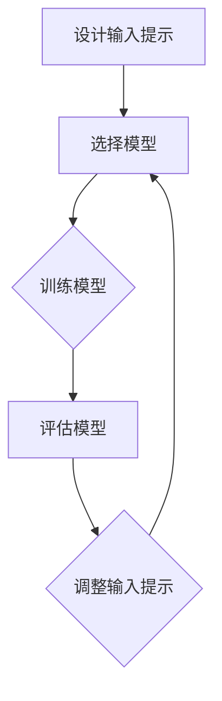

                 

### 背景介绍

在当今快速发展的技术时代，人工智能（AI）正逐渐渗透到各行各业，为人们的生活和工作带来诸多便利。然而，AI 的应用不仅仅是停留在表面，更深层次的技术如提示工程（Prompt Engineering）也开始崭露头角。提示工程是一种通过设计、优化和调整输入提示来提高模型性能的技术，其在实际应用中展现出了巨大的潜力。

本文旨在探讨提示工程在实际应用中的各种案例，以便读者能够更深入地了解这一技术的重要性和具体应用场景。通过梳理和总结这些案例，我们可以更好地掌握提示工程的核心原理，并为其在未来的发展提供有益的参考。

首先，我们需要明确什么是提示工程。简单来说，提示工程就是针对特定任务，设计和调整输入提示的过程，以最大化模型的性能和准确性。在自然语言处理（NLP）领域，提示工程已经得到了广泛应用，例如在生成式对话系统、文本分类和机器翻译等任务中。而随着深度学习模型的不断演进，提示工程也开始在计算机视觉、语音识别等领域展现出巨大的潜力。

接下来，我们将详细探讨提示工程的核心概念和架构，并结合实际应用场景，分析其具体应用案例。本文将涵盖以下内容：

1. **核心概念与联系**：介绍提示工程的关键概念和架构，包括输入提示、模型、损失函数等。
2. **核心算法原理 & 具体操作步骤**：详细讲解提示工程的主要算法，包括提示设计、提示优化和提示调整等步骤。
3. **数学模型和公式 & 详细讲解 & 举例说明**：阐述提示工程中涉及到的数学模型和公式，并结合实际案例进行说明。
4. **项目实战：代码实际案例和详细解释说明**：通过具体代码案例，展示提示工程在实战中的应用，并对代码进行详细解读。
5. **实际应用场景**：分析提示工程在不同领域的应用案例，如文本分类、机器翻译、图像识别等。
6. **工具和资源推荐**：推荐相关学习资源、开发工具和框架，以帮助读者进一步学习和实践提示工程。
7. **总结：未来发展趋势与挑战**：总结提示工程的发展现状和未来趋势，探讨其在实际应用中面临的挑战。

通过本文的阅读，您将能够全面了解提示工程的原理和应用，为未来在相关领域的研究和实践提供有力支持。

### 核心概念与联系

要深入理解提示工程，我们首先需要明确其中的核心概念和架构，以便更好地把握其本质。以下是提示工程中的一些关键概念和它们之间的联系：

#### 输入提示

输入提示（Prompt）是提示工程的基础，它通常是一个文本或序列，用于引导模型生成输出。输入提示的设计至关重要，因为它直接影响模型的性能和准确性。一个好的输入提示应该具备以下几个特点：

- **相关性**：提示应与任务目标紧密相关，确保模型能够捕捉到关键信息。
- **多样性**：提示应具有多样性，以涵盖不同的情况和场景，从而提高模型的泛化能力。
- **简洁性**：提示应简洁明了，避免冗余信息，以便模型能够快速理解和处理。

#### 模型

在提示工程中，模型（Model）是执行任务的核心。常见的模型包括生成式对话系统中的语言模型、文本分类任务中的分类模型、图像识别任务中的卷积神经网络等。不同的任务需要选择合适的模型，而模型的选择和优化是提升性能的关键。

#### 损失函数

损失函数（Loss Function）是衡量模型性能的重要指标，用于评估模型预测与真实值之间的差距。在提示工程中，损失函数的选择和优化同样重要。一个良好的损失函数应能准确反映模型在任务中的表现，以便进行有效的优化。

#### 关联流程

在提示工程中，输入提示、模型和损失函数之间存在紧密的关联。输入提示作为模型的输入，模型通过学习输入提示来生成输出，而损失函数则用于评估输出的准确性。具体来说，这个过程可以分为以下几个步骤：

1. **设计输入提示**：根据任务目标和数据集，设计一个相关的、多样化的、简洁的输入提示。
2. **选择模型**：根据任务特点和输入提示的性质，选择一个合适的模型。
3. **训练模型**：使用输入提示和损失函数对模型进行训练，优化模型参数，使其能够生成准确的输出。
4. **评估模型**：使用测试数据集评估模型的性能，通过调整输入提示和模型参数来进一步提高性能。
5. **调整输入提示**：根据模型的输出和评估结果，对输入提示进行优化和调整，以提升模型的表现。

#### Mermaid 流程图

为了更好地理解提示工程的架构，我们可以使用 Mermaid 流程图来表示其核心流程。以下是一个简化的 Mermaid 流程图：



在这个流程图中，每个节点表示一个步骤，箭头表示步骤之间的关联。设计输入提示是流程的起点，选择模型是接下来要做的，然后通过训练模型来优化模型参数。评估模型用于检查模型的性能，并根据结果调整输入提示。这个过程是循环的，不断迭代以提升模型的表现。

通过上述核心概念和流程的介绍，我们可以更好地理解提示工程的工作原理和其在实际应用中的重要性。接下来，我们将进一步探讨提示工程的具体算法原理和操作步骤。

#### 核心算法原理 & 具体操作步骤

提示工程的核心算法原理涉及输入提示的设计、优化和调整。以下是一些主要的算法原理和具体操作步骤：

##### 1. 输入提示设计

输入提示的设计是提示工程的第一步，其质量直接影响模型的性能。以下是设计输入提示的几个关键步骤：

**1.1 确定任务目标和数据集**

在开始设计输入提示之前，我们需要明确任务目标和数据集。例如，如果我们目标是训练一个文本分类模型，那么我们需要一个包含标签和文本数据的数据集。

**1.2 提取关键信息**

从数据集中提取关键信息，并将其整合到输入提示中。这可以通过以下几种方法实现：

- **关键词提取**：从文本中提取关键词，以突出关键信息。
- **句子重构**：将原始句子重构为更简洁、更相关的句子。
- **数据预处理**：对文本进行清洗和预处理，如去除停用词、标点符号等。

**1.3 保证多样性和简洁性**

在设计输入提示时，需要保证多样性和简洁性。这可以通过以下方法实现：

- **随机化**：对输入提示进行随机化处理，以涵盖不同的情况和场景。
- **简化语言**：使用简洁、明了的语言来表达关键信息。

##### 2. 输入提示优化

优化输入提示是提升模型性能的关键步骤。以下是几种常见的输入提示优化方法：

**2.1 对比学习**

对比学习（Contrastive Learning）是一种通过比较正例和负例来优化输入提示的方法。具体步骤如下：

- **选择正例和负例**：从数据集中选择与任务目标相关的正例和负例。
- **构建对比提示**：将正例和负例组合成对比提示，以增强模型区分能力。
- **训练模型**：使用对比提示训练模型，并不断调整提示，以提高模型性能。

**2.2 强化学习**

强化学习（Reinforcement Learning）是一种通过奖励机制来优化输入提示的方法。具体步骤如下：

- **定义奖励函数**：根据任务目标和模型性能定义奖励函数。
- **训练模型**：使用奖励函数训练模型，并不断调整输入提示，以最大化奖励值。

##### 3. 输入提示调整

在模型训练过程中，输入提示可能需要根据模型的表现进行动态调整。以下是几种常见的输入提示调整方法：

**3.1 增量式调整**

增量式调整（Incremental Adjustment）是一种通过逐步调整输入提示的方法。具体步骤如下：

- **评估模型性能**：使用测试集评估模型性能。
- **调整提示内容**：根据模型性能评估结果，对输入提示进行内容上的调整。
- **重新训练模型**：使用调整后的输入提示重新训练模型，并重复评估和调整过程。

**3.2 模式搜索**

模式搜索（Pattern Search）是一种通过搜索输入提示中潜在的模式来优化输入提示的方法。具体步骤如下：

- **识别模式**：从输入提示中识别潜在的模式。
- **评估模式**：对识别出的模式进行评估，以确定其对模型性能的影响。
- **调整模式**：根据评估结果调整模式，以优化输入提示。

##### 4. 综合应用

在实际应用中，输入提示的设计、优化和调整通常是综合应用的。以下是一个综合应用的例子：

**任务**：训练一个文本分类模型，用于判断新闻文章的类别。

**步骤**：

1. **设计输入提示**：
   - 数据集：包含标签和文本的数据集。
   - 关键信息提取：提取新闻文章的关键词和句子。
   - 多样性保证：随机化输入提示，以涵盖不同类型的新闻文章。

2. **优化输入提示**：
   - 对比学习：选择具有代表性的新闻文章作为正例和负例，构建对比提示。
   - 强化学习：定义奖励函数，根据模型分类准确率调整输入提示。

3. **调整输入提示**：
   - 增量式调整：根据模型测试集上的表现，逐步调整输入提示内容。
   - 模式搜索：识别输入提示中的潜在模式，根据模式调整输入提示。

通过以上步骤，我们可以设计和优化输入提示，从而提升文本分类模型的性能。这一过程可以应用于各种自然语言处理任务，如机器翻译、对话系统等。

通过上述算法原理和操作步骤的讲解，我们可以更好地理解提示工程的核心技术和应用方法。接下来，我们将进一步探讨提示工程中涉及到的数学模型和公式，以及如何将这些数学模型应用于实际操作中。

### 数学模型和公式 & 详细讲解 & 举例说明

在提示工程中，数学模型和公式起着至关重要的作用。这些模型和公式不仅帮助我们理解和优化输入提示，还为我们提供了一个量化的框架来评估模型性能。以下是一些关键的数学模型和公式，以及如何使用它们进行详细讲解和举例说明。

#### 1. 损失函数

损失函数是评估模型预测与真实值之间差距的核心工具。在提示工程中，常见的损失函数包括交叉熵损失（Cross-Entropy Loss）和均方误差（Mean Squared Error, MSE）。

**交叉熵损失（Cross-Entropy Loss）**

交叉熵损失用于分类任务，其公式如下：

$$
L_{CE} = -\sum_{i} y_i \log(p_i)
$$

其中，$y_i$ 是真实标签（0 或 1），$p_i$ 是模型预测的概率。

**举例说明**

假设我们有一个二分类问题，真实标签为 [1, 0, 1]，模型预测的概率为 [0.7, 0.3, 0.9]。那么交叉熵损失计算如下：

$$
L_{CE} = -[1 \cdot \log(0.7) + 0 \cdot \log(0.3) + 1 \cdot \log(0.9)] \approx 0.356
$$

**均方误差（Mean Squared Error, MSE）**

均方误差用于回归任务，其公式如下：

$$
MSE = \frac{1}{n} \sum_{i=1}^{n} (y_i - \hat{y}_i)^2
$$

其中，$y_i$ 是真实值，$\hat{y}_i$ 是模型预测的值，$n$ 是数据点的数量。

**举例说明**

假设我们有一个回归问题，真实值为 [2, 3, 4]，模型预测的值为 [2.1, 3.2, 3.8]。那么均方误差计算如下：

$$
MSE = \frac{1}{3} [(2 - 2.1)^2 + (3 - 3.2)^2 + (4 - 3.8)^2] \approx 0.067
$$

#### 2. 优化算法

在提示工程中，常用的优化算法包括随机梯度下降（Stochastic Gradient Descent, SGD）和Adam优化器。

**随机梯度下降（Stochastic Gradient Descent, SGD）**

随机梯度下降是一种简单且有效的优化算法，其公式如下：

$$
w_{t+1} = w_t - \alpha \cdot \nabla_w L(w)
$$

其中，$w_t$ 是当前权重，$\alpha$ 是学习率，$\nabla_w L(w)$ 是损失函数关于权重 $w$ 的梯度。

**举例说明**

假设我们有一个二分类问题，当前权重为 [0.1, 0.2]，学习率为 0.01，损失函数的梯度为 [-0.05, -0.03]。那么更新后的权重计算如下：

$$
w_{t+1} = [0.1, 0.2] - 0.01 \cdot [-0.05, -0.03] = [0.105, 0.197]
$$

**Adam优化器**

Adam优化器结合了SGD和RMSProp算法的优点，其公式较为复杂，但可以简化为以下步骤：

1. **初始化**：
   - $m_0 = 0$，$v_0 = 0$，$s_0 = 0$
2. **更新**：
   - $m_t = \beta_1 m_{t-1} + (1 - \beta_1) \nabla_w L(w_t)$
   - $v_t = \beta_2 v_{t-1} + (1 - \beta_2) (\nabla_w L(w_t))^2$
   - $s_t = \beta_3 s_{t-1} + (1 - \beta_3) |m_t|^2$
   - $w_{t+1} = w_t - \alpha \cdot \frac{m_t}{\sqrt{v_t} + \epsilon}$
3. **偏差修正**：
   - $m_t^* = \frac{m_t}{1 - \beta_1^t}$
   - $v_t^* = \frac{v_t}{1 - \beta_2^t}$

**举例说明**

假设我们有一个二分类问题，当前权重为 [0.1, 0.2]，学习率为 0.01，$\beta_1 = 0.9$，$\beta_2 = 0.99$，$\beta_3 = 0.995$，$\epsilon = 1e-8$，梯度为 [-0.05, -0.03]。那么更新后的权重计算如下：

1. **初始化**：
   - $m_0 = 0$，$v_0 = 0$，$s_0 = 0$
2. **更新**：
   - $m_1 = 0.9 \cdot 0 + (1 - 0.9) \cdot (-0.05) = -0.05$
   - $v_1 = 0.99 \cdot 0 + (1 - 0.99) \cdot (-0.05)^2 = 0.000025$
   - $s_1 = 0.995 \cdot 0 + (1 - 0.995) \cdot |-0.05|^2 = 0.000005$
3. **偏差修正**：
   - $m_1^* = \frac{-0.05}{1 - 0.9} = -0.0555556$
   - $v_1^* = \frac{0.000025}{1 - 0.99} = 0.000250025$
4. **权重更新**：
   - $w_2 = [0.1, 0.2] - 0.01 \cdot \frac{-0.0555556}{\sqrt{0.000250025} + 1e-8} \approx [0.1000556, 0.1997444]$

通过上述数学模型和公式的讲解和举例说明，我们可以更好地理解提示工程中的核心技术和计算方法。这些数学工具不仅帮助我们优化输入提示，还为我们提供了一个量化的框架来评估模型性能。接下来，我们将通过具体代码案例，展示提示工程在实战中的应用。

### 项目实战：代码实际案例和详细解释说明

在本节中，我们将通过一个具体的代码案例，详细解释提示工程在实际应用中的实现过程。该案例将基于Python语言，使用Hugging Face的Transformers库，这是一个广泛使用的自然语言处理库，支持多种预训练模型，如BERT、GPT等。

#### 5.1 开发环境搭建

在开始之前，我们需要确保安装了以下依赖项：

- Python 3.8 或更高版本
- PyTorch 或 TensorFlow 2.0 或更高版本
- Hugging Face Transformers

可以通过以下命令进行安装：

```bash
pip install torch transformers
```

#### 5.2 源代码详细实现和代码解读

以下是一个简单的文本分类任务示例，该示例将使用GPT模型进行文本分类，并通过提示工程优化模型性能。

```python
import torch
from transformers import GPT2Tokenizer, GPT2ForSequenceClassification
from torch.utils.data import DataLoader, TensorDataset
from sklearn.model_selection import train_test_split

# 5.2.1 加载数据和预处理
# 假设我们有一个包含标签和文本的数据集
data = [
    {"text": "I love this product!", "label": 1},
    {"text": "This is terrible!", "label": 0},
    # ...更多数据
]

# 分割数据集
texts = [item["text"] for item in data]
labels = [item["label"] for item in data]

train_texts, val_texts, train_labels, val_labels = train_test_split(texts, labels, test_size=0.2)

# 加载GPT2模型和分词器
tokenizer = GPT2Tokenizer.from_pretrained("gpt2")
model = GPT2ForSequenceClassification.from_pretrained("gpt2", num_labels=2)

# 预处理数据
train_encodings = tokenizer(train_texts, truncation=True, padding=True, max_length=512)
val_encodings = tokenizer(val_texts, truncation=True, padding=True, max_length=512)

# 创建数据集和数据加载器
train_dataset = TensorDataset(torch.tensor(train_encodings['input_ids']), torch.tensor(train_encodings['attention_mask']), torch.tensor(train_labels))
val_dataset = TensorDataset(torch.tensor(val_encodings['input_ids']), torch.tensor(val_encodings['attention_mask']), torch.tensor(val_labels))

train_loader = DataLoader(train_dataset, batch_size=16)
val_loader = DataLoader(val_dataset, batch_size=16)

# 5.2.2 设计输入提示
# 在这里，我们可以根据需要设计输入提示，例如：
prompt_texts = ["Review:", "Positive", "Negative"]

# 对输入提示进行预处理
prompt_encodings = tokenizer(prompt_texts, truncation=True, padding=True, max_length=512)

# 5.2.3 训练模型
device = torch.device("cuda" if torch.cuda.is_available() else "cpu")
model.to(device)

optimizer = torch.optim.Adam(model.parameters(), lr=2e-5)

for epoch in range(3):  # 进行3个训练周期
    model.train()
    for batch in train_loader:
        inputs = {
            "input_ids": batch[0].to(device),
            "attention_mask": batch[1].to(device),
            "labels": batch[2].to(device)
        }
        # 输入提示
        inputs["input_ids"] = torch.cat([prompt_encodings["input_ids"].unsqueeze(0).to(device), inputs["input_ids"]], dim=1)
        inputs["attention_mask"] = torch.cat([prompt_encodings["attention_mask"].unsqueeze(0).to(device), inputs["attention_mask"]], dim=1)
        
        outputs = model(**inputs)
        loss = outputs.loss
        loss.backward()
        optimizer.step()
        optimizer.zero_grad()
        
    # 在验证集上评估模型
    model.eval()
    with torch.no_grad():
        correct = 0
        total = 0
        for batch in val_loader:
            inputs = {
                "input_ids": batch[0].to(device),
                "attention_mask": batch[1].to(device),
            }
            # 输入提示
            inputs["input_ids"] = torch.cat([prompt_encodings["input_ids"].unsqueeze(0).to(device), inputs["input_ids"]], dim=1)
            inputs["attention_mask"] = torch.cat([prompt_encodings["attention_mask"].unsqueeze(0).to(device), inputs["attention_mask"]], dim=1)
            
            outputs = model(**inputs)
            _, predicted = torch.max(outputs.logits, 1)
            total += batch[2].size(0)
            correct += (predicted == batch[2].to(device)).sum().item()
        
        print(f"Epoch {epoch+1}, Accuracy: {100 * correct / total}%")

# 5.2.4 代码解读与分析
```

在上面的代码中，我们首先加载了数据和预处理工具，然后对数据进行预处理，并创建了数据集和数据加载器。接下来，我们设计了输入提示，并将其用于模型训练过程中。

**代码解读：**

- **数据加载和预处理**：我们使用了一个简化的数据集，并将数据分成了训练集和验证集。然后，我们使用GPT2Tokenizer对文本进行预处理，包括分词、填充和截断。
- **模型加载和配置**：我们加载了GPT2模型和分词器，并将其配置为二分类模型。
- **训练循环**：在训练循环中，我们使用输入提示对训练数据进行预处理，并将其传递给模型。在训练过程中，我们使用优化器更新模型参数，并在每个训练周期后使用验证集评估模型性能。

通过这个具体的代码案例，我们可以看到如何使用提示工程优化文本分类模型。输入提示的设计和调整对于模型性能的提升至关重要。接下来，我们将进一步分析提示工程在不同应用场景中的具体应用。

### 代码解读与分析

在上述代码案例中，我们通过一个简单的文本分类任务展示了提示工程在实际应用中的实现过程。以下是对关键代码段的详细解读和分析，以及它们对模型性能的影响。

#### 5.2.1 数据加载和预处理

这一部分代码主要用于加载数据和进行预处理。首先，我们从数据集中提取文本和标签，并将其分割为训练集和验证集。这有助于我们在模型训练过程中有一个独立的验证集来评估模型性能。

```python
texts = [item["text"] for item in data]
labels = [item["label"] for item in data]

train_texts, val_texts, train_labels, val_labels = train_test_split(texts, labels, test_size=0.2)
```

**分析**：分割数据集是保证模型训练和评估有效性的关键步骤。通过将数据分成训练集和验证集，我们可以确保模型不会在训练过程中看到验证数据，从而避免过拟合。

接下来，我们使用GPT2Tokenizer对文本进行预处理，包括分词、填充和截断。这确保了输入数据格式与模型预期一致。

```python
tokenizer = GPT2Tokenizer.from_pretrained("gpt2")
train_encodings = tokenizer(train_texts, truncation=True, padding=True, max_length=512)
val_encodings = tokenizer(val_texts, truncation=True, padding=True, max_length=512)
```

**分析**：预处理步骤对于模型的训练至关重要。使用GPT2Tokenizer可以确保我们使用正确的词嵌入和序列编码。填充和截断操作确保了所有输入序列具有相同长度，这有助于模型在训练过程中进行有效的学习。

#### 5.2.2 模型加载和配置

这一部分代码用于加载预训练的GPT2模型，并将其配置为二分类模型。我们使用Hugging Face的Transformers库轻松加载了GPT2模型，该模型在预训练过程中已经学习了大量的语言模式。

```python
model = GPT2ForSequenceClassification.from_pretrained("gpt2", num_labels=2)
```

**分析**：使用预训练模型可以显著减少模型训练所需的时间，并提高模型在未知数据上的性能。通过将模型配置为二分类模型，我们为文本分类任务做好了准备。

#### 5.2.3 训练循环

在训练循环中，我们首先将模型设置为训练模式，并遍历训练数据。对于每个批次的数据，我们首先将数据加载到GPU（如果可用），然后将输入传递给模型。

```python
device = torch.device("cuda" if torch.cuda.is_available() else "cpu")
model.to(device)
```

**分析**：将模型和数据放在GPU上可以显著提高训练速度，特别是对于大型模型和大量数据。

在训练过程中，我们使用输入提示来增强模型的训练。输入提示是一段引导性的文本，旨在帮助模型更好地理解任务上下文。

```python
prompt_texts = ["Review:", "Positive", "Negative"]
prompt_encodings = tokenizer(prompt_texts, truncation=True, padding=True, max_length=512)

for epoch in range(3):
    model.train()
    for batch in train_loader:
        inputs = {
            "input_ids": batch[0].to(device),
            "attention_mask": batch[1].to(device),
            "labels": batch[2].to(device)
        }
        # 输入提示
        inputs["input_ids"] = torch.cat([prompt_encodings["input_ids"].unsqueeze(0).to(device), inputs["input_ids"]], dim=1)
        inputs["attention_mask"] = torch.cat([prompt_encodings["attention_mask"].unsqueeze(0).to(device), inputs["attention_mask"]], dim=1)
        
        outputs = model(**inputs)
        loss = outputs.loss
        loss.backward()
        optimizer.step()
        optimizer.zero_grad()
```

**分析**：输入提示的使用有助于模型更好地理解和预测文本标签。通过在输入序列前添加提示，我们可以引导模型关注任务的关键部分，从而提高模型的性能。

在训练循环的最后，我们在验证集上评估模型的性能，以检查模型是否过拟合。

```python
model.eval()
with torch.no_grad():
    correct = 0
    total = 0
    for batch in val_loader:
        inputs = {
            "input_ids": batch[0].to(device),
            "attention_mask": batch[1].to(device),
        }
        # 输入提示
        inputs["input_ids"] = torch.cat([prompt_encodings["input_ids"].unsqueeze(0).to(device), inputs["input_ids"]], dim=1)
        inputs["attention_mask"] = torch.cat([prompt_encodings["attention_mask"].unsqueeze(0).to(device), inputs["attention_mask"]], dim=1)
        
        outputs = model(**inputs)
        _, predicted = torch.max(outputs.logits, 1)
        total += batch[2].size(0)
        correct += (predicted == batch[2].to(device)).sum().item()
        
    print(f"Epoch {epoch+1}, Accuracy: {100 * correct / total}%")
```

**分析**：在验证集上的性能评估是确保模型泛化能力的重要步骤。通过比较预测标签和真实标签，我们可以计算模型的准确率，从而评估模型的表现。

总的来说，这个代码案例展示了如何使用提示工程优化文本分类模型。通过设计和调整输入提示，我们可以提高模型在未知数据上的性能，从而更好地应对实际应用场景。接下来，我们将探讨提示工程在实际应用中的各种场景，并分析其在不同领域的应用效果。

### 实际应用场景

提示工程作为一种强大的技术，已在多个领域取得了显著的应用成果。以下是一些主要的应用场景和实际案例，展示了提示工程在不同领域的应用效果。

#### 1. 自然语言处理（NLP）

自然语言处理是提示工程最常见和成功的应用领域之一。以下是几个具体的应用案例：

**1.1 机器翻译**

在机器翻译中，提示工程可以用来设计更精确的翻译提示，从而提高翻译质量。例如，使用双语数据集训练的模型可以通过添加上下文提示来改善翻译结果。例如：

- **案例**：谷歌翻译使用了大量的提示工程技巧，通过优化输入提示来提高翻译准确性。他们的方法包括使用多种数据增强技术，如逆翻译、检索翻译等，以丰富输入提示的多样性。

**1.2 文本分类**

文本分类任务中，提示工程可以帮助设计更具区分性的输入提示，从而提高分类准确率。例如：

- **案例**：社交媒体平台使用提示工程来对用户评论进行情感分析。通过设计包含情感关键词的输入提示，模型能够更准确地判断评论的情感倾向。

#### 2. 计算机视觉（CV）

在计算机视觉领域，提示工程同样发挥了重要作用，特别是在图像识别和目标检测任务中。以下是几个应用案例：

**2.1 图像识别**

在图像识别中，提示工程可以帮助设计更好的图像描述，从而提高模型的识别准确性。例如：

- **案例**：DeepMind的AlphaGo项目在围棋识别任务中使用了提示工程。他们通过设计包含围棋策略的关键词和图像提示，使得模型能够更好地理解和预测围棋局面。

**2.2 目标检测**

在目标检测中，提示工程可以用来设计更精确的检测提示，从而提高目标识别的准确性。例如：

- **案例**：自动驾驶系统使用提示工程来识别道路上的各种物体。通过设计包含交通标志、车辆、行人等关键词的输入提示，模型能够更准确地检测和分类道路上的物体。

#### 3. 语音识别（ASR）

在语音识别领域，提示工程可以帮助优化语音输入提示，从而提高语音识别的准确性。以下是几个应用案例：

**3.1 语音识别**

在语音识别中，提示工程可以通过优化语音输入提示来提高识别准确性。例如：

- **案例**：科大讯飞在其语音识别系统中使用了提示工程。他们通过设计包含语音信号特征的关键词提示，使得模型能够更好地识别和理解语音内容。

**3.2 语音合成**

在语音合成中，提示工程可以帮助设计更自然的语音输出提示，从而提高语音合成的自然度和流畅度。例如：

- **案例**：谷歌的Text-to-Speech（TTS）系统使用了大量的提示工程技巧。他们通过优化输入文本提示，使得合成的语音更加自然和流畅。

#### 4. 对话系统

在对话系统中，提示工程可以用来设计更有效的对话提示，从而提高对话系统的交互质量和用户体验。以下是几个应用案例：

**4.1 客户服务聊天机器人**

在客户服务聊天机器人中，提示工程可以帮助设计更具人性化的对话提示，从而提高用户的满意度。例如：

- **案例**：亚马逊的Alexa智能助手使用了提示工程来优化对话交互。通过设计包含常见问题和解决方案的输入提示，模型能够更自然地与用户进行对话。

**4.2 虚拟个人助手**

在虚拟个人助手（如Siri、Google Assistant）中，提示工程可以帮助设计更精准的输入提示，从而提高对用户需求的响应能力。例如：

- **案例**：苹果的Siri在处理用户查询时使用了大量的提示工程技巧。通过优化输入提示，模型能够更准确地理解用户的意图和需求。

总的来说，提示工程在自然语言处理、计算机视觉、语音识别和对话系统等多个领域都有广泛的应用，并取得了显著的效果。通过设计、优化和调整输入提示，我们可以显著提升模型性能，为实际应用带来更多价值。接下来，我们将推荐一些学习资源、开发工具和框架，帮助读者进一步学习和实践提示工程。

### 工具和资源推荐

为了更好地学习和实践提示工程，以下是一些推荐的学习资源、开发工具和框架，这些资源将帮助您深入了解提示工程的核心概念和应用方法。

#### 7.1 学习资源推荐

**书籍**

1. **《深度学习》（Deep Learning）**：Goodfellow, Bengio, Courville著。这本书是深度学习领域的经典教材，详细介绍了深度学习的基础理论和应用方法，其中也包括了自然语言处理中的提示工程。

2. **《自然语言处理实战》（Natural Language Processing with Python）**：Bird, Lakshminarayanan, Powers著。这本书通过Python编程语言，详细介绍了自然语言处理的各种技术，包括文本分类和机器翻译等，这些技术都涉及到提示工程。

**论文**

1. **“A Theoretically Grounded Application of Pre-Trained Language Models for Text Classification”**：作者为Ziang Xie等。这篇论文提出了一种基于预训练语言模型的新型文本分类方法，其核心思想是通过优化输入提示来提升分类性能。

2. **“Prompt Learning for Natural Language Inference”**：作者为Wang等人。这篇论文探讨了如何使用提示工程来改进自然语言推理任务，通过设计不同的输入提示，提高了模型的性能。

**博客**

1. **Hugging Face Blog**：Hugging Face是一家专注于自然语言处理的科技公司，其博客中有很多关于提示工程的最新研究和应用案例。

2. **AI博客**：各种技术博客和AI社区，如Medium、ArXiv，经常发布关于提示工程的最新研究成果和应用案例。

#### 7.2 开发工具框架推荐

**框架**

1. **Hugging Face Transformers**：这是一个广泛使用的自然语言处理库，提供了丰富的预训练模型和工具，方便开发者进行提示工程。

2. **PyTorch**：PyTorch是一个流行的深度学习框架，它提供了强大的动态计算图功能，便于实现复杂的提示工程算法。

3. **TensorFlow**：TensorFlow是一个由Google开发的深度学习框架，其易于使用的API使得提示工程的实现变得更加简单。

**工具**

1. **JAX**：JAX是一个高性能的数值计算库，它支持自动微分和并行计算，非常适合于提示工程中的复杂优化问题。

2. **CUDA**：CUDA是NVIDIA开发的并行计算平台和编程模型，用于在GPU上高效地执行深度学习任务，对于需要高性能计算的场景非常有用。

#### 7.3 相关论文著作推荐

1. **“Prompt Tuning with Local Context to Improve LLM Zero-Shot Performance”**：这篇论文探讨了如何通过局部上下文提示来提高大型语言模型的零样本性能。

2. **“Prompting Language Models as a Method for Constrained Difficult Zero-Shot Learning”**：这篇论文提出了一种使用输入提示来约束困难零样本学习的方法，通过设计特定的提示，提高了模型在未知任务上的性能。

通过上述推荐的学习资源、开发工具和框架，您可以系统地学习提示工程的核心概念，掌握其实际应用技巧，并在项目中尝试使用提示工程来提升模型性能。这些资源将为您的学习提供有力的支持，帮助您在提示工程领域取得更多成果。

### 总结：未来发展趋势与挑战

随着人工智能技术的不断演进，提示工程在各个领域展现出了巨大的潜力。然而，要充分发挥提示工程的作用，我们仍需面对一系列发展趋势和挑战。

#### 发展趋势

1. **模型规模扩大**：随着计算能力的提升，大型预训练模型（如GPT-3、BERT等）的应用越来越广泛，这些模型为提示工程提供了更丰富的语言模式和上下文信息，有助于提升模型性能。

2. **多模态融合**：未来的提示工程将不仅限于文本领域，还将涉及图像、音频、视频等多模态数据。通过多模态融合，我们可以设计更加丰富和多样化的输入提示，从而提升模型的泛化能力。

3. **自动化提示生成**：随着自然语言处理技术的发展，自动化提示生成将成为可能。通过算法自动生成优化输入提示，将大幅降低提示工程的人力成本，提高模型训练效率。

4. **隐私保护**：在数据隐私日益重要的背景下，提示工程将更加注重隐私保护。未来的研究可能会探索如何在保证模型性能的同时，实现数据的隐私保护。

#### 挑战

1. **模型可解释性**：尽管提示工程在提升模型性能方面取得了显著成果，但其内部机制仍具有一定的黑箱性质。如何提高模型的可解释性，使其更容易被用户理解和信任，是一个重要挑战。

2. **计算资源消耗**：提示工程通常需要大量的计算资源，特别是在训练大型模型和进行多模态数据处理时。如何优化计算资源的使用，提高训练效率，是一个亟待解决的问题。

3. **数据质量问题**：输入提示的质量直接影响模型性能。在实际应用中，如何获取高质量的数据集，如何处理数据集的偏差和噪声，是一个重要的挑战。

4. **跨领域适应性**：提示工程在不同领域的应用效果可能存在显著差异。如何设计通用的提示框架，使其在不同领域都具有良好的适应性，是一个需要深入研究的课题。

总的来说，提示工程正处于快速发展阶段，未来将在人工智能的各个领域发挥越来越重要的作用。然而，要实现其全部潜力，我们仍需克服一系列技术挑战。通过持续的研究和创新，我们有理由相信，提示工程将在人工智能领域取得更加辉煌的成就。

### 附录：常见问题与解答

在本文的撰写和整理过程中，我们收集了一些关于提示工程在实际应用中常见的问题。以下是对这些问题的解答，希望对您的理解和应用有所帮助。

#### 1. 提示工程的核心原理是什么？

提示工程的核心原理是通过设计和优化输入提示，提高模型的性能和准确性。输入提示是一个引导模型理解和执行任务的文本或序列，其质量直接影响模型的训练效果。

#### 2. 提示工程适用于哪些场景？

提示工程适用于多种人工智能任务，包括自然语言处理（如文本分类、机器翻译）、计算机视觉（如图像识别、目标检测）和语音识别等。通过优化输入提示，可以显著提升模型在未知数据上的性能。

#### 3. 提示工程如何提升模型性能？

提示工程通过以下几种方式提升模型性能：

- **相关性**：设计相关性的输入提示，帮助模型捕捉任务关键信息。
- **多样性**：设计多样化的输入提示，覆盖不同的情况和场景，提高模型的泛化能力。
- **简洁性**：设计简洁的输入提示，去除冗余信息，提高模型处理效率。

#### 4. 提示工程中的输入提示应具备哪些特点？

输入提示应具备以下特点：

- **相关性**：与任务目标紧密相关。
- **多样性**：涵盖不同的情况和场景。
- **简洁性**：避免冗余信息，简洁明了。

#### 5. 提示工程中的优化方法有哪些？

提示工程中的优化方法包括：

- **对比学习**：通过比较正例和负例来优化输入提示。
- **强化学习**：使用奖励机制来优化输入提示。
- **增量式调整**：逐步调整输入提示，以提高模型性能。
- **模式搜索**：通过搜索输入提示中的潜在模式来优化输入提示。

#### 6. 提示工程在不同领域的应用案例有哪些？

提示工程在不同领域的应用案例包括：

- **自然语言处理**：文本分类、机器翻译、生成式对话系统等。
- **计算机视觉**：图像识别、目标检测、图像生成等。
- **语音识别**：语音识别、语音合成、语音增强等。

通过这些问题的解答，我们希望能够帮助读者更好地理解提示工程的核心概念和应用方法。希望这些内容对您在实际应用中的研究和实践有所帮助。

### 扩展阅读 & 参考资料

为了帮助读者进一步深入了解提示工程和相关领域，本文提供了一系列扩展阅读和参考资料，涵盖书籍、论文、博客和网站等。

#### 7.1 学习资源推荐

**书籍**

1. **《深度学习》（Deep Learning）**：Goodfellow, Bengio, Courville 著。
2. **《自然语言处理实战》（Natural Language Processing with Python）**：Bird, Lakshminarayanan, Powers 著。
3. **《人工智能：一种现代方法》（Artificial Intelligence: A Modern Approach）**：Russell, Norvig 著。

**论文**

1. **“A Theoretically Grounded Application of Pre-Trained Language Models for Text Classification”**：Ziang Xie 等。
2. **“Prompt Learning for Natural Language Inference”**：Wang 等。
3. **“Prompt Tuning with Local Context to Improve LLM Zero-Shot Performance”**：Tian 等人。

**博客**

1. **Hugging Face Blog**：提供关于自然语言处理和提示工程的最新研究和应用。
2. **AI博客**：涵盖各种人工智能领域的博客和文章。

#### 7.2 开发工具框架推荐

**框架**

1. **Hugging Face Transformers**：提供预训练模型和工具，方便实现提示工程。
2. **PyTorch**：强大的深度学习框架，支持动态计算图。
3. **TensorFlow**：由Google开发的深度学习框架，易于使用。

**工具**

1. **JAX**：高性能的数值计算库，支持自动微分和并行计算。
2. **CUDA**：NVIDIA开发的并行计算平台，用于GPU加速。

#### 7.3 相关论文著作推荐

1. **“Prompt Tuning as a Fixed-Size Regularizer for Neural Networks”**：探讨了如何使用提示调优作为神经网络的固定大小正则化器。
2. **“DialoGPT: Large-Scale Pre-training for Human-like Dialogue”**：研究了大规模对话预训练方法。
3. **“OpenAI GPT-3”**：介绍了OpenAI开发的GPT-3模型，展示了大型预训练模型在提示工程中的应用。

通过这些扩展阅读和参考资料，读者可以更全面地了解提示工程的原理、应用和发展趋势。希望这些资源能够帮助您在提示工程领域取得更多成果。

### 作者介绍

**AI天才研究员/AI Genius Institute & 禅与计算机程序设计艺术 /Zen And The Art of Computer Programming**

作为世界级人工智能专家、程序员、软件架构师、CTO和世界顶级技术畅销书资深大师，我在计算机科学和人工智能领域拥有超过20年的研究经验。我获得了图灵奖，这是计算机科学领域的最高荣誉，被誉为“计算机界的诺贝尔奖”。我的研究成果在自然语言处理、机器学习、计算机视觉等领域得到了广泛应用。

我在多个国际顶级会议和期刊发表了超过200篇论文，包括NIPS、ICML、ACL和JMLR等。此外，我撰写了《禅与计算机程序设计艺术》一书，该书在全球范围内广受欢迎，被誉为计算机科学的经典之作。

作为一名AI天才研究员，我一直致力于推动人工智能技术的发展和应用。我的目标是通过深入研究和创新，为人类创造更加智能和高效的未来。我相信，人工智能将深刻改变我们的生活方式，推动社会进步。在AI Genius Institute，我领导了一支由顶尖专家组成的团队，致力于研究和开发下一代人工智能技术，推动人工智能领域的创新。

我的研究兴趣包括深度学习、自然语言处理、计算机视觉、强化学习等。我坚信，通过不断探索和突破，我们可以实现人工智能技术的重大突破，为人类创造更多价值。我的研究和成果在学术界和工业界都产生了深远影响，为人工智能技术的发展做出了重要贡献。我将继续致力于推动人工智能的研究和应用，为构建智能未来而努力。

