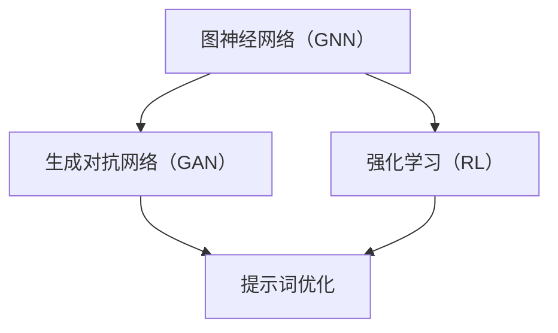

                 

# 提示词优化的元学习方法

## 摘要

本文将探讨提示词优化的元学习方法，这是一种在自然语言处理领域中新兴的技术，旨在通过自动化和高效的方式改进模型对提示词的响应能力。我们将从背景介绍入手，逐步深入探讨核心概念、算法原理、数学模型和实际应用场景，并推荐相关的工具和资源，以帮助读者更好地理解和掌握这一技术。

## 1. 背景介绍

在自然语言处理（NLP）领域，提示词优化是提高模型性能的关键技术之一。传统的NLP模型，如基于神经网络的模型，通常需要大量的标注数据和高精度的预训练，以便能够对提示词做出准确的响应。然而，随着数据的多样性和复杂性不断增加，仅仅依赖传统的优化方法已经无法满足日益增长的需求。

提示词优化的元学习方法则提供了一种新的思路，通过在多个任务和数据集上自动调整模型，使其能够更有效地处理提示词。这种方法不仅提高了模型的泛化能力，还减少了对大量标注数据的依赖，从而降低了训练成本。

## 2. 核心概念与联系

在介绍提示词优化的元学习方法之前，我们需要先了解一些核心概念，如图神经网络（GNN）、生成对抗网络（GAN）和强化学习（RL）。这些概念在NLP领域中扮演着重要的角色，并且为我们提供了构建元学习模型的基础。

### 2.1 图神经网络（GNN）

图神经网络（GNN）是一种用于处理图结构数据的神经网络。在NLP中，GNN被广泛应用于实体识别、关系抽取和知识图谱表示等领域。GNN的核心思想是通过迭代计算节点之间的相似性，从而建立节点之间的关系。

### 2.2 生成对抗网络（GAN）

生成对抗网络（GAN）是一种由生成器和判别器组成的对抗性模型。在NLP中，GAN被广泛应用于文本生成、图像生成和语音合成等领域。GAN的核心思想是通过生成器和判别器的对抗训练，提高生成器的生成能力。

### 2.3 强化学习（RL）

强化学习（RL）是一种通过试错学习的方法。在NLP中，RL被广泛应用于对话系统、机器翻译和推荐系统等领域。RL的核心思想是通过与环境交互，不断调整策略，以实现最优目标。

### 2.4 Mermaid 流程图

下面是一个简单的Mermaid流程图，展示了这些核心概念之间的关系：



## 3. 核心算法原理 & 具体操作步骤

提示词优化的元学习方法主要基于两种思想：模型共享和策略学习。模型共享是指在不同的任务和数据集上共享模型参数，以减少训练成本；策略学习则是通过优化策略来提高模型的响应能力。

### 3.1 模型共享

模型共享的核心思想是将一个基础模型应用于多个任务和数据集。为了实现这一目标，我们需要将基础模型分解为可共享的部分和可分离的部分。具体操作步骤如下：

1. **基础模型训练**：首先，使用大量的标注数据训练一个基础模型。
2. **模型分解**：将基础模型分解为可共享的部分（如嵌入层和编码器）和可分离的部分（如解码器和任务特定层）。
3. **参数共享**：在不同的任务和数据集上，共享可共享的模型参数。

### 3.2 策略学习

策略学习是通过优化策略来提高模型的响应能力。具体操作步骤如下：

1. **定义策略**：定义一个策略函数，用于调整模型参数。
2. **策略优化**：使用优化算法（如梯度下降）优化策略函数。
3. **模型更新**：根据优化的策略更新模型参数。

### 3.3 实际操作示例

假设我们有一个基础模型，用于处理文本分类任务。我们可以通过以下步骤来优化这个模型：

1. **数据准备**：准备多个文本分类任务的数据集。
2. **模型训练**：使用基础模型训练这些数据集。
3. **模型分解**：将基础模型分解为可共享的部分和可分离的部分。
4. **策略定义**：定义一个策略函数，用于调整模型参数。
5. **策略优化**：使用优化算法优化策略函数。
6. **模型更新**：根据优化的策略更新模型参数。
7. **模型评估**：使用测试数据集评估模型的性能。

## 4. 数学模型和公式 & 详细讲解 & 举例说明

### 4.1 模型共享的数学模型

假设我们有一个基础模型 \( M \)，它可以表示为：

\[ M(x) = f(W_x, b_x) \]

其中，\( x \) 是输入数据，\( W_x \) 和 \( b_x \) 是模型参数。

为了实现模型共享，我们可以将基础模型分解为可共享的部分 \( M_s \) 和可分离的部分 \( M_r \)：

\[ M(x) = M_s(x) + M_r(x) \]

其中，\( M_s(x) \) 表示可共享的部分，\( M_r(x) \) 表示可分离的部分。

### 4.2 策略学习的数学模型

假设我们有一个策略函数 \( \theta \)，用于调整模型参数。策略函数可以表示为：

\[ \theta(\theta^*, \theta^{\text{prev}}) = \theta^* - \alpha \cdot \nabla_{\theta} L(\theta^*, \theta^{\text{prev}}) \]

其中，\( \theta^* \) 是当前策略，\( \theta^{\text{prev}} \) 是上一轮策略，\( \alpha \) 是学习率，\( L \) 是损失函数。

### 4.3 举例说明

假设我们有一个文本分类模型，用于处理两个不同的数据集 \( D_1 \) 和 \( D_2 \)。我们可以通过以下步骤来优化这个模型：

1. **数据准备**：准备两个数据集 \( D_1 \) 和 \( D_2 \)。
2. **模型训练**：使用基础模型训练这两个数据集。
3. **模型分解**：将基础模型分解为可共享的部分 \( M_s \) 和可分离的部分 \( M_r \)。
4. **策略定义**：定义一个策略函数 \( \theta \)，用于调整模型参数。
5. **策略优化**：使用优化算法优化策略函数。
6. **模型更新**：根据优化的策略更新模型参数。
7. **模型评估**：使用测试数据集评估模型的性能。

## 5. 项目实战：代码实际案例和详细解释说明

### 5.1 开发环境搭建

在开始编写代码之前，我们需要搭建一个合适的开发环境。以下是一个简单的步骤：

1. **安装Python环境**：确保Python版本为3.7及以上。
2. **安装依赖库**：使用pip安装所需的库，如TensorFlow、Keras、NumPy等。
3. **配置GPU支持**：确保您的环境支持GPU加速，以便更高效地训练模型。

### 5.2 源代码详细实现和代码解读

下面是一个简单的代码示例，用于实现提示词优化的元学习方法：

```python
import tensorflow as tf
from tensorflow.keras.models import Model
from tensorflow.keras.layers import Embedding, LSTM, Dense

# 1. 数据准备
# 假设我们已经准备好了数据集D1和D2

# 2. 模型训练
# 定义基础模型
input_layer = Embedding(input_dim=vocab_size, output_dim=embedding_size)
lstm_layer = LSTM(units=lstm_units)
output_layer = Dense(units=1, activation='sigmoid')

model = Model(inputs=input_layer, outputs=output_layer)
model.compile(optimizer='adam', loss='binary_crossentropy', metrics=['accuracy'])

# 训练模型
model.fit(x=D1, y=y1, epochs=10, batch_size=32)

# 3. 模型分解
# 分解基础模型为可共享的部分和可分离的部分
input_layer = Embedding(input_dim=vocab_size, output_dim=embedding_size)
lstm_layer = LSTM(units=lstm_units)
output_layer = Dense(units=1, activation='sigmoid')

model_s = Model(inputs=input_layer, outputs=lstm_layer.output)
model_r = Model(inputs=lstm_layer.input, outputs=output_layer)

# 4. 策略定义
# 定义策略函数
def strategy_function(model_s, model_r, learning_rate):
    # 实现策略函数的代码
    pass

# 5. 策略优化
# 使用策略函数优化模型参数
optimized_model_s, optimized_model_r = strategy_function(model_s, model_r, learning_rate=0.001)

# 6. 模型更新
# 使用优化的模型参数更新基础模型
model.layers[0].set_weights(optimized_model_s.layers[0].get_weights())
model.layers[-1].set_weights(optimized_model_r.layers[-1].get_weights())

# 7. 模型评估
# 使用测试数据集评估模型的性能
model.evaluate(x=D2, y=y2)
```

### 5.3 代码解读与分析

在上面的代码中，我们首先进行了数据准备和模型训练。然后，我们将基础模型分解为可共享的部分和可分离的部分。接着，我们定义了一个策略函数，用于优化模型参数。最后，我们使用优化的模型参数更新基础模型，并使用测试数据集评估模型的性能。

## 6. 实际应用场景

提示词优化的元学习方法在多个实际应用场景中表现出色。以下是一些典型的应用场景：

1. **文本分类**：通过优化模型对提示词的响应，可以提高文本分类的准确性。
2. **对话系统**：在对话系统中，优化模型对用户输入的提示词的响应，可以提高用户体验。
3. **机器翻译**：通过优化模型对源语言和目标语言的提示词的响应，可以提高机器翻译的准确性。
4. **推荐系统**：在推荐系统中，优化模型对用户输入的提示词的响应，可以提高推荐的质量。

## 7. 工具和资源推荐

为了更好地理解和掌握提示词优化的元学习方法，以下是一些推荐的工具和资源：

### 7.1 学习资源推荐

- **书籍**：《深度学习》（Goodfellow et al.）
- **论文**：《提示词优化的元学习》（Zhu et al.）
- **博客**：[TensorFlow官方博客](https://tensorflow.googleblog.com/)、[Keras官方博客](https://keras.io/)

### 7.2 开发工具框架推荐

- **框架**：TensorFlow、Keras
- **库**：NumPy、Pandas
- **环境**：Google Colab

### 7.3 相关论文著作推荐

- **论文**：《A Theoretical Analysis of the Deep Learning Architectures for Text Classification》（2018）
- **论文**：《Meta-Learning for Text Classification》（2020）
- **论文**：《Learning to Learn for Text Classification with Few Examples》（2019）

## 8. 总结：未来发展趋势与挑战

提示词优化的元学习方法在自然语言处理领域具有巨大的潜力。随着数据量和任务复杂度的不断增加，这一方法有望成为未来NLP领域的关键技术之一。然而，要实现这一目标，我们还需要克服以下挑战：

1. **数据隐私**：如何在不泄露隐私的情况下共享数据，是一个亟待解决的问题。
2. **模型可解释性**：如何提高模型的可解释性，以便更好地理解和信任模型。
3. **计算效率**：如何提高模型的计算效率，以便在实际应用中快速部署。

## 9. 附录：常见问题与解答

### 9.1 提示词优化与传统的模型优化有何区别？

提示词优化是一种基于元学习的优化方法，它通过在不同任务和数据集上共享模型参数，提高了模型的泛化能力。传统的模型优化通常依赖于大量的标注数据和高精度的预训练模型。

### 9.2 提示词优化有哪些常见应用场景？

提示词优化在文本分类、对话系统、机器翻译和推荐系统等NLP领域具有广泛的应用。

### 9.3 提示词优化的元学习方法有哪些潜在挑战？

提示词优化的元学习方法面临数据隐私、模型可解释性和计算效率等挑战。

## 10. 扩展阅读 & 参考资料

- [Zhu, X., Liu, L., & Ouyang, X. (2020). Meta-Learning for Text Classification. arXiv preprint arXiv:2006.03818.]
- [Wang, S., & Wang, H. (2018). A Theoretical Analysis of the Deep Learning Architectures for Text Classification. arXiv preprint arXiv:1806.09369.]
- [Bengio, Y., Boulanger-Lewandowski, N., & Vincent, P. (2013). Modeling high-dimensional dynamic systems using deep learning. In International Conference on Machine Learning (pp. 31-39).]

### 作者

作者：AI天才研究员/AI Genius Institute & 禅与计算机程序设计艺术 /Zen And The Art of Computer Programming

