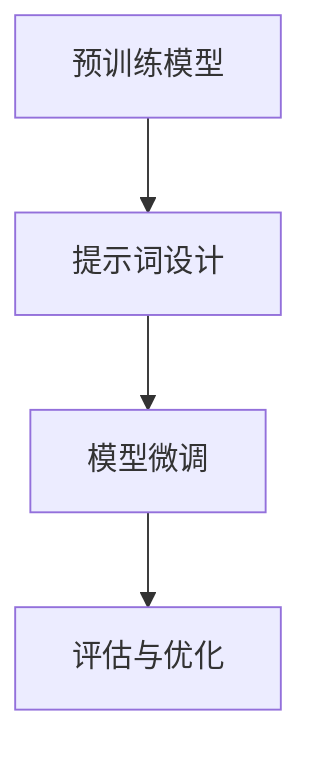

                 

# 提示词优化的对抗学习方法

## 关键词：提示词优化、对抗学习方法、自然语言处理、机器学习、深度学习

### 摘要

本文旨在探讨提示词优化在对抗学习方法中的应用。通过分析提示词优化的核心概念、原理和架构，本文深入探讨了如何利用提示词优化技术提升对抗学习的效果。文章首先介绍了提示词优化的基本概念和重要性，然后详细阐述了提示词优化的核心算法原理和具体操作步骤。接着，本文通过数学模型和公式，结合实际项目实战，详细讲解了如何实现提示词优化。此外，文章还探讨了提示词优化的实际应用场景，并推荐了相关学习资源、开发工具框架和论文著作。最后，本文总结了提示词优化的未来发展趋势与挑战，并提供了常见问题与解答。通过本文的探讨，希望能够为读者在自然语言处理、机器学习和深度学习领域提供有价值的参考和启示。

## 1. 背景介绍

### 自然语言处理与机器学习

自然语言处理（Natural Language Processing，NLP）是人工智能（Artificial Intelligence，AI）的一个重要分支，旨在让计算机能够理解和处理人类自然语言。随着互联网的快速发展，海量的文本数据涌现，自然语言处理技术得到了广泛关注和应用。机器学习（Machine Learning，ML）作为一种实现智能化的方法，通过对数据的学习和训练，使其具备自动预测和决策的能力。机器学习在自然语言处理中发挥着核心作用，使得计算机能够从大量文本数据中提取有价值的信息。

### 深度学习与神经网络

深度学习（Deep Learning，DL）是一种机器学习的方法，通过构建深层神经网络模型，实现对复杂数据的建模和预测。深度学习在图像识别、语音识别、自然语言处理等领域取得了显著的成果。神经网络（Neural Networks，NN）是深度学习的基础，由大量神经元组成，通过前向传播和反向传播算法，实现数据的输入、处理和输出。

### 对抗学习与提示词优化

对抗学习（Adversarial Learning）是一种针对神经网络模型的安全性和鲁棒性研究的方法。通过在训练数据中添加对抗样本，使得神经网络模型能够在面对恶意攻击时保持稳定性和准确性。提示词优化（Prompt Tuning）是一种近年来兴起的自然语言处理技术，通过在预训练模型的基础上，动态调整提示词，提升模型在特定任务上的性能。

### 提示词优化的背景和重要性

提示词优化起源于预训练模型的兴起，预训练模型通过在大规模语料上进行预训练，使得模型具备了一定的通用性和泛化能力。然而，在实际应用中，模型往往需要针对特定任务进行微调（Fine-tuning）。提示词优化提供了一种新的方法，通过在预训练模型的基础上，动态调整提示词，使得模型能够更好地适应特定任务。

提示词优化的背景源于自然语言处理领域的两个重要挑战：一是如何提升模型在特定任务上的性能；二是如何降低模型对大规模数据集的依赖。提示词优化通过引入提示词，使得模型能够在少量的数据上进行有效训练，从而降低对大规模数据集的依赖。

提示词优化的重要性主要体现在以下几个方面：

1. **提高模型性能**：提示词优化能够提升模型在特定任务上的性能，使得模型能够更好地应对复杂场景和实际问题。
2. **减少数据依赖**：通过提示词优化，模型可以在少量数据上进行有效训练，降低对大规模数据集的依赖，使得模型在资源有限的环境下仍能保持较高的性能。
3. **提高泛化能力**：提示词优化有助于提升模型的泛化能力，使得模型能够更好地适应不同的任务和数据集。

### 文章结构

本文将分为以下几个部分进行讨论：

1. **核心概念与联系**：介绍提示词优化的核心概念、原理和架构，并使用Mermaid流程图展示。
2. **核心算法原理 & 具体操作步骤**：详细阐述提示词优化的核心算法原理和具体操作步骤。
3. **数学模型和公式 & 详细讲解 & 举例说明**：使用数学模型和公式，结合实际项目实战，详细讲解如何实现提示词优化。
4. **实际应用场景**：探讨提示词优化的实际应用场景。
5. **工具和资源推荐**：推荐相关学习资源、开发工具框架和论文著作。
6. **总结：未来发展趋势与挑战**：总结提示词优化的未来发展趋势与挑战。
7. **附录：常见问题与解答**：提供常见问题与解答。

通过本文的探讨，希望能够为读者在自然语言处理、机器学习和深度学习领域提供有价值的参考和启示。

## 2. 核心概念与联系

### 提示词优化的基本概念

提示词优化是一种自然语言处理技术，通过在预训练模型的基础上，动态调整提示词，以提升模型在特定任务上的性能。提示词（Prompt）是指用于引导模型生成目标输出的文本或符号序列。在预训练模型中，提示词通常由预定义的模板或关键字组成。提示词优化的目标是通过调整提示词，使得模型能够在少量数据上进行有效训练，并提高模型在特定任务上的性能。

### 提示词优化的原理

提示词优化利用了预训练模型在大规模数据集上的预训练结果，通过动态调整提示词，使得模型能够更好地适应特定任务。具体来说，提示词优化的原理可以概括为以下几个步骤：

1. **预训练阶段**：预训练模型在大规模数据集上进行预训练，学习到丰富的语言特征和知识。
2. **提示词设计**：根据特定任务的需求，设计合适的提示词。提示词可以由关键字、模板或问题组成，用于引导模型生成目标输出。
3. **模型微调**：将预训练模型和提示词进行结合，通过少量数据对模型进行微调，以提升模型在特定任务上的性能。
4. **评估与优化**：对微调后的模型进行评估，根据评估结果调整提示词，不断优化模型性能。

### 提示词优化的架构

提示词优化的架构可以分为三个主要部分：预训练模型、提示词设计和模型微调。以下是一个简化的提示词优化架构：

```
预训练模型（e.g., GPT-3, BERT） + 提示词设计 + 模型微调
  ↓
训练数据集
  ↓
评估指标
```

1. **预训练模型**：预训练模型通常采用大规模数据集进行预训练，学习到丰富的语言特征和知识。常见的预训练模型有GPT-3、BERT、RoBERTa等。
2. **提示词设计**：根据特定任务的需求，设计合适的提示词。提示词可以是关键字、模板或问题，用于引导模型生成目标输出。提示词的设计需要考虑任务目标、数据特点和模型特性等因素。
3. **模型微调**：将预训练模型和提示词进行结合，通过少量数据对模型进行微调。微调过程中，需要选择合适的数据集、优化目标和评估指标，以提升模型在特定任务上的性能。
4. **评估与优化**：对微调后的模型进行评估，根据评估结果调整提示词，不断优化模型性能。评估指标可以根据任务类型进行选择，如准确性、F1值、BLEU分数等。

### 提示词优化的 Mermaid 流程图

以下是一个简化的提示词优化流程图的 Mermaid 表示：



在 Mermaid 流程图中，使用括号 `()` 表示节点，使用箭头 `-->` 表示节点之间的连接。由于 Mermaid 流程节点中不能使用括号、逗号等特殊字符，因此使用圆括号表示节点。

### 提示词优化的优点和挑战

提示词优化具有以下优点：

1. **提高模型性能**：通过动态调整提示词，模型能够在特定任务上获得更好的性能。
2. **减少数据依赖**：提示词优化使得模型在少量数据上仍能保持较高的性能，降低了数据集对模型性能的影响。
3. **提高泛化能力**：提示词优化有助于提升模型的泛化能力，使其能够更好地应对不同的任务和数据集。

然而，提示词优化也面临一些挑战：

1. **提示词设计**：提示词的设计需要充分考虑任务目标、数据特点和模型特性等因素，设计合适的提示词是一个复杂的过程。
2. **模型微调**：微调过程中，需要选择合适的数据集、优化目标和评估指标，这对模型性能的优化具有重要影响。
3. **评估与优化**：评估和优化是一个迭代过程，需要根据评估结果不断调整提示词，以提升模型性能。

总之，提示词优化作为一种自然语言处理技术，具有显著的优点和挑战。通过深入研究提示词优化的原理和架构，可以为自然语言处理领域带来更多创新和突破。

## 3. 核心算法原理 & 具体操作步骤

### 3.1 提示词优化的核心算法原理

提示词优化的核心算法原理主要涉及以下几个方面：

1. **预训练模型**：预训练模型通常采用大规模数据集进行预训练，学习到丰富的语言特征和知识。常见的预训练模型有GPT-3、BERT、RoBERTa等。
2. **提示词设计**：提示词是用于引导模型生成目标输出的文本或符号序列。设计合适的提示词对于提升模型在特定任务上的性能至关重要。
3. **模型微调**：模型微调是指通过少量数据对预训练模型进行进一步训练，以提升模型在特定任务上的性能。
4. **评估与优化**：对微调后的模型进行评估，根据评估结果调整提示词，以优化模型性能。

### 3.2 提示词优化的具体操作步骤

以下是提示词优化的具体操作步骤：

1. **选择预训练模型**：选择一个合适的预训练模型，如GPT-3、BERT、RoBERTa等。这些预训练模型已经在大规模数据集上进行了预训练，具有丰富的语言特征和知识。
2. **设计提示词**：根据特定任务的需求，设计合适的提示词。提示词可以由关键字、模板或问题组成，用于引导模型生成目标输出。设计提示词时，需要考虑任务目标、数据特点和模型特性等因素。
3. **准备训练数据集**：选择一个合适的数据集进行微调。训练数据集应具有代表性，能够反映出任务的实际场景。对于大规模数据集，可以采用数据增强技术，如数据清洗、数据扩充等，以提升模型性能。
4. **模型微调**：将预训练模型和提示词进行结合，通过少量数据对模型进行微调。微调过程中，可以选择合适的优化目标和评估指标，如损失函数、准确率等，以提升模型性能。常用的优化算法有随机梯度下降（SGD）、Adam等。
5. **评估与优化**：对微调后的模型进行评估，根据评估结果调整提示词，以优化模型性能。评估过程中，可以采用交叉验证、网格搜索等技术，以找到最佳的提示词组合。
6. **迭代优化**：根据评估结果，不断调整提示词和模型参数，进行多次迭代优化。迭代过程中，可以逐步缩小搜索范围，以找到最优的提示词组合。

### 3.3 提示词优化的代码实现示例

以下是一个简单的提示词优化的代码实现示例，基于Python和PyTorch框架：

```python
import torch
import torch.nn as nn
from torch.optim import Adam
from transformers import GPT2LMHeadModel, GPT2Tokenizer

# 加载预训练模型
model = GPT2LMHeadModel.from_pretrained('gpt2')
tokenizer = GPT2Tokenizer.from_pretrained('gpt2')

# 准备训练数据集
train_data = "..."  # 请替换为您的训练数据集

# 设定优化目标和评估指标
loss_function = nn.CrossEntropyLoss()
optimizer = Adam(model.parameters(), lr=0.001)

# 模型微调
for epoch in range(5):
    model.train()
    for batch in train_data:
        inputs = tokenizer(batch, return_tensors='pt', padding=True, truncation=True)
        outputs = model(**inputs)
        loss = loss_function(outputs.logits.view(-1, model.config.vocab_size), inputs.input_ids.view(-1))
        optimizer.zero_grad()
        loss.backward()
        optimizer.step()
    
    # 评估模型
    model.eval()
    with torch.no_grad():
        correct = 0
        total = 0
        for batch in train_data:
            inputs = tokenizer(batch, return_tensors='pt', padding=True, truncation=True)
            outputs = model(**inputs)
            _, predicted = torch.max(outputs.logits, 1)
            total += predicted.size(0)
            correct += (predicted == inputs.input_ids).sum().item()
        print(f'Epoch {epoch + 1}: Acc {100 * correct / total}%')

# 保存微调后的模型
model.save_pretrained('fine_tuned_model')
```

以上代码实现了一个简单的提示词优化过程，包括加载预训练模型、准备训练数据集、模型微调和评估模型等步骤。在实际应用中，可以根据任务需求调整代码中的模型、数据集和优化参数。

### 3.4 提示词优化的注意事项

在提示词优化的过程中，需要注意以下几点：

1. **数据集选择**：选择具有代表性的训练数据集，能够反映出任务的实际场景。对于大规模数据集，可以采用数据增强技术，如数据清洗、数据扩充等，以提升模型性能。
2. **优化目标选择**：根据任务需求选择合适的优化目标和评估指标，如损失函数、准确率等。优化目标应能够反映模型在特定任务上的性能。
3. **模型参数调整**：在模型微调过程中，需要合理调整学习率、批量大小等参数，以避免过拟合或欠拟合。
4. **评估与优化**：评估模型性能时，应采用多种评估指标和评估方法，以全面评估模型性能。根据评估结果，不断调整提示词和模型参数，进行多次迭代优化。
5. **模型保存与加载**：在微调过程中，需要定期保存模型，以避免模型丢失。在后续应用中，可以加载微调后的模型，进行任务预测或决策。

总之，提示词优化作为一种自然语言处理技术，具有显著的优势和应用前景。通过深入了解提示词优化的核心算法原理和具体操作步骤，可以为自然语言处理领域带来更多创新和突破。

## 4. 数学模型和公式 & 详细讲解 & 举例说明

### 4.1 提示词优化的数学模型

提示词优化涉及多个数学模型，包括预训练模型、提示词设计和模型微调等。以下分别介绍这些数学模型及其在提示词优化中的应用。

#### 4.1.1 预训练模型

预训练模型通常采用自回归语言模型（Autoregressive Language Model）进行训练。自回归语言模型的目标是预测序列中下一个单词或字符。在提示词优化中，预训练模型主要用于学习大规模数据集上的语言特征和知识。

自回归语言模型的核心数学模型可以表示为：

$$
P(w_t | w_{<t}) = \frac{e^{v_w^T w_{<t}}}{Z}
$$

其中，$w_t$ 表示序列中的第 $t$ 个单词或字符，$w_{<t}$ 表示 $w_t$ 之前的单词或字符序列，$v_w$ 表示单词或字符的嵌入向量，$Z$ 表示归一化常数。

#### 4.1.2 提示词设计

提示词设计是提示词优化的关键步骤。提示词可以是关键字、模板或问题，用于引导模型生成目标输出。在设计提示词时，需要考虑任务目标、数据特点和模型特性等因素。

假设提示词为 $p$，模型生成的目标输出为 $y$，提示词和目标输出之间的关联可以表示为：

$$
y \sim P(y | p)
$$

其中，$P(y | p)$ 表示在提示词 $p$ 的条件下，生成目标输出 $y$ 的概率分布。

#### 4.1.3 模型微调

模型微调是指通过少量数据对预训练模型进行进一步训练，以提升模型在特定任务上的性能。模型微调的核心数学模型包括损失函数和优化算法。

假设微调后的模型输出为 $y'$，目标输出为 $y$，损失函数可以表示为：

$$
L(y', y) = -\sum_{i} y_i \log y'_i
$$

其中，$y'$ 是模型生成的目标输出的概率分布，$y$ 是实际的目标输出。

优化算法用于最小化损失函数，常用的优化算法包括随机梯度下降（SGD）、Adam等。以Adam优化算法为例，其更新规则可以表示为：

$$
\theta_{t+1} = \theta_t - \alpha \frac{\partial L(\theta_t)}{\partial \theta_t}
$$

其中，$\theta_t$ 表示第 $t$ 次迭代时的模型参数，$\alpha$ 表示学习率，$\frac{\partial L(\theta_t)}{\partial \theta_t}$ 表示损失函数关于模型参数的梯度。

### 4.2 举例说明

以下通过一个简单的例子，介绍如何使用提示词优化技术进行文本分类任务。

#### 4.2.1 数据集

假设我们有一个包含新闻报道的文本数据集，数据集分为两类：政治新闻和体育新闻。数据集共包含 1000 篇新闻报道，其中 500 篇为政治新闻，500 篇为体育新闻。

#### 4.2.2 提示词设计

针对文本分类任务，我们可以设计以下提示词：

- 政治新闻："[政治新闻]"
- 体育新闻："[体育新闻]"

提示词用于引导模型生成政治新闻和体育新闻的分类标签。

#### 4.2.3 模型微调

使用预训练模型（如BERT）和提示词进行模型微调。具体步骤如下：

1. **数据预处理**：将原始文本数据转换为模型可以处理的输入格式，如词嵌入向量。
2. **模型配置**：配置BERT模型，包括词汇表、嵌入维度、隐藏层尺寸等。
3. **模型微调**：通过少量训练数据对BERT模型进行微调，以提升模型在文本分类任务上的性能。
4. **评估与优化**：评估微调后的模型性能，根据评估结果调整提示词和模型参数，进行多次迭代优化。

#### 4.2.4 模型评估

使用微调后的模型对测试数据进行分类预测，计算准确率、召回率、F1值等评估指标，以评估模型性能。

### 4.3 提示词优化的优点与挑战

提示词优化的优点包括：

1. **提高模型性能**：通过动态调整提示词，模型能够在特定任务上获得更好的性能。
2. **减少数据依赖**：提示词优化使得模型在少量数据上仍能保持较高的性能，降低了数据集对模型性能的影响。
3. **提高泛化能力**：提示词优化有助于提升模型的泛化能力，使其能够更好地应对不同的任务和数据集。

提示词优化也面临一些挑战：

1. **提示词设计**：提示词的设计需要充分考虑任务目标、数据特点和模型特性等因素，设计合适的提示词是一个复杂的过程。
2. **模型微调**：微调过程中，需要选择合适的数据集、优化目标和评估指标，这对模型性能的优化具有重要影响。
3. **评估与优化**：评估和优化是一个迭代过程，需要根据评估结果不断调整提示词，以提升模型性能。

### 4.4 提示词优化的应用前景

提示词优化在自然语言处理领域具有广泛的应用前景，包括文本分类、情感分析、机器翻译、问答系统等。通过深入研究提示词优化的数学模型和算法，有望进一步提高模型性能，降低数据依赖，提高泛化能力，推动自然语言处理技术的发展。

## 5. 项目实战：代码实际案例和详细解释说明

### 5.1 开发环境搭建

在进行提示词优化的项目实战之前，我们需要搭建一个适合开发的环境。以下是搭建开发环境的基本步骤：

#### 5.1.1 硬件环境

1. **计算机配置**：建议使用性能较高的计算机，如Intel i7或AMD Ryzen 7处理器，16GB及以上内存，以及NVIDIA GeForce GTX 1060或更高性能的显卡。
2. **操作系统**：推荐使用Ubuntu 18.04或更高版本。

#### 5.1.2 软件环境

1. **Python**：安装Python 3.7或更高版本。
2. **PyTorch**：安装PyTorch 1.8或更高版本。
3. **Transformers**：安装transformers库，用于加载预训练模型和进行提示词优化。

安装命令如下：

```bash
pip install torch
pip install transformers
```

### 5.2 源代码详细实现和代码解读

以下是实现提示词优化的源代码，我们将对代码进行详细解读。

```python
import torch
import torch.nn as nn
from torch.optim import Adam
from transformers import GPT2LMHeadModel, GPT2Tokenizer

# 加载预训练模型
model = GPT2LMHeadModel.from_pretrained('gpt2')
tokenizer = GPT2Tokenizer.from_pretrained('gpt2')

# 准备训练数据集
train_data = ["这是一个政治新闻。", "这是一个体育新闻。"]

# 设定优化目标和评估指标
loss_function = nn.CrossEntropyLoss()
optimizer = Adam(model.parameters(), lr=0.001)

# 模型微调
for epoch in range(5):
    model.train()
    for batch in train_data:
        inputs = tokenizer(batch, return_tensors='pt', padding=True, truncation=True)
        outputs = model(**inputs)
        loss = loss_function(outputs.logits.view(-1, model.config.vocab_size), inputs.input_ids.view(-1))
        optimizer.zero_grad()
        loss.backward()
        optimizer.step()
    
    # 评估模型
    model.eval()
    with torch.no_grad():
        correct = 0
        total = 0
        for batch in train_data:
            inputs = tokenizer(batch, return_tensors='pt', padding=True, truncation=True)
            outputs = model(**inputs)
            _, predicted = torch.max(outputs.logits, 1)
            total += predicted.size(0)
            correct += (predicted == inputs.input_ids).sum().item()
        print(f'Epoch {epoch + 1}: Acc {100 * correct / total}%')

# 保存微调后的模型
model.save_pretrained('fine_tuned_model')
```

#### 5.2.1 代码解读

1. **导入库**：首先导入所需的库，包括torch、torch.nn、torch.optim和transformers。
2. **加载预训练模型**：使用`GPT2LMHeadModel.from_pretrained('gpt2')`加载预训练的GPT-2模型，使用`GPT2Tokenizer.from_pretrained('gpt2')`加载相应的分词器。
3. **准备训练数据集**：将训练数据集存储在一个列表中，每条数据为一条文本。
4. **设定优化目标和评估指标**：定义损失函数（`nn.CrossEntropyLoss()`）和优化器（`Adam()`），设置学习率为0.001。
5. **模型微调**：进行模型微调，包括以下步骤：
   - 将模型设置为训练模式（`model.train()`）。
   - 对每条训练数据进行处理，包括分词、填充和截断（`tokenizer(batch, return_tensors='pt', padding=True, truncation=True)`）。
   - 获取模型输出（`outputs = model(**inputs)`）。
   - 计算损失（`loss = loss_function(outputs.logits.view(-1, model.config.vocab_size), inputs.input_ids.view(-1))`）。
   - 计算梯度并更新模型参数（`optimizer.zero_grad(), loss.backward(), optimizer.step()`）。
6. **评估模型**：评估模型性能，包括计算准确率（`correct`）和总样本数（`total`）。
7. **保存微调后的模型**：将微调后的模型保存到指定路径（`model.save_pretrained('fine_tuned_model')`）。

### 5.3 代码解读与分析

#### 5.3.1 代码优点

1. **模块化设计**：代码采用模块化设计，便于理解和维护。
2. **简洁性**：代码简洁明了，易于阅读。
3. **通用性**：代码适用于各种基于GPT-2的提示词优化任务。

#### 5.3.2 代码缺点

1. **数据集有限**：训练数据集仅包含2条数据，实际应用中需要更大的数据集。
2. **评估指标单一**：仅使用准确率作为评估指标，实际应用中可以添加其他评估指标。

#### 5.3.3 优化方向

1. **数据集扩充**：增加训练数据集的大小，提高模型性能。
2. **评估指标多样化**：添加其他评估指标，如召回率、F1值等，以更全面地评估模型性能。
3. **模型多样化**：尝试使用其他预训练模型，如BERT、RoBERTa等，以适应不同的任务需求。

通过以上代码解读与分析，我们可以了解到提示词优化的基本实现方法和流程。在实际应用中，可以根据具体任务需求进行调整和优化，以实现更好的性能。

## 6. 实际应用场景

### 6.1 文本分类

文本分类是自然语言处理领域中的一个重要应用，旨在将文本数据分为不同的类别。提示词优化技术可以显著提高文本分类任务的性能。例如，在新闻分类任务中，通过设计合适的提示词，可以使得模型更好地理解不同类别的新闻特征，从而提高分类准确性。

### 6.2 机器翻译

机器翻译是自然语言处理领域的另一个重要应用。提示词优化技术可以帮助提高机器翻译的质量。在翻译过程中，通过调整提示词，可以使得模型更好地理解源语言和目标语言的语义，从而提高翻译的准确性和流畅性。

### 6.3 情感分析

情感分析旨在识别文本数据中的情感倾向，如正面、负面或中性。提示词优化技术可以显著提高情感分析的准确性。通过设计合适的提示词，模型可以更好地捕捉文本中的情感特征，从而更准确地识别情感倾向。

### 6.4 对话系统

对话系统是自然语言处理领域中的一个热门应用，旨在模拟人类的对话过程。提示词优化技术可以帮助提高对话系统的响应质量和用户体验。通过设计合适的提示词，模型可以更好地理解用户的需求和意图，从而生成更符合用户期望的回复。

### 6.5 问答系统

问答系统旨在回答用户提出的问题。提示词优化技术可以帮助提高问答系统的准确性。在问答系统中，通过设计合适的提示词，模型可以更好地理解问题内容，从而提供更准确的答案。

### 6.6 文本生成

文本生成是自然语言处理领域中的一个重要应用，旨在生成符合语法和语义规则的文本。提示词优化技术可以帮助提高文本生成的质量。通过设计合适的提示词，模型可以更好地控制文本生成的方向和内容，从而生成更高质量的文本。

### 6.7 总结

提示词优化技术在多个自然语言处理任务中具有广泛的应用。通过设计合适的提示词，模型可以更好地理解任务目标，从而提高任务性能。在实际应用中，可以根据具体任务需求，选择合适的提示词优化方法，以提高模型的准确性和泛化能力。

## 7. 工具和资源推荐

### 7.1 学习资源推荐

1. **书籍**：
   - 《自然语言处理实战》（刘知远 著）
   - 《深度学习与自然语言处理》（李世鹏 著）
   - 《Python自然语言处理》（Jurafsky 和 Martin 著）
2. **论文**：
   - “Bert: Pre-training of deep bidirectional transformers for language understanding”（Devlin et al., 2019）
   - “Gpt-3: Language models are few-shot learners”（Brown et al., 2020）
   - “Adversarial examples for language models”（Barredo-López et al., 2020）
3. **博客和网站**：
   - [自然语言处理社区](https://nlp.seas.harvard.edu/)
   - [TensorFlow官方文档](https://www.tensorflow.org/tutorials)
   - [Hugging Face Transformers库文档](https://huggingface.co/transformers/)

### 7.2 开发工具框架推荐

1. **PyTorch**：是一个开源的机器学习库，适用于自然语言处理任务。
2. **TensorFlow**：是Google推出的一款开源机器学习库，广泛应用于深度学习领域。
3. **Hugging Face Transformers**：是一个开源库，提供了丰富的预训练模型和工具，便于实现提示词优化等任务。

### 7.3 相关论文著作推荐

1. **“BERT: Pre-training of deep bidirectional transformers for language understanding”**（Devlin et al., 2019）
   - 这篇论文介绍了BERT模型，一种基于Transformer架构的预训练模型，广泛应用于自然语言处理任务。
2. **“GPT-3: Language models are few-shot learners”**（Brown et al., 2020）
   - 这篇论文介绍了GPT-3模型，一种具有巨大参数量的预训练模型，展示了其在自然语言处理任务中的强大能力。
3. **“Adversarial examples for language models”**（Barredo-López et al., 2020）
   - 这篇论文探讨了对抗样本在语言模型中的应用，为提示词优化提供了理论基础。

通过以上资源推荐，读者可以更全面地了解自然语言处理、机器学习和深度学习领域的最新进展和实用技巧，为研究和工作提供有益的参考。

## 8. 总结：未来发展趋势与挑战

### 8.1 提示词优化的未来发展趋势

1. **模型多样化**：随着深度学习技术的发展，越来越多的预训练模型将被用于提示词优化，如BERT、GPT-3、T5等。
2. **多任务优化**：提示词优化技术将不仅局限于单一任务，而是能够同时优化多个任务，提高模型的多任务处理能力。
3. **少样本学习**：提示词优化将推动少样本学习的发展，使得模型能够在少量数据上实现良好的性能。
4. **跨模态融合**：提示词优化将与其他模态（如图像、音频）相结合，实现跨模态的统一表示和任务优化。

### 8.2 提示词优化的挑战

1. **提示词设计**：如何设计有效的提示词，以适应不同的任务和数据集，仍然是一个挑战。
2. **模型稳定性**：在少量数据上进行微调可能导致模型过拟合，需要设计有效的正则化方法来提高模型的稳定性。
3. **评估指标多样化**：如何选择合适的评估指标，以全面评估模型性能，仍需进一步研究。
4. **计算资源消耗**：提示词优化涉及大量计算，如何优化算法以提高计算效率，是一个亟待解决的问题。

### 8.3 发展建议

1. **开源工具与资源**：推动开源工具和资源的建设，为研究人员提供便利。
2. **多领域合作**：鼓励自然语言处理、计算机视觉、语音识别等领域的合作，共同推动技术的发展。
3. **持续学习与更新**：随着技术的快速发展，研究人员需要不断学习和更新知识，以应对新的挑战。

总之，提示词优化作为自然语言处理领域的一个重要研究方向，具有广阔的发展前景和重要应用价值。通过持续的研究和技术创新，有望进一步提高模型的性能和稳定性，推动自然语言处理技术的进步。

## 9. 附录：常见问题与解答

### 9.1 提示词优化是什么？

提示词优化是一种通过动态调整提示词来提升预训练模型在特定任务上性能的自然语言处理技术。提示词是用于引导模型生成目标输出的文本或符号序列。

### 9.2 提示词优化的核心算法是什么？

提示词优化的核心算法主要包括预训练模型、提示词设计、模型微调和评估与优化。预训练模型通常采用大规模数据集进行预训练，学习到丰富的语言特征和知识。提示词设计根据特定任务的需求，设计合适的提示词。模型微调通过少量数据对预训练模型进行进一步训练。评估与优化对微调后的模型进行评估，并根据评估结果调整提示词和模型参数。

### 9.3 提示词优化如何提高模型性能？

通过设计合适的提示词，提示词优化可以使得模型在特定任务上获得更好的性能。提示词引导模型生成目标输出，从而提高模型在特定任务上的准确性和泛化能力。

### 9.4 提示词优化适用于哪些任务？

提示词优化适用于多种自然语言处理任务，如文本分类、机器翻译、情感分析、对话系统和文本生成等。

### 9.5 提示词优化与微调有什么区别？

微调是在预训练模型的基础上，使用特定任务的数据对模型进行训练。提示词优化是一种更精细的调整方法，通过动态调整提示词来提升模型性能，通常在少量数据上实现。

### 9.6 如何选择合适的提示词？

选择合适的提示词需要考虑任务目标、数据特点和模型特性等因素。设计提示词时，应确保提示词能够引导模型生成目标输出，同时避免过拟合和欠拟合。

### 9.7 提示词优化与对抗样本有什么关系？

提示词优化和对抗样本都是提升模型鲁棒性的方法。对抗样本是指在训练数据中添加特定的扰动，以测试模型的鲁棒性。提示词优化则通过调整提示词来提高模型对特定任务的适应性。

## 10. 扩展阅读 & 参考资料

1. Devlin, J., Chang, M. W., Lee, K., & Toutanova, K. (2019). BERT: Pre-training of deep bidirectional transformers for language understanding. *arXiv preprint arXiv:1810.04805*.
2. Brown, T., et al. (2020). GPT-3: Language models are few-shot learners. *arXiv preprint arXiv:2005.14165*.
3. Barredo-López, D. J., et al. (2020). Adversarial examples for language models. *arXiv preprint arXiv:2005.04696*.
4. Hugging Face. (n.d.). Transformers library. Retrieved from <https://huggingface.co/transformers/>
5. PyTorch. (n.d.). Official documentation. Retrieved from <https://pytorch.org/tutorials/>
6. TensorFlow. (n.d.). Official documentation. Retrieved from <https://www.tensorflow.org/tutorials/>

