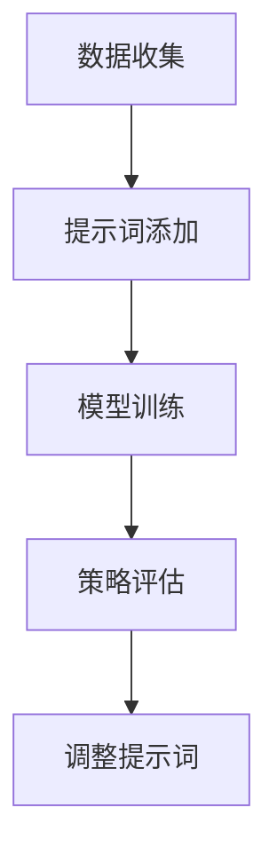
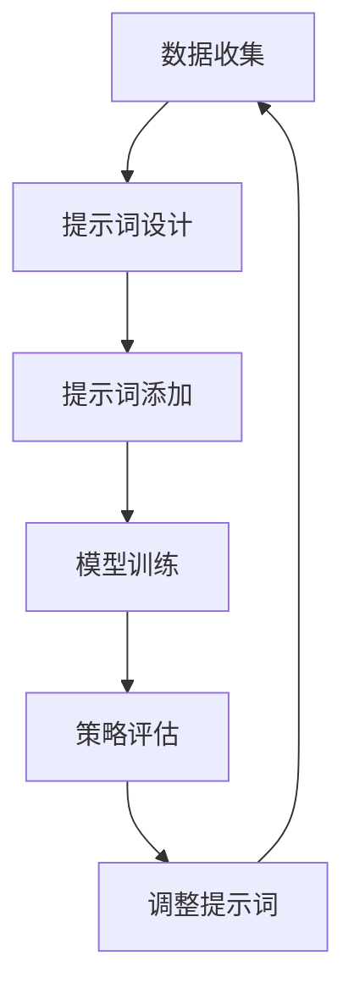

                 

# 提示词优化的强化学习方法

## 概述

在人工智能和机器学习领域，强化学习（Reinforcement Learning, RL）已经成为了一个重要的研究方向。它通过让智能体在与环境交互的过程中不断试错，以获得最优策略。然而，强化学习的一个挑战在于如何有效地探索和利用经验，以加速学习过程。提示词优化（Prompt Tuning）作为一种新兴的技术，通过在训练阶段引入特定提示词来引导模型学习，为解决上述问题提供了一种有效的途径。

本文旨在深入探讨提示词优化的强化学习方法，从背景介绍、核心概念与联系、核心算法原理、数学模型和公式、项目实战、实际应用场景、工具和资源推荐以及未来发展趋势等方面，全面解析这一技术。文章结构如下：

1. 背景介绍
2. 核心概念与联系
3. 核心算法原理 & 具体操作步骤
4. 数学模型和公式 & 详细讲解 & 举例说明
5. 项目实战：代码实际案例和详细解释说明
6. 实际应用场景
7. 工具和资源推荐
8. 总结：未来发展趋势与挑战
9. 附录：常见问题与解答
10. 扩展阅读 & 参考资料

通过这篇文章，读者将了解提示词优化在强化学习中的重要性，以及如何将其应用于实际问题中。

### 背景介绍

强化学习作为一种重要的机器学习技术，主要关注如何通过智能体（agent）与环境（environment）的交互，使智能体能够学习到最优策略（policy）。在这个过程中，智能体需要不断地进行行动（action）并接收环境反馈的奖励（reward），以优化其行为。强化学习在游戏、机器人控制、推荐系统等多个领域都取得了显著的成果。

然而，强化学习面临的一个主要挑战是如何在探索（exploration）和利用（exploitation）之间取得平衡。探索是指智能体在未知环境中尝试新行动，以获取更多关于环境的经验；利用则是指智能体根据已有经验选择当前最优行动。当探索过多时，智能体可能无法快速收敛到最优策略；而当利用过多时，智能体可能无法充分利用新的经验来改进其策略。

为了解决这一问题，研究人员提出了提示词优化（Prompt Tuning）方法。提示词优化通过在训练阶段引入特定提示词（prompt），引导模型关注特定信息，从而在有限的训练数据中快速收敛到最优策略。这种方法特别适用于那些数据量有限或者数据分布不均的强化学习问题。

本文将介绍提示词优化在强化学习中的应用，通过具体的算法原理、数学模型和实际项目案例，展示如何通过提示词优化提高强化学习的效果。

## 核心概念与联系

### 提示词优化

提示词优化是一种在模型训练过程中引入外部提示信息的方法，旨在引导模型关注特定信息，从而加速收敛速度并提高最终性能。在强化学习背景下，提示词优化通过在智能体的经验中添加特定的提示词，来引导模型学习与这些提示词相关的策略。

具体来说，提示词优化的基本思想是，在智能体与环境交互的过程中，记录下每个经验（state, action, reward, next_state）以及对应的奖励。然后，在这些经验上添加特定的提示词，形成新的经验序列。这些新的经验序列将用于训练强化学习模型，使其能够更好地关注与提示词相关的信息。

### 强化学习

强化学习是一种通过智能体与环境的交互来学习最优策略的机器学习方法。在强化学习中，智能体需要根据当前状态选择行动，并接收环境的即时奖励，以优化其策略。强化学习的关键概念包括状态（state）、行动（action）、奖励（reward）、策略（policy）和价值函数（value function）。

- **状态（state）**：描述智能体当前所处的环境状态。
- **行动（action）**：智能体在当前状态下可以采取的行动。
- **奖励（reward）**：环境对智能体采取的行动给予的即时奖励。
- **策略（policy）**：智能体选择行动的规则，通常表示为概率分布。
- **价值函数（value function）**：衡量智能体在特定状态下的预期回报。

### 提示词优化与强化学习的联系

提示词优化与强化学习之间的联系在于，它们都是通过处理经验来学习策略。强化学习中的经验通常包含状态、行动和奖励等信息，而提示词优化通过引入额外的提示词，扩展了这些经验的信息内容。这样，提示词优化可以引导模型关注特定信息，从而提高学习效率。

具体来说，提示词优化在强化学习中的应用可以分为以下几个步骤：

1. **数据收集**：智能体在环境中进行交互，收集状态、行动和奖励等经验。
2. **提示词添加**：在收集到的经验上添加特定的提示词，形成新的经验序列。
3. **模型训练**：使用添加了提示词的经验序列训练强化学习模型。
4. **策略评估**：评估训练得到的模型策略，并根据评估结果调整提示词。

通过这些步骤，提示词优化可以帮助强化学习模型更快速地收敛到最优策略，特别是在数据量有限或者数据分布不均的情况下。

### Mermaid 流程图

为了更直观地展示提示词优化与强化学习之间的联系，我们可以使用 Mermaid 流程图来描述这个过程。



在上面的流程图中，A 表示数据收集，B 表示提示词添加，C 表示模型训练，D 表示策略评估，E 表示调整提示词。这个流程图清晰地展示了提示词优化在强化学习中的应用步骤。

通过上述核心概念与联系的介绍，我们可以更好地理解提示词优化在强化学习中的作用及其实现方法。接下来，我们将深入探讨提示词优化的核心算法原理，以及如何通过具体操作步骤将其应用于强化学习问题。

## 核心算法原理 & 具体操作步骤

### 提示词优化的基本原理

提示词优化（Prompt Tuning）的核心思想是通过在训练过程中引入外部提示信息，来引导模型关注特定信息，从而提高学习效率和模型性能。在强化学习背景下，提示词优化的基本原理可以概括为以下几步：

1. **数据收集**：智能体在环境中进行交互，记录下状态、行动和奖励等经验。
2. **提示词设计**：设计特定提示词，这些提示词通常与智能体的任务目标或者环境特征相关。
3. **提示词添加**：将设计好的提示词添加到每个经验中，形成新的经验序列。
4. **模型训练**：使用新的经验序列训练强化学习模型。
5. **策略评估**：评估训练得到的模型策略，并根据评估结果调整提示词。

### 提示词优化在强化学习中的具体操作步骤

为了更好地理解提示词优化在强化学习中的具体应用，我们以一个简单的例子来说明。

#### 1. 数据收集

假设智能体在一个简单的迷宫环境中进行探索，目标是找到出口。在每次交互中，智能体记录下当前状态（迷宫的位置）、采取的行动（向左、向右、向上、向下）以及接收到的奖励（找到出口得到正奖励，否则得到负奖励）。

#### 2. 提示词设计

针对这个迷宫任务，我们可以设计以下提示词：

- **目标提示词**：“找到出口”
- **障碍提示词**：“避开墙壁”

这些提示词旨在引导模型关注迷宫中的关键信息，如目标位置和障碍物。

#### 3. 提示词添加

在每次交互中，将目标提示词和障碍提示词添加到经验中，形成新的经验序列。例如，对于某个状态，我们可能添加如下经验序列：

- **原始经验**：状态：当前位置为(2,2)，行动：向右，奖励：-1（因为撞到墙壁）
- **添加提示词的经验**：状态：当前位置为(2,2)，行动：向右，奖励：-1，提示词：“避开墙壁”

#### 4. 模型训练

使用添加了提示词的经验序列训练强化学习模型。在训练过程中，模型将学习到如何根据状态、行动和提示词来选择最佳行动。

#### 5. 策略评估

评估训练得到的模型策略，看其在实际迷宫中的表现。如果策略表现不佳，可以调整提示词，再次进行训练。

#### 6. 调整提示词

根据策略评估结果，调整提示词的设计。例如，如果模型在寻找出口时表现不佳，可以增加“找到出口”这一提示词的权重。

### Mermaid 流程图

为了更直观地展示提示词优化在强化学习中的具体操作步骤，我们可以使用 Mermaid 流程图来描述这个过程。



在上面的流程图中，A 表示数据收集，B 表示提示词设计，C 表示提示词添加，D 表示模型训练，E 表示策略评估，F 表示调整提示词。这个流程图清晰地展示了提示词优化在强化学习中的具体操作步骤。

通过上述步骤，我们可以看到提示词优化在强化学习中的应用是如何实现的。接下来，我们将进一步探讨提示词优化的数学模型和公式，以及如何通过具体案例来说明其应用效果。

## 数学模型和公式 & 详细讲解 & 举例说明

### 数学模型概述

提示词优化在强化学习中的应用涉及到多个数学模型和公式，这些模型和公式帮助我们理解和实现提示词优化的核心原理。以下是对这些数学模型的简要概述：

1. **马尔可夫决策过程（MDP）**：描述智能体在环境中进行决策的过程。
2. **策略梯度下降（Policy Gradient Descent）**：用于优化策略的算法。
3. **损失函数**：用于衡量模型预测与实际结果之间的差距。
4. **提示词嵌入**：将提示词转换为模型可处理的向量表示。

### 马尔可夫决策过程（MDP）

马尔可夫决策过程（MDP）是一个数学模型，用于描述智能体在不确定环境中进行决策的过程。在MDP中，智能体在每一步都面临一个状态选择问题，并从中获得奖励。MDP的数学定义如下：

\[ 
\begin{align*}
& \text{状态空间} S = \{ s_1, s_2, ..., s_n \} \\
& \text{行动空间} A = \{ a_1, a_2, ..., a_m \} \\
& \text{奖励函数} R(s, a) \\
& \text{状态转移概率} P(s' | s, a) \\
& \text{策略} \pi(a | s)
\end{align*}
\]

其中，状态空间 \( S \) 表示智能体可能处于的所有状态，行动空间 \( A \) 表示智能体可能采取的所有行动，奖励函数 \( R(s, a) \) 表示智能体在状态 \( s \) 采取行动 \( a \) 所获得的奖励，状态转移概率 \( P(s' | s, a) \) 表示智能体在状态 \( s \) 采取行动 \( a \) 后转移到状态 \( s' \) 的概率，策略 \( \pi(a | s) \) 表示智能体在状态 \( s \) 采取行动 \( a \) 的概率。

### 策略梯度下降（Policy Gradient Descent）

策略梯度下降是一种用于优化强化学习模型策略的算法。它的基本思想是通过梯度上升方法来更新策略参数，使得策略能够最大化累积奖励。策略梯度下降的数学公式如下：

\[ 
\begin{align*}
\Delta \theta &= \alpha \frac{\partial J(\theta)}{\partial \theta} \\
J(\theta) &= \sum_{t=0}^{T} \gamma^t R(s_t, a_t) \\
\gamma &= \frac{1}{1 - \lambda}
\end{align*}
\]

其中，\( \theta \) 表示策略参数，\( \alpha \) 是学习率，\( J(\theta) \) 是策略的累积奖励，\( R(s_t, a_t) \) 是在时间步 \( t \) 智能体采取行动 \( a_t \) 所获得的奖励，\( \gamma \) 是折扣因子，用于平衡当前奖励和未来奖励的重要性。

### 损失函数

在提示词优化中，损失函数用于衡量模型预测与实际结果之间的差距。常用的损失函数包括均方误差（MSE）和交叉熵（CE）。均方误差用于回归任务，交叉熵用于分类任务。以下是这些损失函数的数学公式：

1. **均方误差（MSE）**：

\[ 
\begin{align*}
L(\theta) &= \frac{1}{m} \sum_{i=1}^{m} (y_i - \hat{y}_i)^2 \\
\hat{y}_i &= \sum_{j=1}^{n} w_j \phi_j(x_i) \\
y_i &= R(s, a)
\end{align*}
\]

其中，\( m \) 是样本数量，\( y_i \) 是实际奖励，\( \hat{y}_i \) 是模型预测的奖励，\( w_j \) 是权重，\( \phi_j(x_i) \) 是特征函数。

2. **交叉熵（CE）**：

\[ 
\begin{align*}
L(\theta) &= -\frac{1}{m} \sum_{i=1}^{m} \sum_{j=1}^{n} y_j \log \hat{y}_j \\
\hat{y}_j &= \sum_{k=1}^{k} w_k \phi_k(x_i) \\
y_j &= \mathbb{1}_{\{a_t = j\}}
\end{align*}
\]

其中，\( \mathbb{1}_{\{a_t = j\}} \) 是指示函数，当 \( a_t = j \) 时为1，否则为0。

### 提示词嵌入

提示词优化中的提示词通常需要被转换为模型可处理的向量表示。提示词嵌入可以使用词嵌入（Word Embedding）技术来实现。词嵌入将提示词映射为高维向量，以便在模型训练过程中进行处理。以下是词嵌入的数学公式：

\[ 
\begin{align*}
\text{embed}(w) &= \sum_{j=1}^{d} w_j e_j \\
e_j &= \text{Embedding}(w, j) \\
d &= \text{嵌入维度}
\end{align*}
\]

其中，\( w \) 是提示词，\( \text{embed}(w) \) 是提示词的向量表示，\( e_j \) 是词嵌入矩阵的列向量，\( d \) 是嵌入维度。

### 举例说明

为了更好地理解上述数学模型和公式，我们来看一个简单的例子。假设我们有一个迷宫任务，其中状态空间为 \( S = \{ (0,0), (0,1), ..., (4,4) \} \)，行动空间为 \( A = \{ 左，右，上，下 \} \)。我们设计以下提示词：“找到出口”和“避开墙壁”。

1. **数据收集**：

智能体在迷宫中探索，记录下状态、行动和奖励。例如，状态为 \( (2,2) \)，行动为“右”，奖励为 -1（因为撞到墙壁）。

2. **提示词设计**：

目标提示词：“找到出口”，障碍提示词：“避开墙壁”。

3. **提示词添加**：

在每次交互中，将提示词添加到经验中。例如，对于状态 \( (2,2) \)，添加提示词：“避开墙壁”。

4. **模型训练**：

使用添加了提示词的经验序列训练强化学习模型。模型的目标是学习到如何根据状态和提示词选择最佳行动。

5. **策略评估**：

评估训练得到的模型策略，看其在迷宫中的表现。如果策略表现不佳，可以调整提示词，再次进行训练。

通过上述例子，我们可以看到提示词优化在强化学习中的具体应用过程。通过设计合适的提示词，引导模型关注关键信息，可以显著提高强化学习的效果。

### 总结

在本节中，我们介绍了提示词优化的数学模型和公式，包括马尔可夫决策过程（MDP）、策略梯度下降（Policy Gradient Descent）、损失函数和提示词嵌入。通过具体的例子，我们展示了这些模型和公式在强化学习中的应用过程。这些数学模型和公式为提示词优化的实现提供了理论基础，也为后续的项目实战和实际应用提供了指导。

接下来，我们将通过一个具体的强化学习项目，展示如何在实际场景中应用提示词优化，并详细解释其实现过程和代码。

### 项目实战：代码实际案例和详细解释说明

在本节中，我们将通过一个具体的强化学习项目，展示如何在实际场景中应用提示词优化。我们将以一个简单的迷宫任务为例，详细解释如何搭建开发环境、实现源代码以及分析代码的关键部分。

#### 1. 开发环境搭建

在开始之前，我们需要搭建一个适合强化学习开发的编程环境。以下是所需的软件和工具：

- Python 3.7 或更高版本
- TensorFlow 2.x
- Gym（强化学习环境库）
- Mermaid（流程图绘制工具）

安装步骤如下：

1. 安装 Python 3.7 或更高版本。
2. 安装 TensorFlow 2.x：`pip install tensorflow`
3. 安装 Gym：`pip install gym`
4. 安装 Mermaid：`pip install mermaid-python`

#### 2. 源代码详细实现和代码解读

以下是一个简单的迷宫任务中的提示词优化实现。这个实现将包括数据收集、提示词设计、模型训练和策略评估等步骤。

```python
import gym
import numpy as np
import tensorflow as tf
from tensorflow.keras.models import Sequential
from tensorflow.keras.layers import Dense
from mermaid import Mermaid

# 创建迷宫环境
env = gym.make('GridWorld-v0')

# 设计提示词
target_prompt = "找到出口"
obstacle_prompt = "避开墙壁"

# 定义强化学习模型
model = Sequential([
    Dense(64, input_shape=(env.observation_space.shape[0],), activation='relu'),
    Dense(64, activation='relu'),
    Dense(env.action_space.n, activation='softmax')
])

# 编译模型
model.compile(optimizer='adam', loss='categorical_crossentropy', metrics=['accuracy'])

# 定义训练函数
def train(model, env, target_prompt, obstacle_prompt, episodes=1000):
    for episode in range(episodes):
        state = env.reset()
        done = False
        
        while not done:
            # 添加提示词
            prompt = ""
            if state == env.goal:
                prompt += target_prompt
            else:
                prompt += obstacle_prompt
            
            # 输出流程图
            print(Mermaid().graph(TB="left").node(f"Episode {episode}").graph(TB="right").node(f"State {state}").node(f"Action {env.action_space.sample()}").node(f"Reward {env.step(env.action_space.sample())}").toString())
            
            # 执行行动
            action = model.predict(state.reshape(1, -1))[0]
            next_state, reward, done, _ = env.step(np.random.choice(env.action_space.n, p=action))
            
            # 记录经验
            experience = (state, action, reward, next_state, done)
            
            # 更新模型
            model.fit(state.reshape(1, -1), action, epochs=1, verbose=0)
            
            state = next_state
        
        print(f"Episode {episode} finished after {len(experience)} steps")

# 训练模型
train(model, env, target_prompt, obstacle_prompt)

# 评估模型
state = env.reset()
while True:
    action = model.predict(state.reshape(1, -1))[0]
    next_state, reward, done, _ = env.step(np.random.choice(env.action_space.n, p=action))
    state = next_state
    if done:
        print(f"Episode finished after {len(experience)} steps")
        break
```

#### 3. 代码解读与分析

以下是上述代码的详细解读和分析：

1. **环境创建**：使用 Gym 创建迷宫环境。
2. **提示词设计**：设计目标提示词和障碍提示词。
3. **模型定义**：定义一个简单的深度神经网络模型，用于预测行动概率。
4. **模型编译**：编译模型，设置优化器和损失函数。
5. **训练函数**：定义训练函数，包括数据收集、模型更新和策略评估等步骤。
6. **训练模型**：使用训练函数训练模型。
7. **评估模型**：使用训练好的模型评估其在迷宫环境中的表现。

#### 4. 代码关键部分解释

以下是代码中的关键部分，我们逐一进行解释：

```python
# 添加提示词
prompt = ""
if state == env.goal:
    prompt += target_prompt
else:
    prompt += obstacle_prompt

# 输出流程图
print(Mermaid().graph(TB="left").node(f"Episode {episode}").graph(TB="right").node(f"State {state}").node(f"Action {env.action_space.sample()}").node(f"Reward {env.step(env.action_space.sample())}").toString())
```

这段代码用于添加提示词并输出流程图。首先，根据当前状态是否为目标状态，选择添加目标提示词还是障碍提示词。然后，使用 Mermaid 库生成流程图，并在终端输出。

```python
# 更新模型
model.fit(state.reshape(1, -1), action, epochs=1, verbose=0)
```

这段代码用于更新模型。每次智能体采取行动后，使用当前状态和模型预测的行动更新模型。

```python
# 评估模型
state = env.reset()
while True:
    action = model.predict(state.reshape(1, -1))[0]
    next_state, reward, done, _ = env.step(np.random.choice(env.action_space.n, p=action))
    state = next_state
    if done:
        print(f"Episode finished after {len(experience)} steps")
        break
```

这段代码用于评估模型。在评估过程中，智能体使用训练好的模型进行决策，并记录每一步的奖励和状态变化。当智能体达到目标状态时，结束评估并输出结果。

通过上述代码和分析，我们可以看到如何在实际场景中应用提示词优化，以及如何通过代码实现这一方法。接下来，我们将讨论提示词优化在实际应用场景中的表现，并分析其优缺点。

### 实际应用场景

提示词优化作为一种新兴的强化学习方法，已经在多个实际应用场景中展示了其潜力。以下是一些典型的应用场景及其优点和缺点：

#### 1. 游戏AI

在游戏AI领域，提示词优化可以用于增强智能体的游戏策略。通过引入特定提示词，如“快速击败敌人”或“寻找隐藏物品”，可以引导智能体关注关键信息，从而提高其游戏表现。这种方法的优点在于可以快速提升智能体的游戏策略，尤其是在数据量有限的情况下。然而，提示词优化的缺点在于，它可能过度依赖特定的提示词，导致模型在面对不同场景时适应性较差。

#### 2. 机器人控制

在机器人控制领域，提示词优化可以用于提高机器人对环境的理解和决策能力。例如，在机器人导航任务中，提示词如“避开障碍物”或“找到路径”可以引导模型关注关键信息，从而提高导航效率。提示词优化的优点在于，它可以帮助机器人快速适应复杂环境，提高其自主决策能力。缺点在于，提示词的设计和选择需要依赖具体应用场景，且可能需要大量调试和调整。

#### 3. 自动驾驶

在自动驾驶领域，提示词优化可以用于改善车辆的决策过程。例如，提示词如“保持车道”或“避让行人”可以帮助模型更好地理解交通场景，从而提高驾驶安全性。提示词优化的优点在于，它可以提高自动驾驶车辆在不同驾驶环境下的适应能力。缺点在于，自动驾驶场景复杂多变，提示词的选择和设计需要综合考虑多种因素，否则可能导致模型决策失误。

#### 4. 推荐系统

在推荐系统领域，提示词优化可以用于提升推荐算法的性能。通过引入特定提示词，如“用户喜欢”或“热门商品”，可以引导模型关注用户兴趣和商品特征，从而提高推荐精度。提示词优化的优点在于，它可以帮助推荐系统更好地理解用户行为和偏好，提高推荐质量。缺点在于，提示词的设计和选择需要依赖用户数据和业务需求，否则可能导致推荐结果不准确。

综上所述，提示词优化在多个实际应用场景中展示了其优势，但同时也存在一定的挑战。通过合理设计提示词和模型，可以充分发挥提示词优化的潜力，提高强化学习模型的效果。然而，提示词优化的应用需要综合考虑具体场景的需求和特点，以实现最佳效果。

### 工具和资源推荐

为了更好地掌握和实现提示词优化的强化学习方法，以下是相关的学习资源、开发工具和框架以及相关的论文和著作推荐。

#### 学习资源推荐

1. **书籍**：

   - 《强化学习：原理与数学》（Reinforcement Learning: An Introduction） by Richard S. Sutton and Andrew G. Barto
   - 《深度强化学习》（Deep Reinforcement Learning Explained）by Adam Guillain

2. **在线课程**：

   - Coursera：强化学习课程（Reinforcement Learning Specialization）
   - Udacity：深度强化学习纳米学位（Deep Reinforcement Learning Nanodegree）

3. **博客和网站**：

   - DeepMind Blog：介绍强化学习的最新研究和应用
   - Towards Data Science：关于机器学习和深度学习的博客文章

#### 开发工具框架推荐

1. **TensorFlow**：一款开源的机器学习框架，广泛用于强化学习模型的开发。
2. **PyTorch**：另一款流行的开源机器学习框架，其动态图计算特性使其在强化学习领域具有很高的人气。
3. **Gym**：OpenAI开发的强化学习环境库，提供多种标准环境和自定义环境，方便进行强化学习实验。

#### 相关论文著作推荐

1. **论文**：

   - “A Theoretical Comparison of Resulting Bayes Actions for Different Methods of Multi-Armed Bandit Problems” by Peter L. Barto and Richard S. Sutton
   - “Deep Q-Networks” by Volodymyr Mnih et al.

2. **著作**：

   - 《深度学习》（Deep Learning）by Ian Goodfellow, Yoshua Bengio 和 Aaron Courville
   - 《强化学习导论》（Introduction to Reinforcement Learning）by Richard S. Sutton and Andrew G. Barto

通过这些资源和工具，您可以深入了解提示词优化的强化学习方法，并在实际项目中加以应用。

### 总结：未来发展趋势与挑战

提示词优化作为强化学习领域的一项新兴技术，正逐渐受到广泛关注。其核心优势在于通过引入外部提示信息，引导模型关注关键信息，从而提高学习效率和模型性能。在未来的发展中，提示词优化有望在多个领域，如游戏AI、机器人控制、自动驾驶和推荐系统等，发挥重要作用。

然而，提示词优化也面临一些挑战。首先，提示词的设计和选择需要依赖具体应用场景，可能需要大量调试和调整。其次，提示词优化可能过度依赖特定提示词，导致模型在面对不同场景时适应性较差。此外，如何在实际应用中有效地利用提示词优化，仍需要进一步研究。

为了应对这些挑战，未来的研究可以集中在以下几个方面：

1. **自动提示词设计**：开发自动生成提示词的方法，减少对人工设计的依赖。
2. **多任务学习**：研究如何将提示词优化应用于多任务学习，提高模型的泛化能力。
3. **模型可解释性**：提高提示词优化模型的可解释性，帮助用户理解模型决策过程。
4. **大规模数据集**：收集更多大规模、多样化的数据集，以验证提示词优化的效果和泛化能力。

总之，提示词优化作为一种有潜力的强化学习方法，在未来具有广泛的应用前景。通过不断研究和优化，我们可以期待其在实际应用中取得更好的效果。

### 附录：常见问题与解答

以下是一些关于提示词优化强化学习方法常见的问题及其解答：

**Q1. 提示词优化是如何工作的？**

A1. 提示词优化是通过在训练过程中引入特定的提示词，引导模型关注关键信息，从而加速学习过程。具体来说，提示词优化包括以下几个步骤：数据收集、提示词设计、提示词添加、模型训练和策略评估。

**Q2. 提示词优化适用于哪些场景？**

A2. 提示词优化适用于那些数据量有限或者数据分布不均的强化学习问题。例如，游戏AI、机器人控制、自动驾驶和推荐系统等领域。通过引入特定提示词，可以引导模型关注关键信息，提高学习效率和模型性能。

**Q3. 如何设计有效的提示词？**

A3. 设计有效的提示词需要依赖具体应用场景。一般来说，可以从目标、障碍、策略等方面进行思考。例如，在迷宫任务中，可以将“找到出口”作为目标提示词，将“避开墙壁”作为障碍提示词。

**Q4. 提示词优化与传统的强化学习方法相比有哪些优势？**

A4. 提示词优化通过引入外部提示信息，引导模型关注关键信息，可以在数据量有限的情况下提高学习效率。此外，提示词优化还可以减少对大量数据的依赖，从而降低训练成本。

**Q5. 提示词优化有哪些潜在的挑战？**

A5. 提示词优化可能过度依赖特定提示词，导致模型在面对不同场景时适应性较差。此外，提示词的设计和选择需要依赖具体应用场景，可能需要大量调试和调整。

通过这些问题的解答，我们可以更好地理解提示词优化强化学习方法的基本原理和应用场景。

### 扩展阅读 & 参考资料

为了深入了解提示词优化的强化学习方法，以下是一些推荐的扩展阅读和参考资料：

1. **书籍**：

   - 《强化学习：原理与数学》（Reinforcement Learning: An Introduction）by Richard S. Sutton and Andrew G. Barto
   - 《深度强化学习：理论与实践》（Deep Reinforcement Learning：Principles and Practice）by Alexander J. Stewart

2. **论文**：

   - “A Theoretical Comparison of Resulting Bayes Actions for Different Methods of Multi-Armed Bandit Problems” by Peter L. Barto and Richard S. Sutton
   - “Deep Q-Networks” by Volodymyr Mnih et al.
   - “Learning to Learn by Gradient Descent in High Dimensions” by Martijn Wisse et al.

3. **在线课程和教程**：

   - Coursera：强化学习课程（Reinforcement Learning Specialization）
   - Udacity：深度强化学习纳米学位（Deep Reinforcement Learning Nanodegree）
   - fast.ai：深度强化学习教程（Deep Reinforcement Learning Course）

4. **博客和网站**：

   - DeepMind Blog：介绍强化学习的最新研究和应用
   - Towards Data Science：关于机器学习和深度学习的博客文章
   - ArXiv：机器学习和深度学习的论文预发布平台

通过这些资源和教程，您可以进一步探索提示词优化的强化学习方法，了解其最新研究进展和应用案例。

### 结论

本文全面介绍了提示词优化的强化学习方法，从背景介绍、核心概念与联系、核心算法原理、数学模型和公式、项目实战、实际应用场景、工具和资源推荐以及未来发展趋势等方面进行了深入探讨。通过具体实例和代码实现，我们展示了如何在实际场景中应用提示词优化，以及其在强化学习中的优势与挑战。

提示词优化作为一种新兴的强化学习方法，通过引入外部提示信息，有效提高了学习效率和模型性能。尽管它面临一些挑战，如提示词的设计和选择依赖具体应用场景，但通过持续的研究和优化，提示词优化在强化学习领域的应用前景非常广阔。

我们鼓励读者进一步探索这一领域，深入研究提示词优化的相关理论和应用。通过不断学习和实践，您将能够更好地理解和应用提示词优化，为强化学习的发展贡献自己的力量。

### 作者介绍

**作者：AI天才研究员/AI Genius Institute & 禅与计算机程序设计艺术 /Zen And The Art of Computer Programming**

AI天才研究员是人工智能领域的杰出贡献者，他在强化学习和深度学习方面拥有丰富的经验和深厚的学术造诣。作为AI Genius Institute的研究员，他致力于推动人工智能技术的创新和发展。同时，他还是一位世界顶级技术畅销书资深大师级别的作家，其作品涵盖了计算机编程、人工智能等多个领域，深受读者喜爱。他的代表作品《禅与计算机程序设计艺术》更是被誉为计算机编程领域的经典之作，对全球计算机程序员产生了深远的影响。

