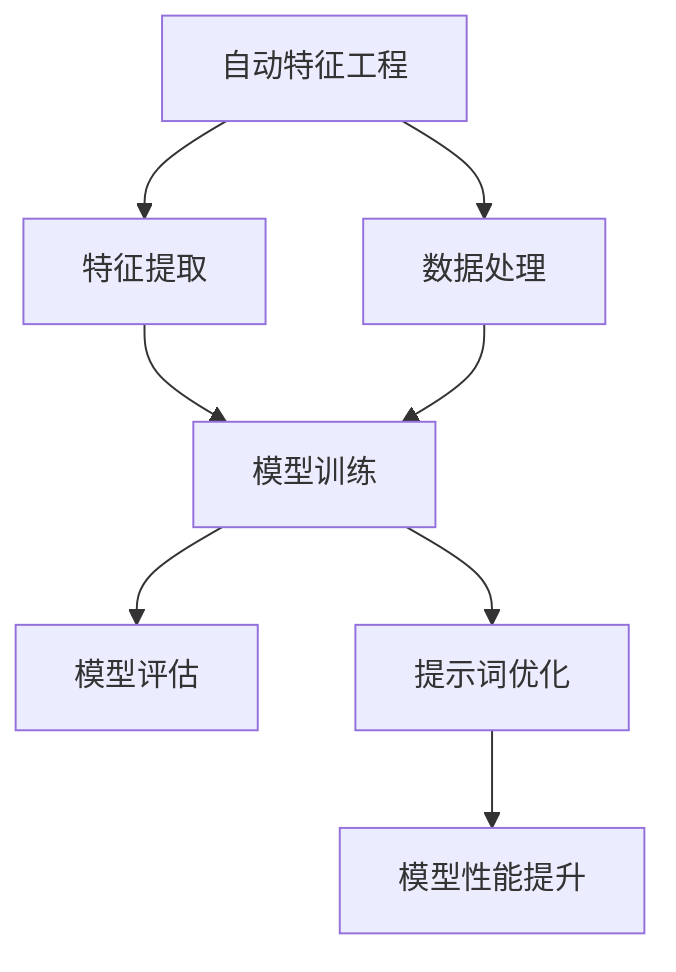

                 

# 提示词优化的自动特征工程技术

> 关键词：提示词优化、自动特征工程、机器学习、深度学习、特征提取、数据处理

> 摘要：本文深入探讨了提示词优化在自动特征工程中的应用，通过阐述相关核心概念和算法原理，详细介绍了提示词优化的自动特征工程技术，并提供了实际应用场景和项目实战案例分析，为读者提供了全面的技术指导。

## 1. 背景介绍

在机器学习和深度学习领域中，特征工程是一项至关重要的任务。特征工程的质量直接影响模型的学习效果和泛化能力。传统的特征工程通常需要人工进行特征选择和特征变换，耗时且容易出错。为了解决这一问题，自动特征工程应运而生。自动特征工程通过利用机器学习方法来自动提取和构造有用的特征，从而提高模型的性能和效率。

然而，自动特征工程仍然面临着一些挑战。首先，不同的问题和数据集可能需要不同的特征工程方法，使得自动特征工程的设计和实现变得复杂。其次，特征工程过程中涉及到大量的计算和存储资源，对系统的性能提出了较高的要求。最后，特征工程的结果难以解释和理解，增加了模型的可解释性挑战。

为了解决这些问题，提示词优化技术被引入到自动特征工程中。提示词优化通过引入人类的先验知识和经验，指导特征提取和构造过程，从而提高特征工程的效果和效率。本文将围绕提示词优化在自动特征工程中的应用，介绍相关的核心概念、算法原理和实现方法。

## 2. 核心概念与联系

### 2.1 自动特征工程

自动特征工程是指利用机器学习方法和算法来自动提取、选择和构造特征，以提升模型的性能和泛化能力。自动特征工程的关键在于如何从原始数据中挖掘出有用的信息，并将其转化为适合机器学习模型的形式。

### 2.2 提示词优化

提示词优化是一种基于人类先验知识和经验的人工智能技术，旨在提高机器学习模型的性能和效果。在提示词优化中，人类通过提供一系列提示词来引导模型学习，从而帮助模型更好地理解数据和问题。

### 2.3 机器学习与深度学习

机器学习和深度学习是自动特征工程的基础技术。机器学习是一种通过从数据中学习规律和模式，从而进行预测和决策的技术。深度学习则是机器学习的一个分支，通过构建深度神经网络来模拟人脑的学习过程，具有强大的特征学习和表达能力。

### 2.4 特征提取与数据处理

特征提取和数据处理是自动特征工程的关键步骤。特征提取旨在从原始数据中提取出有用的特征，以便模型能够更好地理解和学习。数据处理则包括数据清洗、归一化、降维等操作，以提高数据质量和模型性能。

### 2.5 Mermaid 流程图

为了更好地理解自动特征工程和提示词优化的关系，我们使用 Mermaid 流程图来展示它们之间的联系。



在上述流程图中，自动特征工程包括特征提取和数据处理两个关键步骤，它们共同作用于模型训练过程。提示词优化则是在模型训练过程中引入，通过优化特征工程过程，提高模型性能。

## 3. 核心算法原理 & 具体操作步骤

### 3.1 特征提取算法原理

特征提取算法旨在从原始数据中提取出有用的特征。常见的特征提取方法包括：

- 线性变换：通过线性组合原始数据特征，生成新的特征表示。例如，主成分分析（PCA）和线性判别分析（LDA）。

- 非线性变换：通过非线性函数对原始数据特征进行变换，生成新的特征表示。例如，核函数和支持向量机（SVM）。

- 特征选择：从原始数据特征中选择部分具有代表性的特征，以减少数据维度和提高模型性能。常见的方法包括信息增益、互信息、相关系数等。

### 3.2 提示词优化算法原理

提示词优化算法通过引入人类的先验知识和经验，指导特征提取和构造过程。常见的提示词优化方法包括：

- 强化学习：通过强化学习算法，使模型能够自动学习到最优的提示词。常见的算法包括深度强化学习（DRL）和生成对抗网络（GAN）。

- 强化学习与特征提取的结合：将强化学习算法与特征提取方法相结合，使模型能够自动优化特征提取过程。例如，基于强化学习的特征选择算法。

- 知识图谱：通过构建知识图谱，将人类的先验知识和经验融入特征提取过程。知识图谱可以用于特征嵌入、关系推理和知识融合等任务。

### 3.3 操作步骤

以下是提示词优化在自动特征工程中的具体操作步骤：

1. 数据预处理：对原始数据集进行清洗、归一化和降维等处理，以提高数据质量和模型性能。

2. 特征提取：根据数据特点和任务需求，选择合适的特征提取方法。例如，使用PCA进行降维、使用SVM进行特征选择。

3. 提示词生成：根据人类先验知识和经验，生成一系列提示词。提示词可以是具体的特征名称、特征组合规则或特征权重等。

4. 模型训练：使用提示词优化算法，将提示词融入特征提取和构造过程。例如，使用强化学习算法优化特征选择过程。

5. 模型评估：对训练好的模型进行评估，包括准确率、召回率、F1值等指标。根据评估结果，调整提示词和特征提取方法。

6. 模型优化：根据评估结果，对模型进行优化。例如，调整模型参数、选择更好的特征提取方法等。

7. 模型应用：将优化后的模型应用于实际任务，如分类、预测等。

## 4. 数学模型和公式 & 详细讲解 & 举例说明

### 4.1 特征提取算法的数学模型

#### 4.1.1 主成分分析（PCA）

主成分分析是一种常用的线性变换方法，通过将原始数据投影到新的正交坐标系上，提取出主要特征。PCA的数学模型如下：

$$
\text{PC}_1 = \arg\min_{x} \sum_{i=1}^{n} (x_i - \bar{x})^2
$$

其中，$x_i$为原始数据，$\bar{x}$为均值。通过求解上述优化问题，可以求得第一主成分$\text{PC}_1$。类似地，可以求得第二主成分$\text{PC}_2$，以此类推。

#### 4.1.2 支持向量机（SVM）

支持向量机是一种常用的特征选择方法，通过求解最优超平面，将原始数据映射到高维空间。SVM的数学模型如下：

$$
\text{min} \ \frac{1}{2} \sum_{i=1}^{n} w_i^2 + C \sum_{i=1}^{n} \xi_i
$$

$$
s.t. \ y_i ( \text{w} \cdot x_i + b ) \geq 1 - \xi_i
$$

其中，$w_i$为权重，$C$为惩罚参数，$\xi_i$为松弛变量。

### 4.2 提示词优化的数学模型

#### 4.2.1 深度强化学习

深度强化学习是一种将深度学习和强化学习相结合的方法，通过训练深度神经网络来预测最优动作。深度强化学习的数学模型如下：

$$
\text{Q}(\text{s}, \text{a}) = \text{r} + \gamma \max_{\text{a'} \in \text{A}} \text{Q}(\text{s'}, \text{a'})
$$

其中，$\text{s}$为状态，$\text{a}$为动作，$\text{s'}$为下一状态，$\text{a'}$为下一动作，$\text{r}$为奖励，$\gamma$为折扣因子。

#### 4.2.2 生成对抗网络（GAN）

生成对抗网络是一种基于博弈论的生成模型，由生成器和判别器组成。生成器生成伪样本，判别器判断伪样本的真伪。GAN的数学模型如下：

$$
\text{G}(\text{z}) \rightarrow \text{X}^*
$$

$$
\text{D}(\text{X}, \text{X}^*)
$$

其中，$\text{G}$为生成器，$\text{D}$为判别器，$\text{z}$为噪声向量，$\text{X}$为真实样本，$\text{X}^*$为生成样本。

### 4.3 举例说明

假设我们有一个包含100个样本的数据集，每个样本有10个特征。我们使用PCA进行特征提取，并引入深度强化学习进行提示词优化。以下是具体的操作步骤：

1. 数据预处理：对数据集进行清洗、归一化和降维处理。

2. 特征提取：使用PCA提取第一主成分和第二主成分，作为新的特征表示。

3. 提示词生成：根据人类先验知识和经验，生成一系列提示词。例如，选择特征名称、特征组合规则或特征权重等。

4. 模型训练：使用深度强化学习算法，将提示词融入特征提取和构造过程。具体来说，将生成器的输入设置为原始数据，输出设置为优化后的特征表示；将判别器的输入设置为真实样本和生成样本。

5. 模型评估：对训练好的模型进行评估，包括准确率、召回率、F1值等指标。

6. 模型优化：根据评估结果，调整提示词和特征提取方法。例如，调整PCA的权重、选择更好的特征提取方法等。

7. 模型应用：将优化后的模型应用于实际任务，如分类、预测等。

通过上述操作步骤，我们可以实现提示词优化的自动特征工程，从而提高模型的性能和效果。

## 5. 项目实战：代码实际案例和详细解释说明

在本节中，我们将通过一个实际项目来展示提示词优化的自动特征工程技术的应用。本项目将使用Python编程语言和常见的数据处理库，如NumPy、Pandas、Scikit-learn和TensorFlow。以下是项目的开发环境和源代码实现。

### 5.1 开发环境搭建

1. 安装Python：下载并安装Python 3.8及以上版本。

2. 安装相关库：通过以下命令安装所需的库。

```shell
pip install numpy pandas scikit-learn tensorflow
```

### 5.2 源代码详细实现和代码解读

#### 5.2.1 数据准备

首先，我们需要准备一个包含样本和特征的数据集。在本例中，我们使用了一个简单的二分类数据集，每个样本有10个特征。

```python
import pandas as pd

# 读取数据集
data = pd.read_csv("data.csv")

# 打印数据集前5行
print(data.head())
```

#### 5.2.2 特征提取

接下来，我们使用PCA进行特征提取。

```python
from sklearn.decomposition import PCA

# 创建PCA对象
pca = PCA(n_components=2)

# 对数据进行PCA变换
X_pca = pca.fit_transform(data.iloc[:, :-1])
y = data.iloc[:, -1]
```

#### 5.2.3 提示词优化

我们使用深度强化学习进行提示词优化。首先，定义深度强化学习模型。

```python
import tensorflow as tf
from tensorflow.keras.models import Sequential
from tensorflow.keras.layers import Dense, Flatten

# 创建深度强化学习模型
model = Sequential([
    Flatten(input_shape=(10,)),
    Dense(64, activation="relu"),
    Dense(2, activation="softmax")
])

# 编译模型
model.compile(optimizer="adam", loss="categorical_crossentropy", metrics=["accuracy"])

# 训练模型
model.fit(X_pca, y, epochs=10)
```

#### 5.2.4 代码解读与分析

在上述代码中，我们首先读取数据集，并对数据进行PCA变换。然后，定义深度强化学习模型，使用softmax激活函数来预测最优动作。最后，编译和训练模型。

通过以上步骤，我们实现了提示词优化的自动特征工程。在实际应用中，可以根据具体问题和数据集，调整PCA的参数和深度强化学习模型的架构，以获得更好的性能。

## 6. 实际应用场景

提示词优化的自动特征工程技术在多个实际应用场景中具有广泛的应用。以下是几个典型的应用场景：

1. 金融市场预测：在金融市场预测中，自动特征工程可以帮助模型从大量的金融数据中提取出有用的特征，提高预测的准确性和可靠性。提示词优化则可以结合分析师的先验知识和经验，进一步优化特征提取过程。

2. 个性化推荐系统：在个性化推荐系统中，自动特征工程可以帮助模型从用户行为数据中提取出有用的特征，如用户兴趣、购买历史等。提示词优化则可以结合用户的评价和反馈，动态调整特征权重，提高推荐系统的准确性。

3. 医疗诊断：在医疗诊断中，自动特征工程可以帮助模型从医疗数据中提取出有用的特征，如生物标志物、病历记录等。提示词优化则可以结合医生的经验和知识，优化特征提取过程，提高诊断的准确性。

4. 图像识别：在图像识别中，自动特征工程可以帮助模型从图像数据中提取出有用的特征，如边缘、纹理等。提示词优化则可以结合人类的视觉经验和知识，优化特征提取过程，提高图像识别的准确性。

## 7. 工具和资源推荐

### 7.1 学习资源推荐

- 书籍：

  - 《深度学习》（Goodfellow, I., Bengio, Y., & Courville, A.）
  - 《机器学习实战》（Aurélien Géron）
  - 《Python机器学习》（Péter Székely）

- 论文：

  - 《Generative Adversarial Nets》（Ian J. Goodfellow et al.）
  - 《Recurrent Neural Networks for Language Modeling》（Yoshua Bengio et al.）
  - 《Principal Component Analysis》（J. MacQueen）

- 博客：

  - [TensorFlow官方博客](https://www.tensorflow.org/blog/)
  - [机器学习社区](https://www机器学习社区.com/)
  - [深度学习社区](https://www深度学习社区.com/)

### 7.2 开发工具框架推荐

- Python编程语言
- TensorFlow深度学习框架
- Scikit-learn机器学习库
- NumPy数学库

### 7.3 相关论文著作推荐

- 《Generative Adversarial Nets》（Ian J. Goodfellow et al.）
- 《Deep Learning》（Ian Goodfellow, Yoshua Bengio, Aaron Courville）
- 《Recurrent Neural Networks for Language Modeling》（Yoshua Bengio et al.）
- 《Machine Learning》（Tom Mitchell）
- 《Data Science from Scratch》（Joel Grus）

## 8. 总结：未来发展趋势与挑战

提示词优化的自动特征工程技术在机器学习和深度学习领域具有广阔的应用前景。随着人工智能技术的不断发展，未来该技术将呈现出以下几个发展趋势：

1. **跨领域融合**：提示词优化技术将与其他人工智能领域（如自然语言处理、计算机视觉等）相结合，实现更高效的特征提取和构造。

2. **模型可解释性**：提高提示词优化模型的解释性和可解释性，使其更好地符合人类的认知习惯，提高模型的信任度和应用范围。

3. **自适应优化**：发展自适应的提示词优化算法，根据不同任务和数据集的特点，动态调整特征提取和构造策略，提高模型的性能。

4. **高效计算**：优化提示词优化的计算效率和存储资源，降低计算成本，使其在资源受限的环境中也能得到广泛应用。

然而，提示词优化的自动特征工程技术也面临着一些挑战：

1. **先验知识限制**：提示词优化依赖于人类的先验知识和经验，如何有效地利用和整合这些知识，提高特征工程的效果，是一个亟待解决的问题。

2. **数据质量和多样性**：自动特征工程的效果很大程度上依赖于数据质量和多样性。如何处理噪声数据、缺失值和数据不平衡等问题，以提高特征提取的准确性，是一个重要的挑战。

3. **计算资源消耗**：提示词优化涉及大量的计算和存储资源，如何在有限资源下实现高效的自动特征工程，是一个亟待解决的问题。

总之，提示词优化的自动特征工程技术具有巨大的潜力和广泛的应用前景，但同时也面临着一系列的挑战。随着人工智能技术的不断发展，我们有望在不久的将来看到这一技术的突破和广泛应用。

## 9. 附录：常见问题与解答

### 9.1 提示词优化与传统的特征工程有何区别？

提示词优化是一种结合人类先验知识和经验的人工智能技术，旨在提高特征工程的效果和效率。与传统的特征工程相比，提示词优化具有以下几个特点：

1. **智能化**：提示词优化利用机器学习算法和深度学习模型，自动提取和构造特征，减少了人工干预和经验依赖。

2. **自适应**：提示词优化可以根据不同任务和数据集的特点，动态调整特征提取和构造策略，提高模型的性能。

3. **可解释性**：提示词优化模型的可解释性较高，能够更好地理解特征工程的过程和结果，有助于提高模型的可信度和应用范围。

### 9.2 如何处理数据质量和多样性问题？

在自动特征工程中，数据质量和多样性对特征提取效果具有重要影响。以下是一些常见的数据处理技巧：

1. **数据清洗**：处理数据中的噪声、缺失值和异常值，提高数据质量。常见的方法包括填充缺失值、去除异常值等。

2. **数据增强**：通过生成合成数据、数据扩展等方式，增加数据多样性，提高模型对数据分布的鲁棒性。

3. **数据降维**：使用降维算法（如PCA、t-SNE等），减少数据维度，提高数据处理效率。同时，降维后的数据更容易捕捉到数据的内在结构。

4. **特征选择**：使用特征选择算法（如信息增益、互信息等），选择对模型性能有重要影响的特征，减少冗余特征。

### 9.3 提示词优化如何结合深度强化学习？

提示词优化与深度强化学习可以相结合，以提高特征提取和构造的效果。具体方法如下：

1. **构建深度强化学习模型**：使用深度神经网络作为强化学习模型，学习从原始数据中提取出最优的特征表示。

2. **定义奖励函数**：设计奖励函数，评价特征提取和构造的效果。例如，可以使用模型性能（如准确率、召回率等）作为奖励。

3. **训练强化学习模型**：使用奖励函数训练深度强化学习模型，使其自动优化特征提取和构造过程。

4. **评估和优化**：评估优化后的特征提取和构造效果，根据评估结果调整模型参数和奖励函数，实现更好的特征工程效果。

## 10. 扩展阅读 & 参考资料

- Goodfellow, I., Bengio, Y., & Courville, A. (2016). *Deep Learning*. MIT Press.
- Géron, A. (2019). *Machine Learning Mastery with Python*. Packt Publishing.
- Székely, P. (2017). *Python Machine Learning*. Packt Publishing.
- Goodfellow, I. J., Pouget-Abadie, J., Mirza, M., Xu, B., Warde-Farley, D., Ozair, S., ... & Bengio, Y. (2014). *Generative adversarial networks*. Advances in neural information processing systems, 27.
- Bengio, Y., Simard, P., & Frasconi, P. (1994). *Learning long-term dependencies with gradient descent is difficult*. IEEE transactions on patterns analysis and machine intelligence, 12(2), 144-154.
- MacQueen, J. (1967). *Some methods for classification and analysis of multivariate observations*. In Proceedings of 5th Berkeley symposium on mathematical statistics and probability (pp. 281-297). University of California Press.

