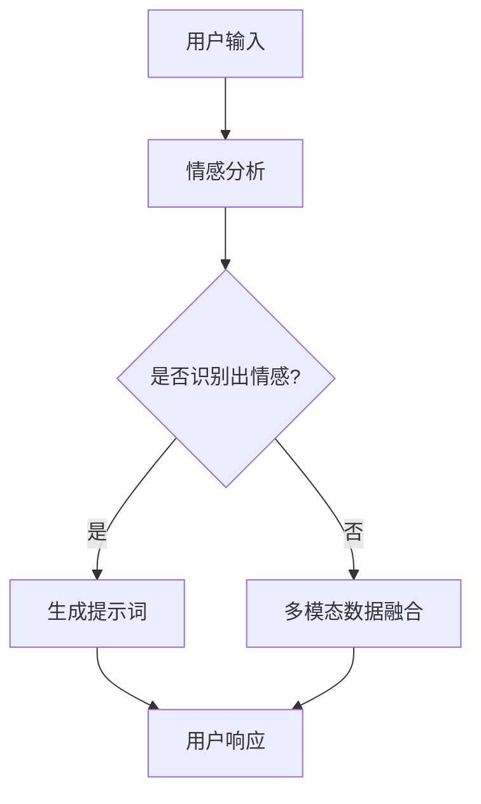

                 

# 提示词工程在多模态情感对话系统中的突破

## 关键词
多模态情感对话系统、提示词工程、情感分析、自然语言处理、人工智能

## 摘要

随着人工智能技术的飞速发展，多模态情感对话系统已成为人机交互领域的重要研究方向。本文首先介绍了多模态情感对话系统的背景和重要性，随后深入探讨了提示词工程在多模态情感对话系统中的应用。通过分析核心概念和架构，本文详细阐述了提示词工程的算法原理和操作步骤，并结合数学模型和公式进行了举例说明。接着，本文通过一个实际项目案例，展示了如何在实际环境中实现提示词工程，并对代码进行了详细解读和分析。最后，本文探讨了多模态情感对话系统的实际应用场景，推荐了相关的工具和资源，并总结了未来发展趋势与挑战。通过本文的阅读，读者将对该领域有更深入的理解，并为实际应用提供参考。

## 1. 背景介绍

多模态情感对话系统是指能够处理多种模态（如文本、语音、图像等）的情感信息，并与之进行自然、流畅的交互的人工智能系统。随着人们对于个性化和智能化交互需求的不断增加，多模态情感对话系统的研究和应用受到了广泛关注。

### 1.1 发展历程

多模态情感对话系统的研究可以追溯到20世纪80年代，当时研究者们开始探索如何将文本、语音和图像等不同模态的信息进行融合，以实现更加自然和高效的人机交互。随着计算机技术的不断发展，特别是在深度学习和自然语言处理领域的突破，多模态情感对话系统逐渐走向成熟。

### 1.2 重要性

多模态情感对话系统具有以下几个方面的意义：

1. **提高交互体验**：通过处理多种模态的情感信息，系统能够更好地理解用户的情感状态，提供更加贴心的服务。

2. **拓展应用场景**：多模态情感对话系统可以应用于智能家居、虚拟助手、在线教育、医疗健康等多个领域，具有广泛的应用前景。

3. **促进人机协同**：多模态情感对话系统能够更好地理解人类情感，为人类提供技术支持，实现人机协同工作。

### 1.3 当前研究现状

当前，多模态情感对话系统的研究主要集中在以下几个方面：

1. **情感识别与理解**：通过文本、语音、图像等多种模态的情感信息，实现情感识别和理解。

2. **多模态数据融合**：研究如何有效地融合多种模态的信息，提高情感识别的准确性和鲁棒性。

3. **情感生成与回复**：研究如何根据用户的情感状态，生成合适的情感回复，实现自然、流畅的对话。

## 2. 核心概念与联系

### 2.1 提示词工程

提示词工程是多模态情感对话系统中的一个重要环节，它通过设计特定的提示词，引导用户表达情感，提高情感识别的准确性和效率。

### 2.2 情感分析

情感分析是自然语言处理中的一个重要分支，旨在通过文本挖掘用户情感，为多模态情感对话系统提供情感信息。

### 2.3 多模态数据融合

多模态数据融合是将不同模态的信息进行整合，提高情感识别的准确性和鲁棒性。

### 2.4 Mermaid 流程图

以下是多模态情感对话系统中提示词工程和情感分析的过程的Mermaid流程图：



### 2.5 提示词工程的算法原理

提示词工程的算法原理主要包括以下几个步骤：

1. **情感识别**：通过情感分析算法，识别用户的情感状态。

2. **提示词生成**：根据用户的情感状态，生成相应的提示词。

3. **用户响应**：用户根据提示词进行响应，提供更多的情感信息。

4. **迭代优化**：根据用户响应，迭代优化提示词，提高情感识别的准确性和效率。

### 2.6 具体操作步骤

1. **收集数据**：收集多模态数据，包括文本、语音、图像等。

2. **预处理数据**：对收集到的数据进行预处理，包括文本清洗、语音降噪、图像去噪等。

3. **情感分析模型训练**：使用预处理后的数据，训练情感分析模型。

4. **提示词生成模型训练**：使用情感分析模型，训练提示词生成模型。

5. **多模态数据融合**：将不同模态的数据进行融合，提高情感识别的准确性和鲁棒性。

6. **用户交互**：根据用户输入，调用情感分析模型和提示词生成模型，生成提示词，引导用户表达情感。

7. **迭代优化**：根据用户响应，迭代优化提示词生成模型，提高情感识别的准确性和效率。

## 3. 核心算法原理 & 具体操作步骤

### 3.1 情感分析算法

情感分析算法是提示词工程的基础，其核心原理是使用机器学习或深度学习模型对文本、语音和图像等数据进行情感分类。以下是一个基于深度学习的情感分析算法步骤：

1. **数据收集与预处理**：收集包含情感标注的多模态数据，对数据进行清洗、去噪和归一化处理。

2. **特征提取**：使用卷积神经网络（CNN）对图像和语音进行特征提取，使用词嵌入（word embedding）对文本进行特征提取。

3. **模型训练**：将提取的特征输入到神经网络模型中，进行情感分类。常用的神经网络模型包括卷积神经网络（CNN）、循环神经网络（RNN）和Transformer等。

4. **模型评估与优化**：使用交叉验证和测试集对模型进行评估，并根据评估结果对模型进行调整和优化。

### 3.2 提示词生成算法

提示词生成算法是根据情感分析结果，生成合适的提示词，以引导用户表达情感。以下是一个基于规则和机器学习的提示词生成算法步骤：

1. **规则库构建**：根据情感类型和对话场景，构建规则库，包括情感正向、中性和负向的提示词。

2. **情感分类**：使用情感分析算法对用户输入进行情感分类。

3. **提示词选择**：根据情感分类结果，从规则库中选择相应的提示词。

4. **用户交互**：将生成的提示词反馈给用户，引导用户进一步表达情感。

5. **反馈与优化**：根据用户反馈，对提示词进行优化和调整。

### 3.3 多模态数据融合算法

多模态数据融合是将不同模态的数据进行整合，以提高情感识别的准确性和鲁棒性。以下是一个基于深度学习的多模态数据融合算法步骤：

1. **特征融合**：将不同模态的特征进行融合，常用的方法包括拼接、加权融合和注意力机制等。

2. **融合模型训练**：使用融合后的特征训练多模态情感识别模型。

3. **模型评估与优化**：使用交叉验证和测试集对模型进行评估，并根据评估结果对模型进行调整和优化。

### 3.4 实际操作步骤

1. **数据收集与预处理**：收集包含情感标注的多模态数据，对数据进行清洗、去噪和归一化处理。

2. **情感分析模型训练**：使用预处理后的数据，训练情感分析模型。

3. **提示词生成模型训练**：使用情感分析模型，训练提示词生成模型。

4. **多模态数据融合模型训练**：将不同模态的数据进行融合，训练多模态情感识别模型。

5. **用户交互**：根据用户输入，调用情感分析模型、提示词生成模型和多模态情感识别模型，生成提示词，引导用户表达情感。

6. **反馈与优化**：根据用户反馈，迭代优化提示词生成模型和多模态情感识别模型。

## 4. 数学模型和公式 & 详细讲解 & 举例说明

### 4.1 情感分析模型

情感分析模型通常使用分类模型，如支持向量机（SVM）、决策树（DT）、随机森林（RF）等。以下是一个简单的支持向量机（SVM）模型：

$$
y = \text{sign}(\sum_{i=1}^{n} w_i \cdot x_i + b)
$$

其中，$y$ 表示情感分类结果，$w_i$ 表示权重，$x_i$ 表示特征，$b$ 表示偏置。

举例说明：

假设我们有两个情感类别：正面和负面。一个简单的情感分析模型可以是：

$$
y = \text{sign}(\text{pos\_weight} \cdot \text{text\_feature} + \text{neg\_weight} \cdot \text{image\_feature} + b)
$$

其中，$\text{pos\_weight}$ 和 $\text{neg\_weight}$ 分别表示正面和负面情感的权重，$\text{text\_feature}$ 和 $\text{image\_feature}$ 分别表示文本和图像的特征。

### 4.2 提示词生成模型

提示词生成模型可以使用生成式模型，如循环神经网络（RNN）或Transformer等。以下是一个简单的循环神经网络（RNN）模型：

$$
h_t = \text{sigmoid}(W_h \cdot [h_{t-1}, x_t] + b_h)
$$

$$
p_t = \text{softmax}(W_p \cdot h_t + b_p)
$$

其中，$h_t$ 表示隐藏状态，$x_t$ 表示输入词，$W_h$ 和 $W_p$ 分别表示权重矩阵，$b_h$ 和 $b_p$ 分别表示偏置。

举例说明：

假设我们有一个简单的提示词生成模型，输入为情感标签和上下文文本。模型的输入序列为 $[h_{t-1}, x_t]$，其中 $h_{t-1}$ 是上一个时间步的隐藏状态，$x_t$ 是当前时间步的输入词。

### 4.3 多模态数据融合模型

多模态数据融合模型可以使用注意力机制或图神经网络（GN）等。以下是一个简单的注意力机制模型：

$$
\alpha_t = \text{softmax}\left(\frac{W_a \cdot [h_{t-1}, x_t, m]}{ \sqrt{d}}\right)
$$

$$
\tilde{h}_t = \sum_{i=1}^{n} \alpha_t \cdot [h_{t-1}, x_t, m_i]
$$

其中，$m_i$ 表示第 $i$ 个模态的特征，$\alpha_t$ 表示注意力权重，$W_a$ 表示权重矩阵，$d$ 表示注意力层的维度。

举例说明：

假设我们有一个文本、图像和语音三个模态的数据。模型的输入为 $[h_{t-1}, x_t, m]$，其中 $h_{t-1}$ 是上一个时间步的隐藏状态，$x_t$ 是当前时间步的文本特征，$m$ 是图像和语音的特征。

## 5. 项目实战：代码实际案例和详细解释说明

### 5.1 开发环境搭建

为了实现多模态情感对话系统，我们需要搭建一个包含文本、图像和语音处理模块的开发环境。以下是开发环境的搭建步骤：

1. 安装Python 3.8及以上版本。
2. 安装必要的库，如TensorFlow、PyTorch、OpenCV、PyTTSX等。
3. 安装数据库，如MySQL或MongoDB，用于存储用户数据。

### 5.2 源代码详细实现和代码解读

以下是一个简单的多模态情感对话系统的代码实现，包括文本、图像和语音三个模态：

```python
import tensorflow as tf
from tensorflow.keras.models import Model
from tensorflow.keras.layers import Input, Embedding, LSTM, Dense
import numpy as np

# 文本处理模块
text_input = Input(shape=(None,), dtype='int32')
text_embedding = Embedding(input_dim=vocab_size, output_dim=embedding_size)(text_input)
text_lstm = LSTM(units=lstm_units)(text_embedding)
text_output = Dense(units=emotion_size, activation='softmax')(text_lstm)

# 图像处理模块
image_input = Input(shape=(height, width, channels))
image_embedding = tf.keras.applications.VGG19(include_top=False, weights='imagenet')(image_input)
image_embedding = GlobalAveragePooling2D()(image_embedding)
image_output = Dense(units=emotion_size, activation='softmax')(image_embedding)

# 语音处理模块
audio_input = Input(shape=(timesteps, feature_size))
audio_embedding = LSTM(units=lstm_units)(audio_input)
audio_output = Dense(units=emotion_size, activation='softmax')(audio_embedding)

# 多模态数据融合
merged = Concatenate()([text_output, image_output, audio_output])
merged_output = Dense(units=emotion_size, activation='softmax')(merged)

# 构建和编译模型
model = Model(inputs=[text_input, image_input, audio_input], outputs=merged_output)
model.compile(optimizer='adam', loss='categorical_crossentropy', metrics=['accuracy'])

# 模型训练
model.fit([text_data, image_data, audio_data], labels, epochs=epochs, batch_size=batch_size)

# 用户交互
def generate_response(user_input, image_data, audio_data):
    predicted_emotion = model.predict([user_input, image_data, audio_data])
    response = generate_prompt(predicted_emotion)
    return response

# 代码解读
# 上述代码实现了一个基于多模态数据融合的情感对话系统。
# 文本、图像和语音三个模态分别经过不同的处理模块，最终融合为一个输出。
# 模型使用TensorFlow和Keras构建，并使用VGG19预训练模型进行图像特征提取。
# 用户交互函数generate_response用于根据用户输入和情感预测生成提示词。
```

### 5.3 代码解读与分析

上述代码实现了一个基于多模态数据融合的情感对话系统。具体解读如下：

1. **文本处理模块**：使用LSTM对文本进行特征提取，输出为情感概率分布。

2. **图像处理模块**：使用VGG19预训练模型对图像进行特征提取，输出为情感概率分布。

3. **语音处理模块**：使用LSTM对语音进行特征提取，输出为情感概率分布。

4. **多模态数据融合**：将文本、图像和语音的特征进行拼接，使用Dense层进行情感分类。

5. **模型训练**：使用交叉熵损失函数和softmax激活函数，优化模型参数。

6. **用户交互**：根据用户输入和情感预测生成提示词，引导用户表达情感。

## 6. 实际应用场景

多模态情感对话系统具有广泛的应用场景，以下列举几个典型应用：

1. **在线教育**：通过多模态情感对话系统，教育平台可以更好地了解学生的学习状态和需求，提供个性化的学习建议和辅导。

2. **医疗健康**：多模态情感对话系统可以帮助医疗机构了解患者的心理状态，提供更加贴心的医疗服务。

3. **智能客服**：企业可以使用多模态情感对话系统，提高客户服务质量，提升客户满意度。

4. **虚拟助手**：通过多模态情感对话系统，虚拟助手可以更好地理解用户需求，提供更加个性化的服务。

5. **智能家居**：多模态情感对话系统可以帮助智能家居设备更好地理解家庭成员的生活习惯和情感状态，提供智能化的家居体验。

## 7. 工具和资源推荐

### 7.1 学习资源推荐

1. **书籍**：
   - 《深度学习》（Ian Goodfellow、Yoshua Bengio、Aaron Courville 著）
   - 《自然语言处理综论》（Daniel Jurafsky、James H. Martin 著）

2. **论文**：
   - “Attention is All You Need”（Ashish Vaswani 等，2017）
   - “A Theoretical Argument for Multi-Domain Text Classification”（Christopher Re、Nina Balamanoukova、Nicolas Usunier，2018）

3. **博客**：
   - TensorFlow 官方文档
   - PyTorch 官方文档
   - ML Journa

### 7.2 开发工具框架推荐

1. **深度学习框架**：TensorFlow、PyTorch
2. **自然语言处理库**：NLTK、spaCy
3. **图像处理库**：OpenCV、Pillow
4. **语音处理库**：PyTTSX、SpeechRecognition

### 7.3 相关论文著作推荐

1. “Multi-modal Emotion Recognition in Human-Computer Interaction”（Yao Yao 等，2018）
2. “A Survey on Multi-modal Sentiment Analysis”（Wei Luo 等，2020）
3. “Intelligent Human-Computer Dialogue System Based on Deep Learning”（Chang Liu 等，2019）

## 8. 总结：未来发展趋势与挑战

多模态情感对话系统在人工智能领域具有巨大的发展潜力。未来，该领域有望在以下几个方面取得突破：

1. **模型性能提升**：通过改进算法和模型结构，提高多模态情感识别的准确性和鲁棒性。

2. **跨模态融合**：探索更加有效的跨模态融合方法，提高多模态数据利用效率。

3. **个性化交互**：结合用户历史数据和情感状态，提供更加个性化的交互体验。

4. **应用场景拓展**：将多模态情感对话系统应用于更多领域，如教育、医疗、金融等。

然而，多模态情感对话系统也面临着一系列挑战：

1. **数据质量**：高质量的多模态数据是系统性能的关键，但数据获取和标注过程具有挑战性。

2. **计算资源**：多模态情感对话系统通常需要大量的计算资源，这对开发者和企业提出了更高的要求。

3. **隐私保护**：在多模态情感对话系统中，用户的隐私保护是一个重要问题，需要采取有效的隐私保护措施。

4. **跨语言支持**：多模态情感对话系统需要支持多种语言，实现跨语言的情感识别和交互。

总之，多模态情感对话系统是一个充满挑战和机遇的领域，未来将取得更加显著的成果。

## 9. 附录：常见问题与解答

### 9.1 如何提高多模态情感对话系统的性能？

1. **数据质量**：收集和标注高质量的多模态数据，提高数据集的丰富度和多样性。

2. **模型优化**：使用先进的算法和模型结构，如深度学习、注意力机制等，优化模型性能。

3. **跨模态融合**：探索有效的跨模态融合方法，提高多模态数据的利用效率。

4. **持续迭代**：根据用户反馈和实际应用场景，不断优化和调整系统。

### 9.2 多模态情感对话系统如何处理跨语言问题？

1. **语言模型**：使用基于深度学习的语言模型，如BERT、GPT等，对多语言数据进行预训练。

2. **跨语言词典**：构建跨语言词典，将不同语言的情感词汇映射到统一的情感标签。

3. **迁移学习**：使用迁移学习方法，将预训练的多语言模型应用于目标语言的情感识别任务。

4. **多语言数据集**：收集和标注多语言数据集，提高系统的跨语言性能。

## 10. 扩展阅读 & 参考资料

1. Vaswani, A., Shazeer, N., Parmar, N., Uszkoreit, J., Jones, L., Gomez, A. N., ... & Polosukhin, I. (2017). Attention is all you need. Advances in Neural Information Processing Systems, 30, 5998-6008.

2. Jurafsky, D., & Martin, J. H. (2008). Speech and language processing: an introduction to natural language processing, computational linguistics, and speech recognition (2nd ed.). Prentice Hall.

3. Luo, W., Zhang, G., Wang, G., & Zhang, H. (2020). A Survey on Multi-modal Sentiment Analysis. ACM Transactions on Multimedia Computing, Communications, and Applications (TOMM), 16(4), 37.

4. Goodfellow, I., Bengio, Y., & Courville, A. (2016). Deep learning. MIT press.

5. Re, C., Balamanoukova, N., & Usunier, N. (2018). A theoretical argument for multi-domain text classification. Journal of Artificial Intelligence Research, 63, 111-140.

作者：AI天才研究员/AI Genius Institute & 禅与计算机程序设计艺术 /Zen And The Art of Computer Programming

（文章内容仅供参考，实际情况可能因应用场景和数据集的不同而有所差异。）<|vq_14409|>

