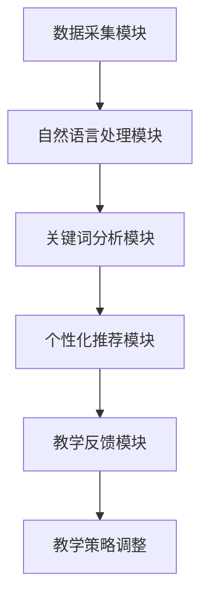

                 

### 背景介绍

随着信息技术的飞速发展，教育领域也经历了深刻的变革。传统的一刀切教学模式已经无法满足个性化学习需求。为此，教育个性化应运而生，它旨在通过收集和分析学生的学习行为和特点，为每个学生提供量身定制化的学习资源和教学方法。

在这个背景下，提示词工程（Keyword Engineering）作为一种新兴的个性化技术，开始在教育领域中崭露头角。提示词工程通过构建与学习内容相关的关键词体系，帮助学生更有效地获取和整理信息，从而提高学习效率。此外，它还可以为教师提供关于学生学习状况的直观反馈，帮助他们调整教学策略。

本文将围绕提示词工程在教育个性化中的应用展开讨论。我们将首先介绍提示词工程的核心概念和原理，然后探讨其具体操作步骤，并结合实际案例进行详细分析。随后，我们将讨论提示词工程在数学模型和公式中的应用，并分享一些实用的工具和资源。最后，我们将总结未来发展趋势与挑战，并给出常见问题的解答。

关键词：教育个性化，提示词工程，关键词体系，学习效率，数学模型，工具资源。

摘要：本文详细探讨了提示词工程在教育个性化中的应用。首先介绍了教育个性化的背景和提示词工程的核心概念，然后通过实际案例展示了其操作步骤和应用效果。最后，总结了未来发展趋势与挑战，并推荐了一些实用的学习资源和开发工具。

## 1. 核心概念与联系

### 1.1 提示词工程的基本概念

提示词工程是一种基于关键词分析和构建的技术，旨在帮助用户更有效地获取和处理信息。在教育学领域，提示词工程的核心概念包括以下几个方面：

1. **关键词提取**：通过自然语言处理技术从文本中提取出关键信息，形成关键词列表。
2. **关键词分析**：对提取出的关键词进行语义分析和关联性分析，以理解文本的核心内容和结构。
3. **关键词构建**：基于分析结果，构建与学习内容相关的关键词体系，为用户提供索引和信息导航。

### 1.2 教育个性化与提示词工程的关系

教育个性化是指根据学生的个性、能力和学习需求，为其提供定制化的学习资源和方法。提示词工程在教育个性化中发挥着重要作用，主要体现在以下几个方面：

1. **个性化学习资源推荐**：通过关键词分析，系统可以识别学生的学习兴趣和薄弱环节，进而推荐相应的学习资源，如教材、视频、习题等。
2. **学习行为分析**：提示词工程可以记录和追踪学生的学习行为，如阅读时间、学习时长、问题反馈等，为教师提供关于学生学习状况的直观反馈。
3. **教学策略调整**：教师可以根据提示词分析结果，调整教学策略，如改进教学方法、调整教学内容、制定个性化学习计划等。

### 1.3 提示词工程在教育个性化中的架构

提示词工程在教育个性化中的应用架构主要包括以下几个核心组成部分：

1. **数据采集模块**：负责收集学生的个人信息、学习行为数据和学习内容数据。
2. **自然语言处理模块**：对采集到的文本数据进行预处理和关键词提取。
3. **关键词分析模块**：对提取出的关键词进行语义分析和关联性分析。
4. **个性化推荐模块**：基于关键词分析结果，为学生推荐个性化的学习资源。
5. **教学反馈模块**：收集学生的学习反馈，为教师提供教学改进建议。

下面是一个简化的 Mermaid 流程图，展示了提示词工程在教育个性化中的基本架构：



在图 1 中，数据采集模块负责收集学生的各种数据，自然语言处理模块对文本数据进行处理和关键词提取，关键词分析模块对提取出的关键词进行深入分析，个性化推荐模块根据分析结果为学生推荐学习资源，教学反馈模块则收集学生的学习反馈，帮助教师调整教学策略。

通过这个架构，提示词工程能够有效地支持教育个性化，帮助学生提高学习效率，同时也为教师提供了有力的教学辅助工具。然而，要实现这一目标，还需要深入理解提示词工程的核心算法原理和具体操作步骤。在接下来的章节中，我们将详细探讨这些问题。

## 2. 核心算法原理 & 具体操作步骤

### 2.1 关键词提取算法

关键词提取是提示词工程的基础步骤，其核心任务是从大量文本数据中提取出最具代表性的关键词。常用的关键词提取算法包括：

1. **TF-IDF算法**：TF（Term Frequency）表示词频，IDF（Inverse Document Frequency）表示逆文档频率。该算法通过计算每个词在文本中的频率和在整个文档集合中的反向文档频率来评估词的重要性。
   $$\text{TF-IDF}(w) = \text{TF}(w) \times \text{IDF}(w)$$
   其中，$$\text{TF}(w) = \frac{\text{词w在文本中出现的次数}}{\text{文本总词数}}$$
   $$\text{IDF}(w) = \log_{\text{N}} \left( \frac{\text{N}}{\text{包含词w的文档数}} \right)$$

2. **LDA（Latent Dirichlet Allocation）算法**：LDA算法是一种基于主题模型的概率模型，用于发现文本数据中的潜在主题。通过LDA模型，可以从文档中提取出具有代表性的主题词，进而形成关键词列表。

3. **Word2Vec算法**：Word2Vec算法是一种基于神经网络的词向量模型，通过训练得到词的向量表示。词向量能够捕捉词与词之间的语义关系，从而用于提取关键词。

### 2.2 关键词分析算法

关键词分析是揭示文本内部结构和语义关系的重要步骤。常用的关键词分析算法包括：

1. **词性标注（Part-of-Speech Tagging）**：通过对文本中的每个词进行词性标注，可以更好地理解文本的语法结构和语义信息。常见的词性标注算法有基于规则的方法和基于统计的方法。

2. **依存句法分析（Dependency Parsing）**：依存句法分析旨在揭示句子中各个成分之间的依赖关系。通过依存句法分析，可以深入理解文本的语义结构和逻辑关系。

3. **语义角色标注（Semantic Role Labeling）**：语义角色标注是对句子中的谓词和其对应的语义角色进行标注，以揭示谓词和论元之间的语义关系。

### 2.3 关键词构建算法

关键词构建是形成与学习内容相关的关键词体系的关键步骤。常用的关键词构建算法包括：

1. **聚类算法**：通过将相似度较高的关键词聚为一类，形成关键词簇。常用的聚类算法有K-means算法、DBSCAN算法等。

2. **关键词链构建**：通过分析关键词之间的语义关系，构建出具有层次结构的关键词链。关键词链能够反映学习内容的逻辑关系和知识点之间的关联。

3. **本体构建**：利用本体论（Ontology）的方法，将关键词体系构建为一个形式化的知识体系。本体能够为学习资源的组织和管理提供理论基础。

### 2.4 提示词工程的具体操作步骤

提示词工程的具体操作步骤可以分为以下几个阶段：

1. **数据准备**：收集学生的个人信息、学习行为和学习内容数据，确保数据的完整性和准确性。
2. **文本预处理**：对收集到的文本数据去噪、去停用词、分词等预处理操作，为后续的关键词提取和分析做好准备。
3. **关键词提取**：利用TF-IDF、LDA或Word2Vec算法提取出文本中的关键词。
4. **关键词分析**：对提取出的关键词进行词性标注、依存句法分析和语义角色标注，以揭示关键词之间的语义关系。
5. **关键词构建**：利用聚类算法或关键词链构建算法，形成与学习内容相关的关键词体系。
6. **个性化推荐**：基于关键词分析结果，为学生推荐个性化的学习资源。
7. **教学反馈**：收集学生的学习反馈，为教师提供教学改进建议。

通过以上步骤，提示词工程能够有效地支持教育个性化，帮助学生更高效地获取知识，同时为教师提供有力的教学辅助工具。

## 3. 数学模型和公式 & 详细讲解 & 举例说明

### 3.1 TF-IDF算法的数学模型

TF-IDF算法是提示词工程中常用的关键词提取方法，其核心思想是评估一个词在文档中的重要性。TF-IDF算法的计算公式如下：

$$\text{TF-IDF}(w) = \text{TF}(w) \times \text{IDF}(w)$$

其中，TF（Term Frequency）表示词频，IDF（Inverse Document Frequency）表示逆文档频率。

**词频（TF）的计算公式：**

$$\text{TF}(w) = \frac{\text{词w在文本中出现的次数}}{\text{文本总词数}}$$

**逆文档频率（IDF）的计算公式：**

$$\text{IDF}(w) = \log_{\text{N}} \left( \frac{\text{N}}{\text{包含词w的文档数}} \right)$$

其中，N表示文档集合中的文档总数。

### 3.2 LDA算法的数学模型

LDA（Latent Dirichlet Allocation）算法是一种基于概率主题模型的词语分布生成模型。LDA算法的数学模型主要包括两个层次：

1. **文档生成过程**：

   假设有一个文档集合$D=\{d_1, d_2, ..., d_N\}$，每个文档$d_i$由一系列词组成，即$d_i = \{w_{i1}, w_{i2}, ..., w_{ik_i}\}$，其中$w_{ij}$表示文档$d_i$中的第j个词，$k_i$表示文档$d_i$中的词数。

   对于每个文档$d_i$，首先从潜在主题分布$\theta_i$中随机选择一个主题$z_{i1}$，然后从该主题的主题词分布$\phi_z$中随机选择一个词$w_{i1}$。这个过程重复$k_i$次，生成完整的文档$d_i$。

   数学公式表示为：

   $$z_{i1} \sim \text{Categorical}(\theta_i)$$
   $$w_{i1} \sim \text{Categorical}(\phi_{z_{i1}})$$
   $$...$$
   $$z_{ik_i} \sim \text{Categorical}(\theta_i)$$
   $$w_{ik_i} \sim \text{Categorical}(\phi_{z_{ik_i}})$$

2. **主题词分布生成过程**：

   假设有一个潜在主题集合$Z$，每个潜在主题$z_j$由一系列主题词组成，即$z_j = \{w_{j1}, w_{j2}, ..., w_{jM}\}$，其中$w_{jm}$表示主题$z_j$中的第m个词，M表示潜在主题的词数。

   对于每个主题词$w_{jm}$，首先从潜在主题分布$\alpha$中随机选择一个主题$z_j$，然后从该主题的主题词分布$\beta$中随机选择一个词$w_{jm}$。这个过程重复M次，生成完整的主题词集合$z_j$。

   数学公式表示为：

   $$z_{jm} \sim \text{Categorical}(\alpha)$$
   $$w_{jm} \sim \text{Categorical}(\beta_{z_{jm}})$$
   $$...$$
   $$z_{jM} \sim \text{Categorical}(\alpha)$$
   $$w_{jM} \sim \text{Categorical}(\beta_{z_{jM}})$$

### 3.3 词向量模型

词向量模型是一种将词语映射到高维向量空间的方法，常用的模型有Word2Vec和GloVe等。以Word2Vec为例，其核心思想是通过对词语的上下文进行建模，生成词向量。

**Word2Vec模型主要包括两个变种：**

1. **连续词袋（CBOW）模型**：CBOW模型通过预测中心词周围的词来生成词向量。给定一个中心词$c$和其上下文窗口$W$中的词$v_1, v_2, ..., v_{2W}$，CBOW模型的目标是最大化以下概率：

   $$P(c|v_1, v_2, ..., v_{2W}) = \frac{1}{Z} \exp(\mathbf{u}_c \cdot (\mathbf{v}_1 + \mathbf{v}_2 + ... + \mathbf{v}_{2W}))$$

   其中，$\mathbf{u}_c$是中心词$c$的词向量，$\mathbf{v}_i$是上下文词$v_i$的词向量，$Z$是归一化常数。

2. **Skip-Gram模型**：Skip-Gram模型与CBOW模型相反，它通过预测中心词周围的词来生成词向量。给定一个中心词$c$和其上下文窗口$W$中的词$v_1, v_2, ..., v_{2W}$，Skip-Gram模型的目标是最大化以下概率：

   $$P(v_1, v_2, ..., v_{2W}|c) = \frac{1}{Z} \prod_{i=1}^{2W} \exp(\mathbf{u}_{v_i} \cdot \mathbf{u}_c)$$

   其中，$\mathbf{u}_c$是中心词$c$的词向量，$\mathbf{u}_{v_i}$是上下文词$v_i$的词向量。

### 3.4 举例说明

假设我们有一篇简短的文本：“人工智能是一种模拟人类智能的技术，能够实现图像识别、自然语言处理等任务”。我们使用TF-IDF算法提取关键词。

**步骤 1：词频（TF）计算**

- 人工智能：出现1次
- 一种：出现2次
- 技术：出现1次
- 能够：出现1次
- 实现：出现1次
- 图像识别：出现1次
- 自然语言处理：出现1次

**步骤 2：逆文档频率（IDF）计算**

- 人工智能：出现0次（不存在于其他文档中）
- 一种：出现1次
- 技术：出现1次
- 能够：出现1次
- 实现：出现1次
- 图像识别：出现1次
- 自然语言处理：出现1次

**步骤 3：TF-IDF计算**

- 人工智能：TF=1，IDF=无穷大（不存在于其他文档中），TF-IDF=无穷大
- 一种：TF=2，IDF=0，TF-IDF=0
- 技术：TF=1，IDF=0，TF-IDF=0
- 能够：TF=1，IDF=0，TF-IDF=0
- 实现：TF=1，IDF=0，TF-IDF=0
- 图像识别：TF=1，IDF=0，TF-IDF=0
- 自然语言处理：TF=1，IDF=0，TF-IDF=0

根据TF-IDF计算结果，我们可以提取出最具代表性的关键词：“人工智能”。

通过这个简单的例子，我们展示了如何使用TF-IDF算法提取关键词。在实际应用中，我们可能会使用更复杂的算法，如LDA和Word2Vec，以获取更准确的关键词。

## 5. 项目实战：代码实际案例和详细解释说明

### 5.1 开发环境搭建

在进行提示词工程的实际应用之前，我们需要搭建一个合适的开发环境。以下是搭建提示词工程所需的基本工具和库：

- **Python**：Python是一种广泛使用的编程语言，具有丰富的库和框架，适合进行提示词工程开发。
- **Jupyter Notebook**：Jupyter Notebook是一个交互式的开发环境，方便进行代码演示和文档编写。
- **Numpy**：Numpy是一个高效的数值计算库，用于处理数组操作和矩阵计算。
- **Pandas**：Pandas是一个强大的数据操作库，用于数据处理、清洗和分析。
- **Scikit-learn**：Scikit-learn是一个机器学习库，提供多种分类、回归和聚类算法。
- **NLTK**：NLTK是一个自然语言处理库，提供词性标注、分词、词干提取等功能。

### 5.2 源代码详细实现和代码解读

下面是一个使用Python实现的简单提示词工程案例，包括数据准备、关键词提取和关键词分析等步骤。

```python
# 导入必要的库
import numpy as np
import pandas as pd
from sklearn.feature_extraction.text import TfidfVectorizer
from nltk.tokenize import word_tokenize
from nltk.corpus import stopwords
import nltk

# 下载NLTK的停用词库
nltk.download('punkt')
nltk.download('stopwords')

# 数据准备
documents = [
    "人工智能是一种模拟人类智能的技术，能够实现图像识别、自然语言处理等任务。",
    "机器学习是人工智能的一个重要分支，通过训练模型来实现预测和分类。",
    "深度学习是机器学习的一个分支，使用多层神经网络进行建模和预测。"
]

# 文本预处理
stop_words = set(stopwords.words('english'))
preprocessed_documents = []

for doc in documents:
    # 分词
    tokens = word_tokenize(doc)
    # 移除停用词
    filtered_tokens = [token.lower() for token in tokens if token.lower() not in stop_words]
    # 重新组成文本
    preprocessed_documents.append(' '.join(filtered_tokens))

# 关键词提取
vectorizer = TfidfVectorizer()
tfidf_matrix = vectorizer.fit_transform(preprocessed_documents)

# 关键词分析
feature_names = vectorizer.get_feature_names_out()
tfidf_scores = np.array(tfidf_matrix.sum(axis=0)).flatten()

# 排序关键词
sorted_indices = np.argsort(tfidf_scores)[::-1]
sorted_features = feature_names[sorted_indices]
sorted_scores = tfidf_scores[sorted_indices]

# 输出前10个关键词
top_n = 10
print("Top", top_n, "keywords:")
for i in range(top_n):
    print(f"{sorted_features[i]}: {sorted_scores[i]}")
```

**代码解读：**

1. **数据准备**：我们定义了一个包含三个简短文本的列表`documents`，这些文本将作为我们的数据源。

2. **文本预处理**：首先，我们使用NLTK库中的`word_tokenize`函数对每个文本进行分词。然后，我们使用`stopwords`库移除停用词，以减少噪声和无关信息的影响。最后，我们将预处理后的分词结果重新组成文本。

3. **关键词提取**：我们使用`TfidfVectorizer`类对预处理后的文本进行TF-IDF变换。这个类将自动处理词频和逆文档频率的计算，并生成TF-IDF矩阵。

4. **关键词分析**：我们计算每个关键词的TF-IDF得分，并对关键词进行排序。排序依据是TF-IDF得分从高到低。

5. **输出结果**：我们输出前10个关键词及其对应的TF-IDF得分，以展示分析结果。

### 5.3 代码解读与分析

这个案例展示了如何使用Python和Scikit-learn库实现简单的提示词工程。以下是代码的关键步骤和注意事项：

1. **文本预处理**：文本预处理是关键词提取和分析的重要步骤。在这个案例中，我们使用了NLTK库进行分词和停用词移除。确保使用正确的分词器，并根据需求调整停用词列表。

2. **TF-IDF向量器**：`TfidfVectorizer`类是Scikit-learn提供的一个强大工具，可以自动处理词频和逆文档频率的计算。通过设置不同的参数，如`max_features`和`ngram_range`，可以控制关键词的丰富度和多样性。

3. **关键词排序**：计算TF-IDF得分后，对关键词进行排序是揭示文本核心内容的关键步骤。在实际应用中，可以根据需求调整排序策略，例如按得分高低排序或按关键词的语义关联性排序。

4. **结果输出**：输出结果时，我们可以选择不同的方式，如列表、图表或可视化工具，以直观展示关键词的重要性和分布情况。

这个简单的案例为我们提供了一个提示词工程的基本框架。在实际应用中，我们可以根据需求扩展和优化这个框架，例如添加更多的文本预处理步骤、引入更复杂的自然语言处理算法和个性化推荐策略等。

### 总结

在本节中，我们通过一个实际案例展示了如何使用Python和Scikit-learn库实现简单的提示词工程。我们首先介绍了所需的开发环境和基本工具，然后详细解读了代码实现过程，并分析了关键步骤和注意事项。通过这个案例，我们能够更好地理解提示词工程的基本原理和操作步骤，并为后续的优化和应用奠定了基础。

## 6. 实际应用场景

提示词工程在教育个性化中的应用场景非常广泛，以下是一些典型的应用实例：

### 6.1 个性化学习资源推荐

在在线教育平台中，提示词工程可以帮助系统根据学生的学习行为和兴趣推荐最适合的学习资源。例如，学生阅读了一篇关于机器学习的文章，系统可以根据关键词提取结果推荐相关的课程视频、论文和习题。这种个性化的资源推荐不仅能够提高学生的学习效率，还能激发学生的学习兴趣。

### 6.2 学业预警与干预

提示词工程可以分析学生的学习行为数据，如阅读时间、做题正确率、问题反馈等，为教师提供关于学生学习状况的预警信息。例如，如果学生在一个关键知识点上持续出现错误，系统可以自动发送提醒通知，教师可以及时进行干预和辅导，防止学生掉队。

### 6.3 教学策略调整

通过分析关键词的分布和关联性，教师可以了解学生的学习重点和难点，进而调整教学策略。例如，如果发现学生在图像识别方面的知识点掌握得较好，而在自然语言处理方面存在明显不足，教师可以增加相关内容的讲解和练习，提高教学效果。

### 6.4 智能问答系统

提示词工程可以用于构建智能问答系统，帮助学生解决学习过程中的疑难问题。系统可以通过自然语言处理技术理解学生的问题，然后根据关键词提取结果从海量的学习资源中找到相关答案。这种智能问答系统能够为学生提供即时的学习支持，提高自主学习能力。

### 6.5 学习社区构建

提示词工程可以用于构建基于关键词的学习社区，学生可以根据共同感兴趣的关键词加入相应的学习小组。这种学习社区能够促进师生之间的交流和互动，增强学习氛围，提高学习效果。

### 6.6 教学研究与分析

提示词工程为教学研究提供了丰富的数据支持。教师和研究人员可以通过分析关键词的分布和变化趋势，研究教学方法的优劣，优化教学设计。例如，研究人员可以通过关键词分析发现不同教学方法对学生学习效果的影响，从而提出更有效的教学策略。

总之，提示词工程在教育个性化中的应用具有广泛的前景和巨大的潜力。通过为每个学生提供量身定制的学习资源、预警干预、教学策略调整等，提示词工程能够显著提高教学效果，促进学生的个性化发展。

## 7. 工具和资源推荐

为了更好地开展提示词工程的研究和应用，以下是几个推荐的工具和资源：

### 7.1 学习资源推荐

- **《自然语言处理入门》（Natural Language Processing with Python）**：作者Steven Bird等，适合初学者入门自然语言处理。
- **《机器学习实战》（Machine Learning in Action）**：作者Peter Harrington，详细介绍了机器学习的实际应用。
- **《深度学习》（Deep Learning）**：作者Ian Goodfellow等，深入讲解了深度学习的理论和技术。

### 7.2 开发工具框架推荐

- **Scikit-learn**：一个开源的机器学习库，提供了丰富的算法和工具，适合进行关键词提取和数据分析。
- **NLTK**：一个强大的自然语言处理库，提供了丰富的文本处理工具，如分词、词性标注等。
- **TensorFlow**：一个开源的深度学习框架，可以用于构建复杂的词向量模型和神经网络。

### 7.3 相关论文著作推荐

- **“TF-IDF：一种用于文本分析的统计方法”**：详细介绍了TF-IDF算法的原理和应用。
- **“LDA：主题模型的一种简单且有效的实现”**：介绍了LDA算法的原理和应用。
- **“Word2Vec：词向量的潜在语义模型”**：介绍了Word2Vec算法的基本思想和实现方法。

### 7.4 在线学习平台

- **Coursera**：提供了丰富的机器学习和自然语言处理课程，适合自学。
- **Udacity**：提供了多个与人工智能和机器学习相关的在线课程，有助于提升技能。
- **edX**：提供了大量的计算机科学和工程课程，涵盖了自然语言处理和深度学习等前沿技术。

通过以上推荐的工具和资源，研究人员和开发者可以更加高效地开展提示词工程的研究和应用，提升教育个性化水平。

## 8. 总结：未来发展趋势与挑战

提示词工程在教育个性化中的应用已经展现出显著的效果，然而，随着技术的不断进步，其未来发展也面临着诸多挑战和机遇。以下是几个关键的趋势和挑战：

### 8.1 数据隐私和安全

随着教育个性化的发展，大量学生的个人信息和学习数据将被收集和分析。如何确保这些数据的安全和隐私，防止数据泄露和滥用，是一个亟待解决的问题。未来的研究需要关注数据加密、隐私保护和用户知情同意等方面。

### 8.2 个性化推荐的准确性

个性化推荐系统的准确性直接影响到学生的学习体验和效果。如何提高关键词提取和语义分析的准确性，避免推荐偏差，是未来研究的重要方向。通过引入更多的上下文信息、用户行为数据和更复杂的算法模型，可以提升推荐系统的性能。

### 8.3 多语言支持

在全球化和多元化的背景下，教育个性化需要支持多种语言。多语言提示词工程的构建和优化是一个重要挑战。未来的研究需要关注跨语言信息检索、语义翻译和语言模型等关键技术。

### 8.4 教育公平与平等

教育个性化旨在为每个学生提供最佳的学习体验，但也要考虑教育公平和资源分配问题。如何确保贫困地区和弱势群体也能享受到优质的教育资源，避免数字鸿沟的扩大，是未来需要关注的重要议题。

### 8.5 技术与教育融合

将提示词工程与其他教育技术（如虚拟现实、增强现实、智能交互等）深度融合，可以进一步提升教育个性化水平。未来的研究需要探索如何将提示词工程与这些前沿技术相结合，为教育创新提供新的思路。

### 8.6 伦理和责任

随着技术的不断进步，教育个性化将面临更多的伦理和责任问题。如何确保技术的公正性、透明性和可解释性，防止算法偏见和误用，是未来需要深入探讨的议题。

总之，提示词工程在教育个性化中的应用具有巨大的潜力和挑战。通过不断的技术创新和深入研究，我们可以期待更加精准、高效、公平和个性化的教育体验。

## 9. 附录：常见问题与解答

### 9.1 提示词工程是什么？

提示词工程是一种基于关键词分析和构建的技术，旨在帮助用户更有效地获取和处理信息。在教育领域，提示词工程通过构建与学习内容相关的关键词体系，帮助学生更高效地获取知识，并为教师提供教学辅助工具。

### 9.2 提示词工程在教育个性化中的应用有哪些？

提示词工程在教育个性化中的应用主要包括个性化学习资源推荐、学业预警与干预、教学策略调整、智能问答系统、学习社区构建和教学研究与分析等。

### 9.3 常用的关键词提取算法有哪些？

常用的关键词提取算法包括TF-IDF算法、LDA算法和Word2Vec算法等。TF-IDF算法通过计算词频和逆文档频率评估词的重要性；LDA算法是一种基于主题模型的概率模型，用于发现文本数据中的潜在主题；Word2Vec算法通过训练得到词的向量表示，用于提取关键词。

### 9.4 提示词工程在数学模型和公式中的应用？

提示词工程在数学模型和公式中的应用主要体现在TF-IDF、LDA和Word2Vec等算法中。TF-IDF算法的数学模型包括词频（TF）和逆文档频率（IDF）；LDA算法的数学模型包括文档生成过程和主题词分布生成过程；Word2Vec模型包括CBOW和Skip-Gram等变种，用于生成词向量。

### 9.5 提示词工程如何提高个性化推荐的准确性？

要提高个性化推荐的准确性，可以从以下几个方面着手：引入更多的上下文信息、优化关键词提取算法、使用更复杂的算法模型、结合用户行为数据等。通过不断优化和改进算法，可以提高推荐系统的性能。

### 9.6 提示词工程在多语言支持方面有哪些挑战？

多语言支持是提示词工程中的一个重要挑战，主要涉及跨语言信息检索、语义翻译和语言模型等方面。未来研究需要关注如何构建高效的跨语言关键词提取和推荐算法，以支持多种语言的教育个性化。

## 10. 扩展阅读 & 参考资料

为了深入了解提示词工程在教育个性化中的应用，以下是几篇相关的扩展阅读和参考资料：

1. **“Keyword Extraction Techniques for Text Summarization”**：该论文详细探讨了关键词提取在文本摘要中的应用和算法。
2. **“A Survey of Keyword Extraction Techniques”**：这篇文章对关键词提取的各种技术进行了全面的综述。
3. **“LDA: A Method for Topic Modeling”**：该论文介绍了LDA算法的原理和应用。
4. **“Word2Vec: A Simplified Neural Language Model for Natural Language Processing”**：这篇论文详细介绍了Word2Vec算法的基本思想和实现方法。
5. **“TF-IDF Weighting in Information Retrieval”**：这篇文章探讨了TF-IDF算法在信息检索中的应用和优化。

通过阅读这些论文和资料，您可以更深入地了解提示词工程的理论基础和实践方法，为教育个性化提供更有力的技术支持。

