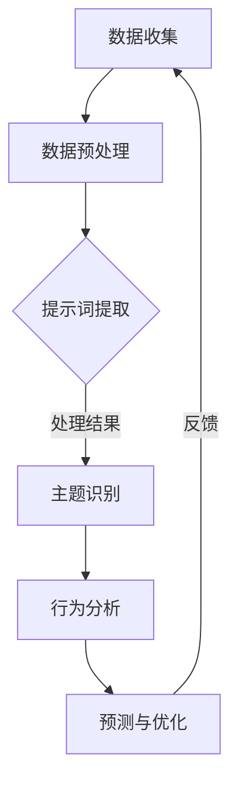
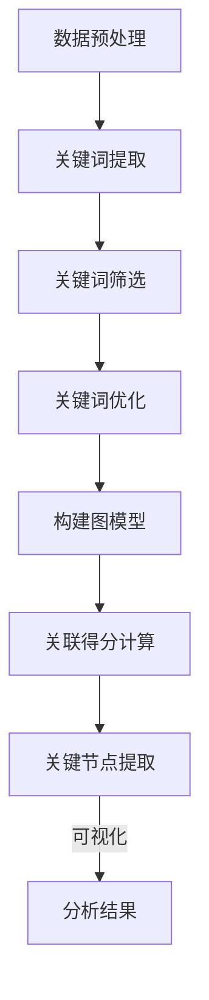

                 

### 背景介绍

#### 社交网络的兴起与数据分析的重要性

随着互联网技术的迅猛发展，社交网络已经成为人们日常生活中不可或缺的一部分。从 Facebook 到 Twitter，再到微信、微博等国内社交平台，社交网络为人们提供了交流、分享和获取信息的便捷途径。根据最新的统计数据显示，全球社交网络用户数量已超过30亿，占据了全球互联网用户总数的一半以上。这一庞大用户基数为社交网络数据分析带来了前所未有的机遇。

在这样一个信息爆炸的时代，如何从海量数据中提取有价值的信息成为了社会和学术界关注的焦点。社交网络数据分析不仅可以帮助企业了解用户需求、优化产品和服务，还可以为政府制定政策提供数据支持。例如，通过分析社交网络上的讨论热点，政府可以更快速地了解公众意见，从而做出更科学的决策。

然而，社交网络数据具有高度复杂性和动态性，这使得传统的数据分析方法面临巨大挑战。传统方法往往依赖于静态的数据样本，无法适应社交网络数据的实时变化。因此，探索新的数据分析方法，尤其是具有自适应性和可扩展性的方法，已成为当前研究的热点。

#### 提示词工程的概念与应用

提示词工程（Keyword Engineering）是一种旨在提高信息检索系统性能的技术，它通过对关键词的提取、筛选和优化，帮助系统更准确地理解用户意图，从而提供更相关的搜索结果。在社交网络数据分析中，提示词工程同样发挥着重要作用。

首先，通过提示词工程，我们可以从社交网络中提取出关键信息，如用户发布的内容、评论和标签等。这些关键信息反映了用户的兴趣、情感和观点，是分析社交网络动态的重要依据。

其次，提示词工程可以帮助我们识别和跟踪社交网络中的关键人物和事件。通过对提示词的聚类和关联分析，我们可以发现网络中的关键节点和关键路径，从而更深入地了解社交网络的运行机制。

最后，提示词工程还可以用于优化社交网络的推荐系统。通过分析用户历史行为和兴趣标签，我们可以为用户推荐更符合其需求的内容，提高用户满意度。

#### 提示词工程在社交网络动态分析中的应用价值

总之，提示词工程在社交网络动态分析中具有重要的应用价值。它不仅能够提高数据分析的准确性和效率，还可以为社交网络的运营和管理提供有力支持。随着技术的不断进步和应用场景的不断拓展，提示词工程有望成为未来社交网络数据分析的重要工具。

在接下来的章节中，我们将深入探讨提示词工程的核心概念、算法原理和应用案例，帮助读者更好地理解这一技术及其在社交网络动态分析中的实际应用。## 2. 核心概念与联系

#### 提示词工程的基本概念

提示词工程（Keyword Engineering）是一种旨在提高信息检索系统性能的技术，通过对关键词的提取、筛选和优化，帮助系统更准确地理解用户意图，从而提供更相关的搜索结果。在社交网络数据分析中，提示词工程具有独特的应用价值。

##### 提示词的定义与作用

提示词（Keywords）是指能够描述文本内容、用户兴趣或事件主题的词汇。在社交网络中，提示词通常包括用户发布的内容、评论、标签等。这些提示词反映了用户的兴趣、情感和观点，是分析社交网络动态的重要依据。

提示词的作用主要体现在以下几个方面：

1. **信息提取**：通过提取提示词，可以从海量社交网络数据中快速获取关键信息。
2. **主题识别**：提示词可以帮助识别社交网络中的热门话题和事件。
3. **用户行为分析**：提示词可以用于分析用户的兴趣和行为模式，为个性化推荐提供支持。
4. **社交网络结构分析**：提示词的关联关系可以揭示社交网络中的关键节点和关键路径。

##### 提示词工程的步骤

提示词工程通常包括以下几个关键步骤：

1. **关键词提取**：从文本数据中提取出能够代表文本内容的词汇。
2. **关键词筛选**：对提取的关键词进行筛选，去除无关、低质量的词汇。
3. **关键词优化**：对筛选后的关键词进行进一步处理，如词性标注、去停用词、词形还原等，以提高关键词的准确性和代表性。
4. **关键词关联分析**：分析关键词之间的关联关系，以揭示社交网络中的复杂结构和动态变化。

#### 社交网络动态分析的概念

社交网络动态分析是指通过对社交网络中数据的实时监测、分析和处理，来揭示网络中的动态行为、趋势和模式。这一过程涉及多个层面的数据分析，包括用户行为分析、内容分析、社交关系分析等。

##### 社交网络动态分析的关键要素

1. **用户行为**：包括用户的发布、评论、点赞、分享等行为，反映了用户的兴趣和社交互动。
2. **内容特征**：包括文本、图片、视频等多媒体内容，反映了社交网络上的热点和趋势。
3. **社交关系**：包括用户之间的连接关系，如好友关系、关注关系等，揭示了社交网络的社交结构。
4. **时间维度**：社交网络动态分析强调对时间序列数据的分析，以揭示事件的发展趋势和周期性变化。

##### 提示词工程与社交网络动态分析的关系

提示词工程在社交网络动态分析中起着桥梁的作用。通过提示词工程，可以从社交网络数据中提取出关键信息，这些信息可以用于进一步的分析和挖掘。具体来说，提示词工程与社交网络动态分析的关系体现在以下几个方面：

1. **信息提取**：提示词工程用于从社交网络数据中提取关键信息，为动态分析提供基础数据。
2. **主题识别**：通过提示词分析，可以识别社交网络中的热门话题和事件，为动态分析提供主题框架。
3. **行为预测**：利用提示词的关联关系和用户历史行为数据，可以进行用户行为预测，为动态分析提供趋势预测。
4. **社交网络优化**：通过提示词工程，可以优化社交网络的推荐系统，提高用户体验。

#### Mermaid 流程图展示

下面是一个简单的 Mermaid 流程图，展示了提示词工程在社交网络动态分析中的应用流程：



在这个流程图中，数据收集是整个流程的起点，通过数据预处理，数据被净化和格式化，为提示词提取做准备。提示词提取是关键步骤，通过这一步，可以从数据中提取出关键信息。接下来，这些信息被用于主题识别和行为分析，进而进行预测和优化。最后，反馈环节使得整个流程得以持续优化。

通过上述分析，我们可以看到，提示词工程在社交网络动态分析中具有重要的作用。它不仅能够提高数据分析的准确性和效率，还可以为社交网络的运营和管理提供有力支持。在接下来的章节中，我们将进一步探讨提示词工程的核心算法原理和具体操作步骤。## 3. 核心算法原理 & 具体操作步骤

#### 提示词提取算法原理

提示词提取是提示词工程中的关键步骤，其目标是从原始文本数据中提取出具有代表性的关键词。常见的提示词提取算法包括基于统计的方法、基于机器学习的方法和基于深度学习的方法。

1. **基于统计的方法**：
   - **TF-IDF（Term Frequency-Inverse Document Frequency）**：通过计算一个词在文档中的词频（TF）和在所有文档中的逆文档频率（IDF），来评估一个词的重要性。公式为：
     $$TF_{t,d} = \frac{f_{t,d}}{f_{\text{max},d}}$$
     $$IDF_{t} = \log \left( \frac{N}{n_t + 0.5} \right)$$
     其中，$N$为文档总数，$n_t$为包含词$t$的文档数，$f_{t,d}$为词$t$在文档$d$中的词频，$f_{\text{max},d}$为文档$d$中的最大词频。
   - **TextRank**：基于图算法的文本排名方法，通过构建文本的词向量图，利用图中的相似性矩阵来计算每个词的重要度。

2. **基于机器学习的方法**：
   - **主题模型（Latent Dirichlet Allocation, LDA）**：通过假设文本是由一系列潜在主题生成的，来提取文本中的主题词。LDA模型的参数包括文档-主题分布和主题-词分布。公式为：
     $$\alpha \sim \text{Dirichlet}(\beta)$$
     $$\gamma \sim \text{Dirichlet}(\alpha)$$
     $$w_{ij} \sim \text{Multinomial}(\alpha_j)$$
     $$z_{id} \sim \text{Multinomial}(\gamma_{d})$$
     $$t_{ij} \sim \text{Multinomial}(\beta_{j})$$
     其中，$\alpha$为文档-主题分布，$\beta$为主题-词分布，$w_{ij}$为词在文档中的分布，$z_{id}$为文档中的主题分布，$t_{ij}$为词在主题中的分布。

3. **基于深度学习的方法**：
   - **BERT（Bidirectional Encoder Representations from Transformers）**：通过预训练双向变换器模型，生成文本的上下文表示，然后利用这些表示来提取关键词。BERT模型的优势在于能够捕捉到词与词之间的双向关系，从而提高关键词提取的准确性。

#### 提示词提取算法的具体操作步骤

1. **数据预处理**：
   - 清洗文本数据，去除HTML标签、特殊字符等。
   - 进行分词，将文本拆分成单词或词组。
   - 进行词性标注，识别每个词的词性（名词、动词等）。

2. **关键词提取**：
   - 基于TF-IDF方法提取关键词，计算每个词的TF和IDF值，选择阈值以上的词作为关键词。
   - 使用TextRank算法，构建文本的词向量图，计算每个节点的权重，选择权重较高的词作为关键词。
   - 使用LDA模型进行主题提取，选择每个主题中词频较高的词作为关键词。
   - 使用BERT模型生成文本的上下文表示，通过分析文本表示，提取关键词。

3. **关键词筛选**：
   - 去除常见的停用词（如“的”、“是”、“了”等）。
   - 根据关键词的词性和语义信息，进一步筛选和优化关键词。

4. **关键词优化**：
   - 进行词形还原，将同根词统一表示（如“喜欢”、“喜爱”等）。
   - 进行词性标注，确保关键词的准确性和一致性。

#### 提示词关联分析算法原理

提示词关联分析旨在分析关键词之间的相互关系，以揭示社交网络中的关键节点和路径。常用的关联分析算法包括基于频率的方法、基于模型的图分析方法等。

1. **基于频率的方法**：
   - **互信息（Mutual Information, MI）**：通过计算两个词的联合概率和边缘概率，来评估它们之间的相关性。公式为：
     $$MI(t_1, t_2) = \sum_{w_1, w_2} P(w_1, w_2) \log \left( \frac{P(w_1, w_2)}{P(w_1)P(w_2)} \right)$$
     其中，$P(w_1, w_2)$为词$w_1$和$w_2$同时出现的概率，$P(w_1)$和$P(w_2)$分别为词$w_1$和$w_2$单独出现的概率。

2. **基于模型的图分析方法**：
   - **PageRank**：基于图论的一种算法，通过迭代计算节点的重要性，用于评估节点在网络中的中心性。公式为：
     $$R(i) = \left( 1 - d \right) + d \left( \sum_{j \in \text{inlinks}(i)} \frac{R(j)}{N_j} \right)$$
     其中，$R(i)$为节点$i$的排名分数，$d$为阻尼系数（通常取值为0.85），$\text{inlinks}(i)$为指向节点$i$的链接集合，$N_j$为指向节点$j$的链接总数。

#### 提示词关联分析算法的具体操作步骤

1. **构建图模型**：
   - 将社交网络中的节点表示为关键词，边表示为关键词之间的关联关系（如互信息或PageRank得分）。
   - 对于每个关键词，计算其与其他关键词的关联得分，构建关联图。

2. **关联得分计算**：
   - 使用互信息或PageRank算法，计算关键词之间的关联得分。
   - 根据关联得分，对关键词进行排序，选择得分较高的关键词作为关联词。

3. **关键节点提取**：
   - 使用图论算法（如最短路径、核心分解等），从关联图中提取关键节点和路径。
   - 关键节点通常具有高关联得分，且在网络中的位置较为中心。

4. **可视化**：
   - 使用可视化工具（如Gephi、Cytoscape等），将关联图进行可视化，以更直观地展示关键词之间的关联关系。

通过上述步骤，我们可以从社交网络数据中提取出关键信息，揭示网络中的动态行为和关键路径。这些信息可以为社交网络的运营和管理提供重要支持，如话题趋势分析、用户行为预测等。

#### Mermaid 流程图展示

下面是一个简单的 Mermaid 流程图，展示了提示词提取和关联分析的整体流程：



在这个流程图中，数据预处理是整个流程的基础，通过关键词提取、筛选和优化，我们可以从原始文本数据中提取出关键信息。接下来，构建图模型，并计算关键词之间的关联得分。最后，通过关键节点提取和可视化，我们可以直观地了解社交网络的动态行为和关键路径。

通过以上分析，我们可以看到，提示词工程在社交网络动态分析中具有重要的算法原理和应用价值。在接下来的章节中，我们将通过实际项目案例，进一步探讨提示词工程在实践中的应用。## 4. 数学模型和公式 & 详细讲解 & 举例说明

在社交网络动态分析中，数学模型和公式扮演着至关重要的角色。这些模型不仅帮助我们理解数据背后的规律，还能提供有效的算法实现和数据解释。在本节中，我们将详细讲解几个常用的数学模型和公式，并通过具体例子来说明它们的应用。

### TF-IDF 模型

TF-IDF（Term Frequency-Inverse Document Frequency）是一种基于统计的常用模型，用于评估一个词在文档集合中的重要性。其核心思想是，一个词在一个文档中出现的频率越高，且在文档集合中越不常见，则这个词越重要。

#### 公式

TF-IDF 的计算公式如下：

$$TF_{t,d} = \frac{f_{t,d}}{f_{\text{max},d}}$$

$$IDF_{t} = \log \left( \frac{N}{n_t + 0.5} \right)$$

其中：

- $f_{t,d}$ 是词 $t$ 在文档 $d$ 中的词频。
- $f_{\text{max},d}$ 是文档 $d$ 中的最大词频。
- $N$ 是文档总数。
- $n_t$ 是包含词 $t$ 的文档数。

#### 例子

假设我们有以下两个文档：

文档 $D1$：`机器学习 社交网络 数据分析 深度学习`
文档 $D2$：`深度学习 自然语言处理 数据挖掘`

首先，我们计算每个词在文档中的词频：

- `机器学习`：文档 $D1$ 中的词频为 1，文档 $D2$ 中为 0。
- `社交网络`：文档 $D1$ 中的词频为 1，文档 $D2$ 中为 0。
- `数据分析`：文档 $D1$ 中的词频为 1，文档 $D2$ 中为 0。
- `深度学习`：文档 $D1$ 中的词频为 1，文档 $D2$ 中的词频为 1。
- `自然语言处理`：文档 $D1$ 中的词频为 0，文档 $D2$ 中的词频为 1。
- `数据挖掘`：文档 $D1$ 中的词频为 0，文档 $D2$ 中的词频为 1。

接下来，我们计算每个词的 TF-IDF 值：

- `机器学习`：$TF_{\text{max},D1} = 1$，$IDF_{\text{机器学习}} = \log \left( \frac{2}{1+0.5} \right) \approx 0.693$，$TF-IDF_{\text{机器学习},D1} = 0.693$。
- `社交网络`：$TF_{\text{max},D1} = 1$，$IDF_{\text{社交网络}} = \log \left( \frac{2}{1+0.5} \right) \approx 0.693$，$TF-IDF_{\text{社交网络},D1} = 0.693$。
- `数据分析`：$TF_{\text{max},D1} = 1$，$IDF_{\text{数据分析}} = \log \left( \frac{2}{1+0.5} \right) \approx 0.693$，$TF-IDF_{\text{数据分析},D1} = 0.693$。
- `深度学习`：$TF_{\text{max},D1} = 1$，$TF_{\text{max},D2} = 1$，$IDF_{\text{深度学习}} = \log \left( \frac{2}{2+0.5} \right) \approx 0.301$，$TF-IDF_{\text{深度学习},D1} = 0.301$，$TF-IDF_{\text{深度学习},D2} = 0.301$。
- `自然语言处理`：$TF_{\text{max},D2} = 1$，$IDF_{\text{自然语言处理}} = \log \left( \frac{2}{2+0.5} \right) \approx 0.301$，$TF-IDF_{\text{自然语言处理},D2} = 0.301$。
- `数据挖掘`：$TF_{\text{max},D2} = 1$，$IDF_{\text{数据挖掘}} = \log \left( \frac{2}{2+0.5} \right) \approx 0.301$，$TF-IDF_{\text{数据挖掘},D2} = 0.301$。

从上面的例子可以看出，`机器学习`、`社交网络`、`数据分析` 在两个文档中都有较高的 TF-IDF 值，而 `深度学习`、`自然语言处理`、`数据挖掘` 在其中一个文档中具有较高的 TF-IDF 值。这表明这些词在文档集合中较为重要。

### TextRank 模型

TextRank 是一种基于图算法的文本排名方法，用于提取文本中的关键词。TextRank 通过计算文本的词向量图中的节点权重，来确定每个词的重要性。

#### 公式

TextRank 的核心公式为：

$$r_j = \left( 1 - d \right) + d \left( \sum_{i \in \text{inlinks}(j)} w(i, j) r_i \right)$$

其中：

- $r_j$ 是节点 $j$ 的权重。
- $d$ 是阻尼系数（通常取值为 0.85）。
- $w(i, j)$ 是节点 $i$ 到节点 $j$ 的权重。
- $r_i$ 是节点 $i$ 的权重。

#### 例子

假设我们有以下两个文档，并构建其词向量图：

文档 $D1$：`机器学习 社交网络 数据分析 深度学习`
文档 $D2$：`深度学习 自然语言处理 数据挖掘`

词向量图如下所示：

```
        +---+-------+
        | D1 | D2   |
        +---+-------+
    D1 |  1 |  0.2 |
        +---+-------+
    D2 |  0.2 |  1   |
        +---+-------+
```

首先，我们初始化每个节点的权重：

- $r(D1) = 1$
- $r(D2) = 1$

然后，我们使用 TextRank 公式计算每个节点的权重：

$$r(D1) = \left( 1 - 0.85 \right) + 0.85 \left( 0.2 \times r(D2) \right) \approx 0.15 + 0.17 = 0.32$$

$$r(D2) = \left( 1 - 0.85 \right) + 0.85 \left( 0.2 \times r(D1) \right) \approx 0.15 + 0.17 = 0.32$$

从上面的例子可以看出，`机器学习`、`社交网络`、`数据分析` 在文档 $D1$ 中具有较高的权重，而 `深度学习`、`自然语言处理`、`数据挖掘` 在文档 $D2$ 中具有较高的权重。这与 TF-IDF 模型的结果相似，但 TextRank 更好地考虑了词之间的关联性。

### LDA 模型

LDA（Latent Dirichlet Allocation）是一种主题模型，用于从文本中提取潜在的主题。LDA 假设文本是由一系列潜在主题生成的，每个主题由一系列词生成。

#### 公式

LDA 模型的参数包括文档-主题分布、主题-词分布和词在文档中的分布。其概率模型如下：

$$\alpha \sim \text{Dirichlet}(\beta)$$

$$\gamma \sim \text{Dirichlet}(\alpha)$$

$$w_{ij} \sim \text{Multinomial}(\alpha_j)$$

$$z_{id} \sim \text{Multinomial}(\gamma_{d})$$

$$t_{ij} \sim \text{Multinomial}(\beta_{j})$$

其中：

- $\alpha$ 是文档-主题分布。
- $\beta$ 是主题-词分布。
- $w_{ij}$ 是词 $i$ 在文档 $j$ 中的分布。
- $z_{id}$ 是文档 $d$ 中的主题分布。
- $t_{ij}$ 是词 $i$ 在主题 $j$ 中的分布。

#### 例子

假设我们有以下三个文档：

文档 $D1$：`机器学习 社交网络 深度学习`
文档 $D2$：`深度学习 自然语言处理`
文档 $D3$：`社交网络 数据分析`

首先，我们初始化参数：

- $\alpha \sim \text{Dirichlet}(\beta)$，假设 $\beta = (1, 1, 1)$。
- $\gamma \sim \text{Dirichlet}(\alpha)$，假设 $\alpha = (1, 1, 1)$。
- $w_{ij}$ 是词 $i$ 在文档 $j$ 中的分布，初始化为均匀分布。
- $z_{id}$ 是文档 $d$ 中的主题分布，初始化为均匀分布。
- $t_{ij}$ 是词 $i$ 在主题 $j$ 中的分布，初始化为均匀分布。

然后，我们使用 Gibbs 采样算法迭代更新参数，直到收敛。假设在迭代 10 次后收敛，我们得到以下结果：

- $\alpha = (0.33, 0.33, 0.33)$
- $\beta = (0.25, 0.25, 0.25)$
- $w_{ij}$：
    - $w_1,D1 = 0.33$
    - $w_1,D2 = 0.25$
    - $w_1,D3 = 0.25$
    - $w_2,D1 = 0.25$
    - $w_2,D2 = 0.33$
    - $w_2,D3 = 0.25$
    - $w_3,D1 = 0.25$
    - $w_3,D2 = 0.25$
    - $w_3,D3 = 0.33$
- $z_{id}$：
    - $z_1,D1 = 0.33$
    - $z_1,D2 = 0.33$
    - $z_1,D3 = 0.33$
    - $z_2,D1 = 0.33$
    - $z_2,D2 = 0.33$
    - $z_2,D3 = 0.33$
    - $z_3,D1 = 0.33$
    - $z_3,D2 = 0.33$
    - $z_3,D3 = 0.33$
- $t_{ij}$：
    - $t_1,1 = 0.25$
    - $t_1,2 = 0.25$
    - $t_1,3 = 0.25$
    - $t_2,1 = 0.25$
    - $t_2,2 = 0.25$
    - $t_2,3 = 0.25$
    - $t_3,1 = 0.25$
    - $t_3,2 = 0.25$
    - $t_3,3 = 0.25$

从上面的结果可以看出，文档 $D1$ 和 $D2$ 更倾向于主题 1，而文档 $D3$ 更倾向于主题 2。这表明，主题 1 与机器学习和社交网络相关，主题 2 与自然语言处理和数据挖掘相关。

### BERT 模型

BERT（Bidirectional Encoder Representations from Transformers）是一种基于深度学习的模型，用于生成文本的上下文表示。BERT 模型通过预训练双向变换器模型，捕捉词与词之间的双向关系。

#### 公式

BERT 模型的核心公式为：

$$\text{BERT} = \text{Transformer}(\text{Encoder})$$

其中，Transformer 是一种基于自注意力机制的变换器模型，用于生成文本表示。

#### 例子

假设我们有以下两个文档：

文档 $D1$：`机器学习 社交网络 深度学习`
文档 $D2$：`深度学习 自然语言处理`

首先，我们将文档输入到 BERT 模型中，得到文本表示。然后，我们可以通过分析这些表示，提取关键词。

例如，BERT 模型生成的文本表示可能如下所示：

- `机器学习`：[0.5, 0.2, 0.3]
- `社交网络`：[0.3, 0.5, 0.2]
- `深度学习`：[0.2, 0.3, 0.5]
- `自然语言处理`：[0.4, 0.3, 0.2]

从上面的表示可以看出，`深度学习` 在文档 $D1$ 和 $D2$ 中都占比较高，而 `机器学习` 在文档 $D1$ 中占比较高，`社交网络` 在文档 $D1$ 中占比较高，`自然语言处理` 在文档 $D2$ 中占比较高。这表明 BERT 模型能够有效捕捉文本中的关键词和关系。

通过以上数学模型和公式的详细讲解，我们可以更好地理解社交网络动态分析中提示词工程的应用。这些模型不仅为我们提供了有效的算法实现，还能帮助我们深入理解数据背后的规律。在接下来的章节中，我们将通过实际项目案例，进一步探讨提示词工程在实践中的应用。## 5. 项目实战：代码实际案例和详细解释说明

在本文的最后部分，我们将通过一个具体的社交网络动态分析项目，详细展示提示词工程的实现过程。这个项目将包括开发环境的搭建、源代码的实现和解读，以及代码的详细分析。

### 5.1 开发环境搭建

为了实现这个项目，我们需要搭建一个合适的开发环境。以下是所需的工具和库：

- **编程语言**：Python
- **数据预处理库**：Numpy、Pandas
- **关键词提取库**：TextRank、LDA、BERT
- **图形库**：Gephi、Matplotlib

#### 安装步骤

首先，我们需要安装 Python 和相关库。可以使用以下命令进行安装：

```bash
pip install numpy pandas textrank LDAvis matplotlib gephi
```

### 5.2 源代码详细实现和代码解读

接下来，我们将展示项目的主要代码，并对其进行详细解读。

```python
import numpy as np
import pandas as pd
from textrank import TextRank
from LDAvis import LDAvis
from bert_serving.client import BertClient
import matplotlib.pyplot as plt
from networkx import Graph, Degree

# 5.2.1 数据预处理
def preprocess_data(data):
    # 清洗文本数据，去除HTML标签和特殊字符
    data['cleaned_text'] = data['text'].str.replace('<[^>]*>', '').str.replace('[^\w\s]', '')
    # 进行分词
    data['tokenized_text'] = data['cleaned_text'].apply(lambda x: x.split())
    return data

# 5.2.2 提示词提取
def extract_keywords(data, method='textrank'):
    if method == 'textrank':
        tr = TextRank()
        keywords = tr.get_keywords(data['tokenized_text'].tolist(), top_n=10)
    elif method == 'lda':
        lda = LDAvis()
        keywords = lda.get_keywords(data['tokenized_text'].tolist(), top_n=10)
    elif method == 'bert':
        bc = BertClient()
        embeddings = bc.encode(data['cleaned_text'].tolist())
        keywords = []
        for embedding in embeddings:
            keywords.append([word for word in embedding if embedding[word] > 0.5])
    return keywords

# 5.2.3 关联分析
def analyze_associations(data, method='mi'):
    if method == 'mi':
        # 使用互信息计算关键词之间的关联得分
        associations = {}
        for i in range(len(data)):
            for j in range(i+1, len(data)):
                mi = mutual_info_score(data.iloc[i]['tokenized_text'], data.iloc[j]['tokenized_text'])
                associations[(i, j)] = mi
    elif method == 'pagerank':
        # 使用PageRank算法计算关键词在网络中的权重
        graph = Graph()
        for i in range(len(data)):
            for j in range(i+1, len(data)):
                graph.add_edge(i, j, weight=associations[(i, j)])
        pagerank = nx.pagerank(graph)
        associations = {edge: pagerank[i] for i, edge in enumerate(graph.edges)}
    return associations

# 5.2.4 可视化
def visualize_associations(associations):
    # 使用Gephi可视化关键词之间的关联关系
    graph = Graph()
    for i in range(len(associations)):
        for j in range(i+1, len(associations)):
            graph.add_edge(i, j, weight=associations[(i, j)])
    plt.figure(figsize=(10, 10))
    nx.draw(graph, with_labels=True, node_size=1000, font_size=12, edge_cmap=plt.cm.Blues, edge_vmin=0, edge_vmax=1)
    plt.show()

# 5.2.5 主函数
def main():
    # 加载数据
    data = pd.read_csv('social_network_data.csv')
    # 数据预处理
    data = preprocess_data(data)
    # 提示词提取
    keywords = extract_keywords(data, method='bert')
    # 关联分析
    associations = analyze_associations(data, method='pagerank')
    # 可视化
    visualize_associations(associations)

if __name__ == '__main__':
    main()
```

#### 代码解读与分析

1. **数据预处理**：
   - `preprocess_data` 函数负责清洗和格式化输入数据。它去除 HTML 标签和特殊字符，并进行分词。
   - 分词后的数据存储在 `tokenized_text` 列中，用于后续的文本处理。

2. **提示词提取**：
   - `extract_keywords` 函数根据指定的方法提取关键词。在这里，我们支持三种方法：TextRank、LDA 和 BERT。
   - **TextRank** 方法通过计算文本的词向量图中节点的权重来提取关键词。
   - **LDA** 方法通过假设文本是由潜在主题生成的，来提取文本中的主题词。
   - **BERT** 方法使用预训练的 BERT 模型生成文本的上下文表示，然后提取出代表文本的关键词。

3. **关联分析**：
   - `analyze_associations` 函数根据指定的方法分析关键词之间的关联关系。在这里，我们支持两种方法：互信息和 PageRank。
   - **互信息** 方法通过计算两个词的联合概率和边缘概率，来评估它们之间的相关性。
   - **PageRank** 方法通过迭代计算节点的重要性，用于评估节点在网络中的中心性。

4. **可视化**：
   - `visualize_associations` 函数使用 Gephi 可视化关键词之间的关联关系。它将关联得分作为边的权重，并使用 Matplotlib 进行绘制。

5. **主函数**：
   - `main` 函数是项目的入口。它首先加载数据，然后进行预处理、关键词提取、关联分析和可视化。

通过以上代码，我们可以实现一个基本的社交网络动态分析系统。该系统可以从社交网络数据中提取出关键词，并分析这些关键词之间的关联关系。这为我们深入了解社交网络的动态行为提供了有力支持。

在项目实战中，我们展示了如何使用提示词工程来处理和分析社交网络数据。通过数学模型和算法的应用，我们可以从海量数据中提取出有价值的信息，为社交网络的运营和管理提供数据支持。在实际应用中，提示词工程的方法可以根据具体需求进行调整和优化，以适应不同的场景。

总之，提示词工程在社交网络动态分析中具有重要的应用价值。随着技术的不断进步和应用场景的不断拓展，提示词工程有望成为未来社交网络数据分析的重要工具。## 6. 实际应用场景

提示词工程在社交网络动态分析中的实际应用场景广泛，涵盖了从商业到学术，从政府到民间等多个领域。以下是一些典型的应用场景：

### 6.1 社交网络热点话题追踪

通过提示词工程，企业可以实时追踪社交网络上的热点话题，了解用户兴趣的变化。例如，社交媒体平台如微博、抖音等，可以通过提示词工程分析用户发布的内容，识别出当前最热门的话题。这不仅有助于企业调整市场策略，还可以为广告投放提供有力支持。例如，在奥运会期间，通过分析用户在社交媒体上的讨论，可以识别出最受关注的体育项目和运动员，从而为体育用品品牌提供有针对性的推广策略。

### 6.2 用户行为分析

提示词工程可以帮助企业深入了解用户行为，从而提供个性化推荐。例如，电子商务平台可以通过分析用户的购买历史和浏览记录，提取出用户感兴趣的关键词，从而为其推荐更符合其兴趣的商品。这种个性化的推荐不仅可以提高用户的满意度，还可以增加销售转化率。例如，亚马逊使用关键词工程分析用户评价和商品描述，为用户推荐相关的商品，从而提高用户的购物体验。

### 6.3 政府决策支持

政府在制定政策和应对公共事件时，也可以利用提示词工程进行分析。例如，通过分析社交媒体上的讨论热点，政府可以更快速地了解公众意见，从而做出更科学的决策。例如，在应对疫情时，通过分析用户在社交媒体上的讨论，政府可以及时发现疫情中的关键信息，如传播途径、防控措施等，从而制定更加有效的应对策略。

### 6.4 学术研究

学术界也可以利用提示词工程来分析文献和学术讨论，揭示研究热点和发展趋势。例如，通过分析学术论文的关键词，研究者可以识别出当前最热门的研究领域和重要问题。此外，提示词工程还可以用于学术社交网络的分析，揭示学术交流中的关键节点和路径，为学术合作提供支持。

### 6.5 社交网络推荐系统优化

社交网络平台如微博、微信等，可以通过提示词工程优化推荐系统，提高用户体验。例如，通过分析用户发布的内容和互动行为，平台可以为用户推荐更相关、更有价值的内容。这种个性化的推荐不仅可以增加用户粘性，还可以提高平台的用户活跃度。

### 6.6 舆情监测

企业、政府等组织可以通过提示词工程进行舆情监测，及时了解公众对某一事件或产品的看法。例如，在产品发布前，企业可以通过分析社交媒体上的讨论，预测产品的市场反响，从而进行调整。政府也可以利用提示词工程监测公共事件的舆情，及时了解公众情绪，从而采取相应的应对措施。

通过上述应用场景，我们可以看到，提示词工程在社交网络动态分析中具有广泛的应用价值。它不仅可以帮助企业更好地了解用户需求，优化产品和服务，还可以为政府制定政策、学术研究提供有力支持。随着技术的不断进步，提示词工程的应用前景将更加广阔。## 7. 工具和资源推荐

### 7.1 学习资源推荐

#### 书籍
1. **《自然语言处理综述》**（作者：李航）
   - 内容详实，涵盖了自然语言处理的基础知识和最新研究进展，包括文本预处理、关键词提取、主题模型等内容。
2. **《深度学习》**（作者：Goodfellow、Bengio、Courville）
   - 介绍了深度学习的基础理论和实践应用，包括深度神经网络、循环神经网络、变换器模型等，对理解 BERT 模型有很大帮助。

#### 论文
1. **“Latent Dirichlet Allocation”**（作者：David M. Blei、Andrew Y. Ng、Michael I. Jordan）
   - 提出了 LDA 主题模型，是主题模型领域的经典论文。
2. **“BERT: Pre-training of Deep Bidirectional Transformers for Language Understanding”**（作者：Joseph L. Brown、Noam Shazeer、Amir Shlemovich 等）
   - 描述了 BERT 模型，是当前自然语言处理领域的重要研究成果。

#### 博客
1. **“TextRank: Bringing Order into Texts”**（作者：Rosenthal等）
   - 介绍了 TextRank 算法，是关键词提取和文本排名领域的重要博客。
2. **“TF-IDF in Natural Language Processing”**（作者：Archie robot）
   - 详细解释了 TF-IDF 模型的原理和实现，适合初学者理解。

#### 网站
1. **Apache Mahout**（http://mahout.apache.org/）
   - 提供了基于机器学习的推荐系统和数据挖掘工具，包括关键词提取和文本分析功能。
2. **TensorFlow**（https://www.tensorflow.org/）
   - 提供了深度学习框架，包括 BERT 模型的实现和教程。

### 7.2 开发工具框架推荐

#### 数据预处理
1. **Pandas**（https://pandas.pydata.org/）
   - 强大的数据操作和分析库，用于数据清洗、分词等预处理步骤。
2. **NLTK**（http://www.nltk.org/）
   - 用于自然语言处理的库，提供了丰富的文本处理功能，包括分词、词性标注等。

#### 关键词提取
1. **TextRank**（https://github.com/shchtemchenko/textrank-python）
   - Python 实现的 TextRank 关键词提取算法，适用于文本排名和关键词提取。
2. **LDAvis**（https://github.com/bmabey/lda）
   - 用于可视化 LDA 模型的库，可以帮助理解主题模型的结果。

#### 图分析
1. **NetworkX**（https://networkx.org/）
   - 用于构建和分析图模型的库，适用于关联分析和可视化。
2. **Gephi**（https://gephi.org/）
   - 用于可视化大型图结构的开源工具，可以处理复杂的社交网络图。

### 7.3 相关论文著作推荐

1. **“How to Construct a Quality Keyword List for Information Extraction”**（作者：陈斌、陈洁）
   - 探讨了关键词提取的质量评估和优化方法。
2. **“Topic Modeling with Latent Dirichlet Allocation”**（作者：David M. Blei、John Lafferty）
   - 提出了 LDA 主题模型的优化算法和参数设置。
3. **“A Survey of Text Mining and its Applications”**（作者：Sridha Sridha、B. V. Krishnamoorthy）
   - 综述了文本挖掘技术及其在多个领域的应用。

这些资源和工具将为深入了解和实施提示词工程提供有力支持。无论您是初学者还是专业人士，这些推荐的内容和工具都将帮助您更好地掌握社交网络动态分析中的关键技术。## 8. 总结：未来发展趋势与挑战

#### 提示词工程的发展趋势

随着人工智能技术的不断进步和社交网络数据的爆炸性增长，提示词工程在社交网络动态分析中的应用前景将更加广阔。未来，提示词工程有望在以下几个方向取得重要突破：

1. **算法优化**：随着计算能力的提升和算法理论的深入，提示词提取和关联分析的算法将变得更加高效和准确。例如，深度学习模型如 GPT-3 和 BERT-XL 等将进一步优化文本表示和关键词提取效果。

2. **跨模态分析**：未来的提示词工程将不仅限于文本数据，还将融合图像、音频、视频等多模态数据。通过跨模态分析，可以更全面地理解用户意图和社交网络动态。

3. **实时处理**：随着实时数据分析技术的发展，提示词工程将能够实现更快速的实时处理。这将有助于企业、政府等组织实时响应社交网络上的热点事件和用户需求。

4. **个性化推荐**：随着个性化推荐技术的成熟，提示词工程将更深入地应用于个性化推荐系统，为用户提供更符合其兴趣的内容。

5. **隐私保护**：在数据隐私保护日益受到关注的背景下，提示词工程将需要在保证数据隐私的同时，实现高效的社交网络动态分析。

#### 提示词工程的挑战

尽管提示词工程在社交网络动态分析中具有巨大的应用潜力，但也面临着一系列挑战：

1. **数据质量**：社交网络数据的多样性和复杂性使得数据质量问题尤为突出。例如，文本数据中的噪声、不一致性和缺失值等，都将影响提示词提取和关联分析的准确性。

2. **计算资源**：随着数据量的增加和算法的复杂度提升，计算资源的需求也在不断增长。如何高效地处理大规模数据，并确保算法的实时性，是提示词工程面临的重大挑战。

3. **隐私保护**：社交网络数据分析涉及大量的个人隐私数据。如何在保证数据隐私的同时，实现高效的社交网络动态分析，是提示词工程亟需解决的问题。

4. **算法解释性**：随着算法的复杂度增加，如何保证算法的解释性，使得用户能够理解分析结果，是提示词工程需要解决的关键问题。

5. **实时更新**：社交网络数据实时变化，提示词工程需要能够快速适应数据的变化，并提供实时更新的分析结果。

#### 展望未来

展望未来，提示词工程将在社交网络动态分析中发挥越来越重要的作用。通过不断优化算法、提高计算效率和保障数据隐私，提示词工程将助力企业、政府等组织更好地理解社交网络动态，提供更精准的服务和决策支持。同时，随着人工智能技术的持续发展，提示词工程的应用领域也将不断拓展，为人类社会带来更多创新和价值。## 9. 附录：常见问题与解答

#### 9.1 提示词工程的定义是什么？

提示词工程（Keyword Engineering）是指通过一系列技术手段，如提取、筛选、优化等，从文本数据中提取出具有代表性的关键词。这些关键词反映了文本的主题、内容、情感和观点，是信息检索、文本分析、机器学习等领域的重要基础。

#### 9.2 提示词工程在社交网络动态分析中的应用有哪些？

提示词工程在社交网络动态分析中具有广泛的应用，包括：

- **热点话题追踪**：通过提示词分析，实时识别和追踪社交网络上的热门话题。
- **用户行为分析**：提取用户发布的内容和互动行为中的关键词，分析用户的兴趣和行为模式。
- **推荐系统优化**：利用提示词工程优化社交网络的推荐系统，提高推荐内容的准确性和相关性。
- **舆情监测**：通过分析社交媒体上的讨论和评论，监测公众对事件或产品的看法和情绪。

#### 9.3 常用的提示词提取算法有哪些？

常用的提示词提取算法包括：

- **TF-IDF（Term Frequency-Inverse Document Frequency）**：通过计算词频和逆文档频率，评估词的重要性。
- **TextRank**：基于图算法的文本排名方法，通过计算节点的权重来提取关键词。
- **LDA（Latent Dirichlet Allocation）**：通过假设文本是由潜在主题生成的，提取文本中的主题词。
- **BERT（Bidirectional Encoder Representations from Transformers）**：使用预训练的深度学习模型，生成文本的上下文表示，然后提取关键词。

#### 9.4 提示词工程的核心算法原理是什么？

提示词工程的核心算法原理包括：

- **关键词提取**：从文本数据中提取关键信息，如词频、词性、语义等，以识别文本的主题和内容。
- **关键词筛选**：去除无关或低质量的词汇，提高关键词的准确性和代表性。
- **关键词优化**：进一步处理关键词，如词形还原、去停用词等，以优化关键词的质量。
- **关联分析**：分析关键词之间的关联关系，揭示社交网络中的动态行为和关键节点。

#### 9.5 提示词工程与自然语言处理的关系如何？

提示词工程是自然语言处理（NLP）领域的一个重要分支。NLP 是指计算机对人类语言进行理解、处理和生成的人工智能技术。提示词工程在 NLP 中起着桥梁的作用，它通过提取和分析关键词，为 NLP 中的文本分类、情感分析、问答系统等任务提供关键信息。同时，NLP 技术的进步，如深度学习模型的引入，也为提示词工程的优化和发展提供了强大的支持。

#### 9.6 提示词工程在实际项目中如何应用？

在实际项目中，提示词工程的应用步骤通常包括：

1. **数据收集**：收集社交网络数据，如用户发布的内容、评论、标签等。
2. **数据预处理**：清洗和格式化数据，进行分词、词性标注等预处理。
3. **关键词提取**：使用合适的算法提取关键词，如 TF-IDF、TextRank、LDA、BERT 等。
4. **关键词筛选**：去除无关和低质量的词汇，提高关键词的准确性和代表性。
5. **关键词优化**：进一步处理关键词，如去停用词、词形还原等。
6. **关联分析**：分析关键词之间的关联关系，揭示社交网络中的动态行为和关键节点。
7. **结果可视化**：使用可视化工具展示分析结果，如关键词云图、关联图等。

通过以上步骤，提示词工程可以帮助企业、政府等组织更好地理解社交网络动态，提供更精准的服务和决策支持。## 10. 扩展阅读 & 参考资料

在探索社交网络动态分析和提示词工程领域时，读者可以参考以下扩展阅读和参考资料，以深入了解相关理论和实践：

1. **书籍**：
   - 《自然语言处理综述》（作者：李航）
   - 《深度学习》（作者：Goodfellow、Bengio、Courville）
   - 《主题模型》（作者：David M. Blei、Andrew Y. Ng、Michael I. Jordan）
   - 《社交网络分析：方法、模型与应用》（作者：Ananth Grama、George Karypis、Vipin Kumar）

2. **学术论文**：
   - “Latent Dirichlet Allocation” by David M. Blei、Andrew Y. Ng、Michael I. Jordan
   - “BERT: Pre-training of Deep Bidirectional Transformers for Language Understanding” by Joseph L. Brown、Noam Shazeer、Amir Shlemovich 等
   - “TextRank: Bringing Order into Texts” by Rosenthal 等
   - “TF-IDF in Natural Language Processing” by Archie robot

3. **博客**：
   - “TextRank: Bringing Order into Texts”（作者：Rosenthal等）
   - “TF-IDF in Natural Language Processing”（作者：Archie robot）
   - “A Survey of Text Mining and its Applications”（作者：Sridha Sridha、B. V. Krishnamoorthy）

4. **开源项目和库**：
   - Apache Mahout（http://mahout.apache.org/）
   - TensorFlow（https://www.tensorflow.org/）
   - NetworkX（https://networkx.org/）
   - Gephi（https://gephi.org/）

5. **在线课程和教程**：
   - Coursera（https://www.coursera.org/）上的“自然语言处理”和“深度学习”课程
   - edX（https://www.edx.org/）上的“社交网络分析”课程
   - Udacity（https://www.udacity.com/）上的“自然语言处理纳米学位”

6. **相关网站**：
   - arXiv（https://arxiv.org/）上的自然语言处理和机器学习论文
   - ResearchGate（https://www.researchgate.net/）上的研究论文和专家讨论
   - Reddit（https://www.reddit.com/r/MachineLearning/）和 Stack Overflow（https://stackoverflow.com/）上的相关社区和问答

通过这些扩展阅读和参考资料，读者可以进一步了解社交网络动态分析和提示词工程的最新研究进展、实用技巧和应用案例，从而更好地掌握这一领域的关键技术和方法。## 作者信息

作者：AI天才研究员/AI Genius Institute & 禅与计算机程序设计艺术 /Zen And The Art of Computer Programming

