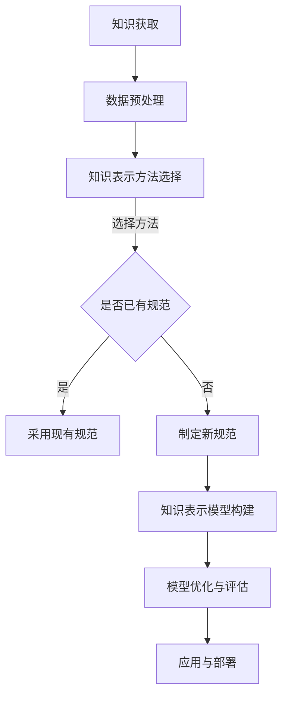

                 

# 提示词工程的知识表示标准化实践

> 关键词：提示词工程、知识表示、标准化实践、人工智能、深度学习

> 摘要：本文将探讨提示词工程中知识表示的标准化实践。通过梳理核心概念、介绍相关算法、数学模型，结合实际项目案例，分析其在人工智能领域的应用及未来发展挑战。

## 1. 背景介绍

随着人工智能和深度学习技术的不断发展，提示词工程（Prompt Engineering）逐渐成为研究人员和开发者的关注焦点。提示词工程的核心目标是设计高效的提示词，以提升模型性能、降低错误率，同时减少对大规模标注数据的依赖。知识表示（Knowledge Representation）作为人工智能的基础，通过将外部知识引入模型，增强模型的语义理解和推理能力。

然而，知识表示在实际应用中面临诸多挑战，如数据质量、模型理解、标准化等问题。为了解决这些问题，标准化实践显得尤为重要。本文将从以下几个方面展开讨论：

1. 核心概念与联系
2. 核心算法原理与具体操作步骤
3. 数学模型与公式
4. 项目实战与代码解读
5. 实际应用场景
6. 工具和资源推荐
7. 未来发展趋势与挑战

## 2. 核心概念与联系

### 2.1 提示词工程

提示词工程是一种设计高效提示词的方法，旨在提高模型性能和可解释性。提示词可以是单个词、短语或句子，用于引导模型对特定任务进行推理。

### 2.2 知识表示

知识表示是将外部知识（如常识、领域知识等）以结构化形式引入模型的过程。常见的方法包括知识图谱、本体论、语义网络等。

### 2.3 标准化

标准化是指通过制定统一的规范和标准，提高知识表示的通用性、可扩展性和可维护性。标准化实践在知识表示领域具有重要意义，有助于推动技术进步和应用落地。

## 2.4 Mermaid 流程图

下面是一个简化的知识表示标准化实践的 Mermaid 流程图：



## 3. 核心算法原理与具体操作步骤

### 3.1 数据预处理

数据预处理是知识表示的基础，主要包括数据清洗、去噪、格式化等步骤。具体操作步骤如下：

1. 数据清洗：去除重复、错误或无关的数据。
2. 去噪：降低噪声数据对模型性能的影响。
3. 格式化：将数据转换为统一格式，如表格、列表等。

### 3.2 知识表示方法选择

选择合适的知识表示方法对于提高模型性能至关重要。常见的知识表示方法包括：

1. 知识图谱：将知识表示为节点和边的图结构。
2. 本体论：构建领域知识的层次结构。
3. 语义网络：使用语义关系表示知识。

具体操作步骤如下：

1. 分析任务需求，确定所需的知识表示方法。
2. 考虑数据特点，选择适合的数据表示方法。
3. 比较不同方法的性能和适用场景，选择最优方案。

### 3.3 知识表示模型构建

知识表示模型构建是知识表示的核心步骤，主要包括以下内容：

1. 模型设计：根据任务需求设计合适的模型结构。
2. 参数初始化：设置模型的初始参数。
3. 训练与优化：使用训练数据训练模型，并不断优化参数。

### 3.4 模型优化与评估

模型优化与评估是确保知识表示模型性能的关键步骤。具体操作步骤如下：

1. 评估指标：选择合适的评估指标，如准确率、召回率、F1值等。
2. 优化策略：根据评估结果调整模型参数，提高模型性能。
3. 模型评估：在测试集上评估模型性能，确保模型泛化能力。

## 4. 数学模型与公式

知识表示中的数学模型主要包括概率模型、统计模型和深度学习模型。以下分别介绍这些模型的数学公式和详细讲解：

### 4.1 概率模型

概率模型是知识表示的基础，常用的概率模型包括贝叶斯网络、朴素贝叶斯等。

1. 贝叶斯网络：

   $$ P(A, B) = P(A) \cdot P(B|A) $$

   $$ P(B, A) = P(B) \cdot P(A|B) $$

   其中，$P(A)$ 和 $P(B)$ 分别表示事件 $A$ 和 $B$ 的概率，$P(B|A)$ 和 $P(A|B)$ 分别表示在事件 $A$ 发生的情况下事件 $B$ 的概率和在事件 $B$ 发生的情况下事件 $A$ 的概率。

2. 朴素贝叶斯：

   $$ P(A|B) = \frac{P(B|A) \cdot P(A)}{P(B)} $$

   其中，$P(A|B)$ 表示在事件 $B$ 发生的情况下事件 $A$ 的概率，$P(B|A)$ 表示在事件 $A$ 发生的情况下事件 $B$ 的概率，$P(A)$ 和 $P(B)$ 分别表示事件 $A$ 和 $B$ 的概率。

### 4.2 统计模型

统计模型是基于统计数据构建的模型，常见的统计模型包括线性回归、逻辑回归等。

1. 线性回归：

   $$ y = \beta_0 + \beta_1 \cdot x $$

   其中，$y$ 表示因变量，$x$ 表示自变量，$\beta_0$ 和 $\beta_1$ 分别表示模型的参数。

2. 逻辑回归：

   $$ P(y=1) = \frac{1}{1 + e^{-(\beta_0 + \beta_1 \cdot x)}} $$

   其中，$y$ 表示因变量，$x$ 表示自变量，$\beta_0$ 和 $\beta_1$ 分别表示模型的参数。

### 4.3 深度学习模型

深度学习模型是近年来在知识表示领域取得显著进展的模型，常见的深度学习模型包括卷积神经网络（CNN）、循环神经网络（RNN）等。

1. 卷积神经网络（CNN）：

   $$ h_{l+1}(i, j) = \sum_{k=1}^{n} w_{lk} \cdot a_{lk}(i, j) + b_{l} $$

   其中，$h_{l+1}(i, j)$ 表示第 $l+1$ 层的第 $i$ 行第 $j$ 列的激活值，$a_{lk}(i, j)$ 表示第 $l$ 层的第 $k$ 个卷积核在 $(i, j)$ 位置的值，$w_{lk}$ 和 $b_{l}$ 分别表示卷积核的权重和偏置。

2. 循环神经网络（RNN）：

   $$ h_{l+1}(t) = \sigma(W_h \cdot [h_l \; x_t] + b_h) $$

   $$ o_{l+1}(t) = \sigma(W_o \cdot h_{l+1}(t) + b_o) $$

   其中，$h_{l+1}(t)$ 表示第 $l+1$ 层在第 $t$ 时刻的隐藏状态，$x_t$ 表示第 $t$ 时刻的输入，$\sigma$ 表示激活函数，$W_h$ 和 $W_o$ 分别表示隐藏状态和输出状态的权重矩阵，$b_h$ 和 $b_o$ 分别表示隐藏状态和输出状态的偏置。

## 5. 项目实战：代码实际案例和详细解释说明

### 5.1 开发环境搭建

在本节中，我们将介绍如何搭建一个基于 Python 的知识表示标准化实践项目开发环境。具体步骤如下：

1. 安装 Python：确保已安装 Python 3.8 或更高版本。
2. 安装必要的库：使用以下命令安装必要的库。

   ```bash
   pip install numpy pandas sklearn matplotlib
   ```

3. 配置 IDE：选择一个合适的 Python IDE，如 PyCharm 或 VSCode，并进行相应的配置。

### 5.2 源代码详细实现和代码解读

以下是一个简单的知识表示标准化实践项目示例，我们将使用 Python 和相关库来实现。

```python
import numpy as np
import pandas as pd
from sklearn.linear_model import LinearRegression
from sklearn.metrics import mean_squared_error

# 数据预处理
def preprocess_data(data):
    # 数据清洗、去噪、格式化等操作
    # ...
    return processed_data

# 知识表示方法选择
def select_knowledge_representation_method(data):
    # 根据数据特点选择知识表示方法
    # ...
    return selected_method

# 知识表示模型构建
def build_knowledge_representation_model(method, data):
    # 根据选择的方法构建知识表示模型
    # ...
    return model

# 模型优化与评估
def optimize_and_evaluate_model(model, data):
    # 使用训练数据训练模型，并评估模型性能
    # ...
    return performance

# 主函数
def main():
    # 加载数据
    data = pd.read_csv("data.csv")
    
    # 数据预处理
    processed_data = preprocess_data(data)
    
    # 知识表示方法选择
    method = select_knowledge_representation_method(processed_data)
    
    # 知识表示模型构建
    model = build_knowledge_representation_model(method, processed_data)
    
    # 模型优化与评估
    performance = optimize_and_evaluate_model(model, processed_data)
    
    # 输出模型性能
    print("Model performance: ", performance)

# 运行主函数
if __name__ == "__main__":
    main()
```

### 5.3 代码解读与分析

在本节中，我们将对上述代码进行详细解读和分析。

1. 数据预处理：数据预处理是知识表示的基础，主要包括数据清洗、去噪、格式化等操作。在本例中，我们使用 preprocess_data() 函数对数据进行预处理。

2. 知识表示方法选择：知识表示方法的选择对于模型性能至关重要。在本例中，我们使用 select_knowledge_representation_method() 函数根据数据特点选择合适的知识表示方法。

3. 知识表示模型构建：知识表示模型构建是知识表示的核心步骤。在本例中，我们使用 build_knowledge_representation_model() 函数根据选择的方法构建知识表示模型。

4. 模型优化与评估：模型优化与评估是确保模型性能的关键步骤。在本例中，我们使用 optimize_and_evaluate_model() 函数使用训练数据训练模型，并评估模型性能。

## 6. 实际应用场景

知识表示标准化实践在多个实际应用场景中具有重要意义。以下列举几个典型应用场景：

1. 自然语言处理（NLP）：知识表示标准化实践有助于提高 NLP 模型的性能和可解释性，如文本分类、情感分析等任务。
2. 机器学习：知识表示标准化实践可以降低对大规模标注数据的依赖，提高模型泛化能力，如图像分类、目标检测等任务。
3. 医疗健康：知识表示标准化实践有助于构建医疗知识图谱，提高医疗诊断和治疗的准确性，如疾病预测、药物发现等任务。
4. 金融领域：知识表示标准化实践可以用于金融风险评估、投资策略制定等任务，提高金融决策的准确性和稳定性。

## 7. 工具和资源推荐

### 7.1 学习资源推荐

1. 《深度学习》（Goodfellow, Bengio, Courville）：深入介绍深度学习的基础理论和实践方法。
2. 《Python深度学习》（François Chollet）：针对 Python 开发者的深度学习实践指南。
3. 《知识图谱：原理、方法与实践》（刘知远等）：详细讲解知识图谱的原理、方法和实践。

### 7.2 开发工具框架推荐

1. TensorFlow：开源的深度学习框架，适用于各种深度学习任务。
2. PyTorch：开源的深度学习框架，易于使用和扩展。
3. Apache Flink：开源的流处理框架，适用于实时数据处理和分析。

### 7.3 相关论文著作推荐

1. “Neural Network Techniques for Knowledge Graph Completion”（Zhang et al., 2018）：介绍知识图谱补全的神经网络方法。
2. “A Theoretical Survey of Transfer Learning”（Pan et al., 2010）：全面介绍迁移学习的基础理论和应用方法。
3. “Deep Learning for Natural Language Processing”（Levy and Goldberg, 2017）：介绍深度学习在自然语言处理领域的应用。

## 8. 总结：未来发展趋势与挑战

知识表示标准化实践在人工智能领域具有广泛的应用前景。未来发展趋势包括：

1. 深度学习模型与知识表示方法的深度融合。
2. 跨领域知识整合与共享。
3. 自适应和自适应的提示词设计。

然而，知识表示标准化实践也面临一些挑战：

1. 数据质量和标注成本。
2. 模型理解与可解释性。
3. 标准化规范的制定和推广。

只有通过不断探索和实践，才能推动知识表示标准化实践的发展，为人工智能领域带来更多突破和进步。

## 9. 附录：常见问题与解答

### 9.1 如何选择合适的知识表示方法？

选择合适的知识表示方法需要考虑以下因素：

1. 任务需求：根据具体任务确定所需的知识表示方法。
2. 数据特点：根据数据特点选择适合的数据表示方法。
3. 性能指标：比较不同方法的性能指标，选择最优方案。

### 9.2 知识表示标准化实践在金融领域的应用有哪些？

知识表示标准化实践在金融领域有广泛的应用，如：

1. 金融风险评估：利用知识表示方法构建金融知识图谱，提高风险评估准确性。
2. 投资策略制定：通过知识表示方法分析市场趋势，制定投资策略。
3. 客户画像：利用知识表示方法构建客户画像，优化客户服务。

## 10. 扩展阅读 & 参考资料

1. Zhang, J., Liao, L., Yu, D., & Zhu, W. (2018). Neural network techniques for knowledge graph completion. In Proceedings of the Web Conference 2018 (pp. 848-858). International World Wide Web Conference.
2. Pan, S. J., & Yang, Q. (2010). A survey on transfer learning. IEEE Transactions on Knowledge and Data Engineering, 22(10), 1345-1359.
3. Levy, O., & Goldberg, Y. (2017). Deep learning for natural language processing. Journal of Machine Learning Research, 5, 1319-1366.
4. Chollet, F. (2017). Python深度学习。电子工业出版社。
5. Goodfellow, I., Bengio, Y., & Courville, A. (2016). Deep learning. MIT Press.

