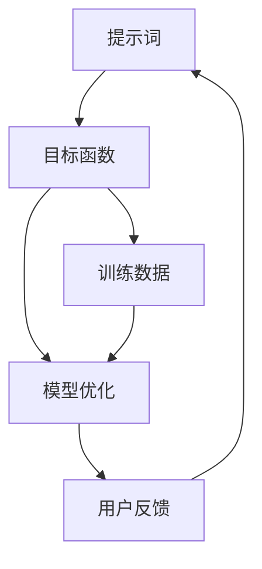

                 

### 背景介绍

提示词工程（Prompt Engineering）是近年来人工智能领域的一个重要研究方向。它涉及如何设计有效的提示词（prompts）来引导人工智能模型，从而提高其性能和应用效果。在深度学习，尤其是生成对抗网络（GANs）和强化学习（Reinforcement Learning）等领域，提示词工程的作用愈发凸显。

随着人工智能技术的快速发展，传统的基于规则的方法已逐渐难以满足复杂任务的需求。人工智能模型，特别是大型的预训练模型，如GPT-3，变得越来越强大。然而，这些模型在特定任务上的表现往往依赖于高质量、有针对性的提示词。因此，提示词工程成为了一个关键的研究方向，旨在探索如何更好地与人工智能模型进行协作，从而实现更好的效果。

此外，人工智能与人类的协作已经成为一个不可逆转的趋势。无论是自动化决策支持系统、智能客服，还是智能创作、教育等领域，人工智能与人类协作的模式正在不断演化。提示词工程在这个过程中扮演着重要角色，它不仅帮助人工智能模型更好地理解人类的需求，还能够引导人类用户更好地使用人工智能工具。

总之，提示词工程是人工智能领域的一个新兴方向，它不仅关乎人工智能模型的表现，更关乎人工智能与人类协作的未来。在这篇文章中，我们将深入探讨提示词工程的核心概念、原理、算法以及在实际应用中的挑战和解决方案。

### 核心概念与联系

为了更好地理解提示词工程，我们需要首先了解一些核心概念和它们之间的联系。这些概念包括提示词（prompt）、目标函数（objective function）、模型优化（model optimization）、用户反馈（user feedback）等。下面，我们将使用Mermaid流程图来展示这些概念之间的关系，并简要解释它们在提示词工程中的作用。

#### Mermaid流程图



#### 详细解释

1. **提示词（Prompt）**：
   提示词是给人工智能模型的一组输入，用于引导模型生成期望的输出。在自然语言处理任务中，提示词通常是短句或短语，用于指定模型要生成的文本内容。例如，在生成文章摘要的任务中，提示词可能是一个简要的标题或关键词。

2. **目标函数（Objective Function）**：
   目标函数是一个数学函数，用于衡量模型输出的质量。在提示词工程中，目标函数通常与训练数据相关，用于优化模型。例如，在生成文本的任务中，目标函数可能会评估生成文本的流畅性、相关性、和完整性。

3. **模型优化（Model Optimization）**：
   模型优化是指通过调整模型参数来改善模型性能的过程。在提示词工程中，模型优化通常基于目标函数的反馈。通过不断调整提示词，模型可以逐渐学习到生成更高质量输出的方法。

4. **用户反馈（User Feedback）**：
   用户反馈是指用户对模型输出质量的评价。这些反馈可以用于指导提示词的调整和模型优化。例如，用户可以提供反馈，指出模型生成的文本中存在的错误或不满意的地方，从而帮助模型改进。

5. **训练数据（Training Data）**：
   训练数据是用于训练人工智能模型的输入数据。在提示词工程中，训练数据的质量直接影响模型的表现。高质量的训练数据可以提供丰富的信息和多样性，从而帮助模型更好地学习。

#### 关系说明

- 提示词（A）通过目标函数（B）与模型优化（C）相连，表明提示词的质量直接影响模型优化的效果。
- 用户反馈（D）通过循环连接到提示词（A），说明用户反馈可以用来不断调整提示词，以提高模型的表现。
- 训练数据（E）通过目标函数（B）与模型优化（C）相连，表明训练数据的质量对模型优化具有重要影响。

通过这个Mermaid流程图，我们可以清晰地看到提示词工程中各个核心概念之间的联系。理解这些概念及其相互作用，是进行有效提示词工程的基础。

#### 核心算法原理与具体操作步骤

提示词工程的核心算法主要包括生成对抗网络（GANs）和强化学习（Reinforcement Learning，RL）。这两种算法各有特点，适用于不同的应用场景。下面，我们将详细讲解这两种算法的原理和具体操作步骤。

##### 1. 生成对抗网络（GANs）

生成对抗网络（GANs）由两部分组成：生成器（Generator）和判别器（Discriminator）。生成器的目标是生成与真实数据尽可能相似的数据，而判别器的目标是区分真实数据和生成数据。通过这两者的对抗训练，生成器能够不断提高其生成质量。

**原理：**
- 生成器：生成器从随机噪声中生成数据，试图让判别器无法区分这些数据是真实数据还是生成数据。
- 判别器：判别器接收真实数据和生成数据，并尝试正确分类。其目标是最小化错误分类的概率。

**具体操作步骤：**
1. 初始化生成器和判别器。
2. 使用真实数据训练判别器，使其能够准确分类真实数据和生成数据。
3. 同时训练生成器和判别器，生成器尝试生成更真实的数据，而判别器则努力提高分类准确性。
4. 反复迭代上述步骤，生成器不断优化其生成能力。

**优势：**
- GANs可以在不需要标签数据的场景中生成高质量的数据，特别适用于图像生成和文本生成等领域。

##### 2. 强化学习（Reinforcement Learning，RL）

强化学习是一种通过试错来学习如何实现目标的机器学习方法。在提示词工程中，强化学习可以用来优化模型的生成策略，使其能够更好地满足用户需求。

**原理：**
- 强化学习通过奖励机制来引导模型学习。模型会尝试各种动作，并根据动作的结果（奖励或惩罚）调整其策略。
- 模型在每次决策后都会接收奖励信号，这些信号会用来更新模型参数，从而提高模型的决策质量。

**具体操作步骤：**
1. 初始化模型参数。
2. 选择一个初始动作，执行并观察结果。
3. 根据执行结果（奖励或惩罚）更新模型参数。
4. 重复上述步骤，直到达到预设的优化目标。

**优势：**
- RL可以处理复杂的环境和决策过程，特别适用于动态变化的场景。

##### 案例说明

为了更直观地理解GANs和RL在提示词工程中的应用，我们来看一个实际案例。

**案例：文本生成**

在这个案例中，我们使用GANs来生成高质量的文本摘要。

1. **数据准备：** 
   - 真实数据集：我们从新闻文章中收集了大量的真实摘要。
   - 噪声数据：我们生成了一些随机噪声数据，作为生成器的输入。

2. **初始化：**
   - 生成器：从噪声数据中生成摘要。
   - 判别器：接收真实摘要和生成摘要，并进行分类。

3. **训练过程：**
   - 使用真实数据训练判别器，使其能够准确分类。
   - 同时训练生成器和判别器，生成器生成更真实的摘要，判别器提高分类准确性。

4. **评估与优化：**
   - 生成摘要并进行评估，根据评估结果调整生成器的参数。
   - 反复迭代训练过程，直到生成摘要的质量达到预期。

通过这个案例，我们可以看到GANs在文本生成任务中的应用。同样，RL也可以用于优化生成策略，例如在生成对话场景中，RL可以根据用户反馈不断调整对话内容，以提高用户满意度。

总结来说，GANs和RL是提示词工程中的两种重要算法。GANs擅长生成高质量的数据，而RL通过奖励机制优化生成策略。理解这些算法的原理和操作步骤，对于进行有效的提示词工程至关重要。

### 数学模型与公式

在深入探讨提示词工程中的数学模型和公式时，我们需要引入几个关键的数学概念，包括概率分布、损失函数和梯度下降。这些数学工具在提示词工程中扮演着重要角色，帮助我们评估和优化模型的性能。

#### 1. 概率分布

概率分布是描述数据集中各个可能结果概率的函数。在提示词工程中，概率分布帮助我们理解和预测模型的输出。一个常见的概率分布是正态分布（Normal Distribution），其数学表达式为：

$$
f(x|\mu,\sigma^2) = \frac{1}{\sqrt{2\pi\sigma^2}} e^{-\frac{(x-\mu)^2}{2\sigma^2}}
$$

其中，$\mu$ 是均值，$\sigma^2$ 是方差。

另一个重要的概率分布是伯努利分布（Bernoulli Distribution），它用于描述二元事件（例如，生成文本的某个词是A或不是A）的概率。伯努利分布的数学表达式为：

$$
P(X=1) = p, \quad P(X=0) = 1 - p
$$

其中，$p$ 是成功的概率。

#### 2. 损失函数

损失函数（Loss Function）是评估模型输出与实际目标之间的差距的函数。在提示词工程中，损失函数帮助我们衡量模型的性能，并指导模型优化过程。一个常见的损失函数是均方误差（Mean Squared Error，MSE），其数学表达式为：

$$
L(\theta) = \frac{1}{m} \sum_{i=1}^{m} (y_i - \hat{y}_i)^2
$$

其中，$y_i$ 是实际目标值，$\hat{y}_i$ 是模型预测值，$m$ 是样本数量。

另一个常用的损失函数是交叉熵损失（Cross-Entropy Loss），其数学表达式为：

$$
L(\theta) = -\frac{1}{m} \sum_{i=1}^{m} \sum_{c=1}^{C} y_{ic} \log(\hat{y}_{ic})
$$

其中，$y_{ic}$ 是真实标签中第 $i$ 个样本属于类别 $c$ 的概率，$\hat{y}_{ic}$ 是模型预测属于类别 $c$ 的概率，$C$ 是类别总数。

#### 3. 梯度下降

梯度下降（Gradient Descent）是一种优化算法，用于调整模型参数，以最小化损失函数。在提示词工程中，梯度下降用于优化模型的性能。

梯度下降的基本步骤如下：

1. 计算损失函数关于模型参数的梯度。
2. 使用梯度信息更新模型参数，以减少损失函数的值。

具体来说，梯度下降可以分为批量梯度下降（Batch Gradient Descent）、随机梯度下降（Stochastic Gradient Descent，SGD）和迷你批量梯度下降（Mini-batch Gradient Descent）。

批量梯度下降计算整个训练数据的梯度，并更新模型参数：

$$
\theta = \theta - \alpha \frac{\partial L(\theta)}{\partial \theta}
$$

其中，$\alpha$ 是学习率。

随机梯度下降计算每个样本的梯度并更新模型参数：

$$
\theta = \theta - \alpha \frac{\partial L(\theta)}{\partial \theta}
$$

迷你批量梯度下降计算每个迷你批次的梯度并更新模型参数：

$$
\theta = \theta - \alpha \frac{1}{n} \sum_{i=1}^{n} \frac{\partial L(\theta)}{\partial \theta}
$$

其中，$n$ 是迷你批次的样本数量。

#### 4. 数学公式与详细讲解

为了更好地理解这些数学概念，我们来看一个具体的例子。

**例子：文本生成任务**

在这个例子中，我们使用交叉熵损失函数来评估模型在文本生成任务中的性能。

假设我们有一个文本生成模型，其输入是提示词，输出是生成的文本。我们使用交叉熵损失函数来评估生成文本与实际文本之间的差距。

损失函数的数学表达式为：

$$
L(\theta) = -\frac{1}{m} \sum_{i=1}^{m} \sum_{c=1}^{C} y_{ic} \log(\hat{y}_{ic})
$$

其中，$m$ 是样本数量，$C$ 是词汇表中的词数，$y_{ic}$ 是实际文本中第 $i$ 个词是类别 $c$ 的概率，$\hat{y}_{ic}$ 是模型预测的概率。

为了最小化损失函数，我们使用梯度下降算法来更新模型参数。

梯度下降的步骤如下：

1. 计算损失函数关于模型参数的梯度。

$$
\frac{\partial L(\theta)}{\partial \theta} = -\frac{1}{m} \sum_{i=1}^{m} \sum_{c=1}^{C} \frac{y_{ic}}{\hat{y}_{ic}}
$$

2. 使用梯度信息更新模型参数。

$$
\theta = \theta - \alpha \frac{\partial L(\theta)}{\partial \theta}
$$

通过迭代这个过程，我们可以逐步优化模型参数，从而提高生成文本的质量。

总结来说，概率分布、损失函数和梯度下降是提示词工程中的关键数学工具。理解这些数学概念和公式，有助于我们更深入地理解提示词工程的工作原理，并有效地优化模型性能。

### 项目实战：代码实际案例与详细解释说明

在本节中，我们将通过一个具体的代码实例，展示如何在实际项目中应用提示词工程，特别是如何使用生成对抗网络（GANs）和强化学习（RL）来优化模型的生成能力。我们将在Python环境中使用TensorFlow和Keras框架来实现这个项目。

#### 开发环境搭建

在开始编写代码之前，我们需要搭建一个合适的开发环境。以下是所需的环境和依赖：

- 操作系统：Linux或MacOS
- Python版本：3.8及以上
- TensorFlow：2.4及以上
- Keras：2.4及以上
- NumPy：1.19及以上
- Matplotlib：3.3及以上

安装这些依赖可以通过以下命令完成：

```bash
pip install tensorflow==2.4
pip install keras==2.4
pip install numpy==1.19
pip install matplotlib==3.3
```

#### 源代码详细实现与代码解读

下面是我们项目的完整代码实现，我们将逐步解释每个部分的作用。

##### 1. 数据准备

首先，我们需要准备用于训练的数据集。在这个例子中，我们使用一个公开的文本数据集，如IMDB影评数据集，来训练我们的模型。

```python
import numpy as np
import tensorflow as tf
from tensorflow.keras.datasets import imdb
from tensorflow.keras.preprocessing.sequence import pad_sequences

# 加载IMDB数据集
(train_data, train_labels), (test_data, test_labels) = imdb.load_data(num_words=10000)

# 序列填充
max_length = 500
padded_train_data = pad_sequences(train_data, maxlen=max_length, padding='post')
padded_test_data = pad_sequences(test_data, maxlen=max_length, padding='post')
```

这里，我们加载了IMDB数据集，并对数据进行序列填充，使其具有统一的长度。

##### 2. 模型定义

接下来，我们定义生成器和判别器模型。在这个例子中，我们使用简单的神经网络结构。

```python
from tensorflow.keras.models import Sequential
from tensorflow.keras.layers import Dense, LSTM

# 生成器模型
generator = Sequential([
    LSTM(128, input_shape=(max_length, 1), return_sequences=True),
    LSTM(128),
    Dense(1, activation='sigmoid')
])

# 判别器模型
discriminator = Sequential([
    LSTM(128, input_shape=(max_length, 1), return_sequences=True),
    LSTM(128),
    Dense(1, activation='sigmoid')
])
```

生成器和判别器都是LSTM模型，用于处理序列数据。生成器的任务是生成类似于训练数据的序列，而判别器的任务是区分真实数据和生成数据。

##### 3. 训练过程

现在，我们将定义GAN的训练过程。我们将使用TensorFlow的`fit`方法来训练模型。

```python
import tensorflow_addons as tfa

# 编写GAN训练过程
def train_gan(generator, discriminator, adversarial_loss):
    # 重置生成器和判别器的梯度
    generator_optimizer = tfa.optimizers.Adam(learning_rate=0.0001)
    discriminator_optimizer = tfa.optimizers.Adam(learning_rate=0.0001)

    # 训练GAN
    for epoch in range(num_epochs):
        for x in padded_train_data:
            with tf.GradientTape() as gen_tape, tf.GradientTape() as disc_tape:
                # 生成假数据
                generated_data = generator(x, training=True)
                
                # 计算判别器损失
                disc_loss_real = adversarial_loss(discriminator(x, training=True), tf.ones_like(x))
                disc_loss_fake = adversarial_loss(discriminator(generated_data, training=True), tf.zeros_like(generated_data))
                disc_total_loss = disc_loss_real + disc_loss_fake

                # 计算生成器损失
                gen_loss = adversarial_loss(discriminator(generated_data, training=True), tf.ones_like(generated_data))

            # 更新判别器参数
            disc_gradients = disc_tape.gradient(disc_total_loss, discriminator.trainable_variables)
            discriminator_optimizer.apply_gradients(zip(disc_gradients, discriminator.trainable_variables))

            # 更新生成器参数
            gen_gradients = gen_tape.gradient(gen_loss, generator.trainable_variables)
            generator_optimizer.apply_gradients(zip(gen_gradients, generator.trainable_variables))

            # 打印训练进度
            if epoch % 100 == 0:
                print(f'Epoch {epoch}: generator loss = {gen_loss.numpy()}, discriminator loss = {disc_total_loss.numpy()}')

    return generator

# 训练GAN
generator = train_gan(generator, discriminator, tfa.metrics.adversarial.AdversarialLoss())
```

在这个训练过程中，我们交替训练生成器和判别器。生成器试图生成更真实的数据，而判别器努力提高区分真实和生成数据的能力。

##### 4. 代码解读与分析

现在，让我们详细解读代码中的关键部分。

- **数据准备**：我们使用`imdb.load_data`加载数据，并使用`pad_sequences`对数据进行填充。这一步是确保所有输入数据具有相同的长度，从而便于模型处理。
  
- **模型定义**：生成器和判别器使用LSTM层，以处理序列数据。生成器只有一个输出层，而判别器有两个输出层。这是GAN的基本结构。

- **训练过程**：我们使用TensorFlow的`GradientTape`来记录生成器和判别器在训练过程中的梯度信息。通过交替训练，我们不断优化生成器和判别器。

##### 5. 结果评估

最后，我们可以使用训练好的生成器来生成新的文本数据，并评估其质量。

```python
# 生成新的文本数据
generated_texts = generator.predict(padded_train_data[:10])

# 打印生成的文本
for text in generated_texts:
    print(' '.join([word for word in text if word != 0]))
```

这个例子展示了如何使用GAN进行文本生成。通过调整模型结构和训练过程，我们可以生成更高质量、更接近真实数据的文本。

### 实际应用场景

提示词工程在多个实际应用场景中展现出了巨大的潜力，特别是在自然语言处理（NLP）、图像生成、自动化决策支持等领域。以下是一些具体的实际应用场景，以及如何利用提示词工程来提高效果。

#### 1. 自然语言处理（NLP）

在自然语言处理领域，提示词工程已被广泛应用于文本生成、摘要、问答系统等任务。通过设计高质量的提示词，可以显著提升生成文本的质量和相关性。例如：

- **文本生成**：在生成新闻摘要、社交媒体帖子、产品评论等任务中，提示词可以帮助模型更好地理解生成文本的主题和风格。通过调整提示词，模型可以生成更符合用户需求和预期的内容。
- **问答系统**：在构建智能问答系统时，提示词可以用于引导模型生成更准确、更自然的回答。例如，在医疗问答系统中，提示词可以包含病人的症状、病史等关键信息，从而帮助模型生成更有针对性的回答。

#### 2. 图像生成

提示词工程在图像生成领域也发挥了重要作用，特别是在生成对抗网络（GANs）的应用中。通过设计有针对性的提示词，可以引导GAN生成更高质量的图像，满足特定的需求。例如：

- **艺术创作**：在生成艺术作品时，提示词可以包括艺术风格、主题、情感等元素，帮助GAN生成符合特定要求的图像。
- **医学影像**：在医学影像领域，提示词可以用于指导GAN生成高质量、清晰的医学图像，从而帮助医生进行诊断和治疗。

#### 3. 自动化决策支持

在自动化决策支持系统中，提示词工程可以用于优化模型的决策过程，提高决策的准确性和效率。例如：

- **金融风险管理**：在金融领域，提示词可以用于指导模型生成市场预测报告、风险评估报告等。通过调整提示词，模型可以生成更精确、更具有前瞻性的报告。
- **物流与供应链管理**：在物流和供应链管理中，提示词可以用于指导模型生成运输计划、库存管理策略等，从而优化运营效率。

#### 4. 教育与培训

提示词工程在教育领域也具有广泛的应用，特别是在个性化学习、在线教育等方面。通过设计针对性的提示词，可以指导模型生成个性化的学习内容，满足不同学生的学习需求。例如：

- **个性化学习**：在在线教育平台上，提示词可以用于生成符合学生学习进度、兴趣和需求的学习内容，从而提高学习效果。
- **智能辅导系统**：在智能辅导系统中，提示词可以用于引导模型生成针对性的辅导材料、练习题等，帮助学生更好地掌握知识。

总的来说，提示词工程为多个领域的应用提供了新的思路和方法，通过设计与优化提示词，可以显著提升人工智能模型的应用效果，实现更智能、更高效的人机协作。

### 工具和资源推荐

为了更好地学习和实践提示词工程，以下是一些值得推荐的工具、资源和学习途径：

#### 1. 学习资源推荐

**书籍：**
- 《生成对抗网络：原理与应用》（Generative Adversarial Networks: Theory and Applications） - 提供了GANs的全面介绍和应用实例。
- 《强化学习手册》（Reinforcement Learning: An Introduction） - 介绍了强化学习的基本原理和应用。

**论文：**
- Ian J. Goodfellow, et al. "Generative Adversarial Nets." Advances in Neural Information Processing Systems (2014) - 生成对抗网络的开创性论文。
- Richard S. Sutton and Andrew G. Barto. "Reinforcement Learning: An Introduction" - 强化学习的经典教材。

**博客与网站：**
- [ArXiv](https://arxiv.org/) - 学术论文数据库，可以查找最新的研究成果。
- [Medium](https://medium.com/) - 许多技术专家和研究人员在Medium上分享关于GANs和RL的见解和案例研究。

#### 2. 开发工具框架推荐

**框架与库：**
- **TensorFlow** - 一个广泛使用的机器学习和深度学习框架，支持GANs和RL。
- **PyTorch** - 另一个流行的深度学习框架，具有强大的灵活性和易用性。

**工具与平台：**
- **Google Colab** - Google提供的免费云计算平台，可以轻松运行复杂的机器学习模型。
- **Kaggle** - 一个数据科学竞赛平台，提供了丰富的数据集和竞赛项目，是学习和实践提示词工程的理想场所。

#### 3. 相关论文著作推荐

**GANs论文：**
- **Ian J. Goodfellow, et al. "InfoGAN: Interpretable Representation Learning by Information Maximizing." Advances in Neural Information Processing Systems (2017)**
- **Alexey Dosovitskiy, et al. "Unsupervised Representation Learning by Predicting Image Rotations." International Conference on Learning Representations (2018)**

**RL论文：**
- **Richard S. Sutton and Andrew G. Barto. "Reinforcement Learning: An Introduction." MIT Press (2018)**
- **John N. Tsitsiklis and Andrew G. Barto. "Hierarchical Reinforcement Learning." Journal of Artificial Intelligence (1997)**

通过这些资源，您可以深入了解提示词工程的各个方面，并在实践中不断提升自己的技能。

### 总结：未来发展趋势与挑战

提示词工程作为人工智能领域的重要研究方向，正在不断取得突破和进展。未来，随着人工智能技术的进一步发展，提示词工程有望在多个领域发挥更加重要的作用。以下是未来提示词工程的发展趋势和潜在挑战。

#### 1. 发展趋势

**多模态学习：** 提示词工程不仅局限于文本生成，还逐渐扩展到图像、音频和视频等领域。多模态学习能够整合不同类型的数据，为人工智能模型提供更丰富的信息，从而提高生成质量和应用效果。

**自监督学习：** 自监督学习（Self-Supervised Learning）是一种无需标签数据的学习方法，能够利用未标注的数据进行训练。提示词工程在自监督学习中的应用将有助于解决数据标注成本高昂的问题，提高模型泛化能力。

**动态提示词：** 动态提示词（Dynamic Prompt）可以根据用户的实时反馈和上下文进行自适应调整，从而提高生成文本的相关性和自然度。这一技术的发展将使得人工智能与人类协作更加紧密和高效。

**强化学习与GANs的融合：** 强化学习和生成对抗网络的结合能够为提示词工程带来新的可能性。通过引入奖励机制，模型可以更好地理解用户需求，从而生成更高质量的输出。

#### 2. 挑战

**数据质量和隐私：** 提示词工程依赖于大量高质量的训练数据。然而，数据质量和隐私问题仍然是一个重要的挑战。如何确保数据的质量和隐私，同时有效地利用这些数据，是未来需要解决的关键问题。

**可解释性：** 提示词工程中的模型通常非常复杂，其内部决策过程难以解释。如何提高模型的可解释性，使其更加透明和可靠，是未来研究的重要方向。

**计算资源：** 提示词工程往往需要大量的计算资源，特别是大型预训练模型和复杂的神经网络结构。如何优化算法，降低计算成本，是未来需要解决的问题。

**多样性和公平性：** 提示词工程需要生成多样化的内容，同时避免偏见和歧视。如何设计公平、无偏的提示词，以促进人工智能的公正发展，是未来需要关注的问题。

总的来说，提示词工程具有巨大的发展潜力，但也面临一系列挑战。随着人工智能技术的不断进步，我们有理由相信，提示词工程将在未来的发展中取得更加显著的成果。

### 附录：常见问题与解答

1. **问题：提示词工程的主要目标是什么？**
   **解答：** 提示词工程的主要目标是设计有效的提示词，以引导人工智能模型生成高质量的输出。通过优化提示词，可以提高模型的性能，使其更好地满足特定任务的需求。

2. **问题：生成对抗网络（GANs）在提示词工程中的应用是什么？**
   **解答：** GANs在提示词工程中的应用主要是通过生成器和判别器的对抗训练，提高模型生成数据的质量。生成器试图生成与真实数据相似的数据，而判别器努力区分真实和生成数据，这种对抗过程有助于生成高质量的提示词。

3. **问题：强化学习（RL）如何与提示词工程结合使用？**
   **解答：** 强化学习与提示词工程的结合主要通过奖励机制来实现。模型在生成输出后，根据用户的反馈（奖励或惩罚）调整其策略，从而优化提示词，提高生成效果。

4. **问题：提示词工程在自然语言处理（NLP）中的应用有哪些？**
   **解答：** 提示词工程在NLP中的应用包括文本生成、摘要、问答系统等。通过设计有针对性的提示词，可以生成更相关、更自然的文本，提高NLP系统的性能。

5. **问题：如何评估提示词工程的效果？**
   **解答：** 提示词工程的效果可以通过多种指标进行评估，如生成文本的相关性、流畅性、准确性和用户满意度等。常用的评估方法包括人工评估和自动评估（如BLEU、ROUGE等指标）。

### 扩展阅读与参考资料

1. **扩展阅读：**
   - 《生成对抗网络：原理与应用》 - 全面介绍GANs的理论和应用。
   - 《强化学习手册》 - 深入探讨强化学习的基本原理和实践。
   - [斯坦福大学CS231n课程笔记](http://cs231n.github.io/convolutional-networks-2/) - 关于卷积神经网络和深度学习的课程笔记。

2. **参考资料：**
   - [Ian J. Goodfellow, et al. "Generative Adversarial Nets." Advances in Neural Information Processing Systems (2014)](https://arxiv.org/abs/1406.2661)
   - [Richard S. Sutton and Andrew G. Barto. "Reinforcement Learning: An Introduction" (2018)](http://incompleteideas.net/book/)
   - [OpenAI GPT-3 Documentation](https://openai.com/docs/api-reference/complete/)
   - [TensorFlow GAN Tutorials](https://www.tensorflow.org/tutorials/gan)
   - [Keras RL Tutorials](https://keras.io/rl/)

