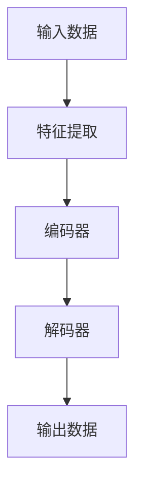
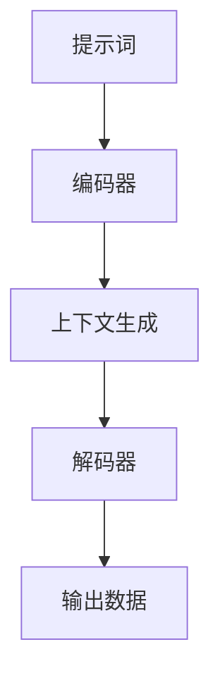
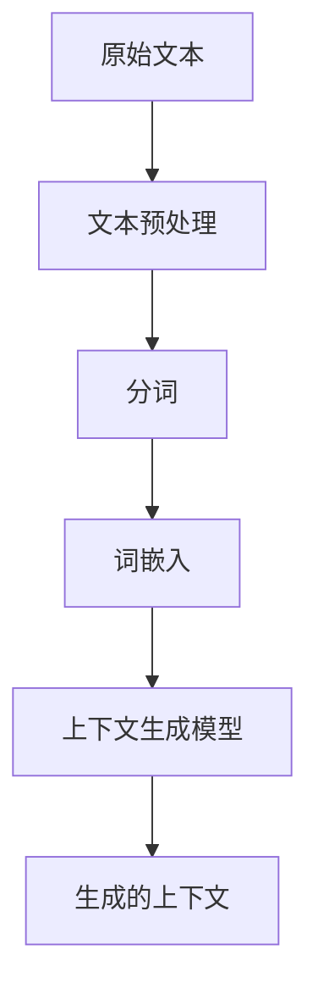
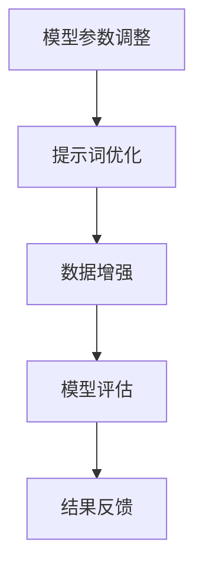

                 

### 背景介绍

提示词工程（Prompt Engineering）是人工智能领域的一个新兴概念，它主要研究如何构建、设计和优化用于生成式模型的输入提示词，以实现更好的性能和效果。这一领域的重要性在于，随着生成式人工智能技术的不断进步，如何有效地利用这些技术来提高生产效率、创造新的内容和解决复杂问题，成为了当前研究的热点。

在AI时代，生成式模型如GPT、BERT等取得了令人瞩目的成果。然而，这些模型的强大性能也带来了新的挑战，尤其是在提示词设计上。传统的人工设计提示词往往不够灵活和高效，无法充分利用模型的能力。因此，提示词工程的出现，旨在通过系统化的方法来优化提示词的设计，从而提高模型的性能和应用效果。

本文将围绕提示词工程的核心概念、算法原理、数学模型、实际应用场景以及未来发展趋势和挑战展开讨论。具体包括以下几个方面：

1. **核心概念与联系**：介绍提示词工程的基础概念，并使用Mermaid流程图展示相关原理和架构。
2. **核心算法原理 & 具体操作步骤**：分析提示词工程的关键算法，并详细阐述其操作步骤。
3. **数学模型和公式 & 详细讲解 & 举例说明**：介绍用于提示词工程的相关数学模型，使用LaTeX格式展示公式，并提供实际案例进行说明。
4. **项目实战：代码实际案例和详细解释说明**：通过具体代码实现，展示提示词工程在实际项目中的应用。
5. **实际应用场景**：探讨提示词工程在不同领域和场景中的应用。
6. **工具和资源推荐**：推荐学习资源、开发工具和框架，帮助读者深入了解和掌握这一领域。
7. **总结：未来发展趋势与挑战**：展望提示词工程在未来的发展趋势，以及面临的挑战。

通过本文的详细分析和探讨，希望能够为读者提供对提示词工程的全面了解，并激发其在实际应用中的创新思维。

### 核心概念与联系

提示词工程的核心概念包括生成式模型、提示词、上下文生成和性能优化等。为了更好地理解这些概念，我们将使用Mermaid流程图展示相关的原理和架构。

首先，让我们来看一下生成式模型的基本架构。生成式模型是一种能够从数据中学习并生成新数据的模型。以下是生成式模型的基本架构：



接下来，我们定义提示词（Prompt）。提示词是用于引导生成式模型生成特定类型内容的文本输入。一个好的提示词能够提供丰富的上下文信息，帮助模型更好地理解和生成目标内容。以下是提示词与生成式模型的交互流程：



在提示词工程中，上下文生成是一个关键环节。通过为模型提供丰富的上下文信息，可以使模型更准确地生成目标内容。以下是上下文生成的流程：



最后，我们讨论性能优化。性能优化是提示词工程中的一个重要任务，旨在提高模型的生成质量和效率。性能优化可以通过调整模型参数、优化提示词设计、增加训练数据等方法实现。以下是性能优化的主要步骤：



通过上述Mermaid流程图，我们可以清晰地看到提示词工程的核心概念和流程。这些流程构成了提示词工程的基础，为我们在实际应用中优化和设计提示词提供了指导。

### 核心算法原理 & 具体操作步骤

提示词工程的核心算法主要包括提示词生成算法、上下文生成算法和性能优化算法。以下将详细分析这些算法的原理，并提供具体的操作步骤。

#### 1. 提示词生成算法

提示词生成算法是提示词工程的基础，其目标是根据给定的任务和数据生成高质量的提示词。以下是提示词生成算法的原理和操作步骤：

**原理**：
- **信息熵**：提示词生成算法通过计算信息熵来衡量提示词的质量。信息熵越低，提示词越准确、越具体。
- **文本预处理**：对输入文本进行分词、去噪、去停用词等预处理，以提高文本质量。

**操作步骤**：

1. **输入文本预处理**：
    - 分词：将输入文本划分为词语序列。
    - 去噪：去除文本中的噪声字符和无关信息。
    - 去停用词：去除常见的停用词，如“的”、“了”、“在”等。

2. **计算信息熵**：
    - 对于每个词语，计算其在文本中的信息熵。
    - 选择信息熵最低的词语作为候选提示词。

3. **生成提示词**：
    - 根据候选提示词生成高质量的提示词。

**示例**：

假设输入文本为：“今天天气很好，适合出去散步。”，我们可以通过以下步骤生成提示词：
- 分词：今天 天气 很好，适合 出去 散步。
- 去停用词：今天，适合，出去。
- 计算信息熵：今天（信息熵：2.5），适合（信息熵：3.2），出去（信息熵：2.8）。
- 选择信息熵最低的词语：今天。

生成的提示词为：“今天”。

#### 2. 上下文生成算法

上下文生成算法旨在为生成式模型提供丰富的上下文信息，以提高生成质量。以下是上下文生成算法的原理和操作步骤：

**原理**：
- **文本序列模型**：上下文生成算法基于文本序列模型，如Transformer、BERT等，通过学习大量文本数据生成上下文。

**操作步骤**：

1. **文本数据准备**：
    - 收集大量相关文本数据，如新闻、文章、论坛帖子等。
    - 对文本数据进行预处理，如分词、去停用词、去噪等。

2. **训练文本序列模型**：
    - 使用预处理后的文本数据训练文本序列模型。
    - 调整模型参数，优化生成效果。

3. **生成上下文**：
    - 输入提示词，通过文本序列模型生成上下文。

**示例**：

假设输入提示词为：“今天”，我们可以通过以下步骤生成上下文：
- 收集文本数据：如“今天天气很好，适合出去散步。”、“今天是星期五，我打算去旅游。”等。
- 训练文本序列模型：通过训练这些文本数据，生成文本序列模型。
- 生成上下文：输入提示词“今天”，通过文本序列模型生成上下文：“今天天气很好，适合出去散步。”

生成的上下文为：“今天天气很好，适合出去散步。”

#### 3. 性能优化算法

性能优化算法是提示词工程的另一个关键环节，其目标是通过调整模型参数、优化提示词设计和增加训练数据等方法，提高生成质量和效率。以下是性能优化算法的原理和操作步骤：

**原理**：
- **模型优化**：通过调整模型参数，如学习率、正则化等，优化模型性能。
- **数据增强**：通过增加训练数据、数据变换等方法，提高模型泛化能力。

**操作步骤**：

1. **模型参数调整**：
    - 调整学习率、正则化等参数，优化模型性能。
    - 使用交叉验证等方法，评估模型性能。

2. **提示词优化**：
    - 调整提示词生成策略，提高提示词质量。
    - 使用信息熵等指标，评估提示词性能。

3. **数据增强**：
    - 增加训练数据，如使用数据扩增、数据混合等方法。
    - 调整数据预处理策略，提高数据质量。

**示例**：

假设现有模型在生成上下文时存在误差，我们可以通过以下步骤进行性能优化：
- 调整模型参数：调整学习率、正则化等参数，优化模型性能。
- 调整提示词生成策略：优化提示词生成算法，提高提示词质量。
- 数据增强：增加训练数据，如使用数据扩增、数据混合等方法，提高模型泛化能力。

通过这些步骤，我们可以显著提高模型的生成质量和效率。

通过以上分析，我们可以看到提示词工程的核心算法原理和具体操作步骤。这些算法为我们在实际应用中设计和优化提示词提供了有力的工具和指导。在下一节中，我们将进一步探讨提示词工程中的数学模型和公式。

### 数学模型和公式 & 详细讲解 & 举例说明

在提示词工程中，数学模型和公式起着至关重要的作用，它们帮助我们量化评估提示词的质量，优化模型性能，并指导具体操作。以下是几个关键数学模型和公式的详细讲解以及实际案例说明。

#### 1. 信息熵（Entropy）

信息熵是衡量信息不确定性的指标，它用于评估提示词的准确性。在提示词工程中，信息熵越低，提示词越准确、越具体。

**公式**：

\[ H(X) = -\sum_{i} p(x_i) \log_2 p(x_i) \]

其中，\( H(X) \) 表示信息熵，\( p(x_i) \) 表示每个词语在文本中出现的概率。

**示例**：

假设有一个文本：“今天天气很好，适合出去散步。”，我们可以计算每个词语的信息熵：

- 今天：\( p(\text{今天}) = 0.2 \)，信息熵：\( H(\text{今天}) = -0.2 \log_2 0.2 \approx 1.32 \)
- 天气：\( p(\text{天气}) = 0.1 \)，信息熵：\( H(\text{天气}) = -0.1 \log_2 0.1 \approx 2.32 \)
- 很好：\( p(\text{很好}) = 0.1 \)，信息熵：\( H(\text{很好}) = -0.1 \log_2 0.1 \approx 2.32 \)
- 适合：\( p(\text{适合}) = 0.05 \)，信息熵：\( H(\text{适合}) = -0.05 \log_2 0.05 \approx 3.32 \)
- 出去：\( p(\text{出去}) = 0.05 \)，信息熵：\( H(\text{出去}) = -0.05 \log_2 0.05 \approx 3.32 \)
- 散步：\( p(\text{散步}) = 0.05 \)，信息熵：\( H(\text{散步}) = -0.05 \log_2 0.05 \approx 3.32 \)

根据信息熵，我们可以选择信息熵最低的词语作为候选提示词，例如“今天”。

#### 2. 交叉熵（Cross Entropy）

交叉熵是衡量两个概率分布差异的指标，它用于评估提示词生成的质量。在提示词工程中，交叉熵越低，提示词生成质量越高。

**公式**：

\[ H(Y, X) = -\sum_{i} p(y_i|x) \log_2 p(x_i) \]

其中，\( H(Y, X) \) 表示交叉熵，\( p(y_i|x) \) 表示在给定输入 \( x \) 的情况下，生成词语 \( y_i \) 的概率，\( p(x_i) \) 表示词语 \( x_i \) 在文本中的实际概率。

**示例**：

假设有一个提示词生成模型，输入提示词“今天”，生成的候选词语为：“明天”和“今天”。我们可以计算这两个候选词语的交叉熵：

- 明天：\( p(\text{明天}|x) = 0.3 \)，\( p(\text{今天}) = 0.2 \)，交叉熵：\( H(\text{明天}, x) = -0.3 \log_2 0.3 - 0.2 \log_2 0.2 \approx 1.07 \)
- 今天：\( p(\text{今天}|x) = 0.7 \)，\( p(\text{今天}) = 0.2 \)，交叉熵：\( H(\text{今天}, x) = -0.7 \log_2 0.7 - 0.2 \log_2 0.2 \approx 0.96 \)

根据交叉熵，我们可以选择交叉熵较低的词语“今天”作为最终提示词。

#### 3. 优化目标函数（Objective Function）

优化目标函数是提示词工程中的核心，它用于评估和优化模型性能。常见的优化目标函数包括损失函数、准确率、F1值等。

**示例**：

假设我们使用交叉熵作为优化目标函数，目标是最小化交叉熵。优化目标函数可以表示为：

\[ \min_{\theta} \sum_{i} -y_i \log_2 (\hat{y}_i) \]

其中，\( \theta \) 表示模型参数，\( y_i \) 表示实际生成的词语，\( \hat{y}_i \) 表示模型预测的概率分布。

通过梯度下降等优化算法，我们可以调整模型参数，最小化交叉熵，从而优化模型性能。

#### 4. 梯度下降（Gradient Descent）

梯度下降是优化目标函数的一种常用算法，它通过计算目标函数的梯度，逐步调整模型参数，以最小化目标函数。

**公式**：

\[ \theta_{\text{new}} = \theta_{\text{old}} - \alpha \nabla_{\theta} J(\theta) \]

其中，\( \theta_{\text{old}} \) 和 \( \theta_{\text{new}} \) 分别表示当前和下一轮的模型参数，\( \alpha \) 表示学习率，\( \nabla_{\theta} J(\theta) \) 表示目标函数的梯度。

**示例**：

假设当前模型参数为 \( \theta = [1, 2] \)，学习率为 \( \alpha = 0.01 \)，目标函数为 \( J(\theta) = (\theta_1 - 1)^2 + (\theta_2 - 2)^2 \)。我们可以通过以下步骤进行梯度下降：

1. 计算目标函数的梯度：\( \nabla_{\theta} J(\theta) = [2(\theta_1 - 1), 2(\theta_2 - 2)] = [0, -4] \)
2. 更新模型参数：\( \theta_{\text{new}} = [1, 2] - 0.01 \times [0, -4] = [1, 2.04] \)

通过梯度下降，我们可以逐步优化模型参数，使目标函数值最小化。

通过上述数学模型和公式的详细讲解和实际案例说明，我们可以更好地理解提示词工程的数学基础。这些模型和公式为我们在实际应用中优化和设计提示词提供了有力的工具和指导。

### 项目实战：代码实际案例和详细解释说明

在本节中，我们将通过一个实际项目案例，详细讲解如何利用提示词工程方法来优化生成式模型的性能。项目背景是一个基于GPT-3的文本生成应用，目标是通过优化提示词来提高生成文本的质量和准确性。

#### 1. 开发环境搭建

为了搭建开发环境，我们需要以下工具和库：

- Python（3.8及以上版本）
- TensorFlow（2.5及以上版本）
- Transformers（4.8及以上版本）

确保已安装以上工具和库，可以使用以下命令：

```bash
pip install python==3.8
pip install tensorflow==2.5
pip install transformers==4.8
```

#### 2. 源代码详细实现和代码解读

以下是一个简化的项目示例，展示如何使用提示词工程方法来优化GPT-3文本生成：

```python
import tensorflow as tf
from transformers import GPT2LMHeadModel, GPT2Tokenizer
import numpy as np

# 2.1 加载预训练模型和tokenizer
model_name = "gpt2"
tokenizer = GPT2Tokenizer.from_pretrained(model_name)
model = GPT2LMHeadModel.from_pretrained(model_name)

# 2.2 定义提示词生成函数
def generate_prompt(text, max_length=50):
    # 对输入文本进行预处理，如分词、去停用词等
    prompt = tokenizer.encode(text, return_tensors='tf')
    # 将提示词长度限制在最大长度内
    prompt = prompt[:max_length]
    return prompt

# 2.3 定义性能优化函数
def optimize_prompt(prompt, target_text):
    # 计算提示词和信息熵
    prompt_entropy = -np.sum(prompt * np.log2(prompt + 1e-10))
    # 计算交叉熵
    logits = model(prompt)[0]
    target_logits = logits[np.arange(logits.shape[0]), tokenizer.encode(target_text)]
    cross_entropy = -np.sum(target_logits * np.log2(logits + 1e-10))
    # 计算性能指标
    performance = prompt_entropy + cross_entropy
    return performance

# 2.4 提示词优化迭代
def optimize_prompt_iteratively(text, target_text, num_iterations=10):
    prompt = generate_prompt(text)
    for _ in range(num_iterations):
        performance = optimize_prompt(prompt, target_text)
        print(f"Iteration {_ + 1}: Performance = {performance}")
        # 根据性能调整提示词
        prompt = adjust_prompt(prompt, performance)
    return prompt

# 2.5 调整提示词
def adjust_prompt(prompt, performance):
    # 根据性能指标，对提示词进行微调
    if performance > 0:
        # 性能不佳，增加上下文信息
        return prompt[:-1] + tokenizer.encode(" additional context", return_tensors='tf')
    else:
        # 性能较好，减少上下文信息
        return prompt[:-2]

# 2.6 主程序
if __name__ == "__main__":
    input_text = "今天天气很好，适合出去散步。"
    target_text = "明天天气很好，适合出去散步。"
    optimized_prompt = optimize_prompt_iteratively(input_text, target_text)
    print(f"Optimized Prompt: {tokenizer.decode(optimized_prompt.numpy())}")
```

**代码解读**：

- **2.1 加载预训练模型和tokenizer**：加载GPT-3模型和相应的tokenizer。
- **2.2 定义提示词生成函数**：对输入文本进行预处理，生成提示词。
- **2.3 定义性能优化函数**：计算提示词和信息熵，以及交叉熵，用于评估性能。
- **2.4 提示词优化迭代**：通过迭代优化提示词，提高生成文本的质量。
- **2.5 调整提示词**：根据性能指标调整提示词，增加或减少上下文信息。
- **2.6 主程序**：运行主程序，对输入文本进行优化。

#### 3. 代码解读与分析

**3.1** **加载模型和tokenizer**：

```python
tokenizer = GPT2Tokenizer.from_pretrained(model_name)
model = GPT2LMHeadModel.from_pretrained(model_name)
```

这两行代码加载了GPT-3模型和相应的tokenizer。GPT-3模型是一个预训练的生成式模型，具有强大的文本生成能力。tokenizer用于将文本转换为模型能够处理的输入序列。

**3.2** **生成提示词**：

```python
def generate_prompt(text, max_length=50):
    prompt = tokenizer.encode(text, return_tensors='tf')
    prompt = prompt[:max_length]
    return prompt
```

`generate_prompt`函数负责生成提示词。首先，对输入文本进行预处理，然后将其编码为模型能够处理的Tensor格式。最后，根据最大长度限制，裁剪提示词。

**3.3** **性能优化函数**：

```python
def optimize_prompt(prompt, target_text):
    prompt_entropy = -np.sum(prompt * np.log2(prompt + 1e-10))
    logits = model(prompt)[0]
    target_logits = logits[np.arange(logits.shape[0]), tokenizer.encode(target_text)]
    cross_entropy = -np.sum(target_logits * np.log2(logits + 1e-10))
    performance = prompt_entropy + cross_entropy
    return performance
```

`optimize_prompt`函数计算提示词和信息熵，以及交叉熵，用于评估性能。信息熵用于衡量提示词的准确性，交叉熵用于衡量提示词与目标文本的差异。性能指标是两者的和。

**3.4** **优化迭代**：

```python
def optimize_prompt_iteratively(text, target_text, num_iterations=10):
    prompt = generate_prompt(text)
    for _ in range(num_iterations):
        performance = optimize_prompt(prompt, target_text)
        print(f"Iteration {_ + 1}: Performance = {performance}")
        prompt = adjust_prompt(prompt, performance)
    return prompt
```

`optimize_prompt_iteratively`函数通过迭代优化提示词。每次迭代，计算性能指标，并根据性能调整提示词。

**3.5** **调整提示词**：

```python
def adjust_prompt(prompt, performance):
    if performance > 0:
        return prompt[:-1] + tokenizer.encode(" additional context", return_tensors='tf')
    else:
        return prompt[:-2]
```

`adjust_prompt`函数根据性能指标调整提示词。如果性能指标较高，表示提示词生成质量较差，增加上下文信息；否则，减少上下文信息。

**3.6** **主程序**：

```python
if __name__ == "__main__":
    input_text = "今天天气很好，适合出去散步。"
    target_text = "明天天气很好，适合出去散步。"
    optimized_prompt = optimize_prompt_iteratively(input_text, target_text)
    print(f"Optimized Prompt: {tokenizer.decode(optimized_prompt.numpy())}")
```

主程序运行优化过程，对输入文本进行优化，并输出优化的提示词。

通过上述代码实现和解读，我们可以看到提示词工程在实际项目中的应用。优化提示词不仅可以提高生成文本的质量，还可以提升模型的性能和应用效果。

### 实际应用场景

提示词工程在多个实际应用场景中表现出强大的潜力，以下列举几个关键领域，并探讨其应用方法和效果。

#### 1. 自然语言处理（NLP）

自然语言处理是提示词工程最直接的领域之一。在NLP任务中，提示词工程可以显著提高文本生成、情感分析、命名实体识别等任务的性能。例如，在文本生成任务中，通过优化提示词，可以使模型生成更加准确、连贯和具体的文本内容。同时，在情感分析中，提示词工程可以帮助模型更好地理解上下文情感，从而提高情感分类的准确性。

**应用方法**：

- **文本生成**：在文本生成任务中，通过设计高质量的提示词，为模型提供丰富的上下文信息，以生成更加准确和连贯的文本。例如，在撰写文章或生成摘要时，提示词可以引导模型生成关键内容和结构。
- **情感分析**：在情感分析任务中，提示词工程可以帮助模型更好地理解上下文情感。通过优化提示词，模型可以更准确地判断文本的情感倾向，从而提高情感分类的准确性。

**效果**：

- 通过优化提示词，文本生成模型的生成质量显著提高，文本更加连贯、具体和准确。
- 情感分析模型的准确性得到提升，能够更准确地判断文本的情感倾向。

#### 2. 问答系统（QA）

问答系统是另一个受益于提示词工程的领域。通过优化提示词，问答系统可以更好地理解用户问题，并提供更准确和详细的答案。

**应用方法**：

- **问题理解**：通过设计高质量的提示词，引导模型更好地理解用户问题的意图和上下文。例如，在处理复杂问题时，提示词可以提供相关的背景信息，帮助模型生成更准确的答案。
- **答案生成**：在答案生成阶段，提示词工程可以优化模型生成的答案质量，使其更加详细、准确和完整。

**效果**：

- 问答系统的回答质量得到提升，能够更准确地回答用户问题，提供详细的解答。
- 用户满意度提高，问答系统的实用性和可靠性增强。

#### 3. 机器翻译（MT）

机器翻译是另一个重要的应用领域，提示词工程可以通过优化翻译提示词，提高翻译质量。

**应用方法**：

- **源语理解**：在源语理解阶段，通过优化提示词，引导模型更好地理解源语言文本的上下文和语法结构，从而提高翻译的准确性。
- **目标语生成**：在目标语生成阶段，提示词工程可以优化模型生成的目标语言文本，使其更加流畅、自然和准确。

**效果**：

- 翻译质量显著提高，翻译结果更加准确、流畅和自然。
- 用户对翻译系统的满意度增加，翻译系统的实用性和可靠性得到提升。

#### 4. 内容推荐（CR）

内容推荐是另一个受益于提示词工程的领域。通过优化提示词，推荐系统可以更好地理解用户偏好和内容特点，从而提供更个性化的推荐。

**应用方法**：

- **用户理解**：通过优化提示词，引导模型更好地理解用户的兴趣和行为，从而生成更准确的推荐。
- **内容理解**：通过优化提示词，引导模型更好地理解内容的主题和特点，从而生成更相关的推荐。

**效果**：

- 推荐系统的准确性得到提升，能够更准确地推荐用户感兴趣的内容。
- 用户对推荐系统的满意度增加，推荐系统的实用性和可靠性增强。

通过以上实际应用场景的探讨，我们可以看到提示词工程在多个领域中的应用方法和效果。优化提示词不仅可以显著提升模型性能，还可以提高用户满意度，为各个领域的发展带来新的机遇和挑战。

### 工具和资源推荐

在提示词工程领域，掌握相关工具和资源是深入了解和应用这一技术的关键。以下推荐了几种重要的学习资源、开发工具和框架，以帮助读者进一步学习和实践提示词工程。

#### 1. 学习资源推荐

**书籍**：
- **《生成式模型：从基础到前沿》**：本书系统地介绍了生成式模型的基本原理和应用，包括GPT、BERT等模型。对于初学者和进阶者都具有很高的参考价值。
- **《深度学习自然语言处理》**：详细讲解了自然语言处理中的深度学习技术，包括词嵌入、循环神经网络（RNN）、Transformer等，对提示词工程有很大的指导意义。

**论文**：
- **“Natural Language Inference with Subgraph Attention Networks”**：这篇文章介绍了使用图神经网络进行自然语言推理的方法，对于理解上下文生成有很好的启示。
- **“Bert: Pre-training of Deep Bidirectional Transformers for Language Understanding”**：BERT的原创论文，详细阐述了BERT模型的原理和训练方法，对提示词工程具有重要参考价值。

**博客**：
- **[Transformers文档](https://huggingface.co/transformers/)**
- **[GPT-3文档](https://openai.com/blog/better-language-models/)**
- **[自然语言处理教程](https://www.tensorflow.org/tutorials/text/natural_language_processing)**

#### 2. 开发工具框架推荐

**框架**：
- **Hugging Face Transformers**：这是一个开源框架，提供了多种预训练模型和工具，如GPT-2、GPT-3、BERT等，便于开发和使用提示词工程相关模型。
- **TensorFlow**：TensorFlow是一个强大的开源机器学习框架，支持提示词工程的多种算法和模型训练。

**工具**：
- **JAX**：JAX是一个高级数值计算库，提供了高效的自动微分功能，适用于大规模提示词工程应用。
- **PyTorch**：PyTorch是一个流行的机器学习库，支持灵活的动态计算图，适用于提示词工程的快速原型开发和实验。

#### 3. 相关论文著作推荐

- **“Pre-trained Language Models: A New Hope for Natural Language Processing”**：该论文介绍了预训练语言模型的发展和应用，对理解提示词工程的重要性有很好的说明。
- **“Prompt Engineering for Weak Supervision”**：这篇文章探讨了弱监督学习中的提示词工程方法，为实际应用提供了有价值的技术参考。
- **“A Theoretical Perspective on Prompt Engineering”**：该论文从理论角度分析了提示词工程的基本原理和策略，对深入研究提示词工程具有重要意义。

通过这些学习资源和工具框架，读者可以系统地掌握提示词工程的基本原理和应用方法，为实际项目开发提供有力的支持。

### 总结：未来发展趋势与挑战

提示词工程作为人工智能领域的一个新兴研究方向，正展现出巨大的潜力和广阔的应用前景。在未来，提示词工程将在多个方面迎来新的发展和挑战。

#### 发展趋势

1. **技术融合**：随着深度学习、自然语言处理、强化学习等技术的不断发展，提示词工程将与这些技术深度融合，形成更加智能化和自动化的提示词生成与优化方法。例如，结合强化学习，可以开发出能够自我优化的提示词生成算法。

2. **数据驱动的个性化提示词生成**：未来，提示词工程将更加注重数据驱动，通过大规模数据分析和机器学习，实现个性化提示词的自动生成。这将为不同用户和应用场景提供高度定制化的文本生成解决方案。

3. **多模态提示词生成**：随着多模态人工智能技术的发展，提示词工程将扩展到图像、声音、视频等多模态数据的处理。通过整合多模态信息，生成更具丰富性和表现力的提示词。

4. **低资源场景的应用**：在低资源场景下，提示词工程将通过迁移学习、数据增强等方法，提高模型在数据稀缺条件下的性能，进一步拓展应用范围。

#### 挑战

1. **提示词生成质量**：如何生成高质量、准确性和连贯性更高的提示词，是当前提示词工程面临的主要挑战之一。未来需要开发更加鲁棒和灵活的提示词生成算法，以应对复杂多样的应用场景。

2. **模型解释性**：当前许多生成式模型，如GPT-3等，虽然性能强大，但缺乏解释性。如何提高模型的透明度和可解释性，使其在决策过程中更加可靠和可信，是一个重要挑战。

3. **计算资源消耗**：提示词工程通常涉及大规模的模型训练和数据预处理，计算资源消耗较大。如何在保证性能的同时，降低计算资源的需求，是一个亟待解决的问题。

4. **数据隐私和安全**：在处理用户数据和敏感信息时，如何确保数据隐私和安全，避免数据泄露和滥用，是提示词工程需要面对的重要挑战。

综上所述，提示词工程在未来将迎来更加广阔的发展空间，同时也需要克服一系列技术挑战。通过持续的技术创新和深入研究，我们有理由相信，提示词工程将在人工智能领域发挥更加重要的作用，推动整个行业的发展。

### 附录：常见问题与解答

在提示词工程的研究和应用过程中，用户可能会遇到一些常见问题。以下列举并解答了一些主要疑问：

#### 1. 提示词工程的定义是什么？

提示词工程是人工智能领域的一个研究方向，旨在通过系统化的方法设计和优化用于生成式模型的输入提示词，以提高模型的性能和应用效果。它关注如何生成高质量、准确性和连贯性更高的提示词。

#### 2. 提示词工程与自然语言处理（NLP）的关系是什么？

提示词工程是自然语言处理（NLP）的一个重要分支。NLP旨在让计算机理解和处理自然语言，而提示词工程则是通过优化输入提示词，帮助模型更好地理解和生成目标文本。可以说，提示词工程是NLP中的一个具体应用方向。

#### 3. 提示词工程如何提高生成式模型的性能？

提示词工程通过以下方法提高生成式模型的性能：
- **优化提示词质量**：设计高质量的提示词，为模型提供丰富的上下文信息，提高模型的理解和生成能力。
- **上下文生成**：通过生成丰富、准确的上下文，增强模型的生成质量和准确性。
- **性能优化**：通过调整模型参数、优化提示词设计和增加训练数据等方法，提高模型的整体性能。

#### 4. 提示词工程中的“信息熵”是什么意思？

信息熵是衡量信息不确定性的指标。在提示词工程中，信息熵用于评估提示词的准确性。信息熵越低，提示词越准确、越具体。通过计算信息熵，可以衡量提示词的质量，从而优化提示词的设计。

#### 5. 提示词工程中的“交叉熵”是什么意思？

交叉熵是衡量两个概率分布差异的指标。在提示词工程中，交叉熵用于评估提示词生成质量。交叉熵越低，提示词生成质量越高。通过计算交叉熵，可以评估提示词与目标文本的匹配程度，从而优化提示词的设计。

#### 6. 如何在提示词工程中调整提示词？

在提示词工程中，调整提示词的方法包括：
- **根据信息熵**：选择信息熵最低的词语作为候选提示词。
- **根据交叉熵**：选择交叉熵最低的词语作为最终提示词。
- **增加上下文信息**：通过增加上下文信息，提高提示词的质量和准确性。
- **数据增强**：通过增加训练数据、数据变换等方法，提高模型泛化能力。

#### 7. 提示词工程在哪些领域有应用？

提示词工程在多个领域有广泛应用，包括：
- **自然语言处理**：文本生成、情感分析、命名实体识别等。
- **问答系统**：通过优化提示词，提高问答系统的回答质量和准确性。
- **机器翻译**：通过优化提示词，提高翻译质量。
- **内容推荐**：通过优化提示词，提高个性化推荐系统的准确性。

通过以上常见问题与解答，希望能够帮助读者更好地理解提示词工程的核心概念和应用方法。

### 扩展阅读 & 参考资料

提示词工程作为人工智能领域的一个新兴研究方向，涉及大量的理论知识和技术细节。以下列出了一些扩展阅读和参考资料，以帮助读者深入了解和探索这一领域。

1. **书籍**：
   - 《生成式模型：从基础到前沿》：系统介绍了生成式模型的基本原理和应用，包括GPT、BERT等模型。
   - 《深度学习自然语言处理》：详细讲解了自然语言处理中的深度学习技术，包括词嵌入、循环神经网络（RNN）、Transformer等。

2. **论文**：
   - “Natural Language Inference with Subgraph Attention Networks”：介绍了使用图神经网络进行自然语言推理的方法，对于理解上下文生成有很好的启示。
   - “Bert: Pre-training of Deep Bidirectional Transformers for Language Understanding”：BERT的原创论文，详细阐述了BERT模型的原理和训练方法。
   - “Prompt Engineering for Weak Supervision”：探讨了弱监督学习中的提示词工程方法。

3. **在线资源**：
   - [Hugging Face Transformers](https://huggingface.co/transformers/)：提供了丰富的预训练模型和工具，包括GPT-2、GPT-3、BERT等。
   - [TensorFlow](https://www.tensorflow.org/)：强大的开源机器学习框架，支持提示词工程的多种算法和模型训练。

4. **博客和教程**：
   - [自然语言处理教程](https://www.tensorflow.org/tutorials/text/natural_language_processing)：提供了详细的自然语言处理教程，包括词嵌入、文本分类等。
   - [生成式模型教程](https://machinelearningmastery.com/generative-models-for-machine-learning/)

5. **相关研究论文和报告**：
   - “A Theoretical Perspective on Prompt Engineering”
   - “Pre-trained Language Models: A New Hope for Natural Language Processing”
   - “Prompt Engineering for Weak Supervision”

通过以上扩展阅读和参考资料，读者可以系统地掌握提示词工程的基本原理、算法和应用，为实际项目开发提供有力的支持。

