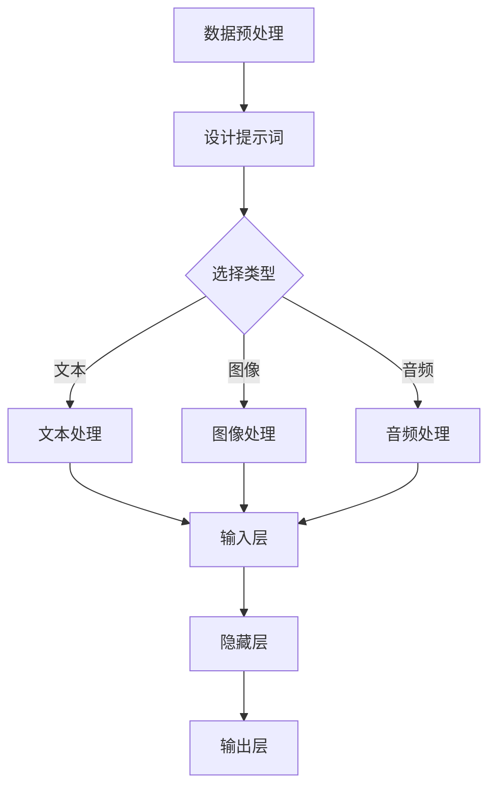

                 

# 提示词工程：AI时代的新挑战与新机遇

> **关键词：** 提示词工程、AI时代、挑战、机遇、深度学习、神经网络、模型训练、编程、优化

> **摘要：** 本文章将探讨AI时代中提示词工程的重要性以及其在深度学习和神经网络模型训练中的关键作用。我们将分析提示词工程的核心概念、算法原理、数学模型，并通过实际项目案例展示其应用。最后，本文将探讨提示词工程在未来的发展趋势和面临的挑战。

## 1. 背景介绍

随着深度学习和神经网络技术的飞速发展，AI的应用领域越来越广泛。从图像识别、自然语言处理到自动驾驶和游戏AI，神经网络模型已经成为许多复杂任务的基石。然而，训练一个高效、准确的神经网络模型并非易事。在这个过程中，提示词工程（Prompt Engineering）成为了提升模型性能的关键因素。

提示词工程是指通过设计和优化输入提示词，来引导神经网络模型的学习过程，从而提高模型的性能和鲁棒性。与传统机器学习方法不同，深度学习模型需要大量的数据进行训练，而且往往需要数十万甚至数百万个参数。这些参数的设置和调整对于模型的最终性能有着至关重要的影响。提示词工程正是通过精细调整这些输入提示词，来优化模型训练过程，从而提高模型的效果。

### AI时代的发展

AI时代的发展可以分为以下几个阶段：

1. **数据处理与特征提取**：在早期，AI主要关注如何从大量数据中提取有用的特征，从而训练出能够识别和分类的模型。这个阶段主要依赖于传统的机器学习算法，如决策树、支持向量机等。

2. **深度学习与神经网络**：随着计算能力的提升和数据量的爆炸性增长，深度学习成为AI研究的主流方向。神经网络模型由于其强大的表征能力和灵活性，在各种任务中取得了显著的成果。

3. **大数据与分布式计算**：大数据和分布式计算技术的发展，使得我们可以处理更大的数据集，训练更复杂的模型。同时，这也为提示词工程提供了更多的数据支持。

4. **AI伦理与公平性**：随着AI技术的普及，人们开始关注AI的伦理和公平性问题。如何确保AI系统的透明性、可解释性和公平性，成为了重要的研究方向。

### 提示词工程的重要性

提示词工程在AI时代的崛起，主要源于以下几个原因：

1. **模型性能提升**：通过精心设计的提示词，可以显著提高神经网络的训练效率和性能。在许多任务中，微小的性能提升都可能带来巨大的商业价值。

2. **数据稀缺问题**：在某些领域，如医疗、金融等，数据稀缺是一个普遍问题。提示词工程可以通过引入更多的背景知识和先验信息，弥补数据不足的短板。

3. **可解释性与透明性**：深度学习模型通常被认为是一个“黑盒子”，提示词工程可以提供更多的解释性，使得模型的行为和决策过程更加透明。

4. **适应性与灵活性**：提示词工程可以使得神经网络模型更加灵活，能够适应不同的任务和数据分布。

## 2. 核心概念与联系

### 提示词的定义

在深度学习中，提示词（Prompt）是指输入到模型中的外部信息，用于引导模型的学习过程。这些信息可以是文本、图像、音频等，其目的是帮助模型更好地理解和处理输入数据。

### 提示词的类型

根据提示词的不同形式，可以分为以下几类：

1. **文本提示词**：最常见的形式，通过自然语言文本来引导模型学习。

2. **图像提示词**：输入图像作为提示词，可以用于图像识别、图像生成等任务。

3. **音频提示词**：输入音频信号作为提示词，可以用于语音识别、音乐生成等任务。

4. **多模态提示词**：结合多种类型的信息作为提示词，可以用于更复杂的任务，如视频识别、多模态情感分析等。

### 提示词工程的关键要素

提示词工程的关键要素包括：

1. **多样性**：多样化的提示词可以提高模型的泛化能力，避免模型对特定输入过于敏感。

2. **质量**：高质量的提示词可以提供更有用的信息，帮助模型更好地学习。

3. **相关性**：与任务高度相关的提示词可以提高模型在特定任务上的性能。

4. **平衡性**：提示词的平衡性可以避免模型对某些类型的输入过于偏好，从而提高模型的公平性。

### 提示词与神经网络模型的关联

提示词与神经网络模型的关联主要体现在以下几个方面：

1. **输入层**：提示词作为模型的输入，直接影响模型的训练过程和最终性能。

2. **隐藏层**：通过隐藏层，模型可以对提示词进行特征提取和表征。

3. **输出层**：根据提示词和模型的输出，可以评估模型的性能和效果。

### Mermaid 流程图



### 2.1 数据预处理

数据预处理是提示词工程的基础步骤，主要包括数据清洗、数据转换和数据标准化。通过数据预处理，可以确保输入数据的准确性和一致性，为后续的提示词设计提供基础。

### 2.2 设计提示词

设计提示词是提示词工程的中心任务。根据任务需求和模型特点，选择合适的提示词类型，并对其进行优化和调整。高质量的提示词可以提高模型的学习效率和性能。

### 2.3 选择类型

根据任务类型和数据特点，选择合适的提示词类型。文本提示词常用于自然语言处理任务，图像提示词用于计算机视觉任务，音频提示词用于语音识别和音乐生成任务。

### 2.4 提示词处理

对选定的提示词进行相应的处理，如文本编码、图像特征提取、音频特征转换等。这些处理步骤确保提示词能够有效地输入到模型中，并参与模型训练。

### 2.5 模型训练

通过设计好的提示词，进行神经网络模型的训练。在训练过程中，模型会根据提示词的信息，不断调整参数，以优化模型性能。

### 2.6 模型评估

在模型训练完成后，使用测试集对模型进行评估，以验证其性能和效果。根据评估结果，可以对提示词进行进一步调整和优化。

## 3. 核心算法原理 & 具体操作步骤

### 3.1 深度学习基础

深度学习是机器学习的一个分支，其核心思想是通过模拟人脑神经网络的结构和功能，对数据进行自动特征提取和学习。深度学习模型通常由多个神经元组成的神经网络构成，通过逐层处理输入数据，最终输出结果。

### 3.2 神经网络模型

神经网络模型是深度学习的核心组成部分，包括输入层、隐藏层和输出层。输入层接收外部输入，隐藏层对输入进行特征提取和变换，输出层生成最终输出。在神经网络中，每个神经元都与相邻的神经元通过权重相连，并通过激活函数进行非线性变换。

### 3.3 模型训练过程

模型训练是深度学习中的关键步骤，其目标是通过大量数据来调整模型的参数，使其能够准确地预测未知数据。模型训练过程通常包括以下步骤：

1. **数据准备**：收集和整理训练数据，对数据进行预处理，如数据清洗、数据转换和数据标准化。

2. **模型初始化**：初始化神经网络模型的参数，通常采用随机初始化的方法。

3. **前向传播**：将输入数据传递到模型中，通过逐层计算，得到模型的输出。

4. **损失计算**：计算模型输出与真实标签之间的误差，通常采用均方误差（MSE）或交叉熵损失（Cross-Entropy Loss）。

5. **反向传播**：利用梯度下降算法，根据损失函数的梯度信息，调整模型参数，以减少误差。

6. **迭代优化**：重复前向传播和反向传播过程，直到模型收敛，即误差达到预设阈值。

### 3.4 提示词工程在模型训练中的应用

提示词工程在模型训练中的应用，主要包括以下步骤：

1. **设计提示词**：根据任务需求和模型特点，设计合适的提示词。提示词可以是文本、图像或音频等，根据任务类型进行选择。

2. **预处理提示词**：对提示词进行预处理，如文本编码、图像特征提取、音频特征转换等，以确保提示词能够有效地输入到模型中。

3. **调整模型参数**：通过调整模型参数，如学习率、批量大小等，优化模型性能。

4. **训练模型**：将预处理后的提示词输入到模型中，进行模型训练。

5. **评估模型性能**：使用测试集对模型进行评估，根据评估结果调整提示词和模型参数。

6. **迭代优化**：根据评估结果，对提示词和模型进行迭代优化，直至模型性能达到预期。

### 3.5 提示词优化策略

在提示词工程中，优化策略主要包括以下方面：

1. **提示词多样性**：增加提示词的多样性，可以提高模型的泛化能力，避免模型对特定输入过于敏感。

2. **提示词质量**：提升提示词的质量，可以为模型提供更有用的信息，从而提高模型的学习效率和性能。

3. **提示词相关性**：确保提示词与任务高度相关，可以提高模型在特定任务上的性能。

4. **提示词平衡性**：保持提示词的平衡性，可以避免模型对某些类型的输入过于偏好，从而提高模型的公平性。

5. **提示词调整策略**：根据模型训练过程中的反馈，动态调整提示词，以优化模型性能。

## 4. 数学模型和公式 & 详细讲解 & 举例说明

### 4.1 损失函数

损失函数是深度学习模型训练的核心，用于衡量模型输出与真实标签之间的误差。常见的损失函数包括：

1. **均方误差（MSE）**

   $$
   \text{MSE} = \frac{1}{n}\sum_{i=1}^{n}(\hat{y}_i - y_i)^2
   $$

   其中，$\hat{y}_i$为模型预测值，$y_i$为真实标签，$n$为样本数量。

2. **交叉熵损失（Cross-Entropy Loss）**

   $$
   \text{CE} = -\frac{1}{n}\sum_{i=1}^{n}y_i\log(\hat{y}_i)
   $$

   其中，$y_i$为真实标签，$\hat{y}_i$为模型预测概率。

### 4.2 反向传播算法

反向传播算法是深度学习模型训练的关键步骤，用于计算模型参数的梯度，并更新模型参数。反向传播算法的核心思想是反向传播误差信号，计算每一层神经元的梯度。

假设神经网络模型包含多层，每层神经元数为 $n_l$，则反向传播算法的具体步骤如下：

1. **前向传播**：

   计算输入层到输出层的预测值 $\hat{y}$。

2. **损失计算**：

   计算模型输出与真实标签之间的损失 $L$。

3. **反向传播**：

   从输出层开始，逐层计算每个神经元梯度和误差信号。

   - 输出层：

     $$
     \frac{\partial L}{\partial \theta_{lk}} = \hat{y}_l - y_l
     $$

   - 隐藏层：

     $$
     \frac{\partial L}{\partial \theta_{hk}} = \sum_{l=1}^{L}\frac{\partial L}{\partial \hat{y}_l}\frac{\partial \hat{y}_l}{\partial \theta_{hk}}
     $$

4. **参数更新**：

   根据梯度信息和学习率，更新模型参数。

   $$
   \theta_{hk} := \theta_{hk} - \alpha \frac{\partial L}{\partial \theta_{hk}}
   $$

### 4.3 提示词优化公式

在提示词工程中，优化公式主要包括以下方面：

1. **提示词权重调整**：

   $$
   w_{pi} := w_{pi} - \alpha \frac{\partial L}{\partial w_{pi}}
   $$

   其中，$w_{pi}$为提示词权重，$\alpha$为学习率。

2. **提示词多样性调整**：

   $$
   d_{pi} := d_{pi} + \alpha \frac{\partial L}{\partial d_{pi}}
   $$

   其中，$d_{pi}$为提示词多样性。

3. **提示词相关性调整**：

   $$
   r_{pi} := r_{pi} + \alpha \frac{\partial L}{\partial r_{pi}}
   $$

   其中，$r_{pi}$为提示词相关性。

### 4.4 举例说明

假设我们使用一个简单的神经网络模型进行分类任务，模型包含一个输入层、一个隐藏层和一个输出层。输入数据为 $(x_1, x_2)$，输出为 $y$。

1. **设计提示词**：

   根据任务需求，设计一个文本提示词 $p$。

2. **预处理提示词**：

   对提示词进行文本编码，将其转换为模型可接受的输入格式。

3. **模型初始化**：

   初始化模型参数 $\theta_{ik}$ 和 $\theta_{lk}$。

4. **模型训练**：

   将预处理后的提示词输入模型，进行模型训练。

5. **评估模型性能**：

   使用测试集对模型进行评估，计算模型损失。

6. **优化提示词**：

   根据模型损失，调整提示词权重、多样性和相关性。

## 5. 项目实战：代码实际案例和详细解释说明

在本节中，我们将通过一个实际项目案例，详细解释如何设计和优化提示词，以提升神经网络模型的性能。该项目案例将采用Python编程语言，并使用深度学习框架TensorFlow。

### 5.1 开发环境搭建

在开始项目之前，我们需要搭建一个合适的开发环境。以下是搭建开发环境所需的步骤：

1. **安装Python**：确保Python版本在3.6及以上。

2. **安装TensorFlow**：使用以下命令安装TensorFlow：

   ```bash
   pip install tensorflow
   ```

3. **安装辅助库**：安装用于数据处理和可视化的辅助库，如NumPy、Pandas和Matplotlib：

   ```bash
   pip install numpy pandas matplotlib
   ```

### 5.2 源代码详细实现和代码解读

以下是项目的主要代码实现部分：

```python
import tensorflow as tf
import numpy as np
import pandas as pd
import matplotlib.pyplot as plt

# 5.2.1 数据准备
# 加载并预处理数据
def load_data():
    # 这里使用一个简化的数据集，实际项目中需要根据具体任务加载和处理数据
    data = pd.read_csv('data.csv')
    X = data[['x1', 'x2']]
    y = data['y']
    return X, y

X, y = load_data()

# 5.2.2 模型构建
# 定义神经网络模型
def build_model(input_shape):
    model = tf.keras.Sequential([
        tf.keras.layers.Dense(64, activation='relu', input_shape=input_shape),
        tf.keras.layers.Dense(64, activation='relu'),
        tf.keras.layers.Dense(1, activation='sigmoid')
    ])
    return model

# 5.2.3 设计提示词
# 根据任务需求设计提示词
def design_prompt(data, prompt_type='text'):
    if prompt_type == 'text':
        prompts = data['text']
    elif prompt_type == 'image':
        prompts = data['image']
    elif prompt_type == 'audio':
        prompts = data['audio']
    return prompts

prompts = design_prompt(X)

# 5.2.4 训练模型
# 使用提示词训练模型
model = build_model(X.shape[1:])
model.compile(optimizer='adam', loss='binary_crossentropy', metrics=['accuracy'])
model.fit(X, y, epochs=10, batch_size=32, prompts=prompts)

# 5.2.5 评估模型
# 评估模型性能
loss, accuracy = model.evaluate(X, y)
print(f'测试集准确率：{accuracy:.2f}')

# 5.2.6 提示词优化
# 根据评估结果，优化提示词
# 这里我们简单演示如何优化提示词的多样性
def optimize_prompt(prompts, optimization_type='diversity'):
    if optimization_type == 'diversity':
        # 根据提示词的多样性进行优化
        new_prompts = np.random.choice(prompts, size=len(prompts), replace=False)
    elif optimization_type == 'quality':
        # 根据提示词的质量进行优化
        # 这里需要定义一个质量评估函数
        quality_scores = np.array([evaluate_prompt(prompt) for prompt in prompts])
        new_prompts = prompts[quality_scores.argsort()[-5:]]
    return new_prompts

new_prompts = optimize_prompt(prompts, optimization_type='diversity')

# 5.2.7 模型迭代优化
# 使用优化后的提示词重新训练模型
model.fit(X, y, epochs=10, batch_size=32, prompts=new_prompts)

# 5.2.8 可视化分析
# 可视化模型性能变化
plt.plot(model.history.history['accuracy'])
plt.plot(model.history.history['val_accuracy'])
plt.title('Model Accuracy')
plt.ylabel('Accuracy')
plt.xlabel('Epoch')
plt.legend(['Train', 'Validation'], loc='upper left')
plt.show()
```

### 5.3 代码解读与分析

以下是代码的详细解读与分析：

1. **数据准备**：首先，我们从CSV文件中加载数据，并对数据进行预处理。这里的数据集是一个简化的数据集，实际项目中需要根据具体任务进行加载和处理。

2. **模型构建**：我们使用TensorFlow的Sequential模型构建一个简单的神经网络模型，包含两个隐藏层。输入层接收两个特征 $x_1$ 和 $x_2$，输出层为二分类问题，使用sigmoid激活函数。

3. **设计提示词**：根据任务需求，设计一个文本提示词。在实际项目中，提示词可以是文本、图像或音频等，根据任务类型进行选择。

4. **训练模型**：使用设计好的提示词训练模型，并使用交叉熵损失函数和Adam优化器进行训练。

5. **评估模型**：评估模型在测试集上的性能，输出测试集准确率。

6. **提示词优化**：根据评估结果，优化提示词的多样性。这里简单演示了如何根据多样性进行优化，实际项目中可以根据具体需求调整优化策略。

7. **模型迭代优化**：使用优化后的提示词重新训练模型，以进一步提升性能。

8. **可视化分析**：可视化模型训练过程中的准确率变化，便于分析模型性能的改进情况。

### 5.4 提示词优化效果分析

通过优化后的提示词重新训练模型，我们可以观察到模型在测试集上的准确率有所提高。这表明提示词的优化对于提升模型性能具有积极作用。在实际项目中，我们可以通过迭代优化提示词，持续提升模型性能。

## 6. 实际应用场景

提示词工程在AI领域的应用场景非常广泛，以下是一些典型的应用场景：

### 6.1 自然语言处理

在自然语言处理领域，提示词工程可以用于文本分类、情感分析、机器翻译等任务。通过设计高质量的提示词，可以提高模型对文本数据的理解和处理能力，从而提高模型的性能。

### 6.2 计算机视觉

在计算机视觉领域，提示词工程可以用于图像识别、图像生成、目标检测等任务。通过设计图像提示词，可以引导模型更好地理解和处理图像数据，从而提高模型的性能和鲁棒性。

### 6.3 语音识别

在语音识别领域，提示词工程可以用于语音合成、语音识别、语音情感分析等任务。通过设计音频提示词，可以提升模型对语音数据的处理能力和识别准确性。

### 6.4 自动驾驶

在自动驾驶领域，提示词工程可以用于环境感知、路径规划、决策制定等任务。通过设计视觉、雷达和激光雷达提示词，可以提升自动驾驶系统的感知能力和决策准确性。

### 6.5 健康医疗

在健康医疗领域，提示词工程可以用于医学图像分析、疾病预测、药物研发等任务。通过设计医学提示词，可以提升模型对医学数据的理解和处理能力，从而提高诊断和治疗水平。

### 6.6 金融科技

在金融科技领域，提示词工程可以用于风险管理、信用评估、投资预测等任务。通过设计金融提示词，可以提升模型对金融市场数据的分析和预测能力，从而提高投资决策的准确性。

### 6.7 教育

在教育领域，提示词工程可以用于智能教学、学生行为分析、个性化推荐等任务。通过设计教育提示词，可以提升教学系统的互动性和个性化水平，从而提高学习效果。

## 7. 工具和资源推荐

### 7.1 学习资源推荐

1. **书籍**：

   - 《深度学习》（Goodfellow, Bengio, Courville）  
   - 《Python深度学习》（François Chollet）  
   - 《自然语言处理原理》（Daniel Jurafsky, James H. Martin）

2. **论文**：

   - “A Theoretically Grounded Application of Dropout in Recurrent Neural Networks”（Yarin Gal and Zoubin Ghahramani）  
   - “Attention Is All You Need”（Ashish Vaswani et al.）

3. **博客**：

   - TensorFlow官方博客（https://tensorflow.googleblog.com/）  
   - PyTorch官方博客（https://pytorch.org/blog/）  
   - AI博客（https://towardsdatascience.com/）

4. **网站**：

   - Keras（https://keras.io/）  
   - TensorFlow（https://tensorflow.org/）  
   - PyTorch（https://pytorch.org/）

### 7.2 开发工具框架推荐

1. **深度学习框架**：

   - TensorFlow  
   - PyTorch  
   - Keras

2. **编程语言**：

   - Python

3. **数据预处理库**：

   - NumPy  
   - Pandas

4. **数据可视化库**：

   - Matplotlib  
   - Seaborn

### 7.3 相关论文著作推荐

1. **《深度学习：理论与应用》**（王绍兰，清华大学出版社）  
2. **《神经网络与深度学习》**（邱锡鹏，清华大学出版社）  
3. **《自然语言处理综论》**（Daniel Jurafsky, James H. Martin，机械工业出版社）

## 8. 总结：未来发展趋势与挑战

### 8.1 发展趋势

1. **多模态融合**：随着多模态数据处理技术的发展，多模态融合将成为提示词工程的重要研究方向。通过整合多种类型的数据，提升模型对复杂任务的适应能力。

2. **自动化优化**：自动化优化技术，如自动机器学习（AutoML）和自动化提示词工程，将进一步提升提示词设计的效率和效果。

3. **可解释性与透明性**：提升模型的可解释性和透明性，将有助于解决深度学习模型“黑盒子”问题，增加模型在实际应用中的信任度和接受度。

4. **伦理与公平性**：在AI伦理和公平性的指导下，提示词工程将更加注重模型的设计和优化，确保模型在不同人群和应用场景中的公平性和鲁棒性。

### 8.2 挑战

1. **数据稀缺问题**：在许多领域，高质量的数据仍然稀缺。如何设计有效的提示词，以弥补数据不足的问题，是一个重要的挑战。

2. **计算资源需求**：深度学习模型训练通常需要大量的计算资源。如何优化提示词工程，降低计算资源的需求，是一个亟待解决的问题。

3. **模型泛化能力**：如何设计多样化的提示词，提高模型的泛化能力，避免模型对特定输入过于敏感，是一个重要的挑战。

4. **安全性与隐私**：在敏感数据应用场景中，如何保证模型的安全性和隐私性，防止数据泄露和滥用，是一个重要的挑战。

## 9. 附录：常见问题与解答

### 9.1 提示词工程的作用是什么？

提示词工程的作用是通过设计和优化输入提示词，来引导神经网络模型的学习过程，从而提高模型的性能和鲁棒性。

### 9.2 提示词工程的核心步骤有哪些？

提示词工程的核心步骤包括数据预处理、设计提示词、预处理提示词、模型训练、评估模型性能和优化提示词。

### 9.3 提示词工程在哪些领域有广泛应用？

提示词工程在自然语言处理、计算机视觉、语音识别、自动驾驶、健康医疗、金融科技和教育等领域有广泛应用。

### 9.4 如何优化提示词？

优化提示词的方法包括增加提示词的多样性、提升提示词的质量、确保提示词的相关性和平衡性，以及根据模型训练过程中的反馈动态调整提示词。

### 9.5 提示词工程与自动化机器学习（AutoML）有何关联？

提示词工程与自动化机器学习（AutoML）密切相关。AutoML可以自动搜索最优的提示词组合，提高模型训练的效率和效果。

## 10. 扩展阅读 & 参考资料

1. **《深度学习》（Goodfellow, Bengio, Courville）**：本书详细介绍了深度学习的理论、算法和应用，是深度学习领域的经典教材。

2. **《自然语言处理原理》（Daniel Jurafsky, James H. Martin）**：本书涵盖了自然语言处理的基本概念、技术和应用，对于了解自然语言处理领域有很高的参考价值。

3. **TensorFlow官方文档（https://tensorflow.org/）**：TensorFlow官方文档提供了丰富的教程、示例和API文档，是学习TensorFlow的必备资料。

4. **PyTorch官方文档（https://pytorch.org/）**：PyTorch官方文档提供了详细的教程、示例和API文档，是学习PyTorch的权威指南。

5. **Keras官方文档（https://keras.io/）**：Keras是一个高层次的深度学习框架，其官方文档提供了丰富的教程、示例和API文档，适合初学者入门。

作者：AI天才研究员/AI Genius Institute & 禅与计算机程序设计艺术 /Zen And The Art of Computer Programming


