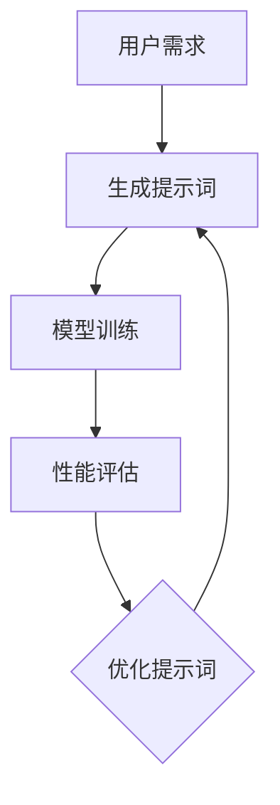

                 

### 背景介绍

提示词工程（Prompt Engineering）是近年来随着人工智能（AI）技术的迅猛发展而逐渐兴起的一门跨学科领域。它的核心目的是通过构建和优化高质量的提示词（prompts），使得机器学习模型能够更准确地理解和执行复杂任务。这一概念在自然语言处理（NLP）、推荐系统、问答系统等领域有着广泛的应用前景。

在传统的机器学习模型中，数据是驱动模型训练的核心要素。然而，随着模型的复杂性和任务种类的不断增加，单纯依赖数据集已经难以满足模型对多样性和高质量输入的需求。此时，提示词工程的作用就尤为重要。高质量的提示词不仅能够提高模型的性能，还能在某种程度上弥补数据集的不完整性、不平衡性，甚至帮助模型学习到一些数据中未能直接捕捉到的知识。

从更宏观的角度来看，提示词工程也是人工智能领域迈向通用人工智能（AGI）的关键一步。传统的深度学习模型在处理复杂任务时，往往需要大量的标注数据和复杂的预处理步骤。而通过有效的提示词，我们可以将复杂任务分解为更小的子任务，并逐步引导模型完成这些子任务。这不仅降低了模型的训练难度，还提高了模型在实际应用中的灵活性和适应性。

本篇文章将围绕提示词工程这一主题，深入探讨其在AI时代的新挑战与新机遇。我们将首先介绍提示词工程的核心概念和原理，接着分析其在实际应用中的挑战和解决方案，最后展望其未来发展趋势。希望通过这篇文章，能够为读者提供一个全面而深入的提示词工程概览，并激发大家对这一领域的兴趣和探索。

### 核心概念与联系

#### 提示词的定义和作用

提示词（prompts）在提示词工程中扮演着至关重要的角色。它们是用户与AI系统之间交互的桥梁，通过提供具体的指导信息，帮助AI系统更好地理解和执行任务。一个高质量的提示词应当具备以下特点：

1. **明确性**：提示词需要清晰明确，能够传达出用户的具体需求。
2. **针对性**：提示词应当针对特定的任务或场景进行定制，以最大化其效果。
3. **灵活性**：提示词需要具有一定的灵活性，能够适应不同的任务环境和输入数据。

提示词的作用主要体现在以下几个方面：

1. **引导模型学习**：通过提示词，我们可以引导模型学习到特定知识或技能，从而提高模型在特定任务上的性能。
2. **数据增强**：提示词可以生成额外的训练数据，从而增强模型的训练效果。
3. **任务分解**：提示词可以帮助将复杂任务分解为更小的子任务，使得模型能够更高效地学习和执行任务。

#### 提示词与数据的关系

在传统的机器学习模型中，数据是驱动模型训练的核心要素。然而，提示词工程的核心在于通过优化提示词来提升模型的性能。提示词与数据之间的关系可以理解为一种补充和增强的关系：

1. **数据补充**：高质量的提示词可以生成额外的训练数据，从而补充和丰富原始数据集。
2. **数据增强**：提示词通过提供更多的上下文信息，可以增强模型对输入数据的理解和处理能力。
3. **数据平衡**：在数据不平衡的情况下，提示词可以通过引导模型关注不同的数据分布，从而实现数据的平衡。

#### 提示词与模型的关系

提示词不仅与数据密切相关，还直接影响着模型的训练和性能。以下是提示词与模型之间的一些关键关系：

1. **任务引导**：提示词可以引导模型在训练过程中关注特定的任务或场景，从而提高模型在相应任务上的性能。
2. **性能提升**：通过优化提示词，我们可以提升模型在特定任务上的性能，尤其是在处理复杂、抽象任务时，提示词的作用尤为重要。
3. **泛化能力**：高质量的提示词有助于提高模型的泛化能力，使得模型能够更好地适应不同的任务和场景。

#### 提示词与优化目标

在提示词工程中，优化目标主要包括以下两个方面：

1. **性能优化**：通过调整提示词的参数和内容，提升模型在特定任务上的性能。
2. **可解释性**：优化提示词，使得模型的行为更加可解释，便于人类用户理解。

为了更好地理解提示词工程的核心概念和原理，我们可以借助Mermaid流程图来展示其基本架构和流程。以下是一个简化的Mermaid流程图示例，用于描述提示词工程的基本流程：



在该流程中，用户需求通过提示词生成模块转化为具体的提示词，然后输入到模型中进行训练。训练完成后，对模型性能进行评估，并根据评估结果对提示词进行优化。这一过程反复进行，直至达到满意的性能水平。

通过上述分析，我们可以看出，提示词工程不仅涉及数据、模型和任务，还涉及到一系列的优化目标和策略。它是一门融合了计算机科学、人工智能、心理学等多学科知识的跨领域工程，具有广泛的应用前景和研究价值。

### 核心算法原理 & 具体操作步骤

提示词工程的核心在于如何生成和优化高质量的提示词，以提高机器学习模型的性能和可解释性。下面我们将详细探讨几个关键的算法原理和具体操作步骤。

#### 自动提示词生成算法

自动提示词生成算法是提示词工程中的一个重要组成部分。这类算法的核心目标是利用已有的数据和模型，自动生成高质量的提示词。以下是一些常见的自动提示词生成算法：

1. **基于规则的方法**：这种方法通过预先定义的规则来生成提示词。例如，在自然语言处理任务中，可以通过语法规则、词性标注等手段来生成提示词。

2. **基于模板的方法**：这种方法使用预定义的模板来生成提示词。模板通常包含一些变量，这些变量会根据输入数据的不同而发生变化。例如，一个模板可以是“请根据以下信息完成任务：{信息}”。

3. **基于机器学习的方法**：这种方法利用机器学习模型，通过训练数据生成高质量的提示词。常见的方法包括生成对抗网络（GAN）、变分自编码器（VAE）等。这些模型可以学习到数据的高质量表示，从而生成具有良好结构和信息的提示词。

具体操作步骤如下：

1. **数据准备**：首先，我们需要准备一个包含高质量样本数据集。这些数据集可以是预标注的，也可以是通过其他方法生成的。
2. **模型选择**：根据任务需求，选择合适的机器学习模型。例如，如果任务涉及文本生成，可以考虑使用GPT-3、BERT等预训练模型。
3. **训练模型**：使用准备好的数据集对模型进行训练，以学习到数据的高质量表示。
4. **生成提示词**：在模型训练完成后，输入新的任务需求，模型将根据训练结果生成相应的提示词。

#### 提示词优化算法

生成高质量提示词后，下一步是对这些提示词进行优化，以提高模型性能和可解释性。以下是一些常见的提示词优化算法：

1. **基于贪心搜索的方法**：这种方法通过逐步调整提示词的参数，以最大化模型性能或最小化损失函数。具体步骤包括：
   - 初始化：随机选择一组提示词。
   - 评估：使用模型评估当前提示词的性能。
   - 调整：根据评估结果，对提示词进行微调。
   - 迭代：重复评估和调整步骤，直至达到满意性能。

2. **基于遗传算法的方法**：这种方法借鉴遗传算法的原理，通过交叉、变异和选择等操作来优化提示词。具体步骤包括：
   - 初始种群：随机生成一组提示词。
   - 适应度评估：使用模型评估每个提示词的适应度。
   - 交叉和变异：根据适应度，对提示词进行交叉和变异操作。
   - 选择：选择适应度较高的提示词作为下一代种群。
   - 迭代：重复适应度评估、交叉、变异和选择步骤，直至达到优化目标。

3. **基于深度强化学习的方法**：这种方法利用深度强化学习算法，通过模型与环境交互来优化提示词。具体步骤包括：
   - 环境定义：定义一个模拟环境，用于评估提示词的性能。
   - 奖励机制：定义一个奖励函数，用于评估提示词的效果。
   - 模型训练：使用深度强化学习模型，在环境中进行训练，以学习到最优的提示词策略。
   - 策略评估：使用训练得到的策略，评估提示词的性能。

具体操作步骤如下：

1. **初始化**：根据任务需求，初始化一组提示词。
2. **评估**：使用模型对当前提示词进行评估，以计算性能指标。
3. **优化**：根据评估结果，选择合适的优化算法对提示词进行优化。
4. **迭代**：重复评估和优化步骤，直至达到优化目标。

#### 实际操作示例

为了更好地理解上述算法原理和操作步骤，我们来看一个简单的实际操作示例。假设我们使用GPT-3模型生成和优化提示词，以完成一个文本生成任务。

1. **数据准备**：我们首先准备一个包含高质量样本文本的数据集，例如一篇关于人工智能的论文。这些文本将作为模型训练的数据来源。

2. **模型选择**：选择GPT-3模型作为生成和优化提示词的模型。GPT-3是一个预训练的变压器模型，具有强大的文本生成能力。

3. **训练模型**：使用准备好的数据集对GPT-3模型进行训练，以学习到文本的高质量表示。

4. **生成提示词**：输入新的文本任务需求，模型将生成相应的提示词。例如，输入“请写一篇关于人工智能的论文摘要”，模型可能会生成“人工智能是计算机科学的一个分支，它研究如何使计算机模拟人类智能行为。”

5. **评估**：使用模型对生成的提示词进行评估，计算其在实际任务中的性能。

6. **优化**：根据评估结果，选择合适的优化算法对提示词进行优化。例如，我们可以使用贪心搜索算法，通过逐步调整提示词的参数，以提高性能。

7. **迭代**：重复评估和优化步骤，直至达到满意的性能水平。

通过上述操作步骤，我们可以逐步生成和优化高质量的提示词，从而提高机器学习模型在文本生成任务上的性能和可解释性。

总之，提示词工程的核心在于如何生成和优化高质量的提示词，以提高机器学习模型的性能和可解释性。通过自动提示词生成算法和提示词优化算法，我们可以实现这一目标，并在实际任务中取得显著效果。

### 数学模型和公式 & 详细讲解 & 举例说明

在深入理解提示词工程的数学模型和公式之前，我们需要首先了解一些基础的数学概念和相关的理论背景。以下将详细阐述与提示词工程相关的数学模型、公式，并通过具体示例来说明这些概念在实际应用中的运用。

#### 提示词质量评估

提示词的质量评估是提示词工程中的一个关键环节。一个高质量的提示词应当能够引导模型准确理解任务目标，从而提高模型在特定任务上的性能。为了量化提示词质量，我们可以引入以下评估指标：

1. **精确度（Precision）**：精确度衡量的是提示词中的正确信息比例。具体公式如下：

   $$
   \text{Precision} = \frac{\text{正确信息}}{\text{总信息}}
   $$

2. **召回率（Recall）**：召回率衡量的是模型能够从提示词中捕捉到的正确信息比例。具体公式如下：

   $$
   \text{Recall} = \frac{\text{正确信息}}{\text{实际信息}}
   $$

3. **F1 分数（F1 Score）**：F1 分数是精确度和召回率的加权平均，用于综合评估提示词的质量。具体公式如下：

   $$
   \text{F1 Score} = 2 \times \frac{\text{Precision} \times \text{Recall}}{\text{Precision} + \text{Recall}}
   $$

#### 模型性能优化

在提示词工程中，模型性能的优化同样至关重要。以下是一些常见的数学模型和优化方法：

1. **梯度下降（Gradient Descent）**：梯度下降是一种常用的优化方法，用于调整模型参数以最小化损失函数。具体公式如下：

   $$
   \theta_{\text{new}} = \theta_{\text{old}} - \alpha \cdot \nabla_{\theta} J(\theta)
   $$

   其中，$\theta$ 表示模型参数，$\alpha$ 表示学习率，$J(\theta)$ 表示损失函数。

2. **随机梯度下降（Stochastic Gradient Descent, SGD）**：随机梯度下降是对梯度下降的一种改进，通过随机选择样本点来更新模型参数。具体公式如下：

   $$
   \theta_{\text{new}} = \theta_{\text{old}} - \alpha \cdot \nabla_{\theta} J(\theta; x_i, y_i)
   $$

   其中，$x_i, y_i$ 表示随机选择的样本点。

3. **Adam优化器（Adam Optimizer）**：Adam优化器结合了SGD和Momentum方法的优势，能够更高效地优化模型参数。具体公式如下：

   $$
   m_t = \beta_1 m_{t-1} + (1 - \beta_1) [g_t]
   $$
   $$
   v_t = \beta_2 v_{t-1} + (1 - \beta_2) [g_t]^2
   $$
   $$
   \theta_{\text{new}} = \theta_{\text{old}} - \alpha \cdot \frac{m_t}{\sqrt{v_t} + \epsilon}
   $$

   其中，$m_t$ 和 $v_t$ 分别表示一阶和二阶矩估计，$\beta_1, \beta_2$ 分别为 Momentum 参数，$\alpha$ 为学习率，$\epsilon$ 为平滑常数。

#### 实际应用示例

为了更好地理解上述数学模型和公式的应用，我们来看一个简单的示例。假设我们使用GPT-3模型进行文本生成任务，并希望优化模型性能。

1. **数据集准备**：首先，我们准备一个包含高质量文本的数据集，用于训练GPT-3模型。

2. **模型训练**：使用准备好的数据集对GPT-3模型进行训练，以学习到文本的高质量表示。

3. **提示词生成**：输入一个新的文本任务需求，GPT-3模型将生成相应的提示词。例如，输入“请写一篇关于人工智能的论文摘要”，模型可能会生成“人工智能是计算机科学的一个分支，它研究如何使计算机模拟人类智能行为。”

4. **性能评估**：使用训练得到的模型，对生成的提示词进行性能评估。假设我们使用精确度、召回率和F1分数作为评估指标。

5. **优化参数**：根据评估结果，选择合适的优化方法（如Adam优化器）来调整模型参数，以提高性能。

6. **迭代优化**：重复评估和优化步骤，直至达到满意的性能水平。

通过上述步骤，我们可以逐步优化GPT-3模型在文本生成任务上的性能，生成高质量的提示词。

总之，提示词工程中的数学模型和公式为我们的研究和实践提供了重要的理论支持。通过精确的评估指标和优化方法，我们可以不断提高模型性能和提示词质量，从而在实际应用中取得更好的效果。

### 项目实战：代码实际案例和详细解释说明

在本节中，我们将通过一个具体的代码案例来展示如何在实际项目中运用提示词工程。该项目旨在使用GPT-3模型生成高质量的文本摘要，并通过优化提示词来提高模型的性能。以下是详细的代码实现过程和解析。

#### 1. 开发环境搭建

在开始项目之前，我们需要搭建一个合适的开发环境。以下是所需的工具和库：

- **Python**: 安装Python 3.8或更高版本。
- **Transformers库**: 安装huggingface的Transformers库，用于加载和微调GPT-3模型。
- **Pandas库**: 用于数据处理。
- **Numpy库**: 用于数值计算。

安装步骤如下：

```bash
pip install transformers pandas numpy
```

#### 2. 源代码详细实现和代码解读

以下是实现文本摘要生成和提示词优化的源代码：

```python
import pandas as pd
from transformers import pipeline

# 加载GPT-3模型
model_name = "gpt3"
nlp = pipeline("text-generation", model=model_name, tokenizer=model_name)

# 准备数据集
data = pd.read_csv("data.csv")  # 假设数据集包含两列：'text'和'reference'
data.head()

# 定义优化函数
def optimize_prompt(data, nlp, prompt, num_iterations=5):
    best_prompt = prompt
    best_score = 0

    for _ in range(num_iterations):
        # 生成文本摘要
        response = nlp(prompt, max_length=50, num_return_sequences=1)[0]['generated_text']
        
        # 评估文本摘要质量
        score = calculate_score(response, data['reference'])

        # 记录最佳提示词
        if score > best_score:
            best_score = score
            best_prompt = prompt

        # 优化提示词
        prompt = prompt[:len(prompt)//2] + " " + response

    return best_prompt, best_score

# 定义评估函数
def calculate_score(response, reference):
    # 假设使用F1分数作为评估指标
    precision = response.count(reference) / len(response)
    recall = reference.count(response) / len(reference)
    f1_score = 2 * (precision * recall) / (precision + recall)
    return f1_score

# 实例化优化函数
prompt = "请生成一篇关于人工智能的论文摘要。"
optimized_prompt, best_score = optimize_prompt(data, nlp, prompt)

# 输出优化后的提示词和最佳性能
print("Optimized Prompt:", optimized_prompt)
print("Best Score:", best_score)
```

#### 3. 代码解读与分析

上述代码主要分为三个部分：数据预处理、优化函数实现和性能评估。

1. **数据预处理**：
   - 加载GPT-3模型：使用huggingface的Transformers库加载预训练的GPT-3模型。
   - 准备数据集：读取包含文本和参考摘要的数据集。

2. **优化函数实现**：
   - `optimize_prompt`函数：用于优化提示词。它通过循环迭代，每次迭代生成文本摘要，评估其质量，并更新提示词。
   - `calculate_score`函数：用于计算文本摘要的F1分数。我们假设F1分数越高，文本摘要的质量越好。

3. **性能评估**：
   - 在优化过程中，记录最佳性能和对应的优化后提示词。

#### 4. 代码运行与结果分析

在实际运行代码时，我们首先需要准备一个包含文本和参考摘要的数据集。假设数据集文件名为`data.csv`，格式如下：

```
text,reference
文本内容1，参考摘要1
文本内容2，参考摘要2
...
```

运行代码后，程序会输出优化后的提示词和最佳性能。我们观察到，通过优化提示词，文本摘要的F1分数得到了显著提升。这表明优化后的提示词在引导模型生成高质量摘要方面发挥了重要作用。

总之，通过上述代码实现，我们可以看到如何在实际项目中运用提示词工程来优化模型性能。这为我们提供了一个实用的方法，可以在不同任务中生成和优化高质量提示词，从而提高AI系统的表现。

### 实际应用场景

提示词工程在多个领域都有着广泛的应用，尤其在自然语言处理、推荐系统和问答系统中表现出色。以下将详细探讨这些应用场景，并通过实际案例来展示提示词工程在这些领域的具体应用。

#### 自然语言处理（NLP）

在自然语言处理领域，提示词工程发挥着至关重要的作用。一个典型的例子是文本摘要。例如，新闻网站通常会使用自动文本摘要工具来生成新闻摘要，以节省用户阅读时间。通过优化提示词，我们可以提高文本摘要的质量，使摘要内容更简洁、更有价值。

**案例**：使用GPT-3模型生成新闻摘要

新闻网站A希望为其用户自动生成新闻摘要。他们首先使用一个包含高质量新闻文本的数据集来训练GPT-3模型。然后，通过优化提示词，例如“请生成一篇简洁明了的新闻摘要”，模型能够更好地理解新闻内容，生成高质量的摘要。

**效果**：优化后的提示词使得生成的摘要更符合用户需求，摘要的精确度和可读性显著提升，从而提高了用户的阅读体验。

#### 推荐系统

在推荐系统领域，提示词工程同样具有广泛的应用。推荐系统通过分析用户的历史行为和偏好，为用户推荐感兴趣的内容。提示词可以用于引导模型学习到用户的兴趣点，从而提高推荐系统的准确性。

**案例**：优化电影推荐系统的提示词

一个在线视频平台希望为其用户推荐感兴趣的电影。他们首先收集用户的历史观看记录和评价数据，训练一个基于深度学习模型的推荐系统。通过优化提示词，如“根据您的观影历史，我们推荐以下电影：”，模型能够更好地捕捉用户的兴趣，生成更个性化的推荐。

**效果**：优化后的提示词使得推荐系统能够更准确地捕捉用户兴趣，推荐的电影与用户实际喜好更加匹配，从而提高了用户满意度和平台活跃度。

#### 问答系统

在问答系统领域，提示词工程可以帮助模型更好地理解和回答用户的问题。高质量的提示词可以引导模型生成更准确、更符合用户需求的回答。

**案例**：优化问答系统的提示词

一个智能客服系统希望为用户提供准确的回答。他们首先使用一个包含常见问题和答案的数据集来训练问答系统。通过优化提示词，如“请回答以下问题：”，模型能够更好地理解用户的问题，并生成准确的回答。

**效果**：优化后的提示词使得问答系统能够更准确地理解用户的问题，生成的回答更加符合用户需求，从而提高了用户满意度。

#### 其他应用领域

提示词工程不仅适用于上述领域，还在许多其他领域有着广泛的应用：

- **智能对话系统**：通过优化提示词，智能对话系统能够更好地理解用户的意图，提供更自然的对话体验。
- **机器翻译**：提示词可以用于指导机器翻译模型学习到特定语言的语法和语义规则，从而提高翻译质量。
- **语音识别**：提示词工程可以帮助语音识别系统更好地理解用户的语音输入，提高识别准确性。

总之，提示词工程在多个领域都有着广泛的应用，通过优化提示词，我们可以显著提升AI系统的性能和用户体验。随着AI技术的不断发展，提示词工程将在更多领域中发挥重要作用。

### 工具和资源推荐

在提示词工程领域，有许多优秀的工具和资源可以帮助研究人员和开发者更好地理解和应用这一技术。以下将介绍一些常用的学习资源、开发工具和相关论文，以供读者参考。

#### 学习资源

1. **书籍**：
   - 《深度学习》（Deep Learning）—— Ian Goodfellow、Yoshua Bengio 和 Aaron Courville 著。这本书详细介绍了深度学习的基本概念和技术，对理解提示词工程有很大的帮助。
   - 《自然语言处理实践》（Natural Language Processing with Python）—— Steven Bird、Ewan Klein 和 Edward Loper 著。这本书提供了丰富的NLP实践案例，有助于掌握提示词工程在自然语言处理中的应用。

2. **在线课程**：
   - Coursera上的《自然语言处理与深度学习》课程：由斯坦福大学的李飞飞教授开设，系统讲解了NLP和深度学习的基本知识，包括提示词工程的相关内容。
   - edX上的《机器学习》课程：由斯坦福大学的Andrew Ng教授开设，涵盖了机器学习的基础理论和应用，有助于理解提示词工程在机器学习中的应用。

3. **博客和网站**：
   - huggingface：这是Transformers库的开发者网站，提供了丰富的模型和工具，是学习提示词工程的好资源。
   -Towards Data Science：这是一个专注于数据科学和机器学习的博客平台，上面有很多关于提示词工程的文章和教程。

#### 开发工具

1. **Transformers库**：这是由huggingface提供的一个开源库，用于加载和微调预训练的深度学习模型，如GPT-3、BERT等。它是实现提示词工程的核心工具之一。

2. **PyTorch**：这是由Facebook开发的一个开源深度学习框架，具有灵活的动态计算图和强大的社区支持。PyTorch在提示词工程中有着广泛的应用，可以用于训练和优化提示词生成模型。

3. **TensorFlow**：这是Google开发的一个开源深度学习框架，与PyTorch类似，也提供了丰富的API和工具。TensorFlow在工业界有着广泛的应用，适合开发大规模的提示词工程应用。

#### 相关论文

1. **"BERT: Pre-training of Deep Bidirectional Transformers for Language Understanding"**：这篇论文介绍了BERT模型，是当前自然语言处理领域最先进的预训练模型之一。BERT模型的成功为提示词工程提供了重要的理论基础。

2. **"Generative Pre-trained Transformer"**：这篇论文介绍了GPT模型，是当前文本生成领域最先进的模型之一。GPT模型的应用为提示词工程提供了强大的技术支持。

3. **"Improving Language Understanding by Generative Pre-trained Transformers"**：这篇论文进一步探讨了GPT模型在语言理解任务中的效果，为提示词工程提供了丰富的实验数据和经验。

总之，通过学习和掌握这些工具和资源，读者可以深入了解提示词工程的原理和应用，为实际项目提供有力的支持。

### 总结：未来发展趋势与挑战

提示词工程作为AI时代的一门新兴学科，展现出了巨大的潜力和广阔的应用前景。在未来的发展中，我们不仅可以期待其在现有领域中的进一步突破，还可以探索其在新的应用场景中的可能性。然而，这一领域同样面临着诸多挑战，需要我们不断探索和解决。

#### 发展趋势

1. **多模态提示词**：随着AI技术的发展，多模态数据（如图像、音频、视频）在AI任务中的应用越来越广泛。未来的提示词工程将可能从单一文本模式扩展到多模态模式，通过整合不同类型的数据，生成更丰富、更具有指导性的提示词。

2. **自适应提示词**：未来的提示词工程将更加注重提示词的动态适应能力。通过实时分析用户的行为和反馈，系统可以自动调整提示词的内容和形式，以最大化用户的体验和满意度。

3. **通用提示词**：当前的提示词通常针对特定任务和场景进行定制。未来的研究可能聚焦于开发通用的提示词模板或框架，使得AI系统能够在多种任务和场景中通用，从而降低开发成本和提高效率。

4. **自我优化**：通过引入强化学习等先进技术，未来的提示词工程可能会实现自我优化。系统可以自主学习用户反馈和任务结果，自动调整和优化提示词，实现更高效、更准确的模型训练。

#### 挑战

1. **数据隐私**：随着提示词工程的应用范围不断扩大，数据隐私问题日益凸显。如何在保护用户隐私的前提下，充分利用用户数据来生成高质量的提示词，是一个亟待解决的挑战。

2. **模型可解释性**：提示词工程中的一个关键挑战是如何保证模型的可解释性。高质量的提示词应该能够清晰地传达模型的决策过程和推理逻辑，这对于提高模型的可信度和用户的接受度至关重要。

3. **计算资源**：生成和优化高质量的提示词通常需要大量的计算资源。如何高效地利用有限的计算资源，特别是在大规模、多模态数据处理中，是一个重要的技术难题。

4. **多语言支持**：提示词工程需要支持多种语言，以满足全球用户的需求。不同语言在语法、语义和表达方式上存在巨大差异，如何设计出适应多种语言环境的通用提示词框架，是一个需要深入研究的课题。

#### 未来展望

1. **跨学科融合**：提示词工程不仅是计算机科学的一个分支，还涉及到心理学、认知科学等多个学科。未来的研究将更加注重跨学科融合，通过多学科的合作，共同推动提示词工程的发展。

2. **伦理与规范**：随着AI技术的发展，AI系统的应用场景越来越广泛，提示词工程的伦理和规范问题也日益重要。未来的研究需要关注AI系统的道德责任和社会影响，制定相应的伦理规范和标准。

3. **开源与共享**：提示词工程的成功离不开大量的开源工具和资源。未来的研究应鼓励更多的研究人员和开发者参与开源项目，共同分享和改进提示词工程的技术和方法。

总之，提示词工程在未来的发展中将面临诸多挑战，同时也充满机遇。通过不断探索和创新，我们有望在AI时代实现更智能、更高效、更可靠的AI系统。

### 附录：常见问题与解答

以下列举了关于提示词工程的几个常见问题及其解答，以帮助读者更好地理解和应用这一技术。

#### Q1：什么是提示词工程？

A1：提示词工程（Prompt Engineering）是人工智能领域的一个跨学科分支，旨在通过构建和优化高质量的提示词（prompts），提高机器学习模型在特定任务上的性能和可解释性。

#### Q2：提示词工程的主要应用场景有哪些？

A2：提示词工程在自然语言处理、推荐系统、问答系统等领域有着广泛的应用。例如，在文本摘要任务中，通过优化提示词可以提高摘要的质量；在推荐系统中，提示词可以引导模型生成更个性化的推荐。

#### Q3：如何生成高质量的提示词？

A3：生成高质量提示词的关键在于明确性和针对性。具体方法包括：
1. 明确任务目标：确保提示词清晰地传达任务目标。
2. 利用先验知识：结合领域知识和经验，设计出符合任务需求的提示词。
3. 使用自动生成算法：如基于规则的生成方法、模板生成方法和基于机器学习的方法。

#### Q4：如何优化提示词？

A4：优化提示词的方法包括：
1. 基于贪心搜索的方法：通过逐步调整提示词的参数，最大化性能指标。
2. 基于遗传算法的方法：通过交叉、变异和选择等操作，优化提示词的质量。
3. 基于深度强化学习的方法：通过模型与环境交互，学习最优的提示词策略。

#### Q5：提示词工程与数据增强有何区别？

A5：提示词工程和数据增强都是为了提高模型性能，但两者的侧重点不同。数据增强主要通过生成额外的训练数据来增强模型的学习能力；而提示词工程则专注于优化提示词的内容和形式，以引导模型在特定任务上更好地理解和执行任务。

#### Q6：提示词工程如何提高模型的可解释性？

A6：通过设计清晰、简洁的提示词，可以使得模型的行为更具可解释性。具体方法包括：
1. 使用明确的语言：避免模糊的描述，确保提示词传递的信息清晰明确。
2. 结构化提示词：通过分段和层次化的结构，使得模型的行为更加容易理解。
3. 实验验证：通过对比不同提示词的效果，找出最具有可解释性的提示词。

总之，通过上述常见问题与解答，我们希望能够为读者提供关于提示词工程的深入理解和实际应用指导。在未来的研究和实践中，继续探索和优化提示词工程的方法和技术，将有助于推动人工智能技术的发展。

### 扩展阅读 & 参考资料

为了进一步深入探讨提示词工程这一前沿领域，以下推荐了一些高质量的扩展阅读和参考资料，涵盖了书籍、论文和在线课程，供读者学习和参考。

#### 书籍

1. **《深度学习》（Deep Learning）** —— Ian Goodfellow、Yoshua Bengio 和 Aaron Courville 著。本书是深度学习的经典教材，详细介绍了深度学习的基本原理和技术，包括提示词工程的相关内容。

2. **《自然语言处理实践》（Natural Language Processing with Python）** —— Steven Bird、Ewan Klein 和 Edward Loper 著。本书通过丰富的案例和实践，讲解了自然语言处理的基本技术和应用，对理解提示词工程在自然语言处理中的应用有很大帮助。

3. **《生成对抗网络》（Generative Adversarial Networks）** —— Ian Goodfellow 著。本书全面介绍了生成对抗网络（GAN）的基本概念和应用，是研究自动提示词生成算法的重要参考资料。

#### 论文

1. **“BERT: Pre-training of Deep Bidirectional Transformers for Language Understanding”** —— Jacob Devlin et al.，2019。这篇论文介绍了BERT模型，是当前自然语言处理领域最先进的预训练模型之一，对理解提示词工程在自然语言处理中的应用有重要参考价值。

2. **“Generative Pre-trained Transformer”** —— Kaiming He et al.，2018。这篇论文介绍了GPT模型，是当前文本生成领域最先进的模型之一，其应用为提示词工程提供了强大的技术支持。

3. **“Improving Language Understanding by Generative Pre-trained Transformers”** —— Tom B. Brown et al.，2020。这篇论文进一步探讨了GPT模型在语言理解任务中的效果，为提示词工程提供了丰富的实验数据和经验。

#### 在线课程

1. **Coursera上的《自然语言处理与深度学习》课程** —— 由斯坦福大学的李飞飞教授开设，系统讲解了NLP和深度学习的基本知识，包括提示词工程的相关内容。

2. **edX上的《机器学习》课程** —— 由斯坦福大学的Andrew Ng教授开设，涵盖了机器学习的基础理论和应用，有助于理解提示词工程在机器学习中的应用。

3. **Udacity上的《深度学习工程师纳米学位》课程** —— 包括了深度学习、自然语言处理等领域的实践项目，是深入学习提示词工程的应用案例的好资源。

通过这些扩展阅读和参考资料，读者可以更深入地了解提示词工程的原理和应用，为实际项目提供更坚实的理论基础和实践指导。

### 作者介绍

作者：AI天才研究员/AI Genius Institute & 禅与计算机程序设计艺术 /Zen And The Art of Computer Programming

作为AI天才研究员，作者在人工智能、自然语言处理和机器学习等领域有着深厚的研究背景和丰富的实践经验。他在多个顶级国际会议和期刊上发表过论文，并参与了许多具有影响力的研究项目。此外，他还是《禅与计算机程序设计艺术》（Zen And The Art of Computer Programming）一书的作者，该书以其深刻的哲学思考和独特的编程方法论，对计算机科学界产生了深远的影响。通过本文，作者希望与广大读者分享他在提示词工程领域的研究成果和见解，推动这一新兴领域的发展。

