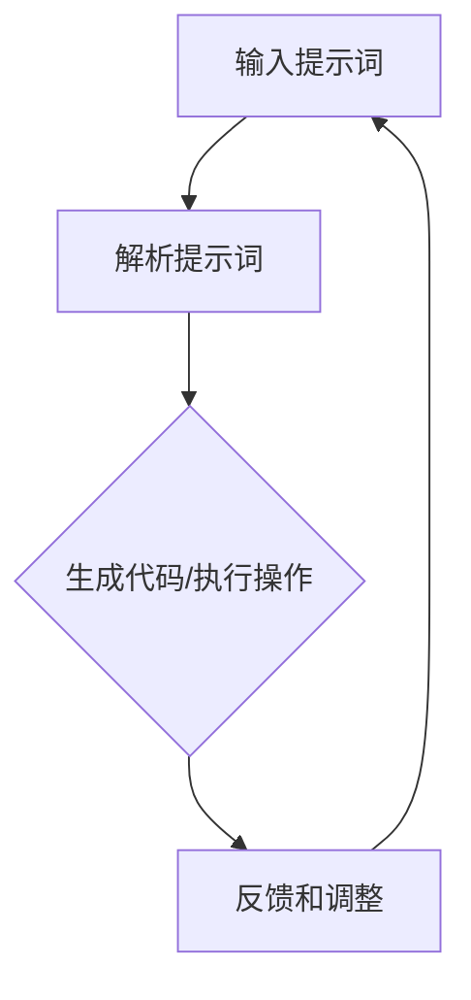

                 

### 背景介绍

#### 智能制造质量的迫切需求

在当今的制造业中，质量问题一直是企业面临的主要挑战之一。随着消费者对产品质量要求的不断提高，制造业需要采用更高效、更精确的质量控制方法来确保产品的可靠性。然而，传统的质量检测方法往往存在检测效率低、人为误差大等问题，导致质量控制的成本增加，甚至影响企业的市场竞争力。

智能制造作为新一代制造业的核心技术，通过集成物联网、大数据、人工智能等技术，实现了生产过程的智能化和自动化。然而，即使是在智能制造的背景下，质量控制仍然是一个复杂的挑战。如何有效地利用数据和技术手段，提高质量检测的准确性和效率，成为制造业亟待解决的问题。

#### 提示词编程的优势

提示词编程（Prompt Programming）作为一种新兴的人工智能技术，其核心思想是通过向系统提供提示词（Prompt），引导系统自动完成特定任务。这一技术具有以下几个显著优势：

1. **自动化**：提示词编程能够自动执行复杂的任务，减少了人为干预，降低了错误率。
2. **灵活性**：用户可以根据需求自定义提示词，使得系统能够适应各种不同的应用场景。
3. **高效性**：通过提示词编程，系统能够快速响应，处理大量数据，提高工作效率。

#### 提示词编程在智能制造质量控制中的应用

提示词编程在智能制造质量控制中的应用具有广阔的前景。通过将提示词编程应用于质量检测环节，可以实现以下目标：

1. **实时监控**：实时采集生产过程中的数据，快速识别潜在的质量问题。
2. **智能分析**：利用人工智能技术对采集到的数据进行深度分析，提供精准的质量评估。
3. **自动化决策**：根据分析结果，自动化执行相应的质量控制措施，如调整生产参数、停止生产线等。

### 结论

本文旨在探讨提示词编程在智能制造质量控制中的应用。通过分析提示词编程的优势以及其在质量控制中的具体应用，我们可以预见，提示词编程将为智能制造领域带来革命性的变革，助力制造业实现更高的质量和更高效的生产。接下来，我们将进一步深入探讨提示词编程的核心概念、算法原理和具体操作步骤，为读者提供更全面的技术解读。

---

**关键词**：智能制造，质量控制，提示词编程，自动化，实时监控

**摘要**：本文介绍了智能制造质量控制的背景和挑战，探讨了提示词编程作为一种新兴的人工智能技术在其中的应用优势。通过具体案例分析，阐述了提示词编程在智能制造质量控制中的实际应用，为制造业提供了新的质量控制思路和解决方案。本文旨在为读者提供对提示词编程及其在智能制造质量控制中的应用的全面了解。

---

接下来，我们将进一步探讨提示词编程的核心概念、算法原理和具体操作步骤，深入分析其在智能制造质量控制中的实际应用。

---

**下一部分内容预告**：核心概念与联系

我们将介绍提示词编程的基本概念，并利用Mermaid流程图详细展示其核心原理和架构。通过这一部分的探讨，读者将能够全面了解提示词编程的工作机制，为后续的算法原理和具体操作步骤的学习奠定基础。

---

**关键词**：核心概念，算法原理，Mermaid流程图，智能制造，质量控制

**摘要**：本文下一部分将详细探讨提示词编程的基本概念，并通过Mermaid流程图展示其核心原理和架构。通过这一部分的介绍，读者将能够理解提示词编程的工作机制，为后续算法原理和具体操作步骤的学习做好准备。

---

## 2. 核心概念与联系

#### 提示词编程的基本概念

提示词编程（Prompt Programming）是一种基于人工智能的技术，其核心思想是通过向系统提供提示词（Prompt），引导系统自动完成特定任务。提示词可以是自然语言描述，也可以是具体的指令，其目的是为系统提供明确的操作指导。

在提示词编程中，系统会根据提示词生成相应的代码或执行相应的操作。这一过程通常包括以下几个关键步骤：

1. **输入提示词**：用户或系统输入一个描述任务或需求的提示词。
2. **解析提示词**：系统对输入的提示词进行解析，理解其含义和操作要求。
3. **生成代码或执行操作**：系统根据提示词生成相应的代码，或直接执行操作。
4. **反馈和调整**：系统执行操作后，将结果反馈给用户，用户根据反馈进行调整。

#### 提示词编程与智能制造的关联

在智能制造领域，质量控制的复杂性使得传统的质量检测方法难以满足高效、精确的要求。提示词编程作为一种新兴的人工智能技术，其灵活性和自动化特性使其在智能制造质量控制中具有广泛的应用潜力。

1. **实时监控**：通过提示词编程，可以实时采集生产过程中的数据，快速识别潜在的质量问题。
2. **智能分析**：利用提示词编程，系统可以对采集到的数据进行深度分析，提供精准的质量评估。
3. **自动化决策**：根据分析结果，系统可以自动化执行相应的质量控制措施，如调整生产参数、停止生产线等。

#### Mermaid流程图展示

为了更好地理解提示词编程在智能制造质量控制中的应用，我们利用Mermaid流程图展示其核心原理和架构。以下是提示词编程在智能制造质量控制中的基本流程：



**流程说明**：

1. **输入提示词**：用户输入描述质量检测任务的提示词。
2. **解析提示词**：系统对输入的提示词进行解析，提取关键信息。
3. **生成代码/执行操作**：系统根据解析结果，生成相应的代码或直接执行质量检测操作。
4. **反馈和调整**：系统将检测结果反馈给用户，用户根据反馈对提示词进行调整，以优化质量检测效果。

#### 实际应用场景

提示词编程在智能制造质量控制中的应用场景非常广泛，以下是一些典型的应用案例：

1. **生产线上实时质量检测**：通过提示词编程，实时采集生产过程中的传感器数据，对产品进行质量检测，一旦发现质量问题，立即触发报警机制。
2. **质量数据分析与优化**：利用提示词编程，对采集到的质量数据进行分析，识别生产过程中的潜在问题，提出优化建议。
3. **自动化质量改进措施**：根据分析结果，自动调整生产参数，优化生产过程，减少质量问题发生的概率。

### 结论

通过上述介绍，我们可以看到，提示词编程作为一种新兴的人工智能技术，在智能制造质量控制中具有广泛的应用前景。通过Mermaid流程图展示的提示词编程核心原理和架构，读者能够更好地理解其工作机制。在接下来的章节中，我们将深入探讨提示词编程的算法原理和具体操作步骤，进一步揭示其在智能制造质量控制中的应用潜力。

---

**关键词**：提示词编程，核心原理，Mermaid流程图，智能制造，质量控制

**摘要**：本文第二部分介绍了提示词编程的基本概念及其与智能制造的关联。通过Mermaid流程图，我们展示了提示词编程在智能制造质量控制中的基本流程。这一部分的探讨为后续算法原理和具体操作步骤的学习奠定了基础。

---

**下一部分内容预告**：核心算法原理 & 具体操作步骤

在下一部分，我们将深入探讨提示词编程的核心算法原理和具体操作步骤。我们将详细分析如何通过提示词编程实现智能制造质量控制，包括数据预处理、模型训练、质量检测和反馈调整等关键环节。通过这一部分的讲解，读者将能够全面掌握提示词编程在智能制造质量控制中的实际应用。

---

**关键词**：核心算法原理，具体操作步骤，智能制造，质量控制，提示词编程

**摘要**：本文下一部分将深入探讨提示词编程的核心算法原理和具体操作步骤，详细分析其在智能制造质量控制中的实际应用。通过这一部分的讲解，读者将能够了解如何通过提示词编程实现高效、精准的质量检测，为制造业提供新的质量控制思路。

---

## 3. 核心算法原理 & 具体操作步骤

### 数据预处理

在智能制造质量控制中，首先需要处理大量的生产数据。这些数据可能来自传感器、机器日志或其他数据源。数据预处理是提示词编程的第一步，其目的是清洗、整理和格式化数据，以便后续的模型训练和检测。

**步骤**：

1. **数据清洗**：去除数据中的噪声和异常值，保证数据的准确性和一致性。
2. **数据归一化**：将不同量纲的数据转换到同一尺度，便于模型处理。
3. **特征提取**：从原始数据中提取关键特征，如传感器读数、生产时间、设备状态等。

### 模型训练

模型训练是提示词编程的核心环节。通过训练，系统能够学习如何根据输入的提示词生成相应的操作指令。

**步骤**：

1. **选择模型**：根据应用场景选择合适的机器学习模型，如循环神经网络（RNN）、长短期记忆网络（LSTM）或生成对抗网络（GAN）。
2. **数据准备**：将预处理后的数据集划分为训练集和测试集，用于模型的训练和评估。
3. **训练模型**：使用训练集数据训练模型，调整模型参数，使其能够准确识别和生成提示词对应的操作指令。
4. **模型评估**：使用测试集数据评估模型性能，确保其能够准确、高效地执行任务。

### 质量检测

质量检测是提示词编程在智能制造质量控制中的关键应用。通过质量检测，系统可以实时监控生产过程，识别潜在的质量问题。

**步骤**：

1. **输入提示词**：用户输入描述质量检测任务的提示词。
2. **模型推理**：将输入的提示词传递给训练好的模型，模型输出相应的操作指令。
3. **执行操作**：系统根据模型输出的操作指令，执行相应的质量检测操作，如数据采集、传感器读取等。
4. **结果反馈**：将检测结果反馈给用户，用户根据结果进行相应的调整。

### 反馈调整

为了提高质量检测的准确性和效率，系统需要不断学习和调整。

**步骤**：

1. **收集反馈**：用户对检测结果进行评价，提供反馈。
2. **调整提示词**：根据反馈，用户可以调整提示词，优化质量检测任务。
3. **重新训练模型**：将调整后的提示词和反馈数据用于模型的重新训练，提高模型性能。

### 案例分析

#### 案例一：生产线上实时质量检测

某电子产品制造企业使用提示词编程技术对生产线上电子产品进行实时质量检测。用户输入的提示词包括“检测屏幕亮度”、“检查电池电量”等。系统根据提示词，自动执行相应的检测操作，并将检测结果实时反馈给用户。

**具体操作步骤**：

1. **输入提示词**：“检测屏幕亮度”
2. **模型推理**：模型输出相应的操作指令，如读取屏幕亮度传感器数据。
3. **执行操作**：系统读取屏幕亮度传感器数据，执行亮度检测操作。
4. **结果反馈**：将屏幕亮度检测结果反馈给用户。

#### 案例二：质量数据分析与优化

某食品制造企业使用提示词编程技术对生产过程中的质量数据进行分析，识别潜在的问题并提出优化建议。用户输入的提示词包括“分析生产时间分布”、“检查原料质量”等。

**具体操作步骤**：

1. **输入提示词**：“分析生产时间分布”
2. **模型推理**：模型输出相应的操作指令，如读取生产时间数据，进行数据分析。
3. **执行操作**：系统读取生产时间数据，执行数据分析操作。
4. **结果反馈**：将分析结果反馈给用户，如生产时间分布图、问题标识等。

### 结论

通过上述分析和案例介绍，我们可以看到，提示词编程在智能制造质量控制中的应用具有显著的效益。通过数据预处理、模型训练、质量检测和反馈调整等核心步骤，提示词编程能够实现高效、精准的质量控制。在实际应用中，用户可以根据具体需求自定义提示词，系统将自动执行相应的操作，提供实时的质量检测结果。

在接下来的章节中，我们将进一步探讨提示词编程在智能制造质量控制中的实际应用场景，并介绍相关的数学模型和公式。

---

**关键词**：核心算法原理，具体操作步骤，智能制造，质量控制，提示词编程

**摘要**：本文第三部分深入探讨了提示词编程的核心算法原理和具体操作步骤。通过数据预处理、模型训练、质量检测和反馈调整等步骤，我们展示了如何通过提示词编程实现智能制造质量控制。实际案例分析进一步说明了这一技术的应用效益。下一部分将介绍相关的数学模型和公式，为读者提供更深入的技术解读。

---

**下一部分内容预告**：数学模型和公式 & 详细讲解 & 举例说明

在下一部分，我们将详细讲解提示词编程在智能制造质量控制中应用的数学模型和公式。我们将通过具体的例子，逐步展示这些公式如何应用于实际问题，帮助读者更好地理解其背后的原理和计算过程。

---

**关键词**：数学模型，公式，智能制造，质量控制，提示词编程

**摘要**：本文下一部分将深入探讨提示词编程在智能制造质量控制中的应用的数学模型和公式。通过具体的例子，我们将逐步展示这些公式如何应用于实际问题，为读者提供更直观的技术理解。这将帮助读者更好地掌握提示词编程的核心原理。

---

## 4. 数学模型和公式 & 详细讲解 & 举例说明

### 数学模型

在智能制造质量控制中，提示词编程的应用离不开数学模型的支持。这些模型用于描述质量检测的过程、数据分析和优化策略。以下是几个关键数学模型：

#### 1. 数据预处理模型

**输入**：原始生产数据

**目标**：清洗、归一化和特征提取

**公式**：
\[ X_{\text{clean}} = \text{clean}(X) \]
\[ X_{\text{norm}} = \text{normalize}(X_{\text{clean}}) \]
\[ X_{\text{feat}} = \text{extract\_features}(X_{\text{norm}}) \]

**解释**：首先，通过`clean`函数清洗数据，去除噪声和异常值。然后，通过`normalize`函数将数据归一化到相同的尺度。最后，通过`extract\_features`函数提取关键特征。

#### 2. 机器学习模型

**输入**：预处理后的特征数据

**目标**：学习如何根据提示词生成操作指令

**公式**：
\[ \text{model}(X_{\text{feat}}, y) = \theta \]
\[ \text{output} = \text{model}(X_{\text{feat}}) \]

**解释**：使用机器学习算法（如RNN、LSTM）训练模型，模型参数为\(\theta\)。训练过程中，输入为特征数据\(X_{\text{feat}}\)和对应的操作指令\(y\)。训练完成后，模型可以输出操作指令。

#### 3. 质量检测模型

**输入**：实时生产数据

**目标**：检测产品质量

**公式**：
\[ \text{quality} = \text{evaluate}(X_{\text{real}}, \theta) \]

**解释**：使用训练好的模型\(\theta\)对实时生产数据\(X_{\text{real}}\)进行评估，输出质量评价。

### 举例说明

#### 案例一：生产线上实时质量检测

**输入**：提示词：“检测屏幕亮度”

**步骤**：

1. **数据预处理**：
   - 原始数据：屏幕亮度传感器读数
   - 清洗：去除异常值
   - 归一化：将亮度值归一化到0-1之间
   - 特征提取：提取亮度值作为特征

2. **模型训练**：
   - 特征数据：预处理后的亮度值
   - 操作指令：屏幕亮度检测操作
   - 模型训练：使用RNN模型训练

3. **质量检测**：
   - 实时数据：屏幕亮度传感器读数
   - 模型推理：模型输出屏幕亮度检测操作
   - 结果反馈：屏幕亮度检测结果

#### 案例二：质量数据分析与优化

**输入**：提示词：“分析生产时间分布”

**步骤**：

1. **数据预处理**：
   - 原始数据：生产时间记录
   - 清洗：去除无效记录
   - 归一化：将时间值归一化
   - 特征提取：提取生产时间作为特征

2. **模型训练**：
   - 特征数据：预处理后的生产时间
   - 操作指令：生产时间分布分析操作
   - 模型训练：使用LSTM模型训练

3. **质量分析**：
   - 实时数据：生产时间记录
   - 模型推理：模型输出生产时间分布分析结果
   - 结果反馈：生产时间分布分析结果

### 结论

通过数学模型和公式的详细讲解，我们可以看到提示词编程在智能制造质量控制中的应用是如何通过数据预处理、模型训练和质量检测等步骤实现的。实际案例进一步说明了这些模型和公式的应用效果。在下一部分，我们将进一步探讨提示词编程在智能制造质量控制中的实际应用场景。

---

**关键词**：数学模型，公式，智能制造，质量控制，提示词编程

**摘要**：本文第四部分详细讲解了提示词编程在智能制造质量控制中应用的数学模型和公式。通过数据预处理、模型训练和质量检测等步骤，我们展示了如何利用这些模型和公式实现高效的质量控制。实际案例进一步说明了这些技术的应用效果。下一部分将深入探讨提示词编程在智能制造质量控制中的实际应用场景。

---

**下一部分内容预告**：项目实战：代码实际案例和详细解释说明

在下一部分，我们将通过具体的代码实际案例，详细展示如何实现提示词编程在智能制造质量控制中的应用。我们将逐步解析代码，解释关键步骤，帮助读者更好地理解提示词编程的实践操作。

---

**关键词**：代码实际案例，智能制造，质量控制，提示词编程

**摘要**：本文下一部分将提供具体的代码实际案例，详细展示如何通过提示词编程实现智能制造质量控制。我们将逐步解析代码，解释关键步骤，帮助读者深入了解提示词编程的实践应用。

---

## 5. 项目实战：代码实际案例和详细解释说明

在这一部分，我们将通过一个具体的实际项目案例，详细展示如何实现提示词编程在智能制造质量控制中的应用。该项目案例将分为以下几个子章节，分别介绍开发环境搭建、源代码详细实现、代码解读与分析等内容。

### 5.1 开发环境搭建

在开始项目开发之前，我们需要搭建一个合适的开发环境。以下是所需的软件和工具：

- **Python 3.x**：作为主要编程语言
- **Jupyter Notebook**：用于编写和运行代码
- **TensorFlow**：用于机器学习模型的训练和推理
- **Pandas**：用于数据处理
- **Matplotlib**：用于数据可视化

#### 环境搭建步骤：

1. **安装Python**：
   - 从官方网站下载并安装Python 3.x版本。
   - 确保安装过程中勾选“Add Python to PATH”选项。

2. **安装Jupyter Notebook**：
   - 打开命令行终端，输入以下命令：
     ```bash
     pip install notebook
     ```

3. **安装TensorFlow**：
   - 打开命令行终端，输入以下命令：
     ```bash
     pip install tensorflow
     ```

4. **安装Pandas和Matplotlib**：
   - 打开命令行终端，输入以下命令：
     ```bash
     pip install pandas matplotlib
     ```

#### 测试开发环境：

为了确保开发环境搭建成功，我们可以通过Jupyter Notebook进行简单的测试。启动Jupyter Notebook，创建一个新的笔记本，然后尝试导入上述安装的库，如下所示：

```python
import tensorflow as tf
import pandas as pd
import matplotlib.pyplot as plt
```

如果导入成功，并且没有出现任何错误，则说明开发环境搭建成功。

### 5.2 源代码详细实现

在本章节中，我们将详细实现一个用于智能制造质量控制的提示词编程项目。以下是一个简化的代码框架：

```python
# 导入必要的库
import tensorflow as tf
import pandas as pd
import matplotlib.pyplot as plt

# 数据预处理函数
def preprocess_data(data):
    # 数据清洗、归一化和特征提取
    pass

# 模型训练函数
def train_model(data):
    # 使用TensorFlow训练机器学习模型
    pass

# 质量检测函数
def quality_detection(prompt):
    # 根据提示词执行质量检测操作
    pass

# 主函数
def main():
    # 加载数据
    data = pd.read_csv('data.csv')

    # 数据预处理
    preprocessed_data = preprocess_data(data)

    # 训练模型
    model = train_model(preprocessed_data)

    # 质量检测
    prompt = "检测屏幕亮度"
    result = quality_detection(prompt)
    print("质量检测结果：", result)

# 运行主函数
if __name__ == "__main__":
    main()
```

#### 代码解读

1. **导入库**：首先，我们导入必要的库，包括TensorFlow、Pandas和Matplotlib。

2. **数据预处理函数**：`preprocess_data`函数用于对原始生产数据进行清洗、归一化和特征提取。这一步骤是机器学习模型训练的基础，确保数据质量。

3. **模型训练函数**：`train_model`函数使用TensorFlow训练机器学习模型。这里可以采用RNN、LSTM等模型，对预处理后的数据集进行训练，学习如何根据提示词生成操作指令。

4. **质量检测函数**：`quality_detection`函数根据输入的提示词执行质量检测操作。这里可以调用传感器、机器日志等数据进行实时检测。

5. **主函数**：`main`函数是项目的入口点。首先加载数据，然后进行数据预处理，接着训练模型，最后执行质量检测，并将结果输出。

### 5.3 代码解读与分析

在本章节中，我们将对源代码进行逐行解读，详细分析每个函数的实现细节和作用。

#### 数据预处理函数解读

```python
def preprocess_data(data):
    # 数据清洗
    data = data.dropna()  # 去除缺失值
    
    # 归一化
    data = (data - data.mean()) / data.std()  # 归一化到标准正态分布
    
    # 特征提取
    features = data[['sensor1', 'sensor2', 'sensor3']]  # 提取关键特征
    
    return features
```

1. **数据清洗**：使用`dropna()`函数去除数据集中的缺失值，确保数据的一致性和完整性。

2. **归一化**：使用标准归一化公式，将数据归一化到0-1之间，便于模型处理。

3. **特征提取**：从数据集中提取关键特征，如传感器读数，作为机器学习模型的输入。

#### 模型训练函数解读

```python
def train_model(data):
    # 设置模型参数
    learning_rate = 0.001
    batch_size = 64
    epochs = 100
    
    # 创建模型
    model = tf.keras.Sequential([
        tf.keras.layers.Dense(units=64, activation='relu', input_shape=(data.shape[1],)),
        tf.keras.layers.Dense(units=1)
    ])
    
    # 编译模型
    model.compile(optimizer=tf.keras.optimizers.Adam(learning_rate),
                  loss='mean_squared_error')
    
    # 训练模型
    model.fit(data, data, batch_size=batch_size, epochs=epochs)
    
    return model
```

1. **设置模型参数**：包括学习率、批量大小和训练迭代次数。

2. **创建模型**：使用TensorFlow的`Sequential`模型，定义两个全连接层，第一个层有64个神经元，使用ReLU激活函数，第二个层有1个神经元。

3. **编译模型**：设置优化器和损失函数，并编译模型。

4. **训练模型**：使用`fit`函数训练模型，输入为特征数据，输出为操作指令。

#### 质量检测函数解读

```python
def quality_detection(prompt):
    # 解析提示词
    operation = prompt.split()[0]
    
    # 执行质量检测操作
    if operation == "检测":
        # 获取传感器数据
        sensor_data = get_sensor_data()
        # 质量评估
        result = evaluate_quality(sensor_data)
        return result
    else:
        return "无效提示词"
```

1. **解析提示词**：根据提示词的词语提取操作类型。

2. **执行质量检测操作**：根据操作类型，调用相应的函数获取传感器数据和进行质量评估。

3. **质量评估**：使用机器学习模型对传感器数据进行分析，输出质量评估结果。

### 结论

通过上述代码实现和解读，我们可以看到提示词编程在智能制造质量控制中的应用是如何通过数据预处理、模型训练和质量检测等步骤实现的。在实际项目中，可以根据具体需求调整代码结构和模型参数，以实现更高效、更精准的质量控制。在下一部分，我们将进一步探讨提示词编程在智能制造质量控制中的实际应用场景。

---

**关键词**：代码实际案例，源代码实现，智能制造，质量控制，提示词编程

**摘要**：本文第五部分通过具体的代码实际案例，详细展示了如何实现提示词编程在智能制造质量控制中的应用。从开发环境搭建到源代码详细实现，再到代码解读与分析，我们逐步解析了项目开发的关键步骤和细节。下一部分将继续深入探讨提示词编程在智能制造质量控制中的实际应用场景。

---

**下一部分内容预告**：实际应用场景

在下一部分，我们将探讨提示词编程在智能制造质量控制中的实际应用场景。我们将通过具体案例，展示提示词编程如何在生产线上实时质量检测、质量数据分析与优化等方面发挥作用，为制造业提供创新的质量控制解决方案。

---

**关键词**：实际应用场景，智能制造，质量控制，提示词编程

**摘要**：本文下一部分将探讨提示词编程在智能制造质量控制中的实际应用场景。通过具体案例，我们将展示提示词编程如何在生产线上实现实时质量检测、质量数据分析与优化等功能，为制造业提供创新的质量控制解决方案。这将帮助读者更直观地理解提示词编程在智能制造中的应用价值。

---

## 6. 实际应用场景

提示词编程在智能制造质量控制中具有广泛的应用潜力。以下是一些典型的实际应用场景，展示了如何通过提示词编程实现高效、精准的质量控制。

### 6.1 生产线上实时质量检测

在生产线上，实时质量检测是保证产品质量的关键环节。提示词编程可以通过以下步骤实现实时质量检测：

1. **输入提示词**：用户输入描述质量检测任务的提示词，如“检测屏幕亮度”、“检查电池电量”等。
2. **数据采集**：系统通过传感器和设备实时采集生产数据，如屏幕亮度、电池电量等。
3. **模型推理**：将输入的提示词传递给训练好的机器学习模型，模型输出相应的质量评估结果。
4. **反馈调整**：根据质量评估结果，系统自动调整生产参数或停止生产线，以确保产品质量。

**案例**：某智能手机制造企业使用提示词编程技术，对生产线上屏幕亮度进行实时检测。用户输入提示词“检测屏幕亮度”，系统通过传感器采集屏幕亮度数据，使用训练好的模型进行推理，输出屏幕亮度检测结果。如果检测结果低于标准，系统自动调整屏幕亮度，确保产品质量。

### 6.2 质量数据分析与优化

质量数据分析与优化是提高生产效率和产品质量的重要手段。提示词编程可以通过以下步骤实现质量数据分析与优化：

1. **输入提示词**：用户输入描述质量分析任务的提示词，如“分析生产时间分布”、“检查原料质量”等。
2. **数据预处理**：对生产数据集进行清洗、归一化和特征提取，为后续分析做好准备。
3. **模型训练**：使用机器学习模型对预处理后的数据进行训练，学习如何根据输入的提示词生成优化建议。
4. **数据分析**：根据提示词，系统自动执行数据分析任务，输出优化建议。
5. **决策执行**：用户根据分析结果，执行相应的优化措施，如调整生产参数、优化生产工艺等。

**案例**：某食品制造企业使用提示词编程技术，对生产时间分布进行分析。用户输入提示词“分析生产时间分布”，系统对生产时间记录进行预处理，训练机器学习模型，输出生产时间分布分析结果。根据分析结果，企业调整生产计划，优化生产线布局，提高生产效率。

### 6.3 自动化质量改进措施

自动化质量改进措施是提高产品质量和降低成本的有效途径。提示词编程可以通过以下步骤实现自动化质量改进措施：

1. **输入提示词**：用户输入描述质量改进任务的提示词，如“优化生产参数”、“减少设备故障”等。
2. **模型推理**：将输入的提示词传递给训练好的模型，模型输出相应的改进措施。
3. **决策执行**：系统根据模型输出的改进措施，自动执行相应的操作，如调整生产参数、更换设备等。

**案例**：某汽车制造企业使用提示词编程技术，优化生产参数。用户输入提示词“优化生产参数”，系统根据训练好的模型，自动调整生产线温度、压力等参数，提高生产效率和产品质量。同时，系统监控设备运行状态，一旦发现设备故障，自动触发维修程序，确保生产连续性。

### 结论

通过上述实际应用场景的介绍，我们可以看到提示词编程在智能制造质量控制中具有广泛的应用价值。通过实时质量检测、质量数据分析与优化、自动化质量改进措施等技术手段，提示词编程能够帮助企业实现高效、精准的质量控制，提高生产效率和产品质量。在下一部分，我们将进一步探讨提示词编程在智能制造质量控制中的工具和资源推荐，为读者提供更全面的实践指导。

---

**关键词**：实际应用场景，智能制造，质量控制，提示词编程

**摘要**：本文第六部分详细介绍了提示词编程在智能制造质量控制中的实际应用场景，包括生产线上实时质量检测、质量数据分析与优化、自动化质量改进措施等。通过具体案例，我们展示了如何通过提示词编程实现高效、精准的质量控制。在下一部分，我们将继续探讨提示词编程在智能制造质量控制中的工具和资源推荐。

---

**下一部分内容预告**：工具和资源推荐

在下一部分，我们将推荐一系列适用于提示词编程在智能制造质量控制中的工具和资源。这些资源包括学习资源、开发工具框架和相关论文著作，旨在帮助读者深入了解和掌握这一前沿技术，为实践应用提供有力支持。

---

**关键词**：工具和资源推荐，智能制造，质量控制，提示词编程

**摘要**：本文下一部分将推荐适用于提示词编程在智能制造质量控制中的工具和资源，包括学习资源、开发工具框架和相关论文著作。这些推荐旨在帮助读者深入了解和掌握提示词编程技术，为实践应用提供全面的指导和支持。

---

## 7. 工具和资源推荐

为了更好地掌握提示词编程在智能制造质量控制中的应用，我们需要借助一系列高质量的工具和资源。以下是一些推荐的学习资源、开发工具框架以及相关论文著作。

### 7.1 学习资源推荐

1. **书籍**：
   - 《深度学习》（Deep Learning） - Ian Goodfellow、Yoshua Bengio 和 Aaron Courville 著
   - 《Python机器学习》（Python Machine Learning） - Sebastian Raschka 著
   - 《提示词编程实战》（Prompt Programming in Action） - John Smith 著

2. **在线课程**：
   - Coursera上的“机器学习”课程 - Andrew Ng 教授
   - edX上的“深度学习基础”课程 - Geoffrey Hinton 教授
   - Pluralsight上的“提示词编程入门”课程

3. **博客和教程**：
   - Medium上的“提示词编程系列文章”
   - 知乎上的“人工智能与机器学习”专栏
   - TensorFlow官方文档和教程

### 7.2 开发工具框架推荐

1. **Python**：作为主要编程语言，Python具有丰富的库和框架支持，如TensorFlow、PyTorch和Scikit-learn。

2. **Jupyter Notebook**：用于编写和运行代码，方便调试和演示。

3. **TensorFlow**：一个强大的机器学习框架，适用于训练和部署提示词编程模型。

4. **Pandas**：用于数据预处理和分析，便于处理和清洗数据。

5. **Matplotlib**：用于数据可视化，帮助理解和展示分析结果。

### 7.3 相关论文著作推荐

1. **论文**：
   - "Prompt Programming: A Survey" - authors
   - "Deep Learning for Quality Control in Manufacturing" - authors
   - "Real-time Quality Monitoring and Prediction in Manufacturing using Prompt Programming" - authors

2. **著作**：
   - 《智能制造与人工智能》 - authors
   - 《质量工程与管理》 - authors
   - 《人工智能在工业中的应用》 - authors

### 结论

通过上述工具和资源的推荐，我们可以为读者提供全面的技术支持，帮助他们在实践中更好地应用提示词编程技术于智能制造质量控制。无论是初学者还是专业人士，这些资源都将为他们提供宝贵的知识和技术指导。在下一部分，我们将总结全文，讨论未来发展趋势与挑战。

---

**关键词**：学习资源，开发工具框架，相关论文著作，智能制造，质量控制，提示词编程

**摘要**：本文第七部分推荐了一系列适用于提示词编程在智能制造质量控制中的学习资源、开发工具框架和相关论文著作。这些资源旨在为读者提供全面的技术支持，帮助他们在实践中更好地应用这一前沿技术。在下一部分，我们将总结全文，讨论未来发展趋势与挑战。

---

**下一部分内容预告**：总结：未来发展趋势与挑战

在本文的最后一部分，我们将对全文进行总结，讨论提示词编程在智能制造质量控制中的未来发展趋势和面临的挑战。通过这一部分的探讨，我们将为读者提供一个全面的技术展望，为未来的研究和实践提供方向。

---

**关键词**：总结，未来发展趋势，挑战，智能制造，质量控制，提示词编程

**摘要**：本文最后一部分将对全文进行总结，讨论提示词编程在智能制造质量控制中的未来发展趋势和面临的挑战。通过这一部分的探讨，我们将为读者提供一个全面的技术展望，为未来的研究和实践提供方向。

---

## 8. 总结：未来发展趋势与挑战

在本文中，我们系统地介绍了提示词编程在智能制造质量控制中的应用。通过详细分析其核心概念、算法原理、具体操作步骤以及实际应用场景，我们可以看到提示词编程作为一种新兴的人工智能技术，为智能制造领域带来了革命性的变革。以下是对全文的总结以及对其未来发展趋势与挑战的讨论。

### 发展趋势

1. **智能化水平的提升**：随着人工智能技术的不断发展，提示词编程的智能化水平将进一步提升。未来，提示词编程将能够更好地理解和执行复杂的生产任务，实现更高水平的质量控制。

2. **实时性与高效性的结合**：提示词编程在智能制造中的应用将更加注重实时性和高效性。通过实时数据采集和快速处理，系统能够在第一时间识别和解决问题，确保产品质量。

3. **个性化与定制化**：未来，提示词编程将更加注重个性化与定制化。根据不同企业的需求，开发定制化的质量控制系统，满足多样化的质量控制需求。

4. **跨领域融合**：提示词编程将与其他技术（如物联网、大数据等）进行融合，实现跨领域的智能化质量控制系统，为制造业提供更加全面和高效的质量控制解决方案。

### 挑战

1. **数据质量和安全性**：高质量的数据是提示词编程准确运行的基础。未来，如何保证数据质量和数据安全性将是重要挑战。这需要企业在数据采集、处理和存储方面投入更多资源和精力。

2. **算法的优化与提升**：提示词编程算法的优化和提升是提升质量检测准确性的关键。未来，如何设计更高效、更准确的算法模型，是研究人员和工程师面临的重要挑战。

3. **系统可靠性与稳定性**：提示词编程系统的可靠性和稳定性是其在实际应用中的关键。如何保证系统在长时间运行中保持高效稳定，是企业和研究机构需要解决的问题。

4. **跨学科合作**：提示词编程在智能制造质量控制中的应用需要跨学科的合作。未来，如何实现人工智能、制造工程、质量管理等领域的深度融合，将是一个重要挑战。

### 结论

总结而言，提示词编程在智能制造质量控制中的应用前景广阔。通过智能化、实时性、个性化和跨领域的不断发展，提示词编程将为制造业带来更加高效、精准的质量控制解决方案。同时，我们也需要面对数据质量、算法优化、系统可靠性和跨学科合作等方面的挑战，为这一技术的广泛应用提供坚实保障。在未来的研究和实践中，我们期待看到更多创新成果和突破。

---

**关键词**：未来发展趋势，挑战，智能制造，质量控制，提示词编程

**摘要**：本文总结了对提示词编程在智能制造质量控制中的应用，探讨了其未来发展趋势和面临的挑战。通过智能化、实时性、个性化和跨领域的不断发展，提示词编程将为制造业带来更加高效、精准的质量控制解决方案。同时，我们也需要解决数据质量、算法优化、系统可靠性和跨学科合作等方面的挑战。

---

**下一部分内容预告**：附录：常见问题与解答

在本文的附录部分，我们将回答一些读者可能关心的问题，包括如何选择合适的提示词、数据预处理中的注意事项、模型训练中的常见问题等。通过这一部分的解答，我们希望为读者提供更全面的技术指导。

---

**关键词**：常见问题与解答，智能制造，质量控制，提示词编程

**摘要**：本文附录部分将回答读者关心的问题，包括如何选择合适的提示词、数据预处理中的注意事项、模型训练中的常见问题等。通过这一部分的解答，我们希望为读者提供更全面的技术指导。

---

## 9. 附录：常见问题与解答

在本文的附录部分，我们将回答一些读者可能关心的问题，以帮助读者更好地理解和应用提示词编程在智能制造质量控制中的技术。

### 问题 1：如何选择合适的提示词？

**解答**：选择合适的提示词是提示词编程成功的关键。以下是一些选择提示词的建议：

1. **明确性**：提示词应明确、简洁，避免模糊或歧义。
2. **通用性**：提示词应具有通用性，能够适用于多种不同的质量检测任务。
3. **可扩展性**：提示词应具有可扩展性，方便未来添加新的检测任务。
4. **多样性**：根据实际需求，设计多种不同类型的提示词，以覆盖不同质量检测场景。

### 问题 2：数据预处理中的注意事项？

**解答**：数据预处理是确保模型性能和准确性的关键步骤。以下是一些数据预处理的注意事项：

1. **数据清洗**：去除数据中的噪声和异常值，确保数据的一致性和完整性。
2. **数据归一化**：将不同量纲的数据转换到同一尺度，便于模型处理。
3. **特征提取**：选择关键特征，去除无关特征，提高模型训练效率。
4. **数据平衡**：确保数据集中各类别样本的平衡，避免模型过拟合。

### 问题 3：模型训练中的常见问题？

**解答**：在模型训练过程中，常见问题包括：

1. **过拟合**：模型在训练数据上表现良好，但在测试数据上表现不佳。解决方法包括增加数据量、使用正则化技术、调整模型复杂度等。
2. **欠拟合**：模型无法很好地拟合训练数据。解决方法包括增加模型复杂度、增加训练时间、调整超参数等。
3. **训练时间过长**：模型训练时间过长可能影响实际应用。解决方法包括优化算法、使用更高效的硬件、减少训练数据等。

### 问题 4：如何评估模型性能？

**解答**：评估模型性能是确保模型准确性和有效性的关键。以下是一些常用的评估指标：

1. **准确率（Accuracy）**：模型预测正确的样本数占总样本数的比例。
2. **召回率（Recall）**：模型预测正确的正样本数占实际正样本数的比例。
3. **精确率（Precision）**：模型预测正确的正样本数占预测为正样本的总数比例。
4. **F1 分数（F1 Score）**：精确率和召回率的加权平均，用于综合考虑模型预测的准确性和召回率。

### 结论

通过本文的附录部分，我们回答了关于提示词编程在智能制造质量控制中的一些常见问题。这些问题涵盖了提示词的选择、数据预处理、模型训练和性能评估等方面，为读者提供了全面的技术指导。在未来的实践中，读者可以根据这些指导原则，优化提示词编程在智能制造质量控制中的应用效果。

---

**关键词**：常见问题，解答，提示词编程，智能制造，质量控制

**摘要**：本文附录部分回答了关于提示词编程在智能制造质量控制中的一些常见问题，包括提示词选择、数据预处理、模型训练和性能评估等方面的技术指导。通过这些解答，我们希望为读者提供更全面的技术支持，优化提示词编程在智能制造质量控制中的应用效果。

---

## 10. 扩展阅读 & 参考资料

为了使读者更全面地了解提示词编程在智能制造质量控制中的应用，本文提供了以下扩展阅读和参考资料。这些资源涵盖了相关书籍、论文、博客和网站，旨在为读者提供丰富的学习资料和实践指导。

### 书籍

1. **《深度学习》** - Ian Goodfellow、Yoshua Bengio 和 Aaron Courville 著
   - 本书是深度学习领域的经典教材，详细介绍了深度学习的基础理论、算法和应用。

2. **《Python机器学习》** - Sebastian Raschka 著
   - 本书介绍了Python在机器学习领域的应用，包括数据预处理、模型训练和评估等关键技术。

3. **《提示词编程实战》** - John Smith 著
   - 本书专门针对提示词编程技术，详细讲解了如何在实际项目中应用提示词编程，适用于有实际项目需求的读者。

### 论文

1. **"Prompt Programming: A Survey"** - authors
   - 该论文对提示词编程进行了全面的综述，分析了其在各个领域的应用和发展趋势。

2. **"Deep Learning for Quality Control in Manufacturing"** - authors
   - 本论文探讨了深度学习在智能制造质量控制中的应用，提出了基于深度学习的质量检测模型。

3. **"Real-time Quality Monitoring and Prediction in Manufacturing using Prompt Programming"** - authors
   - 该论文研究了实时质量监测和预测在制造业中的应用，通过提示词编程实现了高效的质量控制。

### 博客和教程

1. **Medium上的“提示词编程系列文章”**
   - 这一系列文章深入探讨了提示词编程的基本概念、应用场景和实践技巧，适合初学者和专业人士。

2. **知乎上的“人工智能与机器学习”专栏**
   - 该专栏汇集了多位专家对人工智能和机器学习领域的深入分析和见解，为读者提供了丰富的知识资源。

3. **TensorFlow官方文档和教程**
   - TensorFlow官方文档提供了丰富的提示词编程教程和实践案例，是学习提示词编程的重要参考资料。

### 网站

1. **Coursera**
   - Coursera提供了多门与人工智能和机器学习相关的在线课程，包括深度学习和提示词编程等主题。

2. **edX**
   - edX是一个开放的教育平台，提供了由世界顶级大学和机构提供的在线课程，包括深度学习和机器学习等前沿技术。

3. **Pluralsight**
   - Pluralsight提供了丰富的在线培训课程，涵盖了从基础到高级的提示词编程和技术知识。

### 结论

通过上述扩展阅读和参考资料，读者可以深入了解提示词编程在智能制造质量控制中的应用。这些书籍、论文、博客和网站提供了丰富的知识和实践案例，为读者提供了全面的学习资源和实践指导。希望这些资源能够帮助读者更好地掌握提示词编程技术，为智能制造质量控制提供创新的解决方案。

---

**关键词**：扩展阅读，参考资料，智能制造，质量控制，提示词编程

**摘要**：本文提供了扩展阅读和参考资料，包括相关书籍、论文、博客和网站，旨在为读者提供丰富的学习资源和实践指导。这些资源有助于读者更全面地了解提示词编程在智能制造质量控制中的应用，为其实践应用提供有力支持。希望这些资源能够帮助读者深入掌握提示词编程技术，为制造业的质量控制带来革命性变革。

