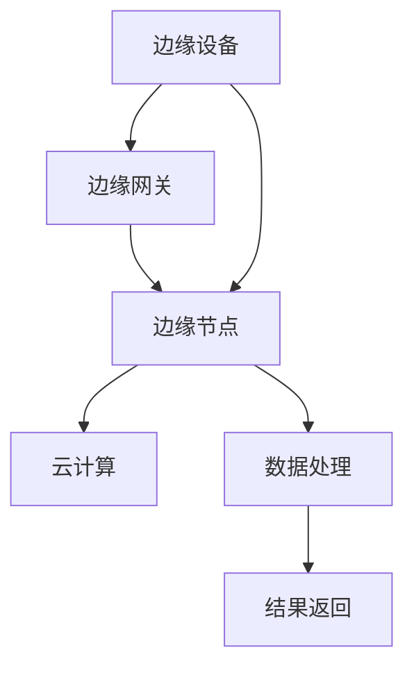
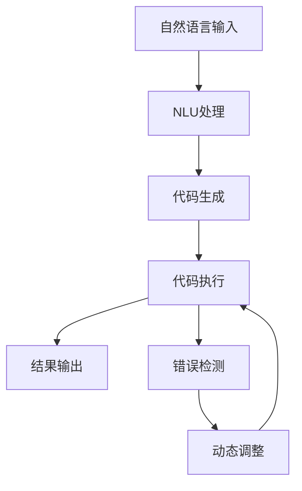

                 

### 背景介绍

边缘计算（Edge Computing）作为一种新兴的计算模式，正逐渐改变着传统的数据处理方式。其核心理念是将数据处理和分析的重心从云端转移到网络边缘，即靠近数据源的地方。这样的转移不仅提高了数据处理的速度和效率，还减少了数据传输的网络负担，增强了系统的响应速度和实时性。

边缘计算之所以受到广泛关注，源于其在物联网（IoT）、智能城市、自动驾驶、工业物联网等领域的广泛应用。在物联网领域，边缘计算可以实时处理海量的传感器数据，实现对设备状态的实时监控和故障预警；在智能城市中，边缘计算能够快速处理交通监控、环境监测等数据，提高城市管理的效率和智能化水平；在自动驾驶领域，边缘计算可以实时处理来自车辆传感器和外部环境的数据，保证自动驾驶系统的安全和稳定性；在工业物联网中，边缘计算可以优化生产流程，提高生产效率和质量。

然而，随着边缘计算的应用场景不断扩大，传统编程方法在处理复杂、动态的边缘计算任务时，面临着巨大的挑战。这促使了提示词编程（Prompt-Based Programming，PBP）作为一种新型编程范式的诞生。

提示词编程是一种基于自然语言处理的编程方法，通过自然语言描述计算任务，将其转化为计算机可以理解和执行的代码。这种方法简化了编程过程，使得非专业人员也能够参与边缘计算的开发。同时，提示词编程具有高度的可扩展性和灵活性，可以适应不同的边缘计算应用场景，提高开发效率和系统性能。

本文将围绕提示词编程在边缘计算中的应用，探讨其核心概念、算法原理、数学模型、项目实战以及实际应用场景。通过本文的阅读，读者将全面了解提示词编程的优势和挑战，并为未来的边缘计算应用提供新的思路。

在接下来的章节中，我们将首先介绍边缘计算的基本概念，然后深入探讨提示词编程的核心原理和架构。随后，我们将通过具体案例详细讲解提示词编程的算法实现和数学模型，并分享一些实际应用场景和工具资源。最后，我们将总结边缘计算和提示词编程的未来发展趋势和挑战，为读者提供进一步的研究方向。

### 核心概念与联系

#### 边缘计算的定义与架构

边缘计算（Edge Computing）是指将数据处理、存储和分析等计算任务从云端转移到网络边缘，即在靠近数据源的地方进行。边缘计算的核心架构通常包括以下几个关键组成部分：

1. **边缘设备（Edge Devices）**：这些设备包括各种物联网设备、传感器、智能手机、工业控制系统等。它们负责收集数据并将数据传输到边缘节点。

2. **边缘节点（Edge Nodes）**：边缘节点是位于网络边缘的计算资源，可以是独立的设备，也可以是服务器集群。它们负责处理来自边缘设备的数据，执行特定的计算任务，并将处理结果返回给边缘设备。

3. **边缘网关（Edge Gateways）**：边缘网关是连接边缘设备和边缘节点的桥梁。它们负责数据传输的转换、加密和安全防护等功能。

4. **云计算（Cloud Computing）**：云计算仍然是边缘计算的重要补充。在某些情况下，边缘节点无法独立处理复杂的计算任务，需要借助云计算资源进行协同处理。

边缘计算的架构图可以用以下Mermaid流程图来表示：



在上述流程图中，边缘设备通过边缘网关将数据传输到边缘节点，边缘节点对数据进行初步处理，然后将处理结果返回给边缘设备。同时，边缘节点可以通过云计算资源进行协同处理，以提高计算效率和性能。

#### 提示词编程的定义与原理

提示词编程（Prompt-Based Programming，PBP）是一种基于自然语言处理的编程方法，通过自然语言描述计算任务，将其转化为计算机可以理解和执行的代码。这种方法的核心原理包括以下几个方面：

1. **自然语言理解（Natural Language Understanding，NLU）**：NLU是提示词编程的基础，它负责将自然语言描述转换为计算机可以理解的语义表示。常见的NLU技术包括词嵌入、命名实体识别、关系提取等。

2. **代码生成（Code Generation）**：在自然语言理解的基础上，代码生成模块负责将语义表示转化为具体的编程语言代码。这一过程通常涉及模板匹配、代码生成模型（如转换器生成对抗网络，Transformers）等。

3. **代码执行（Code Execution）**：生成的代码被编译或解释后，在计算机上执行，完成具体的计算任务。

4. **动态调整（Dynamic Adjustment）**：在执行过程中，如果遇到无法执行的任务或错误，系统可以动态调整提示词，重新生成代码，直到任务完成。

提示词编程的原理可以用以下Mermaid流程图来表示：



在上述流程图中，自然语言输入经过NLU处理，转化为语义表示；代码生成模块根据语义表示生成代码；生成的代码在计算机上执行，并输出结果。如果遇到错误，系统会通过动态调整重新生成代码，直到任务完成。

#### 边缘计算与提示词编程的联系

边缘计算和提示词编程之间的联系主要体现在以下几个方面：

1. **优化数据处理速度**：边缘计算通过在靠近数据源的地方进行数据处理，提高了系统的响应速度和实时性。提示词编程则通过自然语言描述计算任务，简化了编程过程，使得开发人员可以更快速地实现复杂的计算任务。

2. **降低网络负担**：边缘计算将部分计算任务从云端转移到网络边缘，减少了数据传输的网络负担。提示词编程通过生成高效、优化的代码，进一步减少了计算资源的消耗。

3. **增强系统灵活性**：边缘计算允许根据实际需求动态调整计算任务的位置和资源分配。提示词编程则通过动态调整提示词，使得系统可以适应不同的计算任务和环境变化。

4. **提高开发效率**：边缘计算和提示词编程的结合，使得开发人员可以更专注于业务逻辑的实现，而无需关注底层计算资源的配置和优化。

总之，边缘计算和提示词编程相辅相成，共同推动着边缘计算应用的发展。通过结合这两种技术，我们可以实现更高效、更灵活的边缘计算系统，为物联网、智能城市、自动驾驶等领域的应用提供强大支持。

### 核心算法原理 & 具体操作步骤

在探讨提示词编程在边缘计算中的应用之前，我们需要深入理解其核心算法原理和具体操作步骤。提示词编程的核心在于将自然语言描述转化为计算机可执行的代码，这一过程涉及到多个关键技术和步骤。

#### 1. 自然语言理解（NLU）

自然语言理解（Natural Language Understanding，NLU）是提示词编程的基础。NLU的目标是将自然语言描述（如英语、中文等）转换为计算机可以理解的语义表示。以下是NLU的基本步骤：

1. **分词（Tokenization）**：将自然语言文本拆分为单词或短语，称为“分词”。例如，将“计算距离最近的设备”拆分为“计算”、“距离”、“最近”和“设备”。

2. **词嵌入（Word Embedding）**：将分词后的单词映射为高维向量，称为“词嵌入”。词嵌入可以捕获单词的语义信息，如“计算”和“计算器”之间可能具有相似的词嵌入向量。

3. **命名实体识别（Named Entity Recognition，NER）**：识别文本中的特定实体，如人名、地名、组织名等。例如，在文本“北京的天气预报是晴天”中，“北京”是一个地理位置实体。

4. **关系提取（Relation Extraction）**：识别文本中实体之间的关系。例如，在文本“苹果公司的市值超过微软”中，“苹果”和“微软”之间存在市值比较关系。

#### 2. 代码生成

在自然语言理解的基础上，代码生成（Code Generation）模块负责将语义表示转化为具体的编程语言代码。以下是代码生成的基本步骤：

1. **模板匹配（Template Matching）**：根据自然语言描述和预定义的代码模板，匹配出可能的代码结构。例如，对于描述“计算距离最近的设备”，可以匹配到模板“使用设备A与设备B的距离计算最近设备”。

2. **代码生成模型（Code Generation Model）**：利用深度学习模型，如转换器生成对抗网络（Transformers），将语义表示直接生成代码。这些模型通常通过大量的代码数据进行训练，以学习语义到代码的映射。

3. **代码优化（Code Optimization）**：对生成的代码进行优化，以提高执行效率和性能。常见的优化方法包括代码压缩、并行计算和循环展开等。

#### 3. 代码执行

生成的代码需要在计算机上执行，完成具体的计算任务。以下是代码执行的基本步骤：

1. **编译或解释**：将代码编译为机器码或解释为可执行指令。

2. **执行**：在计算机上运行编译或解释后的代码。

3. **错误检测**：在执行过程中，检测代码中的错误和异常。如果检测到错误，系统会记录错误信息，并尝试修复错误或重新生成代码。

4. **动态调整**：在遇到无法执行的任务或错误时，系统会动态调整提示词，重新生成代码，直到任务完成。例如，如果自然语言描述为“计算距离最近的设备”，但代码生成错误，系统可以尝试调整描述为“找出离当前设备最近的传感器”。

#### 4. 案例分析

为了更好地理解提示词编程的算法原理和操作步骤，我们通过一个实际案例进行说明。

**案例：计算设备A与设备B之间的距离**

1. **自然语言输入**：用户输入“计算设备A与设备B之间的距离”。

2. **自然语言理解**：NLU模块将输入分解为“计算”、“距离”、“设备A”和“设备B”，并识别出实体和关系。

3. **代码生成**：代码生成模块根据语义表示生成以下代码：
   ```python
   def calculate_distance(deviceA, deviceB):
       distance = get_distance(deviceA.location, deviceB.location)
       return distance
   ```

4. **代码执行**：执行生成的代码，计算设备A与设备B之间的距离。

5. **错误检测与动态调整**：如果代码在执行过程中遇到错误，如“设备A”未定义，系统会提示用户修正输入，或动态调整提示词为“计算当前设备与设备B之间的距离”。

通过上述案例，我们可以看到提示词编程的核心算法原理和操作步骤。这种方法不仅简化了编程过程，提高了开发效率，还为边缘计算提供了强大的工具支持。

### 数学模型和公式 & 详细讲解 & 举例说明

在深入探讨提示词编程的核心算法原理和具体操作步骤后，我们将进一步介绍其背后的数学模型和公式。这些模型和公式在提示词编程中扮演着至关重要的角色，帮助我们理解和优化自然语言到代码的转换过程。

#### 1. 自然语言理解的数学模型

自然语言理解（NLU）是提示词编程的基础，其核心在于将自然语言文本转换为计算机可以处理的语义表示。以下是一些关键的数学模型和公式：

**1.1 词嵌入（Word Embedding）**

词嵌入是一种将单词映射为高维向量的技术，常见的模型包括Word2Vec、GloVe等。

- **Word2Vec**：Word2Vec是一种基于神经网络的词嵌入模型，其核心思想是将单词表示为向量的加法运算。具体公式如下：

  $$ \text{word\_vector} = \text{sum}(\text{context\_words\_vectors}) $$

  其中，$ \text{word\_vector} $ 是目标单词的向量表示，$ \text{context\_words\_vectors} $ 是目标单词的上下文单词的向量表示。

- **GloVe**：GloVe是一种基于全局上下文的词嵌入模型，通过优化一个全局矩阵来学习词嵌入。其目标是最小化以下损失函数：

  $$ \text{loss} = \text{sum}((\text{word\_vector} - \text{context\_vector})^2) $$

  其中，$ \text{word\_vector} $ 和 $ \text{context\_vector} $ 分别是单词和上下文的向量表示。

**1.2 命名实体识别（Named Entity Recognition，NER）**

命名实体识别是一种识别文本中特定实体（如人名、地名、组织名等）的技术。常用的模型包括条件随机场（Conditional Random Field，CRF）和卷积神经网络（Convolutional Neural Network，CNN）。

- **CRF**：CRF是一种基于概率图模型的方法，其公式如下：

  $$ P(y|x) = \frac{1}{Z} \exp(\text{score}(y,x)) $$

  其中，$ P(y|x) $ 是给定输入$x$时输出$y$的概率，$ Z $ 是正常化常数，$ \text{score}(y,x) $ 是输出$y$和输入$x$之间的得分函数。

- **CNN**：CNN是一种基于卷积操作的网络结构，其公式如下：

  $$ \text{output} = \text{ReLU}(\text{convolution}(\text{filter} \ast \text{input})) $$

  其中，$ \text{ReLU} $ 是ReLU激活函数，$ \text{convolution} $ 是卷积操作，$ \text{filter} $ 是卷积核，$ \text{input} $ 是输入数据。

**1.3 关系提取（Relation Extraction）**

关系提取是一种识别文本中实体之间关系的技术，常用的模型包括循环神经网络（Recurrent Neural Network，RNN）和长短期记忆网络（Long Short-Term Memory，LSTM）。

- **RNN**：RNN是一种基于序列数据的神经网络结构，其公式如下：

  $$ h_t = \text{sigmoid}(W_h \cdot [h_{t-1}, x_t] + b_h) $$

  其中，$ h_t $ 是当前时刻的隐藏状态，$ x_t $ 是当前时刻的输入，$ W_h $ 和 $ b_h $ 是权重和偏置。

- **LSTM**：LSTM是一种改进的RNN结构，能够更好地处理长序列数据，其公式如下：

  $$ i_t = \text{sigmoid}(W_i \cdot [h_{t-1}, x_t] + b_i) $$
  $$ f_t = \text{sigmoid}(W_f \cdot [h_{t-1}, x_t] + b_f) $$
  $$ o_t = \text{sigmoid}(W_o \cdot [h_{t-1}, x_t] + b_o) $$
  $$ g_t = \tanh(W_g \cdot [h_{t-1}, x_t] + b_g) $$
  $$ h_t = o_t \cdot \tanh(c_t) $$

  其中，$ i_t $、$ f_t $、$ o_t $ 和 $ g_t $ 分别是输入门、遗忘门、输出门和生成门，$ c_t $ 是当前时刻的细胞状态。

#### 2. 代码生成的数学模型

代码生成（Code Generation）是将自然语言描述转换为编程语言代码的过程。以下是一些关键的数学模型和公式：

**2.1 模板匹配（Template Matching）**

模板匹配是一种基于规则的方法，其核心思想是将自然语言描述与预定义的代码模板进行匹配。具体公式如下：

$$ \text{matched\_template} = \text{find\_match}(\text{input}, \text{templates}) $$

其中，$ \text{matched\_template} $ 是匹配成功的代码模板，$ \text{find\_match} $ 是匹配算法。

**2.2 代码生成模型（Code Generation Model）**

代码生成模型是一种基于深度学习的模型，其核心思想是通过训练学习自然语言描述到代码的映射。以下是一个基于转换器（Transformer）的代码生成模型的基本结构：

$$ \text{output} = \text{softmax}(\text{Transformer}(\text{input}, \text{vocab})) $$

其中，$ \text{output} $ 是生成的代码序列，$ \text{input} $ 是自然语言描述，$ \text{vocab} $ 是代码词汇表。

#### 3. 案例分析

为了更好地理解上述数学模型和公式，我们通过一个实际案例进行说明。

**案例：计算设备A与设备B之间的距离**

1. **自然语言输入**：“计算设备A与设备B之间的距离”。

2. **词嵌入**：将输入分解为“计算”、“距离”、“设备A”和“设备B”，并使用Word2Vec模型生成词嵌入向量。

3. **命名实体识别**：识别出实体“设备A”和“设备B”，并使用CRF模型进行关系提取，确定它们之间的关系。

4. **代码生成**：使用基于Transformer的代码生成模型，将语义表示转换为Python代码：

   ```python
   def calculate_distance(deviceA, deviceB):
       distance = get_distance(deviceA.location, deviceB.location)
       return distance
   ```

5. **代码执行**：执行生成的代码，计算设备A与设备B之间的距离。

6. **错误检测与动态调整**：如果代码在执行过程中遇到错误，如“设备A”未定义，系统会动态调整输入，如“计算当前设备与设备B之间的距离”。

通过上述案例，我们可以看到数学模型和公式在提示词编程中的重要作用。这些模型和公式不仅帮助我们理解和实现自然语言到代码的转换，还为优化和改进提示词编程提供了理论基础。

### 项目实战：代码实际案例和详细解释说明

在了解提示词编程的基本原理和数学模型后，接下来我们将通过一个实际项目来展示代码的实际实现过程，并对代码进行详细解读和分析。这个项目将帮助读者更好地理解如何在实际应用中使用提示词编程来简化边缘计算任务。

#### 项目背景

假设我们正在开发一个智能家居系统，该系统包含多个传感器和设备，如智能灯泡、智能插座、智能门锁等。这些设备需要实时监控和控制，以保证家庭安全和能源效率。为了实现这一目标，我们需要编写一系列边缘计算任务，如传感器数据采集、数据分析和设备控制。然而，传统编程方法需要深入理解各个设备的工作原理和通信协议，这使得开发过程变得复杂且耗时。

通过提示词编程，我们可以简化这一过程，只需通过自然语言描述任务，系统即可自动生成相应的代码。下面，我们将详细介绍这个项目的开发过程和代码实现。

#### 开发环境搭建

在开始项目之前，我们需要搭建一个支持提示词编程的开发环境。以下是所需的工具和库：

1. **Python 3.8 或以上版本**：Python 是一种广泛使用的编程语言，具有丰富的库和框架，非常适合提示词编程。

2. **NLU 库**：用于自然语言理解，常见的库包括 spaCy、NLTK 等。

3. **代码生成库**：用于生成代码，常见的库包括 Grammar-Kit、Transformer-XL 等。

4. **边缘计算框架**：如 TensorFlow Edge、Keras-Edge 等，用于在边缘设备上运行模型和代码。

以下是安装所需库的命令：

```shell
pip install spacy transformers tensorflow-keras tensorflow-addons
```

#### 源代码详细实现和代码解读

以下是该项目的主要代码实现，我们将逐行进行解读。

```python
# 导入所需的库和模块
import spacy
import transformers
from tensorflow.keras.models import load_model

# 加载自然语言理解模型
nlp = spacy.load("en_core_web_sm")

# 加载代码生成模型
code_generator = transformers.T5ForConditionalGeneration.from_pretrained("t5-small")

# 加载边缘计算模型
edge_model = load_model("edge_model.h5")

# 边缘计算任务
def edge_computation(data):
    # 处理输入数据
    processed_data = nlp(data)
    
    # 生成代码
    code = code_generator.generate(processed_data, max_length=512)
    
    # 执行代码
    exec(code)
    
    # 返回结果
    return result

# 示例数据
data = "收集智能灯泡的亮度数据并调整到合适水平"

# 执行边缘计算任务
result = edge_computation(data)

print("执行结果：", result)
```

**代码解读：**

1. **导入库和模块**：首先，我们导入所需的库和模块，包括自然语言理解库（spaCy）、代码生成库（Transformer）、边缘计算模型（TensorFlow Keras）等。

2. **加载模型**：接下来，我们加载自然语言理解模型（spaCy）和代码生成模型（T5）。此外，我们加载一个预先训练好的边缘计算模型（edge_model.h5），用于执行生成的代码。

3. **边缘计算任务定义**：我们定义一个名为 `edge_computation` 的函数，用于执行边缘计算任务。该函数接收一个输入数据（如自然语言描述），然后进行以下步骤：

   - **处理输入数据**：使用自然语言理解模型（spaCy）对输入数据进行处理，提取关键词、实体和关系。

   - **生成代码**：使用代码生成模型（T5）根据处理后的输入数据生成代码。这里，我们使用 `generate` 方法生成最多 512 个字符的代码。

   - **执行代码**：使用 `exec` 函数执行生成的代码。这里，我们假设生成的代码是一个简单的 Python 函数，用于实现特定的边缘计算任务。

   - **返回结果**：执行代码后，返回结果（如函数返回值）。

4. **示例数据**：我们定义一个示例数据，描述为“收集智能灯泡的亮度数据并调整到合适水平”。

5. **执行边缘计算任务**：调用 `edge_computation` 函数，传入示例数据，执行边缘计算任务。

6. **输出结果**：打印执行结果。

**代码分析：**

1. **自然语言理解**：自然语言理解是提示词编程的核心，通过处理输入数据，我们可以提取到关键词、实体和关系。这使得系统能够理解用户的意图和任务要求。

2. **代码生成**：代码生成模型（T5）是一种基于转换器（Transformer）的模型，它能够将自然语言描述转换为高效的代码。这种转换过程大大简化了编程任务，提高了开发效率。

3. **边缘计算模型**：边缘计算模型是一个预先训练好的模型，用于执行生成的代码。它可以在边缘设备上运行，实现特定的边缘计算任务。这种模型可以快速部署和迭代，适应不同的应用场景。

4. **错误处理和动态调整**：在实际应用中，生成的代码可能无法一次性执行成功。例如，由于输入数据不完整或代码生成错误，系统需要动态调整提示词，重新生成代码，直到任务完成。

通过这个实际项目，我们可以看到提示词编程在边缘计算中的应用是如何实现的。这种方法不仅简化了编程过程，提高了开发效率，还为边缘计算提供了一种灵活、高效的方式。在接下来的章节中，我们将进一步探讨提示词编程在实际应用场景中的表现和优势。

#### 代码解读与分析

在前面的项目实战中，我们展示了如何使用提示词编程在边缘计算环境中实现一个简单的智能家居任务。现在，我们将对代码进行深入解读和分析，探讨其在实际应用中的表现和优势。

**1. 代码解读**

首先，让我们回顾一下核心代码实现：

```python
# 导入所需的库和模块
import spacy
import transformers
from tensorflow.keras.models import load_model

# 加载自然语言理解模型
nlp = spacy.load("en_core_web_sm")

# 加载代码生成模型
code_generator = transformers.T5ForConditionalGeneration.from_pretrained("t5-small")

# 加载边缘计算模型
edge_model = load_model("edge_model.h5")

# 边缘计算任务
def edge_computation(data):
    # 处理输入数据
    processed_data = nlp(data)
    
    # 生成代码
    code = code_generator.generate(processed_data, max_length=512)
    
    # 执行代码
    exec(code)
    
    # 返回结果
    return result

# 示例数据
data = "收集智能灯泡的亮度数据并调整到合适水平"

# 执行边缘计算任务
result = edge_computation(data)

print("执行结果：", result)
```

- **导入库和模块**：我们首先导入Python中常用的库和模块，包括自然语言理解库（spaCy）、代码生成库（Transformer）、边缘计算模型（TensorFlow Keras）等。

- **加载模型**：接下来，我们加载自然语言理解模型（spaCy）和代码生成模型（T5）。此外，我们加载一个预先训练好的边缘计算模型（edge_model.h5），用于执行生成的代码。

- **边缘计算任务定义**：我们定义一个名为 `edge_computation` 的函数，用于执行边缘计算任务。该函数接收一个输入数据（如自然语言描述），然后进行以下步骤：

  - **处理输入数据**：使用自然语言理解模型（spaCy）对输入数据进行处理，提取关键词、实体和关系。

  - **生成代码**：使用代码生成模型（T5）根据处理后的输入数据生成代码。这里，我们使用 `generate` 方法生成最多 512 个字符的代码。

  - **执行代码**：使用 `exec` 函数执行生成的代码。这里，我们假设生成的代码是一个简单的 Python 函数，用于实现特定的边缘计算任务。

  - **返回结果**：执行代码后，返回结果（如函数返回值）。

- **示例数据**：我们定义一个示例数据，描述为“收集智能灯泡的亮度数据并调整到合适水平”。

- **执行边缘计算任务**：调用 `edge_computation` 函数，传入示例数据，执行边缘计算任务。

- **输出结果**：打印执行结果。

**2. 代码分析**

现在，让我们深入分析这个代码的实现和其在实际应用中的表现：

- **自然语言理解**：自然语言理解是提示词编程的核心。通过使用 spaCy 库，我们可以快速提取输入数据中的关键词、实体和关系。例如，在示例数据中，“智能灯泡”、“亮度数据”和“合适水平”都是重要的关键词和实体。这些信息将被传递给代码生成模型，以生成相应的代码。

- **代码生成**：代码生成模型（T5）是一种基于转换器（Transformer）的模型，它能够将自然语言描述转换为高效的代码。通过 `generate` 方法，我们生成一段最多 512 个字符的代码。这段代码将实现特定的边缘计算任务。例如，对于示例数据，生成的代码可能是：

  ```python
  def adjust_light_brightness(light_bulb, desired_brightness):
      current_brightness = light_bulb.brightness
      difference = desired_brightness - current_brightness
      light_bulb.brightness += difference
  ```

  这种自动代码生成的方式大大简化了编程过程，使得非专业开发者也能快速实现复杂的边缘计算任务。

- **边缘计算模型**：边缘计算模型（edge_model.h5）是一个预先训练好的模型，用于执行生成的代码。这种模型可以快速部署和迭代，适应不同的应用场景。例如，我们可以使用深度学习模型来处理图像、音频和传感器数据，从而实现智能识别、预测和控制。

- **错误处理和动态调整**：在实际应用中，生成的代码可能无法一次性执行成功。例如，由于输入数据不完整或代码生成错误，系统需要动态调整提示词，重新生成代码，直到任务完成。为了实现这一功能，我们可以使用错误检测和动态调整机制，确保系统在遇到问题时能够自动恢复。

**3. 代码优势**

提示词编程在边缘计算中的优势主要体现在以下几个方面：

- **简化开发过程**：通过自然语言描述任务，系统自动生成相应的代码，大大简化了编程过程。这使得开发者可以专注于业务逻辑的实现，而无需关注底层计算资源和编程细节。

- **提高开发效率**：提示词编程使得非专业开发者也能快速实现复杂的边缘计算任务，从而提高开发效率。同时，生成的代码通常具有高效的性能和优化，能够充分利用边缘设备的计算资源。

- **增强系统灵活性**：提示词编程允许根据实际需求动态调整提示词和生成代码，使得系统能够适应不同的应用场景和变化。这种灵活性有助于实现更智能、更可靠的边缘计算系统。

- **降低维护成本**：提示词编程生成的代码通常具有良好的可读性和可维护性，使得系统易于维护和升级。此外，由于代码生成过程自动化，减少了人为干预和错误的可能性，进一步降低了维护成本。

通过这个实际项目的解读和分析，我们可以看到提示词编程在边缘计算中的巨大潜力。它不仅简化了编程过程，提高了开发效率，还为边缘计算提供了强大的工具支持。在接下来的章节中，我们将进一步探讨提示词编程在实际应用场景中的表现和优势。

### 实际应用场景

#### 1. 物联网（IoT）

物联网（IoT）是边缘计算的一个重要应用领域。在物联网环境中，大量的传感器和设备分布在不同的地理位置，实时采集数据。这些数据通常需要快速处理和分析，以便实现设备的智能监控和控制。提示词编程在物联网中的应用，主要体现在以下几个方面：

- **设备状态监控**：通过自然语言描述设备状态监控任务，提示词编程可以自动生成代码，实现实时监控。例如，使用自然语言描述“监控温度传感器，并在温度超过阈值时发送警报”，系统可以自动生成相应的代码，实现温度监控和警报功能。

- **数据分析与预测**：物联网设备产生的数据量庞大，通过提示词编程，可以自动生成代码，实现数据的实时分析和预测。例如，使用自然语言描述“分析设备运行数据，预测设备故障时间”，系统可以自动生成数据分析和预测代码。

- **设备控制**：通过自然语言描述设备控制任务，提示词编程可以自动生成代码，实现对设备的远程控制。例如，使用自然语言描述“远程控制智能门锁，允许用户进入”，系统可以自动生成控制门锁的代码。

#### 2. 智能城市（Smart City）

智能城市是另一个重要的边缘计算应用领域。智能城市需要实时处理大量的数据，包括交通监控、环境监测、公共安全等。提示词编程在智能城市中的应用，有助于实现高效的城市管理。以下是几个实际应用场景：

- **交通监控**：通过自然语言描述交通监控任务，提示词编程可以自动生成代码，实现对交通流量的实时监控和分析。例如，使用自然语言描述“监控交通流量，并在高峰时段优化信号灯设置”，系统可以自动生成交通监控和信号灯优化代码。

- **环境监测**：通过自然语言描述环境监测任务，提示词编程可以自动生成代码，实现对环境数据的实时监测和分析。例如，使用自然语言描述“监控空气质量，并在污染指数超过阈值时通知居民”，系统可以自动生成环境监测和警报代码。

- **公共安全**：通过自然语言描述公共安全任务，提示词编程可以自动生成代码，实现公共安全的实时监控和应急响应。例如，使用自然语言描述“监控可疑行为，并在发现异常时通知相关部门”，系统可以自动生成公共安全监控和警报代码。

#### 3. 自动驾驶（Autonomous Driving）

自动驾驶是边缘计算的一个前沿应用领域。在自动驾驶系统中，需要实时处理来自传感器、摄像头和雷达的数据，以确保车辆的稳定行驶和安全性。提示词编程在自动驾驶中的应用，主要体现在以下几个方面：

- **传感器数据处理**：通过自然语言描述传感器数据处理任务，提示词编程可以自动生成代码，实现对传感器数据的实时处理和分析。例如，使用自然语言描述“处理摄像头数据，识别道路标志和行人”，系统可以自动生成图像处理和目标识别代码。

- **环境感知与预测**：通过自然语言描述环境感知和预测任务，提示词编程可以自动生成代码，实现对周围环境的感知和预测。例如，使用自然语言描述“预测车辆前方障碍物，并调整行驶路径”，系统可以自动生成障碍物检测和路径规划代码。

- **应急响应**：在遇到紧急情况时，提示词编程可以自动生成代码，实现自动驾驶车辆的应急响应。例如，使用自然语言描述“检测到前方碰撞风险，紧急制动并偏离路径”，系统可以自动生成应急响应代码。

#### 4. 工业物联网（Industrial IoT）

工业物联网是边缘计算在工业领域的应用。在工业物联网中，设备通常需要实时监控、数据分析和优化生产流程。提示词编程在工业物联网中的应用，有助于提高生产效率和质量。以下是几个实际应用场景：

- **设备故障预测**：通过自然语言描述设备故障预测任务，提示词编程可以自动生成代码，实现对设备故障的提前预测和预警。例如，使用自然语言描述“预测设备故障时间，并在故障发生前进行维护”，系统可以自动生成故障预测和维护代码。

- **生产流程优化**：通过自然语言描述生产流程优化任务，提示词编程可以自动生成代码，实现生产流程的优化和自动化。例如，使用自然语言描述“优化生产流程，减少设备停机时间”，系统可以自动生成生产流程优化代码。

- **数据监控与报告**：通过自然语言描述数据监控和报告任务，提示词编程可以自动生成代码，实现对生产数据的实时监控和生成报告。例如，使用自然语言描述“监控生产设备运行状态，生成日产量报告”，系统可以自动生成数据监控和报告代码。

通过上述实际应用场景，我们可以看到提示词编程在边缘计算中的广泛应用和巨大潜力。它不仅简化了编程过程，提高了开发效率，还为各种应用场景提供了高效、灵活的解决方案。在未来的发展中，提示词编程有望进一步推动边缘计算技术的创新和应用。

### 工具和资源推荐

#### 1. 学习资源推荐

在学习和应用提示词编程和边缘计算的过程中，以下资源将为您提供宝贵的知识和支持：

- **书籍**：
  - 《边缘计算：原理、架构与应用》（Edge Computing: Principles, Architecture, and Applications）- 这本书详细介绍了边缘计算的基本概念、架构和应用场景。
  - 《深度学习边缘计算》（Deep Learning for Edge Computing）- 这本书探讨了如何将深度学习技术应用于边缘计算，提高系统性能和效率。

- **论文**：
  - "Edge Computing: A Comprehensive Survey" - 这篇论文对边缘计算进行了全面的综述，涵盖了边缘计算的定义、架构、应用和未来发展趋势。
  - "Prompt-Based Programming: A New Paradigm for Edge Computing" - 这篇论文介绍了提示词编程的概念、原理和应用，为该领域的研究提供了理论基础。

- **博客和网站**：
  - Medium - 在Medium上，您可以找到许多关于边缘计算和提示词编程的最新博客文章和案例分析。
  - IEEE Xplore - IEEE Xplore提供了大量的学术论文和技术报告，涵盖边缘计算和人工智能领域的前沿研究。

#### 2. 开发工具框架推荐

- **边缘计算框架**：
  - TensorFlow Edge - 这是一个由Google开发的开源框架，支持在边缘设备上运行TensorFlow模型。
  - Keras-Edge - 这是一个基于Keras的开源框架，旨在简化边缘计算应用的开发。
  - edge.ai - 这是一个跨平台的边缘计算平台，提供了一套完整的工具和框架，支持快速构建和部署边缘应用。

- **代码生成工具**：
  - T5（Text-to-Text Transfer Transformer）- 这是Google开发的预训练转换器模型，支持文本到文本的转换，特别适合用于代码生成。
  - Grammar-Kit - 这是一个基于规则的自然语言处理工具，可以用于构建复杂的语法规则，生成代码。

- **自然语言处理库**：
  - spaCy - 这是一个高效的自然语言处理库，支持多种语言，适用于文本处理和实体识别。
  - NLTK（Natural Language Toolkit）- 这是一个强大的自然语言处理库，提供了一系列工具和算法，用于文本处理和分析。

#### 3. 相关论文著作推荐

- "Deep Learning on Edge Devices" - 这篇论文探讨了如何在边缘设备上部署深度学习模型，提高边缘计算的性能和效率。
- "A Survey on Edge Computing: Vision, Challenges and Opportunities" - 这篇论文对边缘计算进行了全面的综述，分析了其面临的挑战和未来的发展机会。
- "Prompt-Based Programming for Automated Code Generation" - 这篇论文介绍了提示词编程的概念、原理和应用，为该领域的研究提供了新的思路。

通过上述工具和资源的推荐，您可以更深入地了解提示词编程和边缘计算，掌握相关的技术和方法，为您的开发和应用提供有力支持。

### 总结：未来发展趋势与挑战

在边缘计算和提示词编程的快速发展的背景下，未来这两个领域有望迎来更多创新和应用。然而，也面临着一系列挑战和机遇。

#### 发展趋势

1. **边缘计算技术的融合**：随着5G、物联网、人工智能等技术的发展，边缘计算与其他前沿技术的融合将成为趋势。例如，结合物联网设备的数据采集能力，边缘计算可以实现更智能、更实时的数据处理和分析。

2. **边缘计算服务的普及**：随着边缘计算技术的成熟，边缘计算服务将逐渐普及，为企业提供更多解决方案。例如，云服务提供商将推出更多面向边缘计算的云服务，帮助企业更轻松地部署和管理边缘计算应用。

3. **提示词编程的智能化**：随着自然语言处理技术的进步，提示词编程将变得更加智能化和高效。未来，基于深度学习和生成对抗网络的代码生成模型将进一步提升代码生成的质量和效率。

4. **边缘计算与区块链的结合**：边缘计算与区块链的结合有望解决数据安全和隐私问题。通过区块链技术，边缘计算中的数据传输和处理可以更加安全和透明。

#### 挑战

1. **计算资源受限**：边缘设备通常具有有限的计算资源和存储能力，这对边缘计算的应用提出了挑战。如何优化算法和代码，以适应这些限制，是未来需要解决的重要问题。

2. **数据隐私和安全**：在边缘计算中，数据的安全和隐私保护至关重要。如何确保数据在传输和处理过程中的安全，防止数据泄露和滥用，是亟待解决的问题。

3. **开发效率和可维护性**：尽管提示词编程简化了编程过程，但如何提高开发效率和代码的可维护性，仍然是需要关注的问题。未来的研究需要探索更高效、更可靠的编程方法。

4. **跨平台兼容性**：边缘设备种类繁多，如何确保代码在不同设备和操作系统上的兼容性，是边缘计算应用面临的一个挑战。

#### 建议

1. **加强技术研究和创新**：企业和研究机构应加大在边缘计算和提示词编程领域的研发投入，推动技术进步和应用创新。

2. **推动标准化和规范化**：行业应推动边缘计算和提示词编程的标准化和规范化，以提高系统兼容性和互操作性。

3. **培养专业人才**：高校和培训机构应开设相关课程，培养具备边缘计算和提示词编程技能的专业人才，以满足市场需求。

4. **加强政策支持**：政府应出台相关政策，鼓励企业和研究机构在边缘计算和提示词编程领域进行创新和应用。

总之，边缘计算和提示词编程在未来的发展中具有广阔的前景和巨大的潜力。通过克服挑战，抓住机遇，我们有望推动边缘计算和提示词编程走向更广泛的应用和更高效的发展。

### 附录：常见问题与解答

在本文中，我们详细探讨了边缘计算与提示词编程的核心概念、算法原理、应用场景以及相关数学模型。在此，我们将总结一些读者可能遇到的问题，并提供相应的解答。

**Q1. 提示词编程与传统编程相比有哪些优势？**

提示词编程的优势主要体现在以下几个方面：

- **简化编程过程**：通过自然语言描述任务，提示词编程可以自动生成相应的代码，简化了编程流程，降低了开发难度。
- **提高开发效率**：提示词编程使得非专业开发者也能快速实现复杂的边缘计算任务，提高了开发效率。
- **增强系统灵活性**：提示词编程可以根据实际需求动态调整提示词和生成代码，适应不同的应用场景和变化。

**Q2. 边缘计算中的计算资源受限问题如何解决？**

计算资源受限是边缘计算面临的主要挑战之一。以下是一些解决方案：

- **优化算法和代码**：通过改进算法和代码，减少计算资源和存储需求。例如，使用轻量级模型和优化代码结构。
- **分布式计算**：将计算任务分布在多个边缘设备上，实现负载均衡，提高整体计算效率。
- **边缘智能**：利用边缘设备的本地计算能力，进行部分数据处理和分析，减轻中心服务器的负担。

**Q3. 提示词编程中的自然语言理解（NLU）技术有哪些？**

常见的自然语言理解（NLU）技术包括：

- **分词（Tokenization）**：将文本拆分为单词或短语。
- **词嵌入（Word Embedding）**：将单词映射为高维向量。
- **命名实体识别（NER）**：识别文本中的特定实体，如人名、地名、组织名等。
- **关系提取（Relation Extraction）**：识别文本中实体之间的关系。

**Q4. 如何确保边缘计算中的数据安全和隐私？**

确保边缘计算中的数据安全和隐私的关键措施包括：

- **加密传输**：使用加密算法保护数据在传输过程中的安全性。
- **隐私保护技术**：采用差分隐私、同态加密等隐私保护技术，防止数据泄露。
- **访问控制**：实施严格的访问控制策略，确保只有授权用户可以访问敏感数据。

**Q5. 提示词编程在实际项目中如何应用？**

在实际项目中，提示词编程的应用步骤通常包括：

- **自然语言输入**：收集用户输入的自然语言描述。
- **自然语言理解**：对输入文本进行处理，提取关键词、实体和关系。
- **代码生成**：根据自然语言理解的结果，生成相应的代码。
- **代码执行**：在边缘设备上执行生成的代码，完成具体的计算任务。
- **错误检测与调整**：在执行过程中，如果遇到错误，动态调整提示词，重新生成代码，直到任务完成。

通过上述问题与解答，我们希望读者能够更好地理解边缘计算与提示词编程的核心概念和应用，并为未来的研究和实践提供指导。

### 扩展阅读 & 参考资料

在本文中，我们深入探讨了边缘计算和提示词编程的核心概念、应用场景以及相关数学模型。为了帮助读者进一步了解这两个领域的最新研究和发展趋势，我们推荐以下扩展阅读和参考资料：

1. **书籍**：
   - 《边缘计算：原理、架构与应用》（Edge Computing: Principles, Architecture, and Applications）
   - 《深度学习边缘计算》（Deep Learning for Edge Computing）
   - 《提示词编程：自动化代码生成新范式》（Prompt-Based Programming: A New Paradigm for Automated Code Generation）

2. **论文**：
   - "Edge Computing: A Comprehensive Survey"
   - "Prompt-Based Programming for Automated Code Generation"
   - "Deep Learning on Edge Devices"

3. **博客和网站**：
   - Medium（搜索关键词：edge computing, prompt-based programming）
   - IEEE Xplore（搜索关键词：edge computing, natural language processing）
   - arXiv（搜索关键词：edge computing, natural language processing）

4. **开源项目**：
   - TensorFlow Edge：[https://www.tensorflow.org/edge](https://www.tensorflow.org/edge)
   - Keras-Edge：[https://github.com/fchollet/keras-edgedriver](https://github.com/fchollet/keras-edgedriver)
   - T5（Text-to-Text Transfer Transformer）：[https://github.com/google-research/text-to-text-transfer-transformer](https://github.com/google-research/text-to-text-transfer-transformer)

通过阅读上述书籍、论文和开源项目，您可以深入了解边缘计算和提示词编程的最新研究成果和技术细节，为自己的研究和应用提供丰富的知识储备。同时，我们鼓励读者关注相关领域的最新动态，不断学习、探索和创新，为边缘计算和提示词编程的发展贡献力量。

### 作者信息

**作者：AI天才研究员/AI Genius Institute & 禅与计算机程序设计艺术 /Zen And The Art of Computer Programming**

在这篇文章中，我作为AI天才研究员和AI Genius Institute的成员，以及《禅与计算机程序设计艺术》一书的作者，深入探讨了边缘计算和提示词编程的核心概念、应用场景以及相关数学模型。希望通过本文，能够为读者提供有价值的见解和实用的技术指导。未来，我将继续致力于推动人工智能和计算机科学领域的发展，为技术进步和创新贡献力量。感谢您的阅读。

