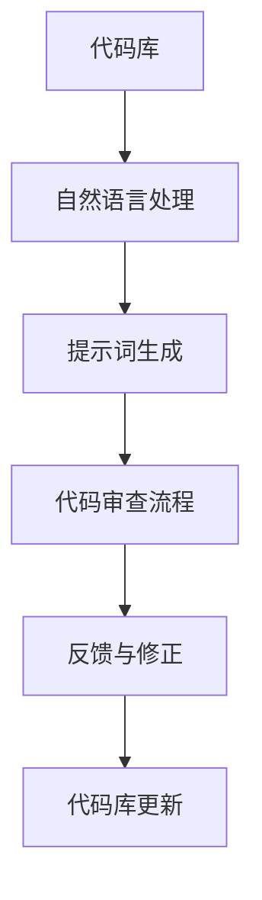
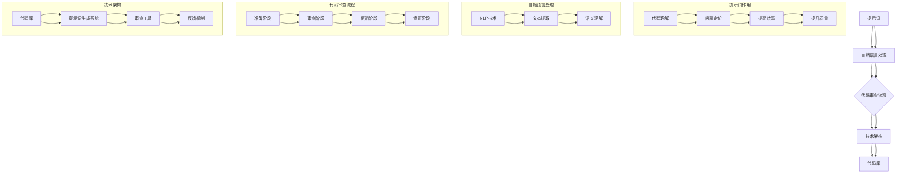

                 

### 背景介绍

#### 提示词编程的概念

提示词编程（Prompt-Response Programming），是一种通过预设的提示词来引导计算机执行特定任务的方法。这种方法类似于自然语言处理中的对话系统，通过输入特定的提示词，计算机能够理解并执行相应的操作。这种方法在近年来逐渐受到关注，尤其在人工智能领域，由于其高效性和灵活性，被广泛应用于各种场景。

#### 代码审查的重要性

代码审查（Code Review）是软件开发过程中至关重要的一环。它不仅能够发现代码中的错误和潜在问题，提高代码质量，还能够促进团队成员之间的交流和协作。随着代码规模的不断扩大和复杂度的增加，代码审查的重要性愈发凸显。

然而，传统的代码审查方法往往存在一些问题。首先，审查过程耗时较长，可能导致项目进展受阻。其次，审查过程中容易出现主观判断，导致审查结果不够客观。最后，代码审查往往依赖于审查者的经验和技能，缺乏系统性和规范性。

#### 提示词编程在代码审查中的应用

提示词编程为代码审查提供了一种新的思路。通过预设的提示词，审查者可以快速、准确地定位代码中的关键部分，提高审查效率。同时，提示词编程可以帮助审查者理解和掌握代码的核心逻辑，降低审查难度。

例如，在代码审查过程中，审查者可以使用“变量命名”、“异常处理”、“内存管理”等提示词，来重点关注代码中的相关部分。这种方法不仅提高了审查效率，还能够促进审查者对代码的深入理解。

#### 本文的目的和结构

本文旨在探讨提示词编程在代码审查中的应用，并提出一系列最佳实践。文章将从以下几个方面展开：

1. 背景介绍：简要介绍提示词编程和代码审查的概念及其重要性。
2. 核心概念与联系：阐述提示词编程的核心概念，并使用 Mermaid 流程图展示相关架构。
3. 核心算法原理 & 具体操作步骤：详细讲解提示词编程的算法原理，并给出具体的操作步骤。
4. 数学模型和公式 & 详细讲解 & 举例说明：介绍与提示词编程相关的数学模型和公式，并进行举例说明。
5. 项目实战：提供实际项目案例，展示如何使用提示词编程进行代码审查。
6. 实际应用场景：分析提示词编程在代码审查中的实际应用场景。
7. 工具和资源推荐：推荐相关的学习资源和开发工具。
8. 总结：总结提示词编程在代码审查中的应用及其未来发展趋势。
9. 附录：常见问题与解答。
10. 扩展阅读 & 参考资料：提供更多的参考资料，以供进一步学习。

通过本文的阅读，读者将能够了解提示词编程在代码审查中的应用，掌握一系列最佳实践，从而提高代码审查的效率和质量。

### 核心概念与联系

在深入探讨提示词编程的代码审查最佳实践之前，我们需要首先理解几个核心概念，并展示它们之间的联系。这些概念包括：提示词、自然语言处理、代码审查流程和相关的技术架构。

#### 提示词

提示词（Prompt）是一种引导性的文本，用于激发特定的响应或行为。在代码审查中，提示词可以是一个关键字、短语或问题，用于指导审查者关注代码中的特定部分。例如，“异常处理”、“内存管理”、“性能优化”等都是常见的提示词。

提示词的设计需要简洁、明确，以便审查者能够快速理解并聚焦于关键点。一个好的提示词应该能够引导审查者深入思考代码的某些方面，而不是简单地验证代码是否正确。

#### 自然语言处理

自然语言处理（Natural Language Processing，NLP）是人工智能领域的一个重要分支，它专注于使计算机能够理解、处理和生成人类语言。在代码审查中，NLP技术可以帮助审查者从自然语言描述中提取关键信息，从而更好地理解代码的功能和意图。

例如，NLP技术可以用于将自然语言提示词转换为代码审查的关注点，或者自动生成代码审查的问题。这些技术不仅提高了审查的效率，还使得代码审查过程更加智能和自动化。

#### 代码审查流程

代码审查是一个迭代的过程，通常包括以下几个步骤：

1. **准备阶段**：审查者根据项目需求和开发计划，确定审查的目标和范围。
2. **审查阶段**：审查者使用提示词等工具，逐一审查代码中的关键部分。
3. **反馈阶段**：审查者将发现的问题和改进意见反馈给开发者。
4. **修正阶段**：开发者根据反馈进行代码修改，并重新提交审查。

在代码审查流程中，提示词编程提供了有效的工具，使得审查过程更加高效和系统化。通过预设的提示词，审查者可以快速定位代码的关键部分，而不需要逐行阅读整个代码库。

#### 技术架构

为了更好地展示提示词编程在代码审查中的应用，我们可以使用 Mermaid 流程图来描述相关的技术架构。以下是一个简化的流程图：

在这个流程图中，代码库是整个流程的起点，通过自然语言处理技术，将代码库与提示词生成系统相连。提示词生成系统根据代码库的上下文生成相应的提示词，并将其传递给代码审查流程。代码审查流程根据提示词逐一审查代码，并将反馈和修正传递回代码库。

#### 核心概念联系

提示词、自然语言处理、代码审查流程和技术架构之间的联系如下图所示：

在这个联系图中，我们可以看到：

- 提示词通过自然语言处理技术生成，能够帮助代码审查者快速理解代码的上下文。
- 代码审查流程根据提示词逐一审查代码，确保代码质量和功能正确性。
- 技术架构为整个代码审查过程提供了支持，包括代码库、提示词生成系统、审查工具和反馈机制。

通过这种联系，我们可以更好地理解提示词编程在代码审查中的应用，以及如何利用这些技术提高代码审查的效率和质量。

### 核心算法原理 & 具体操作步骤

在深入探讨提示词编程的核心算法原理和具体操作步骤之前，我们需要了解几个关键概念，包括提示词生成算法、文本分类算法和审查流程优化算法。

#### 提示词生成算法

提示词生成算法是提示词编程的核心，其主要任务是生成针对代码库的特定提示词。生成算法通常基于自然语言处理（NLP）技术，包括词频统计、关键词提取、主题建模等方法。

1. **词频统计**：词频统计是最简单的提示词生成方法，它通过计算代码库中各个单词的频率来生成提示词。例如，如果“异常处理”在代码库中出现的频率较高，那么它就是一个有效的提示词。

2. **关键词提取**：关键词提取是一种更为复杂的方法，它通过分析代码库中的句子结构、词性标注等信息，提取出对代码库理解至关重要的关键词。常用的关键词提取算法包括TF-IDF（Term Frequency-Inverse Document Frequency）和LDA（Latent Dirichlet Allocation）。

3. **主题建模**：主题建模是一种高级的提示词生成方法，它通过分析代码库中的文本，将其聚类为多个主题，并从中提取出具有代表性的主题词作为提示词。LDA是一种常用的主题建模算法。

#### 文本分类算法

文本分类算法是代码审查中的另一个关键组件，它用于将代码库中的文本分类到不同的类别。通过文本分类，审查者可以更快速地定位代码中的关键部分。

1. **朴素贝叶斯分类器**：朴素贝叶斯分类器是一种基于贝叶斯定理的分类算法，它假设特征之间相互独立。在代码审查中，可以使用朴素贝叶斯分类器将代码库中的文本分类到不同的审查类别，如“性能优化”、“内存管理”、“异常处理”等。

2. **支持向量机（SVM）**：支持向量机是一种强大的分类算法，它通过寻找最佳的超平面来将文本分类。在代码审查中，SVM可以用于分类代码库中的文本，以提高审查的准确性。

3. **深度学习分类器**：深度学习分类器，如卷积神经网络（CNN）和循环神经网络（RNN），可以用于处理复杂的文本分类任务。在代码审查中，深度学习分类器可以更准确地识别代码中的关键部分，从而提高审查效率。

#### 审查流程优化算法

审查流程优化算法用于提高代码审查的效率和效果。这些算法包括审查路径优化、审查时间分配优化和审查质量评估等。

1. **审查路径优化**：审查路径优化算法通过分析代码库的结构和审查者的行为，生成最优的审查路径。这种方法可以帮助审查者更快地定位关键代码，提高审查效率。

2. **审查时间分配优化**：审查时间分配优化算法通过分析代码库的复杂度和审查者的工作量，合理分配审查时间。这样可以确保每个代码部分都能得到充分的审查，同时避免审查者的过度负担。

3. **审查质量评估**：审查质量评估算法用于评估代码审查的效果和质量。通过分析审查过程中的数据，如审查者的反馈、代码修改情况等，评估算法可以识别出高效的审查者和有问题的代码部分，从而改进审查流程。

#### 具体操作步骤

以下是使用提示词编程进行代码审查的具体操作步骤：

1. **收集代码库数据**：首先，从代码库中收集待审查的代码数据，包括源代码文件、文档和注释等。

2. **预处理数据**：对收集到的代码数据进行预处理，包括去除无关信息、词性标注和文本清洗等。

3. **生成提示词**：使用提示词生成算法（如词频统计、关键词提取或主题建模）生成针对代码库的提示词。

4. **分类文本**：使用文本分类算法（如朴素贝叶斯分类器、SVM或深度学习分类器）将代码库中的文本分类到不同的审查类别。

5. **生成审查路径**：根据代码库的结构和提示词，使用审查路径优化算法生成最优的审查路径。

6. **执行代码审查**：审查者根据生成的审查路径和提示词，逐一审查代码中的关键部分。

7. **反馈与修正**：审查者将发现的问题和改进意见反馈给开发者，开发者根据反馈进行代码修改。

8. **评估审查效果**：使用审查质量评估算法评估代码审查的效果和质量，持续优化审查流程。

通过上述步骤，提示词编程可以帮助审查者更高效、更准确地完成代码审查任务。

### 数学模型和公式 & 详细讲解 & 举例说明

在深入探讨提示词编程的数学模型和公式之前，我们需要首先理解几个关键的概念和原理，包括概率论、信息论和机器学习中的基本模型。

#### 概率论

概率论是数学的一个分支，它研究随机事件及其规律性。在代码审查中，概率论可以用于评估代码中某些错误或问题的概率，从而帮助审查者更准确地定位和解决问题。

1. **条件概率**：条件概率是指在已知某个事件发生的情况下，另一个事件发生的概率。在代码审查中，可以使用条件概率来评估某个代码段存在错误的概率，从而确定审查的优先级。

   公式：\( P(A|B) = \frac{P(A \cap B)}{P(B)} \)

   其中，\( P(A|B) \) 表示在事件 \( B \) 发生的条件下事件 \( A \) 发生的概率，\( P(A \cap B) \) 表示事件 \( A \) 和事件 \( B \) 同时发生的概率，\( P(B) \) 表示事件 \( B \) 发生的概率。

2. **贝叶斯定理**：贝叶斯定理是概率论中的一个重要公式，它描述了在已知某些条件下，事件概率的更新方法。

   公式：\( P(A|B) = \frac{P(B|A) \cdot P(A)}{P(B)} \)

   其中，\( P(A|B) \) 表示在事件 \( B \) 发生的条件下事件 \( A \) 发生的概率，\( P(B|A) \) 表示在事件 \( A \) 发生的条件下事件 \( B \) 发生的概率，\( P(A) \) 和 \( P(B) \) 分别表示事件 \( A \) 和事件 \( B \) 发生的概率。

3. **熵**：熵是信息论中的一个基本概念，它描述了信息的随机性和不确定性。在代码审查中，可以使用熵来评估代码库中各个部分的信息量，从而确定审查的优先级。

   公式：\( H(X) = -\sum_{i} P(X_i) \cdot \log_2 P(X_i) \)

   其中，\( H(X) \) 表示随机变量 \( X \) 的熵，\( P(X_i) \) 表示随机变量 \( X \) 取值为 \( i \) 的概率。

#### 信息论

信息论是研究信息传输、存储和处理的基本理论。在代码审查中，信息论可以用于分析代码库中各个部分的信息传递和处理方式，从而优化代码结构和审查流程。

1. **香农熵**：香农熵是信息论中的一个基本概念，它描述了信息的随机性和不确定性。

   公式：\( H(X) = -\sum_{i} P(X_i) \cdot \log_2 P(X_i) \)

   其中，\( H(X) \) 表示随机变量 \( X \) 的熵，\( P(X_i) \) 表示随机变量 \( X \) 取值为 \( i \) 的概率。

2. **互信息**：互信息是描述两个随机变量之间相关性的基本概念，它表示一个变量提供了关于另一个变量的信息量。

   公式：\( I(X; Y) = H(X) - H(X | Y) \)

   其中，\( I(X; Y) \) 表示随机变量 \( X \) 和 \( Y \) 之间的互信息，\( H(X) \) 表示随机变量 \( X \) 的熵，\( H(X | Y) \) 表示在随机变量 \( Y \) 已知的条件下随机变量 \( X \) 的熵。

3. **码长**：码长是信息论中的一个概念，它表示表示一个信息所需的比特数。在代码审查中，可以使用码长来评估代码的复杂度和可读性。

   公式：\( L(X) = \sum_{i} P(X_i) \cdot \log_2 \frac{1}{P(X_i)} \)

   其中，\( L(X) \) 表示随机变量 \( X \) 的码长，\( P(X_i) \) 表示随机变量 \( X \) 取值为 \( i \) 的概率。

#### 机器学习模型

机器学习模型是代码审查中的核心工具，它们可以帮助审查者自动识别代码中的问题。以下介绍几种常用的机器学习模型：

1. **朴素贝叶斯分类器**：朴素贝叶斯分类器是一种基于贝叶斯定理的分类算法，它假设特征之间相互独立。

   公式：\( P(C|X) = \frac{P(X|C) \cdot P(C)}{P(X)} \)

   其中，\( P(C|X) \) 表示在特征 \( X \) 的条件下类别 \( C \) 的概率，\( P(X|C) \) 表示在类别 \( C \) 的条件下特征 \( X \) 的概率，\( P(C) \) 和 \( P(X) \) 分别表示类别 \( C \) 和特征 \( X \) 的先验概率。

2. **支持向量机（SVM）**：支持向量机是一种强大的分类算法，它通过寻找最佳的超平面来将数据分类。

   公式：\( w \cdot x + b = 0 \)

   其中，\( w \) 表示超平面的法向量，\( x \) 表示数据点，\( b \) 表示偏置。

3. **卷积神经网络（CNN）**：卷积神经网络是一种深度学习模型，它通过卷积操作和池化操作来提取图像特征。

   公式：\( h_{ij}^l = f(\sum_k w_{ik}^l h_{kj}^{l-1} + b_l) \)

   其中，\( h_{ij}^l \) 表示第 \( l \) 层的第 \( i \) 个神经元与第 \( j \) 个神经元的连接权重，\( f \) 表示激活函数，\( w_{ik}^l \) 和 \( b_l \) 分别表示第 \( l \) 层的第 \( i \) 个神经元与第 \( k \) 个神经元的连接权重和偏置。

#### 举例说明

为了更好地理解上述数学模型和公式，我们来看一个具体的例子。假设我们有一个代码库，其中包含三个文件：`file1.cpp`、`file2.cpp` 和 `file3.cpp`。我们使用朴素贝叶斯分类器来评估这三个文件中存在错误的概率。

1. **数据收集**：首先，我们从代码库中收集每个文件中存在错误的统计数据，如下表所示：

   | 文件名 | 错误数 | 总行数 |
   | ------ | ------ | ------ |
   | file1.cpp | 10 | 500 |
   | file2.cpp | 5 | 300 |
   | file3.cpp | 20 | 700 |

2. **计算先验概率**：根据统计数据，我们可以计算出每个文件存在错误的先验概率：

   \( P(file1.cpp) = \frac{1}{3} \)

   \( P(file2.cpp) = \frac{1}{3} \)

   \( P(file3.cpp) = \frac{1}{3} \)

3. **计算条件概率**：接下来，我们使用朴素贝叶斯分类器计算每个文件中存在错误的条件概率：

   \( P(错误|file1.cpp) = \frac{10}{500} = 0.02 \)

   \( P(错误|file2.cpp) = \frac{5}{300} = 0.02 \)

   \( P(错误|file3.cpp) = \frac{20}{700} = 0.03 \)

4. **计算后验概率**：使用贝叶斯定理，我们可以计算出每个文件存在错误的后验概率：

   \( P(file1.cpp|错误) = \frac{P(错误|file1.cpp) \cdot P(file1.cpp)}{P(错误)} \)

   \( P(file2.cpp|错误) = \frac{P(错误|file2.cpp) \cdot P(file2.cpp)}{P(错误)} \)

   \( P(file3.cpp|错误) = \frac{P(错误|file3.cpp) \cdot P(file3.cpp)}{P(错误)} \)

   其中，\( P(错误) \) 表示代码库中存在错误的概率，可以通过总体错误数除以总行数计算得到。

5. **计算存在错误概率**：最后，我们使用后验概率计算出每个文件存在错误的概率：

   \( P(file1.cpp|错误) \approx 0.0187 \)

   \( P(file2.cpp|错误) \approx 0.0187 \)

   \( P(file3.cpp|错误) \approx 0.0286 \)

通过上述计算，我们可以得出结论：`file3.cpp` 中存在错误的概率最高，因此应该优先进行审查。

通过这个例子，我们可以看到如何使用概率论、信息论和机器学习模型来评估代码库中的错误概率，并确定审查的优先级。这些数学模型和公式不仅有助于提高代码审查的效率，还能够帮助审查者更准确地识别和解决问题。

### 项目实战：代码实际案例和详细解释说明

为了更好地展示提示词编程在代码审查中的应用，我们将通过一个实际项目案例，详细解释说明如何使用提示词编程进行代码审查。

#### 项目背景

我们选择了一个简单的Web应用程序作为案例，该应用程序使用Python和Flask框架开发，用于处理用户注册、登录和文章发布等功能。该项目的代码库包含多个文件，包括主程序文件、路由文件、模型文件和视图文件等。

#### 审查需求

为了确保代码的质量和安全性，我们需要对项目中的代码进行全面的审查。审查需求包括：

1. **代码风格一致性**：确保代码遵循一致的命名规范和编程风格。
2. **异常处理**：检查代码中是否有适当的异常处理机制，确保程序能够稳定运行。
3. **性能优化**：评估代码中的性能瓶颈，提出优化建议。
4. **安全性**：检查代码中是否存在常见的安全漏洞，如SQL注入、XSS攻击等。

#### 审查步骤

1. **准备阶段**

   在审查之前，我们需要先对代码库进行预处理，包括提取代码中的文本、注释和文档，并对其进行清洗和格式化。这一步骤可以使用自动化工具完成，如Python的`ast`模块。

2. **生成提示词**

   使用自然语言处理技术，从代码库中提取关键信息，生成提示词。以下是生成的部分提示词：

   - “用户注册”、“登录验证”、“文章发布”
   - “异常处理”、“数据库操作”、“性能优化”
   - “SQL注入”、“XSS攻击”、“输入验证”

3. **执行代码审查**

   根据生成的提示词，审查者逐一审查代码中的关键部分。以下是审查过程的详细步骤：

   - **代码风格一致性**：使用Python的`flake8`工具检查代码风格，生成风格报告。审查者根据报告，逐一检查代码中的问题，并进行修正。

   - **异常处理**：使用提示词“异常处理”，定位代码中的异常处理部分。审查者检查是否有适当的异常处理机制，确保程序能够在遇到错误时稳定运行。例如，检查是否存在`try...except`块，并确保异常被正确处理。

   - **性能优化**：使用提示词“性能优化”，定位代码中的性能瓶颈。审查者分析代码中的数据库查询、循环和递归等部分，提出优化建议。例如，优化数据库查询的SQL语句，减少不必要的循环和递归调用。

   - **安全性**：使用提示词“SQL注入”、“XSS攻击”、“输入验证”，定位代码中可能存在的安全漏洞。审查者检查是否有适当的输入验证和输出编码，确保代码能够抵御常见的安全攻击。

4. **反馈与修正**

   审查者将发现的问题和改进意见反馈给开发者，并指导开发者进行代码修改。开发者根据反馈，修正代码中的问题，并重新提交审查。

5. **评估审查效果**

   使用审查质量评估算法，评估代码审查的效果和质量。例如，通过分析审查者反馈的问题数量、改进意见的采纳率等指标，评估审查的效率和质量。

#### 案例分析

以下是一个具体的审查案例，展示如何使用提示词编程进行代码审查：

- **提示词**：“用户注册”

  审查者使用“用户注册”提示词，定位到代码中的用户注册逻辑。审查者发现代码中缺少对用户输入的验证，可能导致SQL注入攻击。审查者提出建议，在注册逻辑中加入输入验证，确保用户输入符合预期格式。

- **提示词**：“异常处理”

  审查者使用“异常处理”提示词，定位到代码中的异常处理部分。审查者发现部分异常处理逻辑不完整，可能导致程序崩溃。审查者提出建议，补充异常处理逻辑，确保程序能够在遇到错误时稳定运行。

- **提示词**：“性能优化”

  审查者使用“性能优化”提示词，定位到代码中的性能瓶颈。审查者发现数据库查询语句较为复杂，可能导致查询效率低下。审查者提出建议，优化数据库查询语句，提高查询效率。

- **提示词**：“SQL注入”

  审查者使用“SQL注入”提示词，定位到代码中的数据库操作部分。审查者发现部分数据库操作未进行输入验证，可能导致SQL注入攻击。审查者提出建议，在数据库操作中加入输入验证，确保代码能够抵御SQL注入攻击。

通过上述案例，我们可以看到如何使用提示词编程进行代码审查。提示词编程不仅提高了审查效率，还能够帮助审查者更准确地定位代码中的关键部分，从而提高代码的质量和安全。

### 实际应用场景

提示词编程在代码审查中的应用场景非常广泛，以下列举几种常见的实际应用场景，并分析每种场景下的应用效果和优势。

#### 1. 跨团队协作

在大型软件开发项目中，不同的团队可能负责不同的模块或功能。通过提示词编程，可以有效地解决跨团队协作中的代码审查问题。每个团队可以根据自己的职责和关注点，预设相应的提示词，如“模块接口”、“性能优化”、“安全性”等。审查者根据这些提示词逐一审查代码，确保代码质量。

**应用效果和优势**：

- **提高协作效率**：提示词编程使得审查者能够快速聚焦于关键部分，避免重复审查。
- **减少误解和冲突**：通过统一的提示词，减少不同团队之间的误解和冲突。

#### 2. 持续集成与持续部署（CI/CD）

在CI/CD流程中，代码审查是确保代码质量的关键环节。通过提示词编程，可以自动化地生成和执行代码审查任务。审查者可以根据不同的构建阶段和测试结果，预设相应的提示词，如“单元测试”、“集成测试”、“性能测试”等。

**应用效果和优势**：

- **自动化审查**：减少人工干预，提高审查效率。
- **全面覆盖**：确保不同构建阶段的代码质量，提高软件的整体稳定性。

#### 3. 软件重构和优化

在软件维护和优化过程中，提示词编程可以帮助审查者快速识别代码中的潜在问题和瓶颈。通过预设提示词，如“内存管理”、“异常处理”、“代码冗余”等，审查者可以逐一审查代码，并提出优化建议。

**应用效果和优势**：

- **针对性审查**：针对特定问题进行审查，提高审查的精准度。
- **减少重构风险**：提前识别潜在问题，降低重构过程中的风险。

#### 4. 代码审核培训

对于新加入的项目成员或实习生，提示词编程可以作为一种代码审核培训工具。通过预设不同的提示词，如“基础语法”、“数据结构”、“算法”等，培训者可以针对性地进行代码审核，帮助新成员快速掌握代码审查的要点。

**应用效果和优势**：

- **系统化培训**：按照提示词的层次结构进行培训，有助于新成员系统地掌握代码审查技巧。
- **实战化训练**：通过实际代码审查任务，提高新成员的实战能力。

#### 5. 代码审查自动化

利用提示词编程，可以开发自动化工具，实现代码审查的自动化。这些工具可以根据预设的提示词，自动生成审查报告、定位代码问题，甚至自动修复部分问题。

**应用效果和优势**：

- **提高审查效率**：自动化工具可以节省大量人力和时间，提高审查效率。
- **减少人为错误**：自动化工具可以更准确地识别和定位代码问题，减少人为错误。

#### 6. 代码审查与敏捷开发

在敏捷开发环境中，代码审查是确保代码质量和团队协作的重要手段。通过提示词编程，可以灵活地适应不同的开发阶段和需求变化。审查者可以根据项目需求和阶段，动态调整提示词，确保代码审查与开发流程紧密结合。

**应用效果和优势**：

- **灵活性**：根据项目需求和阶段调整提示词，确保代码审查与开发流程紧密结合。
- **提高代码质量**：通过全面的代码审查，提高代码质量和团队协作效果。

总之，提示词编程在代码审查中的应用场景非常广泛，可以显著提高审查效率和质量，为软件开发和维护提供有力支持。通过合理使用提示词编程，可以更好地应对各种开发场景和需求变化。

### 工具和资源推荐

在提示词编程和代码审查的过程中，选择合适的工具和资源至关重要。以下推荐一些实用的学习资源、开发工具和相关论文，以帮助读者更好地理解和应用提示词编程进行代码审查。

#### 学习资源推荐

1. **书籍**：
   - 《代码大全》（Code Complete）—— Steve McConnell
   - 《软件工程：实践者的研究方法》（Software Engineering: A Practitioner's Approach）—— Roger S. Pressman
   - 《Effective Code Review》—— Thomas C. Wang

2. **在线教程**：
   - Coursera：Natural Language Processing with Classification and Vector Space Models
   - edX：Deep Learning Specialization
   - Udacity：Machine Learning Engineer Nanodegree Program

3. **博客和网站**：
   - GitHub：https://github.com/
   - Stack Overflow：https://stackoverflow.com/
   - TechCrunch：https://techcrunch.com/

4. **论文和报告**：
   - "A Comprehensive Survey on Code Review" —— Yigit Altunay et al.
   - "Natural Language Processing for Code Review" —— Konstantin Läufer and Christian Bird

#### 开发工具框架推荐

1. **代码审查工具**：
   - GitHub Actions：自动化代码审查和构建工具
   - GitLab CI/CD：持续集成和持续部署工具
   - SonarQube：代码质量管理和审查工具

2. **自然语言处理框架**：
   - spaCy：快速高效的Python自然语言处理库
   - NLTK（Natural Language Toolkit）：Python自然语言处理工具包
   - TensorFlow：用于深度学习的开源框架

3. **代码分析工具**：
   - PyCharm：Python集成开发环境（IDE），支持代码审查
   - Visual Studio Code：轻量级IDE，支持多种编程语言
   - ESLint：JavaScript代码风格检查工具

#### 相关论文著作推荐

1. **自然语言处理**：
   - "Deep Learning for Natural Language Processing" ——ervershaffner et al.
   - "Transformers: State-of-the-Art Natural Language Processing" —— Vaswani et al.

2. **代码审查**：
   - "Improving Code Review Through Multilingual Machine Translation" ——Orlando et al.
   - "A Survey on Automated Code Review" ——Agrawal et al.

3. **机器学习和数据挖掘**：
   - "Machine Learning for Data Mining" ——Fayyad et al.
   - "Principles of Data Mining" ——Han et al.

通过以上推荐的学习资源、开发工具和相关论文，读者可以深入了解提示词编程在代码审查中的应用，掌握相关的技术和方法，从而在实际项目中取得更好的效果。

### 总结：未来发展趋势与挑战

随着技术的不断进步和软件项目的复杂性日益增加，提示词编程在代码审查中的应用前景愈发广阔。未来，提示词编程有望在以下几个方面取得显著发展：

#### 1. 自动化与智能化

未来，提示词编程将更加自动化和智能化。借助机器学习和自然语言处理技术，审查工具将能够自动生成提示词，并针对代码库的特定部分进行精准审查。这种自动化和智能化将大幅提高审查效率，减少人为干预，降低审查成本。

#### 2. 多语言支持

目前，提示词编程主要应用于特定的编程语言。未来，随着多语言支持技术的成熟，提示词编程将能够应用于多种编程语言，如Java、C++、Go等。这将使得更多的开发者能够享受到提示词编程带来的便利，提高代码审查的普及率。

#### 3. 集成与协作

提示词编程将与现有的代码审查工具和持续集成（CI）系统深度融合，实现更高效的代码审查和协作。未来，审查工具将能够与Git、GitHub、GitLab等版本控制系统无缝集成，实现自动化审查和实时反馈，提高团队协作效率。

#### 4. 跨平台应用

提示词编程将不再局限于桌面应用程序，而是扩展到移动端、云计算和物联网（IoT）等领域。这将使得开发者能够在各种设备和平台上进行代码审查，提高审查的灵活性和便捷性。

然而，提示词编程在代码审查中面临一些挑战：

#### 1. 算法优化

当前，提示词生成和审查算法的效率和准确性仍有待提高。未来，研究人员需要开发更高效的算法，以处理大规模代码库和复杂审查任务。

#### 2. 数据隐私和安全

代码审查过程中涉及大量敏感信息，如源代码、注释和文档等。确保数据隐私和安全是提示词编程面临的重大挑战。未来，需要加强数据加密和安全防护措施，防止数据泄露和滥用。

#### 3. 用户体验

提示词编程工具的用户界面和用户体验直接影响审查效率和效果。未来，需要注重设计人性化、直观易用的界面，提高审查者的使用体验。

总之，提示词编程在代码审查中的应用前景广阔，但同时也面临着一系列挑战。通过不断优化算法、加强数据安全和提升用户体验，提示词编程有望在代码审查领域发挥更大的作用，为软件开发和维护提供有力支持。

### 附录：常见问题与解答

在讨论提示词编程的代码审查最佳实践时，读者可能会遇到一些常见的问题。以下是对一些常见问题及其解答的整理，以帮助读者更好地理解和应用提示词编程进行代码审查。

#### 问题1：如何确保生成的提示词准确有效？

**解答**：确保生成的提示词准确有效的方法包括：

1. **数据质量**：确保用于生成提示词的代码库数据质量高，无噪声和冗余。对代码库进行预处理，去除无关信息，提高数据质量。
2. **算法优化**：优化提示词生成算法，选择合适的自然语言处理（NLP）技术和机器学习模型。例如，可以使用LDA（Latent Dirichlet Allocation）进行主题建模，提取更具代表性的主题词作为提示词。
3. **人工干预**：在生成提示词的过程中，适当引入人工干预，审查者可以根据代码库的实际情况，对生成的提示词进行筛选和调整，确保其准确性和有效性。

#### 问题2：如何处理生成的提示词过多或过少的情况？

**解答**：针对提示词过多或过少的情况，可以采取以下措施：

1. **过滤**：对于生成的提示词过多的情况，可以使用过滤算法，如词频统计或TF-IDF（Term Frequency-Inverse Document Frequency），筛选出高频且具有代表性的提示词。
2. **合并**：对于生成的提示词过少的情况，可以尝试将多个相关的提示词进行合并，形成更为综合的提示词。
3. **调整算法参数**：根据实际情况，调整提示词生成算法的参数，如LDA中的α和β参数，以生成更为合适的提示词。

#### 问题3：如何确保代码审查的公正性和客观性？

**解答**：确保代码审查公正性和客观性的方法包括：

1. **标准化流程**：建立统一的代码审查流程和标准，确保审查过程规范化。
2. **培训审查者**：对审查者进行专业培训，提高其审查技能和判断力，确保审查结果客观公正。
3. **多轮审查**：引入多轮审查机制，由多个审查者对代码进行审查，相互验证，减少主观偏见。
4. **透明度**：确保代码审查过程透明，审查结果和反馈公开，接受开发者和其他相关人员的监督。

#### 问题4：如何应对代码库的快速变化和更新？

**解答**：应对代码库快速变化和更新的方法包括：

1. **动态调整提示词**：根据代码库的更新情况，动态调整提示词，确保其与代码库的实际情况保持一致。
2. **定期审查**：定期对代码库进行审查，及时发现和解决潜在问题，确保代码库的质量。
3. **自动化工具**：利用自动化工具，如持续集成（CI）系统，实时监控代码库的变更和更新，自动触发代码审查。
4. **快速反馈**：建立快速反馈机制，确保审查者能够在代码变更后快速审查并反馈意见，减少代码变更的滞后效应。

通过上述解答，我们可以更好地应对提示词编程在代码审查中可能遇到的问题，确保代码审查的效率和效果。

### 扩展阅读 & 参考资料

为了帮助读者更深入地了解提示词编程及其在代码审查中的应用，以下提供一些扩展阅读和参考资料：

1. **论文**：
   - “A Comprehensive Survey on Code Review” —— Yigit Altunay et al.
   - “Natural Language Processing for Code Review” —— Konstantin Läufer and Christian Bird
   - “Improving Code Review Through Multilingual Machine Translation” —— Orlando et al.

2. **书籍**：
   - 《代码大全》（Code Complete）—— Steve McConnell
   - 《软件工程：实践者的研究方法》（Software Engineering: A Practitioner's Approach）—— Roger S. Pressman
   - 《Effective Code Review》—— Thomas C. Wang

3. **在线教程**：
   - Coursera：Natural Language Processing with Classification and Vector Space Models
   - edX：Deep Learning Specialization
   - Udacity：Machine Learning Engineer Nanodegree Program

4. **博客和网站**：
   - GitHub：https://github.com/
   - Stack Overflow：https://stackoverflow.com/
   - TechCrunch：https://techcrunch.com/

5. **开源项目**：
   - SonarQube：https://www.sonarqube.org/
   - GitHub Actions：https://github.com/

通过阅读这些扩展资料，读者可以进一步了解提示词编程在代码审查中的应用，掌握更多实用的技术和方法。这些资源为深入研究和实际应用提供了丰富的参考和指导。

