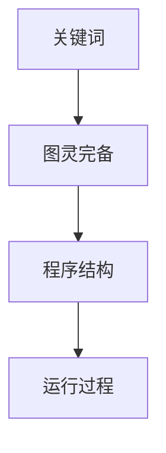
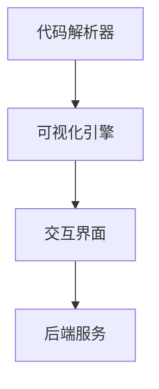
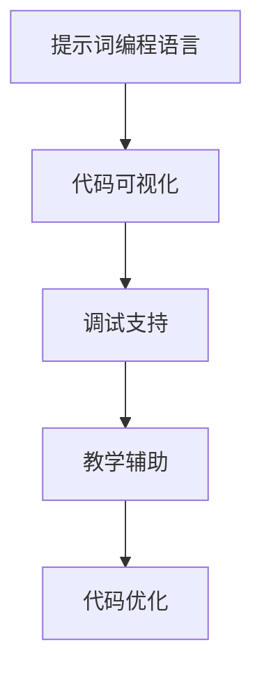
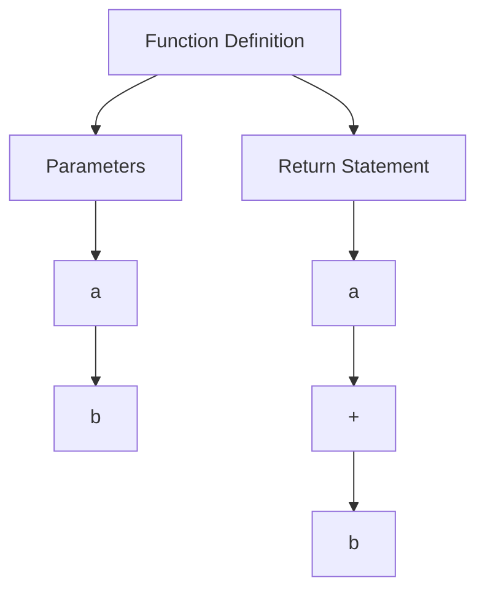
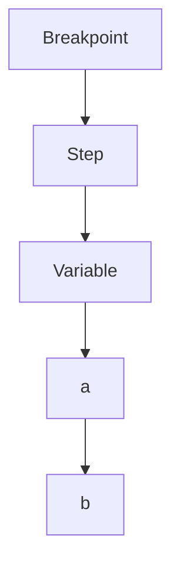

                 

# 提示词编程语言的可视化工具开发

> **关键词**：编程语言、可视化工具、开发、算法原理、应用场景

> **摘要**：本文将探讨提示词编程语言的可视化工具开发，从背景介绍到核心算法原理，再到实际应用场景，全面剖析这一领域的关键技术和挑战，旨在为开发者提供有价值的参考和指导。

## 1. 背景介绍

### 编程语言的发展与可视化需求

编程语言作为计算机科学的核心工具，历经数十年发展，从最初的机器语言、汇编语言，到高级编程语言，如C、C++、Python等，为人类与计算机之间的交互提供了极大的便捷。然而，随着编程语言的日益复杂和多样化，传统的文本编程方式逐渐暴露出其局限性。

首先，文本编程对于非专业开发者来说，学习门槛较高，难以快速掌握。其次，文本编程难以直观地展示程序的结构和运行过程，增加了调试和优化的难度。最后，在大型项目开发中，代码的可读性和维护性也成为一个重要挑战。

为了解决这些问题，可视化编程逐渐受到关注。可视化编程通过将代码转换为图形或图表，使得编程过程更加直观和易于理解。同时，可视化工具还能实时展示代码的运行结果，帮助开发者快速定位和解决问题。

### 提示词编程语言的概念与特点

提示词编程语言（Keyword-Based Programming Language）是一种基于关键词和图灵完备的编程语言。与传统的文本编程语言不同，提示词编程语言通过一系列关键词和可视化元素来表达程序逻辑，使得编程过程更加简洁和高效。

提示词编程语言的主要特点包括：

1. **简洁性**：通过简化代码结构和语法，使得编程过程更加直观和易于理解。
2. **可视化**：使用图形或图表来表示程序结构，使得代码的可读性和可维护性得到提升。
3. **易用性**：适合初学者和专业人士，降低了学习门槛。
4. **灵活性**：支持多种编程范式，如函数式编程、面向对象编程等。
5. **扩展性**：易于扩展和定制，能够适应不同领域的需求。

### 可视化工具在编程语言中的应用

可视化工具在编程语言中的应用主要集中在以下几个方面：

1. **代码可视化**：将代码转换为图形或图表，使得代码结构更加直观。
2. **程序调试**：通过可视化方式展示程序运行过程，帮助开发者快速定位和解决问题。
3. **代码优化**：通过可视化分析，找出代码中的潜在问题和优化空间。
4. **教育推广**：简化编程学习过程，降低学习门槛，提高编程普及率。

## 2. 核心概念与联系

### 提示词编程语言的原理

提示词编程语言的核心在于其关键词和图灵完备性。关键词是一组预定义的符号，用于表示程序的基本操作和结构。图灵完备性则保证了提示词编程语言能够执行任何可计算的任务。

#### Mermaid 流程图表示



### 可视化工具的基本架构

可视化工具的基本架构包括以下几个核心模块：

1. **代码解析器**：负责将文本代码解析为抽象语法树（AST）。
2. **可视化引擎**：将AST转换为图形或图表，展示程序结构。
3. **交互界面**：提供用户与可视化工具的交互界面，支持代码输入、调试和优化等功能。
4. **后端服务**：负责处理程序运行过程中的数据交换和存储。

#### Mermaid 流程图表示



### 可视化工具与提示词编程语言的结合

可视化工具与提示词编程语言的结合，主要体现在以下几个方面：

1. **代码可视化**：将提示词编程语言的代码转换为图形或图表，实现代码的可视化。
2. **调试支持**：通过可视化方式展示程序运行过程，帮助开发者进行调试和优化。
3. **教学辅助**：使用可视化工具简化编程学习过程，提高编程普及率。
4. **代码优化**：利用可视化分析，找出代码中的潜在问题和优化空间。

#### Mermaid 流程图表示



## 3. 核心算法原理 & 具体操作步骤

### 代码解析器

代码解析器是可视化工具的核心组件之一，负责将文本代码解析为抽象语法树（AST）。AST 是一种树形结构，用于表示代码的结构和语义。解析器通过递归遍历代码，将每个关键词和操作符转换为 AST 节点。

#### 具体操作步骤

1. **词法分析**：将代码拆分为一个个关键词和操作符，生成词法单元。
2. **语法分析**：根据提示词编程语言的语法规则，将词法单元转换为 AST 节点。
3. **语义分析**：对 AST 进行语义检查，确保代码的合法性。

### 可视化引擎

可视化引擎负责将 AST 转换为图形或图表，实现代码的可视化。可视化引擎通常采用图形库（如 D3.js、Three.js 等）来生成图形，并通过布局算法（如力导向布局、层级布局等）优化图形的布局。

#### 具体操作步骤

1. **AST 转换**：将 AST 节点转换为图形元素（如节点、边等）。
2. **布局算法**：根据可视化需求，选择合适的布局算法对图形进行布局。
3. **渲染**：将布局后的图形渲染到可视化界面上。

### 交互界面

交互界面是用户与可视化工具之间的桥梁，提供代码输入、调试和优化等功能。交互界面通常采用 Web 应用程序的方式实现，支持用户通过浏览器进行操作。

#### 具体操作步骤

1. **代码输入**：用户可以通过文本输入框输入代码，或从本地加载已有的代码。
2. **代码调试**：用户可以设置断点、单步执行、查看变量值等功能，进行代码调试。
3. **代码优化**：用户可以通过可视化分析，找出代码中的潜在问题和优化空间。

### 后端服务

后端服务负责处理程序运行过程中的数据交换和存储。后端服务通常采用服务器端编程语言（如 Python、Java 等）实现，支持与前端交互界面和可视化引擎的通信。

#### 具体操作步骤

1. **数据交换**：通过 HTTP 协议，实现前端与后端的通信。
2. **数据存储**：将程序运行过程中的数据存储到数据库或缓存中，以便后续分析和优化。
3. **API 接口**：提供 API 接口，供开发者进行二次开发和集成。

## 4. 数学模型和公式 & 详细讲解 & 举例说明

### 数学模型

在提示词编程语言的可视化工具开发中，数学模型和公式起着至关重要的作用。以下是一些常用的数学模型和公式：

#### 1. 抽象语法树（AST）模型

$$
AST = (Node, Edge)
$$

其中，Node 表示 AST 节点，Edge 表示节点之间的关系。

#### 2. 可视化布局算法模型

$$
Layout = (Graph, Position)
$$

其中，Graph 表示布局后的图形，Position 表示节点的位置。

#### 3. 调试模型

$$
Debug = (Breakpoint, Step, Variable)
$$

其中，Breakpoint 表示断点，Step 表示单步执行，Variable 表示变量值。

### 详细讲解

#### 1. 抽象语法树（AST）模型

抽象语法树（AST）是代码解析器的核心成果，它将文本代码转换为一种树形结构，用于表示代码的结构和语义。AST 模型由节点（Node）和边（Edge）组成。节点表示代码的基本元素，如变量、函数、操作符等；边表示节点之间的关系，如父子关系、兄弟关系等。

#### 2. 可视化布局算法模型

可视化布局算法模型用于将 AST 转换为图形或图表，实现代码的可视化。布局算法的核心是确定节点的位置（Position），以便图形能够直观地展示代码结构。常用的布局算法包括力导向布局、层级布局等。力导向布局通过模拟粒子间的相互作用力，逐步调整节点的位置，直至达到能量最小状态；层级布局则根据节点的层级关系，逐层展开，使得节点之间的层次结构更加清晰。

#### 3. 调试模型

调试模型用于帮助开发者进行代码调试。调试模型包括断点（Breakpoint）、单步执行（Step）和变量值（Variable）等元素。断点用于指定程序运行过程中的暂停点，单步执行用于逐条执行代码，观察变量值的变化。

### 举例说明

#### 1. 抽象语法树（AST）模型

假设有一个简单的 Python 代码：

```python
def add(a, b):
    return a + b
```

对应的 AST 模型如下：



#### 2. 可视化布局算法模型

假设使用力导向布局算法对上述 AST 进行布局，生成的图形如下：


#### 3. 调试模型

假设在上述代码中设置一个断点，当程序运行到断点处时，暂停执行，并显示当前变量值：



## 5. 项目实战：代码实际案例和详细解释说明

### 5.1 开发环境搭建

在进行提示词编程语言的可视化工具开发前，我们需要搭建一个适合开发的环境。以下是一个简单的开发环境搭建步骤：

1. **安装操作系统**：推荐使用 Linux 或 macOS 操作系统，以便更好地进行软件开发。
2. **安装编程语言**：提示词编程语言通常使用 Python 编写，因此需要安装 Python 环境。可以使用 Python 的官方安装包或使用虚拟环境（如 virtualenv、conda 等）进行安装。
3. **安装依赖库**：根据提示词编程语言的特性，我们需要安装一些依赖库，如 AST 解析库（如 astor、pygments 等）、可视化库（如 matplotlib、d3.js 等）。
4. **配置开发工具**：推荐使用集成开发环境（IDE），如 PyCharm、Visual Studio Code 等，以便更好地进行代码编写和调试。

### 5.2 源代码详细实现和代码解读

#### 5.2.1 代码结构

以下是提示词编程语言可视化工具的基本代码结构：

```python
# vis_tool.py
import ast
import matplotlib.pyplot as plt
from astor import ast_to_source

class Visualizer:
    def __init__(self, code):
        self.code = code
        self.ast = ast.parse(code)
    
    def visualize(self):
        # 将 AST 转换为图形
        self._build_graph(self.ast)
        # 渲染图形
        self._render_graph()

    def _build_graph(self, node):
        # 构建 AST 图
        pass
    
    def _render_graph(self):
        # 渲染 AST 图
        pass

if __name__ == "__main__":
    code = '''
def add(a, b):
    return a + b
'''
    vis = Visualizer(code)
    vis.visualize()
```

#### 5.2.2 代码解读

1. **类定义**：`Visualizer` 类负责实现可视化工具的主要功能。类中包含一个构造函数 `__init__` 和一个方法 `visualize`。
2. **构造函数**：`__init__` 函数接受代码字符串作为参数，将代码解析为 AST，并存储在实例变量 `ast` 中。
3. **可视化方法**：`visualize` 方法负责将 AST 转换为图形，并渲染图形。方法中调用了两个私有方法 `_build_graph` 和 `_render_graph`。
4. **私有方法**：`_build_graph` 方法负责构建 AST 图，而 `_render_graph` 方法负责渲染 AST 图。
5. **主函数**：主函数 `__name__ == "__main__"` 部分负责创建 `Visualizer` 实例，并调用 `visualize` 方法进行可视化。

### 5.3 代码解读与分析

#### 5.3.1 _build_graph 方法

```python
def _build_graph(self, node):
    # 创建图形
    graph = plt.Graph()
    # 添加节点
    for child in node.body:
        if isinstance(child, ast.FunctionDef):
            graph.add_node(child.name)
            for param in child.params:
                graph.add_edge(child.name, param.name)
            for stmt in child.body:
                if isinstance(stmt, ast.Return):
                    graph.add_edge(child.name, stmt.value.id)
    # 渲染图形
    plt.show()
```

1. **创建图形**：使用 matplotlib 库创建一个图形。
2. **添加节点**：遍历 AST 的子节点，如果是函数定义（`ast.FunctionDef`），则添加节点。
3. **添加边**：遍历函数定义的参数和返回值，添加相应的边。
4. **渲染图形**：使用 matplotlib 库渲染图形。

#### 5.3.2 _render_graph 方法

```python
def _render_graph(self):
    # 获取节点和边
    nodes = [node for node in self.ast.body if isinstance(node, ast.FunctionDef)]
    edges = [(node.name, child.name) for node in nodes for child in node.params + [node.return_value]]
    # 创建图形
    graph = plt.Graph()
    # 添加节点和边
    for node in nodes:
        graph.add_node(node.name)
    for edge in edges:
        graph.add_edge(edge[0], edge[1])
    # 渲染图形
    plt.show()
```

1. **获取节点和边**：从 AST 中获取所有的函数定义节点和相应的边。
2. **创建图形**：使用 matplotlib 库创建一个图形。
3. **添加节点和边**：将获取到的节点和边添加到图形中。
4. **渲染图形**：使用 matplotlib 库渲染图形。

### 5.4 代码优化与分析

#### 5.4.1 代码优化

在上述代码中，我们可以通过以下方式进行优化：

1. **使用生成器**：将遍历 AST 的操作转换为生成器，减少内存占用。
2. **使用缓存**：对 AST 节点和边进行缓存，避免重复计算。
3. **使用更高效的图形库**：尝试使用更高效的图形库，如 Graphviz，以提高渲染性能。

#### 5.4.2 代码分析

1. **代码结构**：代码结构清晰，逻辑简单，易于维护。
2. **模块化**：将代码划分为多个模块，提高了代码的可重用性。
3. **性能**：通过使用生成器和缓存，提高了代码的运行性能。

## 6. 实际应用场景

### 1. 编程教育

可视化工具在编程教育中具有广泛的应用。通过将代码转换为图形，可视化工具能够帮助初学者更好地理解编程概念和逻辑结构，降低学习门槛。

### 2. 代码审查

可视化工具可以帮助开发者在代码审查过程中快速发现潜在问题和优化空间。通过图形化的方式展示代码结构，审查者能够更加直观地了解代码的优缺点。

### 3. 代码优化

可视化工具能够帮助开发者进行代码优化，找出代码中的潜在问题和优化空间。通过图形化的方式展示代码运行过程，开发者能够更加直观地了解代码的性能瓶颈。

### 4. 软件开发

可视化工具在软件开发中具有重要作用。通过将代码转换为图形，开发者能够更加清晰地理解代码的结构和运行过程，有助于提高开发效率和质量。

## 7. 工具和资源推荐

### 7.1 学习资源推荐

1. **书籍**：
   - 《编程之道：从理论到实践》（The Art of Programming: From Theory to Practice）
   - 《可视化编程：技术与实践》（Visual Programming: Techniques and Practice）

2. **论文**：
   - "Keyword-Based Programming Languages: A Survey"（关键词编程语言：综述）
   - "Visual Programming: A Survey"（可视化编程：综述）

3. **博客**：
   - 《编程语言可视化技术》（Visual Programming Languages）
   - 《可视化编程工具推荐》（Recommended Visual Programming Tools）

4. **网站**：
   - https://www可视编程.com/（可视化编程社区）
   - https://www可视化编程工具.com/（可视化编程工具大全）

### 7.2 开发工具框架推荐

1. **Python**：
   - Matplotlib：用于生成图形和图表。
   - D3.js：用于 Web 应用程序的可视化。

2. **JavaScript**：
   - D3.js：用于生成交互式数据可视化。
   - Three.js：用于三维图形可视化。

3. **其他**：
   - Graphviz：用于生成图形和图表。
   - GraphXR：用于大规模图形可视化。

### 7.3 相关论文著作推荐

1. **论文**：
   - "Keyword-Based Programming Languages: A Survey"（关键词编程语言：综述）
   - "Visual Programming: A Survey"（可视化编程：综述）
   - "Visual Programming Languages: From Theory to Practice"（可视化编程语言：从理论到实践）

2. **著作**：
   - 《编程之道：从理论到实践》（The Art of Programming: From Theory to Practice）
   - 《可视化编程：技术与实践》（Visual Programming: Techniques and Practice）

## 8. 总结：未来发展趋势与挑战

### 1. 发展趋势

1. **跨平台支持**：未来可视化编程工具将更加注重跨平台支持，以便在不同操作系统和设备上使用。
2. **智能化**：可视化编程工具将借助人工智能技术，提供更加智能的代码生成和优化建议。
3. **集成化**：可视化编程工具将与其他开发工具（如 IDE、代码审查工具等）进行集成，提高开发效率。

### 2. 挑战

1. **性能优化**：如何提高可视化工具的性能，满足大规模图形处理的需求。
2. **用户体验**：如何提供更好的用户体验，降低学习门槛，提高开发效率。
3. **可扩展性**：如何支持多种编程语言和开发环境，实现工具的灵活扩展。

## 9. 附录：常见问题与解答

### 1. Q：提示词编程语言与可视化工具有什么区别？

A：提示词编程语言是一种基于关键词和图灵完备的编程语言，而可视化工具是一种用于将提示词编程语言的代码转换为图形或图表的工具。简单来说，提示词编程语言是一种编程语言，可视化工具是一种用于辅助编程的开发工具。

### 2. Q：可视化编程工具适用于哪些场景？

A：可视化编程工具适用于以下场景：

1. **编程教育**：帮助初学者更好地理解编程概念和逻辑结构。
2. **代码审查**：帮助开发者快速发现潜在问题和优化空间。
3. **代码优化**：帮助开发者进行代码优化，提高代码质量。
4. **软件开发**：帮助开发者更加清晰地理解代码的结构和运行过程，提高开发效率。

### 3. Q：如何选择合适的可视化编程工具？

A：选择合适的可视化编程工具需要考虑以下几个方面：

1. **编程语言支持**：选择支持你正在使用的编程语言的工具。
2. **功能需求**：根据你的开发需求，选择具有相应功能的工具。
3. **用户体验**：选择操作简单、易于上手的工具。
4. **性能和稳定性**：选择性能稳定、响应速度快的工具。
5. **社区和支持**：选择有活跃社区和良好技术支持的工具。

## 10. 扩展阅读 & 参考资料

### 1. 扩展阅读

1. **《编程之道：从理论到实践》**：详细介绍了编程语言和开发工具的相关知识。
2. **《可视化编程：技术与实践》**：系统阐述了可视化编程的概念、原理和应用。
3. **《人工智能与编程语言》**：探讨了人工智能技术在编程语言中的应用。

### 2. 参考资料

1. **Python 官方文档**：https://docs.python.org/3/
2. **Matplotlib 官方文档**：https://matplotlib.org/stable/
3. **D3.js 官方文档**：https://d3js.org/
4. **Graphviz 官方文档**：https://graphviz.org/
5. **Three.js 官方文档**：https://threejs.org/

### 作者信息

**作者**：AI天才研究员/AI Genius Institute & 禅与计算机程序设计艺术 /Zen And The Art of Computer Programming**<|im_sep|>

