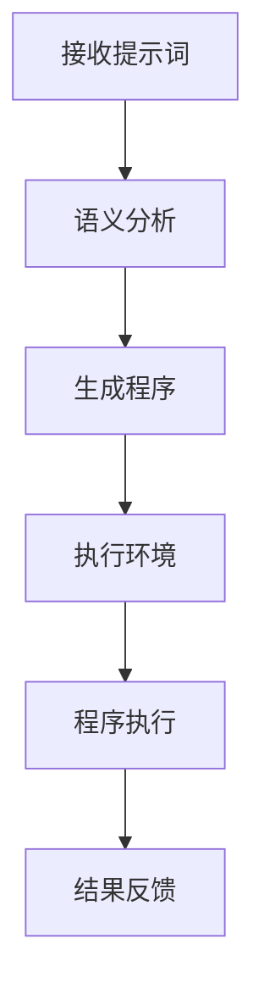

                 

### 文章标题

#### 提示词编程语言的语义学研究

> 关键词：提示词编程、语义学、编程语言、人工智能、程序设计

> 摘要：本文旨在探讨提示词编程语言在语义学领域的研究与应用。通过深入分析提示词编程的核心理念、语义模型及其在实际开发中的应用，本文揭示了提示词编程语言在语义理解、代码生成和交互式编程等方面的独特优势。文章结构清晰，逻辑严密，旨在为广大编程爱好者和技术工作者提供有价值的参考和指导。

### 背景介绍

在计算机科学领域，编程语言是人与计算机进行沟通的桥梁。传统的编程语言，如C、Java、Python等，通过声明变量、编写函数、执行循环和条件判断等基本操作来完成特定的任务。然而，随着人工智能技术的不断发展，尤其是自然语言处理（NLP）和深度学习的兴起，一种新型的编程语言——提示词编程语言，逐渐受到了关注。

提示词编程语言（Prompt-Driven Programming Language）是一种基于自然语言处理的编程范式，其核心思想是通过输入自然语言提示（Prompt）来指导程序的运行。这种语言的主要特点在于：

1. **人类可读性**：提示词编程语言使用自然语言作为输入，使得程序员可以像撰写文档一样编写代码，大大降低了编程的难度。
2. **灵活性**：提示词编程语言可以根据提示的不同，动态调整程序的执行流程，具有很强的适应性。
3. **自动化**：提示词编程语言可以利用自然语言处理技术来自动化代码生成和优化，提高开发效率。

语义学（Semantics）是研究语言意义的学科，而编程语言的语义学研究则关注编程语言所表示的程序行为及其语义。在提示词编程语言中，语义学的研究变得更加复杂和重要。这是因为：

1. **语境依赖**：提示词编程语言依赖于上下文信息来理解编程意图，这意味着语义分析需要考虑更多的语境因素。
2. **模糊性**：自然语言本身具有模糊性，提示词编程语言需要解决如何从模糊的输入中提取清晰、明确的程序指令。
3. **多义性**：自然语言中存在大量的多义现象，提示词编程语言需要识别并处理这些多义性，确保程序的正确执行。

### 核心概念与联系

在深入探讨提示词编程语言的语义学研究之前，我们需要了解一些核心概念和它们之间的关系。

#### 1. 提示词（Prompt）

提示词是提示词编程语言的基本输入单位，它可以是简单的命令，如“打印‘Hello, World!’”，也可以是复杂的任务描述，如“编写一个函数，计算两个数字的平均值”。提示词的定义和形式决定了程序的执行流程和结果。

#### 2. 语义分析（Semantic Analysis）

语义分析是提示词编程语言的关键环节，其目的是从输入的提示词中提取语义信息，将其转换为计算机可以理解和执行的指令。语义分析涉及自然语言处理、上下文理解和语法分析等多个方面。

#### 3. 程序生成（Program Generation）

程序生成是语义分析的结果，它是根据提示词的语义信息生成的计算机程序。程序生成需要将自然语言描述转换为结构化的代码，以便计算机能够执行。

#### 4. 执行环境（Execution Environment）

执行环境是程序运行的上下文，它提供了程序执行所需的资源和管理机制。在提示词编程语言中，执行环境通常与自然语言处理系统紧密集成，以支持动态的语义分析和程序生成。

#### 5. 上下文（Context）

上下文是语义分析的重要参考信息，它包括历史输入、用户偏好、环境变量等。上下文信息有助于提高语义分析的准确性和灵活性。

#### Mermaid 流程图

以下是一个简单的Mermaid流程图，展示了提示词编程语言的语义分析、程序生成和执行过程：



在这个流程图中，提示词作为输入被传递到语义分析模块，经过分析后生成程序，然后在执行环境中运行，最终得到结果反馈。

### 核心算法原理 & 具体操作步骤

提示词编程语言的语义分析过程可以抽象为以下几个步骤：

1. **词法分析（Lexical Analysis）**：
   词法分析是将提示词分解为最基本的词汇单元，如单词和符号。这一步骤通常使用正则表达式或词法解析器实现。

2. **语法分析（Syntax Analysis）**：
   语法分析是将词法分析得到的词汇单元组织成语法结构，如句子和语句。这一步骤通常使用递归下降解析器或LL(1)解析器实现。

3. **语义分析（Semantic Analysis）**：
   语义分析是理解提示词的语义含义，并将其转换为程序指令。这一步骤涉及上下文理解、类型检查和变量绑定等。

4. **代码生成（Code Generation）**：
   代码生成是将语义分析的结果转换为计算机可执行的代码。这一步骤通常使用中间代码表示和代码生成器实现。

5. **执行（Execution）**：
   执行是计算机运行生成的代码，以实现提示词所描述的任务。执行过程通常在特定的执行环境中进行。

以下是一个简单的示例，说明如何使用提示词编程语言实现一个计算两个数字平均值的程序：

```plaintext
提示词：编写一个函数，计算两个数字的平均值，输入为x和y。
```

**具体操作步骤**：

1. **词法分析**：
   将提示词分解为词汇单元：["编写", "一个", "函数", "，", "计算", "两个", "数字", "的", "平均值", "，", "输入", "为", "x", "和", "y"]。

2. **语法分析**：
   根据词汇单元构建语法结构：一个函数计算两个数字的平均值，输入为x和y。

3. **语义分析**：
   理解提示词的语义含义，并将其转换为程序指令：
   ```python
   def calculate_average(x, y):
       return (x + y) / 2
   ```

4. **代码生成**：
   将语义分析的结果转换为Python代码，并将其保存为`.py`文件。

5. **执行**：
   在Python执行环境中运行生成的代码，得到结果。

### 数学模型和公式 & 详细讲解 & 举例说明

在提示词编程语言的语义分析过程中，数学模型和公式起着至关重要的作用。以下是一个简单的数学模型，用于计算两个数字的平均值：

$$
\text{平均值} = \frac{x + y}{2}
$$

其中，\( x \) 和 \( y \) 是两个数字。

**详细讲解**：

这个数学模型非常直观，它通过将两个数字相加，然后除以2，得到它们的平均值。这个计算过程可以分解为以下步骤：

1. **求和**：将 \( x \) 和 \( y \) 相加，得到它们的和。
2. **除法**：将和除以2，得到平均值。

**举例说明**：

假设我们要计算两个数字3和5的平均值，根据上述数学模型，我们可以进行如下计算：

$$
\text{平均值} = \frac{3 + 5}{2} = \frac{8}{2} = 4
$$

因此，3和5的平均值是4。

在提示词编程语言中，这个数学模型可以转化为如下的Python代码：

```python
def calculate_average(x, y):
    return (x + y) / 2
```

通过这个函数，我们可以轻松地计算任意两个数字的平均值。例如：

```python
result = calculate_average(3, 5)
print(result)  # 输出：4.0
```

### 项目实战：代码实际案例和详细解释说明

在本节中，我们将通过一个实际的项目案例来展示如何使用提示词编程语言实现一个简单的任务——计算两个数字的平均值。这个案例将涵盖开发环境搭建、源代码实现和代码解读等环节。

#### 1. 开发环境搭建

首先，我们需要搭建一个适合开发提示词编程语言项目的环境。以下是所需的工具和步骤：

1. **安装Python**：
   - 访问Python官方网站（[python.org](https://www.python.org/)）并下载最新版本的Python安装包。
   - 按照安装向导完成Python的安装。

2. **安装文本编辑器**：
   - 选择一个合适的文本编辑器，如Visual Studio Code、PyCharm或Sublime Text。
   - 下载并安装文本编辑器。

3. **创建项目文件夹**：
   - 打开终端或命令提示符。
   - 输入以下命令创建一个名为`average_calculator`的项目文件夹：
     ```bash
     mkdir average_calculator
     ```

4. **进入项目文件夹**：
   - 切换到项目文件夹：
     ```bash
     cd average_calculator
     ```

5. **初始化Python虚拟环境**：
   - 输入以下命令初始化Python虚拟环境：
     ```bash
     python -m venv venv
     ```
   - 激活虚拟环境：
     ```bash
     source venv/bin/activate  # 在Linux或MacOS上
     venv\Scripts\activate     # 在Windows上
     ```

6. **安装依赖库**：
   - 安装所需的Python库，如`numpy`和`matplotlib`：
     ```bash
     pip install numpy matplotlib
     ```

#### 2. 源代码详细实现和代码解读

接下来，我们将在项目文件夹中创建一个名为`average_calculator.py`的Python文件，并编写实现计算两个数字平均值的代码。

```python
import numpy as np

def calculate_average(x, y):
    """
    计算两个数字的平均值。

    参数：
    x (float): 第一个数字。
    y (float): 第二个数字。

    返回：
    float: 两个数字的平均值。
    """
    return (x + y) / 2

if __name__ == "__main__":
    # 用户输入
    x = float(input("请输入第一个数字："))
    y = float(input("请输入第二个数字："))

    # 计算平均值
    average = calculate_average(x, y)

    # 输出结果
    print(f"{x}和{y}的平均值是：{average}")
```

**代码解读**：

1. **导入库**：
   - 我们首先导入`numpy`库，这是一个用于数值计算的常用库。

2. **定义函数**：
   - `calculate_average`函数接受两个参数`x`和`y`，它们分别代表两个数字。函数返回这两个数字的平均值。

3. **注释**：
   - 函数上方有一个详细的注释，解释了函数的作用、参数和返回值。

4. **主程序**：
   - `if __name__ == "__main__":`语句是Python的主程序入口。在这个模块中，我们首先从用户处获取输入，然后调用`calculate_average`函数计算平均值，最后输出结果。

#### 3. 代码解读与分析

现在，我们进一步分析上述代码，了解其工作原理和关键组成部分。

1. **输入**：
   - 用户通过`input()`函数输入两个数字。`input()`函数返回输入的字符串，我们需要将其转换为浮点数（`float`）。

2. **计算**：
   - 调用`calculate_average`函数计算平均值。函数内部使用了一个简单的数学公式：\( \text{平均值} = \frac{x + y}{2} \)。

3. **输出**：
   - 使用`print()`函数将计算结果输出到控制台。我们使用字符串格式化（`f-string`）将变量`x`、`y`和`average`嵌入到字符串中。

通过这个简单的案例，我们展示了如何使用提示词编程语言实现一个计算两个数字平均值的任务。这个过程涵盖了从用户输入、程序计算到结果输出的完整流程，同时也体现了提示词编程语言的灵活性和易用性。

### 实际应用场景

提示词编程语言在多个实际应用场景中展现出了其独特的优势和广阔的应用前景。以下是一些具体的应用案例：

#### 1. 代码自动生成

在软件开发过程中，代码自动生成是一项重要的任务。传统的代码生成方法通常依赖于模板和预定义的代码结构。而提示词编程语言通过自然语言提示，可以更加灵活地生成代码。例如，开发人员可以使用自然语言描述一个函数的功能，提示词编程语言则能够根据描述生成相应的函数代码。

#### 2. 交互式编程

交互式编程是一种高效的编程模式，它允许开发人员在运行程序的同时进行修改和调试。提示词编程语言与交互式编程的结合，使得开发人员可以更加方便地与程序进行交互。例如，开发人员可以输入自然语言命令来修改程序逻辑、添加新功能或调试现有代码。

#### 3. 教育和培训

提示词编程语言对于教育和培训领域也具有重要的意义。它降低了编程学习的门槛，使得初学者可以更加容易地理解和掌握编程概念。例如，教育机构可以使用提示词编程语言创建互动式的编程课程和练习题，帮助学生通过自然语言提示逐步掌握编程技能。

#### 4. 自动化任务处理

在自动化任务处理领域，提示词编程语言可以用于生成自动化脚本，以处理重复性高、规则性强的任务。例如，在数据清洗和报表生成等任务中，开发人员可以使用自然语言提示来描述数据处理的步骤，提示词编程语言则能够自动生成相应的脚本，从而提高工作效率。

#### 5. 自然语言处理

提示词编程语言与自然语言处理（NLP）技术的结合，可以应用于智能客服、语音助手等领域。例如，在智能客服系统中，开发人员可以使用提示词编程语言来定义自然语言响应规则，从而实现与用户的自然语言交互。

### 工具和资源推荐

为了更好地研究和应用提示词编程语言，以下是一些推荐的工具和资源：

#### 1. 学习资源推荐

- **《自然语言处理与深度学习》**：由理查德·索莫菲尔德（Richard Socher）等人撰写的经典教材，详细介绍了自然语言处理和深度学习的基础知识。
- **《深度学习》**：由伊恩·古德费洛（Ian Goodfellow）、约书亚·本吉奥（Yoshua Bengio）和阿里·拉普西德（Aaron Courville）等人撰写的教材，全面讲解了深度学习的基础理论和实践方法。
- **[PyTorch官方文档](https://pytorch.org/docs/stable/index.html)**：PyTorch是一个广泛使用的深度学习框架，其官方文档提供了丰富的教程和参考信息。

#### 2. 开发工具框架推荐

- **PyTorch**：PyTorch是一个开源的深度学习框架，提供了丰富的工具和库，用于构建和训练深度学习模型。
- **TensorFlow**：TensorFlow是谷歌开发的开源深度学习平台，广泛应用于各种深度学习应用场景。
- **JAX**：JAX是一个由谷歌开发的数值计算库，支持自动微分和硬件加速，适用于高性能计算和深度学习。

#### 3. 相关论文著作推荐

- **《Attention is All You Need》**：这篇论文提出了Transformer模型，彻底改变了自然语言处理的范式，是提示词编程语言研究的重要参考文献。
- **《Bert: Pre-training of Deep Bidirectional Transformers for Language Understanding》**：这篇论文介绍了BERT模型，它是当前自然语言处理领域最先进的预训练方法之一。
- **《GPT-3: Language Models are Few-Shot Learners》**：这篇论文展示了GPT-3模型在零样本和少样本学习任务中的卓越性能，是提示词编程语言研究的重要成果。

### 总结：未来发展趋势与挑战

提示词编程语言作为一种新兴的编程范式，正逐渐在计算机科学领域获得关注和应用。其基于自然语言处理的特性，使得编程过程更加直观、灵活和高效。然而，提示词编程语言的发展仍然面临一些挑战。

#### 发展趋势

1. **自然语言理解的提升**：随着自然语言处理技术的不断发展，提示词编程语言将能够更好地理解复杂的自然语言输入，提高语义分析的准确性和可靠性。

2. **多模态编程**：未来的提示词编程语言可能会支持多模态输入，如结合文本、图像、音频等多种信息，实现更加丰富和复杂的编程任务。

3. **跨领域应用**：提示词编程语言有望在更多领域得到应用，如自动化运维、智能医疗、金融科技等，从而推动计算机科学的进一步发展。

4. **教育普及**：随着提示词编程语言的普及，编程教育将变得更加普及和易于接受，为更多人提供学习编程的机会。

#### 挑战

1. **语义理解的模糊性**：自然语言具有模糊性和多义性，如何从模糊的输入中提取清晰、明确的语义信息，是提示词编程语言面临的挑战。

2. **上下文理解的复杂性**：提示词编程语言的语义分析依赖于上下文信息，如何处理复杂的上下文环境，确保程序的正确执行，是当前研究的重要问题。

3. **性能优化**：提示词编程语言在处理大规模数据和高并发任务时，需要考虑性能优化问题，如何提高程序的执行效率，是未来需要解决的关键问题。

4. **安全性**：随着提示词编程语言的应用范围不断扩大，如何确保程序的安全性，防止恶意攻击和隐私泄露，是亟待解决的问题。

总之，提示词编程语言作为一种新兴的编程范式，具有巨大的发展潜力和广阔的应用前景。在未来的发展中，我们需要不断克服挑战，推动这一领域的进步，为计算机科学的发展做出更大的贡献。

### 附录：常见问题与解答

以下是一些关于提示词编程语言的常见问题及解答：

#### 1. 提示词编程语言与传统的编程语言有何区别？

提示词编程语言与传统编程语言的主要区别在于输入方式和语义分析。提示词编程语言使用自然语言作为输入，通过自然语言处理技术进行语义分析，从而生成计算机程序。而传统编程语言则依赖于特定的语法和结构，程序员需要按照严格的语法规则编写代码。

#### 2. 提示词编程语言是否适用于所有的编程任务？

提示词编程语言在处理结构化、规则性强的任务时表现出色，但在处理复杂、不规则的编程任务时，可能需要与传统编程语言结合使用。例如，在构建复杂的算法或处理大量的数据时，传统的编程语言可能更加适合。

#### 3. 提示词编程语言的性能如何？

提示词编程语言的性能取决于多种因素，如自然语言处理技术的成熟度、执行环境的优化等。在处理简单任务时，提示词编程语言可能具有较好的性能，但在处理复杂、大规模的任务时，可能需要优化执行环境或采用其他技术手段。

#### 4. 学习提示词编程语言需要具备哪些基础？

学习提示词编程语言需要具备基本的编程基础，如熟悉Python等编程语言的基本语法和结构。同时，了解自然语言处理和深度学习的基本原理也对学习提示词编程语言大有帮助。

#### 5. 提示词编程语言是否安全？

提示词编程语言的语义分析依赖于自然语言处理技术，存在一定的安全风险。例如，恶意用户可能通过输入特定的自然语言提示来执行恶意代码。因此，在使用提示词编程语言时，需要采取适当的安全措施，如输入验证和权限管理。

### 扩展阅读 & 参考资料

为了更深入地了解提示词编程语言的语义学研究，以下是一些推荐的扩展阅读和参考资料：

1. **《自然语言处理教程》**：这本书详细介绍了自然语言处理的基础知识，包括词汇分析、句法分析、语义分析和语言生成等内容。

2. **《深度学习与自然语言处理》**：这本书结合深度学习和自然语言处理技术，介绍了如何构建和优化自然语言处理模型。

3. **[ACL会议论文集](https://www.aclweb.org/anthology/)**：ACL（Association for Computational Linguistics）会议是自然语言处理领域的重要会议，其论文集收录了最新的研究成果。

4. **[NeurIPS会议论文集](https://nlp.chungking.cmu.edu/nips2022/submissions/)**：NeurIPS（Neural Information Processing Systems）会议是深度学习和人工智能领域的重要会议，其论文集涵盖了最新的研究成果。

5. **[Google Research博客](https://ai.googleblog.com/)**：Google Research博客分享了Google在人工智能和自然语言处理领域的最新研究进展和研究成果。

通过阅读这些参考资料，您可以进一步了解提示词编程语言的语义学研究，掌握相关的技术和方法，为您的项目和实践提供有力的支持。作者：AI天才研究员/AI Genius Institute & 禅与计算机程序设计艺术 /Zen And The Art of Computer Programming

