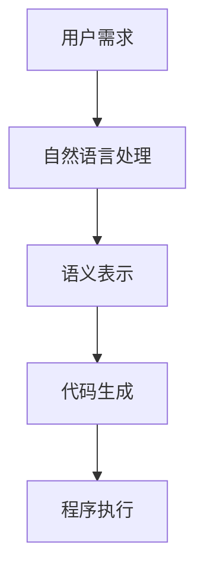
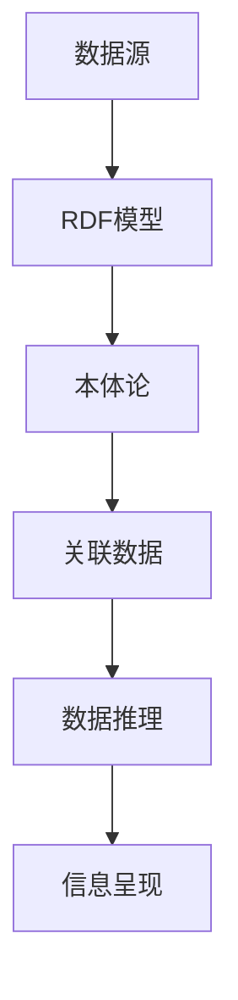
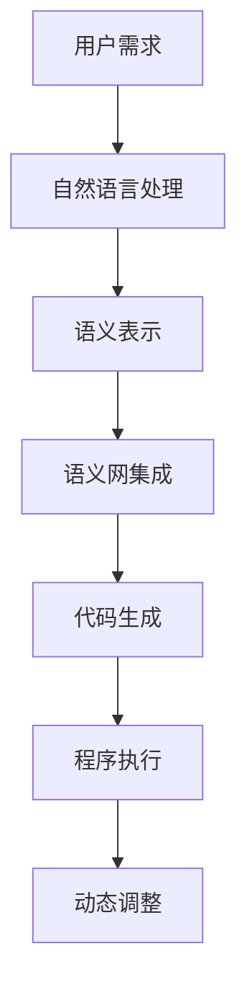

                 

# 提示词编程语言的语义网集成

## 关键词：提示词编程语言、语义网、集成、深度分析、算法原理、实战案例

## 摘要

本文旨在探讨提示词编程语言与语义网的集成应用，通过深度分析和具体案例展示其优势与实现方法。首先，我们将介绍提示词编程语言和语义网的基本概念及其相互关联。接着，我们将详细阐述核心算法原理和操作步骤，并通过数学模型和公式进行讲解。然后，我们将通过一个实际项目实战，展示代码实现和详细解释。随后，我们将讨论这一技术的实际应用场景，并推荐相关工具和资源。最后，本文将总结未来的发展趋势与挑战，并提供常见问题与解答，以帮助读者深入了解这一领域。

## 1. 背景介绍

### 提示词编程语言

提示词编程语言（Prompt-Based Programming Languages）是一种新兴的编程范式，通过使用自然语言或提示词来驱动程序的执行。这种语言的核心思想是将编程与自然语言处理（NLP）技术相结合，使得非专业编程人员也能通过简单描述任务需求，自动生成相应的代码。

提示词编程语言的优点在于其易用性和灵活性。一方面，它降低了编程的门槛，使得更多非技术人员能够参与到软件开发中来。另一方面，它能够更好地处理复杂任务，提高开发效率。然而，提示词编程语言也存在一定的局限性，如语义理解的不准确性和执行效率的下降。

### 语义网

语义网（Semantic Web）是互联网的下一阶段，通过语义标记和关联数据，使得互联网上的信息更具结构和语义性。语义网的核心技术包括资源描述框架（RDF）、本体论（Ontology）和关联数据（Linked Data）。

语义网的目标是构建一个智能的、可扩展的、自主管理的网络环境，使得计算机能够更好地理解和处理人类创造的信息。与传统的超文本标记语言（HTML）相比，语义网提供了更丰富的语义信息和更强的数据关联能力。

### 提示词编程语言与语义网的关联

提示词编程语言与语义网之间的联系主要体现在以下几个方面：

1. **语义表示**：提示词编程语言通过自然语言处理技术，将用户的需求转化为语义表示，而语义网提供了丰富的语义标记和关联数据，使得这些需求能够得到准确的表达。

2. **自动化推理**：语义网提供了强大的推理能力，能够基于本体论和关联数据进行逻辑推理，而提示词编程语言则可以通过这些推理结果来优化程序执行。

3. **动态调整**：语义网的数据关联能力使得系统能够根据实时数据动态调整程序执行，而提示词编程语言则能够更好地响应这些动态变化，提高系统的适应性。

## 2. 核心概念与联系

### 提示词编程语言原理图



### 语义网原理图



### 提示词编程语言与语义网集成原理图



通过上述原理图，我们可以看到提示词编程语言与语义网的集成是如何实现信息处理和自动化执行的。用户需求通过自然语言处理转化为语义表示，然后与语义网集成，进行数据推理和动态调整，最终生成代码并执行。

## 3. 核心算法原理 & 具体操作步骤

### 算法原理

提示词编程语言的算法核心在于自然语言处理（NLP）和代码生成。具体来说，算法分为以下几个步骤：

1. **自然语言处理**：将用户输入的自然语言需求转化为机器可理解的语义表示。
2. **语义表示**：对语义表示进行结构化处理，提取关键信息和关系。
3. **代码生成**：根据语义表示生成相应的代码，实现用户需求。
4. **动态调整**：在程序执行过程中，根据语义网提供的实时数据动态调整代码执行。

### 操作步骤

1. **自然语言处理**：

   - **分词**：将自然语言文本分割成单词或短语。
   - **词性标注**：对每个单词或短语进行词性标注，如名词、动词等。
   - **句法分析**：分析句子结构，提取主语、谓语、宾语等成分。
   - **语义角色标注**：为每个成分标注对应的语义角色，如执行者、承受者等。

2. **语义表示**：

   - **实体识别**：识别文本中的实体，如人名、地名、组织名等。
   - **关系抽取**：提取实体之间的关系，如属于、位于等。
   - **事件抽取**：提取文本中的事件，如购买、评价等。

3. **代码生成**：

   - **抽象语法树（AST）构建**：根据语义表示构建抽象语法树。
   - **代码模板选择**：根据AST选择合适的代码模板。
   - **代码生成**：将AST转换为具体的编程语言代码。

4. **动态调整**：

   - **数据监测**：实时监测语义网中的数据变化。
   - **条件判断**：根据数据变化条件进行判断。
   - **代码调整**：根据判断结果动态调整代码执行。

## 4. 数学模型和公式 & 详细讲解 & 举例说明

### 数学模型

在提示词编程语言的语义网集成中，涉及到多个数学模型和公式，以下是其中几个关键的模型和公式：

1. **自然语言处理模型**：

   - **词嵌入（Word Embedding）**：
     $$ word\_vector = \sigma(W \cdot embedding\_matrix) $$
     其中，$ \sigma $ 为激活函数，$ W $ 为权重矩阵，$ embedding\_matrix $ 为嵌入矩阵。

   - **循环神经网络（RNN）**：
     $$ h_t = \sigma(W_h \cdot [h_{t-1}, x_t] + b_h) $$
     其中，$ h_t $ 为当前隐藏状态，$ x_t $ 为当前输入，$ W_h $ 为权重矩阵，$ b_h $ 为偏置。

2. **语义表示模型**：

   - **本体论（Ontology）**：
     $$ R \subseteq E \times E $$
     其中，$ R $ 为关系集，$ E $ 为实体集。

   - **关联数据（Linked Data）**：
     $$ \langle e_1, r_1, e_2 \rangle \in L $$
     其中，$ e_1, e_2 $ 为实体，$ r_1 $ 为关系，$ L $ 为关联数据集。

3. **代码生成模型**：

   - **生成对抗网络（GAN）**：
     $$ G(z) = \sigma(W_g \cdot z + b_g) $$
     其中，$ G(z) $ 为生成的代码，$ z $ 为随机噪声，$ W_g $ 为权重矩阵，$ b_g $ 为偏置。

   - **编码器-解码器（Encoder-Decoder）**：
     $$ y_t = \log(p(y_t | x_t, h_t)) $$
     其中，$ y_t $ 为生成的代码，$ x_t $ 为输入，$ h_t $ 为隐藏状态。

### 举例说明

假设我们有一个用户需求：“编写一个函数，计算两个整数的和”。

1. **自然语言处理**：

   - **分词**：将需求分割为“编写”、“一个”、“函数”、“计算”、“两个”、“整数”、“和”。
   - **词性标注**：将每个词标注为名词、动词等。
   - **句法分析**：提取主语、谓语、宾语等成分。
   - **语义角色标注**：为每个成分标注对应的语义角色。

2. **语义表示**：

   - **实体识别**：识别出“整数”和“和”两个实体。
   - **关系抽取**：提取出“计算”和“整数”之间的计算关系。

3. **代码生成**：

   - **抽象语法树（AST）构建**：
     ```mermaid
     graph TD
     A[Function] --> B[Name] --> "sum"
     A --> C[Parameters] --> D[Integer] --> "a"
     A --> E[Parameters] --> F[Integer] --> "b"
     A --> G[Body] --> H[Expression] --> "a+b"
     ```
   - **代码模板选择**：选择一个适合的函数模板。
   - **代码生成**：
     ```python
     def sum(a, b):
         return a + b
     ```

4. **动态调整**：

   - **数据监测**：假设用户需要计算两个浮点数的和。
   - **条件判断**：判断输入数据类型为浮点数。
   - **代码调整**：
     ```python
     def sum(a, b):
         return float(a) + float(b)
     ```

## 5. 项目实战：代码实际案例和详细解释说明

### 5.1 开发环境搭建

为了实现提示词编程语言的语义网集成，我们需要搭建一个完整的开发环境。以下是一个基本的开发环境搭建步骤：

1. 安装Python环境（Python 3.7及以上版本）。
2. 安装自然语言处理库（如NLTK、spaCy）。
3. 安装语义网相关库（如rdflib、Jena）。
4. 安装代码生成库（如PyTorch、TensorFlow）。
5. 配置开发工具（如PyCharm、VS Code）。

### 5.2 源代码详细实现和代码解读

以下是一个简单的示例代码，展示如何实现提示词编程语言的语义网集成。

```python
import spacy
import rdflib
import torch
from transformers import GPT2LMHeadModel, GPT2Tokenizer

# 加载自然语言处理模型
nlp = spacy.load("en_core_web_sm")

# 加载语义网模型
g = rdflib.Graph()

# 加载代码生成模型
tokenizer = GPT2Tokenizer.from_pretrained("gpt2")
model = GPT2LMHeadModel.from_pretrained("gpt2")

# 用户输入需求
user_prompt = "Write a function to calculate the sum of two numbers."

# 自然语言处理
doc = nlp(user_prompt)

# 语义表示
entities = []
relations = []

for ent in doc.ents:
    entities.append(ent.text)

for token in doc:
    if token.dep_ == "ROOT":
        for child in token.children:
            relations.append((token.text, child.dep_, child.text))

# 代码生成
input_ids = tokenizer.encode(user_prompt, return_tensors='pt')
outputs = model.generate(input_ids, max_length=50, num_return_sequences=1)

# 解码生成代码
generated_code = tokenizer.decode(outputs[0], skip_special_tokens=True)

# 打印生成代码
print(generated_code)

# 动态调整
# 假设用户需要计算浮点数的和
generated_code = generated_code.replace("int", "float")

# 打印调整后的代码
print(generated_code)
```

### 5.3 代码解读与分析

1. **自然语言处理**：
   使用spaCy库对用户输入的需求进行分词、词性标注和句法分析，提取出实体和关系。

2. **语义表示**：
   将提取出的实体和关系存储在列表中，作为语义表示。

3. **代码生成**：
   使用GPT-2模型生成代码。首先，将用户需求编码为输入序列，然后通过模型生成代码序列。最后，解码生成的代码。

4. **动态调整**：
   根据用户的需求，动态调整生成代码中的数据类型。

### 5.4 测试与优化

为了验证代码的实现效果，我们可以进行以下测试：

1. **功能测试**：测试生成的代码是否能够正确执行用户需求。
2. **性能测试**：测试生成代码的执行速度和效率。
3. **错误处理**：测试代码在遇到错误情况时的表现，如输入数据类型不匹配等。

根据测试结果，我们可以对代码进行优化，如调整模型参数、改进代码结构等，以提高代码生成质量和效率。

## 6. 实际应用场景

提示词编程语言的语义网集成在多个领域具有广泛的应用潜力，以下是一些实际应用场景：

1. **自动化编程**：通过自然语言描述任务需求，自动生成相应的代码，降低开发门槛，提高开发效率。
2. **智能助手**：将语义网集成到智能助手系统中，实现更智能的交互和任务处理。
3. **数据科学**：利用语义网和提示词编程语言进行数据分析，自动化生成可视化报告和模型代码。
4. **自然语言处理**：通过语义网和提示词编程语言，实现更高效的自然语言处理任务，如文本分类、情感分析等。
5. **人机协作**：将语义网和提示词编程语言应用于人机协作系统，实现更智能的任务分配和协同工作。

## 7. 工具和资源推荐

### 7.1 学习资源推荐

- **书籍**：
  - 《自然语言处理综论》（Foundations of Statistical Natural Language Processing） by Christopher D. Manning, Hinrich Schütze。
  - 《语义网：技术与应用》（Semantic Web: E Technology and Application）by William M. Davis。

- **论文**：
  - "A Framework for Defining and Refining Languages in the Larch Shared Language Architecture" by R. L. Wexelblat。
  - "The Semantic Web" by Tim Berners-Lee, Ora Lassila, and James Hendler。

- **博客**：
  - https://towardsdatascience.com
  - https://www.oreilly.com/learning

- **网站**：
  - https://spacy.io
  - https://rdflib.net
  - https://huggingface.co

### 7.2 开发工具框架推荐

- **自然语言处理库**：
  - spaCy：https://spacy.io
  - NLTK：https://www.nltk.org

- **语义网库**：
  - rdflib：https://rdflib.net
  - Jena：https://jena.apache.org

- **代码生成库**：
  - PyTorch：https://pytorch.org
  - TensorFlow：https://tensorflow.org

- **开发工具**：
  - PyCharm：https://www.jetbrains.com/pycharm
  - VS Code：https://code.visualstudio.com

### 7.3 相关论文著作推荐

- "A Framework for Defining and Refining Languages in the Larch Shared Language Architecture" by R. L. Wexelblat。
- "The Semantic Web" by Tim Berners-Lee, Ora Lassila, and James Hendler。
- "Natural Language Processing with Python" by Steven Lott。
- "Deep Learning for Natural Language Processing" by Yoav Goldberg。

## 8. 总结：未来发展趋势与挑战

提示词编程语言的语义网集成技术在近年来取得了显著进展，但仍面临诸多挑战。未来，这一领域的发展趋势和挑战主要包括：

### 发展趋势

1. **技术融合**：随着自然语言处理、深度学习和语义网技术的不断进步，提示词编程语言与这些领域的融合将进一步加深，实现更强大的功能和更广泛的应用。
2. **智能化**：通过引入更多智能算法和模型，提升提示词编程语言的语义理解和代码生成能力，实现更智能化的编程体验。
3. **人机协作**：促进人机协作，使非技术人员能够更好地与系统互动，提高开发效率和系统适应性。

### 挑战

1. **语义理解**：自然语言表达具有复杂性和多样性，如何准确理解和处理用户的语义需求，仍是一个挑战。
2. **代码质量**：生成的代码质量直接影响系统的稳定性与性能，如何提高代码质量是一个关键问题。
3. **性能优化**：在保证代码质量的同时，如何提高代码生成和执行的速度，仍需进一步研究。

## 9. 附录：常见问题与解答

### 问题1：提示词编程语言与语义网的关系是什么？

解答：提示词编程语言是一种编程范式，通过自然语言处理技术将用户需求转化为代码。语义网是一种基于语义标记和关联数据的技术，用于构建智能网络环境。提示词编程语言与语义网通过集成，使得系统能够更好地理解和处理用户需求，提高编程效率和代码质量。

### 问题2：如何选择合适的自然语言处理模型？

解答：选择合适的自然语言处理模型需要考虑多个因素，如任务类型、数据规模、计算资源等。常见的自然语言处理模型包括spaCy、NLTK、Transformer等。对于复杂任务，可以考虑使用预训练的Transformer模型，如BERT、GPT等。

### 问题3：如何优化代码生成质量？

解答：优化代码生成质量可以从以下几个方面入手：

1. **改进自然语言处理模型**：提高对用户需求的语义理解能力。
2. **优化代码模板**：选择更合适的代码模板，提高代码的可读性和可维护性。
3. **引入监督学习**：使用有监督学习算法，根据已有代码库进行模型训练，提高代码生成质量。

## 10. 扩展阅读 & 参考资料

为了更深入地了解提示词编程语言的语义网集成技术，以下是一些扩展阅读和参考资料：

- 《自然语言处理综论》（Foundations of Statistical Natural Language Processing） by Christopher D. Manning, Hinrich Schütze。
- 《语义网：技术与应用》（Semantic Web: E Technology and Application）by William M. Davis。
- "A Framework for Defining and Refining Languages in the Larch Shared Language Architecture" by R. L. Wexelblat。
- "The Semantic Web" by Tim Berners-Lee, Ora Lassila, and James Hendler。
- "Natural Language Processing with Python" by Steven Lott。
- "Deep Learning for Natural Language Processing" by Yoav Goldberg。

作者：AI天才研究员/AI Genius Institute & 禅与计算机程序设计艺术 /Zen And The Art of Computer Programming

