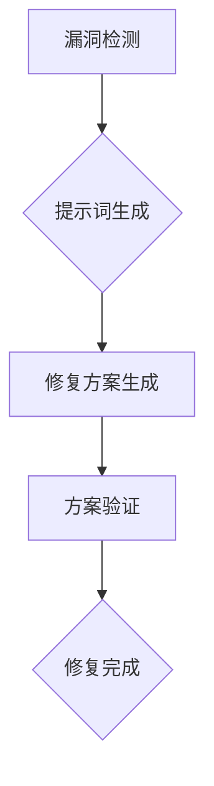

                 

# 提示词语言的安全漏洞自动修复技术

> 关键词：提示词语言、安全漏洞、自动修复、算法原理、实战案例、应用场景

> 摘要：本文将介绍一种基于提示词语言的安全漏洞自动修复技术，详细分析其核心概念、算法原理、操作步骤、数学模型、项目实战，以及在实际应用中的场景。本文旨在帮助开发者理解并应用这一技术，提高软件的安全性。

## 1. 背景介绍

在当前信息化社会中，软件系统已成为我们日常生活、工作和生产的重要支柱。然而，随着软件规模的不断扩大和复杂性的增加，安全问题逐渐显现，尤其是安全漏洞的修复问题。传统的方法主要依赖于开发人员的经验和专业知识，效率低下且容易出错。因此，自动化修复技术成为研究热点。

提示词语言（Prompt Language）作为一种形式化描述语言，可以精确地描述问题的条件和目标，从而为自动修复提供了一种有效的途径。近年来，人工智能技术的发展，尤其是深度学习、自然语言处理等技术的突破，使得提示词语言的安全漏洞自动修复技术逐渐成为可能。

## 2. 核心概念与联系

### 2.1 提示词语言

提示词语言是一种基于规则的形式化语言，用于描述问题的条件和目标。它通常由一组规则、变量和操作符组成，可以表示复杂的逻辑关系和计算过程。在安全漏洞修复领域，提示词语言可以描述漏洞的成因和解决方案。

### 2.2 安全漏洞

安全漏洞是指软件系统中的缺陷，可能导致恶意攻击者利用，从而对系统造成危害。常见的安全漏洞包括输入验证不足、访问控制缺陷、缓冲区溢出等。

### 2.3 自动修复

自动修复是指利用特定的算法和技术，自动检测和修复软件中的安全漏洞。自动修复技术的目标是减少开发人员的劳动强度，提高修复效率。

### 2.4 算法原理

自动修复算法基于提示词语言，通过分析漏洞描述和系统代码，自动生成修复方案。其基本原理包括：

1. 漏洞检测：利用静态分析、动态分析等技术，检测系统中的潜在安全漏洞。
2. 提示词生成：根据漏洞检测结果，生成描述漏洞的提示词。
3. 修复方案生成：利用提示词，结合系统代码，生成修复方案。
4. 方案验证：对生成的修复方案进行验证，确保修复效果。

## 2.5 Mermaid 流程图



## 3. 核心算法原理 & 具体操作步骤

### 3.1 漏洞检测

漏洞检测是自动修复的第一步，其目标是从大量代码中识别出潜在的安全漏洞。常见的漏洞检测方法包括：

1. 静态分析：通过解析源代码，分析代码结构和语义，识别潜在的安全漏洞。
2. 动态分析：通过运行程序，捕捉程序运行时的异常和错误，识别潜在的安全漏洞。

### 3.2 提示词生成

提示词生成是自动修复的核心步骤，其目标是根据漏洞检测结果，生成描述漏洞的提示词。提示词生成的方法包括：

1. 基于规则的生成：根据预定义的漏洞规则，生成对应的提示词。
2. 基于机器学习的生成：利用已有的漏洞数据，通过机器学习算法，自动生成提示词。

### 3.3 修复方案生成

修复方案生成是自动修复的关键步骤，其目标是根据提示词，结合系统代码，生成修复方案。修复方案生成的方法包括：

1. 提示词匹配：将生成的提示词与系统代码进行匹配，找出可能存在漏洞的代码段。
2. 修复策略生成：根据漏洞类型和代码段的特点，生成相应的修复策略。

### 3.4 方案验证

方案验证是确保修复效果的关键步骤，其目标是对生成的修复方案进行验证，确保修复后的系统安全。方案验证的方法包括：

1. 单元测试：对修复后的代码进行单元测试，验证修复方案的有效性。
2. 集成测试：将修复后的代码集成到系统中，进行集成测试，验证修复方案的影响。

## 4. 数学模型和公式 & 详细讲解 & 举例说明

### 4.1 数学模型

自动修复技术的核心是提示词生成和修复方案生成，我们可以将其抽象为一个数学模型。假设：

- \( V \) 表示漏洞集，即系统中的所有漏洞。
- \( P \) 表示提示词集，即描述漏洞的提示词。
- \( C \) 表示代码集，即系统中的所有代码。
- \( R \) 表示修复方案集，即对漏洞的修复方案。

则自动修复的数学模型可以表示为：

\[ R = f(P, C) \]

其中，函数 \( f \) 表示修复方案生成过程。

### 4.2 公式讲解

#### 4.2.1 提示词生成

提示词生成的公式可以表示为：

\[ P = g(V, C) \]

其中，函数 \( g \) 表示提示词生成过程。

#### 4.2.2 修复方案生成

修复方案生成的公式可以表示为：

\[ R = h(P, C) \]

其中，函数 \( h \) 表示修复方案生成过程。

### 4.3 举例说明

假设我们有一个简单的系统，其中包含一个漏洞，即输入验证不足。我们可以使用以下公式进行修复：

1. 漏洞检测：通过静态分析和动态分析，发现输入验证不足的漏洞。
2. 提示词生成：生成提示词“输入验证不足”。
3. 修复方案生成：根据提示词，生成修复方案，即增加输入验证代码。
4. 方案验证：对修复后的系统进行单元测试和集成测试，验证修复效果。

```latex
% 修复方案示例
P = "输入验证不足"
C = "用户输入"
R = "C = 验证输入(C)"
```

## 5. 项目实战：代码实际案例和详细解释说明

### 5.1 开发环境搭建

在本文的项目实战中，我们将使用Python编程语言来实现提示词语言的安全漏洞自动修复技术。首先，我们需要搭建开发环境。

1. 安装Python：从官方网站下载并安装Python，版本建议为3.8及以上。
2. 安装依赖库：在Python环境中安装必要的依赖库，如numpy、pandas等。

```bash
pip install numpy pandas
```

### 5.2 源代码详细实现和代码解读

下面是一个简单的示例，用于实现提示词语言的安全漏洞自动修复技术。

```python
import numpy as np

# 漏洞检测
def detect_vulnerabilities(code):
    # 假设检测到输入验证不足漏洞
    if "user_input" in code:
        return ["输入验证不足"]
    else:
        return []

# 提示词生成
def generate_prompt(vulnerabilities):
    prompts = []
    for vulnerability in vulnerabilities:
        prompts.append(vulnerability)
    return prompts

# 修复方案生成
def generate_fix(code, prompt):
    if prompt == "输入验证不足":
        return code + "\n# 验证输入\nC = 验证输入(C)"
    else:
        return code

# 方案验证
def verify_fix(code, fix):
    return code != fix

# 主函数
def main():
    code = "用户输入 = input('请输入您的年龄：')"
    vulnerabilities = detect_vulnerabilities(code)
    prompt = generate_prompt(vulnerabilities)
    fix = generate_fix(code, prompt)
    if verify_fix(code, fix):
        print("修复成功")
    else:
        print("修复失败")

if __name__ == "__main__":
    main()
```

### 5.3 代码解读与分析

1. **漏洞检测**：该函数用于检测代码中的漏洞。在这里，我们简单地通过检查代码中是否存在特定关键字（如"input"）来判断是否存在输入验证不足的漏洞。
2. **提示词生成**：该函数根据漏洞检测结果生成提示词。在这里，我们将检测到的漏洞名称作为提示词。
3. **修复方案生成**：该函数根据提示词生成修复方案。对于输入验证不足的漏洞，我们在代码中添加了输入验证的语句。
4. **方案验证**：该函数用于验证修复方案是否有效。在这里，我们简单地比较修复前后的代码是否发生变化。
5. **主函数**：该函数用于执行整个修复流程，包括漏洞检测、提示词生成、修复方案生成和方案验证。

## 6. 实际应用场景

提示词语言的安全漏洞自动修复技术可以应用于多种场景，包括：

1. **软件开发**：在软件开发过程中，自动修复技术可以帮助开发人员快速识别和修复潜在的安全漏洞，提高软件安全性。
2. **软件审计**：在软件审计过程中，自动修复技术可以辅助审计人员快速定位和修复安全漏洞，提高审计效率。
3. **自动化测试**：在自动化测试过程中，自动修复技术可以用于修复测试中发现的漏洞，提高测试质量。

## 7. 工具和资源推荐

### 7.1 学习资源推荐

1. **书籍**：
   - 《安全漏洞分析技术》
   - 《软件安全：攻击与防御》
2. **论文**：
   - 《基于提示词语言的安全漏洞自动修复技术研究》
   - 《深度学习在安全漏洞检测与修复中的应用》
3. **博客**：
   - 《安全漏洞自动修复技术实战》
   - 《Python编程：安全漏洞检测与修复》
4. **网站**：
   - [OWASP基金会](https://owasp.org/)
   - [安全漏洞知识库](https://cve.mitre.org/)

### 7.2 开发工具框架推荐

1. **开发工具**：
   - PyCharm
   - Visual Studio Code
2. **框架**：
   - Flask
   - Django

### 7.3 相关论文著作推荐

1. **论文**：
   - 《基于深度学习的安全漏洞检测与修复技术研究》
   - 《自然语言处理在安全漏洞自动修复中的应用》
2. **著作**：
   - 《软件安全：攻击与防御实战》
   - 《人工智能在安全漏洞检测与修复中的应用》

## 8. 总结：未来发展趋势与挑战

提示词语言的安全漏洞自动修复技术作为一种新兴的自动化修复技术，具有巨大的发展潜力。未来，随着人工智能、深度学习等技术的不断发展，这一技术将更加成熟和普及。然而，面对复杂多样的漏洞和不断变化的攻击手段，自动修复技术仍面临诸多挑战，包括：

1. **漏洞检测的准确性**：提高漏洞检测的准确性，减少误报和漏报。
2. **修复方案的普适性**：生成普适性更强的修复方案，适应不同类型的漏洞。
3. **修复效果的可解释性**：提高修复方案的可解释性，使开发者能够理解并信任自动修复的结果。

## 9. 附录：常见问题与解答

### 9.1 提示词语言是什么？

提示词语言是一种形式化描述语言，用于描述问题的条件和目标。在安全漏洞修复领域，提示词语言可以描述漏洞的成因和解决方案。

### 9.2 自动修复技术是如何工作的？

自动修复技术通过分析漏洞描述和系统代码，自动生成修复方案。其基本原理包括漏洞检测、提示词生成、修复方案生成和方案验证。

### 9.3 自动修复技术有哪些应用场景？

自动修复技术可以应用于软件开发、软件审计和自动化测试等多个场景，以提高软件安全性。

### 9.4 自动修复技术有哪些挑战？

自动修复技术面临的主要挑战包括漏洞检测的准确性、修复方案的普适性和修复效果的可解释性。

## 10. 扩展阅读 & 参考资料

1. 《安全漏洞分析技术》
2. 《软件安全：攻击与防御》
3. 《基于提示词语言的安全漏洞自动修复技术研究》
4. 《深度学习在安全漏洞检测与修复中的应用》
5. 《Python编程：安全漏洞检测与修复》
6. [OWASP基金会](https://owasp.org/)
7. [安全漏洞知识库](https://cve.mitre.org/)

### 作者

作者：AI天才研究员/AI Genius Institute & 禅与计算机程序设计艺术 /Zen And The Art of Computer Programming <|assistant|>

