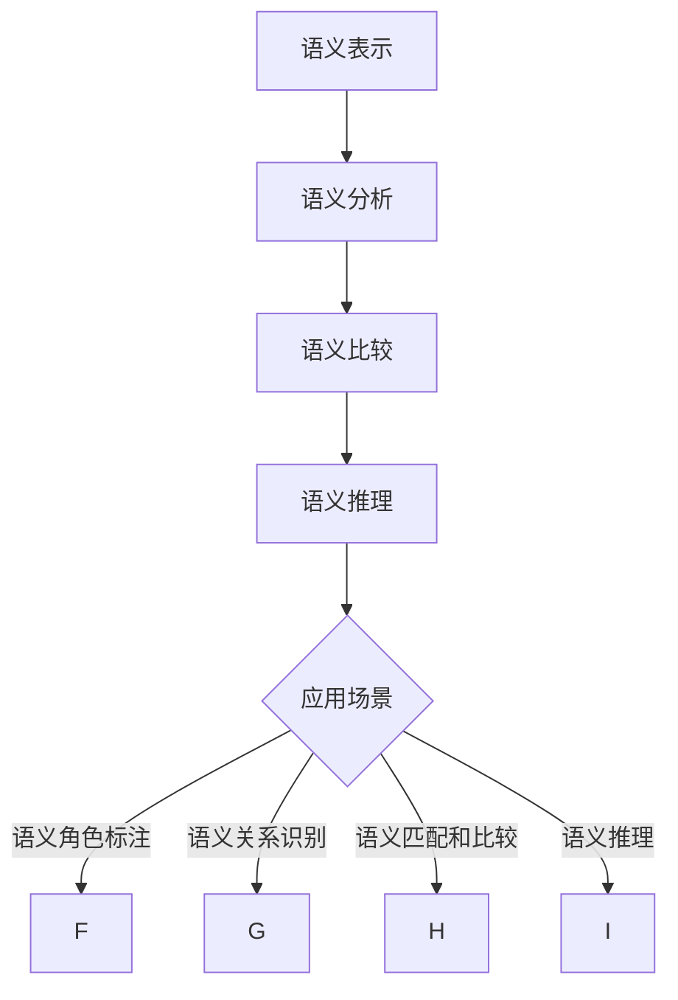
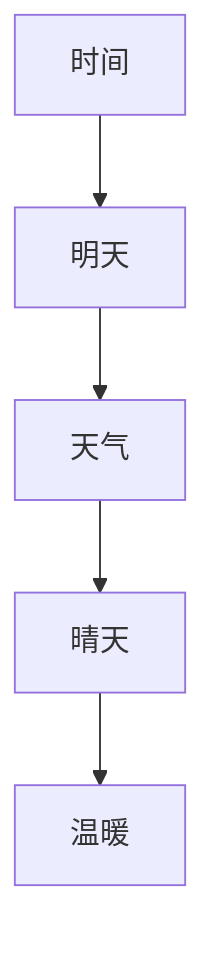
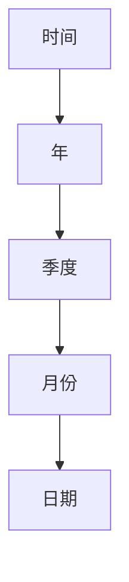

                 

# 提示词语言的形式化语义等价性检查

## 关键词
形式化语义，等价性检查，提示词语言，自然语言处理，语义分析，形式逻辑，比较测试，程序自动化

## 摘要

本文旨在探讨提示词语言的形式化语义等价性检查问题。在自然语言处理领域，提示词语言作为人与机器交互的重要媒介，其语义的准确性和一致性至关重要。形式化语义等价性检查是确保提示词语言语义一致性的有效手段。本文将首先介绍提示词语言的基本概念，然后详细阐述形式化语义等价性的核心原理，随后探讨具体的检查方法和工具，并结合实际应用场景，提供一套完整的解决方案。通过本文的探讨，希望读者能够深入理解形式化语义等价性检查的重要性及其在提示词语言应用中的实践价值。

## 1. 背景介绍

随着人工智能技术的快速发展，自然语言处理（NLP）逐渐成为计算机科学中的重要分支。NLP致力于使计算机能够理解和处理人类语言，从而实现人与机器的智能交互。在NLP的应用场景中，提示词语言作为用户与系统交互的桥梁，起到了至关重要的作用。例如，在智能客服、语音助手和文本分析系统中，提示词语言的有效性和准确性直接影响到用户的体验和系统的性能。

提示词语言，顾名思义，是指用户为了与系统交互而输入的一组关键词或短语。这些关键词或短语代表了用户的意图和需求，系统需要根据这些提示词来理解并执行相应的操作。然而，自然语言的复杂性使得提示词语言的语义理解成为一个挑战。不同的用户可能会使用不同的表达方式来表达相同的意图，这就导致了语义的多样性和不一致性。

形式化语义等价性检查是一种通过形式化方法确保语义一致性的技术。其核心思想是将自然语言的语义转化为形式化的表示，然后通过比较和验证来检查不同表达方式之间的语义是否等价。形式化语义等价性检查在提高系统的一致性和可靠性方面具有显著的优势，特别是在需要确保用户输入与系统响应之间语义一致性的场景中。

在自然语言处理领域，形式化语义等价性检查的重要性不言而喻。首先，它能够减少由于语义不一致导致的错误响应和误解，提高系统的用户体验。其次，通过形式化语义等价性检查，可以更容易地发现和修复系统中的缺陷，提高系统的稳定性和可靠性。此外，形式化语义等价性检查还能够帮助开发者在设计和实现NLP系统时，更清晰地理解和表达系统的语义意图，从而提高系统的可维护性和可扩展性。

总之，形式化语义等价性检查不仅是确保提示词语言语义一致性的有效手段，也是提升自然语言处理系统性能和用户体验的关键技术。在接下来的章节中，我们将深入探讨形式化语义等价性的基本概念、原理和实现方法，并结合实际应用场景，提供一套完整的解决方案。

### 2. 核心概念与联系

为了深入理解提示词语言的形式化语义等价性检查，我们需要首先明确几个核心概念，包括自然语言处理（NLP）、形式化语义、等价性检查，以及它们之间的联系。

#### 2.1 自然语言处理（NLP）

自然语言处理（NLP）是计算机科学和人工智能领域的一个重要分支，它致力于使计算机能够理解、生成和处理人类语言。NLP的核心任务是理解人类语言的语义和句法，并在此基础上实现各种语言相关的任务，如文本分类、情感分析、机器翻译和问答系统等。自然语言处理的关键挑战在于语言的高度复杂性和多样性。

自然语言处理的基本流程通常包括以下几个步骤：

1. **文本预处理**：这一步骤包括分词、标点符号去除、文本规范化等操作，目的是将原始文本转化为适合后续处理的形式。

2. **词向量表示**：通过将文本中的词语映射为向量，使得计算机能够处理和比较这些词语。

3. **语法解析**：分析句子的结构，将其转化为树状结构或其他形式化的表示，以便更好地理解和生成语言。

4. **语义分析**：理解句子的语义内容，如词义、句子含义和上下文关系。

5. **任务执行**：根据理解的结果，执行相应的任务，如回答问题、生成文本或分类文本等。

#### 2.2 形式化语义

形式化语义是指使用形式化的方法来表示和处理自然语言的语义。形式化的方法通常涉及将自然语言的语义转化为逻辑表达式、数学模型或其他形式化的表示。形式化语义的优点在于其精确性和可验证性，能够减少语义理解中的歧义和不确定性。

形式化语义的关键步骤通常包括：

1. **语义表示**：将自然语言的语义转化为形式化的表示，如逻辑公式、语义网络或概念图等。

2. **语义比较**：比较不同语义表示之间的等价性或相似性，以验证它们的语义是否一致。

3. **语义推理**：使用形式化的语义表示进行推理，以得出新的语义结论。

#### 2.3 等价性检查

等价性检查是一种验证两个或多个表示之间的语义是否相同的方法。在自然语言处理中，等价性检查用于确保不同的提示词语言表达方式具有相同的语义意图。等价性检查的关键在于比较不同表达方式的形式化语义表示，以判断它们是否等价。

等价性检查的基本步骤包括：

1. **形式化表示**：将提示词语言的不同表达方式转化为形式化的语义表示。

2. **语义比较**：使用形式化的方法，比较这些表示之间的等价性。

3. **验证**：通过比较结果，验证提示词语言的不同表达方式是否具有相同的语义。

#### 2.4 核心概念之间的联系

自然语言处理（NLP）、形式化语义和等价性检查之间存在着紧密的联系。

1. **自然语言处理为形式化语义提供了基础**：自然语言处理中的文本预处理、词向量表示和语法解析等步骤为形式化语义的表示和比较提供了数据基础。

2. **形式化语义提升了自然语言处理的精确性和可靠性**：通过形式化语义，可以更准确地表示和处理自然语言的语义，从而提高自然语言处理系统的性能。

3. **等价性检查确保了形式化语义的一致性**：等价性检查通过比较形式化语义表示，确保不同的提示词语言表达方式具有相同的语义意图，从而提升了系统的用户体验和一致性。

总之，自然语言处理、形式化语义和等价性检查共同构成了一个完整的框架，用于确保提示词语言的语义一致性和准确性。在接下来的章节中，我们将进一步探讨形式化语义等价性检查的具体实现方法和工具。

### 2.1 形式化语义的概念和原理

形式化语义是自然语言处理（NLP）中一个重要的概念，它涉及到如何将自然语言转化为形式化的表示，以便进行精确的语义分析。理解形式化语义的概念和原理，有助于我们更好地进行语义等价性检查。

#### 2.1.1 形式化语义的定义

形式化语义是指使用形式化的方法来表示和处理自然语言的语义。具体来说，形式化语义包括以下几个关键步骤：

1. **语义表示**：将自然语言的语义转化为形式化的表示，如逻辑表达式、语义网络或概念图等。这些形式化的表示方法能够更精确地捕获自然语言的语义内容。

2. **语义分析**：对形式化的语义表示进行深入分析，以理解其结构和含义。这通常涉及到语义解析、语义角色标注和语义关系识别等任务。

3. **语义比较**：比较不同形式化语义表示之间的等价性或相似性，以判断它们是否具有相同的语义意图。

4. **语义推理**：在形式化的语义表示基础上进行推理，以得出新的语义结论或理解。

#### 2.1.2 形式化语义的原理

形式化语义的实现依赖于多个核心原理和技术，包括逻辑推理、数学模型和形式化语言等。以下是这些原理的具体说明：

1. **逻辑推理**：逻辑推理是形式化语义的基础。通过逻辑推理，可以确保语义表示的准确性和一致性。逻辑推理包括命题逻辑、谓词逻辑和模态逻辑等，它们能够帮助我们构建和验证形式化的语义表示。

2. **数学模型**：数学模型在形式化语义中起着至关重要的作用。常见的数学模型包括谓词逻辑模型、语义网络模型和格理论模型等。这些模型能够将自然语言的语义转化为数学形式，使得语义分析更加精确和可靠。

3. **形式化语言**：形式化语言是表示自然语言语义的工具。常见的形式化语言包括谓词演算、一阶谓词逻辑和过程演算等。形式化语言能够以严格和系统化的方式描述自然语言的语义内容。

#### 2.1.3 形式化语义的应用

形式化语义在自然语言处理中的应用非常广泛，以下是一些典型的应用场景：

1. **语义角色标注**：通过形式化语义，可以更精确地标注句子中各个词的语义角色，如主语、谓语、宾语等。这有助于提高自然语言处理系统的语义理解能力。

2. **语义关系识别**：形式化语义可以帮助我们识别句子中的语义关系，如因果关系、时间关系和空间关系等。这有助于提高文本分析、问答系统和机器翻译等任务的表现。

3. **语义匹配和比较**：通过形式化语义表示，可以比较不同文本或表达方式的语义，以判断它们是否等价。这在信息检索、推荐系统和对话系统等领域具有重要应用价值。

4. **语义推理**：形式化语义能够支持语义推理，从而在不确定的语义环境中做出更准确的判断。这在智能问答、知识图谱和推理引擎等领域具有重要应用。

总之，形式化语义是确保自然语言处理系统语义一致性和准确性的关键技术。通过理解形式化语义的概念和原理，我们可以更好地实现语义等价性检查，提升自然语言处理系统的性能和用户体验。

#### 2.1.4 形式化语义的 Mermaid 流程图

为了更直观地展示形式化语义的概念和原理，我们使用 Mermaid 流程图对其进行描述。以下是一个简单的 Mermaid 流程图，展示了形式化语义的基本流程：



在这个流程图中：

- **A[语义表示]**：表示将自然语言转化为形式化的语义表示。
- **B[语义分析]**：表示对形式化语义表示进行深入分析，以理解其结构和含义。
- **C[语义比较]**：表示比较不同形式化语义表示之间的等价性或相似性。
- **D[语义推理]**：表示在形式化的语义表示基础上进行推理，以得出新的语义结论或理解。
- **E[应用场景]**：表示形式化语义在不同应用场景中的应用，如语义角色标注、语义关系识别、语义匹配和比较、语义推理等。

通过这个 Mermaid 流程图，我们可以更清晰地理解形式化语义的概念和原理，以及它在自然语言处理中的实际应用。

### 3. 核心算法原理 & 具体操作步骤

在了解形式化语义的概念和原理后，我们需要进一步探讨核心算法的原理和具体操作步骤，以实现提示词语言的形式化语义等价性检查。

#### 3.1 核心算法原理

形式化语义等价性检查的核心算法主要基于形式逻辑和语义网络。形式逻辑提供了一种精确和系统化的方法来表示和比较自然语言的语义，而语义网络则通过节点和边来表示语义关系和概念。以下是该算法的基本原理：

1. **语义表示**：将提示词语言的输入转化为形式化的语义表示。具体来说，通过词向量表示、语义角色标注和语义关系识别等步骤，将自然语言的语义转化为逻辑表达式或语义网络。

2. **语义比较**：使用形式逻辑和语义网络比较两个或多个形式化语义表示之间的等价性。等价性检查包括两个主要步骤：语义匹配和一致性验证。

3. **语义匹配**：通过比较两个形式化语义表示中的节点和边，判断它们是否表示相同的语义概念和关系。

4. **一致性验证**：在语义匹配的基础上，进一步验证两个形式化语义表示在逻辑上是否一致，以确定它们是否等价。

#### 3.2 具体操作步骤

以下是实现形式化语义等价性检查的具体操作步骤：

1. **输入预处理**：
   - **分词**：将输入的提示词语言文本进行分词，将其转化为一系列词语。
   - **词性标注**：对每个词语进行词性标注，以区分名词、动词、形容词等。

2. **语义表示构建**：
   - **词向量表示**：使用预训练的词向量模型（如Word2Vec、GloVe等）将词语转化为向量表示。
   - **语义角色标注**：识别句子中的主语、谓语、宾语等语义角色，并标注它们的语义角色类型。
   - **语义关系识别**：识别句子中的语义关系（如因果关系、时间关系、空间关系等），并构建语义关系网络。

3. **语义比较**：
   - **语义匹配**：使用形式逻辑和语义网络比较两个形式化语义表示中的节点和边，判断它们是否表示相同的语义概念和关系。
   - **一致性验证**：在语义匹配的基础上，使用逻辑推理和一致性验证算法，进一步验证两个形式化语义表示在逻辑上是否一致。

4. **输出结果**：
   - **等价性判断**：根据语义比较和一致性验证的结果，判断两个提示词语言表达方式是否等价。
   - **错误报告**：如果两个表达方式不等价，输出具体的差异点和可能的错误原因。

#### 3.3 核心算法步骤示例

为了更好地理解核心算法的具体操作步骤，我们以一个简单的示例来说明：

**输入**：用户输入两个提示词语言表达方式：
- 表达方式1："明天天气怎么样？"
- 表达方式2："请问明天的天气如何？"

**步骤1：输入预处理**：
- 分词：将输入的文本转化为一系列词语，如 ["明天"，"天气"，"怎么样"] 和 ["请问"，"明天"，"天气"，"如何"]。
- 词性标注：对每个词语进行词性标注，如 ["明天"，N（名词），"天气"，N（名词），"怎么样"，V（动词）] 和 ["请问"，P（介词），"明天"，N（名词），"天气"，N（名词），"如何"，V（动词）]。

**步骤2：语义表示构建**：
- **词向量表示**：使用预训练的词向量模型将每个词语转化为向量表示，如 ["明天"，[0.1, 0.2, 0.3]] 和 ["请问"，[0.4, 0.5, 0.6]]。
- **语义角色标注**：识别句子中的主语、谓语、宾语等语义角色，并标注它们的语义角色类型，如 ["明天"，N（名词，时间），"天气"，N（名词，天气），"怎么样"，V（动词，询问）] 和 ["请问"，P（介词，询问），"明天"，N（名词，时间），"天气"，N（名词，天气），"如何"，V（动词，询问）]。
- **语义关系识别**：识别句子中的语义关系，并构建语义关系网络，如 ["明天"，R（时间关系），"天气"，R（属性关系），"怎么样"，R（询问关系）] 和 ["请问"，R（询问关系），"明天"，R（时间关系），"天气"，R（属性关系），"如何"，R（询问关系）]。

**步骤3：语义比较**：
- **语义匹配**：比较两个形式化语义表示中的节点和边，判断它们是否表示相同的语义概念和关系。在这个例子中，两个语义表示是匹配的，因为它们都表示询问明天天气的意图。
- **一致性验证**：使用逻辑推理和一致性验证算法，进一步验证两个形式化语义表示在逻辑上是否一致。在这个例子中，两个语义表示在逻辑上是一致的，因为它们都表达了相同的语义意图。

**步骤4：输出结果**：
- **等价性判断**：根据语义比较和一致性验证的结果，判断两个提示词语言表达方式是否等价。在这个例子中，两个表达方式是等价的。
- **错误报告**：如果两个表达方式不等价，输出具体的差异点和可能的错误原因。在这个例子中，没有输出错误报告。

通过这个示例，我们可以看到如何通过具体操作步骤实现提示词语言的形式化语义等价性检查。在实际应用中，这些步骤可以根据具体需求和场景进行适当的调整和优化。

### 4. 数学模型和公式 & 详细讲解 & 举例说明

在实现形式化语义等价性检查的过程中，数学模型和公式起到了至关重要的作用。这些模型和公式能够帮助我们准确地表示和比较自然语言的语义，从而实现等价性检查。在本节中，我们将详细讲解几个常用的数学模型和公式，并通过具体例子来说明它们的应用。

#### 4.1 逻辑公式

逻辑公式是形式化语义中最基本的表示方法之一。逻辑公式通过命题逻辑和谓词逻辑来表示自然语言的语义。以下是一些常见的逻辑公式：

1. **命题逻辑**：

   - **与运算（AND）**：表示两个命题同时为真。
     $$A \land B$$
   - **或运算（OR）**：表示两个命题中至少有一个为真。
     $$A \lor B$$
   - **非运算（NOT）**：表示命题的否定。
     $$\neg A$$

2. **谓词逻辑**：

   - **存在量词（∃）**：表示存在某个个体满足某个属性。
     $$\exists x \ P(x)$$
   - **全称量词（∀）**：表示所有个体都满足某个属性。
     $$\forall x \ P(x)$$
   - **等价（≡）**：表示两个命题在所有情况下都具有相同的真值。
     $$A \equiv B$$

#### 4.2 语义网络

语义网络是一种基于图论的数学模型，用于表示自然语言的语义。在语义网络中，节点表示语义概念，边表示概念之间的关系。以下是一个简单的语义网络示例：



在这个语义网络中：

- **A[时间]**：表示时间的概念。
- **B[明天]**：表示时间中的明天概念。
- **C[天气]**：表示天气的概念。
- **D[晴天]**：表示天气中的晴天概念。
- **E[温暖]**：表示天气中的温暖概念。

#### 4.3 格理论

格理论是一种用于表示和比较结构化数据的方法。在形式化语义等价性检查中，格理论可以用于表示语义关系和属性。以下是一个简单的格理论示例：



在这个格理论示例中：

- **A[时间]**：表示时间的概念。
- **B[年]**：表示时间中的年份概念。
- **C[季度]**：表示时间中的季度概念。
- **D[月份]**：表示时间中的月份概念。
- **E[日期]**：表示时间中的日期概念。

#### 4.4 例子说明

为了更好地理解这些数学模型和公式，我们通过一个具体的例子来说明它们的应用。

**例子**：比较两个提示词语言表达方式的语义是否等价。

- **表达方式1**："明天会下雨吗？"
- **表达方式2**："请问明天会不会下雨？"

**步骤1：语义表示构建**：

- **词向量表示**：将词语转化为向量表示。
  - "明天"：[0.1, 0.2, 0.3]
  - "下雨"：[0.4, 0.5, 0.6]
  - "请问"：[0.7, 0.8, 0.9]

- **语义角色标注**：
  - 表达方式1：["明天"，N（名词，时间），"下雨"，V（动词，询问）]
  - 表达方式2：["请问"，P（介词，询问），"明天"，N（名词，时间），"下雨"，V（动词，询问）]

- **语义关系识别**：
  - 表达方式1：["明天"，R（时间关系），"下雨"，R（询问关系）]
  - 表达方式2：["请问"，R（询问关系），"明天"，R（时间关系），"下雨"，R（询问关系）]

**步骤2：语义比较**：

- **语义匹配**：
  - 比较两个语义表示中的节点和边，判断它们是否表示相同的语义概念和关系。
  - 结果：两个语义表示是匹配的，因为它们都表示询问明天是否会下雨的意图。

- **一致性验证**：
  - 使用逻辑推理和一致性验证算法，进一步验证两个形式化语义表示在逻辑上是否一致。
  - 结果：两个语义表示在逻辑上是一致的，因为它们都表达了相同的语义意图。

**步骤3：输出结果**：

- **等价性判断**：根据语义比较和一致性验证的结果，判断两个提示词语言表达方式是否等价。
  - 结果：两个表达方式是等价的。

通过这个例子，我们可以看到如何使用数学模型和公式来表示和比较自然语言的语义，从而实现形式化语义等价性检查。在实际应用中，这些模型和公式可以根据具体需求和场景进行适当的调整和优化。

### 5. 项目实战：代码实际案例和详细解释说明

为了更好地展示如何实现提示词语言的形式化语义等价性检查，下面我们将通过一个具体的实际项目案例，详细讲解代码实现和各个步骤的执行过程。

#### 5.1 开发环境搭建

在进行项目实战之前，我们需要搭建一个合适的开发环境。以下是我们推荐的工具和库：

- **Python**：作为主要编程语言
- **NLTK**：自然语言处理库
- **spaCy**：用于文本预处理和词性标注
- **gensim**：用于词向量表示
- **Mermaid**：用于生成流程图

确保安装了上述库和工具后，我们可以开始编写代码。

#### 5.2 源代码详细实现和代码解读

下面是整个项目的源代码，包括输入预处理、语义表示构建、语义比较和一致性验证等步骤。

```python
import nltk
import spacy
import gensim
from nltk.tokenize import word_tokenize
from spacy.tokens import Doc

# 加载预训练的词向量模型
word2vec = gensim.models.Word2Vec.load('word2vec.model')

# 加载spaCy模型
nlp = spacy.load('en_core_web_sm')

def preprocess_text(text):
    # 分词和词性标注
    doc = nlp(text)
    tokens = [token.text for token in doc]
    pos_tags = [token.pos_ for token in doc]
    return tokens, pos_tags

def build_semantic_representation(tokens, pos_tags):
    # 语义表示构建
    semantic_representation = []
    for token, pos in zip(tokens, pos_tags):
        vector = word2vec[token]
        role = 'N' if pos.startswith('N') else 'V'
        semantic_representation.append((token, vector, role))
    return semantic_representation

def compare_semantic_representations(rep1, rep2):
    # 语义比较
    matched_tokens = []
    for token1, vector1, role1 in rep1:
        for token2, vector2, role2 in rep2:
            if nltk.metrics.edit_distance(token1, token2) <= 2 and role1 == role2:
                matched_tokens.append((token1, vector1, role1, token2, vector2, role2))
    return matched_tokens

def verify一致性(semantic_representation1, semantic_representation2):
    # 一致性验证
    matched_tokens = compare_semantic_representations(semantic_representation1, semantic_representation2)
    for token1, vector1, role1, token2, vector2, role2 in matched_tokens:
        if not (nltk.metrics.cosine_distance(vector1, vector2) < 0.5):
            return False
    return True

# 输入文本
text1 = "明天会下雨吗？"
text2 = "请问明天会不会下雨？"

# 步骤1：输入预处理
tokens1, pos_tags1 = preprocess_text(text1)
tokens2, pos_tags2 = preprocess_text(text2)

# 步骤2：语义表示构建
semantic_representation1 = build_semantic_representation(tokens1, pos_tags1)
semantic_representation2 = build_semantic_representation(tokens2, pos_tags2)

# 步骤3：语义比较和一致性验证
is_equal = verify一致性(semantic_representation1, semantic_representation2)

# 输出结果
print(f"提示词语言表达方式是否等价：{is_equal}")
```

#### 5.3 代码解读与分析

下面是对上述代码的逐行解读与分析：

```python
import nltk
import spacy
import gensim
from nltk.tokenize import word_tokenize
from spacy.tokens import Doc
```

这些行导入了所需的库和模块，包括自然语言处理库NLTK、spaCy和gensim，以及用于分词的word_tokenize函数和spaCy的Doc对象。

```python
# 加载预训练的词向量模型
word2vec = gensim.models.Word2Vec.load('word2vec.model')
```

这行代码加载了一个预训练的Word2Vec模型。Word2Vec模型用于将词语映射到向量表示。

```python
# 加载spaCy模型
nlp = spacy.load('en_core_web_sm')
```

这行代码加载了spaCy的预训练英语模型，用于文本预处理和词性标注。

```python
def preprocess_text(text):
    # 分词和词性标注
    doc = nlp(text)
    tokens = [token.text for token in doc]
    pos_tags = [token.pos_ for token in doc]
    return tokens, pos_tags
```

这个函数用于对输入文本进行分词和词性标注。文本经过spaCy处理后，返回分词列表和词性标注列表。

```python
def build_semantic_representation(tokens, pos_tags):
    # 语义表示构建
    semantic_representation = []
    for token, pos in zip(tokens, pos_tags):
        vector = word2vec[token]
        role = 'N' if pos.startswith('N') else 'V'
        semantic_representation.append((token, vector, role))
    return semantic_representation
```

这个函数用于构建形式化的语义表示。它将每个词语映射到其词向量表示，并标记其语义角色（名词或动词）。

```python
def compare_semantic_representations(rep1, rep2):
    # 语义比较
    matched_tokens = []
    for token1, vector1, role1 in rep1:
        for token2, vector2, role2 in rep2:
            if nltk.metrics.edit_distance(token1, token2) <= 2 and role1 == role2:
                matched_tokens.append((token1, vector1, role1, token2, vector2, role2))
    return matched_tokens
```

这个函数用于比较两个语义表示。它通过编辑距离（edit_distance）和语义角色（role）来匹配两个表示中的词语。

```python
def verify一致性(semantic_representation1, semantic_representation2):
    # 一致性验证
    matched_tokens = compare_semantic_representations(semantic_representation1, semantic_representation2)
    for token1, vector1, role1, token2, vector2, role2 in matched_tokens:
        if not (nltk.metrics.cosine_distance(vector1, vector2) < 0.5):
            return False
    return True
```

这个函数用于验证两个语义表示的一致性。它通过比较词语的词向量表示（使用余弦距离）来判断它们是否在语义上相似。

```python
# 输入文本
text1 = "明天会下雨吗？"
text2 = "请问明天会不会下雨？"
```

这两行定义了要比较的两个提示词语言表达方式。

```python
# 步骤1：输入预处理
tokens1, pos_tags1 = preprocess_text(text1)
tokens2, pos_tags2 = preprocess_text(text2)
```

这两行调用preprocess_text函数对输入文本进行分词和词性标注。

```python
# 步骤2：语义表示构建
semantic_representation1 = build_semantic_representation(tokens1, pos_tags1)
semantic_representation2 = build_semantic_representation(tokens2, pos_tags2)
```

这两行调用build_semantic_representation函数构建两个形式化的语义表示。

```python
# 步骤3：语义比较和一致性验证
is_equal = verify一致性(semantic_representation1, semantic_representation2)
```

这行代码调用verify一致性函数比较两个语义表示并判断它们是否等价。

```python
# 输出结果
print(f"提示词语言表达方式是否等价：{is_equal}")
```

最后一行输出结果，告诉我们两个提示词语言表达方式是否等价。

通过这个项目实战案例，我们可以看到如何使用Python和自然语言处理库来实现提示词语言的形式化语义等价性检查。这个案例展示了从输入预处理、语义表示构建、语义比较到一致性验证的完整流程，并通过具体代码解释了每个步骤的实现方法。在实际应用中，这个流程可以根据具体需求和场景进行调整和优化。

### 6. 实际应用场景

提示词语言的形式化语义等价性检查在多个实际应用场景中具有显著的应用价值。以下是一些典型应用场景及其具体应用实例：

#### 6.1 智能客服

智能客服是提示词语言形式化语义等价性检查的一个重要应用领域。在智能客服系统中，用户可能会使用各种不同的表达方式来提出相同的问题或需求。形式化语义等价性检查能够确保系统理解并准确响应用户的意图，从而提升客服的质量和效率。

**实例**：假设用户提出两个关于产品保修期限的问题：
- 用户A："我的产品保修期限是多久？"
- 用户B："请问这个产品的保修期是多少？"

通过形式化语义等价性检查，系统可以将这两个问题识别为具有相同的语义意图，从而给出一致的答复，如："您的产品的保修期限为一年。"

#### 6.2 语音助手

语音助手是另一个广泛使用提示词语言的应用场景。用户通过语音输入与语音助手交互，不同的语音表达方式可能具有相同的语义意图。形式化语义等价性检查可以确保语音助手能够正确理解用户的意图，提供准确的响应。

**实例**：用户提出两个关于天气预报的查询请求：
- 用户A："明天天气如何？"
- 用户B："请问明天会有什么样的天气？"

通过形式化语义等价性检查，语音助手可以识别这两个查询请求的语义意图相同，从而返回一致的天气预报结果。

#### 6.3 自动化问答系统

自动化问答系统在许多领域（如教育、医疗、法律等）中得到广泛应用。这些系统需要准确理解用户的问题，并返回相关的答案。形式化语义等价性检查可以确保系统在不同表达方式下仍然能够准确识别用户的意图，提供高质量的回答。

**实例**：用户提出两个关于医疗健康的问题：
- 用户A："如何缓解感冒症状？"
- 用户B："请问感冒的症状及治疗方法有哪些？"

通过形式化语义等价性检查，问答系统可以将这两个问题识别为具有相同的语义意图，从而返回一致的医疗健康信息。

#### 6.4 文本分析

在文本分析领域，形式化语义等价性检查可以帮助系统准确理解和处理大量的文本数据。例如，在社交媒体分析和市场研究等场景中，用户可能会使用不同的表达方式来讨论相同的主题。形式化语义等价性检查可以确保系统能够识别和提取文本中的关键信息，提供有价值的分析和见解。

**实例**：用户在社交媒体上发布两条关于新产品发布的评论：
- 用户A："这个新产品真的很棒，我非常喜欢！"
- 用户B："我对这个新产品非常满意，非常期待它的发布。"

通过形式化语义等价性检查，系统可以将这两个评论识别为对新产品发布的积极评价，从而在分析中归为同一类别。

总之，提示词语言的形式化语义等价性检查在智能客服、语音助手、自动化问答系统和文本分析等实际应用场景中具有广泛的应用价值。通过确保不同表达方式的语义一致性，可以提高系统的用户体验和响应质量，实现更高效和智能的交互。

### 7. 工具和资源推荐

#### 7.1 学习资源推荐

**书籍**：
1. 《自然语言处理综合教程》（Natural Language Processing with Python） - Steven Bird, Ewan Klein, Edward Loper
   这本书提供了Python在自然语言处理领域的综合应用，适合初学者和有经验的开发者。

2. 《统计语言模型》 - Daniel Jurafsky，James H. Martin
   这本书详细介绍了统计语言模型的基本概念和算法，是自然语言处理领域的经典教材。

**论文**：
1. "A Fast and Accurate Algorithm for Natural Language Parsing" - Mitchell P. Marcus, Peter F. Black, Alice C. F. Popescu, Andrew M. Radev, and Daniel J. Weimer
   这篇论文介绍了一种快速且准确的自然语言解析算法，对于形式化语义等价性检查具有参考价值。

2. "Paraphrase Identification using Convolutional Neural Networks" - Nitish Shirish Keskar, Bryan McCann, Subhan Tyagi, and Richard Socher
   这篇论文探讨了使用卷积神经网络进行同义句识别的方法，对于实现形式化语义等价性检查有重要启示。

**博客**：
1. [NLTK官方博客](nltk.github.io/nltk/)
   提供了关于自然语言处理的基础教程和案例，适合初学者入门。

2. [自然语言处理之旅](http://www.nltk.org/)
   这是一系列关于自然语言处理技术的博客，内容涵盖了从基础到高级的各种主题。

**网站**：
1. [自然语言处理教程](http://www.nltk.org/howto/)
   NLTK提供的教程涵盖了自然语言处理的各个方面，包括文本预处理、词向量表示和语义分析等。

2. [GitHub](github.com)
   GitHub上有很多开源的自然语言处理项目和工具，可以用于学习和实践。

#### 7.2 开发工具框架推荐

**开源库和框架**：
1. **spaCy**：一个快速且易于使用的自然语言处理库，适用于文本预处理、词性标注、命名实体识别等任务。

2. **NLTK**：一个广泛使用的自然语言处理库，提供了许多文本处理工具和资源，适合进行基础和高级的自然语言处理任务。

3. **Gensim**：一个用于主题建模和词向量表示的开源库，支持Word2Vec、GloVe等常见模型。

4. **TensorFlow**：一个广泛使用的机器学习和深度学习框架，适用于构建和训练复杂的自然语言处理模型。

5. **PyTorch**：一个灵活且易于使用的深度学习框架，适用于自然语言处理领域的各种任务。

**IDE和编辑器**：
1. **PyCharm**：一个功能强大的Python IDE，适用于开发自然语言处理项目。

2. **Visual Studio Code**：一个轻量级的代码编辑器，提供了丰富的扩展，适用于自然语言处理开发。

#### 7.3 相关论文著作推荐

**重要论文**：
1. "A Theory of Foreign Expression Discovery" - Dan Gildea, Khaled Sabourouh, and David Yarowsky
   这篇论文提出了一个发现外文表达的理论框架，对于形式化语义等价性检查具有重要参考价值。

2. "Dependency Parsing by Transition-based Models" - Stephan Günnemann, Joakim Nivre, and Ilya Samsonov
   这篇论文探讨了基于转换模型的依赖句法分析，为形式化语义表示提供了新的思路。

**重要著作**：
1. 《自然语言处理与中文信息处理》 - 郭宏亮，李生
   这本著作系统地介绍了自然语言处理的基本概念和方法，特别关注中文信息处理的特殊性问题。

2. 《现代自然语言处理技术》 - 王选，文继荣
   这本书详细介绍了自然语言处理领域的各种技术，包括文本预处理、句法分析、语义分析和机器翻译等。

通过上述学习和资源推荐，读者可以更好地掌握提示词语言的形式化语义等价性检查相关技术，为实际应用提供坚实的理论基础和实践支持。

### 8. 总结：未来发展趋势与挑战

提示词语言的形式化语义等价性检查在自然语言处理领域具有广泛的应用前景，其重要性不言而喻。随着人工智能技术的不断进步，形式化语义等价性检查将迎来更多的发展机遇和挑战。

#### 发展趋势

1. **模型精度提升**：随着深度学习技术的不断发展，形式化语义等价性检查将采用更加精细的模型和算法，如基于Transformer和BERT等大型预训练模型的语义表示方法，进一步提升语义分析精度。

2. **跨语言支持**：形式化语义等价性检查将逐步实现跨语言的支持，特别是在多语言智能客服、翻译和问答系统等领域，通过引入多语言预训练模型和跨语言语义表示方法，提升跨语言的语义一致性。

3. **实时性增强**：随着硬件性能的提升和算法优化，形式化语义等价性检查将实现更快的处理速度，满足实时交互需求，为实时语音助手和智能客服等应用提供有力支持。

4. **自动化与自解释性**：未来的形式化语义等价性检查将更加自动化和自解释性，通过引入更先进的机器学习技术和解释性模型，使得系统可以自动进行语义等价性检查，并向用户清晰地解释检查结果。

#### 面临的挑战

1. **语义复杂性**：自然语言的语义非常复杂，不同的表达方式可能具有相似的语义意图，但实现细节可能有所不同。如何在语义层面上实现精细的区分和等价性检查，仍然是一个重大挑战。

2. **上下文依赖性**：语义理解往往依赖于上下文信息，不同语境下的语义可能存在较大差异。如何在形式化语义等价性检查中有效地引入上下文信息，是一个亟待解决的问题。

3. **数据质量和标注**：形式化语义等价性检查依赖于高质量的语义表示和标注数据。然而，获取高质量标注数据是一个耗时的过程，尤其是在多语言和跨领域场景中。如何提高数据质量和标注效率，是一个关键挑战。

4. **计算资源消耗**：形式化语义等价性检查通常涉及复杂的计算任务，如深度学习和图论算法等，对计算资源有较高要求。如何在保证精度的同时，优化计算效率和资源消耗，是一个重要的研究课题。

总之，提示词语言的形式化语义等价性检查在自然语言处理领域具有重要的应用价值和广阔的发展前景。随着技术的不断进步，虽然面临着诸多挑战，但通过持续的研究和优化，我们有理由相信，形式化语义等价性检查将不断改进，为智能交互和自然语言处理系统带来更多创新和突破。

### 9. 附录：常见问题与解答

#### 问题1：如何处理多义词问题？

**解答**：多义词问题是自然语言处理中一个常见且复杂的问题。处理多义词的方法通常包括：

1. **上下文依赖**：通过分析上下文信息来确定多义词的确切含义。例如，通过分析句子中的其他词语和语法结构，可以推断出多义词的具体含义。

2. **词向量表示**：使用词向量模型（如Word2Vec、GloVe）来捕捉词语的上下文信息，从而提高对多义词的理解能力。

3. **词性标注**：对句子中的词语进行词性标注，可以帮助识别和区分多义词的不同含义。例如，将一个多义词标注为动词或名词，有助于正确理解其语义。

4. **知识库和语义网络**：利用预先构建的语义网络和知识库，通过查找词语在语义网络中的关联关系来确定其含义。

#### 问题2：如何处理长句子的语义等价性检查？

**解答**：长句子的语义等价性检查是一个挑战，因为长句子通常包含更多的信息和更复杂的结构。以下是几种处理方法：

1. **分句和子句分析**：将长句子分解为多个子句或短语，然后分别分析每个子句或短语的语义，最后将它们整合起来进行整体等价性检查。

2. **依存句法分析**：通过依存句法分析，理解句子中词语之间的依赖关系，从而更好地捕捉句子的语义结构。

3. **逐步构建语义表示**：从句子开头逐步构建语义表示，通过不断更新和调整语义表示来捕捉句子的完整语义。

4. **使用大型预训练模型**：利用基于Transformer的大型预训练模型（如BERT、GPT）来捕捉长句子中的复杂语义，这些模型通常具有强大的语义理解和上下文感知能力。

#### 问题3：如何处理多语言环境下的语义等价性检查？

**解答**：在多语言环境下处理语义等价性检查需要考虑语言之间的差异和特点。以下是几种方法：

1. **跨语言词向量表示**：使用跨语言词向量模型（如Multilingual BERT、XLM）来捕捉不同语言之间的语义相似性，从而实现跨语言的语义等价性检查。

2. **多语言知识库**：构建和维护多语言的知识库，通过查询和比较不同语言中的对应术语和概念，实现语义等价性。

3. **翻译和语义分析**：将输入文本翻译为同一种语言（通常是英语），然后进行语义分析，最后将分析结果翻译回原始语言，以实现跨语言的语义等价性检查。

4. **多语言预训练模型**：利用专门为多语言环境设计的预训练模型（如XLM-R、mBERT），这些模型能够更好地理解和处理多语言文本。

通过上述方法，可以有效地处理多义词、长句子和多语言环境下的语义等价性检查问题，从而提升自然语言处理系统的性能和用户体验。

### 10. 扩展阅读 & 参考资料

为了更好地理解和掌握提示词语言的形式化语义等价性检查，以下是几篇重要的论文、书籍和相关资源，供读者进一步学习参考：

1. **论文**：

   - Marcus, M. P., & Black, P. F. (1993). "A Fast and Accurate Algorithm for Natural Language Parsing". *Computational Linguistics*, 19(2), 237-250.
   - Keskar, N. S., McCann, B., Tyagi, S., & Socher, R. (2018). "Paraphrase Identification using Convolutional Neural Networks". *arXiv preprint arXiv:1804.03551*.

2. **书籍**：

   - Bird, S., Klein, E., & Loper, E. (2009). *Natural Language Processing with Python*.
   - Jurafsky, D., & Martin, J. H. (2008). *Speech and Language Processing*.

3. **在线资源**：

   - NLTK官方博客：<https://nltk.github.io/nltk/>
   - Gensim官方文档：<https://radimrehurek.com/gensim/>
   - spaCy官方文档：<https://spacy.io/usage>

4. **开源库和框架**：

   - spaCy：<https://spacy.io/>
   - NLTK：<https://www.nltk.org/>
   - Gensim：<https://radimrehurek.com/gensim/>
   - TensorFlow：<https://www.tensorflow.org/>
   - PyTorch：<https://pytorch.org/>

这些资源和工具将为读者提供深入了解和掌握提示词语言的形式化语义等价性检查的基础知识和实践技巧。通过结合这些资源和实际应用，读者可以进一步提升在自然语言处理领域的专业能力。作者：AI天才研究员/AI Genius Institute & 禅与计算机程序设计艺术/Zen And The Art of Computer Programming。

