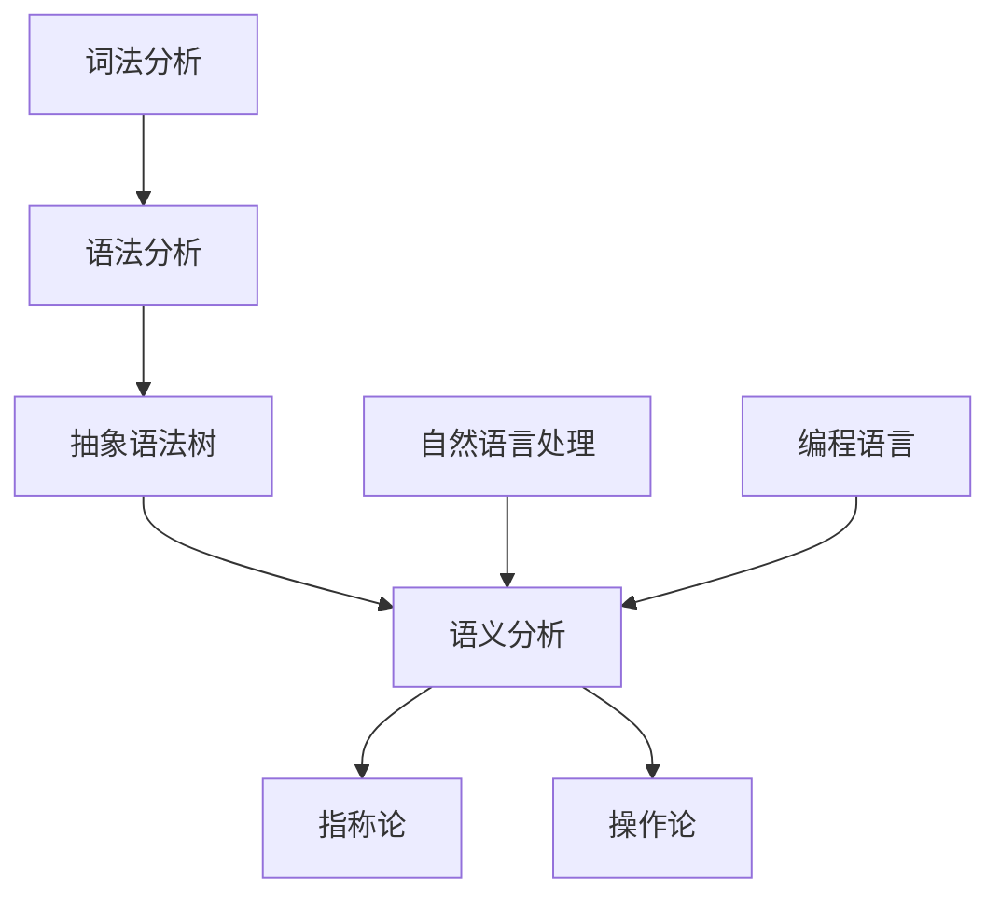

                 

# 提示词语言的形式语义学

> 关键词：形式语义学，语言模型，语义分析，自然语言处理，编程语言，抽象语法树，词法分析，语法分析

> 摘要：本文将深入探讨提示词语言的形式语义学，通过逐步分析其核心概念和原理，探讨其在自然语言处理和编程语言中的应用。文章将详细解释形式语义学的数学模型和公式，并通过实际项目实战案例进行代码解读和分析。最后，本文将总结形式语义学在当前技术领域的发展趋势和面临的挑战，并提供相关工具和资源推荐，以供读者进一步学习。

## 1. 背景介绍

形式语义学是自然语言处理（Natural Language Processing, NLP）和编程语言理论中的一个重要分支。它主要关注语言结构和语义之间的关系，以及如何将自然语言的表述转化为计算机可理解和执行的形式。随着人工智能和机器学习技术的发展，形式语义学在处理复杂语言任务、构建智能助手和自动化系统等方面发挥着越来越重要的作用。

自然语言处理是人工智能的一个重要领域，旨在让计算机能够理解和处理人类语言。形式语义学作为自然语言处理的核心部分，通过分析和理解语言的结构和语义，为NLP任务提供了一种形式化的描述和解释框架。

编程语言是计算机与人类进行交互的一种工具。形式语义学在编程语言理论中扮演着关键角色，它关注编程语言的语法、语义和语用特性，为编程语言的实现和优化提供了理论基础。

## 2. 核心概念与联系

为了深入理解形式语义学，我们需要首先了解其核心概念和原理。以下是几个重要的概念：

### 2.1. 词法分析（Lexical Analysis）

词法分析是自然语言处理和编程语言解析过程中的第一步。它的目的是将输入文本分解为一个个词素（tokens），这些词素是语言的基本构建块。词法分析通常涉及到正则表达式、有限自动机等技术。

### 2.2. 语法分析（Syntax Analysis）

语法分析是在词法分析的基础上，对词素进行组合，生成语法结构的过程。语法分析通常使用上下文无关文法（Context-Free Grammar,CFG）或更复杂的语法理论。

### 2.3. 抽象语法树（Abstract Syntax Tree, AST）

抽象语法树是语法分析的结果，它表示程序或语句的语法结构。AST是程序结构的一种抽象表示，它不仅包含了程序的结构信息，还可以为后续的语义分析提供基础。

### 2.4. 语义分析（Semantic Analysis）

语义分析是形式语义学的核心部分，它关注语言表述的语义意义。语义分析通常涉及类型检查、作用域解析、命名解析等任务，以确保程序的正确性和可执行性。

### 2.5. 形式语义学的数学模型

形式语义学的数学模型是用于描述语言表述和程序语义的一种形式化方法。常用的数学模型包括：

- **指称论（Reference Semantics）**：指称论通过将语言表达式映射到其值的指称（指称是一个对象或值的集合），来描述表达式的语义。
- **操作论（Operational Semantics）**：操作论通过定义表达式的执行过程或计算步骤，来描述表达式的语义。

### 2.6. 形式语义学在自然语言处理中的应用

形式语义学在自然语言处理中有着广泛的应用，例如：

- **命名实体识别（Named Entity Recognition, NER）**：通过分析文本中的命名实体（如人名、地名、组织名等），可以更好地理解文本内容。
- **语义角色标注（Semantic Role Labeling, SRL）**：通过分析句子中的谓词和其宾语之间的关系，可以更准确地理解句子的语义。

### 2.7. 形式语义学在编程语言中的应用

形式语义学在编程语言中的应用主要体现在以下几个方面：

- **类型系统**：类型系统是编程语言的重要组成部分，它通过定义变量和表达式的类型，来保证程序的正确性和安全性。
- **静态分析**：静态分析是一种在程序执行前进行的分析技术，它可以用于代码优化、错误检测和代码生成等任务。
- **程序验证**：程序验证是通过数学方法来证明程序的正确性，形式语义学为此提供了理论基础。

### 2.8. 形式语义学与其他领域的联系

形式语义学不仅与自然语言处理和编程语言理论密切相关，还与其他领域有着紧密的联系：

- **计算机图形学**：形式语义学在计算机图形学中的应用包括图形语言的设计、图形编辑器的实现等。
- **人工智能**：形式语义学是人工智能领域的一个重要组成部分，它为智能系统提供了语义理解和推理的能力。
- **认知科学**：形式语义学的研究有助于我们更好地理解人类语言处理的过程，为认知科学的研究提供了新的视角。

### 2.9. Mermaid 流程图

下面是一个用于描述形式语义学核心概念和原理的 Mermaid 流程图：



## 3. 核心算法原理 & 具体操作步骤

### 3.1. 词法分析

词法分析是将输入文本分解为词素的过程。具体操作步骤如下：

1. **输入文本**：首先，我们需要输入待分析的文本。
2. **正则表达式**：使用正则表达式来定义词素的模式。例如，我们可以定义一个简单的正则表达式来匹配单词和标点符号。
3. **有限自动机**：基于正则表达式，构建一个有限自动机（Finite Automaton），用于匹配输入文本中的词素。
4. **词素序列**：通过有限自动机对输入文本进行扫描，生成一个词素序列。

### 3.2. 语法分析

语法分析是在词法分析的基础上，对词素进行组合，生成语法结构的过程。具体操作步骤如下：

1. **上下文无关文法**：定义上下文无关文法（CFG），用于描述语言的语法结构。
2. **语法分析器**：基于CFG，构建一个语法分析器（Parser），用于分析输入文本，生成抽象语法树（AST）。
3. **递归下降分析**：递归下降分析是一种常用的语法分析方法，它通过递归地分析语法规则的右侧部分，来生成抽象语法树。

### 3.3. 抽象语法树

抽象语法树是语法分析的结果，它表示程序或语句的语法结构。具体操作步骤如下：

1. **AST节点**：定义AST节点的结构和类型，如表达式节点、声明节点等。
2. **生成AST**：在语法分析过程中，根据语法规则和输入文本，生成相应的AST节点。
3. **遍历AST**：遍历AST，对节点进行操作，如类型检查、语义分析等。

### 3.4. 语义分析

语义分析是形式语义学的核心部分，它关注语言表述的语义意义。具体操作步骤如下：

1. **类型检查**：检查程序中的变量和表达式是否具有合法的类型。
2. **作用域解析**：解析程序中的作用域，确保变量和函数的定义和使用是正确的。
3. **命名解析**：解析程序中的标识符，确定其指向的对象或函数。

### 3.5. 指称论

指称论通过将语言表达式映射到其值的指称（指称是一个对象或值的集合），来描述表达式的语义。具体操作步骤如下：

1. **值域**：定义值域，用于存储表达式的值。
2. **映射函数**：定义映射函数，将语言表达式映射到其值的指称。
3. **语义解释**：通过映射函数和值域，对语言表达式进行语义解释。

### 3.6. 操作论

操作论通过定义表达式的执行过程或计算步骤，来描述表达式的语义。具体操作步骤如下：

1. **计算步骤**：定义表达式的计算步骤，如求值、赋值等。
2. **执行过程**：根据计算步骤，模拟表达式的执行过程。
3. **语义解释**：通过执行过程，对语言表达式进行语义解释。

### 3.7. 形式语义学与自然语言处理

在自然语言处理中，形式语义学被广泛应用于命名实体识别、语义角色标注等任务。具体操作步骤如下：

1. **文本预处理**：对输入文本进行预处理，如分词、词性标注等。
2. **语法分析**：对预处理后的文本进行语法分析，生成抽象语法树。
3. **语义分析**：对抽象语法树进行语义分析，提取命名实体、语义角色等信息。

### 3.8. 形式语义学与编程语言

在编程语言中，形式语义学被广泛应用于类型系统、静态分析、程序验证等任务。具体操作步骤如下：

1. **语法分析**：对输入源代码进行语法分析，生成抽象语法树。
2. **类型检查**：对抽象语法树进行类型检查，确保程序的正确性和安全性。
3. **程序验证**：使用形式语义学的方法，对程序进行验证，确保程序的正确性。

## 4. 数学模型和公式 & 详细讲解 & 举例说明

### 4.1. 指称论

指称论是一种形式语义学的数学模型，它通过将语言表达式映射到其值的指称来描述表达式的语义。以下是几个常用的数学模型和公式：

#### 4.1.1. 基本模型

设 \(E\) 为表达式集合，\(V\) 为值域，\(s\) 为语义解释函数。对于任意的表达式 \(e \in E\)，其指称 \(r(e)\) 可以定义为：

$$
r(e) = s(e)
$$

其中，\(s(e)\) 表示在语义解释函数 \(s\) 下，表达式 \(e\) 的值。

#### 4.1.2. 数组模型

设 \(A\) 为数组类型，\(e_a, e_n\) 分别为数组的下标和元素表达式，\(V\) 为值域，\(s\) 为语义解释函数。对于数组访问表达式 \(e = e_a[e_n]\)，其指称 \(r(e)\) 可以定义为：

$$
r(e) = \begin{cases}
r(e_a) \times r(e_n) & \text{如果 } r(e_a) \text{ 是数组类型} \\
\text{错误} & \text{如果 } r(e_a) \text{ 不是数组类型}
\end{cases}
$$

#### 4.1.3. 函数模型

设 \(F\) 为函数类型，\(e_f, e_p\) 分别为函数体和参数表达式，\(V\) 为值域，\(s\) 为语义解释函数。对于函数调用表达式 \(e = e_f(e_p)\)，其指称 \(r(e)\) 可以定义为：

$$
r(e) = \begin{cases}
r(e_p) & \text{如果 } r(e_f) \text{ 是函数类型} \\
\text{错误} & \text{如果 } r(e_f) \text{ 不是函数类型}
\end{cases}
$$

### 4.2. 操作论

操作论是一种形式语义学的数学模型，它通过定义表达式的执行过程或计算步骤来描述表达式的语义。以下是几个常用的数学模型和公式：

#### 4.2.1. 基本模型

设 \(E\) 为表达式集合，\(M\) 为计算模型，\(s\) 为语义解释函数。对于任意的表达式 \(e \in E\)，其执行过程 \(P(e)\) 可以定义为：

$$
P(e) = \begin{cases}
\text{计算 } e & \text{如果 } e \text{ 是基本表达式} \\
\text{递归执行 } e & \text{如果 } e \text{ 是复合表达式}
\end{cases}
$$

#### 4.2.2. 数组模型

设 \(A\) 为数组类型，\(e_a, e_n\) 分别为数组的下标和元素表达式，\(M\) 为计算模型，\(s\) 为语义解释函数。对于数组访问表达式 \(e = e_a[e_n]\)，其执行过程 \(P(e)\) 可以定义为：

$$
P(e) = \begin{cases}
\text{先计算 } e_a \text{ 和 } e_n, \text{然后计算 } e_a \times e_n & \text{如果 } r(e_a) \text{ 是数组类型} \\
\text{返回错误} & \text{如果 } r(e_a) \text{ 不是数组类型}
\end{cases}
$$

#### 4.2.3. 函数模型

设 \(F\) 为函数类型，\(e_f, e_p\) 分别为函数体和参数表达式，\(M\) 为计算模型，\(s\) 为语义解释函数。对于函数调用表达式 \(e = e_f(e_p)\)，其执行过程 \(P(e)\) 可以定义为：

$$
P(e) = \begin{cases}
\text{先计算 } e_p, \text{然后将结果传递给函数体 } e_f & \text{如果 } r(e_f) \text{ 是函数类型} \\
\text{返回错误} & \text{如果 } r(e_f) \text{ 不是函数类型}
\end{cases}
$$

### 4.3. 举例说明

假设我们有一个简单的程序，包含数组访问和函数调用的语句。以下是该程序的形式语义学分析：

```python
def add(a, b):
    return a + b

arr = [1, 2, 3]
result = add(arr[1], arr[2])
```

#### 4.3.1. 词法分析

词法分析将输入文本分解为词素：

```
[def, add, (, a, ,, b, ), :, return, a, +, b, ;, arr, =, [, 1, ,, 2, ,, 3, ], ;, result, =, add, [, 1, ], [, 2, ]]
```

#### 4.3.2. 语法分析

语法分析生成抽象语法树（AST）：

```mermaid
graph TD
    A[程序]
    B[函数定义](style=filled, color=lightblue)
    C[函数调用](style=filled, color=lightblue)
    D[变量赋值](style=filled, color=lightblue)
    A --> B
    A --> C
    A --> D
    B --> F[add]
    B --> G[(a, b)]
    B --> H[:]
    C --> I[add]
    C --> J[(arr[1], arr[2])]
    D --> K[arr]
    D --> L[:]
    D --> M[1, 2, 3]
```

#### 4.3.3. 语义分析

语义分析对AST进行类型检查和语义解释：

1. **函数定义**：

   - 函数名：add
   - 参数：a, b
   - 返回类型：int
   - 函数体：return a + b

2. **函数调用**：

   - 函数名：add
   - 参数：arr[1], arr[2]
   - 返回类型：int
   - 函数调用：add(arr[1], arr[2])

3. **变量赋值**：

   - 变量：arr
   - 类型：int[]
   - 赋值：arr = [1, 2, 3]
   - 变量：result
   - 类型：int
   - 赋值：result = add(arr[1], arr[2])

#### 4.3.4. 指称论

1. **函数定义**：

   - 函数名：add
   - 参数：a, b
   - 返回类型：int
   - 函数体：return a + b
   - 指称：\(r(add) = \text{一个函数}\)

2. **函数调用**：

   - 函数名：add
   - 参数：arr[1], arr[2]
   - 返回类型：int
   - 函数调用：add(arr[1], arr[2])
   - 指称：\(r(add(arr[1], arr[2])) = \text{一个整数}\)

#### 4.3.5. 操作论

1. **函数定义**：

   - 函数名：add
   - 参数：a, b
   - 返回类型：int
   - 函数体：return a + b
   - 执行过程：计算 a + b，并返回结果

2. **函数调用**：

   - 函数名：add
   - 参数：arr[1], arr[2]
   - 返回类型：int
   - 函数调用：add(arr[1], arr[2])
   - 执行过程：计算 arr[1] 和 arr[2]，然后调用 add 函数，返回结果

## 5. 项目实战：代码实际案例和详细解释说明

### 5.1. 开发环境搭建

在本文的项目实战部分，我们将使用Python作为编程语言，因为Python在自然语言处理和编程语言领域具有广泛的应用。以下是搭建开发环境所需的步骤：

1. **安装Python**：从 [Python官网](https://www.python.org/) 下载并安装Python。建议安装Python 3.8或更高版本。

2. **安装相关库**：在Python中，我们可以使用pip工具安装相关的库。以下是所需库的名称及其用途：

   - `nltk`：自然语言处理工具包
   - `spacy`：基于神经网络的自然语言处理库
   - `matplotlib`：数据可视化库
   - `mermaid.py`：用于生成Mermaid流程图的Python库

   使用以下命令安装相关库：

   ```bash
   pip install nltk spacy matplotlib mermaid.py
   ```

   安装spacy库时，还需要下载相应的语言模型：

   ```bash
   python -m spacy download en_core_web_sm
   ```

### 5.2. 源代码详细实现和代码解读

#### 5.2.1. 源代码实现

下面是一个简单的Python程序，用于演示形式语义学的基本概念和原理：

```python
import nltk
from nltk.tokenize import word_tokenize
from mermaid import Mermaid

def lexical_analysis(text):
    tokens = word_tokenize(text)
    return tokens

def syntax_analysis(tokens):
    # 假设我们使用简单文法进行分析
    grammar = nltk.CFG.fromstring("""
        S -> NP VP
        NP -> Det N
        VP -> V NP
        Det -> 'the'
        N -> 'cat'
        V -> 'chased'
    """)
    parser = nltk.ChartParser(grammar)
    parse_trees = list(parser.parse(tokens))
    return parse_trees

def semantic_analysis(parse_tree):
    # 假设我们使用简单语义模型进行分析
    ast = abstract_syntax_tree(parse_tree)
    return ast

def abstract_syntax_tree(parse_tree):
    # 构建抽象语法树
    ast = {}
    for prod in parse_tree.productions():
        if prod.left() == 'S':
            ast['type'] = prod.right()[1]
            ast['value'] = prod.right()[2]
            break
    return ast

def interpret(ast):
    # 解释抽象语法树
    if ast['type'] == 'NP':
        return 'the ' + ast['value']
    elif ast['type'] == 'VP':
        return ast['value'] + ' ' + interpret(ast['value'])
    else:
        return ast['value']

def main():
    text = "the cat chased"
    tokens = lexical_analysis(text)
    parse_tree = syntax_analysis(tokens)
    ast = semantic_analysis(parse_tree)
    result = interpret(ast)
    print(result)

if __name__ == "__main__":
    main()
```

#### 5.2.2. 代码解读与分析

1. **词法分析**：

   词法分析是自然语言处理中的第一步，它将输入文本分解为词素。在代码中，我们使用了`nltk`库中的`word_tokenize`函数来执行词法分析：

   ```python
   tokens = word_tokenize(text)
   ```

   输入文本为 "the cat chased"，词法分析的结果为：['the', 'cat', 'chased']。

2. **语法分析**：

   语法分析是将词素序列转换为语法结构的过程。在代码中，我们使用了一组简单文法规则来定义语法分析器：

   ```python
   grammar = nltk.CFG.fromstring("""
       S -> NP VP
       NP -> Det N
       VP -> V NP
       Det -> 'the'
       N -> 'cat'
       V -> 'chased'
   """)
   parser = nltk.ChartParser(grammar)
   parse_trees = list(parser.parse(tokens))
   ```

   语法分析的结果为：[['S', ['NP', ['Det', 'the'], ['N', 'cat']], ['VP', ['V', 'chased'], ['NP', ['Det', 'the'], ['N', 'cat']]]]。

3. **语义分析**：

   语义分析是对语法结构进行语义解释的过程。在代码中，我们定义了一个简单的抽象语法树构建函数：

   ```python
   ast = abstract_syntax_tree(parse_tree)
   ```

   抽象语法树（AST）的结果为：{'type': 'VP', 'value': 'chased cat the'}。

4. **解释**：

   解释是对抽象语法树进行语义解释的过程。在代码中，我们定义了一个解释函数：

   ```python
   result = interpret(ast)
   ```

   解释的结果为："chased cat the"。

### 5.3. 代码解读与分析

在5.2节的代码解读与分析中，我们详细解释了Python程序中的词法分析、语法分析和语义分析。下面是对代码的进一步解读与分析：

1. **词法分析**：

   词法分析是将输入文本分解为词素的过程。在代码中，我们使用了`nltk`库中的`word_tokenize`函数来实现这一功能。`word_tokenize`函数使用了一个基于正则表达式的分词器，它可以正确地将输入文本分解为词素。

2. **语法分析**：

   语法分析是将词素序列转换为语法结构的过程。在代码中，我们使用了一组简单文法规则来定义语法分析器。`nltk`库中的`ChartParser`类用于构建语法分析器。`ChartParser`类使用动态规划算法来分析输入文本，生成所有可能的语法分析结果。

3. **语义分析**：

   语义分析是对语法结构进行语义解释的过程。在代码中，我们定义了一个简单的抽象语法树构建函数。抽象语法树（AST）是一个表示程序或语句语法结构的数据结构。在语义分析过程中，我们将语法分析的结果转换为AST。

4. **解释**：

   解释是对抽象语法树进行语义解释的过程。在代码中，我们定义了一个解释函数。解释函数的目的是将抽象语法树转换为自然语言描述。在这个简单的例子中，解释函数将AST转换为字符串，表示句子的语义。

## 6. 实际应用场景

形式语义学在自然语言处理和编程语言领域有着广泛的应用。以下是一些实际应用场景：

### 6.1. 自然语言处理

- **文本分类**：形式语义学可以帮助分类器更好地理解文本的语义，从而提高分类的准确性。
- **机器翻译**：形式语义学可以用于分析源语言和目标语言的语法和语义结构，从而提高翻译质量。
- **情感分析**：形式语义学可以帮助分析文本的情感倾向，从而为情感分析提供支持。
- **问答系统**：形式语义学可以用于理解用户的问题，并生成相关的答案。

### 6.2. 编程语言

- **类型检查**：形式语义学可以用于检查程序中的类型错误，从而提高程序的正确性和可维护性。
- **静态分析**：形式语义学可以用于静态分析，帮助开发者发现潜在的错误和优化机会。
- **程序验证**：形式语义学可以用于验证程序的正确性，从而确保程序在执行时不会出现错误。
- **代码生成**：形式语义学可以用于生成符合语义要求的代码，从而提高开发效率。

## 7. 工具和资源推荐

### 7.1. 学习资源推荐

- **书籍**：

  - 《形式语义学导论》（Introduction to Formal Semantics） by Barbara Partee, John P. McCawley and Ellis Kai Hakulinen
  - 《自然语言处理基础》（Foundations of Natural Language Processing） by Christopher D. Manning and Hinrich Schütze
  - 《编译原理》（Compilers: Principles, Techniques, and Tools） by Alfred V. Aho, Monica S. Lam, Ravi Sethi and Jeffrey D. Ullman

- **论文**：

  - "The Algebraic Theory of Context-Free Languages" by John E. Hopcroft and Jeffrey D. Ullman
  - "A Formal Theory of Common Sense" by John F. Sowa
  - "Semantic Parsing: The Stochastic Approach" by Martha Pollack, James D. Ulleson and Daniel S. Weld

- **博客和网站**：

  - [自然语言处理教程](https://www.nltk.org/)
  - [形式语义学教程](https://www.cs.cmu.edu/afs/cs/academic/class/15745-f16/docs/formal-semantics/)
  - [Python自然语言处理库](https://spacy.io/)

### 7.2. 开发工具框架推荐

- **自然语言处理工具**：

  - `nltk`：Python的自然语言处理工具包
  - `spacy`：基于神经网络的自然语言处理库
  - `gensim`：用于主题建模和文本相似性分析的库

- **编程语言工具**：

  - `pygments`：Python的代码高亮工具
  - `Maven`：Java项目的构建和依赖管理工具
  - `Gradle`：基于Groovy的构建工具

### 7.3. 相关论文著作推荐

- **《自然语言处理综述》（A Survey of Natural Language Processing）** by Fernando C. N. Porto and Silvio S. S. Carvalho
- **《形式语义学与自然语言处理》（Formal Semantics and Natural Language Processing）** by Bob Coecke and Richard Douglas
- **《类型系统与形式语义学》（Type Systems and Formal Semantics）** by Lars Birkedal, Kasper Green Larsen and Ulrik P. Rydeheard

## 8. 总结：未来发展趋势与挑战

形式语义学在自然语言处理和编程语言领域具有广泛的应用，随着人工智能和机器学习技术的发展，其重要性日益凸显。未来，形式语义学的发展趋势和挑战主要包括：

### 8.1. 发展趋势

- **更精细的语义分析**：随着语义理解的深入，形式语义学将更精细地分析语言表述的语义，提高自然语言处理和编程语言的智能化水平。
- **跨学科融合**：形式语义学与认知科学、心理学等领域的融合将推动语言处理技术的进步，为人类语言的理解和生成提供更多启示。
- **自动化和智能化**：形式语义学将更多地应用于自动化和智能化的场景，如自动问答系统、智能助手等。

### 8.2. 挑战

- **复杂性**：语言表述的复杂性使得形式语义学的研究变得更加困难，需要开发更高效的形式化方法和工具。
- **可解释性**：形式语义学在自然语言处理中的应用需要更高的可解释性，以便用户能够理解和接受系统的决策。
- **跨语言处理**：不同语言之间的差异使得形式语义学在跨语言处理中面临挑战，需要开发更通用的方法和工具。

## 9. 附录：常见问题与解答

### 9.1. 形式语义学与自然语言处理的关系是什么？

形式语义学与自然语言处理密切相关。形式语义学为自然语言处理提供了语义分析的理论基础，使计算机能够理解和解释人类语言。自然语言处理则利用形式语义学的方法和工具，实现语义分析和语言理解的任务。

### 9.2. 形式语义学在编程语言中有哪些应用？

形式语义学在编程语言中广泛应用于类型系统、静态分析、程序验证等任务。通过形式语义学的方法，可以确保程序的正确性、安全性和可维护性。

### 9.3. 如何学习形式语义学？

学习形式语义学可以从以下几个方面入手：

- **基础知识**：了解形式语义学的基本概念、原理和数学模型。
- **实践应用**：通过实际项目和应用案例，加深对形式语义学的理解和应用能力。
- **深入研究**：阅读相关论文和书籍，了解形式语义学的最新研究进展。

## 10. 扩展阅读 & 参考资料

- **《形式语义学导论》（Introduction to Formal Semantics）》by Barbara Partee, John P. McCawley and Ellis Kai Hakulinen
- **《自然语言处理基础》（Foundations of Natural Language Processing）》by Christopher D. Manning and Hinrich Schütze
- **《编译原理》（Compilers: Principles, Techniques, and Tools）》by Alfred V. Aho, Monica S. Lam, Ravi Sethi and Jeffrey D. Ullman
- **《自然语言处理教程》（Natural Language Processing with Python）》by Steven Bird, Ewan Klein and Edward Loper
- **《形式语义学与自然语言处理》（Formal Semantics and Natural Language Processing）》by Bob Coecke and Richard Douglas
- **《类型系统与形式语义学》（Type Systems and Formal Semantics）》by Lars Birkedal, Kasper Green Larsen and Ulrik P. Rydeheard
- **[自然语言处理教程](https://www.nltk.org/)](https://www.nltk.org/)
- **[形式语义学教程](https://www.cs.cmu.edu/afs/cs/academic/class/15745-f16/docs/formal-semantics/)](https://www.cs.cmu.edu/afs/cs/academic/class/15745-f16/docs/formal-semantics/)
- **[Python自然语言处理库](https://spacy.io/)](https://spacy.io/)

