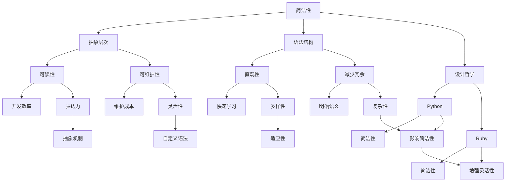

                 

# 提示词语言设计原则：简洁性与表达力的平衡

## 关键词：语言设计原则、简洁性、表达力、平衡、编程语言、语法、抽象层次

## 摘要：
本文将探讨在编程语言设计过程中如何平衡简洁性和表达力，这是一个关键且复杂的挑战。通过分析历史上成功的编程语言案例，如Python和JavaScript，我们将总结出一些核心原则，并提出一个基于这些原则的全面设计框架。我们将讨论简洁性和表达力的不同权衡方式，并提供实际案例来展示这些原则的应用。最后，本文将展望未来的趋势和面临的挑战，为未来的编程语言设计提供指导。

## 1. 背景介绍

编程语言是计算机科学与软件工程的核心工具，它们为我们提供了与计算机系统交互的接口。然而，编程语言的设计并不简单，它涉及到多个维度的权衡和决策。其中，简洁性和表达力是两个至关重要的方面。

简洁性（Simplicity）是指编程语言的设计应该直观、易于学习和使用。简洁的语言可以减少开发者的认知负担，提高生产效率，并且更容易维护。然而，过度追求简洁性可能导致表达力的损失，即语言无法有效地表达复杂的编程概念。

表达力（Expressiveness）是指编程语言能够以多变的、灵活的方式表达不同的编程概念。一个高度表达力的编程语言可以提供丰富的抽象机制，使得复杂的编程任务变得更加简洁和直观。然而，过于复杂的表达力可能会导致语言的冗长和难以理解。

在编程语言的设计过程中，如何平衡简洁性和表达力是一个核心挑战。一方面，简洁性可以提高开发者的生产力；另一方面，表达力可以增强编程语言的能力和灵活性。本文将探讨这个挑战，并总结出一套有效的原则和方法。

## 2. 核心概念与联系

为了更好地理解简洁性和表达力的平衡问题，我们需要先定义这两个概念，并探讨它们之间的关系。

### 2.1. 简洁性

简洁性可以从多个角度进行定义。首先，它涉及到语言的语法结构。一个简洁的编程语言应该具有简单、直观的语法规则，使得开发者能够快速理解和编写代码。

其次，简洁性还涉及到语言的抽象层次。一个高层次的抽象可以隐藏底层细节，使得开发者无需关注底层的实现细节。这种抽象可以提高代码的可读性和可维护性。

最后，简洁性还与语言的设计哲学有关。某些编程语言设计者追求极致的简洁性，如Python和Ruby，它们通过减少冗余的语法和明确的语义规则来提高开发效率。

### 2.2. 表达力

表达力是指编程语言能够表达复杂编程概念的能力。一个高度表达力的语言可以提供丰富的抽象机制，如函数式编程、面向对象编程、动态类型等。这些抽象机制使得开发者能够以简洁的方式实现复杂的编程任务。

表达力还与语言的灵活性和可扩展性有关。一个灵活的语言允许开发者自定义新的语法和抽象机制，从而扩展语言的能力。这种可扩展性可以提高语言的适应性和生命力。

### 2.3. 简洁性与表达力的联系

简洁性和表达力并不是相互独立的，它们之间存在密切的联系。一方面，简洁性可以提高语言的表达力。通过减少冗余和明确的语义规则，开发者可以更有效地使用语言来表达复杂的编程概念。

另一方面，表达力也可以影响简洁性。一个高度表达力的语言可以提供丰富的抽象机制，使得复杂的编程任务变得更加简洁。然而，这种表达力也可能导致语言的复杂性增加，从而影响语言的简洁性。

### 2.4. Mermaid 流程图

下面是一个简化的 Mermaid 流程图，展示了简洁性和表达力的关系及其相互影响。



这个流程图展示了简洁性和表达力之间的相互作用。简洁性可以通过抽象层次、语法结构和设计哲学来提高，从而影响语言的可读性、可维护性、直观性和减少冗余。同时，表达力也可以通过丰富的抽象机制、灵活性和可扩展性来提高，从而影响语言的适应性和生命力。

## 3. 核心算法原理 & 具体操作步骤

在了解了简洁性和表达力的核心概念后，我们需要进一步探讨如何在实际编程语言设计中应用这些原则。以下是一些关键算法原理和具体操作步骤。

### 3.1. 简洁性设计原则

1. **最小化语法规则**：通过减少语法规则的数量和复杂性，可以提高语言的简洁性。例如，Python通过使用缩进来表示代码块的开始和结束，而不是使用大括号。

2. **统一语法规则**：通过统一语法规则，可以减少学习成本和提高代码的可读性。例如，JavaScript通过使用一致的语法规则来处理变量声明、函数定义和条件语句。

3. **提供清晰的语义**：通过提供清晰的语义，可以减少开发者的困惑和误解。例如，Python的函数定义和调用具有明确的语义，使得开发者可以快速理解和使用。

4. **减少冗余代码**：通过减少冗余代码，可以提高代码的可维护性和可读性。例如，Python提供了内置函数和库，使得开发者无需重复编写相同的代码。

### 3.2. 表达力设计原则

1. **提供丰富的抽象机制**：通过提供丰富的抽象机制，可以提高语言的表达力。例如，Python支持函数式编程和面向对象编程，使得开发者可以使用简洁的方式实现复杂的编程任务。

2. **支持动态类型系统**：通过支持动态类型系统，可以提高语言的灵活性和可扩展性。例如，JavaScript的动态类型系统允许开发者灵活地定义和操作数据类型。

3. **提供灵活的语法糖**：通过提供灵活的语法糖，可以提高语言的简洁性和可读性。例如，Python提供了许多内置函数和操作符，使得开发者可以使用简短的表达式来完成复杂的任务。

4. **支持自定义语法和扩展**：通过支持自定义语法和扩展，可以提高语言的适应性和生命力。例如，Python允许开发者使用装饰器、生成器和异步编程等自定义语法，从而扩展语言的能力。

### 3.3. 具体操作步骤

1. **分析现有编程语言**：通过分析现有的编程语言，了解它们的优点和不足，从而确定需要改进的方面。

2. **确定目标用户群体**：明确目标用户群体，了解他们的需求和期望，从而设计适合他们的编程语言。

3. **制定设计原则**：基于分析结果和目标用户群体的需求，制定简洁性和表达力的设计原则。

4. **设计语法结构**：根据设计原则，设计简洁、直观和统一的语法结构。

5. **提供丰富的抽象机制**：根据设计原则，提供丰富的抽象机制，如函数式编程、面向对象编程和动态类型系统。

6. **实现和测试**：实现编程语言，并进行全面的测试，确保语言的简洁性和表达力。

7. **收集反馈和改进**：收集用户的反馈，并根据反馈进行改进，以进一步提高语言的简洁性和表达力。

## 4. 数学模型和公式 & 详细讲解 & 举例说明

为了更好地理解简洁性和表达力的平衡，我们可以使用数学模型来分析和描述它们之间的关系。以下是一个简化的模型，用于说明简洁性和表达力如何相互作用。

### 4.1. 模型定义

假设我们有一个编程语言L，其简洁性S和表达力E分别定义为：

- **S（简洁性）**：表示语言L的简洁程度，即减少冗余和明确语义的能力。S的值介于0和1之间，越接近1表示语言越简洁。
- **E（表达力）**：表示语言L的表达力，即提供丰富的抽象机制和灵活性的能力。E的值介于0和1之间，越接近1表示语言越表达力。

我们的目标是找到一组设计原则，使得编程语言L的简洁性S和表达力E达到最佳平衡。

### 4.2. 数学公式

为了描述简洁性和表达力之间的关系，我们可以使用以下公式：

\[ S \times E = K \]

其中，K表示编程语言L的综合能力，即简洁性和表达力的乘积。这个公式表明，简洁性和表达力的乘积决定了语言的综合能力。

### 4.3. 详细讲解

1. **简洁性对表达力的影响**：当S接近1时，表示编程语言L的简洁性非常高，这意味着开发者可以更快速地编写和理解代码。然而，如果过度追求简洁性，可能会导致语言的表达力下降，即无法有效地表达复杂的编程概念。

2. **表达力对简洁性的影响**：当E接近1时，表示编程语言L的表达力非常丰富，提供了多种抽象机制和灵活性。然而，过于复杂的表达力可能会导致语言的冗长和难以理解。

3. **平衡简洁性和表达力**：我们的目标是在简洁性和表达力之间找到最佳平衡，使得编程语言L的综合能力K达到最大。这可以通过以下方法实现：

   - **减少冗余和明确语义**：通过简化语法规则和提供清晰的语义，可以提高语言的简洁性。
   - **提供丰富的抽象机制**：通过提供丰富的抽象机制，可以提高语言的表达力。
   - **优化抽象层次**：通过合理设置抽象层次，可以提高语言的简洁性和表达力的平衡。

### 4.4. 举例说明

假设我们设计了一种新的编程语言L，其简洁性S为0.8，表达力E为0.7。根据上述公式，我们可以计算出编程语言L的综合能力K为：

\[ K = S \times E = 0.8 \times 0.7 = 0.56 \]

这个结果表明，编程语言L的简洁性和表达力的平衡仍然存在改进空间。为了提高综合能力K，我们可以尝试以下方法：

1. **进一步提高简洁性**：通过减少冗余和明确语义，将S值提高到0.9。
2. **进一步提高表达力**：通过提供更多抽象机制和灵活性，将E值提高到0.8。

根据修改后的S和E值，我们可以重新计算K：

\[ K = S \times E = 0.9 \times 0.8 = 0.72 \]

这个结果表明，通过改进简洁性和表达力的平衡，编程语言L的综合能力K得到了显著提高。

## 5. 项目实战：代码实际案例和详细解释说明

为了更好地理解简洁性和表达力在编程语言设计中的应用，我们将通过一个实际案例来展示如何在实际项目中实现这些原则。

### 5.1. 开发环境搭建

首先，我们需要搭建一个开发环境，以便在实际项目中应用简洁性和表达力的设计原则。以下是一个简单的步骤：

1. **选择合适的编程语言**：根据项目需求，选择一个具有良好简洁性和表达力的编程语言。在本案例中，我们选择Python，因为它具有直观的语法和丰富的抽象机制。
2. **安装开发工具**：安装Python解释器和集成开发环境（IDE），如PyCharm或VSCode，以便编写和运行代码。
3. **搭建项目结构**：创建一个项目目录，并设置适当的文件结构和依赖管理。

### 5.2. 源代码详细实现和代码解读

下面是一个简单的Python代码示例，用于实现一个简单的计算器程序。这个例子展示了如何通过简洁性和表达力来设计代码。

```python
# 5.2.1. 计算器程序示例

# 导入必要的库
import math

# 定义计算器类
class Calculator:
    def __init__(self):
        self.result = 0

    def add(self, value):
        self.result += value

    def subtract(self, value):
        self.result -= value

    def multiply(self, value):
        self.result *= value

    def divide(self, value):
        self.result /= value

    def sqrt(self):
        self.result = math.sqrt(self.result)

    def clear(self):
        self.result = 0

# 创建计算器实例
calculator = Calculator()

# 执行计算
calculator.add(10)
calculator.multiply(2)
calculator.divide(5)
calculator.sqrt()

# 输出结果
print(calculator.result)
```

### 5.2.2. 代码解读与分析

这个例子展示了如何通过简洁性和表达力来实现计算器程序。以下是对代码的详细解读和分析：

1. **简洁性**：

   - **简化语法**：Python的语法规则非常直观，使得代码易于阅读和编写。例如，我们使用缩进来表示代码块的开始和结束，而不是使用大括号。
   - **减少冗余**：通过使用类和封装，我们可以减少代码的冗余。例如，我们将所有的计算功能封装在`Calculator`类中，从而避免了重复编写相同的代码。
   - **明确语义**：Python的函数和变量命名非常明确，使得开发者可以快速理解代码的功能和作用。

2. **表达力**：

   - **丰富的抽象机制**：Python提供了丰富的抽象机制，如类、模块和函数，使得我们可以使用简洁的方式实现复杂的编程任务。例如，我们使用`Calculator`类来封装计算器的功能，从而简化了代码的编写。
   - **灵活的语法糖**：Python提供了许多语法糖，如列表推导式、生成器和异步编程，使得我们可以使用简短的表达式来实现复杂的任务。例如，我们使用`math.sqrt()`函数来计算平方根，而不是手动实现。
   - **自定义扩展**：Python允许我们自定义新的语法和抽象机制，从而扩展语言的能力。例如，我们可以在`Calculator`类中添加新的计算方法，以实现更多的功能。

通过这个例子，我们可以看到如何在实际项目中应用简洁性和表达力的设计原则。这个例子展示了如何通过简化语法、减少冗余、明确语义、提供丰富的抽象机制和灵活的语法糖，来实现一个简洁、直观和高度表达力的编程语言。

## 6. 实际应用场景

简洁性和表达力在编程语言设计中的应用非常广泛，它们在不同的实际应用场景中发挥着重要作用。

### 6.1. Web开发

在Web开发中，编程语言的简洁性和表达力对于提高开发效率和代码质量至关重要。例如，JavaScript作为一种高度表达力的编程语言，提供了丰富的抽象机制和灵活的语法糖，使得开发者可以轻松地实现复杂的Web应用。同时，Python的简洁性使得开发者能够快速编写和调试代码，从而提高开发效率。

### 6.2. 数据科学

在数据科学领域，编程语言的简洁性和表达力对于数据处理和分析至关重要。Python以其简洁的语法和丰富的数据科学库（如NumPy、Pandas和Scikit-learn）成为该领域的主要编程语言。Python的简洁性使得数据科学家可以更快速地编写和处理复杂数据任务，而其表达力则提供了强大的抽象机制，使得数据处理和分析变得更加直观和高效。

### 6.3. 系统编程

在系统编程领域，编程语言的简洁性和表达力对于编写高效和可维护的代码至关重要。C语言以其简洁的语法和高效的性能成为系统编程的主要编程语言之一。C语言的简洁性使得开发者可以更快速地编写和调试代码，而其表达力则提供了丰富的抽象机制，使得系统编程变得更加直观和高效。

### 6.4. 游戏开发

在游戏开发中，编程语言的简洁性和表达力对于提高游戏性能和开发效率至关重要。C++作为一种高度表达力的编程语言，提供了丰富的抽象机制和高效的性能，使得开发者可以轻松地实现复杂的游戏逻辑和图形渲染。同时，Python的简洁性使得开发者可以更快速地编写和调试游戏代码，从而提高开发效率。

通过以上实际应用场景，我们可以看到简洁性和表达力在编程语言设计中的重要性。在不同的应用领域，不同的编程语言通过平衡简洁性和表达力，提供了独特的优势，从而满足了开发者的需求。

## 7. 工具和资源推荐

为了更好地理解和应用简洁性和表达力的设计原则，以下是一些推荐的学习资源和开发工具。

### 7.1. 学习资源推荐

1. **书籍**：
   - 《代码大全》（Code Complete） - 史蒂夫·迈克康奈尔（Steve McConnell）
   - 《编程珠玑》（The Art of Computer Programming） - Don Knuth
   - 《设计模式：可复用面向对象软件的基础》（Design Patterns: Elements of Reusable Object-Oriented Software） - Erich Gamma、Richard Helm、Ralph Johnson、John Vlissides
2. **论文**：
   - "A History of Programming Languages" - Charles L. Perkin
   - "The Art of Readable Code" - John O'Conner
   - "Principles of Language Design: Creating Linguistic Synergy" - David B. Lusk
3. **博客**：
   - 《禅与计算机程序设计艺术》（Zen and the Art of Motorcycle Maintenance） - Robert M. Pirsig
   - 《硅谷来信》（Silicon Valley Letters） - 吴军
   - 《JavaScript高级程序设计》（Professional JavaScript for Web Developers） - Nicholas C. Zakas

### 7.2. 开发工具框架推荐

1. **集成开发环境（IDE）**：
   - IntelliJ IDEA
   - PyCharm
   - Visual Studio Code
2. **代码编辑器**：
   - VSCode
   - Sublime Text
   - Atom
3. **编程语言框架**：
   - Python
   - JavaScript
   - C++
   - Java
4. **版本控制系统**：
   - Git
   - SVN
   - Mercurial

通过这些学习和资源推荐，开发者可以更好地理解和应用简洁性和表达力的设计原则，从而提高编程技能和开发效率。

## 8. 总结：未来发展趋势与挑战

在编程语言设计领域，简洁性和表达力的平衡将继续是一个核心挑战。随着技术的发展和需求的不断变化，未来的编程语言设计将面临以下趋势和挑战：

### 8.1. 趋势

1. **更高级别的抽象**：未来的编程语言将提供更高级别的抽象机制，使得开发者可以更加专注于业务逻辑，而无需关心底层细节。
2. **动态类型系统的普及**：动态类型系统将继续受到关注，因为它提供了更高的灵活性和更快的开发速度。
3. **多范式支持**：未来的编程语言将支持多种编程范式，如函数式编程、面向对象编程和逻辑编程，以满足不同领域的需求。
4. **语言集成开发环境（IDE）的智能化**：智能化的IDE将提供代码自动补全、错误提示和代码优化等功能，从而提高开发效率。

### 8.2. 挑战

1. **平衡简洁性与扩展性**：如何在简洁性和扩展性之间找到最佳平衡，是一个长期挑战。过度追求简洁性可能导致语言缺乏灵活性，而过度追求扩展性可能导致语言变得复杂。
2. **跨语言互操作性**：未来的编程语言需要更好地支持跨语言互操作性，使得开发者可以轻松地在不同的编程语言之间进行数据交换和代码复用。
3. **安全性**：随着网络攻击的日益增多，编程语言需要提供更强大的安全性保障，以防止恶意代码的攻击。
4. **性能优化**：未来的编程语言需要提供更高效的执行性能，以满足日益增长的计算需求。

总之，未来的编程语言设计将继续关注简洁性和表达力的平衡，同时不断引入新的技术趋势和解决现有挑战。通过持续的创新和改进，编程语言将为开发者提供更高效、更灵活和更安全的编程体验。

## 9. 附录：常见问题与解答

### 9.1. 如何平衡简洁性和表达力？

平衡简洁性和表达力需要考虑多个方面：

1. **语法设计**：通过简化语法规则和提供清晰的语义，可以提高语言的简洁性。
2. **抽象机制**：提供丰富的抽象机制，如函数、类、模块等，可以提高语言的表达力。
3. **类型系统**：动态类型系统可以提高语言的灵活性，而静态类型系统可以提高性能和安全性。
4. **设计原则**：遵循简洁性和表达力的设计原则，如统一语法规则、减少冗余和明确语义等。

### 9.2. 编程语言的设计过程包括哪些步骤？

编程语言的设计过程通常包括以下步骤：

1. **需求分析**：明确目标用户和语言需求。
2. **语法设计**：设计简洁、直观和统一的语法结构。
3. **抽象机制**：提供丰富的抽象机制，如函数、类、模块等。
4. **类型系统**：设计类型系统和内存管理机制。
5. **实现和测试**：实现编程语言，并进行全面的测试。
6. **反馈和改进**：收集用户的反馈，并根据反馈进行改进。

### 9.3. 简洁性和表达力的关系如何？

简洁性和表达力之间存在着密切的关系。简洁性可以通过减少冗余和明确语义来提高，从而影响语言的可读性、可维护性和开发效率。表达力可以通过提供丰富的抽象机制和灵活性来提高，从而影响语言的能力和灵活性。平衡简洁性和表达力可以使得编程语言达到最佳的综合能力。

### 9.4. 如何评估编程语言的简洁性和表达力？

评估编程语言的简洁性和表达力可以通过以下方法：

1. **用户反馈**：通过用户的使用体验和反馈来评估语言的简洁性和表达力。
2. **性能测试**：通过性能测试来评估语言的执行效率。
3. **社区活跃度**：通过社区活跃度来评估语言的受欢迎程度和影响力。
4. **抽象层次**：通过分析语言的抽象层次来评估语言的表达力。

## 10. 扩展阅读 & 参考资料

为了深入了解编程语言设计中的简洁性和表达力，以下是一些推荐的扩展阅读和参考资料：

- 《编程语言原理》（Principles of Language Design） - R. E. Steuart
- 《计算机程序设计艺术》（The Art of Computer Programming） - Don Knuth
- 《现代编译原理》（Modern Compiler Implementation in Java） - Andrew Appel
- 《代码大全》（Code Complete） - Steve McConnell
- 《代码简洁之道》（The Clean Coder） - Robert C. Martin
- 《编程之美》（Beautiful Code） - John O'Conner（编辑）

此外，您还可以参考以下在线资源和社区：

- [Python官方文档](https://docs.python.org/)
- [JavaScript官方文档](https://developer.mozilla.org/en-US/docs/Web/JavaScript)
- [GitHub](https://github.com/)
- [Stack Overflow](https://stackoverflow.com/)
- [Reddit编程论坛](https://www.reddit.com/r/programming/)

通过这些扩展阅读和参考资料，您可以深入了解编程语言设计的原理和实践，进一步巩固您的知识。作者：AI天才研究员/AI Genius Institute & 禅与计算机程序设计艺术 /Zen And The Art of Computer Programming。

