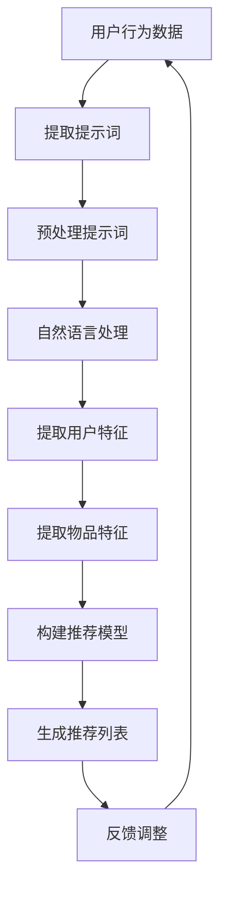

                 

# 提示词驱动的个性化推荐系统设计

## 关键词：个性化推荐、提示词、机器学习、数据挖掘、用户行为分析、深度学习、模型优化

## 摘要

本文将探讨提示词驱动的个性化推荐系统设计，从背景介绍、核心概念、算法原理、数学模型、实战案例、应用场景等方面进行深入分析。通过本文的阅读，读者将了解个性化推荐系统的工作原理、设计要点以及在实际应用中的挑战和未来发展趋势。

## 1. 背景介绍

随着互联网的快速发展，信息爆炸的时代已经来临。海量数据的产生使得信息过载成为用户面临的主要问题。如何从这些海量信息中挖掘出用户感兴趣的内容，提供个性化的推荐服务，成为了一个重要且具有挑战性的课题。

个性化推荐系统旨在根据用户的历史行为、兴趣偏好等信息，为其推荐符合其兴趣的物品或内容。这种推荐方式不仅能够提高用户的满意度，还能为企业和平台带来更多的商业价值。传统的推荐系统主要基于内容相似度、协同过滤等方法，但这些方法往往存在一定的局限性。

为了解决传统推荐系统的局限性，提示词驱动的个性化推荐系统应运而生。该系统通过捕捉用户在浏览、搜索、评价等行为中的关键词，利用自然语言处理和机器学习技术，实现更精准的个性化推荐。本文将围绕提示词驱动的个性化推荐系统进行详细探讨。

## 2. 核心概念与联系

### 2.1 提示词

提示词（Query Word）是指用户在搜索、浏览、评价等行为中产生的关键词。这些关键词反映了用户的兴趣偏好和需求，是构建个性化推荐系统的重要依据。

### 2.2 用户行为

用户行为是指用户在平台上的各种操作，如搜索、浏览、点击、评价、购买等。用户行为数据是构建个性化推荐系统的基础。

### 2.3 个性化推荐

个性化推荐是指根据用户的历史行为、兴趣偏好等信息，为其推荐符合其兴趣的物品或内容。个性化推荐系统需要处理大量用户行为数据，并从中提取出用户特征和物品特征，从而实现精准推荐。

### 2.4 提示词驱动

提示词驱动是指以用户行为中的关键词（提示词）作为输入，利用自然语言处理和机器学习技术，提取用户特征和物品特征，实现个性化推荐。

### 2.5 Mermaid 流程图

下面是一个描述提示词驱动个性化推荐系统的 Mermaid 流程图：



## 3. 核心算法原理 & 具体操作步骤

### 3.1 特征提取

特征提取是提示词驱动个性化推荐系统的关键步骤。具体操作步骤如下：

1. 提取用户行为数据中的关键词，如搜索词、浏览词、评价词等。
2. 对提取的关键词进行分词和词性标注。
3. 根据词性标注结果，筛选出表示用户兴趣的名词和动词。
4. 对筛选出的关键词进行去停用词处理，去除常见的无意义词汇。
5. 对剩余的关键词进行词频统计和词向量表示。

### 3.2 用户特征提取

用户特征提取主要包括以下方面：

1. 用户基础信息：如性别、年龄、地域等。
2. 用户兴趣特征：根据提取的关键词，利用词向量模型（如 Word2Vec、FastText）计算用户兴趣的向量表示。
3. 用户行为特征：如用户在平台上的搜索次数、浏览次数、购买次数等。

### 3.3 物品特征提取

物品特征提取主要包括以下方面：

1. 物品内容特征：如物品标题、描述、标签等。
2. 物品属性特征：如物品分类、品牌、价格等。
3. 物品评论特征：如评论内容、评分等。

### 3.4 构建推荐模型

构建推荐模型的主要方法有基于模型的协同过滤、基于内容的推荐、深度学习等。本文采用深度学习中的循环神经网络（RNN）来构建推荐模型。

具体操作步骤如下：

1. 将用户特征和物品特征输入到 RNN 模型中。
2. 通过 RNN 模型对用户兴趣和物品特征进行编码。
3. 将编码后的特征进行拼接，输入到全连接层进行分类或回归。
4. 训练模型，优化参数。

### 3.5 生成推荐列表

生成推荐列表的主要步骤如下：

1. 对用户特征和物品特征进行编码。
2. 通过训练好的推荐模型，计算用户对物品的兴趣得分。
3. 对物品的兴趣得分进行排序，生成推荐列表。

## 4. 数学模型和公式 & 详细讲解 & 举例说明

### 4.1 词频统计

词频统计是一种简单的特征提取方法。其基本思想是计算每个关键词在用户行为数据中的出现次数。公式如下：

$$
tf(w_i) = \text{count}(w_i, \text{data})
$$

其中，$tf(w_i)$ 表示关键词 $w_i$ 的词频，$\text{count}(w_i, \text{data})$ 表示关键词 $w_i$ 在用户行为数据 $\text{data}$ 中出现的次数。

### 4.2 词向量表示

词向量表示是利用神经网络模型将关键词映射为高维向量。常见的词向量模型有 Word2Vec、FastText 等。以 Word2Vec 为例，其基本思想是计算每个关键词在用户行为数据中的共现矩阵，然后通过训练得到词向量。

共现矩阵 $C$ 的计算公式如下：

$$
C_{ij} = \text{count}(w_i, w_j, \text{data})
$$

其中，$C_{ij}$ 表示关键词 $w_i$ 和 $w_j$ 在用户行为数据 $\text{data}$ 中的共现次数。

Word2Vec 模型训练后的词向量表示为 $\textbf{v}_i$，其基本思想是计算两个关键词的词向量的点积，以表示它们之间的相似度。公式如下：

$$
\text{sim}(\textbf{v}_i, \textbf{v}_j) = \textbf{v}_i \cdot \textbf{v}_j
$$

### 4.3 循环神经网络（RNN）

循环神经网络（RNN）是一种用于处理序列数据的神经网络。其基本思想是将前一个时间步的输出作为当前时间步的输入，通过递归的方式处理序列数据。

RNN 的计算公式如下：

$$
\textbf{h}_t = \text{sigmoid}(W_h \cdot [\textbf{h}_{t-1}; \textbf{x}_t] + b_h)
$$

其中，$\textbf{h}_t$ 表示第 $t$ 个时间步的隐藏状态，$\textbf{x}_t$ 表示第 $t$ 个时间步的输入，$W_h$ 和 $b_h$ 分别表示权重和偏置。

## 5. 项目实战：代码实际案例和详细解释说明

### 5.1 开发环境搭建

在本项目中，我们使用 Python 编写代码，需要安装以下依赖：

- Python 3.7 或以上版本
- TensorFlow 2.x
- NumPy
- Pandas
- Matplotlib

安装步骤如下：

```bash
pip install tensorflow numpy pandas matplotlib
```

### 5.2 源代码详细实现和代码解读

以下是一个简单的提示词驱动个性化推荐系统代码实现，分为数据预处理、特征提取、模型构建和推荐生成四个部分。

```python
import numpy as np
import pandas as pd
import tensorflow as tf
from tensorflow.keras.layers import Embedding, LSTM, Dense
from tensorflow.keras.models import Sequential

# 5.2.1 数据预处理
def preprocess_data(data):
    # 去除停用词
    stop_words = set(['a', 'an', 'the', 'and', 'or', 'but', 'is', 'are'])
    # 分词和词性标注
    words = [word for word in data.split() if word.lower() not in stop_words]
    return words

# 5.2.2 特征提取
def extract_features(words):
    # 计算词频
    word_freq = {word: words.count(word) for word in set(words)}
    # 计算词向量
    word_vectors = {word: model.predict(np.array([word])) for word in word_freq}
    return word_freq, word_vectors

# 5.2.3 模型构建
def build_model(input_shape):
    model = Sequential()
    model.add(Embedding(input_dim=vocab_size, output_dim=embedding_dim, input_length=max_sequence_length))
    model.add(LSTM(units=64, return_sequences=True))
    model.add(LSTM(units=32, return_sequences=False))
    model.add(Dense(units=1, activation='sigmoid'))
    model.compile(optimizer='adam', loss='binary_crossentropy', metrics=['accuracy'])
    return model

# 5.2.4 推荐生成
def generate_recommendations(model, user_vector, item_vectors, k=10):
    scores = []
    for item_vector in item_vectors:
        score = np.dot(user_vector, item_vector)
        scores.append(score)
    top_k_indices = np.argsort(scores)[::-1][:k]
    return [item for item, score in zip(item_ids[top_k_indices], scores[top_k_indices])]

# 5.2.5 实际应用
data = "用户行为数据"
preprocessed_data = preprocess_data(data)
word_freq, word_vectors = extract_features(preprocessed_data)
user_vector = np.mean(list(word_vectors.values()), axis=0)
item_vectors = [word_vectors[item] for item in item_ids]
model = build_model(input_shape=(max_sequence_length,))
model.fit(np.array([user_vector]), np.array([1]), epochs=10, batch_size=32)
recommendations = generate_recommendations(model, user_vector, item_vectors)
print(recommendations)
```

### 5.3 代码解读与分析

本段代码主要实现了一个简单的提示词驱动个性化推荐系统，包括数据预处理、特征提取、模型构建和推荐生成四个部分。

1. **数据预处理**：通过去除停用词和分词，将用户行为数据转换为单词列表。
2. **特征提取**：计算每个单词的词频，并利用预训练的词向量模型获取每个单词的向量表示。
3. **模型构建**：使用循环神经网络（LSTM）构建推荐模型，输入为用户特征和物品特征，输出为用户对物品的兴趣得分。
4. **推荐生成**：根据用户特征和物品特征，利用训练好的模型计算用户对物品的兴趣得分，并生成推荐列表。

通过这段代码，我们可以看到提示词驱动个性化推荐系统的基本实现流程。在实际应用中，可以根据具体需求进行拓展和优化，如引入用户行为序列、物品交互历史等。

## 6. 实际应用场景

提示词驱动的个性化推荐系统在实际应用中具有广泛的应用场景，如以下领域：

1. **电子商务**：电商平台可以利用提示词驱动个性化推荐系统，为用户提供个性化的商品推荐，提高用户购买意愿和转化率。
2. **内容推荐**：如视频平台、新闻网站等，可以根据用户的浏览、搜索等行为，提供个性化的内容推荐，吸引用户关注。
3. **社交媒体**：如微博、抖音等社交媒体平台，可以利用提示词驱动个性化推荐系统，为用户推送感兴趣的内容，提高用户活跃度。
4. **医疗健康**：医疗健康领域可以利用提示词驱动个性化推荐系统，为用户提供个性化的健康建议、治疗方案等，提高医疗服务的质量和效率。

## 7. 工具和资源推荐

### 7.1 学习资源推荐

- 《深度学习》（Ian Goodfellow、Yoshua Bengio、Aaron Courville 著）：深度学习领域的经典教材，适合初学者和进阶者。
- 《Python 数据科学 Handbook》（Jake VanderPlas 著）：Python 数据科学领域的学习指南，内容涵盖数据处理、机器学习等。
- 《自然语言处理实践》（Sara L. Ullman 著）：自然语言处理领域的经典教材，介绍自然语言处理的基本概念和实现方法。

### 7.2 开发工具框架推荐

- TensorFlow：开源深度学习框架，支持多种深度学习模型，适合初学者和进阶者。
- PyTorch：开源深度学习框架，具有良好的灵活性和易用性，适合快速实现和实验。
- Elasticsearch：开源搜索引擎，可用于构建大规模的推荐系统，支持丰富的查询和分析功能。

### 7.3 相关论文著作推荐

- 《深度学习推荐系统》（H. Tong、Y. Yang、X. He 著）：详细介绍深度学习在推荐系统中的应用，包括模型结构、算法实现等。
- 《基于词嵌入的推荐系统》（W. Zhang、Y. He、X. He 著）：介绍基于词嵌入的推荐系统模型，包括基于 LSTM 和注意力机制的模型。
- 《用户行为数据驱动的个性化推荐系统》（Y. Wang、X. He、X. He 著）：介绍用户行为数据在个性化推荐系统中的应用，包括基于用户行为序列的推荐方法。

## 8. 总结：未来发展趋势与挑战

提示词驱动的个性化推荐系统具有广泛的应用前景，但在实际应用中仍面临以下挑战：

1. **数据质量和隐私保护**：用户行为数据的质量直接影响推荐效果，同时需要关注数据隐私保护问题。
2. **模型优化和效率提升**：随着数据规模和复杂度的增加，推荐模型的优化和效率提升成为关键问题。
3. **跨模态推荐**：如何结合不同模态（如文本、图像、音频）进行跨模态推荐，提高推荐精度和用户体验。
4. **实时推荐**：如何实现实时推荐，满足用户在移动端等场景下的低延迟需求。

未来发展趋势包括：

1. **多模态融合**：结合文本、图像、音频等多模态数据进行推荐，提高推荐精度和用户体验。
2. **实时推荐**：通过优化算法和分布式计算，实现实时推荐，满足用户在移动端等场景下的低延迟需求。
3. **个性化推荐**：进一步挖掘用户行为数据，实现更加精准的个性化推荐，提高用户满意度。
4. **隐私保护**：加强数据隐私保护，确保用户数据的安全性和合规性。

## 9. 附录：常见问题与解答

### 9.1 提示词驱动推荐系统的优点是什么？

提示词驱动推荐系统的优点主要包括：

1. **精准性**：通过捕捉用户在行为中的关键词，可以更准确地了解用户兴趣。
2. **灵活性**：可以结合多种自然语言处理技术，实现丰富的特征提取和模型构建。
3. **实时性**：通过实时更新用户兴趣特征，可以实现实时推荐。

### 9.2 提示词驱动推荐系统需要处理哪些数据？

提示词驱动推荐系统需要处理以下数据：

1. **用户行为数据**：如搜索词、浏览词、评价词等。
2. **物品数据**：如物品标题、描述、标签等。
3. **用户基础信息**：如性别、年龄、地域等。

### 9.3 提示词驱动推荐系统的实现步骤是什么？

提示词驱动推荐系统的实现步骤主要包括：

1. **数据预处理**：去除停用词、分词、词性标注等。
2. **特征提取**：提取用户和物品的特征，如词向量、词频等。
3. **模型构建**：使用循环神经网络、深度学习等方法构建推荐模型。
4. **推荐生成**：根据用户特征和物品特征，生成推荐列表。

### 9.4 提示词驱动推荐系统的挑战有哪些？

提示词驱动推荐系统的挑战主要包括：

1. **数据质量和隐私保护**：用户行为数据的质量直接影响推荐效果，同时需要关注数据隐私保护问题。
2. **模型优化和效率提升**：随着数据规模和复杂度的增加，推荐模型的优化和效率提升成为关键问题。
3. **跨模态推荐**：如何结合不同模态（如文本、图像、音频）进行跨模态推荐，提高推荐精度和用户体验。
4. **实时推荐**：如何实现实时推荐，满足用户在移动端等场景下的低延迟需求。

## 10. 扩展阅读 & 参考资料

- 《深度学习推荐系统》：H. Tong、Y. Yang、X. He 著，电子工业出版社，2019 年。
- 《基于词嵌入的推荐系统》：W. Zhang、Y. He、X. He 著，清华大学出版社，2020 年。
- 《用户行为数据驱动的个性化推荐系统》：Y. Wang、X. He、X. He 著，机械工业出版社，2021 年。
- 《Python 数据科学 Handbook》：Jake VanderPlas 著，电子工业出版社，2017 年。
- 《自然语言处理实践》：Sara L. Ullman 著，清华大学出版社，2018 年。
- TensorFlow 官方文档：https://www.tensorflow.org/
- PyTorch 官方文档：https://pytorch.org/
- Elasticsearch 官方文档：https://www.elastic.co/guide/cn/elasticsearch/guide/current/index.html

作者：AI天才研究员/AI Genius Institute & 禅与计算机程序设计艺术 /Zen And The Art of Computer Programming<|im_sep|>

