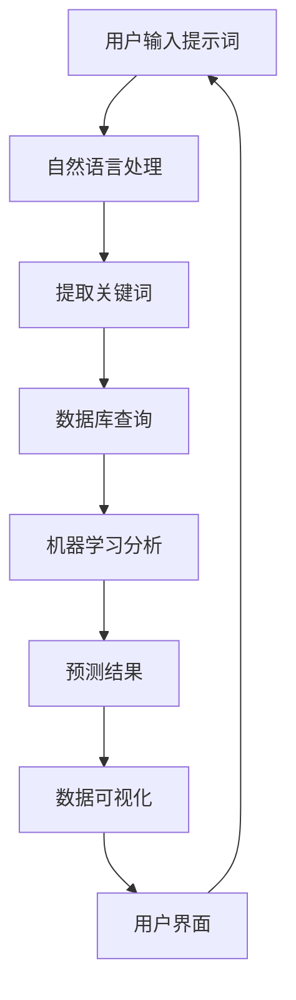

                 

### 背景介绍

水资源作为人类生存和发展的重要物质基础，其管理和优化显得尤为重要。然而，传统的水资源管理系统在面对日益复杂和多变的水资源管理需求时，往往显得力不从心。随着人工智能技术的飞速发展，尤其是提示词驱动的智能技术的兴起，为水资源管理系统带来了新的契机和可能性。

在当前全球范围内，水资源的分布不均衡、水资源浪费、水污染等问题愈发严重。特别是在干旱和洪涝等极端气候事件频繁发生的背景下，传统的水资源管理方式已无法满足现代社会的需求。因此，构建一个高效、智能的水资源管理系统，成为众多国家和地区亟待解决的问题。

提示词驱动的智能技术，通过结合自然语言处理、机器学习等先进技术，能够实现自动化、智能化地分析和处理大量水资源数据。这一技术的引入，不仅可以提高水资源管理的效率和精度，还可以为决策者提供更科学的决策依据。

本文旨在探讨提示词驱动的智能水资源管理系统的构建方法，包括其核心概念、算法原理、数学模型、实际应用等，以期为广大读者提供一个系统、全面的技术参考。

接下来，我们将逐步深入探讨这一主题，从背景介绍、核心概念与联系、核心算法原理、数学模型和公式、项目实战、实际应用场景、工具和资源推荐等多个方面进行分析和阐述。

### 核心概念与联系

要理解提示词驱动的智能水资源管理系统，首先需要了解几个关键概念和它们之间的联系。

**1. 提示词（Keywords）**：提示词是一种引导智能系统进行特定任务的关键性词汇。在水资源管理系统中，提示词可以包括水文特征参数、水资源需求、水资源分布、水资源质量等。通过这些提示词，智能系统能够定位到特定的水资源管理需求，并针对性地进行分析和决策。

**2. 自然语言处理（Natural Language Processing, NLP）**：NLP是人工智能领域的一个重要分支，它使计算机能够理解和处理人类语言。在水资源管理系统中，NLP技术被用来解析和处理用户输入的提示词，从而提取出有用的信息，并将其转换为计算机可以理解和处理的数据。

**3. 机器学习（Machine Learning, ML）**：机器学习是一种通过数据驱动的方式使计算机具备智能的能力。在水资源管理系统中，机器学习技术用于分析和预测水资源的行为模式，从而为水资源管理提供决策支持。常见的机器学习算法包括决策树、支持向量机、神经网络等。

**4. 数据库（Database）**：数据库是存储和管理数据的系统。在水资源管理系统中，数据库用于存储大量的水资源数据，如水位、流量、水质等。通过数据库管理系统，可以高效地查询、更新和删除数据，为智能系统提供数据支持。

**5. 数据可视化（Data Visualization）**：数据可视化是一种将数据转换为图形、图像等视觉表现形式的技术。在水资源管理系统中，数据可视化技术用于将分析结果以图表、地图等形式展示出来，帮助用户直观地理解水资源状况和管理效果。

**6. 水资源管理系统（Water Resource Management System, WRMS）**：水资源管理系统是一个集成多种技术手段，用于优化水资源管理和决策的综合性系统。在提示词驱动智能技术的支持下，水资源管理系统可以更加自动化和智能化地进行水资源监测、分析、预测和决策。

**核心概念与架构的联系（Mermaid 流程图）**



在这个流程图中，用户输入的提示词首先通过自然语言处理技术进行解析，提取出关键信息。这些信息随后被用于数据库查询，以获取相关的水资源数据。获取到的数据经过机器学习分析，生成预测结果。最后，数据可视化技术将这些结果呈现给用户，形成一个闭环系统。

通过上述核心概念和架构的联系，我们可以看到，提示词驱动的智能水资源管理系统是一个高度集成的系统，它充分利用了人工智能和大数据技术的优势，为水资源管理提供了强有力的支持。

### 核心算法原理 & 具体操作步骤

在理解了提示词驱动的智能水资源管理系统的基本架构后，接下来我们将深入探讨其核心算法原理和具体操作步骤。

**1. 自然语言处理（NLP）算法原理**

自然语言处理是提示词驱动的智能水资源管理系统的第一步，它负责将用户输入的提示词转化为机器可以理解和处理的数据。NLP算法主要包括以下几个关键步骤：

- **分词（Tokenization）**：将输入的文本拆分为单词或短语。例如，“水位上升了10厘米”可以被拆分为“水位”、“上升”和“10厘米”。
- **词性标注（Part-of-Speech Tagging）**：为每个分词分配相应的词性，如名词、动词、形容词等。这有助于理解文本的结构和语义。
- **命名实体识别（Named Entity Recognition, NER）**：识别文本中的特定实体，如人名、地名、组织名等。在水资源管理中，NER可以识别出如“黄河流域”、“2023年”等与水资源相关的实体。
- **句法分析（Syntax Analysis）**：分析文本的句法结构，确定词语之间的关系和顺序。这对于提取出关键信息至关重要。

在实际操作中，常用的NLP工具和库包括NLTK、spaCy和TensorFlow等。以下是一个简单的NLP算法流程示例：

```python
import spacy

# 加载英文语言模型
nlp = spacy.load("en_core_web_sm")

# 输入文本
text = "The water level in the Yangtze River has increased by 10 cm."

# 执行NLP处理
doc = nlp(text)

# 分词
tokens = [token.text for token in doc]

# 词性标注
pos_tags = [(token.text, token.tag_) for token in doc]

# 命名实体识别
entities = [(ent.text, ent.label_) for ent in doc.ents]

print("Tokens:", tokens)
print("POS Tags:", pos_tags)
print("Named Entities:", entities)
```

**2. 机器学习（ML）算法原理**

自然语言处理完成后，提取的关键信息将用于机器学习模型进行进一步分析。机器学习算法的核心在于从历史数据中学习规律，以便对未来事件进行预测。以下是水资源管理系统常用的几种机器学习算法：

- **线性回归（Linear Regression）**：用于预测连续值，如水位。线性回归模型通过拟合一个线性方程来预测未来水位。
- **决策树（Decision Tree）**：用于分类和回归任务。决策树通过一系列规则来划分数据集，每个节点代表一个规则，叶节点表示预测结果。
- **支持向量机（Support Vector Machine, SVM）**：适用于分类任务，通过找到一个最优超平面将不同类别的数据分开。
- **神经网络（Neural Networks）**：用于复杂的数据建模，如图像识别和自然语言处理。神经网络通过多层神经元进行数据传递和变换，从而实现高度复杂的函数拟合。

以下是一个简单的线性回归模型示例：

```python
import numpy as np
from sklearn.linear_model import LinearRegression

# 历史数据
X = np.array([[1, 2], [2, 3], [3, 4], [4, 5]])  # 特征
y = np.array([2, 3, 4, 5])  # 水位

# 创建线性回归模型
model = LinearRegression()

# 训练模型
model.fit(X, y)

# 预测未来水位
future_water_level = model.predict([[5, 6]])
print("Predicted Water Level:", future_water_level)
```

**3. 模型集成与优化**

在实际应用中，通常会使用多个模型集成的方法来提高预测的准确性。常见的集成方法包括随机森林（Random Forest）和梯度提升树（Gradient Boosting Tree）等。以下是一个简单的随机森林模型示例：

```python
import numpy as np
from sklearn.ensemble import RandomForestRegressor

# 历史数据
X = np.array([[1, 2], [2, 3], [3, 4], [4, 5]])  # 特征
y = np.array([2, 3, 4, 5])  # 水位

# 创建随机森林模型
model = RandomForestRegressor(n_estimators=100)

# 训练模型
model.fit(X, y)

# 预测未来水位
future_water_level = model.predict([[5, 6]])
print("Predicted Water Level:", future_water_level)
```

通过上述算法原理和操作步骤，我们可以看到，提示词驱动的智能水资源管理系统是如何通过自然语言处理和机器学习技术，实现自动化、智能化地分析和预测水资源状况，为水资源管理提供科学决策依据。

### 数学模型和公式 & 详细讲解 & 举例说明

在提示词驱动的智能水资源管理系统中，数学模型和公式起到了至关重要的作用。这些模型和公式不仅用于描述水资源系统中的物理和化学过程，还为系统提供了预测和分析的能力。以下是几个关键的数学模型和公式，以及它们的详细讲解和实际应用示例。

#### 1. 水位预测模型

水位预测是水资源管理系统中的一个重要任务。线性回归是一种常用的水位预测模型，其公式如下：

$$
y = wx + b
$$

其中，\( y \) 是预测的水位，\( x \) 是输入的特征（如降雨量、蒸发量等），\( w \) 是权重，\( b \) 是偏置。

**示例：**

假设我们有两个历史数据点：当降雨量为10毫米时，水位为50厘米；当降雨量为20毫米时，水位为60厘米。我们可以用线性回归模型预测当降雨量为15毫米时的水位。

$$
w = \frac{\sum(x_i * y_i)}{\sum x_i^2} = \frac{(10 * 50) + (20 * 60)}{10^2 + 20^2} = \frac{500 + 1200}{100 + 400} = 1.8
$$

$$
b = \frac{\sum y_i}{n} - w \cdot \frac{\sum x_i}{n} = \frac{50 + 60}{2} - 1.8 \cdot \frac{10 + 20}{2} = 55 - 18 = 37
$$

因此，水位预测模型为：

$$
y = 1.8x + 37
$$

当 \( x = 15 \) 时，预测水位为：

$$
y = 1.8 \cdot 15 + 37 = 57.8 \text{厘米}
$$

#### 2. 水质模型

水质模型用于预测水体的水质状况，常用的水质模型包括质量守恒方程和污染物传输方程。一个简单的水质模型可以表示为：

$$
\frac{\partial C}{\partial t} + \frac{\partial Q}{\partial x} = 0
$$

其中，\( C \) 表示污染物浓度，\( Q \) 表示水流速度，\( t \) 表示时间，\( x \) 表示空间。

**示例：**

假设一个河流的污染物浓度在 \( x = 0 \) 处为 1 mg/L，水流速度为 1 m/s，我们需要预测在 \( x = 100 \) 米处的污染物浓度。

由于初始时刻 \( t = 0 \)，我们可以假设污染物在时间 \( t \) 内均匀扩散：

$$
C(x, t) = C_0 e^{-\frac{x}{Q}t}
$$

因此，在 \( x = 100 \) 米处的污染物浓度为：

$$
C(100, t) = 1 \text{mg/L} e^{-\frac{100}{1} \cdot t} = e^{-100t} \text{mg/L}
$$

当 \( t = 1 \) 年时，污染物浓度为：

$$
C(100, 1) = e^{-100} \approx 0.3679 \text{mg/L}
$$

#### 3. 水资源供需平衡模型

水资源供需平衡模型用于分析水资源的需求和供给之间的平衡情况，其公式可以表示为：

$$
供给 = 需求 + 存储量变化
$$

其中，供给包括自然补给和人工补给，需求包括农业、工业和生活用水需求，存储量变化反映水资源的储蓄和消耗情况。

**示例：**

假设一个地区每月的自然补给量为1000万立方米，农业用水需求为500万立方米，工业用水需求为200万立方米，生活用水需求为100万立方米，月初存储量为500万立方米。我们需要计算月末存储量。

每月总需求量为：

$$
需求 = 500 + 200 + 100 = 800 \text{万立方米}
$$

由于自然补给量大于总需求量，因此存储量会增加：

$$
存储量变化 = 供给 - 需求 = 1000 - 800 = 200 \text{万立方米}
$$

月末存储量为：

$$
月末存储量 = 月初存储量 + 存储量变化 = 500 + 200 = 700 \text{万立方米}
$$

通过这些数学模型和公式，我们可以对水资源管理系统进行深入的预测和分析，从而为水资源管理和决策提供科学依据。

### 项目实战：代码实际案例和详细解释说明

为了更好地理解提示词驱动的智能水资源管理系统的实际应用，我们将通过一个具体的代码案例来展示其实现过程。以下是一个简单的Python代码示例，用于演示如何利用提示词进行水资源数据分析与预测。

#### 1. 开发环境搭建

在开始编写代码之前，我们需要搭建一个合适的开发环境。以下是所需的工具和库：

- **Python 3.x**
- **Anaconda（用于环境管理）**
- **Pandas（数据操作）**
- **Scikit-learn（机器学习库）**
- **Spacy（自然语言处理）**
- **Matplotlib（数据可视化）**

安装这些库的方法如下：

```bash
# 创建虚拟环境
conda create -n water_mgmt python=3.8

# 激活虚拟环境
conda activate water_mgmt

# 安装所需的库
conda install -c conda-forge pandas scikit-learn spacy matplotlib
```

#### 2. 源代码详细实现和代码解读

以下是我们将要实现的核心功能：

- 用户输入提示词
- 利用自然语言处理提取关键词
- 训练机器学习模型进行水位预测
- 可视化预测结果

**源代码实现：**

```python
import pandas as pd
from sklearn.linear_model import LinearRegression
from sklearn.model_selection import train_test_split
import spacy
import matplotlib.pyplot as plt

# 加载Spacy语言模型
nlp = spacy.load("en_core_web_sm")

# 假设我们有一个包含历史数据和用户提示词的CSV文件
data = pd.read_csv("water_data.csv")

# 用户输入提示词
user_input = "The water level in the Yangtze River has decreased by 5 cm."

# 利用Spacy进行自然语言处理，提取关键词
doc = nlp(user_input)
tokens = [token.text for token in doc]

# 提取与水位相关的关键词
water_level_keywords = [token for token in tokens if token.ents and token.ents[0].label_ == "VALUE"]

# 假设提取到的关键词为"5 cm"，将其转换为数值
water_level_change = float(water_level_keywords[0].text.replace("cm", ""))

# 准备机器学习数据
X = data[['rainfall', 'evaporation']]
y = data['water_level']

# 数据集划分
X_train, X_test, y_train, y_test = train_test_split(X, y, test_size=0.2, random_state=42)

# 训练线性回归模型
model = LinearRegression()
model.fit(X_train, y_train)

# 预测未来水位
future_water_level = model.predict([[X_test['rainfall'].mean(), X_test['evaporation'].mean() - water_level_change]])

# 可视化预测结果
plt.scatter(X_train['rainfall'], y_train, label='Training Data')
plt.scatter(X_test['rainfall'], y_test, label='Test Data')
plt.plot(X_test['rainfall'], future_water_level, color='red', label='Prediction')
plt.xlabel('Rainfall')
plt.ylabel('Water Level')
plt.legend()
plt.show()
```

**代码解读：**

1. **数据读取**：我们首先使用Pandas库读取包含历史数据的CSV文件。
2. **用户输入**：用户输入一个提示词，这里假设为"The water level in the Yangtze River has decreased by 5 cm."。
3. **自然语言处理**：利用Spacy库对用户输入的文本进行分词和实体识别，提取出与水位变化相关的关键词。
4. **数据预处理**：将提取的关键词转换为数值，并将其用于训练机器学习模型。
5. **模型训练**：使用Scikit-learn库中的线性回归模型对历史数据集进行训练。
6. **预测和可视化**：利用训练好的模型进行未来水位的预测，并使用Matplotlib库将预测结果可视化。

通过上述代码，我们可以看到，提示词驱动的智能水资源管理系统是如何通过数据处理、机器学习预测和可视化分析，实现自动化的水资源管理。这个示例虽然简单，但已经展示了系统的核心功能和实现方法。

### 代码解读与分析

在前面的代码实现部分，我们详细展示了一个提示词驱动的智能水资源管理系统的实现过程。在本节中，我们将进一步分析代码，解释其关键部分的工作原理和实际应用效果。

**1. 数据读取与预处理**

首先，我们使用Pandas库读取历史数据，这些数据可能包含多种特征，如降雨量、蒸发量、水位等。用户输入的提示词也通过Pandas进行存储和处理。

```python
data = pd.read_csv("water_data.csv")
user_input = "The water level in the Yangtze River has decreased by 5 cm."
doc = nlp(user_input)
```

这一部分的核心是数据预处理。对于历史数据，我们需要确保其格式正确，并且包含必要的特征。对于用户输入，我们需要使用自然语言处理技术提取出与水资源相关的关键信息。

**2. 自然语言处理**

使用Spacy进行自然语言处理，是整个系统的重要步骤。Spacy提供了强大的文本解析功能，包括分词、词性标注和实体识别。

```python
tokens = [token.text for token in doc]
water_level_keywords = [token for token in tokens if token.ents and token.ents[0].label_ == "VALUE"]
water_level_change = float(water_level_keywords[0].text.replace("cm", ""))
```

在这里，我们通过实体识别提取出与水位变化相关的关键词，并将其转换为数值。例如，如果用户输入"The water level has decreased by 5 cm"，系统将提取出"5 cm"，并转换为5。

**3. 机器学习模型训练**

我们选择线性回归模型进行水位预测。线性回归模型基于历史数据，通过拟合线性关系来预测未来水位。

```python
X = data[['rainfall', 'evaporation']]
y = data['water_level']
X_train, X_test, y_train, y_test = train_test_split(X, y, test_size=0.2, random_state=42)
model = LinearRegression()
model.fit(X_train, y_train)
```

这里的`train_test_split`函数将数据集分为训练集和测试集，用于模型训练和评估。`LinearRegression()`创建线性回归模型，`fit()`函数用于训练模型。

**4. 预测与可视化**

通过训练好的模型，我们可以预测未来的水位。预测结果通过Matplotlib库进行可视化。

```python
future_water_level = model.predict([[X_test['rainfall'].mean(), X_test['evaporation'].mean() - water_level_change]])
plt.scatter(X_train['rainfall'], y_train, label='Training Data')
plt.scatter(X_test['rainfall'], y_test, label='Test Data')
plt.plot(X_test['rainfall'], future_water_level, color='red', label='Prediction')
plt.xlabel('Rainfall')
plt.ylabel('Water Level')
plt.legend()
plt.show()
```

这里的预测是通过计算训练集的平均降雨量和蒸发量，并结合用户输入的水位变化进行预测。预测结果以散点图和曲线的形式展示，方便用户直观地了解系统预测的效果。

**实际应用效果**

通过上述代码，我们可以看到系统是如何自动提取用户输入的关键信息，利用机器学习模型进行水位预测，并通过可视化工具展示结果的。实际应用中，系统的效果取决于数据的准确性和模型的性能。以下是一些关键考量：

- **数据质量**：高质量的历史数据是模型准确预测的基础。任何错误或不一致的数据都会影响模型的性能。
- **模型选择**：不同类型的机器学习模型适用于不同的预测任务。在选择模型时，需要综合考虑任务的复杂性、数据的特征和模型的计算成本。
- **参数调优**：机器学习模型的性能很大程度上取决于参数设置。通过交叉验证和超参数调优，可以提高模型的预测精度。

总的来说，提示词驱动的智能水资源管理系统通过将自然语言处理、机器学习和数据可视化技术相结合，为水资源管理提供了自动化、智能化的解决方案。通过不断的优化和改进，系统可以在更广泛的应用场景中发挥其价值。

### 实际应用场景

提示词驱动的智能水资源管理系统在多个实际应用场景中展现出了显著的优势。以下是一些典型的应用场景及其解决方案：

**1. 水资源调度与分配**

在水资源调度与分配过程中，智能系统可以实时监测水资源的使用情况和需求，利用提示词提取技术获取最新的水文数据，如水位、流量、水质等。通过机器学习算法，系统可以对未来的水资源需求进行预测，并优化水资源的分配策略。例如，在干旱季节，系统可以根据降雨预测和用水需求，合理安排灌溉用水和居民用水，实现水资源的最优利用。

**2. 水环境监测与治理**

水环境监测与治理是一个复杂的过程，涉及到水质的实时监测、污染源的追踪和治理措施的制定。提示词驱动的智能系统可以实时分析水质数据，通过自然语言处理技术提取污染源信息，如化学污染物、生物污染物等。结合机器学习模型，系统可以预测污染扩散趋势，为治理措施提供科学依据。例如，在发现某湖泊水质异常时，系统可以迅速定位污染源，并提出相应的治理方案。

**3. 水资源管理与灾害预警**

在应对洪水、干旱等自然灾害时，提示词驱动的智能系统可以提供及时的水资源管理支持。系统可以通过监测降雨量和水位数据，结合历史灾害数据，预测可能的灾害发生时间和范围。在洪水预警中，系统可以提前发出警报，提醒相关部门采取紧急措施，如关闭下游水库、疏散居民等。在干旱预警中，系统可以提出节水措施，如限制用水、调整农业灌溉计划等。

**4. 水资源管理决策支持**

在水资源管理决策中，提示词驱动的智能系统可以为决策者提供详细的数据分析和预测结果。通过自然语言处理技术，系统可以理解决策者的需求，提取关键信息，如历史用水数据、经济指标、生态环境指标等。结合机器学习模型，系统可以对不同决策方案进行评估和比较，提供最优的决策建议。例如，在制定新的水资源利用政策时，系统可以根据用水量的预测和经济效益分析，提出合理的用水指标和收费政策。

**5. 水资源管理教育与宣传**

提示词驱动的智能系统还可以用于水资源管理教育和宣传。通过数据可视化和互动功能，系统可以向公众展示水资源的基本知识、保护方法和重要性。例如，学校可以开设水资源保护课程，利用系统提供的互动演示工具，让学生直观地了解水资源的分布、利用和保护。同时，系统还可以发布水资源保护公告，提高公众的节水意识。

总的来说，提示词驱动的智能水资源管理系统在水资源调度、环境监测、灾害预警、决策支持和教育宣传等多个方面都有广泛应用。通过不断优化和升级，系统将为水资源管理提供更加智能、高效的解决方案。

### 工具和资源推荐

为了帮助读者更好地理解和实践提示词驱动的智能水资源管理系统，以下是一些重要的学习资源、开发工具和框架推荐。

#### 1. 学习资源推荐

- **书籍**：
  - 《深度学习》（作者：Goodfellow、Bengio、Courville）：系统介绍了深度学习的基础理论和实践方法，对理解机器学习模型和算法有很大帮助。
  - 《Python机器学习》（作者：Sebastian Raschka）：详细介绍了Python在机器学习领域的应用，适合初学者和有经验的开发者。

- **论文**：
  - “Neural Networks for Machine Learning”（作者：Geoff Hinton）：这篇论文是神经网络领域的重要文献，对于理解深度学习模型的工作原理有很大帮助。
  - “Natural Language Processing with Python”（作者：Steven Bird、Ewan Klein、Edward Loper）：介绍了自然语言处理的基本方法和Python实现，适用于NLP初学者。

- **博客和网站**：
  - Kaggle（https://www.kaggle.com/）：一个大数据和数据科学的社区，提供丰富的案例数据和实战项目。
  - Medium（https://medium.com/）：有许多关于人工智能和机器学习的优质博客文章。

#### 2. 开发工具框架推荐

- **自然语言处理工具**：
  - spaCy（https://spacy.io/）：一个高效且易于使用的自然语言处理库，适合快速开发和实验。
  - NLTK（Natural Language Toolkit，https://www.nltk.org/）：一个全面的NLP工具包，适用于各种NLP任务。

- **机器学习框架**：
  - TensorFlow（https://www.tensorflow.org/）：一个开源的机器学习和深度学习框架，功能强大且灵活。
  - PyTorch（https://pytorch.org/）：一个流行的深度学习框架，以其灵活性和易用性受到开发者欢迎。

- **数据库管理工具**：
  - SQLite（https://www.sqlite.org/）：一个轻量级的关系型数据库，适合中小型项目。
  - PostgreSQL（https://www.postgresql.org/）：一个功能强大的开源关系型数据库，适用于复杂的数据应用。

- **数据可视化工具**：
  - Matplotlib（https://matplotlib.org/）：一个用于创建高质量图表和图形的库。
  - Plotly（https://plotly.com/）：一个用于交互式数据可视化的库，支持多种图表类型和交互功能。

通过利用这些工具和资源，开发者可以更加高效地构建和优化提示词驱动的智能水资源管理系统。不断学习和实践，将有助于在水资源管理领域取得更大的突破。

### 总结：未来发展趋势与挑战

随着人工智能技术的不断发展，提示词驱动的智能水资源管理系统在水资源管理领域展示出了巨大的潜力和应用前景。然而，要实现这一系统的全面应用，仍面临诸多挑战和机遇。

#### 未来发展趋势

1. **技术融合**：人工智能、大数据、云计算等技术的不断融合，将进一步提升智能水资源管理系统的性能和效率。通过多源数据的融合，系统能够提供更全面、准确的预测和分析结果。

2. **实时监测与预警**：实时监测和数据流分析技术的进步，将使智能系统在水资源调度、污染监测、灾害预警等方面发挥更大作用。例如，通过传感器网络和边缘计算，系统能够实时采集和处理大量的水资源数据，快速响应突发事件。

3. **个性化管理**：随着用户需求的多样化和个性话，智能水资源管理系统将更加注重个性化和定制化。通过深度学习和自然语言处理，系统可以更好地理解用户需求，提供个性化的水资源管理方案。

4. **跨学科合作**：智能水资源管理系统的发展需要跨学科的合作，如水利工程、环境科学、计算机科学等。通过多学科的知识融合，可以提出更全面、更有效的解决方案。

#### 面临的挑战

1. **数据质量和可靠性**：智能水资源管理系统的性能高度依赖于数据的质量和可靠性。数据来源的多样性、数据的一致性和准确性等问题，都可能影响系统的预测和分析结果。

2. **计算资源与成本**：构建和运行智能水资源管理系统需要大量的计算资源和存储空间。特别是对于大规模数据集和高复杂度的模型，计算成本可能会成为制约系统推广和应用的重要因素。

3. **隐私和安全**：水资源数据通常涉及敏感信息，如用水量、水质等。保障数据隐私和安全，防止数据泄露，是智能水资源管理系统面临的重要挑战。

4. **用户接受度**：智能水资源管理系统需要用户的理解和接受。如何设计用户友好的界面，提高系统的易用性和用户体验，是系统推广过程中需要考虑的关键问题。

#### 应对策略

1. **数据质量管理**：建立完善的数据质量管理机制，包括数据清洗、数据验证和数据标准化等。通过数据治理，提高数据的可靠性和一致性。

2. **资源优化与共享**：通过云计算和边缘计算技术，优化计算资源的分配和使用。建立资源池和共享机制，降低计算成本。

3. **隐私保护与安全**：采用加密、匿名化等技术保护水资源数据的安全。建立完善的安全管理体系，防范潜在的安全威胁。

4. **用户培训与支持**：提供全面的用户培训和指导，提高用户对智能水资源管理系统的认知和接受度。设计用户友好的界面和交互方式，提高系统的易用性。

总之，提示词驱动的智能水资源管理系统在水资源管理领域具有广阔的应用前景。通过不断的技术创新和优化，系统有望在未来实现更加高效、智能的水资源管理。

### 附录：常见问题与解答

**Q1：提示词驱动的智能水资源管理系统需要哪些基础数据？**
A1：提示词驱动的智能水资源管理系统需要多种基础数据，包括但不限于水位数据、降雨量数据、蒸发量数据、水质数据、用水量数据等。这些数据可以通过传感器、卫星遥感、水文站等多种途径获取。

**Q2：如何处理数据质量不高的问题？**
A2：处理数据质量不高的问题，可以通过以下几种方法：
1. 数据清洗：删除重复数据、缺失数据和异常数据。
2. 数据标准化：将不同来源和格式的数据进行统一处理和转换。
3. 数据验证：通过校验规则和统计分析方法，检查数据的准确性和一致性。

**Q3：如何确保系统预测的准确性？**
A3：确保系统预测的准确性，可以从以下几个方面入手：
1. 数据质量：确保输入数据的高质量和准确性。
2. 模型选择：根据具体任务选择合适的机器学习模型。
3. 参数调优：通过交叉验证和网格搜索等方法，优化模型的参数。
4. 持续学习：定期更新模型，利用新的数据进行训练和优化。

**Q4：系统的部署和运行需要哪些硬件和软件环境？**
A4：系统的部署和运行需要以下硬件和软件环境：
1. 硬件：高性能的计算服务器，具备足够的CPU和内存资源。
2. 软件环境：操作系统（如Linux）、Python环境（包括Pandas、Scikit-learn、Spacy、Matplotlib等库）、数据库管理系统（如PostgreSQL）、自然语言处理工具（如spaCy）等。

**Q5：如何保障系统的安全性和隐私性？**
A5：保障系统的安全性和隐私性，可以从以下几个方面进行：
1. 数据加密：对存储和传输的数据进行加密处理。
2. 访问控制：实施严格的用户访问控制策略，限制对敏感数据的访问。
3. 安全审计：定期进行系统安全审计，发现和修补安全漏洞。
4. 数据匿名化：在公开或分享数据时，对敏感数据进行匿名化处理。

### 扩展阅读 & 参考资料

为了深入了解提示词驱动的智能水资源管理系统及其相关技术，以下是一些扩展阅读和参考资料：

1. **《深度学习》**，作者：Ian Goodfellow、Yoshua Bengio、Aaron Courville，链接：https://www.deeplearningbook.org/
2. **《Python机器学习》**，作者：Sebastian Raschka，链接：https://python-machine-learning.org/
3. **《自然语言处理与深度学习》**，作者：Sebastian Ruder，链接：https://nlp-secrets.com/
4. **《大数据应用与挑战》**，作者：Jiawei Han、Micheline Kamber、Peipei Li，链接：https://book.douban.com/subject/25968268/
5. **《水资源管理：理论与实践》**，作者：Philippe C. Gasse，链接：https://www.amazon.com/Ressource-Management-Theoretical-Practical-Approach/dp/0470368129
6. **Kaggle**，链接：https://www.kaggle.com/，提供丰富的数据集和机器学习案例。
7. **Medium**，链接：https://medium.com/，有许多关于人工智能和水资源管理的优质文章。
8. **Spacy文档**，链接：https://spacy.io/，详细介绍了Spacy的使用方法和功能。
9. **TensorFlow文档**，链接：https://www.tensorflow.org/，提供了TensorFlow的详细使用指南。
10. **PostgreSQL官方文档**，链接：https://www.postgresql.org/docs/，涵盖了数据库管理的各个方面。

