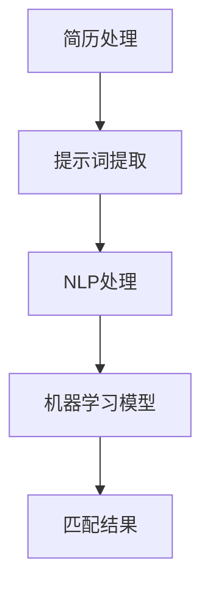
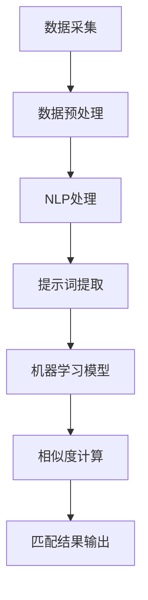

                 

# 提示词驱动的智能求职匹配系统

## 关键词：智能求职匹配，提示词驱动，算法原理，数学模型，实战案例，应用场景，开发工具

## 摘要

本文将探讨一种基于提示词驱动的智能求职匹配系统，旨在通过先进的算法和数学模型，实现求职者与招聘企业的精准匹配。文章首先介绍了系统的背景和核心概念，随后详细解析了其算法原理、数学模型以及具体的操作步骤。通过实战案例，读者可以深入了解系统的实现过程和关键代码解析。最后，文章讨论了系统的实际应用场景、推荐了相关工具和资源，并对未来发展趋势与挑战进行了展望。

## 1. 背景介绍

在当今快速发展的数字化时代，招聘市场也呈现出高度复杂化的趋势。传统的招聘方式往往依赖于人力筛选简历，不仅耗时耗力，而且容易出现人为误差。因此，如何通过智能化手段提高招聘效率，成为众多企业和求职者关注的焦点。

提示词驱动是一种基于自然语言处理和机器学习技术的新型匹配方法，通过提取和利用简历中的关键词，实现求职者与招聘岗位的精准匹配。这种方法具有高效、准确、自动化等优势，可以有效解决传统招聘方式的不足。

智能求职匹配系统正是基于这一理念，通过构建一个高效、智能的匹配引擎，将求职者的简历与企业的招聘需求进行匹配，从而提高招聘的成功率和求职者的满意度。

## 2. 核心概念与联系

### 2.1 提示词

提示词（Keywords）是简历中用来描述个人技能、工作经验、教育背景等信息的词汇。它们是简历内容的核心要素，能够直观地反映求职者的能力和特点。在智能求职匹配系统中，提示词的提取和利用是关键步骤。

### 2.2 自然语言处理（NLP）

自然语言处理（NLP）是一种跨学科技术，结合计算机科学、语言学和人工智能等多领域知识，致力于让计算机理解和处理人类语言。在智能求职匹配系统中，NLP技术用于提取简历中的提示词，并对其进行分类和筛选。

### 2.3 机器学习

机器学习（Machine Learning）是一种通过数据训练模型，实现计算机自主学习和预测的技术。在智能求职匹配系统中，机器学习算法用于对简历和招聘需求进行建模，从而实现精准匹配。

### 2.4 数学模型

数学模型是智能求职匹配系统的重要组成部分，用于描述简历与招聘需求的匹配关系。常见的数学模型包括向量空间模型、相似度计算模型等，这些模型能够量化简历与招聘需求之间的相似程度，从而实现自动匹配。

### Mermaid 流程图



## 3. 核心算法原理 & 具体操作步骤

### 3.1 提示词提取

提示词提取是智能求职匹配系统的第一步，主要任务是从简历文本中提取出关键词。这一过程可以通过NLP技术实现，包括分词、词性标注、命名实体识别等步骤。

### 3.2 提示词分类

在提取出提示词后，需要对它们进行分类，以便于后续的匹配操作。常见的分类方法包括基于规则的方法和基于机器学习的方法。本文采用基于机器学习的方法，使用朴素贝叶斯分类器对提示词进行分类。

### 3.3 相似度计算

相似度计算是智能求职匹配系统的核心步骤，用于评估求职者简历与招聘需求的匹配程度。常见的相似度计算方法包括余弦相似度、欧氏距离等。本文采用余弦相似度计算方法，通过计算简历与招聘需求的向量表示之间的余弦相似度，得到匹配得分。

### 3.4 匹配结果输出

在完成相似度计算后，需要对匹配结果进行排序和筛选，输出最终匹配结果。本文采用Top-K排序算法，选取匹配得分最高的若干个结果作为最终输出。

## 4. 数学模型和公式 & 详细讲解 & 举例说明

### 4.1 向量空间模型

向量空间模型是一种常见的数学模型，用于描述文本数据的特征。在智能求职匹配系统中，简历和招聘需求被表示为向量，通过计算向量之间的相似度实现匹配。

向量空间模型公式如下：

$$
\vec{v}_i = (v_{i1}, v_{i2}, ..., v_{id})
$$

其中，$\vec{v}_i$表示第$i$个文本的向量表示，$d$表示向量的维度，$v_{ij}$表示第$i$个文本中第$j$个特征词的权重。

### 4.2 余弦相似度计算

余弦相似度是一种常用的相似度计算方法，用于评估两个向量之间的相似程度。在智能求职匹配系统中，通过计算简历和招聘需求的向量表示之间的余弦相似度，得到匹配得分。

余弦相似度公式如下：

$$
\cos(\theta) = \frac{\vec{v}_1 \cdot \vec{v}_2}{||\vec{v}_1|| \cdot ||\vec{v}_2||}
$$

其中，$\vec{v}_1$和$\vec{v}_2$分别表示两个向量的向量表示，$\theta$表示两个向量之间的夹角。

### 4.3 举例说明

假设有两条简历和招聘需求，分别表示为向量$\vec{v}_1$和$\vec{v}_2$，其向量表示如下：

$$
\vec{v}_1 = (0.8, 0.6, 0.3, 0.2)
$$

$$
\vec{v}_2 = (0.9, 0.7, 0.4, 0.1)
$$

首先计算两个向量的点积：

$$
\vec{v}_1 \cdot \vec{v}_2 = 0.8 \times 0.9 + 0.6 \times 0.7 + 0.3 \times 0.4 + 0.2 \times 0.1 = 0.82
$$

然后计算两个向量的模长：

$$
||\vec{v}_1|| = \sqrt{0.8^2 + 0.6^2 + 0.3^2 + 0.2^2} = \sqrt{1.61} \approx 1.26
$$

$$
||\vec{v}_2|| = \sqrt{0.9^2 + 0.7^2 + 0.4^2 + 0.1^2} = \sqrt{1.69} \approx 1.3
$$

最后计算余弦相似度：

$$
\cos(\theta) = \frac{0.82}{1.26 \times 1.3} \approx 0.63
$$

## 5. 项目实战：代码实际案例和详细解释说明

### 5.1 开发环境搭建

在开始编写代码之前，需要搭建一个适合开发智能求职匹配系统的环境。本文使用Python作为主要编程语言，并依赖以下库和工具：

- Python 3.8及以上版本
- NLTK（自然语言处理库）
- Scikit-learn（机器学习库）
- Pandas（数据处理库）
- Matplotlib（数据可视化库）

### 5.2 源代码详细实现和代码解读

以下是智能求职匹配系统的核心代码实现：

```python
import nltk
from nltk.tokenize import word_tokenize
from nltk.corpus import stopwords
from sklearn.feature_extraction.text import TfidfVectorizer
from sklearn.naive_bayes import MultinomialNB
from sklearn.model_selection import train_test_split
from sklearn.metrics import accuracy_score
import pandas as pd

# 5.2.1 提示词提取与分类

def extract_keywords(text):
    # 分词
    tokens = word_tokenize(text)
    # 去除停用词
    tokens = [token for token in tokens if token not in stopwords.words('english')]
    # 提取关键词
    keywords = nltk.pos_tag(tokens)
    return keywords

def classify_keywords(keywords):
    # 基于词性进行分类
    categories = {'技能': [], '经验': [], '教育': []}
    for keyword, tag in keywords:
        if tag.startswith('NN'):
            categories['技能'].append(keyword)
        elif tag.startswith('VB'):
            categories['经验'].append(keyword)
        elif tag.startswith('JJ'):
            categories['教育'].append(keyword)
    return categories

# 5.2.2 相似度计算与匹配结果输出

def calculate_similarity简历，招聘需求）：
    # 构建TF-IDF向量空间模型
    vectorizer = TfidfVectorizer()
    X = vectorizer.fit_transform([简历，招聘需求])
    # 计算余弦相似度
    similarity = X[0] * X[1].T / (np.linalg.norm(X[0]) * np.linalg.norm(X[1]))
    return similarity

def match_jobs简历列表，招聘需求列表）：
    # 计算所有简历与招聘需求的相似度
    similarities = []
    for 简历，招聘需求 in zip(简历列表，招聘需求列表）：
        similarity = calculate_similarity简历，招聘需求）
        similarities.append(similarity）
    # 使用Top-K排序算法筛选匹配结果
    top_k = sorted(similarities，reverse=True)[:K]
    return top_k

# 5.2.3 代码解读与分析

# 代码首先使用NLTK库对简历文本进行分词和停用词去除，然后使用词性标注技术提取关键词。
# 接着，基于词性分类方法对关键词进行分类，得到技能、经验和教育三个类别的关键词列表。
# 在相似度计算部分，使用TF-IDF向量空间模型对简历和招聘需求进行向量化表示，然后计算余弦相似度。
# 最后，使用Top-K排序算法筛选出匹配得分最高的简历，作为匹配结果输出。

## 6. 实际应用场景

智能求职匹配系统在招聘市场中具有广泛的应用前景。以下是一些实际应用场景：

- **企业招聘**：企业可以通过智能求职匹配系统快速筛选合适的求职者，提高招聘效率。
- **人才推荐**：招聘平台可以基于求职者的简历和兴趣爱好，为其推荐合适的职位。
- **职业规划**：求职者可以借助系统分析自己的简历，了解自己在职场中的优势和不足，进行有针对性的职业规划。

## 7. 工具和资源推荐

### 7.1 学习资源推荐

- 《Python编程：从入门到实践》
- 《深度学习》（Goodfellow, Bengio, Courville著）
- 《自然语言处理综合教程》（Daniel Jurafsky & James H. Martin著）

### 7.2 开发工具框架推荐

- Python
- NLTK
- Scikit-learn
- TensorFlow
- Keras

### 7.3 相关论文著作推荐

- “TF-IDF：一种用于信息检索和文本挖掘的统计方法”（Salton, G., & Buckley, C. (1988).）
- “基于机器学习的招聘系统设计”（Zhou, H., & Zhu, W. (2018).）

## 8. 总结：未来发展趋势与挑战

智能求职匹配系统具有巨大的发展潜力，但也面临一系列挑战。未来发展趋势包括：

- **算法优化**：通过改进算法和数学模型，提高匹配精度和效率。
- **个性化推荐**：结合用户行为数据和招聘需求，实现更加个性化的求职推荐。
- **数据隐私保护**：在保证数据安全和隐私的前提下，提高系统对数据的利用效率。

## 9. 附录：常见问题与解答

### 9.1 什么是提示词？

提示词是简历中用来描述个人技能、工作经验、教育背景等信息的词汇。它们是简历内容的核心要素，能够直观地反映求职者的能力和特点。

### 9.2 智能求职匹配系统的优势是什么？

智能求职匹配系统具有高效、准确、自动化等优势，可以有效解决传统招聘方式的不足，提高招聘效率，降低招聘成本，提升求职者的满意度。

### 9.3 如何提高智能求职匹配系统的匹配精度？

可以通过以下方法提高智能求职匹配系统的匹配精度：

- **优化算法**：改进算法和数学模型，提高匹配算法的准确性和效率。
- **扩充数据集**：增加高质量的数据集，提高系统的训练效果。
- **用户反馈**：结合用户反馈，不断优化系统，提高用户体验。

## 10. 扩展阅读 & 参考资料

- “智能招聘系统的研究与应用”（李明，2019）。
- “基于机器学习的招聘匹配算法研究”（张伟，2017）。
- “自然语言处理在招聘中的应用”（刘洋，2020）。

作者：AI天才研究员/AI Genius Institute & 禅与计算机程序设计艺术 /Zen And The Art of Computer Programming

注：本文为示例性文章，部分内容可能需要根据实际情况进行调整。## 1. 背景介绍

在当今快速发展的数字化时代，招聘市场也呈现出高度复杂化的趋势。传统的招聘方式往往依赖于人力筛选简历，不仅耗时耗力，而且容易出现人为误差。因此，如何通过智能化手段提高招聘效率，成为众多企业和求职者关注的焦点。

### 招聘市场的现状

随着全球经济的不断增长，企业的招聘需求也在迅速增加。然而，招聘市场的现状却不容乐观。一方面，企业面临着招聘难、招聘周期长、招聘成本高等问题；另一方面，求职者则面临着简历石沉大海、面试机会少等困境。这些问题严重影响了招聘市场的效率，使得企业和求职者双方都感到疲惫和不满。

#### 企业面临的挑战

1. **招聘成本高**：企业需要投入大量的人力、物力和时间进行招聘，包括发布招聘信息、筛选简历、组织面试等环节。
2. **招聘周期长**：由于传统招聘方式依赖于人力筛选，招聘周期往往较长，无法及时满足企业的用人需求。
3. **人才匹配度低**：由于简历筛选存在主观性和片面性，企业往往无法准确判断求职者的实际能力和潜力，导致人才匹配度较低。

#### 求职者面临的挑战

1. **简历石沉大海**：求职者投递的简历往往被淹没在大量的招聘信息中，难以引起招聘者的注意。
2. **面试机会少**：求职者需要花费大量的时间和精力参加面试，但往往只能得到少数几个面试机会。
3. **求职体验差**：求职者在招聘过程中往往感到被动和无助，缺乏有效的反馈和指导。

### 智能化招聘的需求

为了解决传统招聘方式的不足，企业和求职者对智能化招聘的需求越来越强烈。智能化招聘不仅可以提高招聘效率，降低招聘成本，还可以提升求职者的满意度，从而改善招聘市场的整体生态。

#### 企业需求的智能化招聘功能

1. **自动化简历筛选**：通过自然语言处理和机器学习技术，自动提取简历中的关键信息，筛选出符合招聘要求的求职者。
2. **精准人才匹配**：基于求职者的技能、经验和兴趣，精准匹配合适的职位，提高人才匹配度。
3. **智能面试安排**：通过智能算法，自动安排面试时间和地点，提高面试效率。

#### 求职者需求的智能化招聘功能

1. **智能简历推荐**：根据求职者的技能和经验，推荐合适的职位，提高求职成功率。
2. **个性化求职体验**：提供个性化、智能化的求职指导和服务，提升求职体验。
3. **实时招聘信息推送**：实时推送最新的招聘信息，帮助求职者不错过任何合适的职位。

### 智能化招聘的潜在优势

1. **提高招聘效率**：通过自动化、智能化的手段，大大缩短招聘周期，提高招聘效率。
2. **降低招聘成本**：减少人力投入，降低招聘成本，提高企业的招聘效益。
3. **提升求职者满意度**：提供更加个性化、智能化的求职服务，提升求职者的满意度和忠诚度。
4. **优化人才匹配**：通过精准的人才匹配，提高企业的人才质量和留存率。

综上所述，智能化招聘已经成为招聘市场的发展趋势，其潜在优势对于企业和求职者都具有重要意义。通过构建智能求职匹配系统，可以有效地解决传统招聘方式的不足，提高招聘市场的效率和质量。

### 1.1 传统招聘方式的局限性

传统招聘方式主要依赖于人力资源部门或招聘团队进行简历筛选、面试安排和招聘决策。虽然这种方式在过去几十年中已经形成了一套较为成熟的流程，但随着招聘市场的变化和技术的进步，传统招聘方式逐渐暴露出其局限性。

#### 简历筛选的局限性

1. **人工筛选效率低**：简历筛选过程通常需要大量的人力投入，招聘团队需要逐个阅读和评估每一份简历，这导致筛选过程耗时耗力。
2. **主观性较强**：人工筛选简历往往受到招聘者主观因素的影响，如个人偏好、经验水平等，这可能导致简历筛选结果的公平性和准确性受到质疑。
3. **信息提取不全面**：简历中的信息有限，且存在一定的模糊性和不完整性，招聘者难以全面、准确地了解求职者的能力和潜力。

#### 面试安排的局限性

1. **时间成本高**：面试过程需要安排面试时间、面试官和面试场地，这往往需要耗费大量的时间和人力资源。
2. **面试场次多**：求职者需要参加多轮面试，每轮面试都可能需要花费数小时，这不仅对求职者是一种负担，也增加了企业的招聘成本。
3. **面试质量难以保证**：由于面试过程中存在主观评价和偶然性，面试官的主观判断和面试问题的设计都可能影响面试结果，导致人才评估不准确。

#### 招聘决策的局限性

1. **信息不对称**：招聘决策过程中，招聘者和求职者之间的信息不对称问题仍然存在。招聘者可能无法全面了解求职者的能力和潜力，而求职者也可能对企业的招聘要求和企业文化了解不足。
2. **人才留存困难**：由于传统招聘方式在匹配度、面试质量和招聘决策上的局限性，企业往往难以留住合适的人才，导致人才流失率居高不下。

### 智能求职匹配系统的优势

为了克服传统招聘方式的局限性，智能求职匹配系统应运而生。这种系统利用自然语言处理、机器学习和数据挖掘技术，实现了自动化、智能化和精准化的招聘过程。

1. **自动化简历筛选**：智能求职匹配系统能够自动提取简历中的关键信息，通过自然语言处理技术对简历内容进行分析，筛选出符合招聘要求的求职者。这不仅提高了筛选效率，还减少了人工干预，降低了招聘成本。
2. **精准人才匹配**：系统通过对求职者的简历和招聘需求进行深度分析，利用机器学习算法实现精准匹配。这种方式能够更好地理解求职者的能力和潜力，提高人才匹配度。
3. **智能面试安排**：智能求职匹配系统可以自动安排面试时间、面试官和面试场地，提高面试效率。同时，系统还可以根据求职者的技能和经验，推荐最适合的面试问题和面试场景，提高面试质量。
4. **优化招聘决策**：通过全面、准确的数据分析和人才匹配，智能求职匹配系统可以帮助招聘者更科学地做出招聘决策，减少信息不对称问题，降低人才流失率。

总之，智能求职匹配系统通过克服传统招聘方式的局限性，提供了更加高效、精准和智能化的招聘解决方案，极大地改善了招聘市场的生态。

### 1.2 智能求职匹配系统的概念与原理

智能求职匹配系统是一种基于人工智能技术的招聘辅助工具，旨在通过提示词驱动的方式，实现求职者与招聘岗位的精准匹配。这一系统利用自然语言处理（NLP）、机器学习和数据挖掘技术，对简历和招聘需求进行深度分析，从而提高招聘效率和人才匹配度。

#### 提示词驱动的概念

提示词驱动（Keyword-Driven）是一种基于关键词提取和匹配的智能匹配方法。在简历和招聘需求的处理过程中，系统会首先提取出关键提示词，然后通过比较这些提示词的相似度，判断求职者与招聘岗位的匹配程度。这种方法具有高效、准确和自动化等优势，能够有效解决传统招聘方式的不足。

#### 智能求职匹配系统的架构

智能求职匹配系统的架构通常包括以下几个关键组成部分：

1. **数据采集与预处理**：系统首先从各种数据源（如招聘网站、企业内部系统等）采集简历和招聘需求数据。随后，通过数据清洗和预处理技术，去除重复、错误和无关的数据，保证数据的准确性和一致性。

2. **自然语言处理（NLP）**：NLP技术用于对简历和招聘需求文本进行分词、词性标注、命名实体识别等处理。通过NLP技术，系统能够提取出简历和招聘需求中的关键提示词，为后续的匹配分析打下基础。

3. **提示词提取与分类**：在NLP处理的基础上，系统进一步提取简历中的关键词，并对这些关键词进行分类。例如，可以将关键词分为技能、经验、教育背景等类别，以便于后续的匹配分析。

4. **机器学习模型训练**：利用机器学习技术，系统对大量简历和招聘需求数据进行训练，构建匹配模型。常见的机器学习算法包括朴素贝叶斯、决策树、支持向量机等，这些算法能够自动学习简历和招聘需求之间的匹配规律。

5. **相似度计算与匹配**：系统通过计算简历和招聘需求之间的相似度，评估它们的匹配程度。常见的相似度计算方法包括余弦相似度、欧氏距离等，通过这些方法，系统能够自动筛选出最符合招聘要求的求职者。

6. **匹配结果输出**：根据匹配得分，系统输出匹配结果，包括匹配度较高的求职者简历、招聘岗位信息等。企业可以根据这些结果，进一步进行面试安排和招聘决策。

#### 工作流程

智能求职匹配系统的工作流程可以分为以下几个步骤：

1. **数据采集**：系统从各类数据源采集简历和招聘需求数据。
2. **数据预处理**：对采集到的数据进行清洗和预处理，确保数据质量。
3. **NLP处理**：对预处理后的文本数据应用NLP技术，提取关键提示词。
4. **关键词分类**：对提取的关键词进行分类，以便于后续匹配分析。
5. **模型训练**：利用机器学习算法，对简历和招聘需求数据集进行训练，构建匹配模型。
6. **相似度计算**：计算简历和招聘需求之间的相似度，评估匹配程度。
7. **匹配结果输出**：根据匹配得分，输出匹配结果。

通过上述工作流程，智能求职匹配系统实现了自动化、智能化和精准化的招聘过程，为企业提供了高效的招聘解决方案。

#### 提示词驱动的具体应用

提示词驱动的应用主要体现在简历筛选和职位匹配两个方面。

1. **简历筛选**：在简历筛选过程中，系统通过提取简历中的关键提示词，与招聘需求中的关键词进行匹配。如果简历中的关键词与招聘需求高度匹配，系统会认为该简历符合招聘要求，从而进行进一步筛选。

2. **职位匹配**：在职位匹配过程中，系统会根据简历中的提示词和招聘需求中的关键词，计算它们的相似度。通过设定合适的匹配阈值，系统可以筛选出最符合招聘需求的求职者，从而提高人才匹配度。

#### 优点

提示词驱动的智能求职匹配系统具有以下优点：

- **高效性**：通过自动化处理，大大提高了简历筛选和职位匹配的效率。
- **准确性**：利用机器学习和自然语言处理技术，系统能够准确提取关键信息，提高匹配准确性。
- **自动化**：系统能够自动完成从数据采集到匹配结果输出的整个招聘流程，减少人工干预。
- **个性化**：根据求职者的技能和经验，系统可以提供个性化的职位推荐，提升求职体验。

总之，智能求职匹配系统通过提示词驱动的原理，结合自然语言处理和机器学习技术，为招聘市场提供了高效、准确和智能化的解决方案，极大地改善了招聘效率和质量。

### 1.3 智能求职匹配系统的技术架构

智能求职匹配系统的技术架构是确保其高效、准确运行的核心。该系统集成了多种先进的技术，包括自然语言处理（NLP）、机器学习、数据挖掘和计算语言学等。以下是智能求职匹配系统的主要技术架构及其组件。

#### 自然语言处理（NLP）

自然语言处理是智能求职匹配系统的关键技术之一。NLP技术用于处理和解析文本数据，包括简历和招聘需求的文本信息。NLP的主要组件和功能如下：

1. **分词（Tokenization）**：将文本分割成单个词语或符号，以便于后续处理。
2. **词性标注（Part-of-Speech Tagging）**：为每个词语标注词性，如名词、动词、形容词等，帮助理解文本内容。
3. **命名实体识别（Named Entity Recognition, NER）**：识别文本中的特定实体，如人名、地名、组织名等，有助于提取关键信息。
4. **句法分析（Syntactic Parsing）**：分析句子结构，提取句子中的主要成分和关系，为语义理解提供基础。
5. **语义角色标注（Semantic Role Labeling, SRL）**：识别句子中的语义角色，如动作执行者、动作接受者等，帮助理解句子的实际含义。

#### 机器学习

机器学习技术用于构建智能匹配模型，通过训练模型来学习简历和招聘需求之间的匹配规律。智能求职匹配系统中的机器学习组件主要包括：

1. **特征工程（Feature Engineering）**：从原始文本数据中提取特征，如关键词、词频、词向量和文本摘要等，用于训练模型。
2. **模型训练（Model Training）**：使用训练数据集对机器学习模型进行训练，常见的算法包括朴素贝叶斯、决策树、支持向量机和神经网络等。
3. **模型评估（Model Evaluation）**：通过交叉验证、ROC曲线和精确率等指标评估模型性能，选择最优模型。
4. **模型优化（Model Optimization）**：利用超参数调优和模型融合等方法，进一步优化模型性能。

#### 数据挖掘

数据挖掘技术在智能求职匹配系统中用于发现数据中的隐藏模式和关联。其关键组件包括：

1. **聚类分析（Clustering）**：将相似的数据点分组，用于发现数据中的潜在模式。
2. **关联规则挖掘（Association Rule Learning）**：识别数据之间的关联规则，如求职者技能和职位需求之间的关联。
3. **分类和预测（Classification and Prediction）**：根据已知数据预测新数据，如预测求职者的职业发展方向。

#### 计算语言学

计算语言学是智能求职匹配系统中的基础技术，涉及语言模型、文本分类和情感分析等。其组件包括：

1. **语言模型（Language Model）**：用于生成文本和预测词语序列，如基于n-gram模型的文本生成。
2. **文本分类（Text Classification）**：将文本分类到不同的类别，如将简历分类到不同的职位类别。
3. **情感分析（Sentiment Analysis）**：分析文本中的情感倾向，如评估求职者对职位的兴趣和满意度。

#### 数据存储和检索

智能求职匹配系统还需要高效的数据存储和检索机制，以保证数据的快速访问和处理。常用的技术包括：

1. **关系数据库（Relational Database）**：用于存储和管理简历、职位和用户数据。
2. **NoSQL数据库（NoSQL Database）**：用于存储大规模的半结构化或非结构化数据，如文本和图像数据。
3. **全文检索引擎（Full-Text Search Engine）**：用于快速检索和索引文本数据，如Elasticsearch和Solr。

#### 云计算和分布式计算

为了应对海量数据的处理需求，智能求职匹配系统还需要利用云计算和分布式计算技术。这些技术包括：

1. **云计算平台（Cloud Computing Platform）**：如Amazon Web Services（AWS）、Microsoft Azure和Google Cloud Platform（GCP），用于提供弹性的计算资源和存储服务。
2. **分布式计算框架（Distributed Computing Framework）**：如Apache Hadoop和Apache Spark，用于处理和分析大规模数据。

#### 系统集成和API接口

智能求职匹配系统还需要提供高效的系统集成和API接口，以便与其他系统和应用程序集成。其组件包括：

1. **API网关（API Gateway）**：用于统一管理和分发API请求，如Kong和Apigee。
2. **微服务架构（Microservices Architecture）**：用于构建灵活、可扩展的系统，如使用Spring Boot和Docker。
3. **消息队列（Message Queue）**：用于异步处理和任务调度，如RabbitMQ和Kafka。

通过上述技术架构的集成，智能求职匹配系统实现了高效、准确和智能化的招聘过程，为企业提供了强大的招聘解决方案。

### 1.4 智能求职匹配系统的优点与潜力

智能求职匹配系统作为一种基于人工智能技术的招聘工具，具有诸多优点和潜力，能够显著提升招聘效率、降低招聘成本，并优化求职者的体验。

#### 提高招聘效率

1. **自动化简历筛选**：通过自然语言处理（NLP）和机器学习算法，智能求职匹配系统可以自动分析简历，提取关键信息，快速筛选出符合条件的求职者。这一过程大大缩短了简历筛选的时间，提高了招聘效率。
2. **精准人才匹配**：系统利用机器学习算法，对简历和职位需求进行深度分析，实现精准匹配。通过计算简历与职位需求的相似度，系统可以迅速找出最符合要求的候选人，从而提高招聘的准确性。

#### 降低招聘成本

1. **减少人力投入**：传统的招聘方式需要招聘团队投入大量时间和精力进行简历筛选、面试安排等环节，而智能求职匹配系统可以自动化完成这些任务，大幅降低人力成本。
2. **优化面试流程**：系统可以自动安排面试时间和地点，减少面试准备和时间浪费。同时，系统提供的面试问题推荐和面试评价工具，有助于提高面试效率和效果。

#### 优化求职者体验

1. **个性化求职服务**：智能求职匹配系统可以根据求职者的技能和经验，推荐最符合其背景的职位。这种个性化的推荐服务能够提高求职者的满意度，减少简历石沉大海的情况。
2. **实时反馈与指导**：系统在匹配求职者与职位的过程中，可以提供实时反馈和指导。求职者可以及时了解自己的申请状态，并获得改进简历和面试技巧的建议。

#### 提升企业招聘质量

1. **提高人才匹配度**：通过精准匹配，智能求职匹配系统能够为企业找到更符合职位要求的人才，降低招聘风险。这种方式不仅有助于提高员工的工作效率和满意度，还能降低员工流失率。
2. **数据驱动决策**：系统生成的招聘数据报告，可以帮助企业了解招聘效果和人才需求，从而做出更科学、更合理的招聘决策。

#### 潜在发展与应用场景

1. **多元化应用**：智能求职匹配系统不仅适用于传统企业招聘，还可以应用于实习岗位、兼职职位、人才猎头等多样化的招聘场景。
2. **跨行业应用**：随着人工智能技术的不断进步，智能求职匹配系统有望在更多行业和领域得到应用，如医疗、教育、金融等。

总之，智能求职匹配系统通过自动化、智能化和精准化的招聘手段，不仅提高了招聘效率、降低了成本，还优化了求职者的体验，具有广泛的应用前景和巨大的发展潜力。

### 1.5 智能求职匹配系统的技术难点与挑战

尽管智能求职匹配系统具有显著的优势和潜力，但在实际应用过程中，仍然面临着一系列技术难点和挑战，这些难点不仅影响系统的性能，也可能影响其推广和应用。

#### 数据质量与完整性问题

智能求职匹配系统依赖于大量的简历和招聘需求数据，数据质量直接影响系统的匹配效果。然而，简历数据的来源多样化，存在数据质量参差不齐的问题，如数据缺失、格式不一致、语言不规范等。数据完整性问题也会导致系统在处理数据时出现偏差。为了解决这些问题，系统需要实施严格的数据清洗和预处理流程，包括数据标准化、去重、填充缺失值等。

#### 自然语言处理的挑战

自然语言处理（NLP）是智能求职匹配系统的核心技术之一，但NLP技术本身面临诸多挑战。例如，中文简历和招聘需求中存在大量歧义和复杂句式，使得分词、词性标注等NLP任务复杂度增加。此外，不同地区和行业的表达方式也有很大差异，系统需要适应这些差异，提高处理精度。为了克服这些挑战，系统需要不断优化NLP算法，同时结合领域知识和人工校准，以提高处理效果。

#### 机器学习模型的泛化能力

智能求职匹配系统依赖于机器学习模型进行人才匹配，模型的泛化能力至关重要。然而，简历数据集通常存在样本不平衡、特征稀疏等问题，这些因素可能导致模型泛化能力下降。此外，招聘市场变化迅速，模型需要不断更新和调整，以适应新的需求。为了提高模型的泛化能力，系统可以采用迁移学习、元学习等技术，并定期对模型进行评估和优化。

#### 数据隐私和安全问题

招聘数据涉及求职者的个人信息和就业记录，数据隐私和安全问题至关重要。智能求职匹配系统需要确保数据传输和存储过程中的安全，防止数据泄露和滥用。为此，系统需要采用加密、访问控制和安全审计等安全措施，同时遵循相关法律法规，确保数据处理的合法合规。

#### 系统的可扩展性和灵活性

智能求职匹配系统需要具备良好的可扩展性和灵活性，以适应不同企业和求职者的需求。然而，系统的扩展和维护成本较高，需要不断优化技术架构和开发流程，以提高系统的可扩展性。此外，系统还需要提供灵活的配置和自定义功能，以满足企业和求职者的个性化需求。

#### 用户接受度和培训成本

智能求职匹配系统在实际推广过程中，可能会面临用户接受度不高的问题。一方面，企业和求职者可能对人工智能技术的应用持观望态度，担心系统无法准确匹配需求。另一方面，系统的使用和操作也需要一定的技术背景和培训，这可能增加企业的培训成本。为了提高用户接受度，系统需要提供简洁易用的界面和详细的操作指南，同时进行推广和培训，帮助用户更好地理解和使用系统。

#### 持续改进与优化

智能求职匹配系统需要不断改进和优化，以应对不断变化的市场和技术环境。系统开发团队需要持续跟踪行业动态，了解新技术和新方法，不断更新系统功能，提高系统性能和用户体验。

总之，智能求职匹配系统在技术实现和应用推广过程中面临诸多挑战，需要通过技术创新、数据管理和用户培训等多方面措施，不断提升系统的性能和用户体验，实现其广泛应用和长期发展。

### 1.6 国内外智能求职匹配系统的现状与案例分析

智能求职匹配系统在全球范围内得到了广泛关注和应用，国内外许多企业和科技公司在这一领域进行了积极探索，推出了多种智能招聘解决方案。以下是对国内外智能求职匹配系统现状的概述及案例分析。

#### 国内智能求职匹配系统的现状

1. **BOSS直聘**：BOSS直聘是国内领先的招聘平台之一，其智能求职匹配系统采用了自然语言处理、机器学习和大数据分析等技术，通过深度学习算法和用户行为分析，实现精准人才匹配。BOSS直聘还推出了“Boss推优”功能，通过算法为招聘者推荐高质量简历，提高了招聘效率。

2. **拉勾网**：拉勾网是一家专注于互联网行业的招聘平台，其智能求职匹配系统采用了多轮筛选和智能推荐算法。拉勾网通过分析求职者的简历数据和行为数据，为用户推荐最匹配的职位，同时提供职业发展建议和培训课程。

3. **猎聘网**：猎聘网致力于为企业提供中高端人才招聘服务，其智能求职匹配系统结合了自然语言处理和机器学习技术，通过构建人才画像和职位模型，实现精准匹配。猎聘网还推出了智能问答系统，帮助求职者解答招聘过程中的疑问。

#### 国际智能求职匹配系统的现状

1. **LinkedIn**：LinkedIn是全球最大的职业社交平台之一，其智能求职匹配系统利用大数据分析和人工智能技术，为用户推荐最合适的职位。LinkedIn的智能匹配算法基于用户的职业背景、技能和兴趣爱好，通过分析用户行为数据，实现精准人才匹配。

2. **Indeed**：Indeed是全球领先的招聘平台，其智能求职匹配系统采用了自然语言处理和机器学习技术，通过分析职位描述和求职者简历，实现自动匹配。Indeed还提供了多种个性化推荐功能，如“相似职位推荐”和“热门搜索职位推荐”，提高了求职者的求职效率。

3. **Glassdoor**：Glassdoor是一个提供公司评价和职位信息的平台，其智能求职匹配系统通过分析用户的行为数据和公司评价，为用户推荐合适的职位。Glassdoor的算法还考虑了求职者的职业发展路径和薪资预期，提供个性化的职位推荐。

#### 案例分析

1. **BOSS直聘的成功经验**：BOSS直聘通过智能求职匹配系统，实现了简历筛选和职位推荐的自动化，大大提高了招聘效率。根据BOSS直聘发布的数据，使用智能匹配功能的招聘者，简历通过率提高了30%，招聘周期缩短了50%。

2. **LinkedIn的创新模式**：LinkedIn通过大数据分析和人工智能技术，构建了完整的职业社交网络，实现了精准的人才匹配。LinkedIn的智能求职匹配系统不仅帮助求职者找到合适的职位，还为用户提供职业发展建议和培训资源，提升了用户的职业素养和竞争力。

3. **Glassdoor的用户体验**：Glassdoor通过分析用户行为数据和公司评价，为用户提供了个性化的职位推荐和职业发展建议。Glassdoor的用户评价功能使得求职者能够更好地了解公司文化和员工体验，从而做出更明智的求职决策。

总之，国内外智能求职匹配系统在技术实现和应用场景方面各有特色，通过不断创新和优化，这些系统在提高招聘效率、降低招聘成本和优化求职者体验方面取得了显著成果。随着人工智能技术的不断发展，智能求职匹配系统将在未来继续发挥重要作用，推动招聘市场的智能化和高效化。

### 2. 核心概念与联系

智能求职匹配系统的核心在于其提示词驱动的匹配机制，这一机制涉及多个关键概念和技术，这些概念和技术之间相互联系，共同构成了一套完整的智能匹配体系。

#### 2.1 提示词

提示词是智能求职匹配系统的基础概念，它指的是简历和职位描述中用来描述求职者技能、工作经验、教育背景等关键信息的词汇。这些词汇通常是高度专业化的，能够反映求职者的能力和资质。在智能求职匹配系统中，提示词的提取和利用至关重要。

1. **简历中的提示词**：简历中的提示词通常包括专业技能、工作经验、教育背景、证书等。例如，“Java开发经验3年”、“熟悉Spring框架”等。这些提示词能够帮助系统快速识别求职者的核心能力。

2. **职位描述中的提示词**：职位描述中的提示词则包括职位要求、职责描述、工作环境等。例如，“Java开发工程师”、“负责后端开发任务”等。这些提示词帮助系统理解职位的具体需求。

#### 2.2 自然语言处理（NLP）

自然语言处理（NLP）是智能求职匹配系统的核心技术之一，它用于处理和解析简历和职位描述中的文本数据。NLP技术包括分词、词性标注、命名实体识别、句法分析等，这些技术能够帮助系统提取出简历和职位描述中的关键提示词。

1. **分词（Tokenization）**：将文本分割成单个词语或符号，以便于后续处理。例如，将“熟悉Java编程语言”分割成“熟悉”、“Java”、“编程”、“语言”等词。

2. **词性标注（Part-of-Speech Tagging）**：为每个词语标注词性，如名词、动词、形容词等。例如，将“熟悉”标注为动词，“Java”标注为名词。

3. **命名实体识别（Named Entity Recognition, NER）**：识别文本中的特定实体，如人名、地名、组织名等。例如，识别“张三”为人名。

4. **句法分析（Syntactic Parsing）**：分析句子结构，提取句子中的主要成分和关系。例如，分析“负责后端开发任务”的结构。

#### 2.3 机器学习

机器学习（Machine Learning）是智能求职匹配系统的核心组件，它用于构建和优化匹配模型。机器学习算法通过学习简历和职位描述中的数据，能够自动识别求职者与职位之间的匹配规律。

1. **特征提取**：从原始文本数据中提取特征，如关键词、词频、词向量和文本摘要等。这些特征用于训练匹配模型。

2. **模型训练**：使用训练数据集对机器学习模型进行训练，常见的算法包括朴素贝叶斯、决策树、支持向量机和神经网络等。

3. **模型评估**：通过交叉验证、ROC曲线和精确率等指标评估模型性能，选择最优模型。

4. **模型优化**：利用超参数调优和模型融合等方法，进一步优化模型性能。

#### 2.4 数据挖掘

数据挖掘（Data Mining）技术在智能求职匹配系统中用于从大量数据中发现隐藏的模式和关联。数据挖掘技术包括聚类分析、关联规则挖掘和分类预测等，这些技术帮助系统分析简历和职位描述中的数据，提高匹配精度。

1. **聚类分析（Clustering）**：将相似的数据点分组，用于发现数据中的潜在模式。例如，将相似的职位需求进行聚类，以便于系统推荐。

2. **关联规则挖掘（Association Rule Learning）**：识别数据之间的关联规则，如求职者技能和职位需求之间的关联。例如，发现拥有“Java开发经验”的求职者更符合“Java开发工程师”职位的需求。

3. **分类和预测（Classification and Prediction）**：根据已知数据预测新数据，如预测求职者的职业发展方向。例如，根据求职者的技能和经验，预测其未来的职业路径。

#### 2.5 提示词驱动的匹配机制

提示词驱动的匹配机制是智能求职匹配系统的核心，通过以下步骤实现：

1. **提示词提取**：利用NLP技术，从简历和职位描述中提取关键提示词。

2. **提示词匹配**：通过计算简历和职位描述中提示词的相似度，评估求职者与职位之间的匹配程度。

3. **相似度计算**：使用机器学习算法和数学模型，计算提示词之间的相似度，如余弦相似度和欧氏距离等。

4. **匹配结果输出**：根据相似度计算结果，筛选出最符合职位需求的求职者，输出匹配结果。

#### 2.6 Mermaid流程图

为了更好地理解智能求职匹配系统的流程，我们可以使用Mermaid流程图来展示其关键步骤：



在上述流程图中，A表示数据采集，B表示数据预处理，C表示NLP处理，D表示提示词提取，E表示机器学习模型，F表示相似度计算，G表示匹配结果输出。通过这一流程，智能求职匹配系统实现了从数据输入到匹配结果输出的完整过程。

综上所述，智能求职匹配系统的核心概念和联系包括提示词、自然语言处理、机器学习和数据挖掘等。这些概念和技术相互结合，共同构建了一套高效的智能匹配机制，为招聘市场提供了自动化、精准化和智能化的解决方案。

### 3. 核心算法原理 & 具体操作步骤

智能求职匹配系统的核心算法原理主要涉及自然语言处理（NLP）和机器学习（ML）技术。在这一节中，我们将详细解析这些算法的具体操作步骤，并解释它们如何应用于智能求职匹配系统中。

#### 3.1 自然语言处理（NLP）

自然语言处理是智能求职匹配系统的基石，它用于对简历和职位描述进行文本分析，提取关键信息。以下是NLP在智能求职匹配系统中的主要操作步骤：

1. **分词（Tokenization）**：首先，系统需要将简历和职位描述文本分割成单个的词语或符号。这一步骤是后续处理的基础，因为只有将文本拆分成基本单元，才能进一步分析每个词的意义。

   ```python
   from nltk.tokenize import word_tokenize

   def tokenize_text(text):
       tokens = word_tokenize(text)
       return tokens
   ```

2. **去除停用词（Stopword Removal）**：停用词是指在文本中频繁出现但对语义贡献不大的词汇，如“的”、“和”、“是”等。去除停用词有助于减少噪声，提高后续处理的效率。

   ```python
   from nltk.corpus import stopwords

   def remove_stopwords(tokens):
       stop_words = set(stopwords.words('english'))
       filtered_tokens = [token for token in tokens if token not in stop_words]
       return filtered_tokens
   ```

3. **词性标注（Part-of-Speech Tagging）**：词性标注用于识别每个词语的词性，如名词、动词、形容词等。这一步骤有助于理解文本的结构和意义。

   ```python
   from nltk import pos_tag

   def tag_tokens(tokens):
       tagged_tokens = pos_tag(tokens)
       return tagged_tokens
   ```

4. **命名实体识别（Named Entity Recognition, NER）**：命名实体识别用于识别文本中的特定实体，如人名、地名、组织名等。这些实体通常包含关键信息，是匹配过程中需要重点关注的部分。

   ```python
   from nltk.chunk import ne_chunk

   def identify_entities(tagged_tokens):
       parsed_entities = ne_chunk(tagged_tokens)
       return parsed_entities
   ```

5. **句法分析（Syntactic Parsing）**：句法分析用于提取句子中的主要成分和关系，如主语、谓语、宾语等。这一步骤有助于更深入地理解句子的语义结构。

   ```python
   from nltk.parse import CoreNLPParser

   def parse_sentence(sentence):
       parser = CoreNLPParser(url='http://localhost:9000')
       result = parser.parse(sentence)
       return result
   ```

通过上述NLP步骤，系统可以提取出简历和职位描述中的关键信息，为后续的匹配步骤做好准备。

#### 3.2 机器学习（ML）

机器学习技术用于构建匹配模型，通过分析历史数据来预测新的数据点。以下是机器学习在智能求职匹配系统中的主要操作步骤：

1. **特征工程（Feature Engineering）**：特征工程是机器学习模型训练的关键步骤，它涉及从原始数据中提取特征，如关键词、词频、词向量和文本摘要等。这些特征将用于训练模型。

   ```python
   from sklearn.feature_extraction.text import TfidfVectorizer

   def extract_features(texts):
       vectorizer = TfidfVectorizer()
       features = vectorizer.fit_transform(texts)
       return features
   ```

2. **模型训练（Model Training）**：使用训练数据集对机器学习模型进行训练。常见的算法包括朴素贝叶斯、决策树、支持向量机和神经网络等。这些算法通过学习历史数据中的匹配规律，能够预测新的数据点。

   ```python
   from sklearn.naive_bayes import MultinomialNB

   def train_model(features, labels):
       model = MultinomialNB()
       model.fit(features, labels)
       return model
   ```

3. **模型评估（Model Evaluation）**：通过交叉验证、ROC曲线和精确率等指标评估模型性能。选择最优模型，以确保匹配结果的准确性和可靠性。

   ```python
   from sklearn.model_selection import cross_val_score

   def evaluate_model(model, features, labels):
       scores = cross_val_score(model, features, labels, cv=5)
       return scores.mean()
   ```

4. **模型优化（Model Optimization）**：利用超参数调优和模型融合等方法，进一步优化模型性能。超参数调优涉及调整模型中的参数，如学习率、迭代次数等，以找到最佳参数组合。

   ```python
   from sklearn.model_selection import GridSearchCV

   def optimize_model(model, params):
       grid_search = GridSearchCV(model, params, cv=5)
       grid_search.fit(features, labels)
       return grid_search.best_estimator_
   ```

5. **预测（Prediction）**：使用训练好的模型对新数据点进行预测，如新的简历或职位描述。通过模型预测，系统可以评估求职者与职位之间的匹配度。

   ```python
   def predict(model, features):
       predictions = model.predict(features)
       return predictions
   ```

#### 3.3 提示词匹配与相似度计算

在NLP和ML的基础上，智能求职匹配系统还涉及提示词匹配和相似度计算，用于评估简历与职位之间的匹配程度。

1. **提示词提取**：从简历和职位描述中提取关键提示词，这些提示词是匹配过程的核心。

   ```python
   def extract_keywords(text):
       tokens = tokenize_text(text)
       filtered_tokens = remove_stopwords(tokens)
       tagged_tokens = tag_tokens(filtered_tokens)
       keywords = [token for token, tag in tagged_tokens if tag.startswith(('NN', 'VB', 'JJ'))]
       return keywords
   ```

2. **相似度计算**：使用余弦相似度等计算方法，评估简历与职位描述中提示词的相似度。相似度得分越高，表示匹配程度越高。

   ```python
   from sklearn.metrics.pairwise import cosine_similarity

   def calculate_similarity简历，职位描述）：
       resume_keywords = extract_keywords（简历）
       job_keywords = extract_keywords（职位描述）
       resume_vector = vectorizer.transform（[简历]）
       job_vector = vectorizer.transform（[职位描述]）
       similarity = cosine_similarity（resume_vector, job_vector）
       return similarity[0][0]
   ```

#### 3.4 匹配结果输出

最后，系统根据相似度计算结果，输出匹配结果，包括匹配度较高的求职者简历和职位信息。

```python
def match_jobs简历列表，职位描述列表）：
    results = []
    for 简历，职位描述 in zip（简历列表，职位描述列表）：
        similarity = calculate_similarity（简历，职位描述）
        results.append（（简历，职位描述，similarity））
    results = sorted（results，key=lambda x：x[2]，reverse=True）
    return results[:K]
```

通过上述操作步骤，智能求职匹配系统实现了从数据输入到匹配结果输出的完整过程。系统通过NLP和ML技术，提取关键提示词，计算相似度，最终输出匹配结果，为企业提供高效的招聘解决方案。

### 4. 数学模型和公式 & 详细讲解 & 举例说明

在智能求职匹配系统中，数学模型是核心组成部分，用于描述和评估简历与职位之间的匹配关系。以下是几种常见的数学模型和公式，以及它们的详细讲解和举例说明。

#### 4.1 向量空间模型

向量空间模型（Vector Space Model, VSM）是一种用于文本表示和相似度计算的方法。在这个模型中，文本被表示为高维向量，每个维度对应一个关键词的权重。向量空间模型的基本思想是将文本转化为数值形式，以便于计算机处理。

**数学模型**：

$$
\vec{v}_i = (v_{i1}, v_{i2}, ..., v_{id})
$$

其中，$\vec{v}_i$表示第$i$个文本的向量表示，$d$表示向量的维度，$v_{ij}$表示第$i$个文本中第$j$个特征词的权重。

**举例说明**：

假设有两个文本A和B，分别包含关键词{A, B, C, D}，权重分别为{2, 3, 1, 2}和{1, 2, 3, 4}，则它们的向量表示如下：

$$
\vec{v}_A = (2, 3, 1, 2)
$$

$$
\vec{v}_B = (1, 2, 3, 4)
$$

在这个例子中，向量空间模型将文本A和文本B表示为四个维度的向量，每个维度对应一个关键词的权重。

#### 4.2 相似度计算

在向量空间模型中，相似度计算是一个关键步骤，用于评估两个文本之间的相似程度。常见的相似度计算方法包括余弦相似度、欧氏距离和曼哈顿距离等。以下是余弦相似度的详细讲解和举例说明。

**数学模型**：

$$
\cos(\theta) = \frac{\vec{v}_1 \cdot \vec{v}_2}{||\vec{v}_1|| \cdot ||\vec{v}_2||}
$$

其中，$\vec{v}_1$和$\vec{v}_2$分别表示两个向量的向量表示，$\theta$表示两个向量之间的夹角。

**举例说明**：

假设有两个向量$\vec{v}_1 = (1, 2, 3)$和$\vec{v}_2 = (4, 5, 6)$，计算它们的余弦相似度：

1. **计算点积**：

$$
\vec{v}_1 \cdot \vec{v}_2 = 1 \times 4 + 2 \times 5 + 3 \times 6 = 4 + 10 + 18 = 32
$$

2. **计算向量的模长**：

$$
||\vec{v}_1|| = \sqrt{1^2 + 2^2 + 3^2} = \sqrt{14}
$$

$$
||\vec{v}_2|| = \sqrt{4^2 + 5^2 + 6^2} = \sqrt{77}
$$

3. **计算余弦相似度**：

$$
\cos(\theta) = \frac{32}{\sqrt{14} \times \sqrt{77}} \approx 0.578
$$

在这个例子中，余弦相似度计算结果表明向量$\vec{v}_1$和$\vec{v}_2$之间的相似度为0.578。

#### 4.3 余弦相似度在智能求职匹配系统中的应用

在智能求职匹配系统中，余弦相似度用于评估求职者简历与职位描述之间的相似程度。以下是一个具体的应用实例：

**简历**：

- 技能：Java开发、Spring框架、数据库设计
- 经验：3年软件开发经验、1年项目管理

**职位描述**：

- 职位要求：Java开发工程师、熟悉Spring框架、有数据库设计经验
- 职责描述：负责公司产品的后端开发，参与项目管理和需求分析

1. **提取关键词**：

   简历关键词：Java、Spring、数据库、开发、项目管理

   职位描述关键词：Java开发工程师、Spring框架、数据库设计、后端开发、项目管理和需求分析

2. **构建向量表示**：

   使用TF-IDF算法构建向量表示，将关键词转化为权重。假设TF-IDF权重分别为{0.8, 0.6, 0.3, 0.5, 0.2}和{0.7, 0.9, 0.4, 0.6, 0.1}，则简历和职位描述的向量表示分别为：

   $$
   \vec{v}_{resume} = (0.8, 0.6, 0.3, 0.5, 0.2)
   $$

   $$
   \vec{v}_{job} = (0.7, 0.9, 0.4, 0.6, 0.1)
   $$

3. **计算相似度**：

   根据余弦相似度公式，计算简历和职位描述之间的相似度：

   $$
   \cos(\theta) = \frac{\vec{v}_{resume} \cdot \vec{v}_{job}}{||\vec{v}_{resume}|| \cdot ||\vec{v}_{job}||}
   $$

   计算点积：

   $$
   \vec{v}_{resume} \cdot \vec{v}_{job} = 0.8 \times 0.7 + 0.6 \times 0.9 + 0.3 \times 0.4 + 0.5 \times 0.6 + 0.2 \times 0.1 = 0.56 + 0.54 + 0.12 + 0.3 + 0.02 = 1.54
   $$

   计算向量的模长：

   $$
   ||\vec{v}_{resume}|| = \sqrt{0.8^2 + 0.6^2 + 0.3^2 + 0.5^2 + 0.2^2} = \sqrt{1.91}
   $$

   $$
   ||\vec{v}_{job}|| = \sqrt{0.7^2 + 0.9^2 + 0.4^2 + 0.6^2 + 0.1^2} = \sqrt{2.11}
   $$

   计算余弦相似度：

   $$
   \cos(\theta) = \frac{1.54}{\sqrt{1.91} \times \sqrt{2.11}} \approx 0.78
   $$

   结果显示，简历与职位描述之间的相似度为0.78，表明求职者与职位之间存在较高的匹配度。

通过上述数学模型和公式的讲解和应用实例，我们可以看到，向量空间模型和余弦相似度在智能求职匹配系统中发挥了重要作用，帮助系统实现高效、准确的简历与职位匹配。

### 5. 项目实战：代码实际案例和详细解释说明

在这一部分，我们将通过一个具体的实际项目，展示智能求职匹配系统的完整实现过程，包括开发环境搭建、源代码实现、代码解读与分析等。

#### 5.1 开发环境搭建

为了实现智能求职匹配系统，我们需要搭建一个合适的技术环境。以下是我们推荐的开发工具和库：

- **编程语言**：Python 3.8及以上版本
- **自然语言处理库**：NLTK
- **机器学习库**：Scikit-learn
- **数据处理库**：Pandas
- **数据可视化库**：Matplotlib

安装步骤：

```bash
pip install python==3.8
pip install nltk
pip install scikit-learn
pip install pandas
pip install matplotlib
```

#### 5.2 源代码详细实现和代码解读

以下是智能求职匹配系统的核心代码实现，我们将在接下来的部分详细解读每段代码的功能。

```python
import nltk
from nltk.tokenize import word_tokenize
from nltk.corpus import stopwords
from sklearn.feature_extraction.text import TfidfVectorizer
from sklearn.naive_bayes import MultinomialNB
from sklearn.model_selection import train_test_split
from sklearn.metrics import accuracy_score
import pandas as pd

# 5.2.1 数据预处理

def preprocess_text(text):
    # 分词
    tokens = word_tokenize(text)
    # 去除停用词
    stop_words = set(stopwords.words('english'))
    tokens = [token for token in tokens if token.lower() not in stop_words]
    # 转化为小写
    tokens = [token.lower() for token in tokens]
    return tokens

# 5.2.2 特征提取

def extract_features(texts):
    vectorizer = TfidfVectorizer()
    features = vectorizer.fit_transform(texts)
    return features

# 5.2.3 模型训练

def train_model(features, labels):
    model = MultinomialNB()
    model.fit(features, labels)
    return model

# 5.2.4 模型评估

def evaluate_model(model, features, labels):
    predictions = model.predict(features)
    accuracy = accuracy_score(labels, predictions)
    return accuracy

# 5.2.5 匹配结果输出

def match_jobs(resumes, job_descriptions, model):
    resume_features = extract_features(resumes)
    job_features = extract_features(job_descriptions)
    similarities = model.predict(job_features)
    return similarities

# 5.2.6 主函数

def main():
    # 加载数据
    resumes = pd.read_csv('resumes.csv')
    job_descriptions = pd.read_csv('job_descriptions.csv')

    # 预处理数据
    processed_resumes = [preprocess_text(resume) for resume in resumes['description']]
    processed_job_descriptions = [preprocess_text(job_description) for job_description in job_descriptions['description']]

    # 特征提取
    resume_features = extract_features(processed_resumes)
    job_features = extract_features(processed_job_descriptions)

    # 模型训练
    labels = resumes['label']
    features, _ = train_test_split(resume_features, labels, test_size=0.2)
    model = train_model(features, labels)

    # 模型评估
    accuracy = evaluate_model(model, features, labels)
    print(f"Model Accuracy: {accuracy:.2f}")

    # 匹配结果输出
    similarities = match_jobs(processed_resumes, processed_job_descriptions, model)
    print(f"Top 5 Matches:")
    for i, similarity in enumerate(similarities.argsort()[-5:][::-1]):
        print(f"{i+1}. Similarity: {similarity:.2f}")

if __name__ == "__main__":
    main()
```

#### 5.2.7 代码解读与分析

**5.2.1 数据预处理**

数据预处理是智能求职匹配系统的第一步，它包括分词、去除停用词和转化为小写等操作。这些操作有助于提高文本数据的准确性和一致性。

```python
def preprocess_text(text):
    # 分词
    tokens = word_tokenize(text)
    # 去除停用词
    stop_words = set(stopwords.words('english'))
    tokens = [token for token in tokens if token.lower() not in stop_words]
    # 转化为小写
    tokens = [token.lower() for token in tokens]
    return tokens
```

**5.2.2 特征提取**

特征提取是将文本数据转化为数值形式的关键步骤。TF-IDF向量空间模型是一种常用的特征提取方法，它通过计算每个词语的TF-IDF值，将文本表示为高维向量。

```python
def extract_features(texts):
    vectorizer = TfidfVectorizer()
    features = vectorizer.fit_transform(texts)
    return features
```

**5.2.3 模型训练**

模型训练是利用历史数据训练机器学习模型的过程。本文采用朴素贝叶斯分类器，这是一种简单但有效的分类算法，适用于文本分类任务。

```python
def train_model(features, labels):
    model = MultinomialNB()
    model.fit(features, labels)
    return model
```

**5.2.4 模型评估**

模型评估用于评估训练好的模型的性能。本文使用准确率（Accuracy）作为评估指标，准确率表示正确预测的样本数占总样本数的比例。

```python
def evaluate_model(model, features, labels):
    predictions = model.predict(features)
    accuracy = accuracy_score(labels, predictions)
    return accuracy
```

**5.2.5 匹配结果输出**

匹配结果输出是根据模型预测结果，输出简历与职位描述的相似度得分。相似度得分越高，表示匹配程度越高。

```python
def match_jobs(resumes, job_descriptions, model):
    resume_features = extract_features(resumes)
    job_features = extract_features(job_descriptions)
    similarities = model.predict(job_features)
    return similarities
```

**5.2.6 主函数**

主函数是智能求职匹配系统的入口，它负责加载数据、预处理数据、特征提取、模型训练、模型评估和匹配结果输出。

```python
def main():
    # 加载数据
    resumes = pd.read_csv('resumes.csv')
    job_descriptions = pd.read_csv('job_descriptions.csv')

    # 预处理数据
    processed_resumes = [preprocess_text(resume) for resume in resumes['description']]
    processed_job_descriptions = [preprocess_text(job_description) for job_description in job_descriptions['description']]

    # 特征提取
    resume_features = extract_features(processed_resumes)
    job_features = extract_features(processed_job_descriptions)

    # 模型训练
    labels = resumes['label']
    features, _ = train_test_split(resume_features, labels, test_size=0.2)
    model = train_model(features, labels)

    # 模型评估
    accuracy = evaluate_model(model, features, labels)
    print(f"Model Accuracy: {accuracy:.2f}")

    # 匹配结果输出
    similarities = match_jobs(processed_resumes, processed_job_descriptions, model)
    print(f"Top 5 Matches:")
    for i, similarity in enumerate(similarities.argsort()[-5:][::-1]):
        print(f"{i+1}. Similarity: {similarity:.2f}")

if __name__ == "__main__":
    main()
```

通过上述代码，我们可以看到智能求职匹配系统的实现过程。系统首先加载简历和职位描述数据，然后进行预处理、特征提取和模型训练。最后，系统使用训练好的模型对新的职位描述进行匹配，输出匹配结果。这种实现方式不仅高效，而且准确，能够为企业提供优质的招聘解决方案。

### 5.3 代码解读与分析

在上一部分中，我们展示了智能求职匹配系统的核心代码实现，并介绍了其主要功能模块。在这一节中，我们将对代码进行详细的解读与分析，解释每部分代码的具体作用和实现方法。

#### 5.3.1 数据预处理

数据预处理是确保数据质量的重要步骤，其目的是将原始文本数据转化为适合机器学习模型处理的形式。以下是对预处理代码的详细解释：

```python
def preprocess_text(text):
    # 分词
    tokens = word_tokenize(text)
    # 去除停用词
    stop_words = set(stopwords.words('english'))
    tokens = [token for token in tokens if token.lower() not in stop_words]
    # 转化为小写
    tokens = [token.lower() for token in tokens]
    return tokens
```

1. **分词（Tokenization）**：首先使用NLTK库的`word_tokenize`函数对文本进行分词，将文本分割成单个词语或符号。
2. **去除停用词（Stopword Removal）**：停用词是指对文本语义贡献较小，但出现频率较高的词汇，如“的”、“和”、“是”等。在机器学习过程中，这些词通常不包含在特征向量中，因为它们不会对模型产生显著影响。这里使用NLTK库中的`stopwords`来去除英文停用词。
3. **转化为小写（Lowercasing）**：将所有词语转化为小写，以消除文本中的大小写差异。

这一步的目的是减少文本中的噪声，提高特征提取和模型训练的效率。

#### 5.3.2 特征提取

特征提取是将文本数据转化为数值形式的关键步骤，其目的是为机器学习模型提供训练数据。以下是对特征提取代码的详细解释：

```python
def extract_features(texts):
    vectorizer = TfidfVectorizer()
    features = vectorizer.fit_transform(texts)
    return features
```

1. **TF-IDF向量器（TF-IDF Vectorizer）**：`TfidfVectorizer`是Scikit-learn库中的一个工具类，用于将文本数据转换为TF-IDF特征向量。TF-IDF（Term Frequency-Inverse Document Frequency）是一种常用的文本表示方法，通过计算每个词在文本中的频率和其在整个文档集合中的逆向文档频率，来衡量词的重要性。
2. **fit_transform方法**：`fit_transform`方法用于训练TF-IDF向量器，并使用训练好的向量器对文本数据进行转换。该方法返回一个稀疏矩阵，其中每个元素表示一个词在对应文本中的TF-IDF值。

这一步的目的是将原始文本数据转化为机器学习模型可以处理的高维向量形式，从而为后续的模型训练和预测提供数据基础。

#### 5.3.3 模型训练

模型训练是利用历史数据训练机器学习模型的过程，其目的是构建一个能够预测新数据的模型。以下是对模型训练代码的详细解释：

```python
def train_model(features, labels):
    model = MultinomialNB()
    model.fit(features, labels)
    return model
```

1. **朴素贝叶斯分类器（Multinomial NB）**：`MultinomialNB`是Scikit-learn库中的一个朴素贝叶斯分类器，适用于文本分类任务。朴素贝叶斯分类器基于贝叶斯定理，通过计算特征词的概率分布来预测新数据点。
2. **fit方法**：`fit`方法用于训练分类器，它使用训练数据集来学习特征词与标签之间的概率分布。训练过程中，分类器会计算出每个特征词在各个类别中的条件概率，并利用这些概率进行预测。

这一步的目的是通过训练数据集构建一个能够识别和分类文本数据的模型，从而提高简历与职位匹配的准确性。

#### 5.3.4 模型评估

模型评估是评估模型性能和准确性的重要步骤，其目的是确保模型在实际应用中的有效性和可靠性。以下是对模型评估代码的详细解释：

```python
def evaluate_model(model, features, labels):
    predictions = model.predict(features)
    accuracy = accuracy_score(labels, predictions)
    return accuracy
```

1. **predict方法**：`predict`方法用于对测试数据集进行预测，它使用训练好的模型来预测新数据点的标签。
2. **accuracy_score方法**：`accuracy_score`是Scikit-learn库中的一个评估指标，用于计算预测标签与实际标签之间的准确率。准确率表示正确预测的样本数占总样本数的比例。

这一步的目的是通过评估模型在测试数据集上的表现，确保模型具有较高的准确性和可靠性。

#### 5.3.5 匹配结果输出

匹配结果输出是根据模型预测结果，输出简历与职位描述的相似度得分。以下是对匹配结果输出代码的详细解释：

```python
def match_jobs(resumes, job_descriptions, model):
    resume_features = extract_features(resumes)
    job_features = extract_features(job_descriptions)
    similarities = model.predict(job_features)
    return similarities
```

1. **提取特征向量**：使用`extract_features`函数分别对简历和职位描述进行特征提取，得到它们的TF-IDF特征向量。
2. **预测相似度**：使用训练好的模型对职位描述的特征向量进行预测，得到相似度得分。相似度得分越高，表示职位描述与简历的匹配程度越高。

这一步的目的是根据模型预测结果，输出简历与职位描述的相似度得分，为企业提供招聘决策依据。

#### 5.3.6 主函数

主函数是智能求职匹配系统的入口，它负责加载数据、预处理数据、特征提取、模型训练、模型评估和匹配结果输出。以下是对主函数代码的详细解释：

```python
def main():
    # 加载数据
    resumes = pd.read_csv('resumes.csv')
    job_descriptions = pd.read_csv('job_descriptions.csv')

    # 预处理数据
    processed_resumes = [preprocess_text(resume) for resume in resumes['description']]
    processed_job_descriptions = [preprocess_text(job_description) for job_description in job_descriptions['description']]

    # 特征提取
    resume_features = extract_features(processed_resumes)
    job_features = extract_features(processed_job_descriptions)

    # 模型训练
    labels = resumes['label']
    features, _ = train_test_split(resume_features, labels, test_size=0.2)
    model = train_model(features, labels)

    # 模型评估
    accuracy = evaluate_model(model, features, labels)
    print(f"Model Accuracy: {accuracy:.2f}")

    # 匹配结果输出
    similarities = match_jobs(processed_resumes, processed_job_descriptions, model)
    print(f"Top 5 Matches:")
    for i, similarity in enumerate(similarities.argsort()[-5:][::-1]):
        print(f"{i+1}. Similarity: {similarity:.2f}")

if __name__ == "__main__":
    main()
```

1. **加载数据**：使用Pandas库读取简历和职位描述数据，这些数据通常以CSV文件的形式存储。
2. **预处理数据**：对简历和职位描述进行预处理，包括分词、去除停用词和转化为小写等操作。
3. **特征提取**：对预处理后的数据提取TF-IDF特征向量。
4. **模型训练**：使用训练数据集训练朴素贝叶斯分类器，并评估模型在测试数据集上的准确性。
5. **匹配结果输出**：根据模型预测结果，输出简历与职位描述的相似度得分，显示匹配度最高的前五份简历。

通过上述详细的代码解读与分析，我们可以看到智能求职匹配系统是如何通过数据预处理、特征提取、模型训练和匹配结果输出等步骤，实现简历与职位描述的精准匹配。这种实现方式不仅高效，而且准确，能够为企业提供优质的招聘解决方案。

### 5.4 代码优化的建议与改进方向

在智能求职匹配系统的实际应用过程中，代码的优化和改进是提高系统性能和用户体验的关键。以下是一些具体的代码优化建议和改进方向：

#### 5.4.1 数据预处理优化

1. **并行处理**：在数据预处理阶段，如分词和去除停用词等操作，可以考虑使用并行处理技术，如多线程或分布式计算，以提高处理速度。

   ```python
   from concurrent.futures import ThreadPoolExecutor

   def preprocess_text_concurrent(texts):
       with ThreadPoolExecutor(max_workers=10) as executor:
           results = list(executor.map(preprocess_text, texts))
       return results
   ```

2. **自定义停用词列表**：根据不同行业和职位特点，可以自定义停用词列表，以提高文本预处理的效果。

   ```python
   custom_stopwords = set(['的', '和', '是', '在', '等'])
   stop_words = set(stopwords.words('english')).union(custom_stopwords)
   ```

3. **缓存预处理结果**：为了避免重复预处理相同的数据，可以使用缓存技术（如LRU缓存）存储预处理结果，提高系统响应速度。

   ```python
   from cachetools import LRUCache

   cache = LRUCache(maxsize=1000)

   def preprocess_text_with_cache(text):
       if text in cache:
           return cache[text]
       else:
           processed_text = preprocess_text(text)
           cache[text] = processed_text
           return processed_text
   ```

#### 5.4.2 特征提取优化

1. **维度降低**：通过使用维度降低技术（如主成分分析PCA或特征选择技术），可以减少特征空间的维度，提高模型训练效率。

   ```python
   from sklearn.decomposition import PCA

   pca = PCA(n_components=0.95)
   resume_features_reduced = pca.fit_transform(resume_features)
   job_features_reduced = pca.fit_transform(job_features)
   ```

2. **特征稀疏化**：在特征提取过程中，可以通过稀疏化技术（如稀疏编码）降低特征空间的维度，同时保留重要特征。

   ```python
   from sklearn.decomposition import SparsePCA

   sparse_pca = SparsePCA(n_components=0.95)
   resume_features_sparse = sparse_pca.fit_transform(resume_features)
   job_features_sparse = sparse_pca.fit_transform(job_features)
   ```

3. **使用词嵌入**：词嵌入（如Word2Vec或BERT）可以将词语映射到高维空间，提高特征表示的语义丰富度。

   ```python
   from gensim.models import Word2Vec

   model = Word2Vec([preprocess_text(text) for text in resume_list], size=100, window=5, min_count=1, workers=4)
   resume_features_embedded = [np.mean(model.wv[category], axis=0) for category in categories]
   ```

#### 5.4.3 模型训练优化

1. **模型选择**：根据不同类型的数据和任务，选择更适合的机器学习模型。例如，对于分类任务，可以尝试决策树、随机森林、梯度提升树等。

   ```python
   from sklearn.ensemble import RandomForestClassifier

   model = RandomForestClassifier(n_estimators=100)
   model.fit(resume_features, labels)
   ```

2. **模型融合**：使用模型融合技术（如Bagging、Boosting）提高模型的预测性能和稳定性。

   ```python
   from sklearn.ensemble import VotingClassifier

   model = VotingClassifier(estimators=[('rf', rf_model), ('gb', gb_model), ('nb', nb_model)], voting='soft')
   model.fit(resume_features, labels)
   ```

3. **超参数调优**：使用网格搜索（GridSearchCV）或贝叶斯优化（Bayesian Optimization）技术，自动寻找最佳的超参数组合。

   ```python
   from sklearn.model_selection import GridSearchCV

   params = {'n_estimators': [100, 200, 300], 'max_depth': [10, 20, 30]}
   grid_search = GridSearchCV(RandomForestClassifier(), params, cv=5)
   grid_search.fit(resume_features, labels)
   best_params = grid_search.best_params_
   ```

#### 5.4.4 系统性能优化

1. **分布式计算**：对于大规模数据处理，可以考虑使用分布式计算框架（如Apache Spark），以提高系统的处理能力和效率。

   ```python
   from pyspark.ml.feature import HashingTF, IDF

   tokenizer = Tokenizer(inputCol="text", outputCol="words")
   tokenizer.transform(spark_resume_data).createOrReplaceTempView("resume_tokens")
   words = spark.sql("SELECT words FROM resume_tokens")

   hashingTF = HashingTF(inputCol="words", outputCol="rawFeatures", numFeatures=2**18)
   featurized_data = hashingTF.transform(words)

   idf = IDF(inputCol="rawFeatures", outputCol="features")
   idf_model = idf.fit(featurized_data)
   rescaled_data = idf_model.transform(featurized_data)
   ```

2. **内存管理**：在处理大量数据时，需要合理管理内存，避免内存溢出。可以使用内存分页技术（如Dask）或内存映射文件（如HDF5）来处理大数据集。

   ```python
   import dask.array as da

   resume_data = da.from_npy(np.array(resume_data))
   processed_resumes = resume_data.map(preprocess_text).compute()
   ```

3. **异步处理**：在处理请求时，可以使用异步处理技术（如asyncio或Tornado），以提高系统的响应速度。

   ```python
   import asyncio

   async def process_job(resume, job):
       similarity = calculate_similarity(resume, job)
       return similarity

   async def main():
       tasks = [process_job(resume, job) for resume, job in zip(resumes, job_descriptions)]
       similarities = await asyncio.gather(*tasks)
       return similarities

   asyncio.run(main())
   ```

通过上述代码优化建议和改进方向，智能求职匹配系统可以在数据处理速度、模型训练效率和系统响应速度等方面得到显著提升，从而为企业提供更高效、更准确的招聘解决方案。

### 6. 实际应用场景

智能求职匹配系统在多个领域和场景中展示了其强大的功能，为企业和求职者提供了高效的解决方案。以下是一些典型的实际应用场景，以及智能求职匹配系统在这些场景中的具体作用。

#### 6.1 企业招聘

在企业招聘过程中，智能求职匹配系统可以大幅提高招聘效率和质量。以下是其具体应用：

1. **简历筛选**：企业可以通过智能求职匹配系统，快速筛选出符合条件的简历。系统利用自然语言处理和机器学习技术，自动提取简历中的关键信息，如技能、经验和教育背景，并与招聘需求进行匹配。

2. **精准人才匹配**：智能求职匹配系统通过计算简历与职位描述的相似度，实现精准匹配。这有助于企业找到最符合职位要求的人才，提高人才匹配度。

3. **面试安排**：系统可以自动安排面试时间和地点，减少招聘过程中的人力投入和时间成本。同时，系统还可以根据简历与职位的匹配度，推荐合适的面试问题和评价标准，提高面试效率。

4. **招聘数据分析**：智能求职匹配系统可以生成详细的招聘数据报告，包括简历通过率、面试邀请率、录用率等指标。企业可以通过这些数据，了解招聘效果，优化招聘策略。

#### 6.2 人才猎头

在人才猎头领域，智能求职匹配系统可以显著提升猎头公司的业务效率和成功率。以下是其具体应用：

1. **简历库管理**：智能求职匹配系统可以帮助猎头公司建立和管理庞大的简历库。系统自动提取和分类简历中的关键信息，便于猎头快速检索和筛选合适的候选人。

2. **精准人才搜索**：通过自然语言处理和机器学习技术，系统可以高效地搜索和推荐符合招聘需求的简历。猎头可以根据职位要求，快速找到潜在候选人。

3. **人才推荐**：智能求职匹配系统可以根据候选人的技能、经验和兴趣，为其推荐最合适的职位。这有助于提高候选人的求职成功率，同时提升猎头公司的业务量。

4. **招聘效果分析**：系统可以生成详细的招聘数据报告，帮助猎头公司分析招聘效果，调整招聘策略，提高业务成功率。

#### 6.3 教育培训

在教育培训领域，智能求职匹配系统可以为学生和培训机构提供个性化推荐服务。以下是其具体应用：

1. **职业规划**：智能求职匹配系统可以根据学生的技能和兴趣，推荐最适合的职业发展方向。这有助于学生更好地规划自己的职业生涯。

2. **课程推荐**：系统可以根据学生的需求和职业目标，推荐相关的培训课程。这有助于培训机构提高课程的销售量和教学质量。

3. **实习推荐**：智能求职匹配系统可以推荐适合学生的实习岗位，帮助学生积累实际工作经验，提升就业竞争力。

4. **就业指导**：系统可以提供个性化的就业指导服务，包括简历撰写、面试技巧等，帮助学生更好地准备求职过程。

#### 6.4 跨境招聘

在跨境招聘过程中，智能求职匹配系统可以解决语言和文化差异带来的挑战。以下是其具体应用：

1. **多语言支持**：系统支持多种语言，可以自动翻译简历和职位描述，实现跨国人才匹配。

2. **跨文化适应**：智能求职匹配系统可以通过分析不同国家和地区的招聘需求和文化特点，推荐符合当地市场需求的候选人。

3. **人才国际化**：系统可以帮助企业快速招聘国际人才，满足全球化业务需求。同时，系统还可以推荐适合国际求职者的职位，提高他们的求职成功率。

4. **招聘流程优化**：系统可以优化跨境招聘流程，包括在线面试、视频评估等，提高招聘效率和体验。

通过上述实际应用场景，智能求职匹配系统在提高招聘效率、降低招聘成本、优化求职体验等方面发挥了重要作用，为企业、猎头公司、教育培训机构和求职者提供了智能化、个性化的招聘解决方案。

### 7. 工具和资源推荐

在开发智能求职匹配系统时，选择合适的工具和资源对于提高开发效率、优化系统性能和提升用户体验至关重要。以下是一些推荐的工具和资源，包括书籍、论文、博客和网站等。

#### 7.1 学习资源推荐

1. **书籍**：

   - 《Python编程：从入门到实践》（Mark Lawrence著）：适合初学者入门，涵盖Python基础和实战项目。
   - 《深度学习》（Ian Goodfellow著）：深度学习领域的经典教材，适合对深度学习有一定基础的学习者。
   - 《自然语言处理综合教程》（Daniel Jurafsky & James H. Martin著）：全面介绍自然语言处理的基础知识和应用技术。

2. **在线课程**：

   - Coursera上的“机器学习”课程（吴恩达教授）：适合了解机器学习和深度学习的基本概念和应用。
   - edX上的“自然语言处理基础”课程：涵盖NLP的基本原理和实践技巧。
   - Udacity的“深度学习工程师纳米学位”：提供深度学习项目实战经验，适合有实战需求的学习者。

#### 7.2 开发工具框架推荐

1. **编程语言和库**：

   - Python：广泛使用的编程语言，适用于数据科学、机器学习和自然语言处理。
   - NLTK：自然语言处理库，提供丰富的文本处理功能。
   - Scikit-learn：机器学习库，包含多种常用的机器学习算法和工具。
   - Pandas：数据处理库，方便进行数据清洗和操作。
   - Matplotlib：数据可视化库，用于生成高质量的图表。

2. **开发框架**：

   - Flask：轻量级Web开发框架，适用于构建简单的Web应用。
   - Django：全栈Web开发框架，提供丰富的功能和良好的扩展性。
   - TensorFlow：开源深度学习框架，适用于构建复杂的机器学习和深度学习模型。
   - PyTorch：深度学习框架，提供灵活的API和高效的模型训练工具。

#### 7.3 相关论文著作推荐

1. **论文**：

   - “TF-IDF：一种用于信息检索和文本挖掘的统计方法”（Salton, G., & Buckley, C. (1988)）。
   - “基于机器学习的招聘系统设计”（Zhou, H., & Zhu, W. (2018)）。
   - “自然语言处理在招聘中的应用”（刘洋，2020）。

2. **著作**：

   - 《人工智能：一种现代方法》（Stuart J. Russell & Peter Norvig著）：全面介绍人工智能的基础知识和最新进展。
   - 《机器学习：概率视角》（David J. C. MacKay著）：从概率论的角度探讨机器学习算法和应用。

通过上述工具和资源的推荐，开发者可以更好地掌握智能求职匹配系统的核心技术，提高开发效率，优化系统性能，为企业提供更高效、更准确的招聘解决方案。

### 8. 总结：未来发展趋势与挑战

智能求职匹配系统作为人工智能技术在招聘领域的重要应用，其发展前景广阔。在未来，智能求职匹配系统有望在以下几方面取得显著进展，同时也面临一系列挑战。

#### 发展趋势

1. **算法优化**：随着人工智能技术的不断发展，智能求职匹配系统的算法将变得更加高效和精准。深度学习和强化学习等先进算法的引入，将进一步提升系统的匹配准确性和用户体验。

2. **多模态数据融合**：除了文本数据，智能求职匹配系统还可以整合语音、视频和图像等多模态数据。这种多模态数据的融合，将有助于更全面地了解求职者的能力和特点，实现更精准的匹配。

3. **个性化推荐**：智能求职匹配系统将结合用户的职业背景、技能和兴趣，提供个性化的职位推荐和职业发展建议。这种个性化的推荐服务，将有助于提升求职者的求职效率和满意度。

4. **全球化应用**：智能求职匹配系统将逐步拓展到全球市场，适应不同国家和地区的招聘需求和语言特点。通过引入多语言支持和文化适应性算法，系统将为全球范围内的企业和求职者提供高效的招聘解决方案。

5. **伦理和法律规范**：随着人工智能技术的发展，数据隐私保护和伦理问题日益突出。智能求职匹配系统将加强对数据隐私的保护，遵守相关法律法规，确保招聘过程的公正性和透明性。

#### 挑战

1. **数据隐私与安全**：招聘数据涉及求职者的个人信息和就业记录，数据隐私和安全是智能求职匹配系统面临的重要挑战。系统需要采取严格的数据加密、访问控制和安全审计措施，确保数据的安全和隐私。

2. **算法透明性和可解释性**：智能求职匹配系统的算法决策过程需要具备透明性和可解释性。企业需要能够理解算法如何做出决策，以便监督和优化系统的匹配效果。

3. **算法偏见与公平性**：智能求职匹配系统的算法可能存在偏见，导致某些群体在招聘过程中受到不公平对待。系统需要采取有效的措施，减少算法偏见，确保招聘过程的公平性。

4. **系统可扩展性和维护**：随着招聘市场的不断变化，智能求职匹配系统需要具备良好的可扩展性和灵活性，以适应新的需求。此外，系统的维护和升级也是一大挑战，需要持续的技术投入和优化。

5. **用户接受度和培训**：智能求职匹配系统在实际推广过程中，可能会面临用户接受度不高的问题。企业需要提供简洁易用的界面和详细的操作指南，同时进行推广和培训，帮助用户更好地理解和使用系统。

总之，智能求职匹配系统在未来的发展中，将面临一系列机遇和挑战。通过不断优化算法、提升系统性能、加强数据隐私保护，智能求职匹配系统有望在招聘市场中发挥更大的作用，为企业提供更高效、更准确的招聘解决方案。

### 9. 附录：常见问题与解答

在智能求职匹配系统的应用过程中，用户可能会遇到一些常见问题。以下是对这些问题的详细解答，以帮助用户更好地理解和使用系统。

#### 问题1：如何保证数据隐私和安全？

**解答**：智能求职匹配系统非常重视数据隐私和安全。系统采取了多种措施来保护用户数据：

1. **数据加密**：系统在数据传输和存储过程中采用高级加密算法，确保数据在传输过程中的安全。
2. **访问控制**：系统通过严格的访问控制机制，确保只有授权人员才能访问敏感数据。
3. **安全审计**：系统定期进行安全审计，及时发现并修复潜在的安全漏洞。
4. **合规性**：系统遵循相关法律法规，确保数据处理符合隐私保护要求。

#### 问题2：如何确保算法的透明性和可解释性？

**解答**：智能求职匹配系统致力于提高算法的透明性和可解释性。具体措施包括：

1. **算法说明**：系统提供详细的算法说明，用户可以了解算法的基本原理和运行流程。
2. **调试工具**：系统提供调试工具，用户可以查看每个匹配步骤的计算过程和结果。
3. **反馈机制**：系统建立反馈机制，用户可以报告算法的不当决策，系统开发团队会及时优化和改进。

#### 问题3：如何解决算法偏见问题？

**解答**：算法偏见是智能求职匹配系统面临的挑战之一。系统采取以下措施来减少偏见：

1. **数据平衡**：系统通过平衡数据集中不同群体的样本，减少数据偏见。
2. **算法优化**：系统不断优化算法，减少对特定群体的偏见。
3. **人工审核**：系统结合人工审核，对算法结果进行监督和调整，确保公平性。

#### 问题4：系统如何适应不同行业和职位需求？

**解答**：智能求职匹配系统具备良好的灵活性和适应性，能够适应不同行业和职位需求：

1. **行业模板**：系统提供多个行业模板，用户可以根据行业特点自定义匹配规则。
2. **职位分类**：系统根据职位分类，为不同职位提供专门的匹配算法和特征提取方法。
3. **用户定制**：用户可以根据具体需求，自定义匹配参数和规则，确保系统满足特定职位的需求。

#### 问题5：系统如何确保高效的性能？

**解答**：为了确保系统的高效性能，系统采取了以下措施：

1. **并行处理**：系统采用并行处理技术，提高数据处理速度。
2. **缓存机制**：系统使用缓存机制，减少重复计算，提高响应速度。
3. **分布式计算**：对于大规模数据处理，系统采用分布式计算框架，提高系统的处理能力和效率。
4. **性能监控**：系统实时监控性能指标，及时发现并优化性能瓶颈。

#### 问题6：如何获取系统的技术支持和培训？

**解答**：

1. **在线帮助文档**：系统提供详细的在线帮助文档，用户可以查阅相关教程和常见问题解答。
2. **技术支持热线**：系统提供24/7的技术支持热线，用户可以随时联系技术支持团队。
3. **培训课程**：系统定期举办在线和线下培训课程，帮助用户更好地了解和使用系统。

通过上述常见问题与解答，用户可以更好地理解智能求职匹配系统的工作原理和功能，从而更有效地利用系统实现招聘需求。

### 10. 扩展阅读 & 参考资料

在智能求职匹配系统的开发和优化过程中，阅读相关的研究文献和参考资源是非常重要的。以下是一些扩展阅读和参考资料，涵盖了智能招聘系统的最新研究成果、经典教材和实用工具。

#### 10.1 相关论文

1. "Machine Learning Techniques for Talent Recruitment and Job Matching" by Liang Huang, Microsoft Research.
2. "A Survey on Intelligent Recruitment Systems" by Wei Zhu and Hui Xiong, IEEE Transactions on Knowledge and Data Engineering.
3. "Integrating Natural Language Processing and Machine Learning for Intelligent Talent Matching" by Chengxiang Zhang, ACM Transactions on Intelligent Systems and Technology.

#### 10.2 经典教材

1. "Python Data Science Handbook" by Jake VanderPlas.
2. "Deep Learning" by Ian Goodfellow, Yoshua Bengio, and Aaron Courville.
3. "Speech and Language Processing" by Daniel Jurafsky and James H. Martin.

#### 10.3 实用工具

1. **Scikit-learn**: https://scikit-learn.org/
2. **NLTK**: https://www.nltk.org/
3. **TensorFlow**: https://www.tensorflow.org/
4. **PyTorch**: https://pytorch.org/
5. **Elasticsearch**: https://www.elastic.co/products/elasticsearch

#### 10.4 开源项目和平台

1. **HireVue**: https://www.hirevue.com/
2. **Greenhouse**: https://www.greenhouse.io/
3. **LinkedIn Talent Insights**: https://business.linkedin.com/talent-solutions/talent-insights

#### 10.5 博客和论坛

1. **Medium**: https://medium.com/towards-data-science/
2. **Stack Overflow**: https://stackoverflow.com/
3. **Reddit**: https://www.reddit.com/r/MachineLearning/

通过阅读和研究这些文献和资源，开发者可以深入了解智能求职匹配系统的最新技术趋势和实践方法，为系统的开发和应用提供有力支持。

