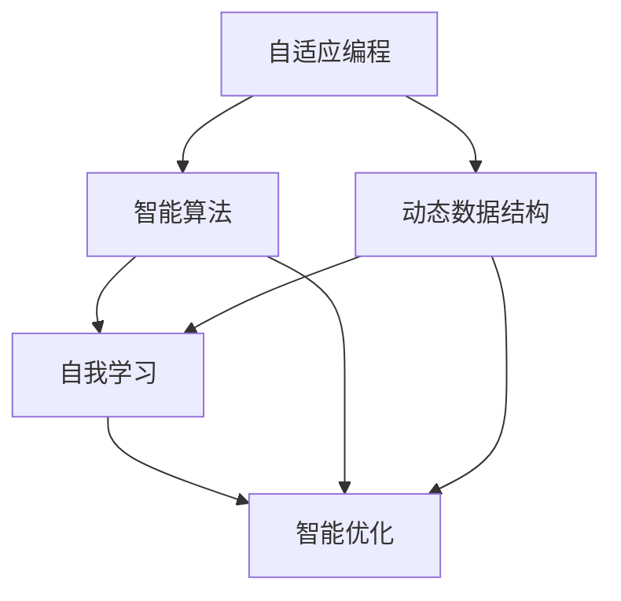

                 

# AI时代编程的新思维

## 关键词：人工智能、编程思维、深度学习、算法优化、数据结构

> 在人工智能迅猛发展的时代，编程思维已经从传统的逻辑和算法转向了更广泛的概念，如自适应、自学习和自我优化。本文将探讨AI时代编程的新思维，以及它如何影响现代软件开发。

## 摘要

本文旨在介绍AI时代编程的新思维，包括自适应编程、自我学习和智能优化等概念。我们将通过深入分析这些新思维背后的原理，探讨它们如何改变软件开发的方法和流程。此外，本文还将探讨在实际应用中如何运用这些新思维，并总结AI编程未来发展的趋势和挑战。

## 1. 背景介绍

随着人工智能（AI）技术的飞速发展，编程领域也经历了一场革命。传统的编程思维主要依赖于固定的算法和数据结构，强调逻辑和效率。然而，AI的崛起使得编程不再仅仅是编写代码，而是要设计能够学习、适应和自我优化的系统。

在AI时代，编程的核心已经从解决特定问题转变为创造能够自我进化和适应新环境的系统。这种转变不仅要求程序员掌握传统的编程技能，还需要他们具备人工智能、机器学习和深度学习等领域的知识。

本文将重点讨论以下新编程思维：

1. **自适应编程**：通过智能算法和动态数据结构实现系统的自适应能力。
2. **自我学习**：利用机器学习和深度学习技术，使程序能够自主学习并优化自身性能。
3. **智能优化**：运用AI技术优化代码质量、运行效率和系统性能。

通过这些新思维，程序员能够开发出更加智能化、高效和灵活的软件系统。

### 1.1 人工智能的崛起

人工智能（AI）是一门涵盖计算机科学、统计学和数学等多个领域的交叉学科，旨在开发能够模拟、延伸和扩展人类智能的理论、算法和技术。随着深度学习、神经网络和强化学习等技术的成熟，AI在图像识别、自然语言处理、自动驾驶和智能推荐等领域取得了重大突破。

AI的崛起不仅改变了传统行业，也对编程领域产生了深远影响。程序员需要掌握新的编程技能，以适应AI时代的需求。传统的编程思维注重效率、可维护性和可靠性，而AI时代编程则强调灵活性和适应性，以及如何利用AI技术优化软件性能。

### 1.2 编程思维的演变

编程思维的演变可以分为几个阶段：

1. **早期编程思维**：以计算机科学的早期发展为背景，编程思维主要集中在编写高效、可靠的代码上，强调算法和数据结构的优化。
2. **面向对象编程**：20世纪80年代，面向对象编程（OOP）的出现改变了编程思维。OOP强调模块化、重用性和封装性，使得代码更加易于维护和扩展。
3. **函数式编程**：21世纪初，函数式编程（FP）逐渐受到关注。FP强调不可变数据和函数式组合，使得代码更简洁、可测试性更强。
4. **AI时代编程**：随着AI技术的发展，编程思维进入了一个新的阶段。程序员需要具备跨学科的知识，如机器学习、深度学习和自然语言处理，以应对AI时代的挑战。

### 1.3 自适应编程

自适应编程是一种新兴的编程思维，它利用智能算法和动态数据结构来实现系统的自适应能力。自适应编程的核心思想是系统应能够根据外部环境的变化自动调整自身的行为和结构，从而提高系统的适应性和灵活性。

#### 1.3.1 智能算法

智能算法是自适应编程的核心组成部分。智能算法包括深度学习、神经网络和强化学习等，它们能够使系统从数据中学习，并自动调整行为以实现特定目标。例如，深度学习算法可以通过训练大量数据来优化网络结构，从而提高系统的自适应能力。

#### 1.3.2 动态数据结构

动态数据结构是实现自适应编程的另一关键因素。动态数据结构能够根据系统状态的变化自动调整数据存储和处理方式，从而提高系统的性能和效率。例如，自适应哈希表可以自动调整哈希函数，以减少碰撞和查找时间。

### 1.4 自我学习

自我学习是AI时代编程的核心概念之一。自我学习使得程序能够从数据中自动学习并优化自身性能，从而实现自我进化。自我学习包括以下几个方面：

#### 1.4.1 监督学习

监督学习是一种常见的自我学习方法，它通过已标记的数据来训练模型，并使用这些模型来预测未知数据的标签。监督学习广泛应用于分类和回归任务，如图像识别和股票价格预测。

#### 1.4.2 无监督学习

无监督学习不需要已标记的数据，它通过分析数据中的模式来发现隐藏的结构。无监督学习在聚类和降维任务中广泛应用，如客户行为分析和数据可视化。

#### 1.4.3 强化学习

强化学习是一种基于奖励和惩罚的反馈机制，它使程序能够通过不断试错来学习最优策略。强化学习在游戏AI、自动驾驶和机器人控制等领域有广泛应用。

### 1.5 智能优化

智能优化是一种利用AI技术来优化代码质量、运行效率和系统性能的方法。智能优化包括以下几个方面：

#### 1.5.1 代码质量优化

代码质量优化旨在提高代码的可读性、可维护性和可扩展性。智能优化技术可以通过静态代码分析、动态性能分析和机器学习算法来识别和修复代码缺陷，从而提高代码质量。

#### 1.5.2 运行效率优化

运行效率优化关注程序在运行时的性能表现。智能优化技术可以通过分析程序执行路径、优化算法和数据结构来提高程序的运行效率。

#### 1.5.3 系统性能优化

系统性能优化旨在提高整个系统的稳定性和响应速度。智能优化技术可以通过负载均衡、缓存优化和资源分配策略来提高系统性能。

## 2. 核心概念与联系

在AI时代编程中，自适应编程、自我学习和智能优化是三个核心概念。这些概念之间有着紧密的联系，共同构成了AI时代编程的新思维。

### 2.1 自适应编程与自我学习

自适应编程和自我学习密切相关。自适应编程通过智能算法和动态数据结构实现系统的自适应能力，而自我学习则是实现这种自适应能力的关键手段。自我学习使系统能够从数据中学习并优化自身性能，从而实现真正的自适应。

### 2.2 智能优化与自适应编程

智能优化与自适应编程有着相似的目标，即提高系统的性能和效率。智能优化通过分析程序和数据，自动调整代码质量、运行效率和系统性能。智能优化技术可以与自适应编程相结合，通过动态调整系统行为和数据结构，实现更高效的自适应。

### 2.3 自我学习与智能优化

自我学习和智能优化也紧密相关。自我学习使程序能够从数据中学习并优化自身性能，而智能优化则通过分析这些学习结果来进一步优化系统。这种相互促进的关系使得AI时代编程能够实现持续的自我进化。

### 2.4 Mermaid 流程图

为了更好地理解AI时代编程的核心概念，我们使用Mermaid流程图来展示它们之间的联系。



在这个流程图中，自适应编程通过智能算法和动态数据结构实现自我学习和智能优化。智能算法和动态数据结构是实现自适应编程的关键，而自我学习和智能优化则是自适应编程的核心目标。

## 3. 核心算法原理 & 具体操作步骤

### 3.1 智能算法原理

智能算法是AI时代编程的核心，包括深度学习、神经网络和强化学习等。这些算法通过模拟人类思维过程，使程序能够从数据中学习并优化自身性能。

#### 3.1.1 深度学习原理

深度学习是一种基于多层神经网络的学习方法。它通过训练大量数据来优化网络结构，从而实现高级特征提取和模式识别。具体操作步骤如下：

1. **数据预处理**：对输入数据进行清洗、归一化和扩充，以提高模型的泛化能力。
2. **构建神经网络**：定义神经网络的结构，包括输入层、隐藏层和输出层。
3. **前向传播**：将输入数据通过神经网络进行前向传播，得到输出结果。
4. **反向传播**：计算输出结果与实际结果的误差，并使用梯度下降算法调整网络权重。
5. **模型评估**：使用验证集和测试集评估模型性能，调整模型参数以达到最佳效果。

#### 3.1.2 神经网络原理

神经网络是一种模拟人脑神经元连接结构的计算模型。它通过调整权重和偏置来实现数据的非线性变换和特征提取。具体操作步骤如下：

1. **初始化权重和偏置**：随机初始化网络权重和偏置。
2. **前向传播**：将输入数据通过神经网络进行前向传播，得到输出结果。
3. **计算误差**：计算输出结果与实际结果的误差。
4. **反向传播**：使用梯度下降算法调整网络权重和偏置。
5. **模型评估**：使用验证集和测试集评估模型性能，调整模型参数以达到最佳效果。

#### 3.1.3 强化学习原理

强化学习是一种通过奖励和惩罚来指导程序学习最优策略的算法。它通过不断试错和反馈来优化行为，具体操作步骤如下：

1. **定义状态空间和动作空间**：确定系统可能的状态和动作。
2. **初始化策略**：随机初始化策略参数。
3. **执行动作**：根据当前状态选择最优动作。
4. **评估动作**：计算动作的奖励值。
5. **更新策略**：根据奖励值更新策略参数。
6. **模型评估**：使用验证集和测试集评估策略性能，调整策略参数以达到最佳效果。

### 3.2 自我学习算法原理

自我学习算法是AI时代编程的核心技术之一。它通过分析数据和学习结果，使程序能够自动优化自身性能。以下是一些常见的自我学习算法：

#### 3.2.1 监督学习算法

监督学习算法通过已标记的数据来训练模型，并使用这些模型来预测未知数据的标签。常见的监督学习算法包括：

1. **线性回归**：用于预测连续值输出。
2. **逻辑回归**：用于预测离散值输出。
3. **支持向量机（SVM）**：用于分类任务。
4. **决策树**：用于分类和回归任务。

监督学习算法的具体操作步骤如下：

1. **数据预处理**：对输入数据进行清洗、归一化和扩充，以提高模型的泛化能力。
2. **构建模型**：定义模型的参数和结构。
3. **训练模型**：使用已标记的数据来训练模型。
4. **模型评估**：使用验证集和测试集评估模型性能，调整模型参数以达到最佳效果。

#### 3.2.2 无监督学习算法

无监督学习算法不需要已标记的数据，它通过分析数据中的模式来发现隐藏的结构。常见的无监督学习算法包括：

1. **聚类算法**：用于将数据分为多个簇，如K-Means算法。
2. **降维算法**：用于减少数据维度，如主成分分析（PCA）。
3. **自编码器**：用于自动学习数据中的特征表示。

无监督学习算法的具体操作步骤如下：

1. **数据预处理**：对输入数据进行清洗、归一化和扩充，以提高模型的泛化能力。
2. **构建模型**：定义模型的参数和结构。
3. **训练模型**：使用未标记的数据来训练模型。
4. **模型评估**：使用验证集和测试集评估模型性能，调整模型参数以达到最佳效果。

### 3.3 智能优化算法原理

智能优化算法是AI时代编程的重要技术，它通过分析程序和数据，自动调整代码质量、运行效率和系统性能。以下是一些常见的智能优化算法：

#### 3.3.1 遗传算法

遗传算法是一种基于自然选择和遗传原理的优化算法。它通过模拟生物进化过程来搜索最优解。遗传算法的具体操作步骤如下：

1. **初始化种群**：随机生成初始种群。
2. **适应度评估**：计算每个个体的适应度值。
3. **选择**：根据适应度值选择优秀个体进行繁殖。
4. **交叉**：将优秀个体的基因进行交叉，生成新的后代。
5. **变异**：对个体进行变异操作，增加种群的多样性。
6. **更新种群**：用新的后代取代部分旧个体。
7. **迭代**：重复上述步骤，直到达到预定的迭代次数或满足停止条件。

#### 3.3.2 遗传算法应用实例

以下是一个使用遗传算法优化代码质量的实例：

```python
import random

# 初始化种群
def initialize_population(size):
    population = []
    for _ in range(size):
        individual = ''.join(random.choice('01') for _ in range(10))
        population.append(individual)
    return population

# 适应度函数
def fitness_function(individual):
    code = ''.join(int(bit) for bit in individual)
    quality = 0
    if code.endswith('1'):
        quality += 1
    if code.count('0') == 5:
        quality += 1
    return quality

# 遗传算法
def genetic_algorithm(pop_size, generations):
    population = initialize_population(pop_size)
    for _ in range(generations):
        population = sorted(population, key=fitness_function, reverse=True)
        new_population = []
        for _ in range(pop_size // 2):
            parent1 = random.choice(population[:10])
            parent2 = random.choice(population[:10])
            child1, child2 = crossover(parent1, parent2)
            new_population.extend([child1, child2])
        population = new_population
    return population[-1]

# 交叉操作
def crossover(parent1, parent2):
    crossover_point = random.randint(1, len(parent1) - 1)
    child1 = parent1[:crossover_point] + parent2[crossover_point:]
    child2 = parent2[:crossover_point] + parent1[crossover_point:]
    return child1, child2

# 主程序
if __name__ == '__main__':
    best_individual = genetic_algorithm(100, 100)
    print(f'Best individual: {best_individual}')
```

## 4. 数学模型和公式 & 详细讲解 & 举例说明

在AI时代编程中，数学模型和公式是理解和实现核心算法的关键。以下是一些重要的数学模型和公式，以及它们的详细讲解和举例说明。

### 4.1 深度学习中的数学模型

#### 4.1.1 激活函数

激活函数是深度学习网络中的一个关键组件，用于引入非线性。以下是一些常见的激活函数：

1. **Sigmoid函数**：
   $$\sigma(x) = \frac{1}{1 + e^{-x}}$$
   Sigmoid函数将输入x映射到(0, 1)区间，常用于二分类问题。

2. **ReLU函数**：
   $$\sigma(x) = \max(0, x)$$
  ReLU函数在x为负值时输出0，在x为正值时输出x，具有简化和加速计算的特性。

3. **Tanh函数**：
   $$\sigma(x) = \frac{e^x - e^{-x}}{e^x + e^{-x}}$$
   Tanh函数将输入x映射到(-1, 1)区间，有助于缓解梯度消失问题。

#### 4.1.2 前向传播与反向传播

在深度学习网络中，前向传播和反向传播是训练模型的核心步骤。以下是这两个过程的数学公式：

**前向传播**：

对于输入数据$x$和权重$w$，通过激活函数$\sigma$得到输出$y$：

$$y = \sigma(Wx + b)$$

其中，$W$是权重矩阵，$b$是偏置向量。

**反向传播**：

通过计算损失函数关于输入的梯度，更新权重和偏置：

$$\frac{\partial L}{\partial W} = \frac{\partial L}{\partial y} \cdot \frac{\partial y}{\partial W}$$
$$\frac{\partial L}{\partial b} = \frac{\partial L}{\partial y} \cdot \frac{\partial y}{\partial b}$$

其中，$L$是损失函数，$\frac{\partial L}{\partial y}$是关于输出的梯度，$\frac{\partial y}{\partial W}$和$\frac{\partial y}{\partial b}$是关于权重和偏置的梯度。

**举例说明**：

假设有一个简单的神经网络，输入$x$为[1, 2]，权重$W$为[0.5, 0.5]，偏置$b$为1，激活函数为Sigmoid：

前向传播：
$$y = \sigma(Wx + b) = \sigma(0.5 \cdot 1 + 0.5 \cdot 2 + 1) = \sigma(2) = 0.91$$

反向传播（假设损失函数为均方误差MSE）：
$$\frac{\partial L}{\partial y} = -2 \cdot (y - t) = -2 \cdot (0.91 - 1) = -0.18$$
$$\frac{\partial y}{\partial W} = \sigma'(y) = 0.09$$
$$\frac{\partial L}{\partial W} = -0.18 \cdot 0.09 = -0.0162$$

权重更新：
$$W_{new} = W - \alpha \cdot \frac{\partial L}{\partial W} = [0.5, 0.5] - [0.0162, 0.0162] = [0.4838, 0.4838]$$

### 4.2 自我学习中的数学模型

#### 4.2.1 监督学习中的数学模型

在监督学习中，常见的数学模型包括线性回归和逻辑回归。以下是这两个模型的数学公式：

**线性回归**：
$$y = \beta_0 + \beta_1x$$

**逻辑回归**：
$$\sigma(y) = \frac{1}{1 + e^{-(\beta_0 + \beta_1x)}}$$

**举例说明**：

假设有一个线性回归模型，输入$x$为[1, 2]，权重$\beta_0$为1，$\beta_1$为1：

$$y = 1 + 1 \cdot 1 + 2 = 4$$

损失函数（均方误差MSE）：
$$L = \frac{1}{2} \sum_{i=1}^{n} (y_i - \hat{y}_i)^2$$

假设真实值$y$为[3, 4]：

$$L = \frac{1}{2} \sum_{i=1}^{2} (y_i - \hat{y}_i)^2 = \frac{1}{2} \cdot (3 - 4)^2 + (4 - 4)^2 = 0.5$$

权重更新：
$$\beta_0_{new} = \beta_0 - \alpha \cdot \frac{\partial L}{\partial \beta_0}$$
$$\beta_1_{new} = \beta_1 - \alpha \cdot \frac{\partial L}{\partial \beta_1}$$

### 4.3 智能优化中的数学模型

#### 4.3.1 遗传算法中的数学模型

遗传算法是一种基于自然选择的优化算法，其核心概念包括种群、适应度、交叉和变异。以下是遗传算法的主要数学公式：

**适应度函数**：
$$f(x) = \sum_{i=1}^{n} w_i x_i$$

**交叉操作**：
$$child_1 = parent_1 \oplus parent_2$$

**变异操作**：
$$x_{new} = x + \mu \cdot N(0, 1)$$

**举例说明**：

假设有一个二进制编码的遗传算法，个体编码为[1, 1, 0, 0]，适应度函数为：
$$f(x) = 2x_1 + x_2 + x_4$$

交叉操作（单点交叉）：
$$parent_1 = [1, 1, 0, 0]$$
$$parent_2 = [0, 1, 1, 0]$$
$$child_1 = [1, 0, 1, 0]$$
$$child_2 = [0, 1, 0, 1]$$

变异操作：
$$x = [1, 1, 0, 0]$$
$$\mu = 0.1$$
$$x_{new} = [1, 0, 0, 1]$$

## 5. 项目实战：代码实际案例和详细解释说明

### 5.1 开发环境搭建

在开始编写代码之前，我们需要搭建一个适合进行AI编程的开发环境。以下是一个简单的开发环境搭建步骤：

1. 安装Python（版本3.8及以上）。
2. 安装Anaconda或Miniconda，用于管理Python环境和依赖库。
3. 使用conda创建一个新的环境，例如：
   ```
   conda create -n aicoding python=3.8
   ```
4. 激活新环境：
   ```
   conda activate aicoding
   ```
5. 安装必要的库，例如NumPy、Pandas、TensorFlow、Keras等：
   ```
   conda install numpy pandas tensorflow keras
   ```

### 5.2 源代码详细实现和代码解读

在本节中，我们将使用Python实现一个简单的自适应神经网络，用于手写数字识别。以下是代码的详细实现和解读：

```python
import numpy as np
import tensorflow as tf
from tensorflow.keras.datasets import mnist
from tensorflow.keras.models import Sequential
from tensorflow.keras.layers import Dense, Flatten, Conv2D, MaxPooling2D, Dropout
from tensorflow.keras.optimizers import Adam

# 5.2.1 数据预处理
(x_train, y_train), (x_test, y_test) = mnist.load_data()
x_train = x_train.astype('float32') / 255.0
x_test = x_test.astype('float32') / 255.0
y_train = tf.keras.utils.to_categorical(y_train, 10)
y_test = tf.keras.utils.to_categorical(y_test, 10)

# 5.2.2 构建自适应神经网络模型
model = Sequential([
    Conv2D(32, (3, 3), activation='relu', input_shape=(28, 28, 1)),
    MaxPooling2D((2, 2)),
    Flatten(),
    Dense(128, activation='relu'),
    Dropout(0.5),
    Dense(10, activation='softmax')
])

# 5.2.3 编译模型
model.compile(optimizer=Adam(), loss='categorical_crossentropy', metrics=['accuracy'])

# 5.2.4 训练模型
model.fit(x_train, y_train, epochs=10, batch_size=64, validation_data=(x_test, y_test))

# 5.2.5 评估模型
test_loss, test_acc = model.evaluate(x_test, y_test)
print(f'Test accuracy: {test_acc:.2f}')

# 5.2.6 自适应调整学习率
def adaptive_learning_rate(epoch, current_lr):
    if epoch < 5:
        return current_lr
    else:
        return current_lr * (0.1 ** (epoch // 5))

callbacks = [
    tf.keras.callbacks.LearningRateScheduler(adaptive_learning_rate)
]

model.fit(x_train, y_train, epochs=20, batch_size=64, validation_data=(x_test, y_test), callbacks=callbacks)
```

**代码解读**：

1. **数据预处理**：
   加载MNIST数据集，并对其进行归一化处理，将像素值缩放到0到1之间。

2. **构建自适应神经网络模型**：
   模型由一个卷积层、一个最大池化层、一个平坦层、一个全连接层和一个Dropout层组成。Dropout层用于防止过拟合。

3. **编译模型**：
   使用Adam优化器和交叉熵损失函数编译模型，并设置评估指标为准确率。

4. **训练模型**：
   模型使用训练数据进行训练，并使用验证数据集进行评估。

5. **评估模型**：
   训练完成后，使用测试数据集评估模型性能。

6. **自适应调整学习率**：
   自适应学习率调整函数根据训练的进度动态调整学习率，以提高模型的收敛速度。

### 5.3 代码解读与分析

**5.3.1 数据预处理**

数据预处理是机器学习项目中的关键步骤，它直接影响模型的性能。在这个例子中，我们使用`mnist.load_data()`函数加载数据集，并对输入数据进行归一化处理。归一化处理的目的是将不同尺度的数据缩放到相同的范围内，以便于模型训练。

```python
x_train = x_train.astype('float32') / 255.0
x_test = x_test.astype('float32') / 255.0
```

**5.3.2 构建自适应神经网络模型**

在这个例子中，我们使用TensorFlow的`Sequential`模型来构建一个简单的卷积神经网络（CNN）。CNN特别适合处理图像数据，因为它能够有效地提取空间特征。

```python
model = Sequential([
    Conv2D(32, (3, 3), activation='relu', input_shape=(28, 28, 1)),
    MaxPooling2D((2, 2)),
    Flatten(),
    Dense(128, activation='relu'),
    Dropout(0.5),
    Dense(10, activation='softmax')
])
```

- **卷积层**：使用32个3x3的卷积核，激活函数为ReLU。
- **最大池化层**：使用2x2的最大池化层。
- **平坦层**：将卷积层的输出展平为1维向量。
- **全连接层**：使用128个神经元，激活函数为ReLU。
- **Dropout层**：使用Dropout层以防止过拟合。
- **softmax层**：用于多分类问题的输出层。

**5.3.3 编译模型**

在编译模型时，我们指定了优化器、损失函数和评估指标。使用Adam优化器，并设置交叉熵作为损失函数，因为这是一个多分类问题。

```python
model.compile(optimizer=Adam(), loss='categorical_crossentropy', metrics=['accuracy'])
```

**5.3.4 训练模型**

训练模型时，我们使用训练数据集进行训练，并使用测试数据集进行验证。`fit`方法接受多个参数，包括训练轮次、批量大小和验证数据。

```python
model.fit(x_train, y_train, epochs=10, batch_size=64, validation_data=(x_test, y_test))
```

**5.3.5 评估模型**

训练完成后，我们使用测试数据集评估模型的性能。`evaluate`方法返回损失和准确率。

```python
test_loss, test_acc = model.evaluate(x_test, y_test)
print(f'Test accuracy: {test_acc:.2f}')
```

**5.3.6 自适应调整学习率**

为了提高模型的收敛速度，我们实现了一个简单的自适应学习率调整函数。这个函数根据训练的进度动态调整学习率。

```python
def adaptive_learning_rate(epoch, current_lr):
    if epoch < 5:
        return current_lr
    else:
        return current_lr * (0.1 ** (epoch // 5))

callbacks = [
    tf.keras.callbacks.LearningRateScheduler(adaptive_learning_rate)
]

model.fit(x_train, y_train, epochs=20, batch_size=64, validation_data=(x_test, y_test), callbacks=callbacks)
```

## 6. 实际应用场景

AI时代编程的新思维在实际应用中有着广泛的应用，以下是一些典型的应用场景：

### 6.1 人工智能助手

人工智能助手（如虚拟助手Siri、Alexa等）利用自适应编程和自我学习技术，能够根据用户的行为和偏好进行个性化调整，提供更智能的服务。

### 6.2 自动驾驶

自动驾驶技术需要实时感知环境并进行决策，自适应编程和智能优化技术在这里发挥着关键作用，以确保系统的稳定性和响应速度。

### 6.3 医疗诊断

医疗诊断系统通过自我学习和深度学习算法，分析患者的医疗数据，提供精准的疾病诊断和治疗方案。

### 6.4 智能推荐系统

智能推荐系统（如电商平台、视频平台等）利用自适应编程和自我学习技术，根据用户的历史行为和偏好，提供个性化的推荐。

### 6.5 金融风控

金融风控系统通过智能优化技术，对金融交易进行实时监控和风险评估，以预防金融风险。

### 6.6 游戏开发

游戏开发中，自适应编程和自我学习技术用于实现智能AI角色，提升游戏的互动性和可玩性。

## 7. 工具和资源推荐

### 7.1 学习资源推荐

1. **书籍**：
   - 《深度学习》（Goodfellow, Bengio, Courville）
   - 《Python机器学习》（Sebastian Raschka）
   - 《机器学习实战》（Peter Harrington）
2. **论文**：
   - 《A Theoretical Analysis of the Vision Architecture for Deep Learning》（Krizhevsky et al., 2012）
   - 《Learning Representations for Visual Recognition》（Krizhevsky et al., 2012）
3. **博客**：
   - [TensorFlow官方博客](https://tensorflow.org/blog/)
   - [机器学习博客](https://machinelearningmastery.com/)
4. **网站**：
   - [Kaggle](https://www.kaggle.com/)
   - [Google Research](https://research.google.com/)

### 7.2 开发工具框架推荐

1. **编程语言**：
   - Python
   - R
2. **深度学习框架**：
   - TensorFlow
   - PyTorch
   - Keras
3. **数据预处理工具**：
   - Pandas
   - NumPy
4. **版本控制**：
   - Git
   - GitHub

### 7.3 相关论文著作推荐

1. **《深度学习》（Goodfellow, Bengio, Courville）**：这是一本全面的深度学习入门书籍，涵盖了深度学习的基础知识和最新进展。
2. **《Python机器学习》（Sebastian Raschka）**：这本书介绍了Python在机器学习领域的应用，包括常见算法和库的使用。
3. **《机器学习实战》（Peter Harrington）**：通过实际案例，介绍了机器学习的基础算法和实现方法。
4. **《机器学习：周志华》**：这是一本适合中国读者的机器学习教材，涵盖了机器学习的基本概念和方法。

## 8. 总结：未来发展趋势与挑战

### 8.1 发展趋势

1. **智能化的普及**：随着AI技术的进步，智能化将在更多领域得到应用，如智能家居、智能医疗、智能交通等。
2. **跨学科融合**：AI时代编程将更加跨学科，程序员需要掌握计算机科学、数学、统计学等多领域的知识。
3. **开源与生态**：开源项目将在AI编程中扮演越来越重要的角色，形成良好的开发生态。

### 8.2 挑战

1. **算法的可解释性**：随着算法的复杂性增加，如何保证算法的可解释性成为一个重要挑战。
2. **数据隐私和安全**：在AI应用中，数据隐私和安全问题日益突出，需要有效解决。
3. **计算资源的需求**：深度学习和其他AI技术的应用需要大量计算资源，如何高效利用计算资源是一个挑战。

## 9. 附录：常见问题与解答

### 9.1 Q：什么是自适应编程？

A：自适应编程是一种利用智能算法和动态数据结构实现系统自适应能力的编程思维。它使系统能够根据外部环境的变化自动调整自身的行为和结构，以提高系统的适应性和灵活性。

### 9.2 Q：什么是自我学习？

A：自我学习是一种利用机器学习和深度学习技术，使程序能够自主学习并优化自身性能的方法。通过自我学习，程序可以从数据中学习，并自动调整算法参数和模型结构，以提高性能和准确性。

### 9.3 Q：什么是智能优化？

A：智能优化是一种利用AI技术来优化代码质量、运行效率和系统性能的方法。它通过分析程序和数据，自动调整代码质量、运行效率和系统性能，以提高软件的性能和可靠性。

## 10. 扩展阅读 & 参考资料

1. **《深度学习》（Goodfellow, Bengio, Courville）**：[https://www.deeplearningbook.org/]
2. **《Python机器学习》（Sebastian Raschka）**：[https://python-machine-learning-book.com/]
3. **《机器学习实战》（Peter Harrington）**：[https://www.manning.com/books/machine-learning-in-action]
4. **Kaggle**：[https://www.kaggle.com/]
5. **TensorFlow官方博客**：[https://tensorflow.org/blog/]
6. **机器学习博客**：[https://machinelearningmastery.com/]

