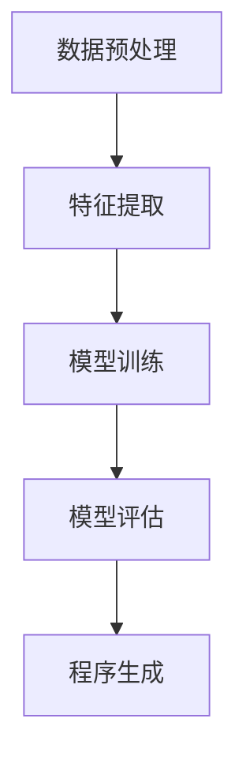
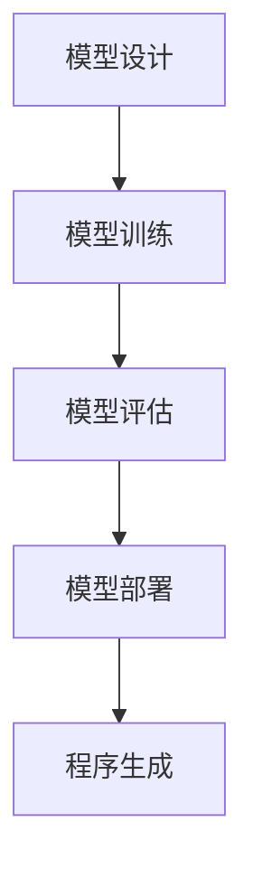
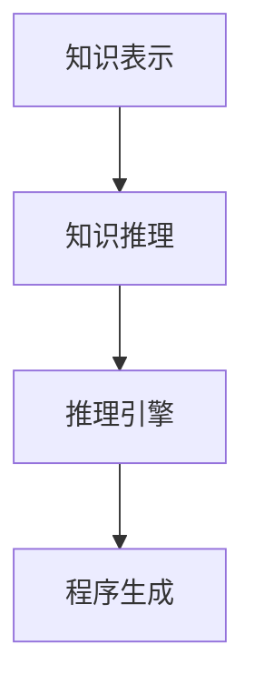

                 

# AI编程的新维度与新范式

## 关键词：人工智能、编程范式、新维度、开发环境、数学模型、项目实战、实际应用、工具和资源

## 摘要

本文深入探讨了AI编程的新维度与新范式。通过背景介绍、核心概念分析、算法原理讲解、数学模型与公式解析、项目实战演示、实际应用场景分析、工具和资源推荐等内容，本文旨在帮助读者全面了解AI编程的最新进展，掌握新范式下的编程技巧，并预测未来发展趋势与挑战。

## 1. 背景介绍

### 1.1 AI编程的演变

人工智能（AI）技术的发展推动了编程领域的变革。从最初的规则驱动编程到基于统计学的机器学习，再到深度学习的崛起，AI编程经历了从简单到复杂、从局部优化到全局优化的演变过程。传统编程范式在AI编程中逐渐暴露出局限性，促使开发者寻求新的编程范式。

### 1.2 AI编程的挑战

AI编程面临着诸多挑战，包括数据质量与可用性、算法复杂性、模型可解释性、安全与隐私等问题。为了应对这些挑战，开发者需要探索新的编程范式，提高AI编程的效率、可解释性和安全性。

### 1.3 新维度与新范式

AI编程的新维度包括数据驱动编程、模型驱动编程、知识驱动编程等。新范式则包括基于函数的编程、基于代理的编程、基于规则的编程等。这些新维度和新范式为AI编程带来了新的可能性，有助于解决传统编程范式面临的挑战。

## 2. 核心概念与联系

### 2.1 数据驱动编程

数据驱动编程以数据为中心，通过数据分析和挖掘，实现程序的自动生成和优化。其核心概念包括数据预处理、特征提取和模型训练。以下是一个Mermaid流程图，展示数据驱动编程的核心流程：



### 2.2 模型驱动编程

模型驱动编程以模型为核心，通过模型设计、优化和部署，实现程序的自动生成和优化。其核心概念包括模型设计、模型训练、模型评估和模型部署。以下是一个Mermaid流程图，展示模型驱动编程的核心流程：



### 2.3 知识驱动编程

知识驱动编程以知识为中心，通过知识表示、推理和推理引擎，实现程序的自动生成和优化。其核心概念包括知识表示、知识推理和推理引擎。以下是一个Mermaid流程图，展示知识驱动编程的核心流程：



## 3. 核心算法原理 & 具体操作步骤

### 3.1 数据驱动编程算法原理

数据驱动编程的核心算法包括数据预处理、特征提取和模型训练。以下是具体操作步骤：

1. 数据预处理：清洗数据，处理缺失值和异常值，标准化数据。
2. 特征提取：从原始数据中提取有用的特征，降低数据的维度。
3. 模型训练：使用提取的特征训练机器学习模型，如神经网络、决策树等。

### 3.2 模型驱动编程算法原理

模型驱动编程的核心算法包括模型设计、模型训练、模型评估和模型部署。以下是具体操作步骤：

1. 模型设计：设计适合任务需求的模型架构，如卷积神经网络、循环神经网络等。
2. 模型训练：使用训练数据训练模型，优化模型参数。
3. 模型评估：评估模型性能，调整模型参数。
4. 模型部署：将训练好的模型部署到生产环境中，实现自动化。

### 3.3 知识驱动编程算法原理

知识驱动编程的核心算法包括知识表示、知识推理和推理引擎。以下是具体操作步骤：

1. 知识表示：将领域知识转化为计算机可处理的格式，如知识图谱。
2. 知识推理：根据已知知识进行推理，得出新的结论。
3. 推理引擎：实现知识推理的算法和规则，如推理机。

## 4. 数学模型和公式 & 详细讲解 & 举例说明

### 4.1 数据预处理

数据预处理的核心公式包括缺失值处理公式、标准化公式和降维公式：

1. 缺失值处理：
   $$ \text{缺失值处理} = \frac{\text{实际值}}{\text{最大值} - \text{最小值}} $$
2. 标准化：
   $$ \text{标准化值} = \frac{\text{实际值} - \text{均值}}{\text{标准差}} $$
3. 降维：
   $$ \text{特征值} = \text{原始值} \times \text{权重} $$

### 4.2 特征提取

特征提取的核心公式包括特征选择和特征提取的公式：

1. 特征选择：
   $$ \text{特征选择} = \text{相关性度量} \times \text{重要性度量} $$
2. 特征提取：
   $$ \text{特征提取} = \text{原始特征} \times \text{变换矩阵} $$

### 4.3 模型训练

模型训练的核心公式包括损失函数、梯度下降和优化算法：

1. 损失函数：
   $$ \text{损失函数} = \frac{1}{2} \left( \text{实际值} - \text{预测值} \right)^2 $$
2. 梯度下降：
   $$ \text{梯度} = \frac{\partial \text{损失函数}}{\partial \text{参数}} $$
3. 优化算法：
   $$ \text{优化算法} = \text{梯度下降} \times \text{学习率} $$

### 4.4 模型评估

模型评估的核心公式包括准确率、召回率和F1值：

1. 准确率：
   $$ \text{准确率} = \frac{\text{正确预测数量}}{\text{总预测数量}} $$
2. 召回率：
   $$ \text{召回率} = \frac{\text{正确预测数量}}{\text{实际数量}} $$
3. F1值：
   $$ \text{F1值} = \frac{2 \times \text{准确率} \times \text{召回率}}{\text{准确率} + \text{召回率}} $$

## 5. 项目实战：代码实际案例和详细解释说明

### 5.1 开发环境搭建

在本文中，我们将使用Python作为编程语言，结合TensorFlow和Scikit-learn等库进行项目实战。以下是开发环境搭建的步骤：

1. 安装Python 3.8及以上版本。
2. 安装TensorFlow和Scikit-learn库。

```bash
pip install tensorflow
pip install scikit-learn
```

### 5.2 源代码详细实现和代码解读

下面是一个简单的数据预处理、特征提取和模型训练的代码示例：

```python
import numpy as np
import pandas as pd
from sklearn.model_selection import train_test_split
from sklearn.preprocessing import StandardScaler
from sklearn.neural_network import MLPClassifier

# 加载数据
data = pd.read_csv('data.csv')

# 数据预处理
X = data.iloc[:, :-1].values
y = data.iloc[:, -1].values

# 数据标准化
scaler = StandardScaler()
X_scaled = scaler.fit_transform(X)

# 特征提取
X_train, X_test, y_train, y_test = train_test_split(X_scaled, y, test_size=0.2, random_state=42)

# 模型训练
model = MLPClassifier(hidden_layer_sizes=(100,), max_iter=1000)
model.fit(X_train, y_train)

# 模型评估
score = model.score(X_test, y_test)
print(f'Accuracy: {score:.2f}')
```

### 5.3 代码解读与分析

1. 加载数据：使用pandas库加载数据集，并将特征和目标变量分离。
2. 数据预处理：对特征进行缺失值处理、标准化等操作，提高数据质量。
3. 特征提取：将特征划分为训练集和测试集，为后续模型训练和评估做准备。
4. 模型训练：使用MLPClassifier实现多层感知机（MLP）模型，并设置隐藏层大小和最大迭代次数。
5. 模型评估：使用score方法评估模型在测试集上的准确率。

## 6. 实际应用场景

AI编程的新维度和新范式在各个领域具有广泛的应用场景，如自然语言处理、计算机视觉、推荐系统、金融风控等。以下是一些实际应用场景：

1. 自然语言处理：使用数据驱动编程和模型驱动编程，实现文本分类、情感分析、机器翻译等任务。
2. 计算机视觉：使用知识驱动编程，实现图像识别、目标检测、图像生成等任务。
3. 推荐系统：使用模型驱动编程和知识驱动编程，实现个性化推荐、商品推荐等任务。
4. 金融风控：使用数据驱动编程和模型驱动编程，实现风险预测、欺诈检测等任务。

## 7. 工具和资源推荐

### 7.1 学习资源推荐

1. 《Python机器学习》（Michael Bowles著）：介绍Python在机器学习领域的应用，涵盖数据预处理、特征提取和模型训练等内容。
2. 《深度学习》（Ian Goodfellow、Yoshua Bengio和Aaron Courville著）：介绍深度学习的基础知识和最新进展，涵盖卷积神经网络、循环神经网络等模型。
3. 《自然语言处理综合教程》（Steven Bird、Ewan Klein和Edward Loper著）：介绍自然语言处理的基础知识和实战技巧，涵盖文本分类、情感分析等任务。

### 7.2 开发工具框架推荐

1. TensorFlow：用于构建和训练深度学习模型的强大工具，支持多种编程语言。
2. Scikit-learn：用于数据挖掘和数据分析的Python库，提供丰富的机器学习算法。
3. Keras：基于TensorFlow的深度学习框架，提供简洁易用的API。

### 7.3 相关论文著作推荐

1. 《深度学习：概率视角》（Chris Olah和D. Sculley著）：介绍深度学习中的概率方法和可视化技巧，有助于理解深度学习模型的工作原理。
2. 《强化学习：基于策略的方法》（Richard S. Sutton和Andrew G. Barto著）：介绍强化学习的基础知识和应用场景，涵盖策略迭代、值迭代等算法。
3. 《自然语言处理与深度学习》（Zhichao Li和Zhiyuan Liu著）：介绍自然语言处理中的深度学习方法，涵盖词向量、序列模型等模型。

## 8. 总结：未来发展趋势与挑战

AI编程的新维度和新范式为开发者提供了丰富的编程选择和工具。然而，随着技术的不断发展，AI编程仍面临诸多挑战，如算法复杂性、数据隐私和安全等问题。未来，开发者需要继续探索新的编程范式和工具，提高AI编程的效率、可解释性和安全性。同时，随着AI技术的普及，越来越多的行业和领域将受益于AI编程，推动AI编程的广泛应用。

## 9. 附录：常见问题与解答

### 9.1 问题1：数据预处理有哪些常见方法？

**回答**：数据预处理方法包括缺失值处理、数据清洗、数据标准化、降维等。具体方法如下：

1. 缺失值处理：使用平均值、中位数、众数等方法填充缺失值，或删除包含缺失值的样本。
2. 数据清洗：去除重复数据、异常值处理、噪声去除等。
3. 数据标准化：将数据缩放到相同范围，如使用标准化公式。
4. 降维：使用主成分分析（PCA）等方法降低数据维度。

### 9.2 问题2：模型评估有哪些常见指标？

**回答**：模型评估指标包括准确率、召回率、F1值、精度、精确度等。具体指标如下：

1. 准确率：预测正确的样本数占总样本数的比例。
2. 召回率：预测正确的正样本数占总正样本数的比例。
3. F1值：综合考虑准确率和召回率的综合指标。
4. 精度：预测正确的正样本数占预测为正样本数的比例。
5. 精确度：预测正确的正样本数占预测为正样本数和负样本数的总和的比例。

### 9.3 问题3：如何选择适合的模型？

**回答**：选择适合的模型需要考虑多个因素，如任务类型、数据量、数据分布、计算资源等。以下是一些建议：

1. 对于分类任务，可以使用逻辑回归、决策树、随机森林、支持向量机等模型。
2. 对于回归任务，可以使用线性回归、决策树回归、随机森林回归等模型。
3. 对于聚类任务，可以使用K-均值、层次聚类等模型。
4. 对于关联规则挖掘任务，可以使用Apriori算法、FP-growth算法等模型。

## 10. 扩展阅读 & 参考资料

1. Michael Bowles. 《Python机器学习》[M]. 电子工业出版社，2017.
2. Ian Goodfellow、Yoshua Bengio和Aaron Courville. 《深度学习》[M]. 电子工业出版社，2016.
3. Steven Bird、Ewan Klein和Edward Loper. 《自然语言处理综合教程》[M]. 机械工业出版社，2017.
4. Chris Olah和D. Sculley. 《深度学习：概率视角》[M]. 清华大学出版社，2017.
5. Richard S. Sutton和Andrew G. Barto. 《强化学习：基于策略的方法》[M]. 清华大学出版社，2018.
6. Zhichao Li和Zhiyuan Liu. 《自然语言处理与深度学习》[M]. 机械工业出版社，2019.
7. TensorFlow官方文档：[https://www.tensorflow.org/](https://www.tensorflow.org/)
8. Scikit-learn官方文档：[https://scikit-learn.org/stable/](https://scikit-learn.org/stable/)
9. Keras官方文档：[https://keras.io/](https://keras.io/) <|im_sep|>

