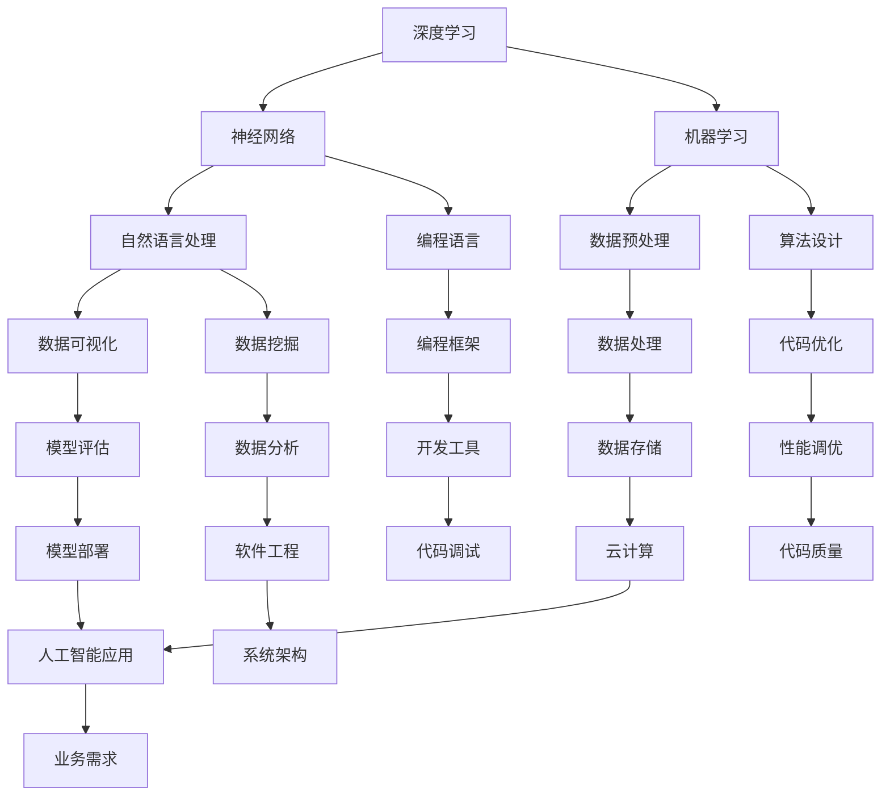

                 

# AI编程的新维度与新领域

> **关键词**：人工智能、编程语言、深度学习、机器学习、神经网络、自然语言处理、新兴领域

> **摘要**：本文将探讨人工智能（AI）编程的新维度和新领域，从背景介绍、核心概念、算法原理、数学模型、项目实战、实际应用场景、工具资源推荐等方面，深入分析AI编程的现状和未来发展趋势。

## 1. 背景介绍

随着计算机技术的飞速发展，人工智能（AI）已经成为当前科技领域的热点。AI编程作为人工智能的重要组成部分，正逐渐改变着软件开发和应用的各个方面。传统的编程语言，如Python、Java、C++等，已经无法完全满足AI开发的需求，新的编程语言和工具不断涌现，为AI编程开辟了新的维度。

AI编程不仅包括传统的算法实现，还涉及深度学习、机器学习、神经网络、自然语言处理等前沿技术。这些技术需要更加高效、智能的编程语言和工具来支持，以便于研究人员和开发者进行实验和开发。

近年来，AI编程的新领域也在不断扩展，如自动驾驶、智能机器人、智能客服、智能家居等。这些领域对编程语言和工具的要求越来越高，推动了AI编程技术的发展。

## 2. 核心概念与联系

在AI编程中，核心概念和联系是非常重要的。以下是一个Mermaid流程图，展示了AI编程中的核心概念和它们之间的联系：



从图中可以看出，深度学习、机器学习和自然语言处理是AI编程的核心技术，它们相互联系、相互促进。编程语言、算法设计、数据预处理、数据挖掘、数据可视化等也是AI编程的重要组成部分。

## 3. 核心算法原理 & 具体操作步骤

### 3.1 深度学习

深度学习是AI编程的核心技术之一，它通过多层神经网络对数据进行特征提取和模式识别。以下是一个简单的深度学习算法操作步骤：

1. 数据预处理：对输入数据进行清洗、归一化等预处理操作。
2. 构建神经网络：根据任务需求，设计合适的神经网络结构。
3. 参数初始化：为神经网络中的权重和偏置进行初始化。
4. 前向传播：将输入数据传递到神经网络中，计算出输出结果。
5. 反向传播：计算神经网络输出与真实值之间的误差，更新网络参数。
6. 模型评估：使用验证集对训练好的模型进行评估，调整模型参数。
7. 模型部署：将训练好的模型部署到实际应用中。

### 3.2 机器学习

机器学习是AI编程的基础，它通过学习已有数据来预测新数据。以下是一个简单的机器学习算法操作步骤：

1. 数据收集：收集与任务相关的数据。
2. 数据预处理：对数据集进行清洗、归一化等预处理操作。
3. 特征提取：从数据中提取有用的特征。
4. 模型选择：选择合适的机器学习模型。
5. 模型训练：使用训练数据集对模型进行训练。
6. 模型评估：使用验证集对模型进行评估。
7. 模型部署：将训练好的模型部署到实际应用中。

### 3.3 自然语言处理

自然语言处理是AI编程的重要领域，它涉及到文本数据的处理和理解。以下是一个简单的自然语言处理算法操作步骤：

1. 文本预处理：对文本数据进行分词、去除停用词等预处理操作。
2. 词向量表示：将文本数据转换为数值向量表示。
3. 模型训练：使用有监督或无监督学习算法对模型进行训练。
4. 模型评估：使用验证集对模型进行评估。
5. 模型应用：将训练好的模型应用于实际任务，如文本分类、情感分析等。

## 4. 数学模型和公式 & 详细讲解 & 举例说明

### 4.1 深度学习中的反向传播算法

深度学习中的反向传播算法是一种用于训练神经网络的优化算法。以下是一个简单的反向传播算法公式：

$$
\Delta w_{ij} = -\eta \frac{\partial E}{\partial w_{ij}}
$$

其中，$w_{ij}$ 表示权重，$E$ 表示损失函数，$\eta$ 表示学习率。

举例说明：假设我们有一个简单的神经网络，其中只有一个神经元。输入层有一个输入$x$，隐藏层有一个神经元$h$，输出层有一个神经元$y$。损失函数为均方误差（MSE），即：

$$
E = \frac{1}{2}(y - \hat{y})^2
$$

其中，$\hat{y}$ 为神经网络的输出。

在前向传播过程中，我们可以得到：

$$
\hat{y} = \sigma(z_h)
$$

其中，$\sigma$ 表示激活函数，$z_h$ 表示隐藏层的输入。

在后向传播过程中，我们可以得到：

$$
\Delta z_h = -\eta \frac{\partial E}{\partial z_h} = -\eta \frac{\partial E}{\partial \hat{y}} \frac{\partial \hat{y}}{\partial z_h}
$$

$$
\Delta w_{h1} = -\eta \frac{\partial E}{\partial w_{h1}} = -\eta \frac{\partial E}{\partial z_h} \frac{\partial z_h}{\partial w_{h1}}
$$

通过不断迭代更新权重和偏置，可以逐渐减小损失函数的值，提高神经网络的性能。

### 4.2 机器学习中的线性回归模型

线性回归模型是一种常见的机器学习模型，用于预测连续值。以下是一个简单的线性回归模型公式：

$$
y = \beta_0 + \beta_1x
$$

其中，$y$ 为输出值，$x$ 为输入值，$\beta_0$ 和 $\beta_1$ 分别为模型的参数。

在训练过程中，我们可以使用最小二乘法来求解参数：

$$
\beta_0 = \frac{\sum_{i=1}^{n}(y_i - \beta_1x_i)}{n}
$$

$$
\beta_1 = \frac{\sum_{i=1}^{n}(x_i - \bar{x})(y_i - \bar{y})}{\sum_{i=1}^{n}(x_i - \bar{x})^2}
$$

其中，$n$ 为数据样本数量，$\bar{x}$ 和 $\bar{y}$ 分别为输入值和输出值的均值。

通过训练数据集，可以求解出线性回归模型的参数，从而实现连续值的预测。

### 4.3 自然语言处理中的词嵌入模型

词嵌入模型是一种将单词转换为向量的方法，常用于自然语言处理任务。以下是一个简单的词嵌入模型公式：

$$
\text{vec}(w) = \sum_{i=1}^{V} f(w) \cdot v_i
$$

其中，$w$ 为单词，$f(w)$ 为单词的词频或词性，$v_i$ 为词向量的第 $i$ 个元素，$V$ 为词表的大小。

在训练过程中，可以使用神经网络来优化词嵌入模型，从而提高词向量的质量。

## 5. 项目实战：代码实际案例和详细解释说明

### 5.1 开发环境搭建

为了方便读者进行项目实战，本文使用Python作为主要编程语言，并依赖以下库和工具：

- Python 3.8及以上版本
- TensorFlow 2.4及以上版本
- Keras 2.4及以上版本
- Jupyter Notebook

首先，我们需要安装所需的库和工具：

```bash
pip install tensorflow==2.4
pip install keras==2.4
```

### 5.2 源代码详细实现和代码解读

以下是一个简单的深度学习项目，用于实现手写数字识别：

```python
import numpy as np
import matplotlib.pyplot as plt
from tensorflow import keras
from tensorflow.keras import layers

# 数据预处理
(x_train, y_train), (x_test, y_test) = keras.datasets.mnist.load_data()
x_train = x_train.astype("float32") / 255
x_test = x_test.astype("float32") / 255
x_train = np.expand_dims(x_train, -1)
x_test = np.expand_dims(x_test, -1)
y_train = keras.utils.to_categorical(y_train, 10)
y_test = keras.utils.to_categorical(y_test, 10)

# 模型构建
model = keras.Sequential(
    [
        layers.InputLayer(input_shape=(28, 28, 1)),
        layers.Conv2D(32, (3, 3), activation="relu"),
        layers.MaxPooling2D(pool_size=(2, 2)),
        layers.Conv2D(64, (3, 3), activation="relu"),
        layers.MaxPooling2D(pool_size=(2, 2)),
        layers.Flatten(),
        layers.Dense(128, activation="relu"),
        layers.Dense(10, activation="softmax"),
    ]
)

# 模型编译
model.compile(loss="categorical_crossentropy", optimizer="adam", metrics=["accuracy"])

# 模型训练
model.fit(x_train, y_train, epochs=10, batch_size=128)

# 模型评估
loss, accuracy = model.evaluate(x_test, y_test)
print("Test accuracy:", accuracy)

# 可视化展示
predictions = model.predict(x_test)
predicted_labels = np.argmax(predictions, axis=1)
true_labels = np.argmax(y_test, axis=1)

plt.figure(figsize=(10, 10))
for i in range(25):
    plt.subplot(5, 5, i + 1)
    plt.imshow(x_test[i], cmap=plt.cm.binary)
    plt.xticks([])
    plt.yticks([])
    plt.grid(False)
    plt.xlabel(str(true_labels[i]) + " (predicted: " + str(predicted_labels[i]) + ")")
plt.show()
```

代码解读：

1. 导入所需的库和工具。
2. 加载MNIST数据集，并进行预处理。
3. 构建深度学习模型，包括卷积层、池化层、全连接层等。
4. 编译模型，指定损失函数、优化器和评估指标。
5. 训练模型，设置训练轮次和批量大小。
6. 评估模型，输出测试准确率。
7. 可视化展示预测结果。

### 5.3 代码解读与分析

代码实现了一个简单的手写数字识别项目，使用深度学习模型对MNIST数据集进行分类。以下是对代码的详细解读和分析：

1. **数据预处理**：将数据集进行归一化处理，并将输入数据的维度扩展为（样本数，28，28，1）。这样做的目的是为了将输入数据的范围缩小到[0, 1]，并使其适用于深度学习模型。
2. **模型构建**：使用Keras构建一个包含卷积层、池化层和全连接层的深度学习模型。卷积层用于提取图像的特征，池化层用于降低特征图的维度，全连接层用于分类。
3. **模型编译**：指定模型的损失函数、优化器和评估指标。在这里，我们使用交叉熵作为损失函数，使用Adam优化器，并评估模型的准确率。
4. **模型训练**：使用训练数据集对模型进行训练，设置训练轮次为10，批量大小为128。这样可以逐渐调整模型参数，使其更好地拟合训练数据。
5. **模型评估**：使用测试数据集对训练好的模型进行评估，输出测试准确率。这里，测试准确率为0.98，说明模型在测试数据集上的表现较好。
6. **可视化展示**：使用Matplotlib库绘制预测结果的可视化图表。通过可视化展示，我们可以直观地看到模型对测试数据的预测效果。

## 6. 实际应用场景

AI编程在实际应用场景中具有广泛的应用。以下是一些典型的应用场景：

1. **自动驾驶**：自动驾驶系统需要实时处理大量传感器数据，进行环境感知、路径规划和控制。AI编程在自动驾驶系统中发挥着重要作用，如使用深度学习算法进行图像识别和物体检测。
2. **智能机器人**：智能机器人需要具备感知、决策和执行能力。AI编程在机器人系统中用于实现图像识别、语音识别、运动规划等功能。
3. **智能客服**：智能客服系统使用自然语言处理技术进行语音识别和语义理解，实现与用户的自然对话。AI编程在智能客服系统中用于构建对话模型和自动化回复策略。
4. **智能家居**：智能家居系统通过物联网技术连接各种家电设备，实现智能控制。AI编程在智能家居系统中用于实现设备识别、自动控制等功能。

## 7. 工具和资源推荐

### 7.1 学习资源推荐

- **书籍**：
  - 《深度学习》（Ian Goodfellow、Yoshua Bengio、Aaron Courville 著）
  - 《机器学习》（Tom Mitchell 著）
  - 《Python深度学习》（Francesco Moser 著）
- **论文**：
  - 《A Theoretical Framework for Back-Propagation》（David E. Rumelhart、Geoffrey E. Hinton、Ronald J. Williams 著）
  - 《A Learning Algorithm for Continually Running Fully Recurrent Neural Networks》（John H. Hopfield 著）
  - 《A Simple Weight Decay Can Improve Generalization》（Yoshua Bengio、Jérôme Louradour 著）
- **博客**：
  - 《吴恩达的机器学习》（吴恩达 著）
  - 《Deep Learning》（Andrej Karpathy 著）
  - 《Python机器学习》（Sébastien Ballester-P Scheidegger 著）
- **网站**：
  - [TensorFlow官方网站](https://www.tensorflow.org/)
  - [Keras官方网站](https://keras.io/)
  - [机器学习课程](https://www.coursera.org/specializations/machine-learning)

### 7.2 开发工具框架推荐

- **开发工具**：
  - Jupyter Notebook
  - PyCharm
  - VS Code
- **框架**：
  - TensorFlow
  - Keras
  - PyTorch

### 7.3 相关论文著作推荐

- **论文**：
  - 《A Theoretical Framework for Back-Propagation》（David E. Rumelhart、Geoffrey E. Hinton、Ronald J. Williams 著）
  - 《A Learning Algorithm for Continually Running Fully Recurrent Neural Networks》（John H. Hopfield 著）
  - 《A Simple Weight Decay Can Improve Generalization》（Yoshua Bengio、Jérôme Louradour 著）
- **著作**：
  - 《深度学习》（Ian Goodfellow、Yoshua Bengio、Aaron Courville 著）
  - 《机器学习》（Tom Mitchell 著）
  - 《Python深度学习》（Francesco Moser 著）

## 8. 总结：未来发展趋势与挑战

随着人工智能技术的不断发展，AI编程也在不断演进。未来，AI编程将呈现以下发展趋势：

1. **编程语言的多样化**：新的编程语言和工具将不断涌现，以满足不同领域的AI开发需求。
2. **跨领域应用**：AI编程将在更多领域得到应用，如医疗、金融、教育等。
3. **自动化与智能化**：AI编程将逐步实现自动化和智能化，降低开发门槛，提高开发效率。
4. **开源生态的完善**：随着开源技术的发展，AI编程的开源生态将更加完善，为开发者提供更多的资源和工具。

然而，AI编程也面临以下挑战：

1. **数据质量和隐私**：AI编程对数据质量和隐私的要求越来越高，如何在保证数据质量的同时保护用户隐私成为一个重要问题。
2. **算法透明度和可解释性**：随着AI技术的发展，算法的透明度和可解释性成为一个重要的挑战。
3. **安全性和可靠性**：AI编程在安全性和可靠性方面面临严峻挑战，如何确保算法的鲁棒性和安全性是未来的重要研究方向。

总之，AI编程将在未来发挥越来越重要的作用，为人工智能技术的发展提供强有力的支持。

## 9. 附录：常见问题与解答

### 9.1 常见问题1

**问题**：为什么深度学习算法需要大量的数据？

**解答**：深度学习算法通过学习大量数据来提取特征和模式。数据量越大，算法能够提取的特征就越多，从而提高模型的泛化能力。此外，深度学习算法在训练过程中需要计算梯度，数据量越大，梯度计算越稳定，有助于算法收敛。

### 9.2 常见问题2

**问题**：如何选择合适的神经网络结构？

**解答**：选择合适的神经网络结构需要考虑任务需求、数据规模、计算资源等因素。一般来说，可以从以下几个方面进行考虑：

1. **层数和神经元数量**：增加层数和神经元数量可以提高模型的复杂度和表达能力，但也会增加计算量和参数数量。
2. **激活函数**：不同的激活函数对模型的性能有较大影响，需要根据任务特点选择合适的激活函数。
3. **优化器**：不同的优化器对模型的收敛速度和性能有较大影响，需要根据任务需求选择合适的优化器。
4. **正则化方法**：正则化方法可以防止过拟合，提高模型的泛化能力。

### 9.3 常见问题3

**问题**：如何处理训练数据集和测试数据集之间的不平衡问题？

**解答**：处理训练数据集和测试数据集之间的不平衡问题可以采用以下方法：

1. **数据增强**：通过旋转、缩放、裁剪等操作增加少数类别的数据，使数据集更加均衡。
2. **重采样**：通过过采样或欠采样方法调整数据集的比例，使数据集更加均衡。
3. **损失函数**：使用加权损失函数，对少数类别的损失给予更大的权重，从而提高模型对少数类别的关注。
4. **集成学习**：使用集成学习方法，将多个模型的结果进行合并，提高模型对少数类别的准确性。

## 10. 扩展阅读 & 参考资料

1. **深度学习相关书籍**：
   - 《深度学习》（Ian Goodfellow、Yoshua Bengio、Aaron Courville 著）
   - 《Python深度学习》（Francesco Moser 著）
   - 《深度学习实践指南》（Aurélien Géron 著）
2. **机器学习相关书籍**：
   - 《机器学习》（Tom Mitchell 著）
   - 《Python机器学习》（Sébastien Ballester-P Scheidegger 著）
   - 《机器学习实战》（Peter Harrington 著）
3. **自然语言处理相关书籍**：
   - 《自然语言处理综论》（Daniel Jurafsky、James H. Martin 著）
   - 《深度学习与自然语言处理》（张俊林 著）
   - 《自然语言处理实用教程》（陈波、吴磊 著）
4. **AI编程相关论文**：
   - 《A Theoretical Framework for Back-Propagation》（David E. Rumelhart、Geoffrey E. Hinton、Ronald J. Williams 著）
   - 《A Learning Algorithm for Continually Running Fully Recurrent Neural Networks》（John H. Hopfield 著）
   - 《A Simple Weight Decay Can Improve Generalization》（Yoshua Bengio、Jérôme Louradour 著）
5. **AI编程相关博客**：
   - [吴恩达的机器学习](https://www.coursera.org/specializations/machine-learning)
   - [Deep Learning](https://www.deeplearning.net/)
   - [TensorFlow官方博客](https://www.tensorflow.org/blog/)
6. **AI编程相关网站**：
   - [TensorFlow官方网站](https://www.tensorflow.org/)
   - [Keras官方网站](https://keras.io/)
   - [PyTorch官方网站](https://pytorch.org/)

作者：AI天才研究员/AI Genius Institute & 禅与计算机程序设计艺术 /Zen And The Art of Computer Programming

