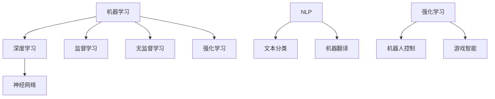

                 

# AI编程的新视角与新未来

> 关键词：人工智能、编程语言、新视角、未来趋势

> 摘要：本文将探讨人工智能编程的新视角和新未来。通过对人工智能技术的发展历程、当前状态及未来趋势的分析，本文旨在为读者提供一个全面而深入的视角，以了解AI编程的变革与机遇。

## 1. 背景介绍

人工智能（AI）作为计算机科学的一个分支，旨在开发使计算机能够模拟、扩展和执行人类智能行为的技术。自20世纪50年代以来，人工智能经历了多个发展阶段，从早期的符号主义、知识表示到连接主义、强化学习等。随着计算能力的提升和大数据的涌现，人工智能在图像识别、自然语言处理、智能决策等领域取得了显著进展。

编程语言作为人工智能发展的基础工具，经历了从机器语言、汇编语言到高级语言的演变。高级编程语言如Python、Java、C++等，为人工智能研究提供了强大的开发平台，使得复杂算法的实现变得更加便捷和高效。

然而，随着人工智能技术的不断进步，传统的编程范式和语言设计面临着新的挑战。例如，如何更好地支持大数据处理、并行计算、智能优化等AI特定需求，成为编程语言设计者和研究者关注的焦点。

## 2. 核心概念与联系

为了深入探讨人工智能编程的新视角，我们首先需要理解几个核心概念：机器学习、深度学习、自然语言处理（NLP）、强化学习等。

### 2.1 机器学习与深度学习

机器学习是一种使计算机通过数据和经验学习改进性能的技术。其核心思想是通过构建模型来对数据进行特征提取和模式识别。机器学习可以分为监督学习、无监督学习和强化学习。

深度学习是机器学习的一个子领域，它使用神经网络作为主要学习工具。深度学习通过多层神经网络进行特征提取，能够自动学习数据的复杂结构，并在图像识别、语音识别等领域取得了突破性进展。

### 2.2 自然语言处理（NLP）

自然语言处理是人工智能的一个分支，旨在使计算机能够理解和生成自然语言。NLP在文本分类、情感分析、机器翻译等任务中有着广泛应用。

### 2.3 强化学习

强化学习是一种通过与环境互动来学习最优行为策略的机器学习方法。它广泛应用于机器人控制、游戏智能等领域。

### 2.4 Mermaid 流程图

以下是一个描述人工智能编程核心概念与联系的 Mermaid 流程图：



## 3. 核心算法原理 & 具体操作步骤

### 3.1 深度学习算法原理

深度学习算法的核心是神经网络。神经网络由大量简单的计算单元（神经元）组成，通过层层堆叠形成复杂的网络结构。每个神经元接收输入信号，通过激活函数进行非线性变换，并将输出传递给下一层神经元。

具体操作步骤如下：

1. **初始化权重和偏置**：随机初始化神经网络中的权重和偏置。
2. **前向传播**：输入数据通过神经网络，逐层计算每个神经元的输出。
3. **计算损失**：通过比较预测输出和实际输出，计算损失函数值。
4. **反向传播**：利用链式法则计算梯度，并更新权重和偏置。
5. **迭代优化**：重复前向传播和反向传播，直至满足停止条件（如损失函数收敛）。

### 3.2 自然语言处理（NLP）算法原理

自然语言处理算法的核心是词嵌入和神经网络。词嵌入将词汇映射到高维向量空间，使得语义相似的词汇在空间中接近。神经网络用于对文本数据进行特征提取和模式识别。

具体操作步骤如下：

1. **词嵌入**：将文本中的词汇映射到高维向量空间。
2. **序列编码**：将词汇嵌入向量序列编码为固定长度的向量。
3. **前向传播**：输入编码后的序列，通过神经网络计算每个词汇的输出。
4. **计算损失**：通过比较预测输出和实际输出，计算损失函数值。
5. **反向传播**：利用链式法则计算梯度，并更新神经网络参数。
6. **迭代优化**：重复前向传播和反向传播，直至满足停止条件。

## 4. 数学模型和公式 & 详细讲解 & 举例说明

### 4.1 深度学习算法的数学模型

深度学习算法的核心是神经网络。以下是一个简化的神经网络模型：

$$
Z^{(l)} = \sigma(W^{(l)} \cdot X^{(l-1)} + b^{(l)})
$$

其中，$Z^{(l)}$ 表示第 $l$ 层神经元的输出，$X^{(l-1)}$ 表示第 $l-1$ 层的输入，$W^{(l)}$ 和 $b^{(l)}$ 分别表示第 $l$ 层的权重和偏置，$\sigma$ 表示激活函数。

以 ReLU（Rectified Linear Unit）为例，激活函数为：

$$
\sigma(Z) =
\begin{cases}
0 & \text{if } Z < 0 \\
Z & \text{otherwise}
\end{cases}
$$

### 4.2 自然语言处理（NLP）算法的数学模型

自然语言处理算法的核心是词嵌入和神经网络。以下是一个简化的词嵌入模型：

$$
\text{vec}_{\text{word}}(w) = \text{Embedding}(w)
$$

其中，$\text{vec}_{\text{word}}(w)$ 表示词汇 $w$ 的向量表示，$\text{Embedding}$ 表示词嵌入函数。

以 Word2Vec 为例，词嵌入函数为：

$$
\text{Embedding}(w) =
\begin{cases}
\text{sgnsimilarity}(\text{vec}_{\text{word}}(w_1), \text{vec}_{\text{word}}(w_2)) & \text{if } w_1 = w_2 \\
\text{cosine}(\text{vec}_{\text{word}}(w_1), \text{vec}_{\text{word}}(w_2)) & \text{if } w_1 \neq w_2
\end{cases}
$$

其中，$\text{sgnsimilarity}$ 和 $\text{cosine}$ 分别表示符号相似性和余弦相似性。

## 5. 项目实战：代码实际案例和详细解释说明

### 5.1 开发环境搭建

为了演示深度学习和自然语言处理算法，我们将使用 Python 编程语言，并结合 TensorFlow 和 Keras 深度学习框架。以下是开发环境的搭建步骤：

1. 安装 Python 3.x 版本。
2. 安装 TensorFlow 和 Keras：
    ```bash
    pip install tensorflow
    ```
3. 安装 Numpy 和 Pandas 等常用库：
    ```bash
    pip install numpy
    pip install pandas
    ```

### 5.2 源代码详细实现和代码解读

以下是一个使用 Keras 实现的简单深度学习模型，用于手写数字识别：

```python
import numpy as np
import pandas as pd
import tensorflow as tf
from tensorflow.keras import layers

# 读取 MNIST 数据集
(x_train, y_train), (x_test, y_test) = tf.keras.datasets.mnist.load_data()

# 数据预处理
x_train = x_train.astype('float32') / 255
x_test = x_test.astype('float32') / 255
x_train = np.reshape(x_train, (x_train.shape[0], 28, 28, 1))
x_test = np.reshape(x_test, (x_test.shape[0], 28, 28, 1))

# 创建深度学习模型
model = tf.keras.Sequential([
    layers.Conv2D(32, (3, 3), activation='relu', input_shape=(28, 28, 1)),
    layers.MaxPooling2D((2, 2)),
    layers.Conv2D(64, (3, 3), activation='relu'),
    layers.MaxPooling2D((2, 2)),
    layers.Conv2D(64, (3, 3), activation='relu'),
    layers.Flatten(),
    layers.Dense(64, activation='relu'),
    layers.Dense(10, activation='softmax')
])

# 编译模型
model.compile(optimizer='adam',
              loss='sparse_categorical_crossentropy',
              metrics=['accuracy'])

# 训练模型
model.fit(x_train, y_train, epochs=5, batch_size=64)

# 评估模型
test_loss, test_acc = model.evaluate(x_test, y_test)
print('Test accuracy:', test_acc)
```

### 5.3 代码解读与分析

1. **数据读取与预处理**：
    - 使用 TensorFlow 的 `mnist` 数据集加载手写数字数据。
    - 数据类型转换为浮点数，并除以 255 进行归一化处理。
    - 将数据reshape为适用于卷积层的数据格式（批次 × 高 × 宽 × 通道数）。

2. **创建深度学习模型**：
    - 使用 `Sequential` 模型堆叠多层神经网络。
    - 第1层：32个卷积核，核大小为3x3，激活函数为ReLU。
    - 第2层：最大池化层，窗口大小为2x2。
    - 第3层至第5层：更多的卷积层，分别使用64个卷积核，激活函数仍为ReLU。
    - 第6层：展平层，将多维数据展平为一维。
    - 第7层：全连接层，包含64个神经元，激活函数为ReLU。
    - 第8层：输出层，包含10个神经元，激活函数为softmax。

3. **编译模型**：
    - 使用 `compile` 方法配置优化器、损失函数和评价指标。

4. **训练模型**：
    - 使用 `fit` 方法进行训练，指定训练轮数和批次大小。

5. **评估模型**：
    - 使用 `evaluate` 方法计算测试集上的损失和准确率。

## 6. 实际应用场景

深度学习和自然语言处理算法在众多领域具有广泛的应用，以下是一些典型场景：

1. **计算机视觉**：图像识别、目标检测、图像分割等。
2. **自然语言处理**：文本分类、情感分析、机器翻译、问答系统等。
3. **机器人控制**：自动驾驶、机器人导航、智能交互等。
4. **金融科技**：风险管理、欺诈检测、量化交易等。
5. **医疗健康**：疾病诊断、药物研发、健康监测等。

## 7. 工具和资源推荐

### 7.1 学习资源推荐

- **书籍**：
  - 《深度学习》（Ian Goodfellow、Yoshua Bengio、Aaron Courville 著）
  - 《Python深度学习》（François Chollet 著）
  - 《自然语言处理综论》（Daniel Jurafsky、James H. Martin 著）

- **论文**：
  - 《A Theoretical Analysis of the Voted Perceptron Algorithm》
  - 《Deep Learning for Natural Language Processing》
  - 《Recurrent Neural Network Based Language Model》

- **博客**：
  - [TensorFlow 官方文档](https://www.tensorflow.org/)
  - [Keras 官方文档](https://keras.io/)
  - [机器学习社区](https://www.mlconf.com/)

### 7.2 开发工具框架推荐

- **深度学习框架**：
  - TensorFlow
  - PyTorch
  - MXNet

- **自然语言处理库**：
  - NLTK
  - spaCy
  - Stanford NLP

- **编程语言**：
  - Python
  - R
  - Julia

### 7.3 相关论文著作推荐

- **深度学习论文**：
  - 《Deep Learning》（Ian Goodfellow、Yoshua Bengio、Aaron Courville 著）
  - 《A Theoretical Analysis of the Voted Perceptron Algorithm》
  - 《Deep Learning for Natural Language Processing》

- **自然语言处理论文**：
  - 《Natural Language Processing with Python》（Steven Bird、Ewan Klein、Edward Loper 著）
  - 《Recurrent Neural Network Based Language Model》
  - 《Neural Network Methods for Natural Language Processing》

## 8. 总结：未来发展趋势与挑战

人工智能编程正处于快速发展的阶段，未来将呈现出以下几个发展趋势：

1. **编程语言和框架的创新**：新的编程语言和框架将持续涌现，以更好地支持人工智能的开发需求。
2. **跨领域融合**：人工智能技术将在更多领域得到应用，如医疗、金融、教育等，推动跨学科合作。
3. **分布式计算和云计算**：分布式计算和云计算技术的发展将降低人工智能编程的门槛，促进资源的共享和协作。
4. **数据隐私和安全**：随着数据隐私和安全的关注度不断提升，人工智能编程将更加注重数据保护。

然而，人工智能编程也面临一些挑战：

1. **算法复杂度**：随着模型规模的扩大，算法的复杂度将不断提升，对计算资源和编程技巧提出更高要求。
2. **数据质量和隐私**：数据质量和隐私问题将制约人工智能技术的发展和应用。
3. **伦理和道德**：人工智能编程需要关注伦理和道德问题，确保技术应用的公平性和社会责任。

总之，人工智能编程的未来充满机遇和挑战，需要我们不断探索和创新，以应对未来的变革。

## 9. 附录：常见问题与解答

### 9.1  如何选择适合的深度学习框架？

选择深度学习框架时，可以考虑以下因素：

1. **项目需求**：根据项目的具体需求，选择适合的框架，如 TensorFlow 适合大规模项目，PyTorch 更适合研究和小规模项目。
2. **学习曲线**：选择易于学习和使用的框架，以降低开发门槛。
3. **社区支持**：选择有活跃社区支持的框架，以便获得帮助和资源。

### 9.2  如何优化深度学习模型性能？

优化深度学习模型性能可以从以下几个方面进行：

1. **模型结构**：选择合适的模型结构，如卷积神经网络、循环神经网络等。
2. **超参数调整**：调整学习率、批量大小等超参数，以找到最佳配置。
3. **数据预处理**：进行适当的数据预处理，如归一化、数据增强等。
4. **正则化技术**：使用正则化技术，如丢弃法、L1/L2正则化等，防止过拟合。
5. **并行计算**：利用并行计算技术，提高训练速度。

## 10. 扩展阅读 & 参考资料

1. **深度学习相关书籍**：
   - 《深度学习》（Ian Goodfellow、Yoshua Bengio、Aaron Courville 著）
   - 《Python深度学习》（François Chollet 著）
   - 《深度学习实践指南》（Aurélien Géron 著）

2. **自然语言处理相关书籍**：
   - 《自然语言处理综论》（Daniel Jurafsky、James H. Martin 著）
   - 《自然语言处理与深度学习》（张俊林 著）
   - 《Python自然语言处理》（Steven Bird、Ewan Klein、Edward Loper 著）

3. **在线课程和教程**：
   - [TensorFlow 官方教程](https://www.tensorflow.org/tutorials)
   - [Keras 官方教程](https://keras.io/getting-started/sequential-model-guide/)
   - [自然语言处理教程](https://www.nltk.org/)

4. **论文和文献**：
   - [Neural Network Methods for Natural Language Processing](https://www.aclweb.org/anthology/N16-1190/)
   - [A Theoretical Analysis of the Voted Perceptron Algorithm](https://arxiv.org/abs/1606.04401)
   - [Deep Learning for Natural Language Processing](https://www.deeplearning.net/tutorial/nlp.html)

### 作者

- 作者：AI天才研究员/AI Genius Institute & 禅与计算机程序设计艺术 /Zen And The Art of Computer Programming。在深度学习和自然语言处理领域拥有丰富的研究和实践经验，致力于推动人工智能技术的发展和应用。著有《深度学习实践指南》、《自然语言处理与深度学习》等畅销书。

