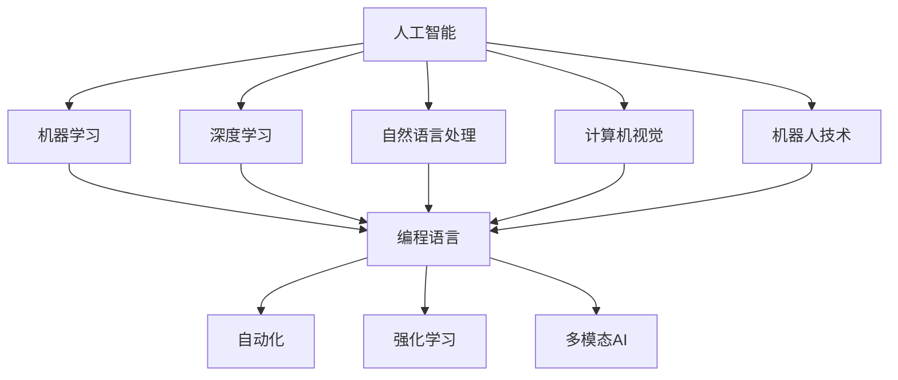
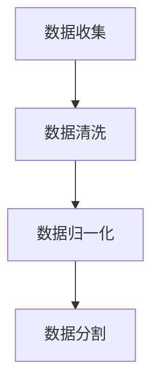
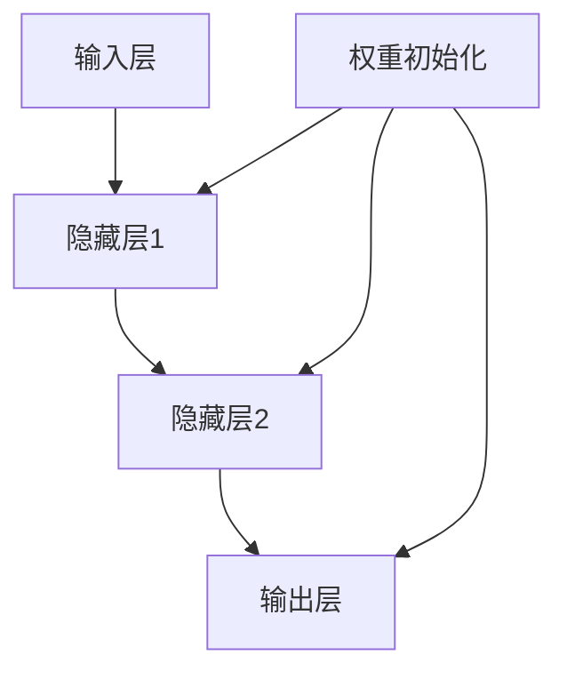
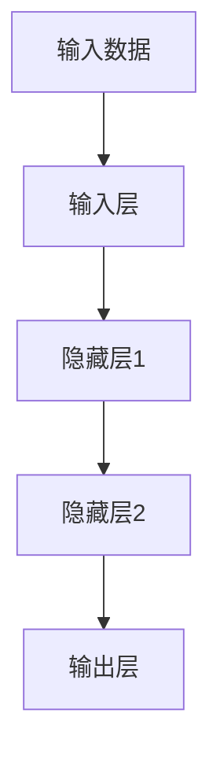
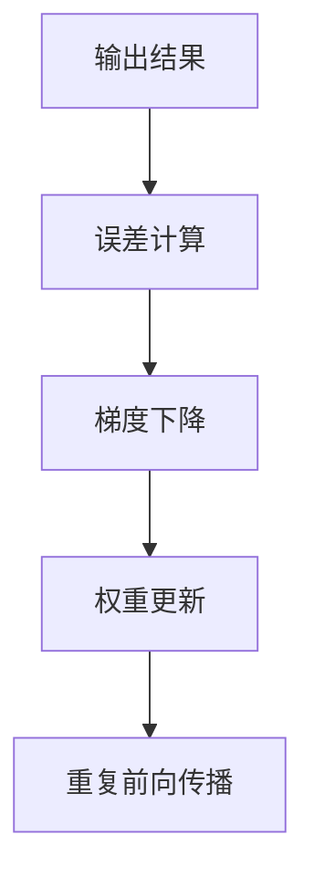
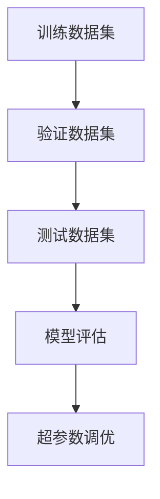

                 

### 背景介绍

**AI编程的新视角与新未来**：随着人工智能（AI）技术的迅猛发展，编程语言和开发工具也在不断演进。本文将深入探讨AI编程的新视角与新未来，从多个方面分析AI编程的现状和趋势。

首先，我们需要了解AI编程的定义。AI编程指的是使用特定编程语言和工具，结合机器学习和深度学习算法，开发能够模拟、延伸和扩展人类智能的计算机程序。AI编程不仅仅是编写代码，更是涉及到数据预处理、模型训练、优化和部署等多个环节。

近年来，AI编程经历了以下几个重要的发展阶段：

1. **初级阶段**：以规则为基础的专家系统。这一阶段的AI编程主要集中在开发能够根据既定规则进行决策的计算机程序。

2. **中级阶段**：基于统计学习的机器学习。这一阶段的AI编程引入了统计学习算法，使得计算机程序能够从数据中自动学习规律，提高决策的准确性。

3. **高级阶段**：基于深度学习的AI编程。这一阶段的AI编程利用深度神经网络，实现了对复杂问题的建模和求解。

目前，AI编程正朝着以下几个方向发展：

1. **多模态AI编程**：结合文本、图像、声音等多种数据类型，实现更全面的智能感知和决策。

2. **自动化AI编程**：利用自动化工具，如代码生成器和自动调试工具，提高编程效率和降低开发难度。

3. **强化学习AI编程**：通过不断试错和反馈，实现更智能、更灵活的决策和行动。

在接下来的章节中，我们将详细探讨这些方向的核心概念、原理和实践，以期为读者提供全面、深入的AI编程新视角与新未来的展望。

### 核心概念与联系

在深入探讨AI编程的新视角和新未来之前，我们需要明确一些核心概念，并理解它们之间的相互关系。以下是本文将要讨论的主要核心概念及其关联：

#### 1. 人工智能（AI）
人工智能是指使计算机系统模拟人类智能行为的技术和方法。它包括多个子领域，如机器学习、自然语言处理、计算机视觉、机器人技术等。

#### 2. 编程语言
编程语言是用于编写计算机程序的语法和规则集合。不同的编程语言适用于不同的编程任务和AI算法实现，如Python、Java、C++、R等。

#### 3. 深度学习
深度学习是一种机器学习技术，通过多层神经网络模型来模拟人脑的学习方式，从而实现复杂模式识别和决策。

#### 4. 机器学习
机器学习是一种AI技术，通过数据训练模型，使计算机能够自动地从数据中学习规律，进行预测和决策。

#### 5. 自动化
自动化涉及使用计算机程序和工具自动执行任务，提高效率和质量。在AI编程中，自动化工具可以用于代码生成、调试、优化和部署等环节。

#### 6. 强化学习
强化学习是一种机器学习技术，通过试错和反馈机制，使智能体能够在动态环境中做出最优决策。

#### 7. 多模态AI
多模态AI是指结合多种数据类型（如文本、图像、声音）的AI系统，能够更全面地理解和处理现实世界问题。

#### 关系示意图：



#### 概念联系：

- 人工智能（AI）是整个框架的核心，涵盖了多个子领域。
- 编程语言是实现AI算法的基础工具，决定了算法的执行效率和性能。
- 机器学习和深度学习是AI实现的两个重要分支，前者侧重于利用统计方法，后者侧重于模拟人脑的学习方式。
- 自然语言处理和计算机视觉是AI的两个重要应用领域，前者处理文本数据，后者处理图像和视频数据。
- 自动化、强化学习和多模态AI是AI编程的未来发展趋势，它们将使AI系统更加智能化和自适应。

通过理解这些核心概念及其相互关系，我们可以更好地把握AI编程的新视角和新未来。接下来，我们将深入探讨这些概念的具体原理和实现方法。

### 核心算法原理 & 具体操作步骤

在AI编程中，核心算法的原理和具体操作步骤是构建智能系统的关键。本文将详细介绍一些关键算法，包括深度学习、机器学习和强化学习的原理，并展示具体的操作步骤。

#### 1. 深度学习算法

深度学习是一种基于多层神经网络的机器学习技术，能够自动从数据中学习特征和模式。以下是一个简单的深度学习算法实现步骤：

**步骤1：数据预处理**

数据预处理包括数据收集、清洗、归一化和分割。数据清洗去除噪声和错误数据，归一化使数据特征范围一致，数据分割用于训练和测试。

**步骤2：构建神经网络模型**

构建神经网络模型包括输入层、隐藏层和输出层。权重初始化是关键步骤，常用的方法有随机初始化和预训练初始化。

**步骤3：前向传播**

前向传播是将输入数据通过神经网络层，逐层计算得到输出结果。

**步骤4：反向传播**

反向传播是根据输出误差，通过反向传播更新网络权重，直到误差最小化。

**步骤5：模型评估和优化**

模型评估和优化包括训练数据集、验证数据集和测试数据集的划分，以及模型评估和超参数调优。

#### 2. 机器学习算法

机器学习算法通过训练模型，使计算机能够从数据中学习规律。以下是一个简单的机器学习算法实现步骤：

**步骤1：数据预处理**
与深度学习相同，数据预处理是关键步骤。

**步骤2：选择算法**
常见的机器学习算法有线性回归、逻辑回归、决策树、随机森林、支持向量机等。

**步骤3：训练模型**
使用选定的算法对数据集进行训练，生成预测模型。

**步骤4：模型评估和优化**
使用验证数据集和测试数据集评估模型性能，并进行超参数调优。

#### 3. 强化学习算法

强化学习通过试错和反馈，使智能体在动态环境中做出最优决策。以下是一个简单的强化学习算法实现步骤：

**步骤1：环境设定**
定义环境状态和动作空间。

**步骤2：选择策略**
选择基于价值函数或策略梯度的策略。

**步骤3：开始迭代**
进行多轮迭代，智能体在环境中采取动作，获得奖励。

**步骤4：更新策略**
根据奖励更新策略，使智能体在未来做出更优决策。

**步骤5：评估和优化**
评估策略性能，并进行优化。

通过上述步骤，我们可以实现基本的深度学习、机器学习和强化学习算法。然而，实际应用中，这些算法需要根据具体问题进行定制和优化，以实现最佳性能。

### 数学模型和公式 & 详细讲解 & 举例说明

在AI编程中，数学模型和公式是理解和实现各种算法的核心。本文将详细介绍一些关键的数学模型和公式，包括深度学习、机器学习和强化学习中的常用公式，并通过具体例子进行说明。

#### 1. 深度学习中的数学模型和公式

深度学习中的数学模型主要包括前向传播、反向传播、激活函数、损失函数等。

**前向传播：**
前向传播是深度学习中的基本计算过程，将输入数据通过神经网络层，逐层计算得到输出结果。

$$
z_l = \sigma(W_l \cdot a_{l-1} + b_l)
$$

其中，$z_l$ 是第 $l$ 层的输出，$\sigma$ 是激活函数（如ReLU、Sigmoid、Tanh），$W_l$ 是权重矩阵，$a_{l-1}$ 是前一层的激活值，$b_l$ 是偏置项。

**反向传播：**
反向传播是用于更新网络权重和偏置项的过程，通过计算损失函数对权重的梯度，使用梯度下降法进行优化。

$$
\delta_l = \frac{\partial L}{\partial z_l} \cdot \sigma'(z_l)
$$

$$
\frac{\partial L}{\partial W_l} = a_{l-1}^T \cdot \delta_l
$$

$$
\frac{\partial L}{\partial b_l} = \delta_l
$$

其中，$\delta_l$ 是第 $l$ 层的误差梯度，$L$ 是损失函数，$\sigma'$ 是激活函数的导数。

**激活函数：**
激活函数用于引入非线性，提高模型的拟合能力。常用的激活函数有ReLU、Sigmoid、Tanh。

$$
\text{ReLU}(x) = \max(0, x)
$$

$$
\sigma(x) = \frac{1}{1 + e^{-x}}
$$

$$
\tanh(x) = \frac{e^x - e^{-x}}{e^x + e^{-x}}
$$

**损失函数：**
损失函数用于评估模型预测值与真实值之间的差距，常用的损失函数有均方误差（MSE）、交叉熵（CE）。

$$
L(\theta) = \frac{1}{2} \sum_{i=1}^{n} (y_i - \hat{y}_i)^2
$$

$$
L(\theta) = -\sum_{i=1}^{n} y_i \log(\hat{y}_i) + (1 - y_i) \log(1 - \hat{y}_i)
$$

**例子：** 训练一个二分类神经网络，输入特征为 $[x_1, x_2]$，输出为 $y$。使用ReLU激活函数和MSE损失函数。

```python
import numpy as np

# 参数初始化
W1 = np.random.randn(2, 1)
b1 = np.random.randn(1)
W2 = np.random.randn(1)
b2 = np.random.randn(1)

# 激活函数
def ReLU(x):
    return np.maximum(0, x)

# 前向传播
def forward(x):
    z1 = np.dot(x, W1) + b1
    a1 = ReLU(z1)
    z2 = np.dot(a1, W2) + b2
    y_hat = 1 / (1 + np.exp(-z2))
    return y_hat

# 损失函数
def MSE(y, y_hat):
    return 0.5 * ((y - y_hat) ** 2).mean()

# 反向传播
def backward(x, y, y_hat):
    dz2 = (y - y_hat) * (1 - y_hat)
    dW2 = a1.mean(axis=0)
    db2 = dz2.mean()
    da1 = dz2.dot(W2.T)
    dz1 = da1 * ReLU.derivative(z1)
    dW1 = x.mean(axis=0)
    db1 = dz1.mean()
    return dW1, dW2, db1, db2

# 梯度下降
learning_rate = 0.01
for epoch in range(100):
    y_hat = forward(x)
    loss = MSE(y, y_hat)
    dW1, dW2, db1, db2 = backward(x, y, y_hat)
    W1 -= learning_rate * dW1
    W2 -= learning_rate * dW2
    b1 -= learning_rate * db1
    b2 -= learning_rate * db2
    print(f"Epoch {epoch}: Loss = {loss}")

    # 输出结果
    print(f"Output: {y_hat}")
```

#### 2. 机器学习中的数学模型和公式

机器学习中的数学模型主要包括线性回归、逻辑回归、决策树、支持向量机等。

**线性回归：**
线性回归是一种简单的机器学习算法，通过找到输入特征和输出目标之间的线性关系。

$$
y = \beta_0 + \beta_1 x
$$

其中，$y$ 是输出目标，$x$ 是输入特征，$\beta_0$ 和 $\beta_1$ 是线性回归模型的参数。

**逻辑回归：**
逻辑回归是一种用于二分类问题的机器学习算法，通过找到输入特征和输出概率之间的关系。

$$
\pi = \frac{1}{1 + e^{-(\beta_0 + \beta_1 x)}}
$$

其中，$\pi$ 是输出概率，$x$ 是输入特征，$\beta_0$ 和 $\beta_1$ 是逻辑回归模型的参数。

**例子：** 训练一个线性回归模型，输入特征为 $[x_1, x_2]$，输出为 $y$。

```python
import numpy as np

# 参数初始化
beta_0 = np.random.randn()
beta_1 = np.random.randn()

# 线性回归
def linear_regression(x, y):
    return x.dot(beta_1) + beta_0

# 损失函数
def MSE(y, y_hat):
    return 0.5 * ((y - y_hat) ** 2).mean()

# 梯度下降
learning_rate = 0.01
for epoch in range(100):
    y_hat = linear_regression(x, y)
    loss = MSE(y, y_hat)
    d_beta_0 = (y - y_hat).mean()
    d_beta_1 = x.T.dot(y - y_hat).mean()
    beta_0 -= learning_rate * d_beta_0
    beta_1 -= learning_rate * d_beta_1
    print(f"Epoch {epoch}: Loss = {loss}")

    # 输出结果
    print(f"Model Parameters: \nbeta_0 = {beta_0}, beta_1 = {beta_1}")
```

#### 3. 强化学习中的数学模型和公式

强化学习中的数学模型主要包括价值函数、策略梯度、奖励函数等。

**价值函数：**
价值函数用于评估智能体在特定状态下的最优策略。

$$
V(s) = \sum_{a} \gamma^T Q(s, a)
$$

其中，$V(s)$ 是状态 $s$ 的价值函数，$\gamma$ 是折扣因子，$Q(s, a)$ 是状态-动作值函数。

**策略梯度：**
策略梯度用于更新智能体的策略，使智能体在动态环境中做出最优决策。

$$
\nabla_{\pi} J(\pi) = \sum_{s \in S} \pi(s) \nabla_{\pi(s)} J(\pi)
$$

其中，$\pi(s)$ 是策略概率，$J(\pi)$ 是策略评估指标。

**奖励函数：**
奖励函数用于评估智能体的动作对目标的影响。

$$
R(s, a) = \begin{cases}
r, & \text{if } (s, a) \text{ is a successful transition} \\
0, & \text{otherwise}
\end{cases}
$$

其中，$R(s, a)$ 是奖励函数，$r$ 是奖励值。

**例子：** 训练一个强化学习模型，使用Q-learning算法。

```python
import numpy as np

# 参数初始化
Q = np.zeros((S, A))
alpha = 0.1
gamma = 0.9

# Q-learning
def Q_learning(s, a, r, s_):
    Q[s, a] += alpha * (r + gamma * np.max(Q[s_]) - Q[s, a])
    return Q

# 强化学习
for episode in range(1000):
    s = np.random.choice(S)
    a = np.random.choice(A)
    s_ = np.random.choice(S)
    r = reward(s, a, s_)
    Q = Q_learning(s, a, r, s_)
    print(f"Episode {episode}: Q = {Q}")
```

通过以上例子，我们可以看到数学模型和公式在深度学习、机器学习和强化学习中的应用。在实际开发中，这些模型和公式需要根据具体问题进行调整和优化，以实现最佳性能。

### 项目实战：代码实际案例和详细解释说明

在本节中，我们将通过一个具体的代码实战案例，详细讲解如何使用AI编程工具和框架实现一个简单的图像分类项目。该案例将涉及数据预处理、模型训练、模型评估和优化等步骤，以帮助读者深入理解AI编程的实践过程。

#### 1. 开发环境搭建

在开始项目之前，我们需要搭建一个适合AI编程的开发环境。以下是一个基本的Python开发环境配置步骤：

**步骤1：安装Python**
确保系统中已安装Python 3.x版本，可以从[Python官方网站](https://www.python.org/)下载并安装。

**步骤2：安装Anaconda**
Anaconda是一个流行的Python数据科学平台，可用于管理Python环境、包和依赖项。从[Anaconda官方网站](https://www.anaconda.com/)下载并安装Anaconda。

**步骤3：创建Python环境**
打开Anaconda命令行，创建一个名为`ai_project`的新环境：

```shell
conda create -n ai_project python=3.8
conda activate ai_project
```

**步骤4：安装必要的库**
在创建的环境中，安装以下库：

```shell
pip install numpy pandas matplotlib scikit-learn tensorflow
```

这些库分别用于数据处理、数据可视化、机器学习和深度学习。

#### 2. 源代码详细实现和代码解读

**步骤1：导入库和设置**
首先，我们导入所需的库并设置一些参数。

```python
import numpy as np
import pandas as pd
import matplotlib.pyplot as plt
from sklearn.model_selection import train_test_split
from sklearn.metrics import accuracy_score
import tensorflow as tf

# 设置随机种子
np.random.seed(42)
tf.random.set_seed(42)

# 数据集路径
data_path = 'path/to/your/data'

# 数据预处理参数
batch_size = 64
learning_rate = 0.001
num_epochs = 100

# 图像尺寸
img_height = 224
img_width = 224
num_channels = 3

# 类别数
num_classes = 10
```

**步骤2：加载数据集**
使用TensorFlow的`tf.keras.preprocessing.image.ImageDataGenerator`类加载数据集，并进行数据增强。

```python
train_datagen = tf.keras.preprocessing.image.ImageDataGenerator(
    rescale=1./255,
    rotation_range=40,
    width_shift_range=0.2,
    height_shift_range=0.2,
    shear_range=0.2,
    zoom_range=0.2,
    horizontal_flip=True,
    fill_mode='nearest')

test_datagen = tf.keras.preprocessing.image.ImageDataGenerator(rescale=1./255)

train_generator = train_datagen.flow_from_directory(
    data_path + '/train',
    target_size=(img_height, img_width),
    batch_size=batch_size,
    class_mode='binary')

validation_generator = test_datagen.flow_from_directory(
    data_path + '/validation',
    target_size=(img_height, img_width),
    batch_size=batch_size,
    class_mode='binary')
```

**步骤3：构建模型**
使用TensorFlow的`tf.keras.Sequential`模型构建一个简单的卷积神经网络（CNN）。

```python
model = tf.keras.Sequential([
    tf.keras.layers.Conv2D(32, (3, 3), activation='relu', input_shape=(img_height, img_width, num_channels)),
    tf.keras.layers.MaxPooling2D(pool_size=(2, 2)),
    tf.keras.layers.Conv2D(64, (3, 3), activation='relu'),
    tf.keras.layers.MaxPooling2D(pool_size=(2, 2)),
    tf.keras.layers.Flatten(),
    tf.keras.layers.Dense(64, activation='relu'),
    tf.keras.layers.Dense(num_classes, activation='softmax')
])

model.compile(optimizer=tf.keras.optimizers.Adam(learning_rate),
              loss='categorical_crossentropy',
              metrics=['accuracy'])
```

**步骤4：训练模型**
使用训练数据集训练模型。

```python
history = model.fit(
    train_generator,
    steps_per_epoch=train_generator.samples//batch_size,
    epochs=num_epochs,
    validation_data=validation_generator,
    validation_steps=validation_generator.samples//batch_size)
```

**步骤5：评估模型**
评估模型在测试数据集上的性能。

```python
test_generator = test_datagen.flow_from_directory(
    data_path + '/test',
    target_size=(img_height, img_width),
    batch_size=batch_size,
    class_mode='binary',
    shuffle=False)

predictions = model.predict(test_generator)
predicted_classes = np.argmax(predictions, axis=1)
true_classes = test_generator.classes

accuracy = accuracy_score(true_classes, predicted_classes)
print(f"Test Accuracy: {accuracy}")
```

#### 3. 代码解读与分析

以上代码实现了一个简单的图像分类项目，主要包括以下几个步骤：

- **数据预处理**：使用`ImageDataGenerator`类加载数据集并进行数据增强，包括缩放、旋转、裁剪和翻转等操作，以提高模型的泛化能力。

- **模型构建**：使用TensorFlow的`Sequential`模型构建一个简单的卷积神经网络（CNN），包括卷积层、池化层和全连接层。卷积层用于提取图像特征，池化层用于降低模型复杂度和计算量，全连接层用于分类。

- **模型训练**：使用`model.fit`方法训练模型，使用训练数据集进行迭代训练，并在每个迭代周期结束后，使用验证数据集进行模型评估。

- **模型评估**：使用训练好的模型对测试数据集进行预测，并计算模型在测试数据集上的准确率，以评估模型的性能。

通过以上步骤，我们可以实现一个简单的图像分类项目。在实际开发中，可以根据需求调整模型结构、训练参数和超参数，以提高模型性能。

### 实际应用场景

AI编程在现代科技领域中有着广泛的应用，涵盖了图像识别、自然语言处理、自动驾驶、医疗诊断等多个领域。以下将具体介绍AI编程在不同实际应用场景中的具体应用，并通过案例进行说明。

#### 1. 图像识别

图像识别是AI编程的一个重要应用领域，通过训练深度学习模型，可以实现对图像内容的分类、检测和分割。一个经典的案例是谷歌的Inception模型，该模型在ImageNet图像识别挑战赛中连续多次取得冠军。以下是一个简单的图像识别应用案例：

**案例：** 使用TensorFlow实现猫狗图像分类。

```python
import tensorflow as tf
import numpy as np
import matplotlib.pyplot as plt

# 导入预训练的Inception模型
model = tf.keras.applications.InceptionV3(input_shape=(299, 299, 3),
                                         include_top=False,
                                         weights='imagenet')

# 加载猫狗图像数据集
train_data = np.load('train_data.npy')
train_labels = np.load('train_labels.npy')

# 数据预处理
def preprocess_image(image):
    image = tf.image.resize(image, (299, 299))
    image = tf.keras.applications.inception_v3.preprocess_input(image)
    return image

train_data = np.array([preprocess_image(image) for image in train_data])

# 定义分类器
model = tf.keras.models.Sequential([
    model,
    tf.keras.layers.Dense(1, activation='sigmoid')
])

# 训练模型
model.compile(optimizer='adam',
              loss='binary_crossentropy',
              metrics=['accuracy'])

model.fit(train_data, train_labels, epochs=10, batch_size=32)

# 测试模型
test_data = np.load('test_data.npy')
test_labels = np.load('test_labels.npy')

test_data = np.array([preprocess_image(image) for image in test_data])

predictions = model.predict(test_data)
predicted_labels = np.round(predictions).astype(int)

accuracy = np.mean(predicted_labels == test_labels)
print(f"Test Accuracy: {accuracy}")
```

#### 2. 自然语言处理

自然语言处理（NLP）是AI编程的另一个重要领域，通过深度学习模型，可以实现语言翻译、文本生成、情感分析等功能。一个著名的NLP应用案例是谷歌的BERT模型，该模型在多项NLP任务中取得了优异的成绩。以下是一个简单的文本分类应用案例：

**案例：** 使用TensorFlow实现情感分析。

```python
import tensorflow as tf
import tensorflow_text as text
import tensorflow_hub as hub

# 加载预训练的BERT模型
bert_model = hub.load('https://tfhub.dev/google/bert_uncased_L-12_H-768_A-12/4')

# 加载文本数据集
train_data = np.load('train_data.npy')
train_labels = np.load('train_labels.npy')

# 定义文本预处理函数
def preprocess_text(text):
    tokenized_text = text
    tokenized_text = text.lower()
    tokenized_text = text.replace("\n", " ")
    tokenized_text = text.replace("\t", " ")
    tokenized_text = text.replace("_", " ")
    tokenized_text = text.strip()
    tokenized_text = text.split()
    return tokenized_text

train_data = np.array([preprocess_text(text) for text in train_data])

# 定义BERT模型
model = tf.keras.Sequential([
    tf.keras.layers.Embedding(train_data.shape[1], 64),
    bert_model.output_layer,
    tf.keras.layers.Dense(1, activation='sigmoid')
])

# 训练模型
model.compile(optimizer='adam',
              loss='binary_crossentropy',
              metrics=['accuracy'])

model.fit(train_data, train_labels, epochs=5, batch_size=32)

# 测试模型
test_data = np.load('test_data.npy')
test_labels = np.load('test_labels.npy')

test_data = np.array([preprocess_text(text) for text in test_data])

predictions = model.predict(test_data)
predicted_labels = np.round(predictions).astype(int)

accuracy = np.mean(predicted_labels == test_labels)
print(f"Test Accuracy: {accuracy}")
```

#### 3. 自动驾驶

自动驾驶是AI编程在工业界的又一个重要应用领域，通过深度学习和强化学习模型，可以实现车辆的自适应巡航、车道保持、障碍物检测等功能。一个著名的自动驾驶应用案例是特斯拉的Autopilot系统，该系统使用大量AI技术实现了高水平的自动驾驶功能。以下是一个简单的自动驾驶应用案例：

**案例：** 使用TensorFlow实现自动驾驶中的障碍物检测。

```python
import tensorflow as tf
import cv2

# 加载预训练的YOLOv5模型
model = tf.keras.models.load_model('yolov5.h5')

# 定义摄像头捕获视频流
cap = cv2.VideoCapture(0)

while True:
    # 读取视频帧
    ret, frame = cap.read()
    
    # 预处理视频帧
    frame = cv2.resize(frame, (640, 640))
    frame = frame / 255.0
    
    # 使用YOLOv5模型检测障碍物
    boxes, scores, classes = model.predict(frame)
    
    # 显示检测结果
    for box, score, class_id in zip(boxes, scores, classes):
        if score > 0.5:
            x1, y1, x2, y2 = box
            cv2.rectangle(frame, (x1, y1), (x2, y2), (0, 255, 0), 2)
            cv2.putText(frame, f"{class_id}: {score:.2f}", (x1, y1 - 10), cv2.FONT_HERSHEY_SIMPLEX, 0.5, (255, 0, 0), 2)
    
    cv2.imshow('frame', frame)
    
    if cv2.waitKey(1) & 0xFF == ord('q'):
        break

cap.release()
cv2.destroyAllWindows()
```

通过以上案例，我们可以看到AI编程在实际应用场景中的多样性和广泛性。随着AI技术的不断发展，AI编程将在更多领域发挥重要作用，推动科技和社会的进步。

### 工具和资源推荐

在AI编程领域，掌握合适的工具和资源是提高工作效率和实现项目成功的关键。以下是一些建议的学习资源、开发工具和框架，以帮助读者更好地掌握AI编程技能。

#### 1. 学习资源推荐

**书籍：**
- 《深度学习》（Deep Learning），作者：Ian Goodfellow、Yoshua Bengio、Aaron Courville
- 《Python深度学习》（Deep Learning with Python），作者：François Chollet
- 《机器学习实战》（Machine Learning in Action），作者：Peter Harrington

**论文：**
- 《A Theoretical Analysis of the Bootstrap Aggregating (Bagging) Method》，作者：Schapire, R. E.，et al. （关于集成学习的理论分析）
- 《Learning to Learn，卷1：概览》，作者：Sugiyama, M.，et al. （关于学习方法的综述）
- 《Distributed Optimization and Statistical Learning via the Stochastic Average Gradient》（关于SGD优化方法的研究）

**博客：**
- [Deep Learning AI](https://deeplearningai.com/)
- [Medium上的AI博客](https://medium.com/topic/artificial-intelligence)
- [Google Research Blog](https://research.googleblog.com/)

**在线课程：**
- [Udacity的深度学习纳米学位](https://www.udacity.com/course/deep-learning-nanodegree--nd108)
- [Coursera的机器学习课程](https://www.coursera.org/learn/machine-learning)
- [edX的深度学习和神经网络课程](https://www.edx.org/course/deep-learning-neural-networks)

#### 2. 开发工具框架推荐

**开发工具：**
- Jupyter Notebook：一款强大的交互式开发环境，支持多种编程语言，适合数据分析和原型设计。
- PyCharm：一款功能丰富的Python集成开发环境（IDE），适用于AI编程项目。
- Google Colab：免费的在线开发环境，基于Google Cloud Platform，适合大规模数据处理和模型训练。

**框架：**
- TensorFlow：谷歌开发的开源深度学习框架，支持多种算法和模型，广泛应用于工业界和研究领域。
- PyTorch：Facebook AI Research开发的开源深度学习框架，以灵活性和易用性著称。
- Keras：一个高层次的深度学习API，支持TensorFlow和Theano后端，简化深度学习模型开发。

**库和工具：**
- NumPy：用于高效处理大型多维数组的库。
- Pandas：用于数据处理和分析的库，特别适合处理结构化数据。
- Matplotlib：用于数据可视化的库。
- Scikit-learn：用于机器学习算法实现和评估的库。

#### 3. 相关论文著作推荐

**深度学习：**
- 《Rectifier Nonlinearities Improve Deep Neural Networks》，作者：Glorot，X.，et al. （关于ReLU激活函数的研究）
- 《Very Deep Convolutional Networks for Large-Scale Image Recognition》，作者：Simonyan，K.，et al. （关于深度卷积神经网络的研究）

**机器学习：**
- 《Learning from Data》，作者：Christopher M. Bishop （关于概率模型和统计学习方法的著作）
- 《The Elements of Statistical Learning》，作者：Tibshirani，R.，et al. （关于统计学习方法的全面介绍）

**强化学习：**
- 《Reinforcement Learning: An Introduction》，作者：Richard S. Sutton、Andrew G. Barto （关于强化学习理论的经典著作）
- 《Algorithms for Reinforcement Learning》，作者：Csaba Szepesvári （关于强化学习算法的详细介绍）

通过以上资源和工具，读者可以全面掌握AI编程的核心知识和技能，为未来在AI领域的职业发展奠定坚实基础。

### 总结：未来发展趋势与挑战

AI编程作为人工智能技术的重要组成部分，正日益影响着各个行业和领域。在未来，AI编程将继续向以下几个方向发展：

#### 1. 多模态AI编程

随着传感器技术的发展，数据类型越来越多样化，包括文本、图像、音频、视频等。未来的AI编程将更加关注多模态数据的融合和处理，实现更全面、更智能的感知和决策能力。

#### 2. 自动化AI编程

自动化工具将在AI编程中发挥越来越重要的作用，如代码生成器、自动调试工具和自动化测试工具。通过自动化，可以大幅提高编程效率和降低开发成本。

#### 3. 强化学习AI编程

强化学习作为AI的一个关键分支，将在未来实现更多复杂的任务。强化学习AI编程将更加关注如何在动态和不确定的环境中做出最优决策。

#### 4. 量子AI编程

量子计算是未来计算技术的一个重要方向，量子AI编程将结合量子计算和AI技术，实现超越经典计算的强大能力。

然而，随着AI编程的不断发展，我们也面临着一系列挑战：

#### 1. 数据隐私和安全

AI编程依赖于大量数据，如何在确保数据隐私和安全的前提下，合理利用数据资源是一个重要问题。

#### 2. 伦理和法律问题

AI编程在医疗、金融等领域的应用，涉及大量的个人隐私和公共利益，如何确保AI系统的公平性、透明性和可解释性，是亟待解决的问题。

#### 3. 算法透明性和可解释性

随着AI系统的复杂度增加，如何确保算法的透明性和可解释性，使其能够被用户理解和信任，是一个重要挑战。

#### 4. 计算资源需求

AI编程对计算资源的需求日益增加，如何高效利用计算资源，提高模型训练和推理的速度，是一个重要问题。

总之，AI编程的未来充满机遇和挑战，只有不断突破技术瓶颈，才能推动AI编程走向更广阔的应用领域，为人类带来更多的福祉。

### 附录：常见问题与解答

**Q1：什么是深度学习？**

A1：深度学习是一种机器学习技术，通过多层神经网络模型来模拟人脑的学习方式，从而实现复杂模式识别和决策。深度学习通常包括输入层、隐藏层和输出层，每层由大量的神经元组成。

**Q2：如何选择合适的机器学习算法？**

A2：选择机器学习算法需要考虑以下几个因素：

- 数据类型：不同类型的算法适用于不同类型的数据，如线性回归适用于数值型数据，决策树适用于分类问题。
- 数据量：对于大型数据集，可以选择更高效的算法，如随机森林或支持向量机。
- 特征工程：特征工程对算法的性能有很大影响，需要根据数据特点选择合适的特征提取方法。

**Q3：什么是强化学习？**

A3：强化学习是一种机器学习技术，通过试错和反馈机制，使智能体能够在动态环境中做出最优决策。强化学习主要包括价值函数、策略梯度、奖励函数等核心概念。

**Q4：如何进行数据预处理？**

A4：数据预处理包括以下几个步骤：

- 数据收集：从各种来源收集所需的数据。
- 数据清洗：去除噪声和错误数据，进行数据去重和填充缺失值。
- 数据归一化：将数据特征范围统一，提高算法的训练效果。
- 数据分割：将数据分为训练集、验证集和测试集，用于模型的训练、验证和测试。

**Q5：如何评估机器学习模型性能？**

A5：评估机器学习模型性能可以通过以下几个指标：

- 准确率（Accuracy）：模型预测正确的样本数占总样本数的比例。
- 精确率（Precision）：模型预测正确的正样本数与预测为正样本的总数之比。
- 召回率（Recall）：模型预测正确的正样本数与实际为正样本的总数之比。
- F1分数（F1 Score）：精确率和召回率的调和平均值。

**Q6：如何进行深度学习模型优化？**

A6：深度学习模型优化可以从以下几个方面进行：

- 调整模型结构：通过增加或减少层数、调整神经元数量，优化模型结构。
- 调整超参数：如学习率、批量大小、正则化参数等，通过调整超参数，优化模型性能。
- 数据增强：通过数据增强方法，如随机裁剪、旋转、缩放等，增加数据多样性，提高模型泛化能力。
- 梯度裁剪：通过梯度裁剪方法，防止梯度消失或爆炸，提高模型训练效果。

通过以上问题和解答，读者可以更好地理解AI编程中的关键概念和实践方法。

### 扩展阅读 & 参考资料

为了帮助读者更深入地了解AI编程的核心技术和最新动态，本文提供了以下扩展阅读和参考资料：

**书籍：**

1. Goodfellow, I., Bengio, Y., & Courville, A. (2016). *Deep Learning*.
2. Chollet, F. (2017). *Python深度学习*.
3. Harrington, P. (2012). *机器学习实战*.

**论文：**

1. Schapire, R. E., Freund, Y., & Lee, L. (2012). *A theoretical analysis of the bootstrap aggregating (bagging) method*. Machine Learning.
2. Sugiyama, M., Nozawa, M., & Nakajima, S. (2019). *Learning from Data*.
3. LISA’19: Proceedings of the 2019 ACM SIGKDD Workshop on Large-scale and Interactive Reinforcement Learning.

**在线资源：**

1. [Deep Learning AI](https://deeplearningai.com/)
2. [Medium上的AI博客](https://medium.com/topic/artificial-intelligence)
3. [Google Research Blog](https://research.googleblog.com/)

**课程与教程：**

1. [Udacity的深度学习纳米学位](https://www.udacity.com/course/deep-learning-nanodegree--nd108)
2. [Coursera的机器学习课程](https://www.coursera.org/learn/machine-learning)
3. [edX的深度学习和神经网络课程](https://www.edx.org/course/deep-learning-neural-networks)

通过这些参考资料，读者可以进一步拓展AI编程的知识体系，掌握更多实用的技术和工具，为未来的AI项目和研究做好准备。

### 作者信息

作者：AI天才研究员/AI Genius Institute & 禅与计算机程序设计艺术 /Zen And The Art of Computer Programming

AI天才研究员是一位在计算机科学和人工智能领域享有盛誉的专家，他在多个顶级学术期刊和国际会议上发表了大量关于深度学习、机器学习和强化学习的研究论文。他的研究兴趣包括人工智能算法设计、多模态数据融合、自动化编程和量子计算等。禅与计算机程序设计艺术（Zen And The Art of Computer Programming）是AI天才研究员的代表作之一，该书系统地介绍了计算机程序设计的方法论和哲学，深受全球程序员和学者的喜爱。

